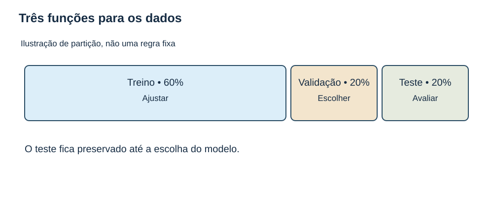
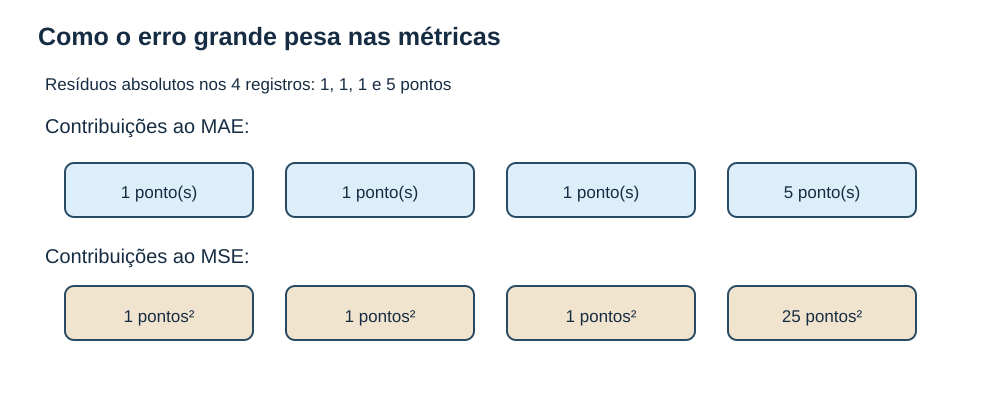
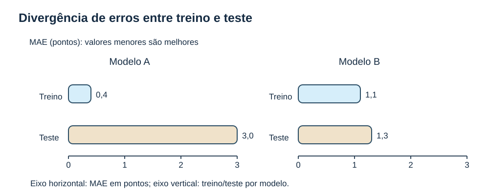
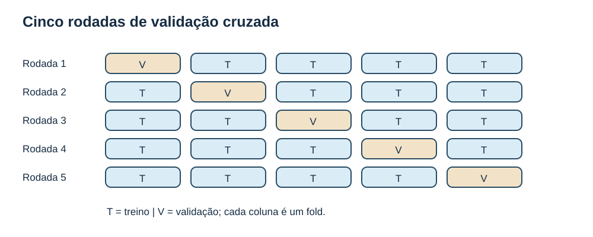
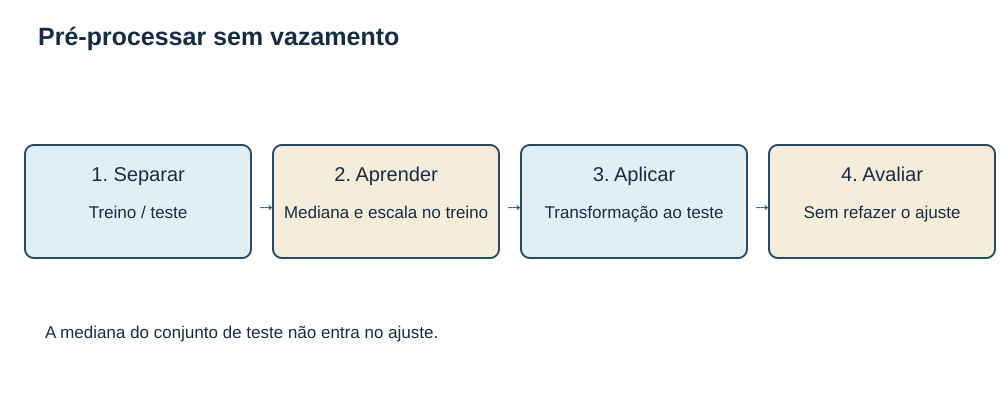
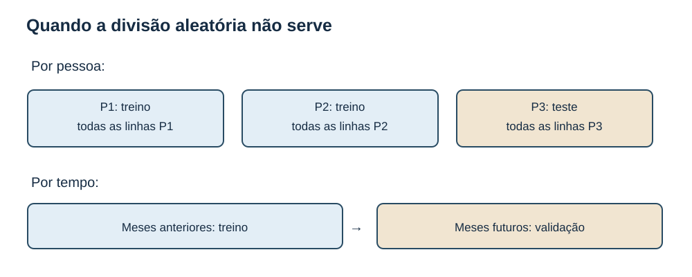
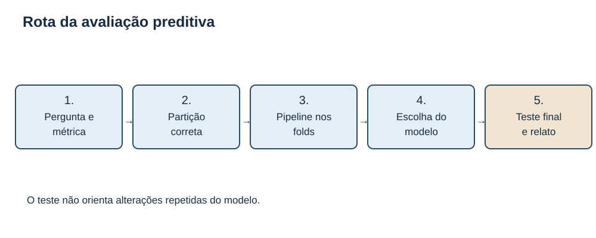

# MAT-EST-031 — Validação de modelos e desempenho preditivo: amostras de treino e teste, validação cruzada e prevenção de sobreajuste

**Nota editorial:** aula autoral e independente, em continuidade a MAT-EST-030. Números, casos e 36 questões são fictícios e didáticos. O formalismo de validação preditiva é aprofundamento e ponte universitária, sem alegação de cobrança literal em ENEM, FUVEST, UNICAMP e UNESP. Nenhuma tentativa individual ou consolidação é criada. MAT-EST-018, MAT-PRO-039 e MAT-PRO-054 permanecem pendentes de resolução individual.

## 1. Objetivo, pré-requisitos e blocos de estudo

Ao concluir o estudo, você deverá saber separar ajuste, seleção e teste final; calcular erro absoluto médio (MAE), erro quadrático médio (MSE) e raiz do erro quadrático médio (RMSE); interpretar R² fora da amostra; realizar conceitualmente K-fold; reconhecer sobreajuste, vazamento de dados e avaliação incorreta de séries temporais ou registros repetidos; e relatar limites de generalização sem confundir boa previsão com causalidade.

Revisão necessária: resíduos e regressão simples (MAT-EST-026/027), regressão múltipla e indicadores (MAT-EST-028/029), seleção interna de modelos (MAT-EST-030), inferência e incerteza (MAT-EST-019 a 022). Se houver dificuldade em uma fórmula, recupere o fundamento antes de prosseguir.

**Blocos sugeridos:** 30–40 minutos para a intuição e separação; 35–50 minutos para métricas e exemplos; 25–40 minutos para validação cruzada; 30–45 minutos para vazamento e protocolos; 30–50 minutos para os exercícios de cada etapa. Faça o reteste em sessão posterior.

## 2. Por que não basta ajustar bem?

No MAT-EST-030 comparamos modelos no mesmo conjunto fictício de doze registros. Acrescentar parâmetros em mínimos quadrados ordinários, na mesma base e sem penalização, nunca aumenta a soma de quadrados residuais do treino, pois o modelo anterior permanece disponível como caso especial. Isso não significa previsão melhor em registros ainda não observados. Quanto maior a flexibilidade, maior a possibilidade de ajustar particularidades e ruído daquele conjunto.

**Generalização** significa conservar capacidade de prever em novos dados provenientes do contexto de aplicação. Um modelo que memoriza informações específicas da amostra pode exibir erro de treino muito pequeno e erro futuro elevado: esse comportamento é chamado de **sobreajuste**, ou *overfitting*. Um modelo simples demais pode não representar uma estrutura importante: chamamos isso de subajuste, ou *underfitting*. Não existe relação universal e fixa entre complexidade e desempenho: é preciso medir sob desenho de avaliação correto.

*Figura 1 — Funções distintas das partições. Observe que treino ajusta parâmetros, validação orienta escolhas e teste final avalia o procedimento selecionado. O exemplo 60%, 20% e 20% é apenas ilustrativo, não um padrão obrigatório.*

## 3. Treino, validação e teste: três perguntas, três funções

**Treino:** dados em que os coeficientes e transformações são aprendidos. **Validação:** dados não usados para ajustar o candidato naquela rodada e usados para comparar especificações ou hiperparâmetros. **Teste final:** dados preservados até que o procedimento esteja definido, usados para uma avaliação mais independente. Pode existir um conjunto de treino e validação cruzada dentro dele, sem precisar de uma divisão tripla fixa.

A proporção de divisão varia com quantidade e estrutura dos dados, objetivo, dependência temporal, grupos e incerteza aceitável. Conservar 20% para teste não é obrigação matemática. Nenhuma proporção conserta amostragem enviesada: dados de um único contexto não demonstram, por si, transporte para outros contextos.

**Exemplo passo a passo:** em 125 observações hipoteticamente independentes, separe 25 como teste final. Com 100 registros de desenvolvimento, faça validação cruzada de cinco partes iguais: em cada rodada, 80 treinam e 20 validam. Cada uma das cem observações participa uma vez da validação. Selecione o procedimento pelas medidas de validação, reajuste-o em todos os cem registros de desenvolvimento e somente então avalie as 25 observações preservadas. A etapa de teste não deve ser usada repetidamente para retocar parâmetros até conseguir um resultado conveniente.

## 4. Medir erros de previsão e conservar as unidades

Se o valor observado é `y` e a previsão é `ŷ` (leitura: ípsilon chapéu), o **erro de previsão** é `e = y − ŷ`, isto é, observado menos previsto. Para `n` previsões, temos:

- `MAE = (Σ |eᵢ|)/n`: erro absoluto médio. Leitura: somatório dos módulos dos erros dividido pelo número de observações. Unidade igual à da resposta.
- `MSE = (Σ eᵢ²)/n`: erro quadrático médio. Leitura: somatório dos quadrados dos erros dividido pela quantidade de observações. Unidade da resposta ao quadrado.
- `RMSE = √MSE`: raiz quadrada do erro quadrático médio. Retorna à unidade da resposta e atribui maior peso a erros grandes do que o MAE.

Essas métricas não devem ser comparadas numericamente entre bases com unidades ou escalas diferentes como se fossem equivalentes; calcule-as nas mesmas observações e com a mesma definição de alvo.

**Exemplo resolvido:** valores observados de um teste: 10, 12, 14 e 16 pontos. O modelo A prevê 11, 11, 15 e 15. Seus erros são −1, +1, −1 e +1. MAE = 1 ponto, MSE = 1 ponto ao quadrado e RMSE = 1 ponto. O modelo B prevê 10, 13, 14 e 17. Seus erros são zero, menos um, zero e menos um. MAE = 0,5 ponto, MSE = 0,5 ponto ao quadrado e RMSE = √0,5 ≈ 0,707 ponto. B tem menor erro nas quatro observações de teste; essa comparação sozinha não garante desempenho em qualquer outra amostra.

Um erro grande pesa mais no MSE. Para valores absolutos 1, 1, 1 e 5, MAE = 2 unidades, MSE = 7 unidades ao quadrado e RMSE = √7 ≈ 2,646 unidades. A escolha da métrica depende da consequência real dos erros, e deve ocorrer antes de inspecionar os resultados.

*Figura 2 — Os quatro erros absolutos são 1, 1, 1 e 5. Suas contribuições quadráticas são 1, 1, 1 e 25. O erro de cinco unidades recebe contribuição muito maior quando elevado ao quadrado.*

### R² fora da amostra exige cuidado

Para regressão com denominador não nulo, uma convenção usual de avaliação de teste é `R²_teste = 1 − SSE_teste/SST_teste`, em que `SST_teste = Σ(yᵢ − média observada do próprio teste)²`. Leitura: um menos a razão entre a soma quadrática de erros de previsão e a soma quadrática dos desvios dos resultados do teste em relação à média observada do teste. Esse indicador **pode ser negativo**. Para os valores observados 10, 12, 14 e 16, a média do teste é 13, de modo que SST é 20. No modelo A, SSE = 4 e R² = 0,80. Se outro modelo prevê sempre 12, SSE = 24 e R² = −0,20. A previsão constante 12 era uma referência predefinida ou aprendida do treino, e não foi ajustada após observar o teste. Se todos os resultados observados do teste forem iguais, SST é zero: o R² usual nessa fórmula fica indefinido e deve ser tratado explicitamente.

## 5. Erro em treino versus erro fora do treino

Imagine MAE de treino e teste, em pontos: para o modelo A, 0,4 e 3,0; para o B, 1,1 e 1,3. A treina melhor, mas B erra menos neste teste. A lacuna pode sinalizar sobreajuste; antes de concluir, examine tamanho e representatividade do teste, variação do processo e vazamentos possíveis. Esse caso não recomenda selecionar B olhando repetidamente o teste: a escolha deveria ocorrer na validação, com um teste independente depois.

*Figura 3 — Barras dos modelos A e B. A apresenta erro de treino 0,4 e teste 3,0; B apresenta erro de treino 1,1 e teste 1,3 ponto. A hierarquia de treinamento não se repete no teste.*

## 6. Validação cruzada: rotacionar quem é avaliado

No método **K-fold**, divida o conjunto de desenvolvimento em K partes, chamadas *folds*. Em cada rodada, ajuste todos os passos que aprendem estatísticas dos dados somente nas K−1 partes de treino e avalie na parte retida. Repita K vezes, mudando a parte de validação. A média dos erros descreve desempenho no protocolo; a dispersão mostra variação entre partições, mas os folds não são estudos independentes, pois compartilham observações de treino.

**Exemplo resolvido:** MAE em cinco partes de mesmo tamanho: 2, 3, 1, 2 e 2 pontos. O MAE médio por fold é `(2+3+1+2+2)/5 = 2` pontos. Com folds desiguais, se a pergunta pede MAE agregado por observação, pondere pelo número de itens: um fold de 10 itens com MAE 1 e outro de 30 itens com MAE 3 produzem `(10×1+30×3)/40=2,5` pontos, e não 2.

Uma vez escolhido o modelo, ajustá-lo em todos os dados de desenvolvimento e consultá-lo apenas uma vez em um teste preservado ajuda a impedir seleção oportunista. Se várias configurações forem escolhidas por validação cruzada, a própria média dos folds pode tornar-se otimista para o procedimento escolhido; uma validação **aninhada** com seleção interna e avaliação externa é uma ferramenta de aprofundamento para estudar esse problema. Não confunda intervalos de confiança para parâmetros com a variabilidade das métricas de validação cruzada.

*Figura 4 — Cada linha representa uma rodada. T significa treino e V significa validação; todas as cinco partes passam uma vez pela posição V. Isso oferece múltiplas avaliações, mas não cria cinco experimentos independentes.*

## 7. Vazamento: quando a avaliação recebe informação privilegiada

**Vazamento de dados** ocorre quando informações indisponíveis no momento real de previsão entram no ajuste ou nas escolhas. É possível haver vazamento mesmo que o modelo nunca utilize diretamente a resposta da parte de teste. Por exemplo, calcular média, desvio padrão, mediana para imputar ausências ou selecionar variáveis usando todos os registros antes de dividir as partes transmite informação futura ao processo de treinamento.

**Procedimento correto:** divida antes de aprender as transformações; em cada rodada da validação cruzada, ajuste imputação, escala, seleção de variáveis e modelo somente com o treino da rodada; aplique essas transformações já aprendidas ao respectivo conjunto de validação. Depois da escolha, reajuste o procedimento em todo o conjunto de desenvolvimento, sem incluir o teste final. Um pipeline facilita essa disciplina operacional, como recomenda a documentação técnica do scikit-learn.

**Exemplo resolvido:** os valores de x no treino são 2, 4, 6 e 8, com média 5. O teste contém 10 e 12. Para centralização, use média 5 aprendida no treino: valor 10 passa a 5. Não use a média combinada 7, que incorpora estatísticas de teste no preparo do treino.

Outro vazamento é incluir uma variável cujo valor só se conheceria depois do resultado previsto: a nota final do curso não pode entrar num modelo destinado a prever aprovação no primeiro dia de aula. O problema é temporal e de concepção da pergunta, não apenas técnico.

*Figura 5 — Primeiro separe, depois aprenda as transformações só no treino e aplique-as de modo consistente à parte retida. O teste nunca é utilizado para recalcular os parâmetros de preparação.*

## 8. Independência, grupos e cronologia

O K-fold aleatório é inadequado quando divide registros fortemente relacionados entre treino e validação. Se uma pessoa possui várias medições e a finalidade é prever pessoas novas, separe **por pessoa inteira**, nunca por linha. Se o objetivo é prever o futuro, valide em meses posteriores aos meses usados no treino. Também verifique se os preditores já estariam disponíveis no instante da previsão e se existe janela de segurança necessária entre treino e avaliação.

A separação correta depende da população-alvo: prever a próxima medição das mesmas pessoas é diferente de prever pessoas inéditas. Não basta declarar “amostra independente” quando há agrupamento, repetição ou dependência temporal. Mesmo uma separação temporal pode falhar se a construção das variáveis usar, inadvertidamente, valores que só seriam conhecidos depois da data de previsão.

*Figura 6 — No painel superior, todas as linhas da pessoa P3 ficam no teste. No inferior, meses anteriores treinam e meses futuros validam. Escolha a divisão que representa o uso pretendido, sem comunicar a conclusão exclusivamente por cor.*

## 9. Como comunicar desempenho de modo responsável

Uma descrição auditável informa: finalidade e população, período e tamanho da amostra, regra de separação, transformação aprendida no treino, modelos comparados, critério fixado previamente, métrica com unidade e resultados em teste, resultados por subgrupos quando pertinentes, limitações, mudanças de distribuição e usos não validados. Acurácia de classificação pode ser enganosa se uma categoria for rara: prever todos os cem casos como negativos quando há 95 negativos e 5 positivos dá 95% de acurácia e sensibilidade zero para o grupo positivo. Uma previsão boa tampouco prova causalidade.

**Exemplo de relatório adequado:** “Na partição de teste preservada deste conjunto fictício, o modelo B apresentou MAE 0,5 ponto e RMSE aproximadamente 0,707 ponto, contra 1,0 ponto em ambas as métricas para A. Esses resultados descrevem somente estes registros; a avaliação em outra população, período ou modo de coleta exige novo estudo.”

*Figura 7 — Defina a pergunta e a métrica, faça a separação coerente, valide o pipeline, escolha o modelo e só então consulte o teste final. Registre limites e evite conclusões causais não sustentadas.*

## 10. Vocabulário, exceções e erros frequentes

**Conjunto de desenvolvimento:** dados disponíveis para treinar, comparar e escolher modelos. **Hiperparâmetro:** opção definida pelo procedimento de ajuste ou comparação, não necessariamente um coeficiente aprendido diretamente por minimização no treino. **Baseline:** regra simples de referência, ajustada sem acesso ao teste. **Sobreajuste:** padrão de bom ajuste interno sem generalização correspondente. **Vazamento:** informação indevida que alcança o processo de desenvolvimento. **Validação externa:** avaliação adicional num contexto independente ou distinta da validação interna, de acordo com finalidade e desenho.

Evite: escolher por erro de treino apenas; transformar todo o banco antes da divisão; repetir consultas ao teste; embaralhar séries temporais; misturar medições da mesma pessoa entre treino e teste ao prever pessoas inéditas; usar R² como causalidade; comparar métricas de unidades distintas; concluir que média de folds equivale a um estudo independente de toda a população; apagar pontos difíceis só porque elevam erros; confundir bom resultado agregado com desempenho homogêneo em subgrupos.

## 11. Exercícios graduais — questões autorais

As 36 questões abaixo são **originais deste projeto**, com correção prevista para exibição após a tentativa no site. O texto oferece respostas como material editorial; o site deve separar apresentação do enunciado, envio e devolutiva. Os retestes exigem sessão posterior e não foram resolvidos individualmente por Anderson.

### Camada A — aprendizagem

#### MAT-EST-031-EX-APR-01 — Erro que interessa

Por que uma SSE muito baixa calculada nos mesmos registros que ajustaram o modelo não demonstra boa previsão de observações futuras?

**Resposta esperada:** Porque mede ajuste na amostra de treino, não capacidade de generalização.

**Correção comentada:** Os coeficientes foram escolhidos para reduzir erros nesses próprios registros. Para avaliar previsão, use dados não utilizados no ajuste; distribuições futuras também precisam ser compatíveis.

**Habilidade:** ajuste versus previsão. **Erro provável:** conteúdo. Retome a definição do conceito e as hipóteses de aplicação.

#### MAT-EST-031-EX-APR-02 — Divisão simples

Um conjunto fictício de 120 registros independentes é dividido em 75% para treino e 25% para teste. Quantos registros em cada parte?

**Resposta esperada:** 90 para treino e 30 para teste.

**Correção comentada:** 120 × 0,75 = 90. 120 × 0,25 = 30; confirme que 90 + 30 = 120.

**Habilidade:** proporções na separação. **Erro provável:** cálculo. Organize valores e unidades antes de calcular; confira a divisão.

#### MAT-EST-031-EX-APR-03 — Qual é o papel da validação?

Explique a diferença entre dados usados para treinar um modelo e dados usados para escolher entre dois modelos candidatos.

**Resposta esperada:** Treino ajusta parâmetros; validação compara candidatos ou hiperparâmetros em dados não usados no respectivo ajuste.

**Correção comentada:** Ajustar coeficientes e avaliar opções são decisões diferentes. Depois da escolha, um teste preservado oferece uma avaliação final sem uso nas decisões anteriores.

**Habilidade:** função de validação. **Erro provável:** conteúdo. Retome a definição do conceito e as hipóteses de aplicação.

#### MAT-EST-031-EX-APR-04 — Erro absoluto médio

Quatro erros de previsão são −1, +1, −1 e +1 ponto. Calcule MAE.

**Resposta esperada:** 1 ponto.

**Correção comentada:** Tome os valores absolutos: 1 + 1 + 1 + 1 = 4. Divida pelo número de previsões: MAE = 4/4 = 1 ponto.

**Habilidade:** MAE. **Erro provável:** cálculo. Organize valores e unidades antes de calcular; confira a divisão.

#### MAT-EST-031-EX-APR-05 — Erro quadrático médio

Para os mesmos quatro erros −1, +1, −1 e +1 ponto, determine MSE e RMSE.

**Resposta esperada:** MSE = 1 ponto² e RMSE = 1 ponto.

**Correção comentada:** Quadrados: 1, 1, 1 e 1; média dos quadrados igual a 1 ponto². Raiz quadrada de 1 ponto² = 1 ponto.

**Habilidade:** MSE e RMSE. **Erro provável:** cálculo. Organize valores e unidades antes de calcular; confira a divisão.

#### MAT-EST-031-EX-APR-06 — Treino versus teste

O modelo A tem MAE de treino 0,4 e de teste 3,0 pontos. O modelo B tem MAE de treino 1,1 e de teste 1,3. Qual apresentou menor erro nesse teste?

**Resposta esperada:** B; seu MAE de teste foi 1,3 contra 3,0 do A.

**Correção comentada:** Compare na mesma partição de teste usando a mesma unidade e métrica. A lacuna de A sugere possível sobreajuste, mas deve-se verificar amostra, vazamento e deslocamento de distribuição.

**Habilidade:** comparação fora da amostra. **Erro provável:** interpretação. Verifique o sentido da pergunta e se o resultado é treino, validação ou teste.

#### MAT-EST-031-EX-APR-07 — Cinco partes

Em validação cruzada de cinco partes de mesmo tamanho, quantas vezes cada parte participa da validação e quantas do treino?

**Resposta esperada:** Uma vez da validação e quatro vezes do treino.

**Correção comentada:** Em cada rodada uma das cinco partes fica fora do ajuste. As outras quatro treinam; o procedimento se repete até todas terem sido validadas uma vez.

**Habilidade:** K-fold. **Erro provável:** conteúdo. Retome a definição do conceito e as hipóteses de aplicação.

#### MAT-EST-031-EX-APR-08 — Vazamento no pré-processamento

Um pesquisador calcula média e desvio padrão usando todos os registros antes de dividir treino e teste. Qual é o risco?

**Resposta esperada:** Vazamento: estatísticas do teste influenciaram a preparação do treino.

**Correção comentada:** Primeiro preserve o teste; calcule os parâmetros da transformação apenas no treino. Aplique a transformação aprendida ao teste sem refazê-la com esses registros.

**Habilidade:** vazamento de dados. **Erro provável:** estratégia. Defina primeiro a finalidade, depois a divisão dos dados e por último a métrica.

#### MAT-EST-031-EX-APR-09 — R² de teste

Com valores de teste 10, 12, 14 e 16, previsão 11, 11, 15 e 15, calcule SSE e R² de teste usando a média dos próprios valores observados no teste.

**Resposta esperada:** SSE = 4; SST = 20; R² = 0,80.

**Correção comentada:** Resíduos observados menos previstos são −1, +1, −1 e +1, e SSE = 4. A média observada do teste é 13; SST = 9 + 1 + 1 + 9 = 20; R² = 1 − 4/20.

**Habilidade:** R² fora da amostra. **Erro provável:** cálculo. Organize valores e unidades antes de calcular; confira a divisão.

#### MAT-EST-031-EX-APR-10 — R² negativo

É possível que R² em teste seja negativo? Explique sem declarar que correlação é negativa.

**Resposta esperada:** Sim. Ocorre quando o SSE das previsões ultrapassa o SST calculado em torno da média observada do teste.

**Correção comentada:** R² = 1 − SSE/SST; se a razão ultrapassa 1, o resultado é negativo. Não confunda R² fora da amostra com o quadrado do coeficiente de correlação nem com causalidade.

**Habilidade:** interpretação de R². **Erro provável:** interpretação. Verifique o sentido da pergunta e se o resultado é treino, validação ou teste.

### Camada B — consolidação

#### MAT-EST-031-EX-CON-01 — Duas previsões na mesma amostra

Valores observados no teste: 10, 12, 14, 16. A prevê 11, 11, 15, 15; B prevê 10, 13, 14, 17. Calcule MAE e RMSE de cada um e compare.

**Resposta esperada:** A: MAE 1, RMSE 1. B: MAE 0,5, RMSE ≈0,707; B erra menos nestes registros.

**Correção comentada:** A tem quatro erros absolutos unitários: MAE = RMSE = 1. B tem erros 0, −1, 0 e −1: MAE = 2/4 = 0,5; MSE = 2/4 = 0,5; RMSE = √0,5.

**Habilidade:** comparação de métricas. **Erro provável:** cálculo. Organize valores e unidades antes de calcular; confira a divisão.

#### MAT-EST-031-EX-CON-02 — Média de cinco folds

Os MAEs de cinco folds de mesmo tamanho são 2, 3, 1, 2 e 2 pontos. Determine a média e diga o que ela representa.

**Resposta esperada:** 2 pontos de MAE médio entre os cinco folds.

**Correção comentada:** Soma 2+3+1+2+2 = 10; divida por 5. É uma estimativa de desempenho sob o plano de validação, não garantia para qualquer população futura.

**Habilidade:** agregação de validação cruzada. **Erro provável:** cálculo. Organize valores e unidades antes de calcular; confira a divisão.

#### MAT-EST-031-EX-CON-03 — Tamanhos de folds distintos

Um fold com 10 observações teve MAE 1; outro com 30 observações teve MAE 3. Qual o MAE agregado por observação?

**Resposta esperada:** 2,5 pontos.

**Correção comentada:** Total de erros absolutos: 10×1 + 30×3 = 100. Divida por 40 registros: 2,5. A média simples de 1 e 3 (=2) daria peso igual a folds desiguais.

**Habilidade:** média ponderada. **Erro provável:** cálculo. Organize valores e unidades antes de calcular; confira a divisão.

#### MAT-EST-031-EX-CON-04 — Treino, validação e teste

Há 125 registros independentes. Reservam-se 25 para teste; os outros 100 são usados em K-fold com cinco partes iguais. Quantos registros treinam e validam em cada rodada?

**Resposta esperada:** 80 treinam e 20 validam em cada rodada; 25 permanecem intocados como teste final.

**Correção comentada:** 100/5 = 20 por parte. Em cada rodada, quatro partes fornecem 80 para ajuste e a restante fornece 20 para validação.

**Habilidade:** desenho de avaliação. **Erro provável:** cálculo. Organize valores e unidades antes de calcular; confira a divisão.

#### MAT-EST-031-EX-CON-05 — Escolha sem olhar o teste

A obteve MAE de validação 1,7 e B 1,3. Antes de abrir o teste final, qual seria a escolha provisória se menor MAE é o critério previamente definido?

**Resposta esperada:** B é a escolha provisória; a avaliação final no teste ainda não ocorreu.

**Correção comentada:** Compare mesma métrica e mesmo esquema de validação. Não examine os resultados do teste para inverter repetidamente decisões.

**Habilidade:** seleção de modelo. **Erro provável:** estratégia. Defina primeiro a finalidade, depois a divisão dos dados e por último a métrica.

#### MAT-EST-031-EX-CON-06 — Escala calculada no treino

Os valores de uma variável no treino são 2, 4, 6 e 8; no teste são 10 e 12. Qual é a média usada para centralizar a variável no teste sem vazamento? Que valor transformado terá 10?

**Resposta esperada:** Média de treino = 5; valor centralizado de 10 = 5.

**Correção comentada:** Média de treino: (2+4+6+8)/4 = 5. Transforme 10 por 10−5 = 5; não use a média de todos os seis valores.

**Habilidade:** pré-processamento sem vazamento. **Erro provável:** cálculo. Organize valores e unidades antes de calcular; confira a divisão.

#### MAT-EST-031-EX-CON-07 — Mesmo aluno várias vezes

Há cinco avaliações por estudante. Por que uma divisão aleatória por linha pode superestimar desempenho se o objetivo é prever estudantes nunca vistos?

**Resposta esperada:** Porque registros da mesma pessoa podem ficar em treino e validação, permitindo que informações específicas dela sejam reaproveitadas.

**Correção comentada:** A unidade independente pretendida é o estudante, não a linha. Separe por identificador de estudante, mantendo todos os registros de cada um em apenas uma partição por rodada.

**Habilidade:** separação por grupos. **Erro provável:** interpretação. Verifique o sentido da pergunta e se o resultado é treino, validação ou teste.

#### MAT-EST-031-EX-CON-08 — Previsão de amanhã

Para prever consumo de energia em outubro com dados até setembro, é apropriado embaralhar observações de todo o ano e treinar também com novembro?

**Resposta esperada:** Não; os dados do futuro não existem no momento real da previsão.

**Correção comentada:** Preserve a cronologia; treine no passado e valide em período posterior. Considere se os preditores estavam de fato disponíveis no instante em que a previsão seria emitida.

**Habilidade:** validação temporal. **Erro provável:** estratégia. Defina primeiro a finalidade, depois a divisão dos dados e por último a métrica.

#### MAT-EST-031-EX-CON-09 — Quando usar RMSE

Erros de um modelo: 1, 1, 1 e 5. Calcule MAE e RMSE; explique por que o segundo reage mais ao erro 5.

**Resposta esperada:** MAE = 2; RMSE = √7 = 2,646 aproximadamente.

**Correção comentada:** MAE = (1+1+1+5)/4 = 2. MSE = (1+1+1+25)/4 = 7; RMSE = √7. O quadrado atribui peso maior ao erro extremo.

**Habilidade:** sensibilidade das métricas. **Erro provável:** cálculo. Organize valores e unidades antes de calcular; confira a divisão.

#### MAT-EST-031-EX-CON-10 — Dados de categorias raras

Uma classificação possui 95 casos negativos e 5 positivos. Um modelo prevê sempre negativo. Calcule acurácia e sensibilidade para os positivos.

**Resposta esperada:** Acurácia = 95%; sensibilidade para positivos = 0%.

**Correção comentada:** 95/100 previsões corretas, portanto acurácia de 95%. Nenhum dos cinco positivos é identificado; sensibilidade = 0/5. Avalie métricas adequadas ao objetivo.

**Habilidade:** métricas sob desbalanceamento. **Erro provável:** interpretação. Verifique o sentido da pergunta e se o resultado é treino, validação ou teste.

### Camada C — transferência e aprofundamento

#### MAT-EST-031-EX-VES-01 — R² não se transfere automaticamente

Um modelo obteve R² de treino 0,96 e R² de teste −0,20. Redija uma conclusão limitada à evidência.

**Resposta esperada:** O ajuste interno foi alto, mas o desempenho no conjunto de teste foi fraco segundo R²; a capacidade de generalização precisa ser investigada.

**Correção comentada:** R² no teste abaixo de zero indica SSE maior que a dispersão em torno da média dos valores observados no teste. Examine tamanho, representatividade, vazamento, mudanças de distribuição e compare com uma referência definida antes.

**Habilidade:** comunicação sem exagero. **Erro provável:** interpretação. Verifique o sentido da pergunta e se o resultado é treino, validação ou teste.

#### MAT-EST-031-EX-VES-02 — Comparação com referência simples

Na amostra de teste com y = 10, 12, 14, 16, o modelo prevê sempre 12. Calcule SSE, SST e R² fora da amostra.

**Resposta esperada:** SSE = 24; SST = 20; R² = −0,20.

**Correção comentada:** Erros −2, 0, 2 e 4; quadrados 4+0+4+16 = 24. Média observada em teste 13, SST 20; R² = 1−24/20 = −0,20.

**Habilidade:** referência e generalização. **Erro provável:** cálculo. Organize valores e unidades antes de calcular; confira a divisão.

#### MAT-EST-031-EX-VES-03 — Seleção excessiva e teste

Uma equipe comparou cinquenta configurações, consultando o mesmo teste após cada ajuste, e divulgou somente a melhor. Por que a nota final é otimista?

**Resposta esperada:** Porque o teste foi usado para seleção e deixou de representar uma avaliação independente.

**Correção comentada:** Muitas decisões foram condicionadas a resultados do teste. Empregue validação dentro do desenvolvimento e preserve novo teste independente; em seleção extensa, considere validação aninhada.

**Habilidade:** uso indevido do teste. **Erro provável:** estratégia. Defina primeiro a finalidade, depois a divisão dos dados e por último a métrica.

#### MAT-EST-031-EX-VES-04 — Seleção de variáveis fora do fold

Antes da validação cruzada, selecionaram-se as dez variáveis mais relacionadas à resposta usando todos os registros de desenvolvimento. Qual problema ocorreu?

**Resposta esperada:** Vazamento entre folds: os rótulos das futuras validações influenciaram a seleção de variáveis.

**Correção comentada:** A seleção tem de ocorrer dentro de cada rodada, usando somente a parte de treino daquele fold. O pipeline completo é avaliado nas partes de validação não vistas nessa etapa.

**Habilidade:** seleção dentro do fold. **Erro provável:** conteúdo. Retome a definição do conceito e as hipóteses de aplicação.

#### MAT-EST-031-EX-VES-05 — Serviços atendidos mês a mês

Um conjunto contém medições mensais do mesmo serviço, com evolução temporal. Proponha separação e explique por que folds aleatórios podem ser inadequados.

**Resposta esperada:** Treinar em meses anteriores e validar em meses seguintes, respeitando a disponibilidade temporal e possível lacuna entre janelas.

**Correção comentada:** A autocorrelação e tendências podem produzir similaridade artificial entre treino e validação se houver embaralhamento. Use janelas progressivas ou móveis e registre o horizonte de previsão.

**Habilidade:** desenho temporal. **Erro provável:** estratégia. Defina primeiro a finalidade, depois a divisão dos dados e por último a métrica.

#### MAT-EST-031-EX-VES-06 — Novo município

Um modelo foi validado dentro de um município, mas será aplicado em outro com perfil distinto. Qual limite deve acompanhar a conclusão?

**Resposta esperada:** O resultado interno não demonstra automaticamente capacidade de transporte; requer avaliação com dados representativos da população de destino.

**Correção comentada:** Mudanças nas características e na relação entre variáveis e resposta afetam a validade externa. Planeje validação de grupos ou ambiente externo e relate o novo domínio.

**Habilidade:** validade externa. **Erro provável:** interpretação. Verifique o sentido da pergunta e se o resultado é treino, validação ou teste.

#### MAT-EST-031-EX-VES-07 — Intervalo não é exatidão

Cinco MAEs de validação cruzada são 1, 3, 1, 3 e 2. Uma equipe informa média 2 e chama os cinco resultados de cinco experimentos independentes. O que corrigir?

**Resposta esperada:** A média é 2, mas os folds reutilizam dados de treinamento e não são cinco estudos independentes.

**Correção comentada:** Os modelos treinam em conjuntos sobrepostos e compartilham o banco de dados. Variabilidade entre folds é descritiva do protocolo; não a interprete automaticamente como intervalo de confiança para outra população.

**Habilidade:** incerteza de avaliação. **Erro provável:** interpretação. Verifique o sentido da pergunta e se o resultado é treino, validação ou teste.

#### MAT-EST-031-EX-VES-08 — Variável do futuro

Para prever aprovação no início de um curso, o modelo inclui nota final do próprio curso. Avalie o desenho.

**Resposta esperada:** Inadequado: a nota final não está disponível no instante de previsão e provoca vazamento temporal ou de alvo.

**Correção comentada:** Defina explicitamente a data da decisão. Retenha apenas variáveis conhecidas até esse momento e refaça a validação segundo a implantação real.

**Habilidade:** vazamento de alvo. **Erro provável:** estratégia. Defina primeiro a finalidade, depois a divisão dos dados e por último a métrica.

#### MAT-EST-031-EX-VES-09 — Desempenho por subgrupo

Um modelo tem MAE geral de 1,2, MAE do grupo A de 0,5 e do grupo B de 3,0. Por que não basta reportar só 1,2?

**Resposta esperada:** A média geral encobre erros substancialmente maiores para o grupo B.

**Correção comentada:** Verifique quantidade de registros por grupo, cobertura e variabilidade; métricas agregadas podem mascarar falhas. Relate erro por subgrupo e interprete incertezas sem presumir causa.

**Habilidade:** auditoria por subgrupo. **Erro provável:** interpretação. Verifique o sentido da pergunta e se o resultado é treino, validação ou teste.

#### MAT-EST-031-EX-VES-10 — Protocolo comparativo íntegro

Compare modelos M0, M1 e M2 da aula anterior. Proponha sequência para escolher por MAE sem explorar repetidamente o teste.

**Resposta esperada:** Definir métrica e separação antes; dividir teste externo; validar cada pipeline M0–M2 nos dados de desenvolvimento; escolher; reajustar com dados de desenvolvimento; testar uma vez e relatar limitações.

**Correção comentada:** A seleção se baseia no protocolo de validação, não apenas em SSE de treino. Pré-processamento e eventual ajuste de hiperparâmetros devem ocorrer dentro das rodadas relevantes; teste final fica preservado.

**Habilidade:** protocolo completo. **Erro provável:** estratégia. Defina primeiro a finalidade, depois a divisão dos dados e por último a métrica.

### Camada D — reteste independente

#### MAT-EST-031-EX-RET-01 — Particionamento independente

Em 150 linhas pertencentes a 30 pessoas com cinco medições cada, o objetivo é prever pessoas inéditas. Qual deve ser a unidade de divisão?

**Resposta esperada:** Pessoa inteira: nenhuma pessoa deve aparecer ao mesmo tempo nas partes de desenvolvimento e de teste.

**Correção comentada:** A independência relevante é por pessoa, pois as cinco linhas podem ser correlacionadas. Estratifique por pessoa quando justificável; nunca misture linhas do mesmo identificador nos lados da divisão.

**Habilidade:** transferência de separação por grupo. **Erro provável:** estratégia. Defina primeiro a finalidade, depois a divisão dos dados e por último a métrica.

#### MAT-EST-031-EX-RET-02 — Erro de previsão em outra unidade

Quatro previsões em quilogramas têm erros 2, −2, 0 e 4 kg. Determine MAE e RMSE, incluindo unidades.

**Resposta esperada:** MAE = 2 kg; MSE = 6 kg²; RMSE = √6 ≈ 2,449 kg.

**Correção comentada:** MAE = (2+2+0+4)/4 = 2 kg. MSE=(4+4+0+16)/4=6 kg²; tire a raiz para retornar a quilogramas.

**Habilidade:** métricas e unidades. **Erro provável:** cálculo. Organize valores e unidades antes de calcular; confira a divisão.

#### MAT-EST-031-EX-RET-03 — Tratamento ausente

Uma variável tem valores ausentes. Uma pessoa preenche todos com a mediana de treino e avaliação juntas. Explique como corrigir.

**Resposta esperada:** Calcular mediana exclusivamente com o treino de cada rodada e aplicá-la aos registros retidos para avaliação.

**Correção comentada:** A imputação aprende informação dos dados, mesmo que não use diretamente a resposta. Inclua essa etapa no pipeline para que seja refeita corretamente a cada fold.

**Habilidade:** imputação segura. **Erro provável:** conteúdo. Retome a definição do conceito e as hipóteses de aplicação.

#### MAT-EST-031-EX-RET-04 — Seleção com resultado inesperado

No treino, A tem RMSE 0,6 e B 1,0. Na validação, A tem 2,5 e B 1,2. Com objetivo preditivo e condições comparáveis, qual candidato segue para avaliação externa e por quê?

**Resposta esperada:** B, por ter erro menor na validação (1,2); o treino perfeito de A pode refletir sobreajuste.

**Correção comentada:** A seleção preditiva deve priorizar amostra não usada para ajustar cada candidato. A decisão ainda será examinada no teste final preservado, com limites de representatividade.

**Habilidade:** reteste de escolha. **Erro provável:** interpretação. Verifique o sentido da pergunta e se o resultado é treino, validação ou teste.

#### MAT-EST-031-EX-RET-05 — Média ponderada fora de contexto

Em validação cruzada, folds com 10 e 30 itens possuem MAEs de 2 e 4. Calcule o MAE agregado por observação.

**Resposta esperada:** 3,5 unidades.

**Correção comentada:** Erro absoluto total = 10×2 + 30×4 = 140. Divida pelo total de 40 itens: 3,5; a média não ponderada (=3) não representa o erro agregado por item.

**Habilidade:** reteste de ponderação. **Erro provável:** cálculo. Organize valores e unidades antes de calcular; confira a divisão.

#### MAT-EST-031-EX-RET-06 — Conclusão para divulgação

Um estudo usa registros históricos de uma escola e encontra MAE de teste 1,4 ponto. Escreva uma conclusão de duas frases sem afirmar que o método funciona igualmente em todo o país.

**Resposta esperada:** Exemplo: “Nos registros históricos reservados para teste desta escola, o modelo apresentou erro absoluto médio de 1,4 ponto. A aplicação em outras escolas ou períodos requer nova validação, com atenção a possíveis mudanças da população e do processo de coleta.”

**Correção comentada:** Informe métrica, unidade, base de avaliação e contexto. Limite a generalização e não transforme erro médio em garantia individual ou evidência causal.

**Habilidade:** comunicação responsável. **Erro provável:** interpretação. Verifique o sentido da pergunta e se o resultado é treino, validação ou teste.

## 12. Resumo para recuperação e leitura em voz alta

Um modelo precisa ser avaliado também em observações que não utilizou para ajustar seus parâmetros. Treino ajusta; validação orienta a escolha; teste preservado avalia o procedimento selecionado. MAE é a média dos erros absolutos e mantém a unidade da resposta. MSE é a média dos quadrados, e RMSE é sua raiz quadrada. Em validação cruzada, as partes se alternam na validação. Todos os procedimentos que aprendem estatísticas, incluindo padronização, imputação e seleção de variáveis, devem ser ajustados só nos registros de treino correspondentes. Registros correlacionados exigem divisão por grupo e previsões futuras exigem respeito à cronologia. Um bom ajuste interno não comprova generalização nem causalidade.

## 13. Revisão espaçada e domínio

Após o **estudo efetivo**, registrar revisão D+1 (conceitos e MAE/RMSE), D+7 (K-fold, vazamento e grupos) e D+30 (problema novo com relatório). O reteste independente deve ser feito em outra sessão, sem mostrar antecipadamente o gabarito. Para consolidar, exigir evidência individual de que o estudante explica o porquê da divisão, calcula e interpreta métricas, identifica um vazamento em caso novo e constrói uma avaliação adequada à população-alvo. Se falhar, registrar erro por conteúdo, interpretação, cálculo, distração, memória, estratégia ou tempo, recuperar o pré-requisito e repetir uma situação diferente. Nenhuma revisão foi executada automaticamente.

## 14. Vídeo complementar

**Principal:** [Video 6: Cross-Validation — MIT OpenCourseWare, The Analytics Edge](https://ocw.mit.edu/courses/15-071-the-analytics-edge-spring-2017/resources/video-6-cross-validation-0/). Professor Dimitris Bertsimas, em inglês; duração não confirmada. Assista após a seção 6, para visualizar a alternância das partes. A página institucional foi localizada; a reprodução integral não foi testada.

**Opção YouTube:** [Machine Learning Fundamentals: Cross Validation — StatQuest with Josh Starmer](https://www.youtube.com/watch?v=fSytzGwwBVw), em inglês; duração não confirmada. Reforça intuição, exemplo de K-fold e seleção de parâmetros. A existência da página do vídeo foi verificada; a reprodução integral não foi testada. A aula escrita é autossuficiente.

## 15. Referências e delimitação curricular

- [Penn State — STAT 501, Lesson 10, Model Building (10.6 Cross-validation)](https://online.stat.psu.edu/stat501/Lesson10).
- [scikit-learn — Cross-validation: evaluating estimator performance](https://scikit-learn.org/stable/modules/cross_validation.html).
- [scikit-learn — Common pitfalls and recommended practices](https://scikit-learn.org/1.8/common_pitfalls.html).
- Documentos do projeto 01 a 08: visão, metodologia, matriz, acessibilidade, visuais, arquitetura e fontes.

Os fundamentos de interpretação gráfica, proporcionalidade, incerteza e modelos quantitativos dialogam com os vestibulares, mas a implementação detalhada de validação cruzada e pipeline é aprofundamento e ponte universitária, **sem atribuição indevida aos editais**. Nenhuma questão oficial foi copiada.

**Anterior:** MAT-EST-030. **Próximo:** MAT-EST-032 — Avaliação integrada de previsões: comparação de métricas, incerteza e monitoramento de desempenho. O próximo conteúdo é proposta de continuidade editorial, não mudança automática de status individual.
