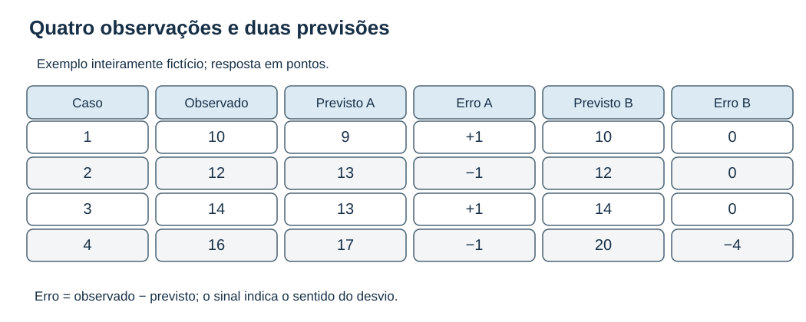
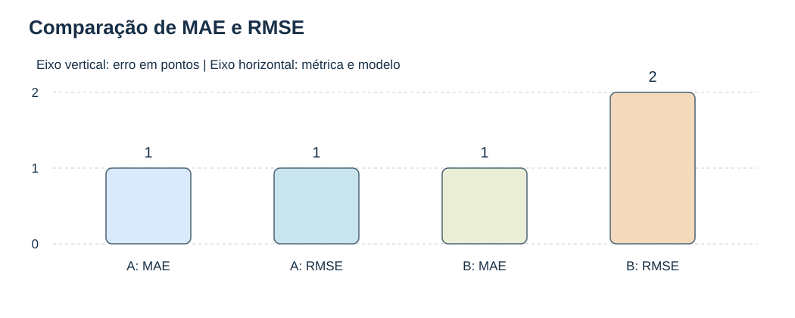
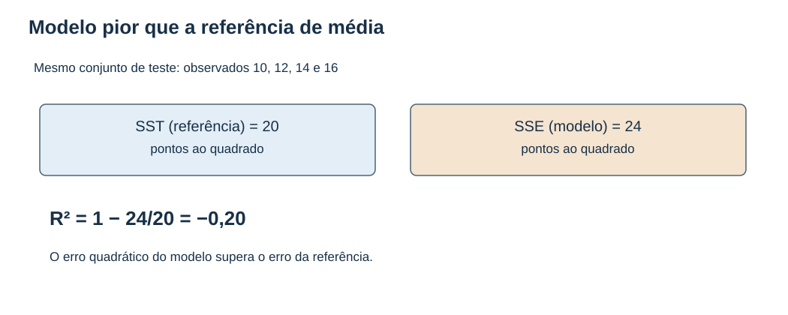
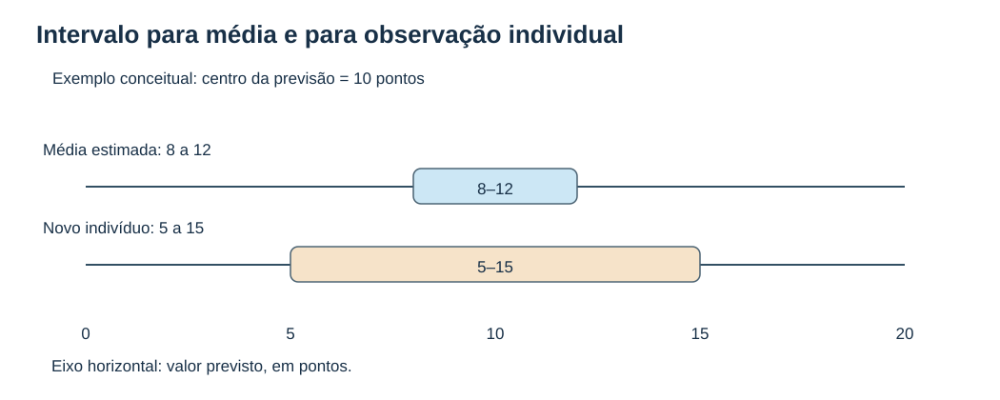
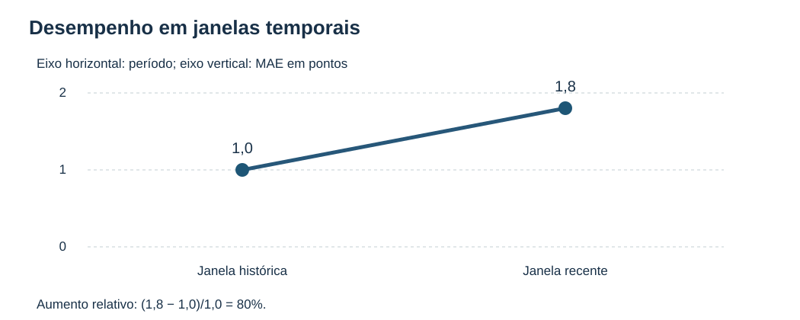
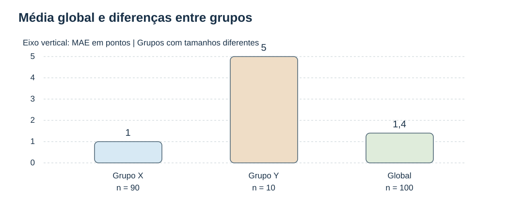
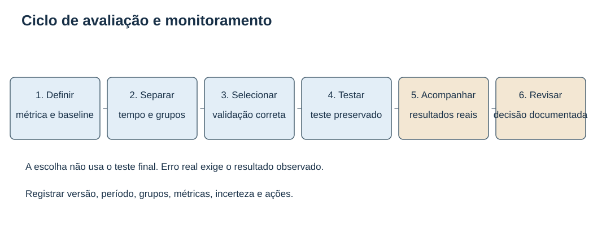

# MAT-EST-032 — Avaliação integrada de previsões: comparação de métricas, incerteza e monitoramento de desempenho

**Tempo recomendado:** três blocos de 25 a 50 minutos. **Natureza:** aula autoral, de aprofundamento e ponte universitária. Os exemplos e dados são fictícios; não reproduzem questões oficiais. As conexões com ENEM, FUVEST, UNICAMP e UNESP referem-se às habilidades de interpretação de gráficos, médias, variabilidade, inferência e decisão quantitativa; não implicam cobrança literal de métricas de aprendizado de máquina nos editais.

## 1. Objetivos e pré-requisitos

Ao final da aula, o estudante deverá conseguir comparar métricas preditivas sob a mesma base de avaliação, distinguir erro médio de erro extremo, explicar incerteza de uma previsão, detectar mudanças de desempenho por tempo e por grupo, estabelecer uma linha de base e elaborar um relatório que respeite os dados. Os principais pré-requisitos são resíduos (MAT-EST-027), ajuste e interpretação de regressão (MAT-EST-030) e separação entre treino, validação e teste (MAT-EST-031). Se algum desses conceitos não estiver dominado, retome-o antes do bloco correspondente.

## 2. Por que esta aula existe?

Imagine um sistema que prevê a demanda diária de um serviço. Durante os testes, duas versões produzem o mesmo erro absoluto médio. A primeira erra pouco em cada dia; a segunda acerta quase sempre, mas erra muito em um dia. Em outro mês, muda o público atendido. Uma única nota de desempenho não responde a todas as perguntas. Precisamos saber **quanto** errou, **como** os erros se distribuem, **para quem** errou, **com que incerteza** e **se os resultados permanecem válidos ao longo do tempo**.

Uma avaliação preditiva usa dados que não influenciaram o ajuste e a escolha do modelo. Definir a métrica antes de avaliar ajuda a impedir a seleção oportunista do número mais favorável. O teste final preservado estima desempenho naquela população e naquele protocolo; ele não é garantia universal de resultados futuros.

## 3. Vocabulário fundamental: observado, previsto e erro

Para a observação de número i, escrevemos o valor observado como `y_i` e a previsão como `ŷ_i`, lê-se "ípsilon previsto de índice i". Nesta aula, o erro assinado é `e_i = y_i − ŷ_i`, isto é, "observado menos previsto". Erro positivo significa que o modelo **subestimou** o valor observado; erro negativo significa que **superestimou**. O módulo `|e_i|`, lido "valor absoluto do erro", mede a magnitude sem permitir cancelamentos de sinais.

Considere quatro respostas observadas, em pontos: **10, 12, 14 e 16**. A versão A prevê **9, 13, 13 e 17**. Seus erros assinados são **+1, −1, +1 e −1**. A versão B prevê **10, 12, 14 e 20**. Seus erros são **0, 0, 0 e −4**. Ambos acumulam quatro pontos de erro absoluto, mas distribuídos de maneiras diferentes.

**Figura 1 — Quatro observações e duas previsões.** O quadro registra cada valor observado, cada previsão e o erro com sinal. Observe que a versão B acerta as três primeiras respostas, mas superestima a última em quatro pontos. A informação essencial está escrita no próprio quadro, e não depende de cores.

## 4. Quatro métricas e o que cada uma responde

**MAE, erro absoluto médio:**

`MAE = (Σ |e_i|)/n`.

Leitura: "some os módulos dos erros e divida pela quantidade de previsões". Sua unidade é a mesma da resposta. O MAE não informa o maior erro individual. Para A e B, `MAE = 4/4 = 1 ponto`.

**MSE, erro quadrático médio:**

`MSE = (Σ e_i²)/n`.

Leitura: "eleve cada erro ao quadrado, some e divida pela quantidade de previsões". Como os erros são elevados ao quadrado, a unidade também fica ao quadrado. A possui soma quadrática quatro e `MSE = 1 ponto²`; B possui soma quadrática dezesseis e `MSE = 4 pontos²`.

**RMSE, raiz do erro quadrático médio:**

`RMSE = √MSE`.

Leitura: "a raiz quadrada do erro quadrático médio". Devolve a unidade original. Para A, `RMSE = 1 ponto`. Para B, `RMSE = 2 pontos`. Um erro isolado grande afeta mais intensamente a soma de quadrados.

**R², coeficiente de determinação na amostra avaliada:**

`R² = 1 − SSE/SST`, quando `SST > 0`.

Leitura: "um menos a soma dos erros quadráticos do modelo dividida pela soma dos quadrados dos desvios dos valores observados em relação à sua média". Aqui `SSE = Σ(y_i − ŷ_i)²` e `SST = Σ(y_i − ȳ)²`, com `ȳ` sendo a média observada do conjunto de avaliação. O R² compara a soma quadrática do modelo com a previsão constante dessa média; não é uma medida de causalidade nem uma probabilidade de acerto. Em dados externos, pode ser negativo. Se a variância observada for zero, essa fórmula não está definida da maneira usual, e isso precisa ser registrado.

### Exemplo resolvido: R² negativo

Os valores observados são 10, 12, 14 e 16, com média 13. Logo, `SST = 9 + 1 + 1 + 9 = 20 pontos²`. Uma terceira versão C prevê 12 nos quatro casos. Seus erros quadráticos são 4, 0, 4 e 16; `SSE = 24 pontos²`. Assim, `R² = 1 − 24/20 = −0,20`. Isso significa que a soma quadrática do modelo C foi maior que a soma quadrática da referência de média dos observados nesse conjunto. Não significa que existe uma "probabilidade negativa".

**Figura 2 — MAE e RMSE para A e B, em pontos.** No eixo horizontal estão as quatro combinações de modelo e métrica; no vertical, erros de zero a dois pontos. As barras têm valores numéricos escritos: MAE de A e B igual a um, RMSE de A igual a um e de B igual a dois. Conclusão: usar apenas MAE esconde a concentração de um grande erro na versão B.

**Figura 3 — R² negativo na amostra externa.** As duas caixas mostram SST igual a vinte pontos ao quadrado e SSE igual a vinte e quatro. Portanto, um menos vinte e quatro dividido por vinte resulta em menos zero vírgula vinte.

**Escolha responsável:** nenhuma métrica é universalmente suficiente. MAE resume erro absoluto típico, RMSE penaliza mais erros grandes, erro médio assinado pode revelar viés, e R² depende da referência de variabilidade. Compare modelos no mesmo conjunto, com a mesma unidade, horizonte, transformação e definição de resposta. Se os erros maiores forem especialmente caros, registre essa prioridade antes da avaliação.

## 5. Incerteza: estimar a média não é prever o próximo caso

Uma previsão pontual entrega um número, como "10 pontos", mas o próximo resultado pode variar. O intervalo de confiança da **resposta média** procura cobrir a média condicional para determinado perfil. O **intervalo de predição** procura cobrir uma nova observação individual com aquele perfil. Sob o mesmo modelo linear clássico e igual nível nominal, o segundo normalmente é maior, pois incorpora também a dispersão da nova observação.

Na regressão linear simples, para um valor `x_h` de preditor, a forma do intervalo para a média é `ŷ_h ± t* × s × √h_h`; lê-se "valor previsto mais ou menos o quantil t vezes a dispersão residual estimada vezes a raiz da alavancagem de previsão". O intervalo para uma **nova observação** é `ŷ_h ± t* × s × √(1 + h_h)`, com o termo adicional 1 dentro da raiz. As expressões exigem hipóteses específicas do modelo, inclusive uso adequado do desvio residual e do multiplicador t; não são receitas automáticas para qualquer preditor.

Para visualizar, imagine dois intervalos didáticos centrados em 10: média entre **8 e 12**, e observação individual entre **5 e 15**. Esses números são apenas ilustrativos, não resultados inferidos de dados desta aula. O primeiro tem largura quatro; o segundo, dez pontos.

**Figura 4 — Intervalo da média e intervalo preditivo de indivíduo.** O eixo horizontal vai de zero a vinte pontos, com centro em dez. A faixa de 8 a 12 é mais estreita que a de 5 a 15. Não se deve divulgar o intervalo estreito como se garantisse o próximo resultado individual.

### Cobertura e largura

Se emitirmos intervalos para novos registros e já dispusermos dos valores observados, **cobertura empírica** é a proporção desses observados que caiu entre os limites correspondentes. Com oito coberturas em dez observações, o cálculo é `8/10 = 80%`. Isso, com amostra tão pequena, não determina a verdadeira cobertura do procedimento. Relate também a largura dos intervalos e a cobertura por segmento, pois intervalos arbitrariamente enormes podem cobrir muito sem serem úteis. Cobertura nominal é uma propriedade do procedimento sob as hipóteses; não significa que há uma probabilidade frequentista de 95% para um parâmetro fixo estar em um intervalo já calculado.

## 6. Avaliar por tempo e por grupo

O erro médio de um mês não necessariamente representa o mês seguinte. Para comparar períodos, mantenha a definição da variável-alvo, a unidade e as regras de coleta. Suponha MAE histórico de 1,0 ponto e MAE recente de 1,8 ponto. O aumento relativo é `(1,8 − 1,0)/1,0 = 0,8`, isto é, **80%**. É uma mudança observada, não uma explicação causal. Investigue volume, intervalos de incerteza, possíveis anomalias de integração, alterações na população e o atraso dos resultados.

**Figura 5 — Desempenho por janela temporal.** Eixo horizontal: período histórico e recente. Eixo vertical: erro absoluto médio, em pontos. Os valores crescem de 1,0 para 1,8; ainda é necessário examinar a estabilidade dessa diferença e sua causa.

O mesmo vale para grupos. Um conjunto fictício inclui 90 registros do grupo X com MAE um e dez registros do grupo Y com MAE cinco. A soma absoluta é `90 × 1 + 10 × 5 = 140`. Dividindo pelos cem registros, obtemos **MAE global de 1,4**. Esse número, isoladamente, esconderia o MAE de cinco no grupo Y. Reporte denominadores, períodos e qualidade da amostra. Não trate a diferença entre grupos como causal sem investigação adequada.

**Figura 6 — Agregado e grupos.** Eixo horizontal: grupo X, grupo Y e global. Eixo vertical: MAE em pontos, com barras de um, cinco e um vírgula quatro. Os rótulos informam também os tamanhos, 90, 10 e 100. O agregado pode esconder comportamento distinto num segmento pequeno.

### Monitorar antes e depois da chegada dos resultados

Quando uma previsão é emitida, é possível verificar entradas, ausências, faixa de valores, mudança de distribuição, integridade da versão do modelo e atraso de processamento. **Não é possível calcular MAE real para registros cujo valor observado ainda não está disponível.** Após a chegada de resultados pareados, calcule MAE, RMSE, viés assinado, cobertura e desempenho por período e grupo. Se só vinte de oitenta registros tiverem resultado, diga que a avaliação parcial se refere a vinte registros, ou 25% dos previstos; os demais ainda estão pendentes e podem gerar viés de disponibilidade.

Uma mudança nas entradas pode sinalizar risco, mas não demonstra por si só perda de precisão. Uma mudança de erro também não revela sozinha sua causa. O planejamento deve incluir pontos de conferência, critérios de alerta documentados, responsáveis pela revisão, uma linha de base e avaliação de versões propostas em dados recentes e representativos. Não reutilize repetidamente o conjunto de teste original para escolher melhorias.

## 7. Protocolo de avaliação integrada

1. Especifique a pergunta: qual resultado, horizonte, população e unidade? Defina também o custo de diferentes tipos de erro.
2. Estabeleça uma linha de base simples apropriada ao uso, como média histórica ou previsão de persistência para uma série temporal, respeitando a disponibilidade temporal dos dados.
3. Preserve treino, validação e teste conforme a estrutura temporal ou os grupos. Ajuste transformações apenas no treino de cada rodada; mantenha o teste final fora das decisões de escolha.
4. Compare métricas nas mesmas observações; apresente erros típicos, grandes falhas, referência de R² e, quando houver, intervalos e sua cobertura.
5. Registre versão do modelo, amostra, período, dados ausentes, subgrupos, limitações e riscos de extrapolação.
6. Após o uso, acompanhe dados de entrada e depois erros reais conforme os resultados chegarem. Se houver desvio, formule hipóteses, investigue e valide qualquer alteração sem contaminar a avaliação final.

**Figura 7 — Ciclo de avaliação e acompanhamento.** Da esquerda para a direita estão: objetivo e referência, separação de dados, escolha com validação, teste final preservado, acompanhamento com resultados reais e revisão documentada. A etapa de teste não deve orientar repetidas modificações no mesmo modelo.

### Aplicações entre matérias

Na Física, podem-se comparar previsões de medidas experimentais com observações e unidades consistentes. Na Geografia, previsões de demanda hídrica precisam considerar região e época do ano. Na Biologia, um modelo de medidas observadas deve ser interpretado dentro da população estudada. Em Redação, uma conclusão quantitativa precisa declarar amostra, período, indicador, unidade, limites e hipóteses — não basta dizer que "o modelo foi eficiente". Na Ciência de Dados, toda validação deve reproduzir o uso futuro, inclusive quando dados de uma mesma pessoa, máquina ou local estão correlacionados.

## 8. Erros frequentes

- Confundir o erro assinado médio próximo de zero com ausência de erros individuais: sinais podem se cancelar.
- Comparar erros calculados em unidades ou conjuntos diferentes sem explicar escalas e públicos.
- Interpretar R² como chance de acerto ou achar que nunca pode ser negativo em teste.
- Transformar o MAE de um conjunto em garantia de erro máximo para cada caso.
- Reportar intervalo de confiança da média como faixa de previsão de cada indivíduo.
- Medir MAE de resultados que ainda não chegaram, ou não informar que só há dados parciais.
- Misturar observações de tempos futuros no treinamento ou reaprender transformações com o teste final.
- Supor que mudança de perfil de entradas comprova automaticamente maior erro, ou que maior erro demonstra automaticamente uma causa única.
- Ocultar tamanhos de grupos por meio da média geral.

## 9. Exercícios e correção comentada

**Orientação para o site:** as respostas e resoluções ficam em `exercicios.json` e devem ser mostradas após a tentativa real. O texto a seguir traz também uma edição integral acessível para leitura e impressão. Cada questão é **autoral**, mesmo quando inspirada em habilidades gerais avaliadas no ENEM e em vestibulares. Não foi incluída transcrição nem identificador inventado de questão oficial.

### Camada A — Aprendizagem básica

#### MAT-EST-032-EX-APR-01 — Previsão e erro

**Questão autoral:** O valor observado é 12 e a previsão foi 15 pontos. Calcule o erro assinado usando observado menos previsto e o erro absoluto.

**Resposta:** Erro assinado = −3 pontos; absoluto = 3 pontos.

**Correção comentada:** Erro = 12 − 15 = −3: a previsão superestimou o observado. O módulo de −3 é 3; MAE nunca utiliza sinais negativos.

**Habilidade:** resíduos e módulo. **Possível motivo do erro:** cálculo.

#### MAT-EST-032-EX-APR-02 — MAE básico

**Questão autoral:** Para quatro erros assinados +1, −2, +1 e 0 unidades, encontre MAE.

**Resposta:** MAE = 1 unidade.

**Correção comentada:** Os módulos são 1, 2, 1 e 0. MAE = (1 + 2 + 1 + 0)/4 = 1.

**Habilidade:** erro absoluto médio. **Possível motivo do erro:** cálculo.

#### MAT-EST-032-EX-APR-03 — RMSE básico

**Questão autoral:** Os erros são −1, +1, −1 e +1 ponto. Calcule o MSE e o RMSE.

**Resposta:** MSE = 1 ponto²; RMSE = 1 ponto.

**Correção comentada:** O quadrado de cada erro é 1; MSE = 4/4 = 1 ponto². RMSE é a raiz de 1 e retorna à unidade original: 1 ponto.

**Habilidade:** erro quadrático e unidades. **Possível motivo do erro:** cálculo.

#### MAT-EST-032-EX-APR-04 — Papel do R²

**Questão autoral:** Em avaliação externa, um R² de −0,20 é impossível? Justifique.

**Resposta:** Não. Em dados retidos, um modelo pode ser pior que a previsão constante pela média observada do conjunto avaliado.

**Correção comentada:** R² = 1 − SSE/SST, quando SST é positivo. Se SSE superar SST, a fração é maior que 1 e R² fica negativo.

**Habilidade:** limites de R². **Possível motivo do erro:** interpretação.

#### MAT-EST-032-EX-APR-05 — Métrica e unidade

**Questão autoral:** Se a resposta é medida em quilômetros, quais são as unidades do MAE, MSE e RMSE?

**Resposta:** MAE e RMSE: quilômetros; MSE: quilômetros ao quadrado.

**Correção comentada:** O valor absoluto conserva a unidade original. Elevar os erros ao quadrado muda a dimensão; a raiz a recupera.

**Habilidade:** análise dimensional. **Possível motivo do erro:** memória.

#### MAT-EST-032-EX-APR-06 — Viés assinado

**Questão autoral:** Os erros observado menos previsto são +2, +2, −2 e −2. Qual é o erro médio assinado? Isso significa previsões perfeitas?

**Resposta:** Erro médio assinado = 0; não, os erros se cancelaram.

**Correção comentada:** A soma assinada é zero; dividida por quatro continua zero. O MAE, porém, é 2: nenhuma das quatro previsões foi exata.

**Habilidade:** viés e cancelamento. **Possível motivo do erro:** interpretação.

#### MAT-EST-032-EX-APR-07 — Referência simples

**Questão autoral:** Por que avaliar também uma previsão ingênua, como repetir o último valor observado, em uma série temporal?

**Resposta:** Porque ela fornece uma base de comparação para saber se a complexidade do modelo melhora as previsões.

**Correção comentada:** O erro absoluto do modelo precisa ser interpretado contra uma regra simples apropriada ao problema. Um sistema sofisticado não demonstra valor preditivo só por produzir números.

**Habilidade:** linha de base. **Possível motivo do erro:** estratégia.

#### MAT-EST-032-EX-APR-08 — Intervalos diferentes

**Questão autoral:** A média prevista para certo perfil é 10. Para a mesma confiança nominal e sob um mesmo modelo, qual intervalo normalmente será mais largo: o da resposta média ou o de uma nova observação individual?

**Resposta:** O intervalo de predição de uma nova observação individual.

**Correção comentada:** Além da incerteza na média estimada, a nova observação tem sua própria variabilidade aleatória. Essa parcela extra torna o intervalo preditivo individual mais largo, sob o modelo considerado.

**Habilidade:** incerteza preditiva. **Possível motivo do erro:** conteúdo.

#### MAT-EST-032-EX-APR-09 — Cobertura observada

**Questão autoral:** Um procedimento produziu 10 intervalos preditivos e 8 contiveram os valores reais. Qual é a cobertura observada?

**Resposta:** 8/10 = 80%.

**Correção comentada:** Conte os intervalos que realmente cobriram o resultado. Divida 8 por 10 e converta: 80%; amostra pequena não comprova cobertura populacional.

**Habilidade:** cobertura empírica. **Possível motivo do erro:** cálculo.

#### MAT-EST-032-EX-APR-10 — Monitoramento e rótulos

**Questão autoral:** É possível calcular MAE real sobre previsões de hoje quando os resultados observados só ficarão disponíveis no mês seguinte?

**Resposta:** Não. É possível acompanhar qualidade dos dados e distribuição das entradas, mas MAE exige resultados observados correspondentes.

**Correção comentada:** Toda medida de erro supervisionada compara observado e previsto. Sem os rótulos ou resultados finais, ainda não existe erro observado para aquela safra.

**Habilidade:** monitoramento com atraso. **Possível motivo do erro:** interpretação.

### Camada B — Consolidação

#### MAT-EST-032-EX-CON-01 — Mesma média, risco diferente

**Questão autoral:** Nos mesmos quatro casos, A tem erros +1, −1, +1 e −1; B tem 0, 0, 0 e −4. Calcule MAE e RMSE de ambos.

**Resposta:** Ambos têm MAE = 1. A: RMSE = 1; B: RMSE = 2.

**Correção comentada:** A: soma dos módulos 4; soma dos quadrados 4. B: soma dos módulos 4; soma dos quadrados 16. Divida cada soma por 4; retire a raiz no RMSE.

**Habilidade:** comparação de métricas. **Possível motivo do erro:** cálculo.

#### MAT-EST-032-EX-CON-02 — R² externo negativo

**Questão autoral:** Dados observados são 10, 12, 14 e 16; previsões são sempre 12. Calcule SSE, SST em torno da média observada e R².

**Resposta:** SSE = 24; SST = 20; R² = −0,20.

**Correção comentada:** Média observada: 13; SST = 9 + 1 + 1 + 9 = 20. SSE = 4 + 0 + 4 + 16 = 24; 1 − 24/20 = −0,20.

**Habilidade:** R² com referência explícita. **Possível motivo do erro:** cálculo.

#### MAT-EST-032-EX-CON-03 — MAE por volume

**Questão autoral:** Um período tem 10 casos e MAE de 1; outro tem 30 casos e MAE de 3. Calcule o MAE agregado.

**Resposta:** MAE total = 2,5 unidades.

**Correção comentada:** Erro absoluto somado: 10×1 + 30×3 = 100. Divida por 40 casos; a média simples entre 1 e 3 daria um resultado indevidamente não ponderado.

**Habilidade:** média ponderada. **Possível motivo do erro:** cálculo.

#### MAT-EST-032-EX-CON-04 — MAE entre populações

**Questão autoral:** Modelo A: MAE 1 ponto numa prova de 20 pontos; modelo B: MAE 2 pontos numa prova de 100 pontos. É possível concluir somente pelos erros brutos que A é melhor?

**Resposta:** Não. As escalas e o objetivo diferem, e é preciso avaliar comparabilidade, impacto e referência apropriada.

**Correção comentada:** Um ponto e dois pontos têm significados diferentes conforme a escala e o custo do erro. Não atribua superioridade universal por MAE absoluto em contextos distintos.

**Habilidade:** comparação válida. **Possível motivo do erro:** interpretação.

#### MAT-EST-032-EX-CON-05 — Desvio sistemático

**Questão autoral:** Na amostra recente, os erros são 2, 2, 2 e 2 unidades. Calcule viés médio, MAE e RMSE; descreva o problema.

**Resposta:** Viés = +2; MAE = 2; RMSE = 2 unidades. O modelo subestima sistematicamente o valor observado.

**Correção comentada:** Somar os sinais dá 8/4 = 2; os módulos também resultam 2. Quadrados: 4 em todos os casos; raiz do MSE = 2.

**Habilidade:** monitoramento de viés. **Possível motivo do erro:** cálculo.

#### MAT-EST-032-EX-CON-06 — Dois intervalos

**Questão autoral:** Para um caso, o procedimento P fornece [8, 12] e Q fornece [5, 15], ambos na mesma unidade, e o observado foi 11. Compare cobertura e largura.

**Resposta:** Ambos cobriram 11; P tem largura 4 e Q tem largura 10.

**Correção comentada:** 11 pertence aos dois intervalos. Larguras: 12−8=4 e 15−5=10; um caso isolado não prova melhor calibração geral.

**Habilidade:** largura e cobertura. **Possível motivo do erro:** cálculo.

#### MAT-EST-032-EX-CON-07 — Proporção e denominador

**Questão autoral:** Três erros graves foram encontrados em 20 previsões do período A; seis erros graves em 100 previsões no período B. Compare as taxas.

**Resposta:** A: 15%; B: 6%. A teve maior taxa apesar de menos erros em contagem bruta.

**Correção comentada:** Divida 3/20 = 0,15 e 6/100 = 0,06. Use o mesmo critério de erro grave e mantenha os denominadores visíveis.

**Habilidade:** taxas de falhas. **Possível motivo do erro:** cálculo.

#### MAT-EST-032-EX-CON-08 — Atraso dos resultados

**Questão autoral:** Em setembro foram feitas 80 previsões e apenas 20 já possuem resultado observado. Sobre quais registros se pode calcular MAE?

**Resposta:** Apenas sobre os 20 registros pareados com resultado já disponível, indicando cobertura de observação e potencial viés de atraso.

**Correção comentada:** As outras 60 previsões não têm resultado comparável ainda. Reportar MAE parcial como se representasse todos os 80 seria interpretação injustificada.

**Habilidade:** qualidade do acompanhamento. **Possível motivo do erro:** interpretação.

#### MAT-EST-032-EX-CON-09 — Alerta por janela

**Questão autoral:** O MAE era 1,0 em uma janela histórica e passou a 1,8 na janela recente sob a mesma unidade e protocolo. Qual foi a variação relativa?

**Resposta:** Aumento de 80%.

**Correção comentada:** Diferença: 1,8−1,0=0,8. Divisão pela referência 1,0: 0,8/1,0 = 0,80. Verificar também tamanho da amostra e mudança de perfil.

**Habilidade:** tendência de desempenho. **Possível motivo do erro:** cálculo.

#### MAT-EST-032-EX-CON-10 — Dados temporais

**Questão autoral:** Uma previsão para outubro depende de informações disponíveis até setembro. Por que misturar aleatoriamente meses futuros no treino é problemático?

**Resposta:** Porque produz informação futura indevida e uma avaliação menos semelhante ao uso real.

**Correção comentada:** Separe os dados preservando a ordem cronológica e evite processamentos ajustados com informações futuras. Reproduza o momento em que a previsão realmente estaria sendo emitida.

**Habilidade:** protocolo temporal. **Possível motivo do erro:** estratégia.

### Camada C — Transferência e aprofundamento

#### MAT-EST-032-EX-VES-01 — Escolha e custo do erro

**Questão autoral:** A e B apresentam MAE idêntico de 1, mas RMSE de 1 e 2 no mesmo teste. Se grandes erros têm custo muito elevado, qual métrica ajuda a ver essa diferença e por quê?

**Resposta:** RMSE explicita a penalização quadrática mais forte aos grandes erros; a escolha deve partir da função de perda do uso.

**Correção comentada:** O erro 4 de B vira 16 no quadrado e o RMSE sobe. Não declare A melhor em qualquer aplicação: explicite o custo de grandes falhas e a incerteza da amostra.

**Habilidade:** métrica e objetivo. **Possível motivo do erro:** estratégia.

#### MAT-EST-032-EX-VES-02 — Base comparável de teste

**Questão autoral:** Um relatório apresenta MAE de 1,2 para modelo A em 2024 e MAE de 1,1 para modelo B em 2026. Isso comprova que B prediz melhor?

**Resposta:** Não. Os conjuntos, populações, períodos e condições não são diretamente comparáveis.

**Correção comentada:** Avalie candidatos sob protocolo comparável, na mesma população-alvo e com mesma definição de resposta. Diferenças de distribuição e coleta podem explicar a aparente vantagem.

**Habilidade:** auditoria de comparabilidade. **Possível motivo do erro:** interpretação.

#### MAT-EST-032-EX-VES-03 — Desempenho global mascara grupo

**Questão autoral:** Há 90 casos do grupo X com MAE 1 e 10 do grupo Y com MAE 5. Calcule MAE global e explique uma conclusão cautelosa.

**Resposta:** MAE global = 1,4; a média global esconde erro cinco vezes maior no grupo Y.

**Correção comentada:** Somatório absoluto = 90×1 + 10×5 = 140; /100 = 1,4. Apresente também tamanho e MAE de cada grupo; verificar se há intervalos ou incertezas relevantes.

**Habilidade:** monitoramento por segmento. **Possível motivo do erro:** cálculo.

#### MAT-EST-032-EX-VES-04 — Distribuição deslocada

**Questão autoral:** Um modelo de consumo foi validado em temperaturas de 15 a 30 graus Celsius e será aplicado a 42 graus. O MAE antigo garante desempenho?

**Resposta:** Não. É extrapolação fora do domínio observado, exigindo nova validação e ressalva explícita.

**Correção comentada:** O domínio de preditores mudou; a relação ajustada pode não continuar válida. Restringir uso, obter dados representativos ou revisar o modelo é mais justificável que prometer a mesma precisão.

**Habilidade:** extrapolação e validade. **Possível motivo do erro:** interpretação.

#### MAT-EST-032-EX-VES-05 — MAPE e zero

**Questão autoral:** Uma métrica percentual calcula |observado−previsto|/|observado|. O que ocorre quando observado = 0?

**Resposta:** A fração não está definida para observado igual a zero, portanto exige outra métrica ou tratamento justificado.

**Correção comentada:** A divisão por zero não é uma taxa percentual calculável. MAE ou RMSE, com unidade e contexto, podem ser alternativas quando adequadas.

**Habilidade:** limites de percentual. **Possível motivo do erro:** conteúdo.

#### MAT-EST-032-EX-VES-06 — Intervalo de média x indivíduo

**Questão autoral:** Um relatório informa IC de 95% [49, 51] para resposta média e intervalo preditivo [40, 60] para um indivíduo com o mesmo perfil. O que cada afirmação procura cobrir?

**Resposta:** O primeiro procura cobrir o parâmetro da média condicional; o segundo procura cobrir uma futura observação individual, sob o modelo e suas hipóteses.

**Correção comentada:** Uma previsão individual incorpora dispersão residual adicional. Não reporte o intervalo estreito da média como promessa para cada pessoa.

**Habilidade:** incerteza estatística. **Possível motivo do erro:** interpretação.

#### MAT-EST-032-EX-VES-07 — Cobertura e precisão juntas

**Questão autoral:** Procedimento A cobriu 90 de 100 observações com largura média 12. B cobriu 90 de 100 com largura média 6, usando mesmos casos e nível nominal. O que se pode dizer descritivamente?

**Resposta:** Ambos tiveram cobertura observada de 90%; B teve intervalos mais estreitos nesse conjunto, mas são necessárias análises adicionais para generalizar.

**Correção comentada:** Cobertura empírica = 90/100 para ambos. Largura menor em B é observação descritiva, não prova universal; examine estabilidade, subgrupos e dependência da amostra.

**Habilidade:** calibração e largura. **Possível motivo do erro:** interpretação.

#### MAT-EST-032-EX-VES-08 — Desempenho muda sem resultado

**Questão autoral:** As características das entradas mudaram muito neste mês, mas os resultados só serão conhecidos posteriormente. Pode-se afirmar que o erro de previsão aumentou?

**Resposta:** Não. A mudança nas entradas é sinal de investigação; é preciso obter resultados observados para confirmar alteração do erro.

**Correção comentada:** Deslocamento de dados não implica obrigatoriamente perda já demonstrada de precisão. Monitore entrada, integridade, atraso de rótulos e, depois, MAE e cobertura nos resultados pareados.

**Habilidade:** mudança de distribuição. **Possível motivo do erro:** conteúdo.

#### MAT-EST-032-EX-VES-09 — Retraining sem vazamento

**Questão autoral:** Um analista recalcula o escalonamento com todos os registros, incluindo os de teste final, antes de comparar os modelos. Qual correção é necessária?

**Resposta:** Aprender o escalonamento exclusivamente nos dados de treino de cada rodada, aplicá-lo aos dados retidos e preservar o teste para avaliação final.

**Correção comentada:** Mesmo uma transformação sem rótulos pode vazar estatísticas da avaliação. Refazer a avaliação corretamente ou registrar sua contaminação; não declarar o teste independente.

**Habilidade:** auditoria de pré-processamento. **Possível motivo do erro:** estratégia.

#### MAT-EST-032-EX-VES-10 — Conclusão para relatório

**Questão autoral:** Um teste preservado em 60 registros de uma escola teve MAE 1,5 ponto e RMSE 2,1 pontos. Escreva duas frases sem extrapolar para outras escolas.

**Resposta:** Exemplo: “Nos 60 registros reservados da escola, o erro absoluto médio foi 1,5 ponto e a raiz do erro quadrático médio foi 2,1 pontos. A validade para outros anos ou escolas depende de nova avaliação com dados representativos.”

**Correção comentada:** A primeira frase registra população, amostra, métrica e unidade. A segunda evita generalização causal ou garantia de erro máximo a partir da média.

**Habilidade:** comunicação responsável. **Possível motivo do erro:** interpretação.

### Camada D — Reteste independente após remediação

#### MAT-EST-032-EX-RET-01 — Reteste: duas métricas

**Questão autoral:** Os erros são 0, +2, −2 e +4 quilômetros. Calcule MAE, MSE e RMSE.

**Resposta:** MAE = 2 km; MSE = 6 km²; RMSE = √6 ≈ 2,449 km.

**Correção comentada:** Módulos somam 8, divididos por 4 dão 2 km. Quadrados somam 0+4+4+16 = 24; MSE = 6 km² e RMSE = √6 km.

**Habilidade:** recuperação independente de métricas. **Possível motivo do erro:** cálculo.

#### MAT-EST-032-EX-RET-02 — Reteste: baseline

**Questão autoral:** Os observados são 2, 4 e 6; um modelo prevê 4, 4 e 4. Calcule seu R² usando a média desses observados como referência.

**Resposta:** R² = 0; SSE = SST = 8.

**Correção comentada:** Média observada = 4; SST = (2−4)²+0+(6−4)² = 8. Previsões iguais à média geram SSE = 8, portanto 1−8/8 = 0.

**Habilidade:** R² e referência. **Possível motivo do erro:** cálculo.

#### MAT-EST-032-EX-RET-03 — Reteste: grupos e volume

**Questão autoral:** Grupo A tem 8 registros e MAE 1; grupo B tem 2 registros e MAE 6. Calcule MAE total e descreva o que o total oculta.

**Resposta:** MAE total = 2; grupo B tem MAE maior e apenas 2 observações.

**Correção comentada:** Erro absoluto acumulado = 8×1 + 2×6 = 20, dividido por 10 = 2. O indicador agregado omite heterogeneidade; reporte ambos os grupos e seus tamanhos.

**Habilidade:** monitoramento segmentado. **Possível motivo do erro:** cálculo.

#### MAT-EST-032-EX-RET-04 — Reteste: intervalos

**Questão autoral:** Um intervalo preditivo vai de 18 a 26 unidades e o observado é 27. Indique a largura e se houve cobertura.

**Resposta:** Largura = 8 unidades; não houve cobertura.

**Correção comentada:** 26−18 = 8. Como 27 > 26, o resultado ficou fora do intervalo; um caso não determina sozinho sua taxa de cobertura.

**Habilidade:** intervalos de previsão. **Possível motivo do erro:** cálculo.

#### MAT-EST-032-EX-RET-05 — Reteste: defasagem temporal

**Questão autoral:** O painel mostra 200 previsões recentes, mas só 50 possuem resultados conhecidos. Redija a cautela mínima para divulgar seu MAE.

**Resposta:** O MAE atual se refere aos 50 casos com resultado disponível, ou 25% das previsões recentes; pode haver viés de disponibilidade e é preciso atualizar quando os demais resultados chegarem.

**Correção comentada:** 50/200 = 0,25; nomeie a base de cálculo. Descreva a defasagem e evite atribuir a estimativa ao conjunto completo de 200 casos.

**Habilidade:** rótulos atrasados. **Possível motivo do erro:** interpretação.

#### MAT-EST-032-EX-RET-06 — Reteste: monitoramento responsável

**Questão autoral:** Depois de implantar um modelo, o MAE subiu de 1 para 2 unidades e também mudou a população atendida. Liste duas ações justificáveis, sem afirmar causa não testada.

**Resposta:** Verificar mudanças na coleta e nas características da população; auditar resultados pareados, segmentos e possíveis erros de integração, validando alternativas em dados recentes antes de alterar o modelo.

**Correção comentada:** A mudança do MAE é fato descritivo, não diagnóstico automático da causa. Investigue dados, rótulos, amostragem e estabilidade antes de recalibrar ou substituir.

**Habilidade:** tomada de decisão por evidências. **Possível motivo do erro:** estratégia.

## 10. Revisão ativa, áudio e critério de domínio

**Versão curta para ouvir:** Uma boa previsão não é apenas um número com baixo erro na própria amostra de treinamento. Primeiro, compare as previsões com resultados não utilizados nas decisões anteriores. O erro absoluto médio mede a magnitude média do desvio. A raiz do erro quadrático médio dá mais peso aos erros maiores. O coeficiente de determinação compara somas quadráticas com a referência da média e pode ser negativo em teste. A previsão individual é mais incerta que a média estimada. Acompanhe desempenho por grupo e por período, e não calcule erro real de casos cujos resultados ainda são desconhecidos. Ao perceber alteração, investigue a qualidade dos dados e valide a mudança antes de anunciar uma conclusão.

**Recuperação espaçada após estudo efetivo:** retomar em um, sete e trinta dias, podendo antecipar a revisão quando houver erro. Em cada retorno, explicar a diferença entre MAE e RMSE sem consultar fórmulas, calcular uma métrica em dados inéditos, interpretar um relatório por grupo e distinguir intervalo de média de intervalo individual. O reteste deve conter novas questões; publicação de material não marca o tópico como consolidado. Registrar erro como conteúdo, interpretação, cálculo, distração, memória, estratégia ou tempo, com a evidência da correção.

**Critério individual de consolidação:** justificar o objetivo da métrica, resolver cálculo direto com unidade, detectar um problema de comparação, explicar o limite de generalização e recuperar os conceitos em revisão posterior. Sem tentativas registradas, manter o status não iniciado ou o estado anterior do usuário; nunca inferir nota.

## 11. Vídeo complementar

- **Título:** *Video 8: Comparing the Model to the Experts*.
- **Instituição/canal:** MIT OpenCourseWare, curso *The Analytics Edge*; professor Dimitris Bertsimas.
- **Link:** https://ocw.mit.edu/courses/15-071-the-analytics-edge-spring-2017/pages/linear-regression/the-statistical-sommelier-an-introduction-to-linear-regression/video-8-comparing-the-model-to-the-experts/
- **Duração:** não confirmada na página consultada. **Idioma:** inglês.
- **Quando assistir:** depois da seção 7, como complemento sobre comparação de desempenho com referências externas; a aula escrita permanece completa sem o vídeo. Página institucional localizada em 28/09/2026; a reprodução integral do arquivo de vídeo e o teste de áudio no Edge ainda precisam de validação antes da publicação.

## 12. Fontes e transparência

Os fundamentos de métricas e validação foram conferidos na documentação scikit-learn e no curso STAT 501 da Pennsylvania State University. Os intervalos de resposta média e de nova observação têm referência na lição 3 de STAT 501. Os exemplos, dados, questões e diagramas desta aula são produções próprias e fictícias, não dados reais nem questões oficiais.

- https://scikit-learn.org/stable/modules/model_evaluation.html
- https://scikit-learn.org/stable/common_pitfalls.html
- https://online.stat.psu.edu/stat501/Lesson03
- https://online.stat.psu.edu/stat501/Lesson10
- https://ocw.mit.edu/courses/15-071-the-analytics-edge-spring-2017/pages/linear-regression/the-statistical-sommelier-an-introduction-to-linear-regression/video-8-comparing-the-model-to-the-experts/

## 13. Próximo passo

**MAT-EST-033 — Oficina de comunicação e decisão com modelos preditivos: cenários, erros, incerteza e documentação reprodutível.** Dar continuidade à unidade, preservando os simulados MAT-EST-018, MAT-PRO-039 e MAT-PRO-054 pendentes de tentativa individual. Este pacote local não equivale a publicação nem modifica registros de estudo.
