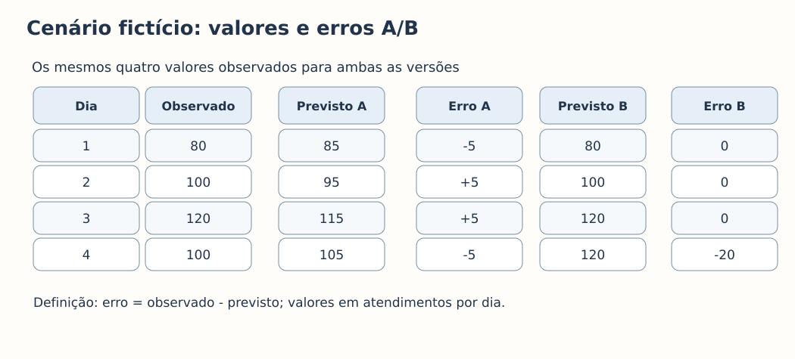
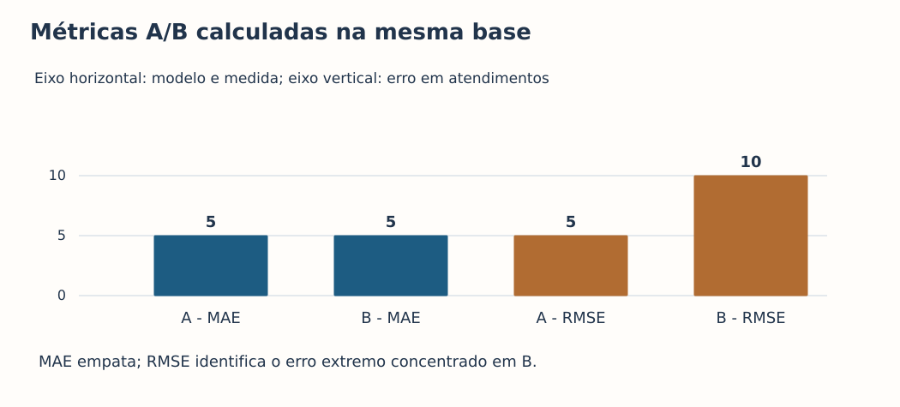
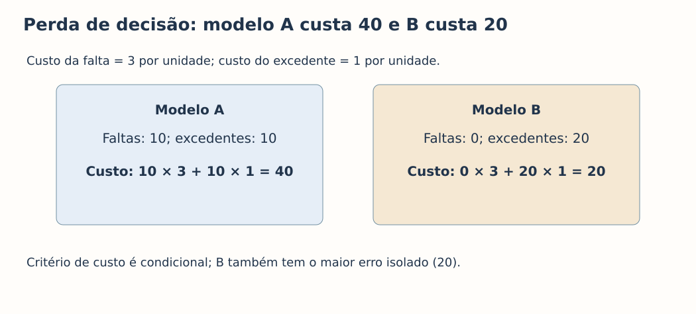
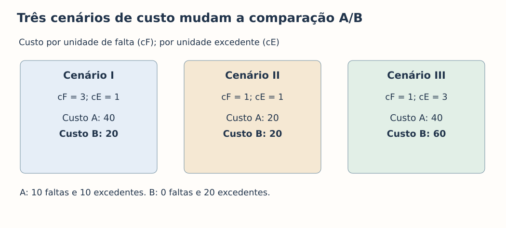
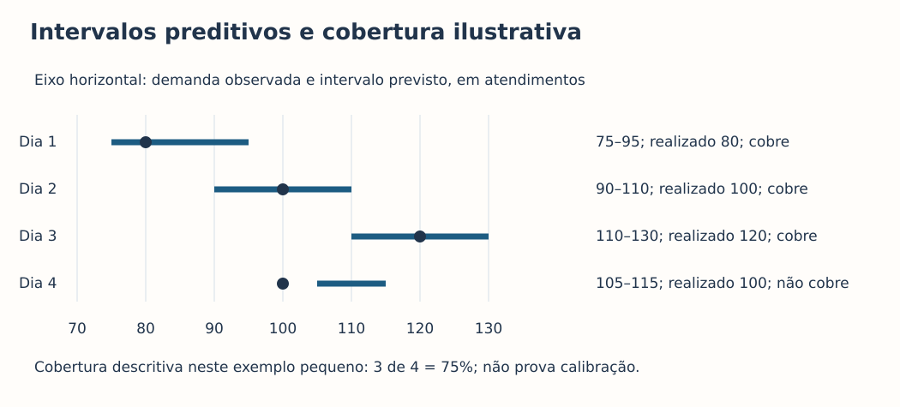
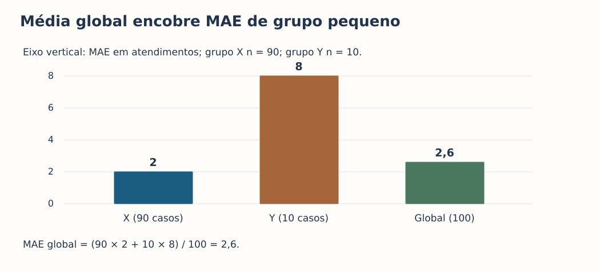
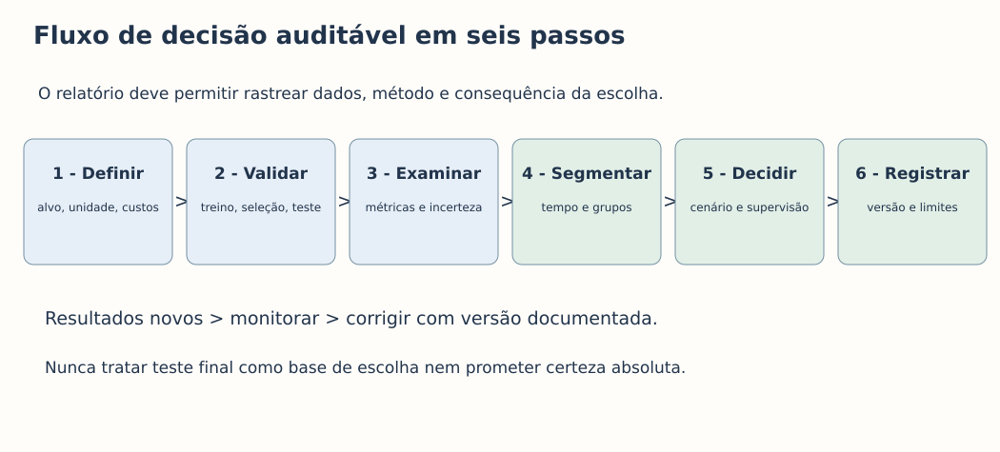

# MAT-EST-033 — Oficina de comunicação e decisão com modelos preditivos: cenários, erros, incerteza e documentação reprodutível

**Tempo sugerido:** três blocos de 25 a 50 minutos. **Origem:** aula autoral, exemplos inteiramente fictícios e 36 questões autorais. As habilidades de leitura de gráficos e interpretação quantitativa se relacionam à Educação Básica e à preparação para vestibulares; a avaliação operacional e documentação de modelos são aprofundamento e ponte universitária, não uma reprodução literal do programa de qualquer exame.

## 1. Objetivo e pré-requisitos

Objetivo: distinguir qualidade estatística de consequência de decisão, calcular e comunicar erros, construir cenários com funções de perda, interpretar incerteza e registrar uma avaliação reproduzível. Revisar MAT-EST-027 (resíduos), MAT-EST-030 (interpretação de modelos), MAT-EST-031 (treino, validação e teste) e MAT-EST-032 (métricas, incerteza, monitoramento). Se os cálculos do MAE e RMSE não estiverem firmes, retomar esses fundamentos antes de prosseguir.

## 2. Por que existe esta oficina?

Uma previsão é uma descrição quantitativa de um resultado ainda desconhecido. Uma decisão é uma escolha realizada sob restrições e consequências. Não existe regra matemática universal que transforme automaticamente a menor métrica de erro na melhor ação em todo cenário. Uma mesma diferença entre observado e previsto pode gerar consequências diferentes quando se trata de capacidade insuficiente, excesso de recursos, manutenção ou orçamento. Precisamos declarar a pergunta, a função de perda, a unidade e o período da avaliação.

O estudo será feito com dados **didáticos fictícios**, nunca apresentados como pesquisa efetivamente realizada. Imagine a previsão do número de atendimentos por dia de uma equipe. A decisão ilustrativa será reservar uma capacidade igual à previsão. Isso não representa orientação real de dimensionamento, e não substitui avaliação operacional e supervisão humana.

## 3. Exemplo central — quatro dias, duas previsões

| Dia | Observado | Previsto A | Erro A | Previsto B | Erro B |
|---|---:|---:|---:|---:|---:|
| 1 | 80 | 85 | −5 | 80 | 0 |
| 2 | 100 | 95 | +5 | 100 | 0 |
| 3 | 120 | 115 | +5 | 120 | 0 |
| 4 | 100 | 105 | −5 | 120 | −20 |

As duas métricas principais deste exemplo são `MAE = (Σ |eᵢ|)/n`, leitura: soma dos módulos dos erros dividida pela quantidade de previsões; e `RMSE = √[(Σ eᵢ²)/n]`, leitura: raiz quadrada da média dos erros elevados ao quadrado. O índice i identifica cada observação e n é a quantidade total de observações. Ambas têm a unidade da resposta.

Definição: `e = observado − previsto`. Leitura: erro é o valor observado menos o valor previsto. Erro positivo significa subestimar a demanda; erro negativo significa superestimá-la. A soma dos módulos de cada versão é vinte. Logo, **ambas têm MAE igual a cinco atendimentos**. Mas A distribui quatro erros de cinco, enquanto B concentra um erro de vinte. O erro quadrático médio de A é vinte e cinco; de B é cem. Portanto, o **RMSE de A é cinco e o de B é dez atendimentos**. Não compare unidades monetárias de custo com unidades de erro sem contextualizar a função de decisão.

**Figura 1 — Cenário fictício:** veja os quatro valores observados e as duas previsões. A versão B acerta três dias, mas no último supera o realizado em vinte atendimentos. A legenda e o quadro contêm todos os números necessários para estudo por áudio.

**Figura 2 — MAE e RMSE:** as duas versões têm MAE de cinco; o RMSE de B é dez, contra cinco de A. O eixo horizontal identifica versão e métrica, e o vertical informa erros em atendimentos. O contraste é explicado pelos números, não apenas pela cor.

## 4. Da métrica à decisão: função de perda

Suponha que reservar uma unidade a menos do que a demanda efetiva tenha custo fictício de três unidades monetárias, ao passo que reservar uma unidade excedente tenha custo de uma. Denote `F = max(observado − previsto, 0)`, o total de faltas em cada caso; `S = max(previsto − observado, 0)`, o excedente. A função de custo é:

`C = 3 × soma(F) + 1 × soma(S)`.

Leitura: custo igual a três vezes a quantidade acumulada de faltas, mais uma vez a quantidade acumulada de excedentes. Estes são coeficientes didáticos, não preços reais. Na versão A há dez unidades de falta e dez de excedente: `3 × 10 + 1 × 10 = 40`. Na B há zero faltas e vinte excedentes: `3 × 0 + 1 × 20 = 20`. Neste cenário específico, B tem custo menor, apesar do RMSE maior. Isso não é indicação universal de escolha, e seu erro máximo continua sendo importante.

**Figura 3 — Custo condicional:** A gera custo 40 e B custo 20 sob os coeficientes declarados. Observe separadamente faltas e excedentes; os valores só têm sentido no cenário proposto.

### Análise de sensibilidade: e se os custos mudarem?

No cenário I, falta custa três e excedente um: A custa quarenta, B vinte. No cenário II, ambos custam um: as versões empatam em vinte. No cenário III, falta custa um e excedente três: A custa quarenta e B sessenta. Os dados e os MAE não mudaram; apenas as consequências atribuídas a cada tipo de erro foram alteradas.

**Figura 6 — Sensibilidade:** os três quadros apresentam parâmetros e custos explícitos. A síntese auditiva é: resultados de avaliação dependem do objetivo definido, e nenhuma métrica isolada determina a decisão.

## 5. Linha de base e avaliação honesta

Uma linha de base (baseline) é uma alternativa simples, conhecida, usada como referência. Se uma regra previsse cem atendimentos todos os dias, seus erros absolutos seriam vinte, zero, vinte e zero: `MAE = 40/4 = 10`. Os erros quadráticos seriam quatrocentos, zero, quatrocentos e zero: `RMSE = raiz de (800/4)`, ou aproximadamente **14,14 atendimentos**. Comparar A, B e a linha de base requer avaliar todos nos mesmos dias, com a mesma variável e o mesmo horizonte. Um teste usado para selecionar o modelo deixa de ser um teste final independente. Separe treinamento, validação e teste e evite normalizações que aprendam com dados futuros.

## 6. Incerteza: previsão pontual não é promessa

A previsão pontual é um número, mas qualquer nova observação está sujeita a variabilidade. Um intervalo preditivo agrega incerteza de estimação e variação individual sob as hipóteses adotadas. É diferente do intervalo para a resposta média, que não incorpora da mesma forma a variação de cada novo caso. Dizer que uma faixa tem **cobertura nominal** de noventa por cento não demonstra, sozinho, que ela atingirá essa frequência em uma população diferente.

Em um exemplo puramente ilustrativo, as faixas 75 a 95, 90 a 110, 110 a 130 e 105 a 115 são confrontadas com realizados 80, 100, 120 e 100. As três primeiras incluem o valor realizado; a última não. A cobertura observada é três de quatro, **75%**, uma descrição de apenas quatro situações, insuficiente para afirmar calibração populacional.

**Figura 4 — Quatro intervalos:** o ponto realizado aparece em três das quatro faixas. Eixo horizontal em atendimentos, com marcação de setenta a cento e trinta. O exemplo é conceitual e não pretende produzir intervalos estatísticos calculados a partir dos quatro dias anteriores.

## 7. Monitoramento por tempo e grupo

O desempenho de um modelo deve ser verificado quando os resultados verdadeiros estiverem disponíveis. Mudança apenas nas entradas é um sinal de investigação, **não uma medida direta de MAE**, porque essa métrica requer observado e previsto emparelhados. Por exemplo, se uma faixa com cobertura nominal de noventa por cento cobriu 18/20 situações numa janela e 14/20 na seguinte, as frequências observadas foram noventa e setenta por cento: uma queda de **vinte pontos percentuais**, sem que esses dados isolados identifiquem sua causa.

A agregação por grupo também pode esconder diferenças. Suponha noventa registros do grupo X com MAE dois e dez do grupo Y com MAE oito. A média global ponderada é `(90×2 + 10×8)/100 = 2,6`. Informar apenas 2,6 oculta a experiência de Y, além da maior incerteza que costuma acompanhar amostras pequenas.

**Figura 5 — Grupos:** barras identificam X com MAE dois, Y com MAE oito e valor global de 2,6 atendimentos. O eixo vertical usa a mesma unidade do alvo; tamanhos de grupo aparecem escritos.

## 8. Como redigir conclusões quantitativas

Uma conclusão reproduzível precisa dizer *o que foi medido*, *onde*, *quando*, *sobre quem*, *com qual referência*, *qual incerteza*, *quais hipóteses* e *quais limitações*. Evite frases como “o modelo prevê corretamente sempre” ou “um R² alto prova causalidade”. Uma formulação defensável para este caso é: “Em quatro dias fictícios, A e B obtiveram MAE de cinco atendimentos. A teve RMSE cinco e B dez. Para a perda simulada em que falta custa três por unidade e excedente custa um, os custos respectivos foram quarenta e vinte. A comparação depende dessa função de perda e não substitui avaliação de dados adicionais, erros extremos, grupos e períodos”.

Também evite confundir significância estatística com tamanho de efeito, associação com causalidade e desempenho de teste com garantia futura. Não deduza segurança, justiça ou qualidade operacional apenas de uma métrica.

## 9. Cartão de documentação reprodutível

Registre: pergunta e decisão pretendida; unidade, alvo e horizonte; população e fonte dos dados; período, tamanho e condições de coleta; código e versão do modelo; variáveis e transformações; separação treino/validação/teste ou divisão temporal; critérios de seleção estabelecidos antes do teste; baseline e métricas; incerteza e cobertura; resultados por período e grupo; função de perda e cenários; responsáveis, data e limitações. Quando houver dados pessoais, não os reproduza no relatório: documente tratamento e acesso de modo compatível com a privacidade.

**Figura 7 — Protocolo em seis etapas:** definir, validar, examinar, segmentar, decidir com supervisão e registrar. A avaliação final preservada não deve ser utilizada repetidamente para escolher o modelo.

## 10. Erros frequentes e remediação

| Erro frequente | Por que está errado | Retomada |
|---|---|---|
| Escolher usando apenas MAE | Oculta distribuição e consequência do erro | Revisar MAT-EST-032 e o exemplo A/B |
| Interpretar erro positivo como excedente | Nesta aula, `e = observado − previsto`; positivo indica falta se a previsão define capacidade | Refazer Figura 1 |
| Dizer que intervalo preditivo garante valor | A faixa depende de método, nível nominal e hipóteses | Rever MAT-EST-020 e MAT-EST-032 |
| Misturar meses e dias sem ajustar a unidade | Torna métricas incomparáveis | Revisar definição de alvo e horizonte |
| Declarar melhora de MAE só pela mudança de entradas | MAE exige resposta efetiva | Revisar seção 7 |
| Escolher um modelo após consultar repetidamente o teste final | Contamina avaliação independente | Retomar MAT-EST-031 |
| Relatar somente a média global | Pode esconder diferenças por grupo e período | Refazer Figura 5 |
| Atribuir causalidade a bom ajuste | Qualidade de previsão não comprova mecanismo causal | Retomar MAT-EST-026 e 030 |

## 11. Exercícios graduais

A resolução deve ocorrer preferencialmente no site, em blocos de 25 a 50 minutos. O arquivo `exercicios.json` contém 36 questões autorais distintas: dez de aprendizagem (`APR`), dez de consolidação (`CON`), dez de transferência (`VES`) e seis de reteste independente (`RET`). A seguir estão seus enunciados, e as correções comentadas ficam em seção separada, para evitar antecipar o resultado ao estudante.

### Aprendizagem básica

**MAT-EST-033-EX-APR-01 — Finalidade da previsão.** Uma equipe prevê 100 atendimentos amanhã. Isso é um dado observado, uma previsão ou uma decisão? Explique.

**MAT-EST-033-EX-APR-02 — Erro com sinal.** Observado 120 e previsto 115 atendimentos. Definindo e = observado − previsto, calcule o erro e interprete.

**MAT-EST-033-EX-APR-03 — Mesmo MAE.** Dados observados: 80, 100, 120, 100. Previsões A: 85, 95, 115, 105. Calcule os quatro erros absolutos e o MAE.

**MAT-EST-033-EX-APR-04 — Erro concentrado.** No mesmo conjunto observado, previsões B: 80, 100, 120, 120. Calcule o MAE e o maior erro absoluto.

**MAT-EST-033-EX-APR-05 — RMSE comparado.** A tem quatro erros de módulo cinco; B tem módulos 0, 0, 0, 20. Calcule RMSE para ambas.

**MAT-EST-033-EX-APR-06 — Erro assimétrico.** Em previsão de capacidade, qual erro produz falta de vagas: previsto maior ou menor que observado? Use e = observado − previsto.

**MAT-EST-033-EX-APR-07 — Unidade e horizonte.** Um relatório diz “MAE = 5” sem unidade nem período. Que duas informações mínimas devem ser acrescentadas?

**MAT-EST-033-EX-APR-08 — Intervalo preditivo.** Uma previsão pontual é 100 com intervalo preditivo de 90 a 110 atendimentos. É correto dizer que sempre haverá exatamente 100?

**MAT-EST-033-EX-APR-09 — Base de comparação.** Um modelo tem MAE de 5 e a previsão simples de 100 em todos os dias tem MAE de 10. Por que citar a referência?

**MAT-EST-033-EX-APR-10 — Registro reprodutível.** Cite quatro campos necessários para outra pessoa reproduzir uma avaliação de previsões.

### Consolidação

**MAT-EST-033-EX-CON-01 — Custo A.** Considere A com erros assinados −5,+5,+5,−5. Cada unidade de demanda descoberta custa 3 unidades monetárias; cada excedente custa 1. Calcule o custo total.

**MAT-EST-033-EX-CON-02 — Custo B.** Para B, os erros assinados são 0,0,0,−20. Sob os mesmos custos (falta = 3; excedente = 1), determine o total.

**MAT-EST-033-EX-CON-03 — Comparação de decisões.** A e B possuem MAE igual a cinco; RMSE de A é cinco e de B dez. Sob as perdas assimétricas do exemplo, qual possui menor custo? Isso torna B universalmente melhor?

**MAT-EST-033-EX-CON-04 — Baseline fixa.** Os observados são 80,100,120,100. Uma referência prevê 100 em todos os dias. Calcule seu MAE e RMSE.

**MAT-EST-033-EX-CON-05 — Custo condicionado.** Se o custo da falta cair de 3 para 1, mantendo custo do excedente igual a 1, qual o custo de A e B?

**MAT-EST-033-EX-CON-06 — Cobertura descritiva.** Quatro intervalos para dias futuros contêm o valor observado em três ocasiões. Qual a cobertura observada? Isso comprova calibração de 75%?

**MAT-EST-033-EX-CON-07 — Mudança de cobertura.** A cobertura de uma faixa nominalmente 90% foi 18/20 na janela anterior e 14/20 na recente. Calcule as duas frequências observadas e a variação em pontos percentuais.

**MAT-EST-033-EX-CON-08 — Média global por grupo.** Noventa registros do grupo X têm MAE 2; dez do grupo Y têm MAE 8. Determine o MAE global ponderado.

**MAT-EST-033-EX-CON-09 — Governança do teste.** Uma equipe consultou o conjunto de teste cinco vezes e, com base nele, escolheu o modelo vencedor. Por que o número final pode ser otimista?

**MAT-EST-033-EX-CON-10 — Conclusão delimitada.** Reescreva: “Nosso modelo reduz erros em todas as situações, pois obteve MAE 5”.

### Transferência contextualizada e estilo vestibular (questões autorais)

**MAT-EST-033-EX-VES-01 — Planejamento de escala (autoral, estilo contextualizado).** Uma equipe aloca capacidade conforme previsão. Modelo A tem erros −5,+5,+5,−5 e B tem 0,0,0,−20. Cada falta custa três vezes um excedente. Determine MAE, RMSE e custo por modelo; redija conclusão condicional.

**MAT-EST-033-EX-VES-02 — Previsão econômica com horizontes distintos (autoral).** Um relatório compara MAE de 3 reais por produto em previsões diárias com MAE de 4 mil reais em previsões mensais de receita. Por que não é uma comparação direta?

**MAT-EST-033-EX-VES-03 — Monitoramento sem rótulo (autoral).** O perfil das entradas de um modelo mudou, mas as respostas verdadeiras só serão conhecidas após 30 dias. Pode-se afirmar agora que o MAE dobrou?

**MAT-EST-033-EX-VES-04 — Janela temporal justa (autoral).** Dois sistemas são comparados, um avaliado em dias úteis e outro exclusivamente em feriados. A métrica do primeiro é menor. Qual problema de desenho e correção?

**MAT-EST-033-EX-VES-05 — Risco de erro extremo (autoral).** Um modelo tem MAE baixo e um único erro de 60 unidades num evento raro, mas relevante. O que deve constar do relatório além do MAE?

**MAT-EST-033-EX-VES-06 — Intervalo e compromisso (autoral).** Modelo informa 100 atendimentos com faixa preditiva [85,115], de nível nominal 90%. Escreva uma frase que preserve a distinção entre previsão, faixa e garantia.

**MAT-EST-033-EX-VES-07 — Decisão por grupos (autoral).** Grupo X tem 90 casos e MAE 2; Y tem dez casos e MAE 8. O MAE agregado é 2,6. É suficiente relatar apenas 2,6?

**MAT-EST-033-EX-VES-08 — Vazamento por janela futura (autoral).** A média do mês completo é calculada para normalizar previsões feitas no primeiro dia do mesmo mês. Qual falha e como corrigi-la?

**MAT-EST-033-EX-VES-09 — Auditoria de relatório (autoral).** Um relatório contém só a frase “R² = 0,92, portanto o método causa crescimento”. Aponte pelo menos quatro lacunas.

**MAT-EST-033-EX-VES-10 — Memorando reprodutível (autoral, estilo discursivo).** Redija um minirrelatório para o exemplo A/B que inclua dados, custo, conclusão e próximos controles de qualidade.

### Reteste independente após recuperação

**MAT-EST-033-EX-RET-01 — R1 — Estoque (independente).** Em três dias, a venda observada foi 20,30,40 e a previsão 18,35,37. Usando erro observado menos previsto, calcule erros, MAE e RMSE.

**MAT-EST-033-EX-RET-02 — R2 — Custo de estoque (independente).** No reteste anterior, a falta custa quatro unidades monetárias por item e sobra custa duas. Quanto custaram os três dias?

**MAT-EST-033-EX-RET-03 — R3 — Cobertura nova (independente).** Em 50 intervalos preditivos novos, 44 incluíram o realizado. Determine a cobertura observada e uma limitação da conclusão.

**MAT-EST-033-EX-RET-04 — R4 — Segmentos novos (independente).** Grupo A: 40 casos com MAE 3. Grupo B: dez casos com MAE 7. Calcule MAE agregado e descreva um cuidado.

**MAT-EST-033-EX-RET-05 — R5 — Comparação indevida (independente).** Um modelo foi escolhido após analisar repetidamente resultados do teste final. O que deveria ter sido preservado e que tipo de problema surgiu?

**MAT-EST-033-EX-RET-06 — R6 — Conclusão responsável (independente).** Uma equipe reporta: “O erro foi 4, logo o sistema é seguro”. Reescreva com quatro informações que faltam.

## 12. Correção comentada — consultar após tentativa real

Cada item apresenta resultado, raciocínio e um possível diagnóstico de erro. O diagnóstico é uma hipótese pedagógica genérica, **não** uma classificação de uma resposta pessoal ainda inexistente. Não registrar notas, tentativas, revisões executadas ou consolidação a partir da produção deste arquivo.

### Correções — Aprendizagem

**MAT-EST-033-EX-APR-01 — Finalidade da previsão.** Resposta: Previsão, não observação nem decisão.

1. 100 é uma estimativa para um resultado futuro ainda desconhecido.
2. A decisão (por exemplo, reservar capacidade) depende de objetivos, recursos e perdas possíveis, além da previsão.

*Se houver erro, verificar especialmente: interpretação — Distinguir dado observado, previsão, hipótese, incerteza e decisão; reler a unidade.*

**MAT-EST-033-EX-APR-02 — Erro com sinal.** Resposta: e = +5; houve subestimação de cinco.

1. 120 − 115 = +5.
2. Como o previsto ficou abaixo do observado, a demanda foi subestimada.

*Se houver erro, verificar especialmente: cálculo — Refazer os cálculos com a fórmula escrita, conferir sinais, divisão e unidade.*

**MAT-EST-033-EX-APR-03 — Mesmo MAE.** Resposta: Erros absolutos: 5, 5, 5, 5; MAE = 5 atendimentos.

1. Módulos de 80−85, 100−95, 120−115 e 100−105 são quatro valores iguais a cinco.
2. MAE = (5+5+5+5)/4 = 5 atendimentos.

*Se houver erro, verificar especialmente: cálculo — Refazer os cálculos com a fórmula escrita, conferir sinais, divisão e unidade.*

**MAT-EST-033-EX-APR-04 — Erro concentrado.** Resposta: MAE = 5 atendimentos; maior erro = 20 atendimentos.

1. Módulos são 0, 0, 0, 20, cuja soma é 20.
2. MAE = 20/4 = 5, embora o último erro isolado alcance vinte.

*Se houver erro, verificar especialmente: cálculo — Refazer os cálculos com a fórmula escrita, conferir sinais, divisão e unidade.*

**MAT-EST-033-EX-APR-05 — RMSE comparado.** Resposta: RMSE de A = 5; RMSE de B = 10 atendimentos.

1. A: quadrados somam 4 × 25 = 100; MSE = 25; raiz = 5.
2. B: quadrados somam 400; MSE = 100; raiz = 10.

*Se houver erro, verificar especialmente: cálculo — Refazer os cálculos com a fórmula escrita, conferir sinais, divisão e unidade.*

**MAT-EST-033-EX-APR-06 — Erro assimétrico.** Resposta: Previsto menor que observado, isto é, e positivo.

1. Se o realizado supera o planejado, há demanda que não foi coberta.
2. O sinal indica direção; o custo depende das condições do problema.

*Se houver erro, verificar especialmente: interpretação — Distinguir dado observado, previsão, hipótese, incerteza e decisão; reler a unidade.*

**MAT-EST-033-EX-APR-07 — Unidade e horizonte.** Resposta: Unidade do alvo (por exemplo, atendimentos por dia) e período/população de avaliação.

1. A métrica herda a unidade da variável prevista.
2. Uma estimativa depende do conjunto e da janela temporal em que foi medida.

*Se houver erro, verificar especialmente: interpretação — Distinguir dado observado, previsão, hipótese, incerteza e decisão; reler a unidade.*

**MAT-EST-033-EX-APR-08 — Intervalo preditivo.** Resposta: Não. Cem é o ponto previsto; intervalo comunica incerteza sob método e hipóteses declarados.

1. Ponto previsto e faixa não são observações futuras garantidas.
2. A interpretação de cobertura exige método, nível nominal e validação em novos dados.

*Se houver erro, verificar especialmente: interpretação — Distinguir dado observado, previsão, hipótese, incerteza e decisão; reler a unidade.*

**MAT-EST-033-EX-APR-09 — Base de comparação.** Resposta: Porque o ganho é interpretável frente a uma alternativa comparável.

1. Uma métrica isolada não informa se o sistema supera uma regra trivial.
2. Ambas as medições precisam usar o mesmo conjunto e unidades.

*Se houver erro, verificar especialmente: interpretação — Distinguir dado observado, previsão, hipótese, incerteza e decisão; reler a unidade.*

**MAT-EST-033-EX-APR-10 — Registro reprodutível.** Resposta: Por exemplo: versão do modelo, período e origem dos dados, definição do alvo e divisão treino/validação/teste.

1. Sem identificar a versão e os dados, resultados diferentes não podem ser confrontados.
2. Registrar também código/transformações, métricas, grupos, limites e data de execução.

*Se houver erro, verificar especialmente: memória — Reconstruir a definição e a justificativa antes de consultar a expressão pronta.*

### Correções — Consolidação

**MAT-EST-033-EX-CON-01 — Custo A.** Resposta: 40 unidades monetárias.

1. As faltas somam 5+5=10; custo = 10×3=30.
2. Os excedentes somam 5+5=10; custo = 10×1=10. Total = 40.

*Se houver erro, verificar especialmente: cálculo — Refazer os cálculos com a fórmula escrita, conferir sinais, divisão e unidade.*

**MAT-EST-033-EX-CON-02 — Custo B.** Resposta: 20 unidades monetárias.

1. Não existe falta, logo seu custo é zero.
2. Há vinte unidades excedentes, com custo de vinte.

*Se houver erro, verificar especialmente: cálculo — Refazer os cálculos com a fórmula escrita, conferir sinais, divisão e unidade.*

**MAT-EST-033-EX-CON-03 — Comparação de decisões.** Resposta: B tem custo 20 contra 40 de A; não é universalmente melhor.

1. Os números de perda escolhem B nesta situação específica.
2. Outra função de perda, outra população ou restrição operacional pode mudar a comparação; reportar também erro extremo.

*Se houver erro, verificar especialmente: interpretação — Distinguir dado observado, previsão, hipótese, incerteza e decisão; reler a unidade.*

**MAT-EST-033-EX-CON-04 — Baseline fixa.** Resposta: MAE = 10; RMSE = √200 ≈ 14,14 atendimentos.

1. Módulos: 20,0,20,0, soma quarenta; MAE = 10.
2. Quadrados: 400,0,400,0; MSE = 800/4 = 200; RMSE ≈ 14,14.

*Se houver erro, verificar especialmente: cálculo — Refazer os cálculos com a fórmula escrita, conferir sinais, divisão e unidade.*

**MAT-EST-033-EX-CON-05 — Custo condicionado.** Resposta: Ambos terão custo total 20.

1. A: dez unidades de falta + dez de excedente = 20.
2. B: vinte unidades de excedente = 20. A mudança da função de perda altera a comparação.

*Se houver erro, verificar especialmente: cálculo — Refazer os cálculos com a fórmula escrita, conferir sinais, divisão e unidade.*

**MAT-EST-033-EX-CON-06 — Cobertura descritiva.** Resposta: 3/4 = 75%; não comprova calibração em geral.

1. Cobertura amostral = intervalos que cobriram / total = 3/4.
2. Amostra pequena e método de seleção exigem cautela; não inferir garantia de cobertura futura.

*Se houver erro, verificar especialmente: cálculo — Refazer os cálculos com a fórmula escrita, conferir sinais, divisão e unidade.*

**MAT-EST-033-EX-CON-07 — Mudança de cobertura.** Resposta: 90%, 70%, queda de 20 pontos percentuais.

1. 18 dividido por vinte é 0,90; 14 dividido por vinte é 0,70.
2. 0,70 − 0,90 = −0,20, isto é, menos vinte pontos percentuais. Não concluir causa da queda sem investigação.

*Se houver erro, verificar especialmente: cálculo — Refazer os cálculos com a fórmula escrita, conferir sinais, divisão e unidade.*

**MAT-EST-033-EX-CON-08 — Média global por grupo.** Resposta: (90×2 + 10×8)/100 = 2,6 atendimentos.

1. As somas absolutas por grupo são 180 e 80.
2. A soma total 260 dividida por cem gera 2,6, mas esconde o valor oito do grupo Y.

*Se houver erro, verificar especialmente: cálculo — Refazer os cálculos com a fórmula escrita, conferir sinais, divisão e unidade.*

**MAT-EST-033-EX-CON-09 — Governança do teste.** Resposta: O teste final deixou de ser independente da escolha do modelo.

1. As cinco consultas influenciam a seleção e introduzem adaptação ao teste.
2. O protocolo deve usar validação para seleção e preservar teste final para avaliação única, ou redesenhar avaliação independente.

*Se houver erro, verificar especialmente: estratégia — Definir a pergunta e a consequência de cada erro antes de escolher o procedimento.*

**MAT-EST-033-EX-CON-10 — Conclusão delimitada.** Resposta: “No conjunto e período testados, o MAE foi 5 unidades; generalização, subgrupos e extremos exigem avaliação adicional.”

1. O MAE é média no conjunto observado; não garante cada caso.
2. Uma conclusão informa população, período, métrica, incerteza e limites.

*Se houver erro, verificar especialmente: interpretação — Distinguir dado observado, previsão, hipótese, incerteza e decisão; reler a unidade.*

### Correções — Transferência

**MAT-EST-033-EX-VES-01 — Planejamento de escala (autoral, estilo contextualizado).** Resposta: A: MAE 5, RMSE 5, custo 40. B: MAE 5, RMSE 10, custo 20. Sob essa função de perda, B gera menor custo, mas maior erro extremo.

1. Calcule média dos módulos: ambos vinte dividido por quatro, igual a cinco.
2. Quadrados: A soma cem, B soma quatrocentos; RMSE cinco e dez.
3. Custos: A dez faltas ×3 + dez sobras ×1 =40; B vinte sobras ×1 =20.
4. A conclusão depende da função de perda e não identifica um modelo universalmente superior.

*Se houver erro, verificar especialmente: estratégia — Definir a pergunta e a consequência de cada erro antes de escolher o procedimento.*

**MAT-EST-033-EX-VES-02 — Previsão econômica com horizontes distintos (autoral).** Resposta: Alvos, escalas, unidades e horizontes distintos invalidam a comparação numérica direta.

1. Os dois números têm dimensões distintas.
2. Definir mesmo alvo, unidade, horizonte, período e baseline, ou usar critérios adequados ao objetivo.

*Se houver erro, verificar especialmente: interpretação — Distinguir dado observado, previsão, hipótese, incerteza e decisão; reler a unidade.*

**MAT-EST-033-EX-VES-03 — Monitoramento sem rótulo (autoral).** Resposta: Não. Detectou-se mudança nas entradas; MAE requer valores observados e previstos emparelhados.

1. MAE usa |observado − previsto|; sem observado o erro ainda não está disponível.
2. Registrar alerta de mudança de distribuição e reavaliar quando chegarem resultados reais.

*Se houver erro, verificar especialmente: interpretação — Distinguir dado observado, previsão, hipótese, incerteza e decisão; reler a unidade.*

**MAT-EST-033-EX-VES-04 — Janela temporal justa (autoral).** Resposta: Conjuntos não equivalentes; avaliar ambos sobre os mesmos períodos e unidades, idealmente com estratos temporais.

1. Dias úteis e feriados podem ter dificuldade diferente.
2. Comparação controlada usa o mesmo conjunto retido, métricas e análise por segmento.

*Se houver erro, verificar especialmente: estratégia — Definir a pergunta e a consequência de cada erro antes de escolher o procedimento.*

**MAT-EST-033-EX-VES-05 — Risco de erro extremo (autoral).** Resposta: Distribuição e máximo dos erros, frequência de extremos, contexto operacional e critérios de custo/segurança.

1. A média pode ocultar a cauda dos erros.
2. Uma decisão exige considerar quem é afetado e o impacto de falhas raras sem inferir probabilidade com um evento isolado.

*Se houver erro, verificar especialmente: interpretação — Distinguir dado observado, previsão, hipótese, incerteza e decisão; reler a unidade.*

**MAT-EST-033-EX-VES-06 — Intervalo e compromisso (autoral).** Resposta: “A estimativa pontual é 100; a faixa 85–115 busca a cobertura nominal de 90% sob o método e suas hipóteses, mas não garante o valor futuro.”

1. A faixa não equivale à certeza de estar contida.
2. A cobertura nominal deve ser conferida em observações novas e população compatível.

*Se houver erro, verificar especialmente: interpretação — Distinguir dado observado, previsão, hipótese, incerteza e decisão; reler a unidade.*

**MAT-EST-033-EX-VES-07 — Decisão por grupos (autoral).** Resposta: Não; relatar tamanhos e erros separados, investigando qualidade, distribuição e possíveis consequências no grupo Y.

1. O agregado ponderado encobre heterogeneidade.
2. Dez observações também geram maior incerteza na estimativa do subgrupo.

*Se houver erro, verificar especialmente: interpretação — Distinguir dado observado, previsão, hipótese, incerteza e decisão; reler a unidade.*

**MAT-EST-033-EX-VES-08 — Vazamento por janela futura (autoral).** Resposta: Uso de informação futura indisponível no instante da previsão; calcular transformação somente com dados disponíveis até a data de corte.

1. A média do mês completo conhece dias futuros.
2. Na validação temporal, todas as etapas de preprocessamento devem respeitar a disponibilidade histórica.

*Se houver erro, verificar especialmente: estratégia — Definir a pergunta e a consequência de cada erro antes de escolher o procedimento.*

**MAT-EST-033-EX-VES-09 — Auditoria de relatório (autoral).** Resposta: R² não demonstra causalidade; faltam conjunto retido, baseline, unidade/alvo, período, erro fora da amostra, incerteza e diagnóstico.

1. R² mede ajuste relativo à variabilidade observada sob uma definição, não causalidade.
2. Documentar estudo, grupos, hipótese e limitações antes de concluir.

*Se houver erro, verificar especialmente: conteúdo — Rever a definição e sua condição de uso antes de selecionar uma métrica ou conclusão.*

**MAT-EST-033-EX-VES-10 — Memorando reprodutível (autoral, estilo discursivo).** Resposta: Resposta-modelo: “Em quatro dias fictícios, ambos tiveram MAE de cinco atendimentos; A teve RMSE cinco e B dez. Com falta custando três por unidade e excedente um, custos foram 40 e 20. A condição favorece B no custo simulado, mas deve-se medir extremos, amostras novas e cobertura de intervalos antes do uso.”

1. Explicite cenário fictício e origem dos números.
2. Apresente métricas e função de perda, não apenas o resultado selecionado.
3. Acrescente limitações, grupos, horizonte, dados adicionais e registro da versão.

*Se houver erro, verificar especialmente: estratégia — Definir a pergunta e a consequência de cada erro antes de escolher o procedimento.*

### Correções — Reteste

**MAT-EST-033-EX-RET-01 — R1 — Estoque (independente).** Resposta: Erros 2,−5,3; MAE = 10/3 ≈ 3,33 unidades; RMSE = √(38/3) ≈ 3,56 unidades.

1. Erros: 20−18=2; 30−35=−5; 40−37=3.
2. MAE = (2+5+3)/3 = 10/3.
3. Quadrados: 4+25+9=38; MSE=38/3; raiz aproximadamente 3,56.

*Se houver erro, verificar especialmente: cálculo — Refazer os cálculos com a fórmula escrita, conferir sinais, divisão e unidade.*

**MAT-EST-033-EX-RET-02 — R2 — Custo de estoque (independente).** Resposta: Custo = (2+3)×4 + 5×2 = 30 unidades monetárias.

1. Erros positivos totalizam cinco unidades não atendidas, custo vinte.
2. O erro negativo cinco é estoque excedente, custo dez. Total trinta.

*Se houver erro, verificar especialmente: cálculo — Refazer os cálculos com a fórmula escrita, conferir sinais, divisão e unidade.*

**MAT-EST-033-EX-RET-03 — R3 — Cobertura nova (independente).** Resposta: 44/50 = 88%; amostra não garante cobertura populacional nem validade em outro período.

1. Cobertura empírica = 44 dividido por cinquenta = 0,88.
2. A interpretação depende do método, seleção dos casos e estabilidade temporal.

*Se houver erro, verificar especialmente: interpretação — Distinguir dado observado, previsão, hipótese, incerteza e decisão; reler a unidade.*

**MAT-EST-033-EX-RET-04 — R4 — Segmentos novos (independente).** Resposta: MAE global = (40×3 + 10×7)/50 = 3,8 unidades; reportar também MAE 7 em B.

1. Somatório ponderado = 120+70=190.
2. 190 dividido por cinquenta = 3,8; informar tamanho e incerteza por grupo.

*Se houver erro, verificar especialmente: cálculo — Refazer os cálculos com a fórmula escrita, conferir sinais, divisão e unidade.*

**MAT-EST-033-EX-RET-05 — R5 — Comparação indevida (independente).** Resposta: Um conjunto final independente; a escolha contaminou o teste e pode gerar estimativa otimista.

1. Validação seleciona modelo; teste retido só avalia modelo congelado.
2. Repetir escolhas com o mesmo teste requer avaliação externa nova ou protocolo aninhado.

*Se houver erro, verificar especialmente: estratégia — Definir a pergunta e a consequência de cada erro antes de escolher o procedimento.*

**MAT-EST-033-EX-RET-06 — R6 — Conclusão responsável (independente).** Resposta: Exemplo: “O MAE foi 4 unidades na amostra e período X; sua adequação depende do baseline, erros extremos, incerteza e consequências das decisões; é necessário validar grupos e dados futuros.”

1. Indicar métrica e unidade, base e horizonte.
2. Distinguir utilidade, risco e condição de generalização; segurança não decorre de um número isolado.

*Se houver erro, verificar especialmente: interpretação — Distinguir dado observado, previsão, hipótese, incerteza e decisão; reler a unidade.*

## 13. Resumo para leitura em voz alta

Uma previsão não é uma observação e também não é uma decisão. A versão A distribui pequenos erros; B concentra um erro extremo. Por isso, embora ambas tenham erro absoluto médio de cinco, o erro quadrático médio e sua raiz mostram comportamentos diferentes. O custo de uma decisão depende de quanto custa faltar e de quanto custa sobrar; mudar esses preços hipotéticos pode inverter a comparação. É obrigatório informar unidade, grupo, período, referência e limites da incerteza. Intervalos precisam de verificação de cobertura; resultados de teste retido não devem ser usados repetidamente para escolher modelo. Documentar versões e dados é parte do rigor, não um detalhe decorativo.

## 14. Revisão ativa e espaçada

No primeiro contato, explique sem consultar: qual a diferença entre previsão e decisão? Por que A e B têm o mesmo MAE, mas RMSE diferente? Como mudar a função de perda altera a interpretação? O que uma cobertura observada de três em quatro permite dizer? O que precisa constar de um relatório reproduzível? Faça os exercícios de aprendizagem e consolidação. No dia seguinte, três dias depois, sete e quatorze dias depois do **estudo efetivo**, recupere as definições e refaça os retestes com novos contextos. A consolidação depende de tentativas individuais e evidência de transferência; a produção editorial não a concede automaticamente.

## 15. Vídeo complementar

**Título:** Video 8: Comparing the Model to the Experts. **Canal/instituição:** MIT OpenCourseWare; curso *The Analytics Edge*, professor Dimitris Bertsimas. **Idioma:** inglês. **Duração:** não confirmada na página institucional. **Quando assistir:** após estudar as seções quatro, cinco e oito. **Por que:** reforça a comparação de previsões com referências e a necessidade de avaliar a interpretação de um modelo. [Acessar o vídeo na página institucional do MIT](https://ocw.mit.edu/courses/15-071-the-analytics-edge-spring-2017/pages/linear-regression/the-statistical-sommelier-an-introduction-to-linear-regression/video-8-comparing-the-model-to-the-experts/). Página verificada; a reprodução integral do vídeo não foi testada. O vídeo é complementar: todo o conteúdo essencial está desenvolvido por escrito nesta aula.

## 16. Fontes e natureza do material

1. [Penn State — STAT 501, Model Building](https://online.stat.psu.edu/stat501/Lesson10), formulação de objetivos e avaliação de generalização.
2. [Penn State — STAT 501, Estimation & Prediction](https://online.stat.psu.edu/stat501/Lesson03), diferença entre estimativa da média e previsão de uma observação.
3. [scikit-learn — Model Evaluation](https://scikit-learn.org/stable/modules/model_evaluation.html), definições de métricas.
4. [scikit-learn — Common Pitfalls](https://scikit-learn.org/stable/common_pitfalls.html), prevenção de vazamento entre treino e teste.
5. [MIT OpenCourseWare — Comparing the Model to the Experts](https://ocw.mit.edu/courses/15-071-the-analytics-edge-spring-2017/pages/linear-regression/the-statistical-sommelier-an-introduction-to-linear-regression/video-8-comparing-the-model-to-the-experts/), vídeo complementar.

O conteúdo e todas as questões são **autorais**. Não há reprodução nem atribuição de exercícios específicos como se fossem itens oficiais do ENEM, FUVEST, UNICAMP ou UNESP.

## 17. Próximo passo e continuidade

Próximo tópico editorial proposto: **MAT-EST-034 — Projeto aplicado de síntese estatística: protocolo de análise, relatório interpretativo e avaliação de limites**. A sequência, seus IDs permanentes e o progresso anterior não devem ser apagados. MAT-EST-018, MAT-PRO-039 e MAT-PRO-054 continuam sem tentativas individuais registradas neste pacote.
