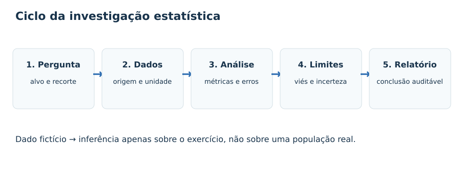
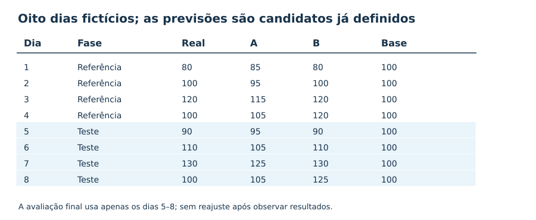
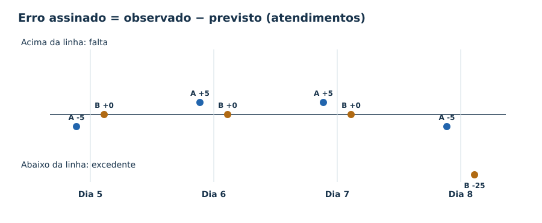
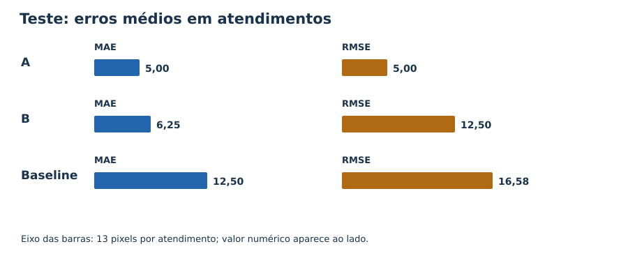
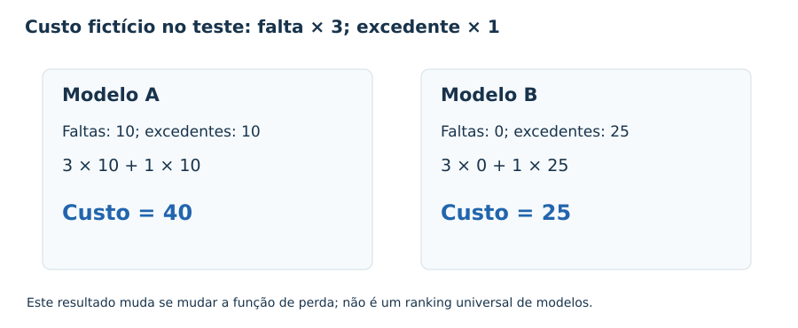
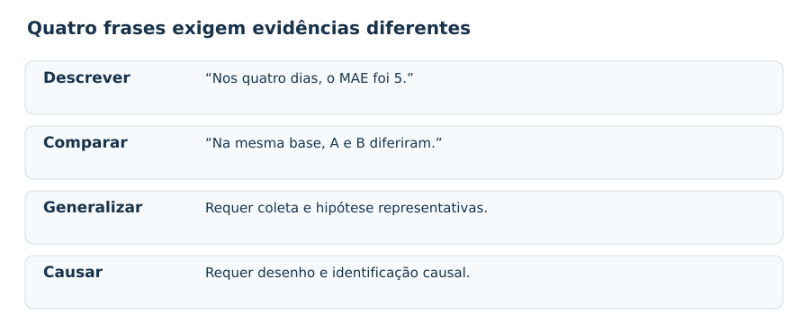

# MAT-EST-034 — Projeto aplicado de síntese estatística: protocolo de análise, relatório interpretativo e avaliação de limites

**Tempo recomendado:** quatro blocos de 25 a 50 minutos. **Origem:** projeto aplicado e dados inteiramente fictícios; os 36 exercícios também são autorais. **Nível:** os aspectos de interpretação de dados, gráficos e decisões dialogam com ENEM e vestibulares; protocolo reprodutível, diagnóstico de modelos e função de perda são aprofundamento e ponte universitária, não requisitos literais alegados de cada edital.

## 1. Objetivos e pré-requisitos

Ao final, você deverá ser capaz de formular uma pergunta quantitativa, definir população e unidade de análise, inspecionar uma base, diferenciar análise descritiva de inferência, calcular métricas reprodutíveis, interpretar resultados sob custos explícitos, identificar limitações e elaborar um relatório transparente. Pré-requisitos principais: MAT-EST-019, MAT-EST-020, MAT-EST-026, MAT-EST-027, MAT-EST-031, MAT-EST-032 e MAT-EST-033. Em caso de dificuldade, recupere a definição específica antes de prosseguir; ter lido o material não comprova domínio.

## 2. Por que existe um protocolo de análise?

Números não chegam prontos como argumentos: dependem de uma pergunta, de como foram registrados e de escolhas feitas antes da análise. Um relatório pode conter cálculos corretos e ainda assim generalizar indevidamente para uma população que não foi amostrada, usar o conjunto de teste para escolher o modelo ou esconder erros extremos numa média. Um projeto estatístico registra essa cadeia de decisões para que outra pessoa possa revisar e refazer as contas. A introdução a STAT 200, da Pennsylvania State University, enfatiza investigação, variabilidade e o cuidado ao generalizar resultados de amostras; STAT 501 trata da formulação e avaliação dos modelos [fontes 1 e 2].

**Figura 1 — Pergunta → dados → análise → limites → relatório.** Texto alternativo: cinco passos numerados. Observe que os limites têm etapa própria. A conclusão não deve ser maior que a evidência.

## 3. Estudo fictício integrado: previsão de atendimentos

**Pergunta:** como duas previsões candidatas, A e B, se comportaram em relação a uma referência simples nos quatro dias finais de um cenário inventado? A unidade de análise é um dia; o alvo é o número de atendimentos observado nesse dia; horizonte é o dia correspondente. Todas as observações e previsões abaixo são **inventadas apenas para ensinar cálculo**. Não são registros de unidade de saúde, município, população ou pessoa real.

As previsões A e B são candidatos didáticos declarados previamente, e **não** modelos estimados usando apenas os quatro registros de referência. A baseline (linha de base) prevê cem atendimentos em qualquer dia. A partição temporal é ilustrativa: dias 1 a 4 são referência, dias 5 a 8 são teste preservado. Em um estudo real, o treinamento, a seleção e as transformações precisariam ocorrer sem consultar resultados futuros.

| Dia | Partição | Observado | Previsto A | Previsto B | Baseline |
|---:|---|---:|---:|---:|---:|
| 1 | referência | 80 | 85 | 80 | 100 |
| 2 | referência | 100 | 95 | 100 | 100 |
| 3 | referência | 120 | 115 | 120 | 100 |
| 4 | referência | 100 | 105 | 120 | 100 |
| 5 | teste | 90 | 95 | 90 | 100 |
| 6 | teste | 110 | 105 | 110 | 100 |
| 7 | teste | 130 | 125 | 130 | 100 |
| 8 | teste | 100 | 105 | 125 | 100 |

**Leitura em voz alta da tabela:** os observados dos quatro dias de teste são noventa, cento e dez, cento e trinta e cem; as previsões A são noventa e cinco, cento e cinco, cento e vinte e cinco e cento e cinco; as previsões B são noventa, cento e dez, cento e trinta e cento e vinte e cinco. Cada linha possui uma previsão de cem na baseline.

**Figura 2 — Oito dias e três alternativas.** Observe os dias 5 a 8 separados do restante. O CSV `dados-ficticios.csv` e o arquivo `calculos-reproduziveis.json` permitem refazer as contas.

### Vocabulário essencial

**População-alvo:** universo ao qual se deseja generalizar. Aqui não há uma população real representada. **Amostra:** subconjunto observado segundo plano de coleta. **Unidade de análise:** um dia fictício. **Variável-alvo:** atendimentos observados. **Preditor:** informação disponível antes do resultado. **Teste final:** dados reservados para avaliar um procedimento congelado, não para ajustá-lo. **Viés de seleção:** distorção sistemática decorrente da maneira como dados foram incluídos. **Incerteza:** diferença possível entre resultado observado e o parâmetro ou evento futuro que se tenta estimar.

## 4. Protocolo de análise reproduzível, passo a passo

1. **Definir a pergunta:** prever atendimentos, sem alegar efeito causal da previsão sobre a demanda. Informar para quem o resultado seria útil e qual custo merece atenção.
2. **Definir escopo e coleta:** origem, período, unidade, critérios de inclusão, ausências, duplicatas e mudanças de instrumento. Nesta aula, tudo é sintético e está explicitamente marcado.
3. **Registrar dicionário:** dia; partição; observado; previsões A e B; baseline. Todas as quantidades de atendimentos são números não negativos por dia.
4. **Preservar partições:** o passado pode orientar o ajuste; a validação pode orientar escolhas; o teste final só avalia uma versão já fixada. Dados futuros não devem entrar na transformação do passado.
5. **Realizar análise descritiva:** média, mediana, mínimo, máximo, erro assinado e valores extremos. O objetivo é compreender o recorte antes de usar fórmulas inferenciais.
6. **Definir medidas previamente:** MAE e RMSE para magnitude; erro médio para sinal; perda assimétrica para um cenário decisório explicitado. Comparar candidatos nos mesmos dias.
7. **Examinar hipóteses:** horizonte, independência temporal, estabilidade, cobertura de períodos e grupos, qualidade do alvo e critérios de decisão. Sem desenho apropriado, não afirmar generalização ou causalidade.
8. **Comunicar e guardar:** tabela, gráficos, procedimento, fórmulas, versão, arquivos, limitações e próximo teste necessário.

## 5. Cálculos resolvidos e reproduzíveis

### 5.1 Descrição dos resultados realizados

A média dos quatro dias de teste é `(90 + 110 + 130 + 100) / 4 = 107,5` atendimentos por dia. Para a mediana, ordenamos `90, 100, 110, 130`; o valor central é `(100 + 110) / 2 = 105`. **O que isso significa:** 107,5 e 105 descrevem quatro dias fictícios. Não representam a média populacional de um município nem constituem previsão validada.

### 5.2 Regra de sinal e erros

Adotamos `e = observado − previsto`: lê-se “erro igual ao valor observado menos o previsto”. Se o erro for positivo, faltou previsão para alcançar o observado; se for negativo, houve previsão acima do observado. Nos dias 5 a 8, os erros de A são `−5, +5, +5, −5`; os erros de B são `0, 0, 0, −25`; os erros da baseline são `−10, +10, +30, 0`. As unidades são atendimentos.

**Figura 4 — Quatro dias, três comportamentos.** Observe o único erro extremo de B no dia 8. A média do erro pode ocultar a distribuição dos erros e suas consequências.

### 5.3 MAE e RMSE

`MAE = soma dos |erros| dividida pelo número de observações`. Leitura: erro absoluto médio. `RMSE = raiz quadrada da média dos quadrados dos erros`. Leitura: raiz do erro quadrático médio. Quanto maior o erro extremo, maior costuma ser a diferença entre RMSE e MAE.

- A: `MAE = (5+5+5+5)/4 = 5` e `RMSE = √[(25+25+25+25)/4] = 5` atendimentos.
- B: `MAE = (0+0+0+25)/4 = 6,25` e `RMSE = √(625/4) = 12,5` atendimentos.
- Baseline: `MAE = (10+10+30+0)/4 = 12,5` e `RMSE = √[(100+100+900+0)/4] = √275 ≈ 16,58` atendimentos.

O erro médio **assinado** de B é `(0+0+0−25)/4 = −6,25` atendimentos, caracterizando superestimativa média neste minúsculo recorte; não confunda com o MAE, que nunca é negativo.

**Figura 3 — MAE e RMSE em atendimentos.** As duas medidas são apresentadas separadamente para A, B e baseline. A e B superaram a baseline neste exemplo sintético quanto a MAE, mas esta descrição não garante repetição futura.

### 5.4 Função de perda e decisão condicional

A função de perda não é uma propriedade natural dos dados: ela expressa o custo **assumido** para erros em determinado uso. Suponha uma unidade monetária fictícia por atendimento previsto em excesso e três por atendimento cuja demanda excedeu a previsão. Para cada dia, `perda = 3 × máximo(erro, 0) + 1 × máximo(−erro, 0)`. Leia: três vezes a falta mais uma vez o excedente.

No teste, A acumula dez faltas e dez excedentes: `3 × 10 + 1 × 10 = 40`. B não possui faltas, mas acumula 25 excedentes: `3 × 0 + 1 × 25 = 25`. Se os preços forem invertidos para falta um e excedente três, A custa quarenta e B setenta e cinco. A mesma evidência pode sustentar decisões diferentes sob objetivos diferentes; a decisão real continua aberta porque os dados e preços são fictícios.

**Figura 5 — Perdas fictícias.** A custa quarenta e B vinte e cinco quando falta vale três e excedente vale um. Observe que isso não equivale a uma escolha universal baseada em toda situação.

### 5.5 Subperíodos e incerteza

Nos dias 5 e 6, o MAE de B foi zero; nos dias 7 e 8, foi `(0+25)/2 = 12,5`. Um único erro responde por toda essa diferença. Com apenas duas observações em cada bloco e dados artificiais, não se estima de modo confiável uma tendência populacional. Um intervalo de confiança para a média descreve um procedimento inferencial sob hipóteses; um intervalo preditivo para uma observação nova incorpora também a variabilidade do novo caso. **Nenhum intervalo real de 95% foi estimado neste exercício.** Não invente limites numéricos nem declare cobertura com base em quatro dias inventados [fontes 3 e 4].

## 6. O que a análise permite afirmar — e o que ela não permite

Podemos descrever com exatidão as contas da tabela criada; comparar as três previsões no mesmo recorte; explicar suas funções de perda e apontar como um relatório deve informar limites. Não podemos afirmar taxa média de uma unidade real, causalidade, ganho garantido de um modelo, eficácia em outro município, cobertura preditiva ou nível de confiança populacional. Não houve coleta amostral genuína, teste de hipóteses real nem estimação de parâmetros populacionais. O objetivo é **dominar o método**, não apresentar uma conclusão empírica sobre pessoas.

**Figura 6 — Descrever, comparar, generalizar e estabelecer causalidade.** Os quatro níveis exigem bases e métodos diferentes. Uma reta ajustada ou um pequeno erro médio não comprovam causalidade nem validade externa.

## 7. Modelo de relatório interpretativo

**Pergunta:** em um cenário fictício, como A e B e uma baseline fixa diferem ao prever a demanda diária dos dias 5 a 8? **Dados:** oito registros inventados, sendo quatro para referência e quatro preservados como teste, sem alegar ajuste real de A/B sobre os quatro primeiros. **Método:** erros assinados e absolutos calculados de modo idêntico, com MAE, RMSE e perdas explícitas. **Achados:** A teve MAE cinco e RMSE cinco; B teve MAE 6,25 e RMSE 12,5; a baseline teve MAE 12,5 e RMSE aproximadamente 16,58. Sob falta com custo três e excedente com custo um, os custos fictícios foram quarenta e vinte e cinco para A e B. **Interpretação:** os resultados dependem do critério e apresentam fragilidade por um erro extremo de B. **Limites:** não se trata de pesquisa real, não há amostragem representativa, os custos são hipotéticos, as previsões são dadas e o teste é muito pequeno. **Próximo procedimento antes de uma decisão real:** definir população, fonte e custos observados, plano amostral, horizonte, conjunto de avaliação independente e monitoramento, além de verificar possíveis impactos diferentes por grupo e período.

**Figura 7 — Seis seções de relatório.** Pergunta, dados, método, achados, limites e conclusão formam uma cadeia que um leitor pode auditar com os anexos. Um texto compreensível apenas por áudio deve pronunciar fórmulas e não depender de cores.

### Evidências que o projeto prático deve entregar

Um relatório curto; o CSV fictício; uma tabela de resultados; pelo menos um gráfico acompanhado de título, eixos, unidades, legenda, texto alternativo e conclusão verbal; registro de fórmulas e partições; uma análise de sensibilidade; uma seção de limites. O arquivo `calculos-reproduziveis.json` oferece valores para inspeção automática. Este é um **exercício-modelo**: a produção desses materiais não registra qualquer tentativa individual nem equivale a um projeto que você já tenha realizado.

## 8. Falhas típicas e caminhos de recuperação

| Falha | Por que compromete a conclusão | Recuperação |
|---|---|---|
| Chamar dados artificiais de pesquisa | Inventa uma população e resultados que não existiram | Seções 3 e 6; MAT-EST-019 |
| Comparar modelos em períodos diferentes | Mistura efeito do período com qualidade do modelo | Seção 4; MAT-EST-031 |
| Esconder a unidade da métrica | Impede interpretar a escala do erro | Seção 5; MAT-EST-032 |
| Tratar MAE igual como erros equivalentes | Oculta assimetria e extremos | MAT-EST-032 e 033 |
| Reajustar com teste final | Perde avaliação independente | MAT-EST-031 |
| Declarar intervalo de confiança sem desenho | Aplica nome estatístico sem hipótese ou método | MAT-EST-019 e 020 |
| Afirmar causalidade com correlação | Ignora confundimento e desenho de identificação | MAT-EST-026 e 028 |
| Publicar só uma conclusão | Não há caminho de reprodução e revisão | Seção 7; MAT-EST-033 |

## 9. Exercícios graduais (36 questões autorais)

Faça os exercícios no site quando o material estiver integrado; por enquanto eles constituem o banco editorial. Os enunciados são separados das resoluções para não antecipar as respostas. Há três camadas — aprendizagem, consolidação e transferência — além de seis itens independentes para reteste após recuperar erros. **Nenhuma pergunta abaixo foi extraída de prova oficial.**

### Aprendizagem básica

**MAT-EST-034-EX-APR-01 — Pergunta verificável.** No projeto sintético de oito dias, formule uma pergunta quantitativa verificável sobre a demanda e diga qual é a variável-alvo.

**MAT-EST-034-EX-APR-02 — Origem da base.** Os oito registros da tabela são uma pesquisa real sobre um município? É possível fazer inferência populacional direta?

**MAT-EST-034-EX-APR-03 — Unidade e horizonte.** Qual é a unidade do alvo e qual é o horizonte de cada previsão neste projeto?

**MAT-EST-034-EX-APR-04 — Média observada no teste.** Calcule a média de atendimentos observados nos dias 5 a 8: 90, 110, 130 e 100.

**MAT-EST-034-EX-APR-05 — Mediana do teste.** Determine a mediana de 90, 110, 130, 100.

**MAT-EST-034-EX-APR-06 — Períodos separados.** Quais dias são referência e quais foram preservados como teste no banco? Por que não embaralhá-los sem justificativa?

**MAT-EST-034-EX-APR-07 — Convenção de sinal.** No dia 5, a demanda foi 90 e A previu 95. Usando e = observado − previsto, calcule e.

**MAT-EST-034-EX-APR-08 — MAE do modelo A.** No teste, os erros assinados de A são −5, +5, +5 e −5. Calcule MAE.

**MAT-EST-034-EX-APR-09 — Erro extremo de B.** Nos dias 5–8, B prevê 90, 110, 130 e 125. Qual é seu maior erro absoluto?

**MAT-EST-034-EX-APR-10 — Natureza da conclusão.** A frase “A teve MAE 5 nos quatro dias de teste; logo será exato para sempre” é aceitável?

### Consolidação

**MAT-EST-034-EX-CON-01 — Baseline: erro médio.** A referência simples prevê 100 atendimentos em todos os dias. Calcule seu MAE no teste.

**MAT-EST-034-EX-CON-02 — Baseline: penalização de extremos.** Calcule RMSE da previsão fixa 100 nos dias 5 a 8.

**MAT-EST-034-EX-CON-03 — MAE e RMSE de B.** Os erros de B no teste são 0, 0, 0 e −25. Determine MAE e RMSE.

**MAT-EST-034-EX-CON-04 — Viés médio observado.** Qual é o erro médio assinado (observado − previsto) de B nos quatro dias de teste?

**MAT-EST-034-EX-CON-05 — Custo da previsão A.** Com falta de capacidade custando 3 por unidade e excedente custando 1, calcule a perda de A no teste. Use e = observado − previsto.

**MAT-EST-034-EX-CON-06 — Custo da previsão B.** Com a mesma perda: falta 3, excedente 1. Qual é o custo de B no teste?

**MAT-EST-034-EX-CON-07 — Sensibilidade às preferências.** Se a falta custasse 1 e o excedente 3, quais seriam os custos de A e B?

**MAT-EST-034-EX-CON-08 — Comparação temporal de B.** Calcule MAE de B separadamente nos dias 5–6 e nos dias 7–8.

**MAT-EST-034-EX-CON-09 — Métrica condicionada ao objetivo.** A tem menor RMSE que B no teste; B tem custo 25 contra 40 de A sob perdas 3/1. Qual afirmação é defensável?

**MAT-EST-034-EX-CON-10 — Teste final preservado.** Uma pessoa vê os erros no teste dos dias 5–8, altera B para acertar o dia 8 e anuncia o novo erro no mesmo conjunto como desempenho futuro. Identifique o problema.

### Transferência e estilo vestibular — questões autorais

**MAT-EST-034-EX-VES-01 — Parágrafo de resultados.** Escreva uma conclusão quantitativa, sem escolher universalmente um modelo, usando MAE de A=5 e B=6,25 no teste e custo 40 contra 25 (falta=3, excedente=1).

**MAT-EST-034-EX-VES-02 — Estimativa não representa inferência.** Uma pessoa usa a média de 107,5 atendimentos dos quatro dias de teste e cria intervalo “95%” sem justificar amostra ou método. Quais informações faltam?

**MAT-EST-034-EX-VES-03 — Intervalo da média e da previsão.** Um relatório oferece “intervalo para atendimento médio” e o apresenta como se cobrisse automaticamente o próximo dia individual. Explique o equívoco.

**MAT-EST-034-EX-VES-04 — Associação não causa.** Em outro levantamento, dias com mais divulgação apresentam mais atendimentos. Isso prova que aumentar divulgação causa aumento da demanda?

**MAT-EST-034-EX-VES-05 — Auditoria de denominadores.** Um gráfico anuncia “redução de 50% do erro” comparando MAE 10 de um modelo antigo com MAE 5 de outro, mas um usa dias úteis e o outro feriados. O que impede a comparação simples?

**MAT-EST-034-EX-VES-06 — Planejamento de relatório.** Organize as seções mínimas de um relatório reproduzível de quatro páginas sobre os oito dias sintéticos.

**MAT-EST-034-EX-VES-07 — Falta de dados.** Suponha que o observado do dia 8 desapareça do arquivo e alguém preencha com a previsão de A (105) para medir MAE de A. Qual é o risco?

**MAT-EST-034-EX-VES-08 — Medida por subperíodo.** Uma pessoa observa MAE global de B de 6,25 e afirma que B errou igualmente em todos os dias. Use o vetor 0,0,0,−25 para avaliar.

**MAT-EST-034-EX-VES-09 — Condição de validade.** Liste pelo menos quatro limitações que impedem recomendar a implantação operacional de A ou B usando somente esta aula.

**MAT-EST-034-EX-VES-10 — Parecer final reprodutível.** Redija um parecer curto que compare A, B e baseline para os dias 5–8 com os MAE 5, 6,25 e 12,5 e explicite qual decisão continua em aberto.

### Reteste independente

Este conjunto utiliza uma **nova base didática**, diferente dos oito dias do exemplo principal. Resolva após revisão e sem consultar o gabarito anterior.

**MAT-EST-034-EX-RET-01 — Novo conjunto: média e mediana.** Uma nova prática, independente da base anterior, tem observados 40,50,60,70. Calcule média e mediana.

**MAT-EST-034-EX-RET-02 — Novo conjunto: modelo X.** Na prática independente, X prevê 42,48,63,67 para observados 40,50,60,70. Calcule MAE e RMSE.

**MAT-EST-034-EX-RET-03 — Novo conjunto: modelo Y.** No mesmo conjunto, Y prevê 40,50,60,80. Calcule MAE, RMSE e maior erro absoluto.

**MAT-EST-034-EX-RET-04 — Novo conjunto: custo com perdas diferentes.** No novo conjunto, falta custa 4 e excesso custa 1 por unidade. Quanto custam os erros de X (−2,+2,−3,+3) e Y (0,0,0,−10)?

**MAT-EST-034-EX-RET-05 — Novo conjunto: baseline.** A referência constante de 55 é confrontada com 40,50,60,70. Calcule seu MAE e diga se a base permite generalizar para outra população.

**MAT-EST-034-EX-RET-06 — Novo parecer independente.** Escreva duas frases comparando X e Y no novo conjunto e uma limitação metodológica obrigatória.

## 10. Correção comentada — consultar somente após a tentativa

### Aprendizagem básica

**MAT-EST-034-EX-APR-01 — Resposta:** Pergunta: como A e B se comparam ao prever atendimentos dos dias 5 a 8? Alvo: atendimentos observados por dia.

1. A pergunta precisa definir unidade, período e medida de comparação.
2. A variável-alvo é a contagem diária realizada; previsões são valores produzidos antes de observar cada resultado.

**Erro a observar:** interpretação. Identificar o que o enunciado permite concluir; diferenciar descrição, previsão e causalidade.

**MAT-EST-034-EX-APR-02 — Resposta:** Não: dados integralmente inventados para aprendizagem, sem população aleatória definida.

1. Um exemplo fictício ilustra cálculos, mas não informa uma taxa ou média real de município algum.
2. Não há amostragem probabilística nem tamanho suficiente para garantia de generalização.

**Erro a observar:** interpretação. Identificar o que o enunciado permite concluir; diferenciar descrição, previsão e causalidade.

**MAT-EST-034-EX-APR-03 — Resposta:** Contagem de atendimentos por dia; previsão para cada dia correspondente.

1. A unidade é atendimentos, não porcentagem; a observação corresponde ao dia indicado.
2. Comparações entre previsões devem preservar mesmo alvo e horizonte.

**Erro a observar:** interpretação. Identificar o que o enunciado permite concluir; diferenciar descrição, previsão e causalidade.

**MAT-EST-034-EX-APR-04 — Resposta:** 107,5 atendimentos por dia.

1. Soma: 90+110+130+100=430.
2. Divisão: 430/4=107,5. É descrição desses quatro dias, não média de uma população ampla.

**Erro a observar:** cálculo. Reescrever fórmula, conferir sinais, denominadores, arredondamento e unidades.

**MAT-EST-034-EX-APR-05 — Resposta:** 105 atendimentos.

1. Ordene: 90, 100, 110, 130.
2. Como há quatro observações, faça (100+110)/2=105.

**Erro a observar:** cálculo. Reescrever fórmula, conferir sinais, denominadores, arredondamento e unidades.

**MAT-EST-034-EX-APR-06 — Resposta:** Referência: dias 1–4; teste: dias 5–8. A ordem cronológica importa para representar previsão temporal.

1. O arquivo contém o campo particao com esses valores.
2. Misturar futuro com passado pode introduzir informação indisponível na data de previsão.

**Erro a observar:** estratégia. Definir pergunta, critério, partição e método antes de calcular.

**MAT-EST-034-EX-APR-07 — Resposta:** −5 atendimentos; A superestimou a demanda em cinco.

1. Subtraia 90−95=−5.
2. Sinal negativo indica excesso de previsão; positivo indica demanda acima da prevista.

**Erro a observar:** cálculo. Reescrever fórmula, conferir sinais, denominadores, arredondamento e unidades.

**MAT-EST-034-EX-APR-08 — Resposta:** 5 atendimentos.

1. Use valores absolutos: 5+5+5+5=20.
2. MAE=20/4=5 atendimentos.

**Erro a observar:** cálculo. Reescrever fórmula, conferir sinais, denominadores, arredondamento e unidades.

**MAT-EST-034-EX-APR-09 — Resposta:** 25 atendimentos, no dia 8.

1. Os valores observados são 90,110,130,100.
2. Diferenças: 0,0,0,−25; maior módulo 25.

**Erro a observar:** cálculo. Reescrever fórmula, conferir sinais, denominadores, arredondamento e unidades.

**MAT-EST-034-EX-APR-10 — Resposta:** Não. A primeira parte é descritiva; a extrapolação é indevida.

1. O teste tem só quatro dias fictícios e não representa todos os contextos futuros.
2. Descreva recorte, métrica e limitações, sem garantia de perpetuação do resultado.

**Erro a observar:** interpretação. Identificar o que o enunciado permite concluir; diferenciar descrição, previsão e causalidade.

### Consolidação

**MAT-EST-034-EX-CON-01 — Resposta:** 12,5 atendimentos.

1. Erros assinados: −10,+10,+30,0; módulos:10,10,30,0.
2. Soma 50; MAE=50/4=12,5.

**Erro a observar:** cálculo. Reescrever fórmula, conferir sinais, denominadores, arredondamento e unidades.

**MAT-EST-034-EX-CON-02 — Resposta:** Raiz quadrada de 275, aproximadamente 16,58 atendimentos.

1. Quadrados dos erros:100,100,900,0; soma 1100.
2. MSE=1100/4=275; RMSE=√275≈16,58.

**Erro a observar:** cálculo. Reescrever fórmula, conferir sinais, denominadores, arredondamento e unidades.

**MAT-EST-034-EX-CON-03 — Resposta:** MAE 6,25; RMSE 12,5 atendimentos.

1. MAE=(0+0+0+25)/4=6,25.
2. RMSE=√(625/4)=√156,25=12,5. Um erro extremo eleva mais o RMSE.

**Erro a observar:** cálculo. Reescrever fórmula, conferir sinais, denominadores, arredondamento e unidades.

**MAT-EST-034-EX-CON-04 — Resposta:** −6,25 atendimentos por dia.

1. Soma dos erros 0+0+0−25=−25.
2. Divida por quatro: −6,25; neste pequeno conjunto B superestimou a demanda em média.

**Erro a observar:** cálculo. Reescrever fórmula, conferir sinais, denominadores, arredondamento e unidades.

**MAT-EST-034-EX-CON-05 — Resposta:** 40 unidades monetárias fictícias.

1. A tem dez unidades de falta (dois erros +5) e dez de excedente (dois erros −5).
2. Perda=3×10+1×10=40.

**Erro a observar:** cálculo. Reescrever fórmula, conferir sinais, denominadores, arredondamento e unidades.

**MAT-EST-034-EX-CON-06 — Resposta:** 25 unidades monetárias fictícias.

1. Os três primeiros erros são zero e o último é −25, um excedente de 25.
2. Perda=3×0+1×25=25.

**Erro a observar:** cálculo. Reescrever fórmula, conferir sinais, denominadores, arredondamento e unidades.

**MAT-EST-034-EX-CON-07 — Resposta:** A=40; B=75.

1. A possui dez faltas e dez excedentes:1×10+3×10=40.
2. B possui 25 excedentes:3×25=75. Os resultados dependem da função de perda declarada.

**Erro a observar:** cálculo. Reescrever fórmula, conferir sinais, denominadores, arredondamento e unidades.

**MAT-EST-034-EX-CON-08 — Resposta:** 0 e 12,5 atendimentos, respectivamente.

1. Nos dias 5–6 os erros são 0,0: MAE 0.
2. Nos dias 7–8 os módulos são 0,25: MAE=25/2=12,5. Isso não prova tendência com apenas duas observações por recorte.

**Erro a observar:** cálculo. Reescrever fórmula, conferir sinais, denominadores, arredondamento e unidades.

**MAT-EST-034-EX-CON-09 — Resposta:** Cada comparação responde a um objetivo distinto; relatar ambas com o custo e recorte especificados.

1. RMSE avalia magnitude quadrática dos erros, sem distinguir o preço de falta e excesso.
2. A função de perda do cenário penaliza falta três vezes mais e, por isso, os custos se diferenciam.

**Erro a observar:** interpretação. Identificar o que o enunciado permite concluir; diferenciar descrição, previsão e causalidade.

**MAT-EST-034-EX-CON-10 — Resposta:** Uso do teste final para ajuste; a avaliação independente foi contaminada.

1. A modificação incorporou informação do próprio teste.
2. Ajuste precisa ocorrer com treino/validação; após mexer no modelo, é necessário um teste novo e independente.

**Erro a observar:** estratégia. Definir pergunta, critério, partição e método antes de calcular.

### Transferência

**MAT-EST-034-EX-VES-01 — Resposta:** Conclusão contextualizada com período, alvo, unidades, custos e ausência de garantia de generalização.

1. Exemplo: “Nos quatro dias fictícios de teste, A teve MAE de 5 e B de 6,25 atendimentos; sob falta=3 e excedente=1, as perdas simuladas foram 40 e 25, respectivamente.”
2. Acrescente que a comparação depende do critério e de quatro observações artificiais, e não identifica efeitos causais.

**Erro a observar:** interpretação. Identificar o que o enunciado permite concluir; diferenciar descrição, previsão e causalidade.

**MAT-EST-034-EX-VES-02 — Resposta:** Faltam população-alvo, plano de coleta, dependência temporal, variabilidade, método, hipóteses e tamanho adequado.

1. Quatro dias sintéticos não são amostra probabilística de uma população real.
2. Um nível de confiança não nasce de um rótulo: necessita procedimento amostral e pressupostos auditáveis.

**Erro a observar:** conteúdo. Recuperar a definição de população, amostra, variável, partição, viés ou incerteza antes de repetir.

**MAT-EST-034-EX-VES-03 — Resposta:** O intervalo de confiança para a média não é intervalo preditivo de uma observação individual.

1. Prever um dia inclui a variabilidade entre dias além da incerteza de estimar a média.
2. Um intervalo preditivo adequado tende a ser mais amplo sob o mesmo modelo e nível nominal.

**Erro a observar:** interpretação. Identificar o que o enunciado permite concluir; diferenciar descrição, previsão e causalidade.

**MAT-EST-034-EX-VES-04 — Resposta:** Não; associação observacional não estabelece efeito causal.

1. Pode haver sazonalidade, calendário, exposição ou outros confundidores.
2. Seria preciso um desenho causal adequado ou evidência adicional, sem transformar regressão isolada em prova de causa.

**Erro a observar:** interpretação. Identificar o que o enunciado permite concluir; diferenciar descrição, previsão e causalidade.

**MAT-EST-034-EX-VES-05 — Resposta:** As bases não correspondem ao mesmo recorte; comparar modelos na mesma amostra e no mesmo horizonte.

1. A redução (10−5)/10=50% é aritmeticamente verdadeira para números apresentados, mas a atribuição de melhora entre modelos é injustificada.
2. Mantenha conjunto, unidade, momento e definição de alvo comparáveis.

**Erro a observar:** estratégia. Definir pergunta, critério, partição e método antes de calcular.

**MAT-EST-034-EX-VES-06 — Resposta:** Pergunta/contexto; dados e dicionário; método e partição; resultados/gráficos; incerteza/limites; conclusão e reprodutibilidade.

1. O relatório deve permitir que outra pessoa recalcule métricas a partir do CSV e da fórmula de erro.
2. Anexe dados fictícios e cálculos, registre como candidatos A/B foram fixados e não invente amostragem real.

**Erro a observar:** estratégia. Definir pergunta, critério, partição e método antes de calcular.

**MAT-EST-034-EX-VES-07 — Resposta:** Imputação feita com previsão do próprio modelo contamina a avaliação e pode reduzir artificialmente o erro.

1. Sem valor verdadeiro, a métrica do dia não pode ser calculada como se houvesse observação real.
2. Identifique ausência, procure a fonte, documente eventual exclusão e analise sensibilidade; não substitua o alvo pela previsão avaliada.

**Erro a observar:** estratégia. Definir pergunta, critério, partição e método antes de calcular.

**MAT-EST-034-EX-VES-08 — Resposta:** Afirmação falsa: todo o erro absoluto de B concentrou-se no quarto dia do teste.

1. A média (0+0+0+25)/4=6,25 oculta a distribuição.
2. Informe maior erro, sinais e desempenho por subperíodo, principalmente quando perdas são assimétricas.

**Erro a observar:** interpretação. Identificar o que o enunciado permite concluir; diferenciar descrição, previsão e causalidade.

**MAT-EST-034-EX-VES-09 — Resposta:** Dados artificiais, apenas quatro dias de teste, ausência de plano amostral real, possíveis mudanças temporais, hipóteses e intervalos não estimados, custos fictícios e falta de avaliação externa.

1. O projeto demonstra método, não comprova adequação operacional.
2. Antes de uso real, definir população, medir em períodos representativos, validar separação temporal, obter critérios de decisão e monitorar efeitos.

**Erro a observar:** interpretação. Identificar o que o enunciado permite concluir; diferenciar descrição, previsão e causalidade.

**MAT-EST-034-EX-VES-10 — Resposta:** A e B têm menor MAE descritivo que baseline na base sintética; decisão real está em aberto.

1. Escreva: “Nos quatro dias sintéticos preservados como teste, A, B e a baseline tiveram MAE 5, 6,25 e 12,5 atendimentos.”
2. Acrescente finalidade, custos, amostra real e estabilidade futura como condições a avaliar; não declare superioridade universal nem causalidade.

**Erro a observar:** interpretação. Identificar o que o enunciado permite concluir; diferenciar descrição, previsão e causalidade.

### Reteste independente

**MAT-EST-034-EX-RET-01 — Resposta:** Ambas são 55 atendimentos.

1. Média=(40+50+60+70)/4=220/4=55.
2. Mediana=(50+60)/2=55, pois são quatro observações ordenadas.

**Erro a observar:** cálculo. Reescrever fórmula, conferir sinais, denominadores, arredondamento e unidades.

**MAT-EST-034-EX-RET-02 — Resposta:** MAE 2,5; RMSE √6,5≈2,55 atendimentos.

1. Erros: −2,+2,−3,+3; módulos somam 10: MAE=10/4=2,5.
2. Quadrados somam 4+4+9+9=26; RMSE=√(26/4)=√6,5≈2,55.

**Erro a observar:** cálculo. Reescrever fórmula, conferir sinais, denominadores, arredondamento e unidades.

**MAT-EST-034-EX-RET-03 — Resposta:** MAE 2,5; RMSE 5; máximo 10 atendimentos.

1. Erros 0,0,0,−10; MAE=10/4=2,5.
2. RMSE=√(100/4)=5; o maior módulo é dez.

**Erro a observar:** cálculo. Reescrever fórmula, conferir sinais, denominadores, arredondamento e unidades.

**MAT-EST-034-EX-RET-04 — Resposta:** X custa 25; Y custa 10 unidades monetárias fictícias.

1. Para X: falta 2+3=5, excedente 2+3=5: 4×5+1×5=25.
2. Para Y: zero falta, excedente dez: 1×10=10. O critério de custo difere do RMSE.

**Erro a observar:** cálculo. Reescrever fórmula, conferir sinais, denominadores, arredondamento e unidades.

**MAT-EST-034-EX-RET-05 — Resposta:** MAE 10; sem generalização automática.

1. Erros absolutos 15,5,5,15 somam 40; divida por 4: MAE=10.
2. O conjunto é didático e não representa amostra probabilística externa.

**Erro a observar:** cálculo. Reescrever fórmula, conferir sinais, denominadores, arredondamento e unidades.

**MAT-EST-034-EX-RET-06 — Resposta:** Exemplo: ambos têm MAE 2,5; X tem RMSE aproximadamente 2,55 e Y, 5. A decisão depende da perda e de dados externos.

1. A métrica quadrática torna mais visível o erro isolado de dez de Y.
2. A perda 4/1 favorece Y neste cenário (10 contra 25), sem validar futuro, causalidade ou segurança operacional.

**Erro a observar:** interpretação. Identificar o que o enunciado permite concluir; diferenciar descrição, previsão e causalidade.

## 11. Revisão ativa, longitudinal e caderno de erros

Após o estudo real, agende D+1, D+7 e D+30, sempre a partir da data efetiva de realização. Diga com suas palavras o que uma amostra permite inferir, refaça uma métrica sem olhar a fórmula, construa uma frase com limites explícitos e use as seis questões de reteste com outra base. Classifique erros como conteúdo, interpretação, cálculo, distração, memória, estratégia ou tempo. O status do conteúdo só muda para consolidado depois de evidência individual: explicação, resolução direta, aplicação nova e recuperação posterior. Não fabrique respostas, notas ou revisões.

## 12. Versão curta para ouvir no Microsoft Edge

Uma investigação estatística começa com uma pergunta delimitada. Antes de calcular, registramos quem ou o que foi observado, como, quando e em qual unidade. Ao comparar previsões, usamos o mesmo período e o mesmo alvo. O erro absoluto médio resume a magnitude usual; o erro quadrático médio, depois de extrair sua raiz, evidencia mais os erros grandes. Em uma decisão prática, também precisamos declarar o custo de superestimar e subestimar. Um conjunto de dados fictício permite treinar esses cálculos, mas não provar um resultado sobre uma população real. A conclusão deve registrar o que os dados mostram, o que permanece incerto e qual evidência faltaria para uma decisão real.

## 13. Vídeo complementar

**Video 4: Validating the Model**, MIT OpenCourseWare, disciplina *The Analytics Edge*, com Dimitris Bertsimas. **Idioma:** inglês. **Duração:** não confirmada na página, por isso não foi inventada. **Momento sugerido:** após a seção 5, como apoio à ideia de validação; a aula escrita é autossuficiente. Link: https://ocw.mit.edu/courses/15-071-the-analytics-edge-spring-2017/resources/video-4-validating-the-model-0/ . Página institucional e transcrição localizadas em 28/09/2026; reprodução integral não testada.

## 14. Fontes institucionais e nota de origem

1. Pennsylvania State University — STAT 200: https://online.stat.psu.edu/statprogram/stat200
2. Pennsylvania State University — STAT 501, aula 10: https://online.stat.psu.edu/stat501/Lesson10
3. Pennsylvania State University — STAT 501, aula 4: https://online.stat.psu.edu/stat501/Lesson04
4. Pennsylvania State University — STAT 501, aula 3: https://online.stat.psu.edu/stat501/Lesson03
5. MIT OpenCourseWare — The Analytics Edge, final project: https://ocw.mit.edu/courses/15-071-the-analytics-edge-spring-2017/pages/assignments/
6. MIT OpenCourseWare — Video 4: Validating the Model: https://ocw.mit.edu/courses/15-071-the-analytics-edge-spring-2017/resources/video-4-validating-the-model-0/

Os dados, perguntas e figuras desta aula são autorais e fictícios. Nenhuma questão foi atribuída ao ENEM, FUVEST, UNICAMP ou UNESP como questão oficial. As páginas institucionais sustentam conceitos e método, não requisitos de edital de uma prova específica.

## 15. Continuidade registrada

**Próximo tópico editorial proposto e registrado: MAT-EST-035 — Auditoria final do projeto estatístico: reprodutibilidade, revisão independente e transferência para questões de vestibular.** MAT-EST-018, MAT-PRO-039 e MAT-PRO-054 seguem pendentes de tentativa individual; a elaboração desta aula não altera progresso do estudante. Publicação e sincronização com Google Drive não foram executadas nesta etapa.
