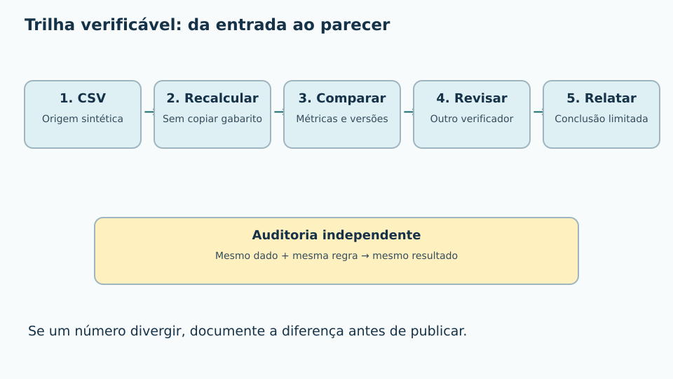
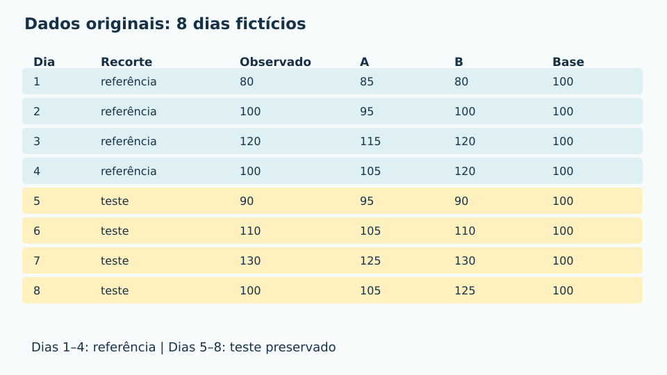
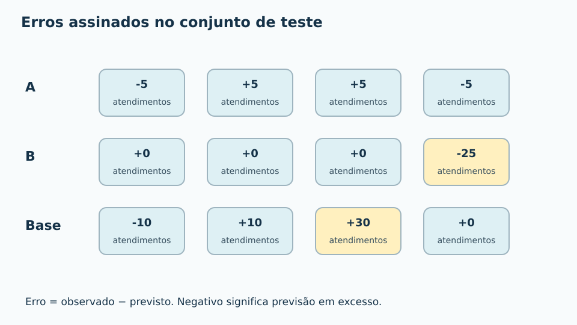
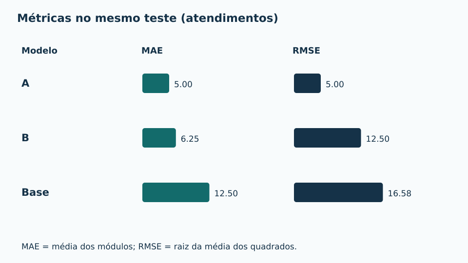
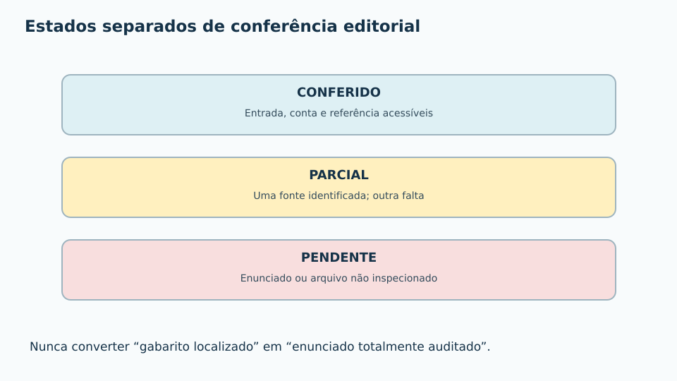
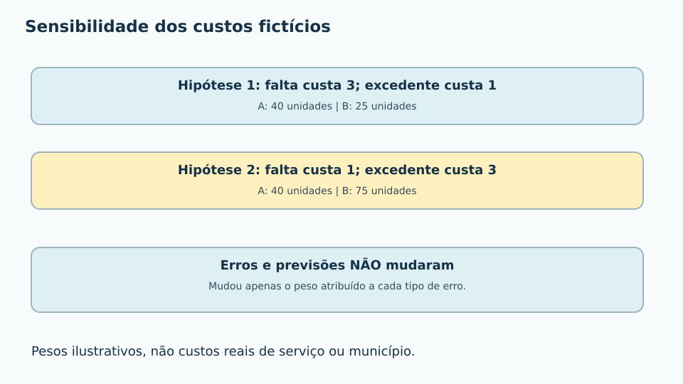
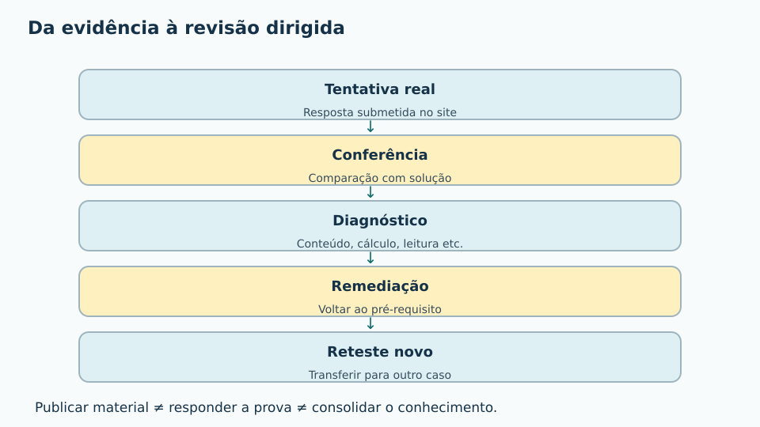

# MAT-EST-035 — Auditoria final do projeto estatístico: reprodutibilidade, revisão independente e transferência para questões de vestibular

**Origem:** projeto pedagógico e questões autorais. A base de oito dias foi criada no MAT-EST-034 e é inteiramente **fictícia**. A seção de vestibular traz exercícios **no estilo** dos exames, não itens retirados de uma prova oficial. **Duração sugerida:** quatro blocos de 25 a 50 minutos. A auditoria aqui é um procedimento-modelo: não constitui auditoria real de unidade de saúde, pesquisa de campo ou desempenho de Anderson.

## 1. Objetivos e pré-requisitos

Ao final do estudo, você deverá conseguir: reconstruir resultados a partir do CSV em vez de copiar uma tabela derivada; verificar números e unidades; localizar versões e alterações; atribuir um estado verificável a uma fonte; distinguir descrição, inferência e recomendação; produzir um parecer curto e corrigível; transferir os métodos a enunciados inéditos. Pré-requisitos: MAT-EST-019, 020, 027, 031, 032, 033 e 034. Caso um passo não esteja claro, retorne apenas ao fundamento necessário.

## 2. Intuição: o que significa auditar uma análise?

Uma pessoa publica o seguinte resumo: “o modelo A tem erro médio de cinco; o modelo B custa vinte e cinco”. É possível que os dois números estejam certos e que a conclusão geral esteja errada. O primeiro número pode ser MAE; o segundo, perda calculada com pesos arbitrários. Sem saber **quais dados**, **qual período**, **qual fórmula** e **qual finalidade**, não se trata da mesma medida.

Auditoria reprodutível é entregar à outra pessoa as entradas e o procedimento para que ela refaça as contas, registre divergências e diga explicitamente até onde a evidência vai. A conferência independente evita simplesmente transcrever o resultado do primeiro analista. Em um projeto real, também seriam necessárias políticas de acesso, proteção de dados e registro das versões; neste exercício não há dado pessoal verdadeiro.

**Figura 1 — Cadeia de auditoria.** Texto alternativo: cinco etapas, do CSV ao parecer, com recálculo e conferência independente no meio. Observe que uma conclusão só aparece depois da comparação. Isso ajuda a não transformar um cálculo correto em afirmação sem base.

## 3. Entradas e proveniência: não trocar a fonte pelo resumo

O material anterior fornece `dados-ficticios.csv`, preservado em cópia sem alteração nesta aula, e `calculos-reproduziveis.json`, também copiado. Os dados originais do exercício são:

| Dia | Recorte | Observado | A | B | Base |
|---:|---|---:|---:|---:|---:|
| 1 | Referência | 80 | 85 | 80 | 100 |
| 2 | Referência | 100 | 95 | 100 | 100 |
| 3 | Referência | 120 | 115 | 120 | 100 |
| 4 | Referência | 100 | 105 | 120 | 100 |
| 5 | Teste | 90 | 95 | 90 | 100 |
| 6 | Teste | 110 | 105 | 110 | 100 |
| 7 | Teste | 130 | 125 | 130 | 100 |
| 8 | Teste | 100 | 105 | 125 | 100 |

Leia a tabela assim: os dias um a quatro servem como referência; os dias cinco a oito formam um teste preservado. A, B e base têm previsões para os mesmos dias. Todas as quantidades estão em atendimentos por dia. As previsões A e B são **candidatos didáticos já fornecidos**; não foram ajustados apenas a partir das quatro linhas de referência. A base prevê sempre cem.

**Figura 2 — Entrada original.** Texto alternativo: oito dias com três previsões. Observe a distinção entre referência e teste. As conclusões abaixo descrevem somente esse conjunto inventado.

### Lista de rastreabilidade

Uma reprodução precisa indicar origem e data editorial; nome e versão do arquivo; dicionário das colunas; unidade de observação; regras de inclusão e de tratamento de faltas; partição dos dados; fórmula; arredondamento; alterações posteriores; e responsável pela revisão. Os hashes registrados em `SHA256.txt` ajudam a detectar mudança nos bytes do arquivo, mas **não provam que a fonte é real, representativa ou correta**. Hash é uma impressão digital do arquivo, não uma certificação da conclusão.

## 4. Formalização: métricas que devem ser recalculadas

Adotamos o erro assinado `eᵢ = yᵢ − ŷᵢ`, lido “erro da observação i é o observado menos o previsto”. O índice i identifica o dia. Erro positivo significa que a demanda excedeu a previsão; negativo significa previsão em excesso.

**Erro absoluto médio, MAE:** `MAE = (Σ |eᵢ|) / n`. Leitura: soma dos módulos dos erros dividida pelo número de observações. Unidade: atendimentos. **Erro quadrático médio, MSE:** `MSE = (Σ eᵢ²) / n`, soma dos quadrados dividida por n; unidade: atendimentos ao quadrado. **Raiz do erro quadrático médio, RMSE:** `RMSE = √MSE`; unidade: atendimentos. **Erro médio assinado, ME:** `ME = (Σ eᵢ) / n`, que preserva o sinal e pode cancelar falhas opostas. Os símbolos Σ, módulo, raiz e n são, respectivamente, somatório, valor absoluto, raiz quadrada e número de observações.

No teste, A tem erros `−5, +5, +5, −5`; B tem `0, 0, 0, −25`; a base tem `−10, +10, +30, 0`. Por exemplo, o erro de B no dia oito é cem menos cento e vinte e cinco, igual a menos vinte e cinco. A partir desses vetores:

| Candidato | MAE | MSE | RMSE | ME |
|---|---:|---:|---:|---:|
| A | 5 | 25 | 5 | 0 |
| B | 6,25 | 156,25 | 12,50 | −6,25 |
| Base 100 | 12,50 | 275 | ≈16,58 | +7,50 |

As unidades das colunas MAE, RMSE e ME são atendimentos; a coluna MSE usa atendimentos ao quadrado. Em palavras: A erra em média cinco atendimentos em módulo; B tem um erro concentrado no último dia, que amplia seu RMSE; a base tem um erro de trinta no dia sete. **Não há população real inferida nem intervalo de confiança calculado.**

**Figura 3 — Erros por dia.** Texto alternativo: os erros de A alternam menos cinco e mais cinco; B concentra menos vinte e cinco no dia oito; a base chega a mais trinta no dia sete. Observe o sinal e o erro extremo.

**Figura 4 — MAE e RMSE.** Eixo de comparação quantitativa em atendimentos. A: cinco e cinco. B: seis vírgula vinte e cinco e doze vírgula cinco. Base: doze vírgula cinco e aproximadamente dezesseis vírgula cinquenta e oito. Não compare o comprimento de barras de medidas distintas sem ler o título.

### Reproduzir não é apenas repetir a tabela

O procedimento adequado importa o CSV, identifica as quatro linhas de teste, subtrai cada previsão do observado e aplica as fórmulas. Só então compara o resultado novo com o arquivo de cálculos do MAT-EST-034. Se alguém alterar a previsão de B no dia oito para cento e vinte, seu MAE passa de seis vírgula vinte e cinco para cinco e o RMSE passa de doze vírgula cinco para dez. A divergência é detectável, mas deve ser **documentada e investigada**, não silenciosamente substituída.

## 5. Revisão independente e integridade editorial

A revisão simula dois papéis. A pessoa autora documenta o protocolo; a revisora recebe os dados e a especificação, calcula novamente sem copiar a tabela final e compara com o resultado depositado. A revisora registra: evidência examinada, fórmula, tolerância numérica, diferença observada, possível causa e ação proposta. Não presumir que dois arquivos com o mesmo nome contêm os mesmos bytes.

Um registro pode assumir os estados **conferido**, **parcial** ou **pendente**. No caso de questões oficiais, localizar um gabarito sem inspecionar o caderno original é uma conferência parcial, não uma confirmação integral do enunciado, imagem, versão e resposta. Nesta aula os 36 itens são autorais; para prática oficial, consultar diretamente o acervo do INEP e os portais das instituições, sem incorporar enunciado ou gabarito que não foi inspecionado.

**Diagrama de auditoria — Estados separados.** As palavras conferido, parcial e pendente identificam o grau de conferência, sem depender da cor. Uma verificação parcial continua parcial até que a evidência faltante esteja acessível.

## 6. Sensibilidade e limite das conclusões

A função de perda hipotética atribui três unidades monetárias fictícias a cada atendimento cuja demanda superou a previsão e uma unidade ao atendimento previsto em excesso. Fórmula: `L = 3 × soma(máximo(e,0)) + soma(máximo(−e,0))`. Leia: três vezes a soma das faltas, mais a soma dos excedentes. Os pesos são inventados, não preços reais.

No teste, A acumula dez faltas e dez excedentes: perda quarenta. B tem zero falta e vinte e cinco excedentes: perda vinte e cinco. Se invertemos os pesos, fazendo falta custar um e excedente custar três, A continua com quarenta, mas B passa a setenta e cinco. **O mesmo dado pode responder diferentemente a critérios de decisão diferentes**. Isso não é contradição entre métricas: são perguntas distintas e custos supostos.

**Diagrama de sensibilidade — Dois critérios de custo.** Com falta valendo três e excedente um, A tem custo quarenta e B vinte e cinco. Com falta valendo um e excedente três, A tem quarenta e B setenta e cinco. Observe que os erros não mudaram: só os pesos mudaram.

Além dos pesos, a auditoria deve examinar: horizonte temporal, origem dos valores, observações ausentes, vazamento do teste para decisões posteriores, viés de seleção, mudanças de condições, grupos sub-representados e a diferença entre descrição e inferência. O teste possui só quatro linhas inventadas: não é possível afirmar que o modelo seja superior numa instituição real nem estimar uma cobertura de 95% sem desenho e hipóteses apropriados.

A análise de resíduos e a validação fora da amostra são discutidas no curso STAT 501 da Pennsylvania State University [fontes 1 e 2]. A seção 10.6 distingue o desenvolvimento do modelo da avaliação de sua capacidade de prever observações novas.

## 7. Parecer-modelo e correção por competência

**Parecer de auditoria do caso fictício.** “Foi recalculada, a partir de um CSV com oito registros inventados, a comparação entre A, B e uma referência fixa, preservando quatro registros como teste. No teste, os erros absolutos médios foram 5, 6,25 e 12,5 atendimentos; os RMSE foram 5, 12,5 e aproximadamente 16,58 atendimentos. Sob uma função de perda fictícia com falta custando três vezes o excedente, os custos de A e B foram 40 e 25; a inversão dos pesos alterou o custo de B para 75. A análise é reproduzível como exercício numérico, mas não permite conclusão empírica sobre serviço real, causalidade ou generalização. Antes de decisão externa, seriam necessários dados reais autorizados, plano de amostragem, protocolo congelado, avaliação independente e exame da incerteza.”

Uma correção diagnóstica deve indicar tanto o resultado como o processo. Exemplo: se o estudante relata RMSE de B igual a seis vírgula vinte e cinco, é provável que tenha confundido MAE e RMSE; retorne à definição de quadrado e raiz (MAT-EST-032). Se altera o dado após olhar a avaliação, revise separação treino/teste (MAT-EST-031). Se transforma quatro dias fictícios em conclusão populacional, retome amostragem (MAT-EST-019). Se apresenta resultados sem fonte, recupere protocolo e documentação (MAT-EST-034).

**Figura 7 — Tentativa, correção, diagnóstico, remediação e reteste.** Os cinco passos dependem de uma tentativa real. Publicar aula não significa estudar nem acertar.

## 8. Transferência para a leitura de vestibulares

**Camada escolar e de vestibular:** interpretar gráficos e tabelas, reconhecer denominadores, conferir unidades, justificar operações e limitar conclusões à amostra e ao contexto. Os exercícios autorais da seção seguinte contextualizam essas habilidades e indicam estilos de ENEM, FUVEST, UNICAMP e UNESP apenas como referência de formato; não equivalem a questões originais dessas provas.

**Ponte universitária:** reproduzir um pipeline de dados, verificar arquivo de entrada por hash, construir trilha de auditoria, interpretar validação preditiva e revisar independentemente modelos. Não atribuímos todos esses formalismos à matriz oficial dos vestibulares. Para questões oficiais, consultar [Provas e Gabaritos do ENEM no INEP](https://www.gov.br/inep/pt-br/areas-de-atuacao/avaliacao-e-exames-educacionais/enem/provas-e-gabaritos) e as páginas institucionais equivalentes das demais bancas, verificando ano, fase, caderno e versão antes de registrar um item.

## 9. Banco de exercícios autorais: enunciados sem gabarito imediato

O site deve exibir as respostas somente na correção, após uma tentativa. A versão editorial armazena todas as resoluções também em `exercicios.json`; os seis itens de reteste usam números novos e não copiam o enunciado da primeira camada. Esta produção não cria tentativas individuais.

### Aprendizagem básica

**MAT-EST-035-EX-APR-01 — Origem dos registros.** Os oito dias da planilha representam registros reais de uma unidade de saúde? Qual anotação obrigatória deve acompanhar a tabela?

**MAT-EST-035-EX-APR-02 — Unidade de análise.** Qual é a unidade de análise da base e em que unidade se expressam as previsões?

**MAT-EST-035-EX-APR-03 — Separar períodos.** Quais dias compõem a referência e quais dias formam o teste preservado?

**MAT-EST-035-EX-APR-04 — Convenção de sinal.** No dia 8, observaram-se 100 atendimentos e B previu 125. Calcule e = observado − previsto.

**MAT-EST-035-EX-APR-05 — Vetor de erros A.** Para o teste, o observado é [90,110,130,100] e A prevê [95,105,125,105]. Escreva os erros assinados.

**MAT-EST-035-EX-APR-06 — Erro absoluto médio A.** Calcule o MAE de A a partir de [−5,+5,+5,−5].

**MAT-EST-035-EX-APR-07 — Erro quadrático médio B.** Calcule o MSE de B com erros [0,0,0,−25].

**MAT-EST-035-EX-APR-08 — Raiz do erro quadrático B.** Usando MSE de B = 156,25, determine o RMSE.

**MAT-EST-035-EX-APR-09 — Fonte da reprodução.** Qual arquivo é a entrada observacional sintética e qual apresenta os resultados esperados para uma verificação?

**MAT-EST-035-EX-APR-10 — Estado da auditoria.** Se o gabarito oficial de uma prova foi localizado, mas a imagem do enunciado não foi conferida, a questão está totalmente auditada?

### Consolidação

**MAT-EST-035-EX-CON-01 — MAE da baseline.** A baseline prevê 100; nos quatro dias de teste o observado é [90,110,130,100]. Calcule MAE.

**MAT-EST-035-EX-CON-02 — RMSE da baseline.** Para erros [−10,+10,+30,0], calcule o RMSE.

**MAT-EST-035-EX-CON-03 — Erro médio B.** Os erros assinados de B no teste são [0,0,0,−25]. Qual é o erro médio?

**MAT-EST-035-EX-CON-04 — B em dois subperíodos.** Calcule MAE de B nos dias 5–6 e nos dias 7–8.

**MAT-EST-035-EX-CON-05 — Perda de A: falta três.** Se cada falta custa 3 unidades fictícias e cada excedente custa 1, calcule a perda total de A no teste.

**MAT-EST-035-EX-CON-06 — Perda de B: falta três.** Sob os mesmos custos (falta 3, excedente 1), calcule a perda de B.

**MAT-EST-035-EX-CON-07 — Inversão dos custos.** Se falta custar 1 e excedente custar 3, quais os custos totais de A e B?

**MAT-EST-035-EX-CON-08 — Corrigir alteração acidental.** Um arquivo derivado trocou a previsão B no dia 8 de 125 para 120, sem documentar a mudança. Qual seria o MAE e o RMSE alterados?

**MAT-EST-035-EX-CON-09 — Teste reutilizado.** Uma equipe alterou B após examinar os dias 5 a 8 e mediu a nova versão nos mesmos dias. O que ocorreu?

**MAT-EST-035-EX-CON-10 — Trilha de reprodução.** Enumere quatro registros necessários para outra pessoa reconstruir a comparação entre A, B e baseline.

### Transferência e estilo vestibular — itens autorais

**MAT-EST-035-EX-VES-01 — Questão autoral no estilo ENEM: leitura crítica.** Um infográfico apresenta MAE de A=5 e B=6,25, mas declara “A será sempre 20% melhor em qualquer município”. Identifique o salto lógico e calcule a redução relativa no recorte, tomando B como base.

**MAT-EST-035-EX-VES-02 — Questão autoral no estilo FUVEST: confronto de métricas.** Dois modelos têm erros absolutos [5,5,5,5] e [0,0,0,20]. Calcule MAE e RMSE de cada um e explique a divergência.

**MAT-EST-035-EX-VES-03 — Questão autoral no estilo UNICAMP: replicação temporal.** A previsão B tem MAE 5 na referência e 6,25 no teste. Explique por que essa diferença, sozinha, não comprova piora estrutural do modelo.

**MAT-EST-035-EX-VES-04 — Questão autoral no estilo UNESP: escala do erro.** No teste, RMSE de A é 5 e de B é 12,5. Quantas vezes o RMSE de B representa o de A? Quais as unidades?

**MAT-EST-035-EX-VES-05 — Intervalo sem base.** Um relatório declara “IC de 95% para a demanda média do município” usando somente os quatro dias inventados e sem delineamento. É um resultado válido?

**MAT-EST-035-EX-VES-06 — Inspeção de gráfico enganoso.** Um gráfico de barras mostra erros 5 e 6,25 com eixo vertical começando em 4,8 sem avisar. Descreva o efeito visual e como corrigir.

**MAT-EST-035-EX-VES-07 — Denominador incompatível.** Um gráfico compara a soma dos erros absolutos de A nos 4 dias de teste com a soma dos erros de B em 8 dias. Que ajuste é necessário antes de comparar qualidade?

**MAT-EST-035-EX-VES-08 — Escolha após olhar o teste.** Um avaliador troca a previsão de B no dia 8 para 100 depois de conhecer o observado daquele dia, publica MAE zero e o chama de “teste cego”. Explique.

**MAT-EST-035-EX-VES-09 — Concluir com amostra mínima.** Uma equipe subdivide o teste em dois blocos de 2 dias e anuncia mudança populacional comprovada porque o MAE de B passou de 0 a 12,5. Reescreva a conclusão.

**MAT-EST-035-EX-VES-10 — Parecer independente.** Produza parecer de até seis frases com pergunta, fonte, método, achados, sensibilidade e limite usando MAE A=5, B=6,25, baseline=12,5, e custos 40 e 25 na hipótese falta3/excedente1.

### Reteste independente

**MAT-EST-035-EX-RET-01 — Reteste novo: métricas com empate aparente.** Um novo exemplo fictício apresenta erros de X=[−4,+4,−4,+4] e de Y=[0,0,0,+16]. Calcule MAE e RMSE de ambos.

**MAT-EST-035-EX-RET-02 — Reteste novo: perdas assimétricas.** Nos erros X=[−4,+4,−4,+4] e Y=[0,0,0,+16], considerando e=observado−previsto, falta=3 e excedente=1, calcule as perdas.

**MAT-EST-035-EX-RET-03 — Reteste novo: outro conjunto de quatro casos.** Observados: [20,24,22,26]. P prevê [22,22,22,22]. Calcule vetor de erros e MAE.

**MAT-EST-035-EX-RET-04 — Reteste novo: erro extremo.** Nos mesmos observados [20,24,22,26], Q prevê [20,24,22,32]. Calcule MAE e RMSE e compare ao de P.

**MAT-EST-035-EX-RET-05 — Reteste novo: transformação vazada.** Em um estudo com 200 registros, uma padronização de preditores calcula média e desvio com os 200 antes de separar treino e teste. Isso preserva a independência do teste?

**MAT-EST-035-EX-RET-06 — Reteste novo: limites do parecer.** Um modelo com RMSE baixo nos dados históricos de uma escola fictícia será usado em outra cidade sem dados novos. Redija duas condições de validação e um limite da conclusão.

## 10. Correções comentadas — material do professor / liberação após tentativa

Não consultar durante a primeira resolução. Cada resposta aponta como reconstruir a conta ou o argumento.

### MAT-EST-035-EX-APR-01 — Origem dos registros

**Resposta esperada:** São oito registros inteiramente fictícios, destinados ao ensino; devem trazer identificação explícita de dados sintéticos.

**Raciocínio:** Leia a nota de origem na aula MAT-EST-034. Uma conta reproduzível não torna um conjunto de dados inventado uma pesquisa real.

**Possível causa de erro:** interpretação — Reconhecer o alcance da evidência, o recorte e a pergunta.

### MAT-EST-035-EX-APR-02 — Unidade de análise

**Resposta esperada:** Cada linha é um dia fictício; previsões e observações são atendimentos por dia.

**Raciocínio:** Leia o dicionário das colunas. Não confunda quantidade diária com taxa por pessoa nem com média populacional.

**Possível causa de erro:** interpretação — Reconhecer o alcance da evidência, o recorte e a pergunta.

### MAT-EST-035-EX-APR-03 — Separar períodos

**Resposta esperada:** Referência: dias 1 a 4. Teste: dias 5 a 8.

**Raciocínio:** Confira a coluna particao, e não a posição arbitrária de linhas após ordenação. Esse recorte é ilustrativo e preserva a sequência temporal.

**Possível causa de erro:** distração — Conferir sinal, rótulo, período e denominador.

### MAT-EST-035-EX-APR-04 — Convenção de sinal

**Resposta esperada:** −25 atendimentos; B superestimou a demanda em 25.

**Raciocínio:** Substitua: 100 − 125 = −25. O sinal negativo representa previsão acima do realizado nesta convenção.

**Possível causa de erro:** cálculo — Recalcular termo a termo e verificar unidades.

### MAT-EST-035-EX-APR-05 — Vetor de erros A

**Resposta esperada:** [−5,+5,+5,−5] atendimentos.

**Raciocínio:** Subtraia cada previsão do observado, dia a dia. Confira que as posições permanecem alinhadas e a soma é zero.

**Possível causa de erro:** cálculo — Recalcular termo a termo e verificar unidades.

### MAT-EST-035-EX-APR-06 — Erro absoluto médio A

**Resposta esperada:** MAE = (5+5+5+5)/4 = 5 atendimentos.

**Raciocínio:** Tome o módulo de cada erro. Some 20 e divida pelas quatro observações.

**Possível causa de erro:** cálculo — Recalcular termo a termo e verificar unidades.

### MAT-EST-035-EX-APR-07 — Erro quadrático médio B

**Resposta esperada:** MSE = 625/4 = 156,25 atendimentos².

**Raciocínio:** Eleve cada erro ao quadrado; apenas (−25)² é 625. Divida pelo número de dias e explicite a unidade quadrática.

**Possível causa de erro:** cálculo — Recalcular termo a termo e verificar unidades.

### MAT-EST-035-EX-APR-08 — Raiz do erro quadrático B

**Resposta esperada:** RMSE = √156,25 = 12,5 atendimentos.

**Raciocínio:** Aplique raiz quadrada ao erro quadrático médio. A unidade retorna à escala de atendimentos.

**Possível causa de erro:** cálculo — Recalcular termo a termo e verificar unidades.

### MAT-EST-035-EX-APR-09 — Fonte da reprodução

**Resposta esperada:** Entrada: dados-ficticios.csv; referência de resultados: calculos-reproduziveis.json.

**Raciocínio:** A origem tabular não deve ser substituída por uma imagem da tabela. Recalcule a partir do CSV e só depois compare com o JSON.

**Possível causa de erro:** estratégia — Separar coleta, treino, validação, teste e relato.

### MAT-EST-035-EX-APR-10 — Estado da auditoria

**Resposta esperada:** Não; o gabarito está conferido, mas a inspeção do enunciado segue pendente.

**Raciocínio:** Atribua estados separados a cada evidência. Não apresente um número ou texto de questão como verificado apenas pela existência do gabarito.

**Possível causa de erro:** interpretação — Reconhecer o alcance da evidência, o recorte e a pergunta.

### MAT-EST-035-EX-CON-01 — MAE da baseline

**Resposta esperada:** (10+10+30+0)/4 = 12,5 atendimentos.

**Raciocínio:** Calcule observação menos 100: −10,+10,+30,0. Some módulos e divida por quatro.

**Possível causa de erro:** cálculo — Recalcular termo a termo e verificar unidades.

### MAT-EST-035-EX-CON-02 — RMSE da baseline

**Resposta esperada:** √[(100+100+900+0)/4] = √275 ≈ 16,58 atendimentos.

**Raciocínio:** Some 1100 atendimentos². Divida por quatro e extraia a raiz, arredondando apenas no final.

**Possível causa de erro:** cálculo — Recalcular termo a termo e verificar unidades.

### MAT-EST-035-EX-CON-03 — Erro médio B

**Resposta esperada:** ME = −25/4 = −6,25 atendimentos.

**Raciocínio:** Não use o módulo para o erro médio assinado. O valor negativo indica previsão em excesso, em média, no recorte.

**Possível causa de erro:** cálculo — Recalcular termo a termo e verificar unidades.

### MAT-EST-035-EX-CON-04 — B em dois subperíodos

**Resposta esperada:** Dias 5–6: 0. Dias 7–8: (0+25)/2 = 12,5 atendimentos.

**Raciocínio:** Separe o vetor [0,0,0,−25] em dois pares. Médias de apenas dois dias são descrição local, não tendência populacional.

**Possível causa de erro:** cálculo — Recalcular termo a termo e verificar unidades.

### MAT-EST-035-EX-CON-05 — Perda de A: falta três

**Resposta esperada:** Erros positivos somam 10 e negativos em módulo somam 10: 3×10+1×10=40.

**Raciocínio:** Use e=observado−previsto; valores positivos representam falta. Não trate os custos inventados como preços observados em instituições reais.

**Possível causa de erro:** cálculo — Recalcular termo a termo e verificar unidades.

### MAT-EST-035-EX-CON-06 — Perda de B: falta três

**Resposta esperada:** B tem falta 0 e excedente 25: 3×0+1×25=25 unidades fictícias.

**Raciocínio:** Leia o sinal dos erros [0,0,0,−25]. A comparação vale só para os custos e dados inventados.

**Possível causa de erro:** cálculo — Recalcular termo a termo e verificar unidades.

### MAT-EST-035-EX-CON-07 — Inversão dos custos

**Resposta esperada:** A = 1×10+3×10 = 40; B = 1×0+3×25 = 75.

**Raciocínio:** Troque apenas os pesos; mantenha os mesmos erros. A ordem de custos depende da função de perda, sem implicar recomendação universal.

**Possível causa de erro:** cálculo — Recalcular termo a termo e verificar unidades.

### MAT-EST-035-EX-CON-08 — Corrigir alteração acidental

**Resposta esperada:** Erros viram [0,0,0,−20]; MAE=5 e RMSE=10. A mudança precisa ser registrada e não substituir silenciosamente a origem.

**Raciocínio:** Calcule 20/4=5 e √(400/4)=10. Compare o dado derivado com o CSV original; destaque a divergência.

**Possível causa de erro:** cálculo — Recalcular termo a termo e verificar unidades.

### MAT-EST-035-EX-CON-09 — Teste reutilizado

**Resposta esperada:** O conjunto de teste deixou de funcionar como avaliação independente para a nova versão; é necessário novo conjunto preservado.

**Raciocínio:** O resultado do teste orientou uma escolha. Registrar o resultado antigo e buscar nova avaliação prospectiva ou independente.

**Possível causa de erro:** estratégia — Separar coleta, treino, validação, teste e relato.

### MAT-EST-035-EX-CON-10 — Trilha de reprodução

**Resposta esperada:** CSV original com versão, dicionário de colunas e unidades, convenção de erro/fórmulas e partição temporal; incluir resultados e alterações.

**Raciocínio:** Reproduzir exige entradas e procedimento, não só gráfico final. Informar origem sintética, versão, regras e responsáveis de revisão.

**Possível causa de erro:** estratégia — Separar coleta, treino, validação, teste e relato.

### MAT-EST-035-EX-VES-01 — Questão autoral no estilo ENEM: leitura crítica

**Resposta esperada:** Redução de (6,25−5)/6,25=20% no MAE observado. A generalização para municípios não é justificada por quatro dias fictícios.

**Raciocínio:** Divida a diferença 1,25 pelo valor de referência 6,25. Não confunda uma comparação descritiva com validade externa ou causalidade.

**Possível causa de erro:** interpretação — Reconhecer o alcance da evidência, o recorte e a pergunta.

### MAT-EST-035-EX-VES-02 — Questão autoral no estilo FUVEST: confronto de métricas

**Resposta esperada:** Ambos têm MAE 5; RMSE do primeiro é 5 e do segundo é 10. O quadrado penaliza mais o erro concentrado.

**Raciocínio:** Para o primeiro: 20/4=5 e √(100/4)=5. Para o segundo: 20/4=5 e √(400/4)=10.

**Possível causa de erro:** cálculo — Recalcular termo a termo e verificar unidades.

### MAT-EST-035-EX-VES-03 — Questão autoral no estilo UNICAMP: replicação temporal

**Resposta esperada:** São dois recortes sintéticos de apenas quatro dias, sem amostragem representativa nem inferência válida de mudança; descreve diferença observada.

**Raciocínio:** Na referência, B erra [0,0,0,−20], logo MAE=5. No teste erra [0,0,0,−25], logo MAE=6,25; não estimar tendência sem desenho.

**Possível causa de erro:** interpretação — Reconhecer o alcance da evidência, o recorte e a pergunta.

### MAT-EST-035-EX-VES-04 — Questão autoral no estilo UNESP: escala do erro

**Resposta esperada:** 12,5/5=2,5 vezes. Ambos são medidos em atendimentos, diferentemente do MSE, expresso em atendimentos².

**Raciocínio:** Calcule a razão 12,5÷5. Informe as unidades e limite a comparação ao conjunto observado.

**Possível causa de erro:** cálculo — Recalcular termo a termo e verificar unidades.

### MAT-EST-035-EX-VES-05 — Intervalo sem base

**Resposta esperada:** Não. Falta amostragem real e representativa, estimador/erro-padrão fundamentado, hipótese de independência ou desenho temporal e método do intervalo.

**Raciocínio:** Um cálculo aritmético não cria uma população observada. Separar ilustração de inferência e apresentar condições necessárias.

**Possível causa de erro:** conteúdo — Rever definição, hipóteses e o modelo de cálculo.

### MAT-EST-035-EX-VES-06 — Inspeção de gráfico enganoso

**Resposta esperada:** O recorte estreito pode exagerar visualmente uma diferença de 1,25. Informar escala completa/recorte, valores numéricos, unidades e fonte; em barras, em geral começar em zero.

**Raciocínio:** Compare a diferença absoluta com a escala desenhada. A informação decisiva precisa continuar legível por áudio e não depender só da cor.

**Possível causa de erro:** interpretação — Reconhecer o alcance da evidência, o recorte e a pergunta.

### MAT-EST-035-EX-VES-07 — Denominador incompatível

**Resposta esperada:** Recalcular ambos na mesma janela e mesma população de casos, com medida comparável como MAE; não comparar totais de recortes diferentes.

**Raciocínio:** O número de observações altera somas. Use os mesmos dias para comparações pareadas dos candidatos.

**Possível causa de erro:** estratégia — Separar coleta, treino, validação, teste e relato.

### MAT-EST-035-EX-VES-08 — Escolha após olhar o teste

**Resposta esperada:** Houve uso do resultado para ajustar o candidato. MAE zero no mesmo recorte é reavaliação contaminada, não validação cega; requer teste novo.

**Raciocínio:** Identifique quando o observado entrou na construção. Distinga ajuste de validação independente.

**Possível causa de erro:** estratégia — Separar coleta, treino, validação, teste e relato.

### MAT-EST-035-EX-VES-09 — Concluir com amostra mínima

**Resposta esperada:** No cenário sintético, houve diferença descritiva entre os pares; com 2 registros por período e sem desenho real, não há comprovação populacional.

**Raciocínio:** Relate os valores 0 e 12,5 corretamente. Separe descrição e inferência.

**Possível causa de erro:** interpretação — Reconhecer o alcance da evidência, o recorte e a pergunta.

### MAT-EST-035-EX-VES-10 — Parecer independente

**Resposta esperada:** Resposta-modelo: Dados fictícios de quatro dias de teste, com A e B fixados previamente. Recalculei MAE de 5, 6,25 e 12,5 para A, B e baseline. Sob pesos fictícios falta=3/excedente=1, custos totais de A e B foram 40 e 25. As métricas não respondem à mesma pergunta que o custo decisório. Como a base e os pesos são inventados e o teste é muito pequeno, não faço recomendação operacional nem inferência populacional. Exigiria dados novos com origem e avaliação preservada.

**Raciocínio:** Verifique se os resultados reproduzem as entradas. Inclua declaração explícita de escopo, ausência de causalidade e condições para revisão.

**Possível causa de erro:** estratégia — Separar coleta, treino, validação, teste e relato.

### MAT-EST-035-EX-RET-01 — Reteste novo: métricas com empate aparente

**Resposta esperada:** MAE X=4 e Y=4; RMSE X=4 e Y=8.

**Raciocínio:** X: soma de módulos 16, média dos quadrados 16. Y: módulos somam 16, quadrados somam 256; MSE 64 e RMSE 8.

**Possível causa de erro:** cálculo — Recalcular termo a termo e verificar unidades.

### MAT-EST-035-EX-RET-02 — Reteste novo: perdas assimétricas

**Resposta esperada:** X: positivos somam 8, negativos em módulo somam 8, perda=32; Y: positivos 16 e negativos zero, perda=48.

**Raciocínio:** Use os sinais de X e Y. A função de perda não é a mesma medida que MAE.

**Possível causa de erro:** cálculo — Recalcular termo a termo e verificar unidades.

### MAT-EST-035-EX-RET-03 — Reteste novo: outro conjunto de quatro casos

**Resposta esperada:** Erros P=[−2,+2,0,+4]; MAE=(2+2+0+4)/4=2.

**Raciocínio:** Subtraia previsão da observação. O total absoluto é oito.

**Possível causa de erro:** cálculo — Recalcular termo a termo e verificar unidades.

### MAT-EST-035-EX-RET-04 — Reteste novo: erro extremo

**Resposta esperada:** Q: e=[0,0,0,−6], MAE=1,5 e RMSE=3; P tem RMSE=√6≈2,45. Q tem menor MAE, mas maior RMSE.

**Raciocínio:** Para P, quadrados 4+4+0+16=24, MSE=6. Para Q, quadrados somam 36, MSE=9.

**Possível causa de erro:** cálculo — Recalcular termo a termo e verificar unidades.

### MAT-EST-035-EX-RET-05 — Reteste novo: transformação vazada

**Resposta esperada:** Não. Os valores do teste afetaram parâmetros de pré-processamento; ajustar transformações apenas no treino e aplicá-las aos conjuntos reservados.

**Raciocínio:** A média global já consultou dados do teste. O processo de transformação deve integrar a sequência de treino e validação.

**Possível causa de erro:** estratégia — Separar coleta, treino, validação, teste e relato.

### MAT-EST-035-EX-RET-06 — Reteste novo: limites do parecer

**Resposta esperada:** Conferir qualidade e comparabilidade das novas fontes, avaliar em período/local independente com métrica e critérios previamente fixados. O RMSE histórico, isoladamente, não garante desempenho em outra população.

**Raciocínio:** Considere mudança de contexto e distribuição. Exija avaliação nova e registre o limite de validade externa.

**Possível causa de erro:** interpretação — Reconhecer o alcance da evidência, o recorte e a pergunta.

## 11. Revisão ativa, áudio e critério de domínio

**Revisão sugerida a contar de estudo efetivo:** D+1, D+7 e D+30. Faça primeiro o diagnóstico dos erros; depois, resolva as seis questões de reteste sem consultar a resposta anterior. Para consolidar, exigir explicação com palavras próprias, cálculo direto, transferência a dados novos e recuperação após tempo. Se surgir erro sistemático, marque **revisar** e retorne ao tópico específico, sem criar outra trilha. Mantenha MAT-EST-018, MAT-PRO-039 e MAT-PRO-054 pendentes até tentativas verdadeiras no site.

**Resumo para ouvir no Edge.** Nesta auditoria, a fonte são oito dias fictícios; os quatro últimos são teste. Primeiro, os erros são observado menos previsto. Segundo, a média dos módulos dos erros mede sua magnitude típica, enquanto a raiz da média dos quadrados penaliza mais os extremos. Terceiro, repetir a mesma conta a partir do arquivo de origem permite conferir o resultado. Quarto, uma análise pode ter contas corretas e ainda não possuir amostra representativa, custo real ou desenho para generalizar. Por fim, a revisão só se completa quando outra pessoa consegue identificar os dados, refazer os passos e delimitar a conclusão.

## 12. Vídeo complementar

**Video 4: Validating the Model**, curso **The Analytics Edge**, canal **MIT OpenCourseWare**, professor **Dimitris Bertsimas**, idioma inglês, com página e transcrição institucional. **Duração:** não confirmada. **Quando assistir:** após a seção 6, antes das questões de transferência. **Por que foi escolhido:** reforça a diferença entre ajustar e validar um modelo usando um estudo aplicado. Link: [Video 4: Validating the Model](https://ocw.mit.edu/courses/15-071-the-analytics-edge-spring-2017/resources/video-4-validating-the-model-0/). A reprodução integral precisa ser confirmada na etapa de publicação, e o vídeo não substitui nenhuma seção da aula.

## 13. Fontes institucionais e limites da auditoria

1. [STAT 501 — Lesson 10: Model Building, seção 10.6 Cross-validation](https://online.stat.psu.edu/stat501/Lesson10) — Pennsylvania State University. Validação independente, escolha do modelo e avaliação por erros em novas observações.
2. [STAT 501 — Lesson 4: SLR Model Assumptions](https://online.stat.psu.edu/stat501/Lesson04) — Pennsylvania State University. Diagnóstico de resíduos e limitação dos pressupostos.
3. [Provas e gabaritos do ENEM](https://www.gov.br/inep/pt-br/areas-de-atuacao/avaliacao-e-exames-educacionais/enem/provas-e-gabaritos) — INEP. Consulta externa a provas originais, sem atribuição fictícia de número ou questão.
4. [Matrizes de Referência do ENEM — publicação 2026](https://www.gov.br/inep/pt-br/centrais-de-conteudo/acervo-linha-editorial/publicacoes-institucionais/avaliacoes-e-exames-da-educacao-basica/matrizes-de-referencia-enem) — INEP. Referência institucional às habilidades de Matemática e argumentação; formalismo de auditoria é ponte universitária.
5. [Video 4: Validating the Model — The Analytics Edge](https://ocw.mit.edu/courses/15-071-the-analytics-edge-spring-2017/resources/video-4-validating-the-model-0/) — MIT OpenCourseWare. Complemento audiovisual sobre validação de modelos; página e transcrição localizadas, reprodução integral não testada.

Todos os gráficos desta aula são originais, produzidos para o projeto com base em dados fictícios, com descrição alternativa e conclusão textual. Os itens de vestibular são autorais. Não houve coleta de dados reais, realização de experimento nem verificação de caderno de prova específico nesta produção.

## 14. Próximo passo editorial

**MAT-EST-036 — Consolidação integradora da Estatística: mapa de pré-requisitos, revisão longitudinal e plano de avaliação individual.** Manter o estado individual separado da produção editorial. A versão do site deve ser auditada antes de publicação, inclusive links, vídeo, navegação, responsividade, modo de leitura e Ler em voz alta do Microsoft Edge.
