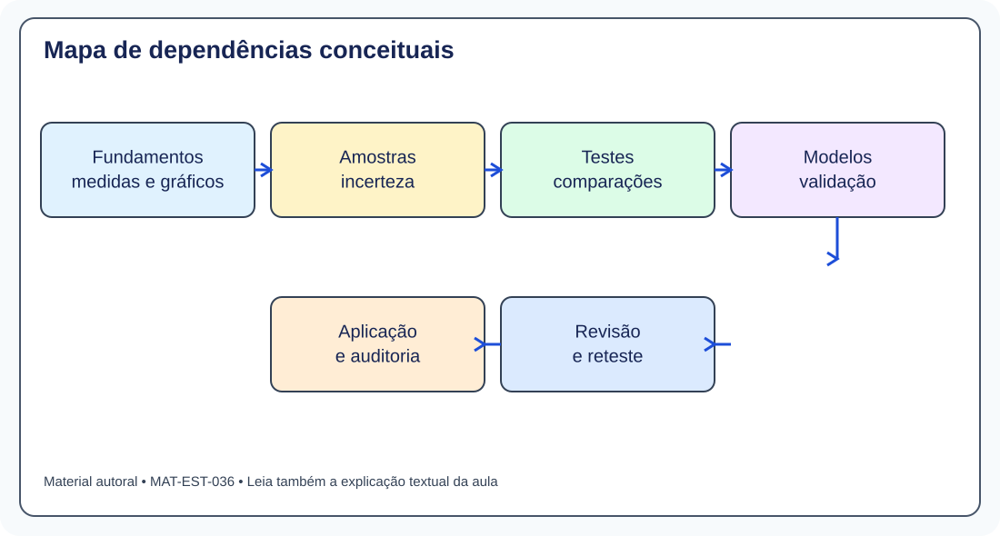
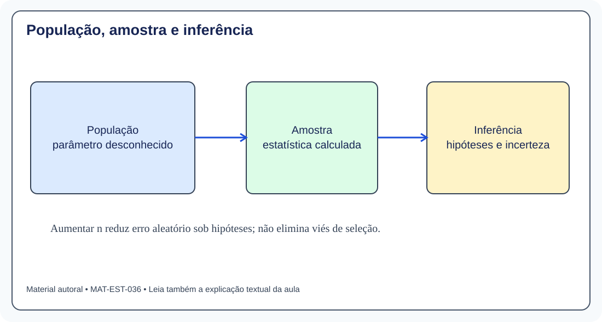
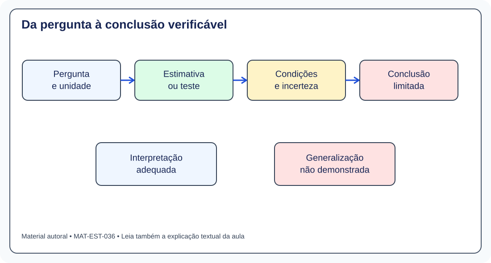
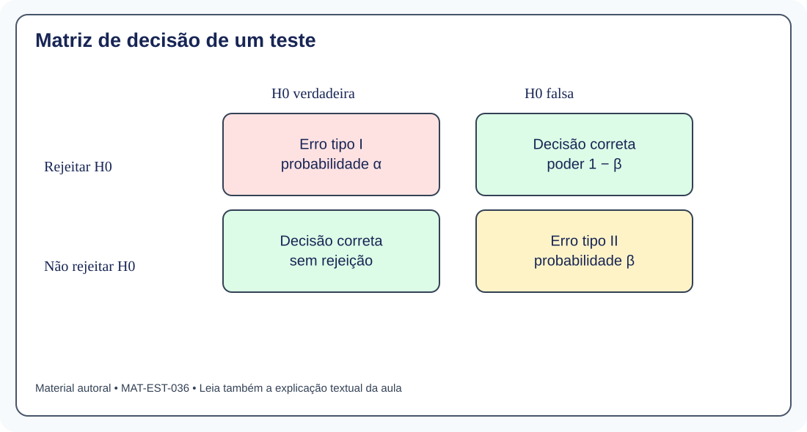
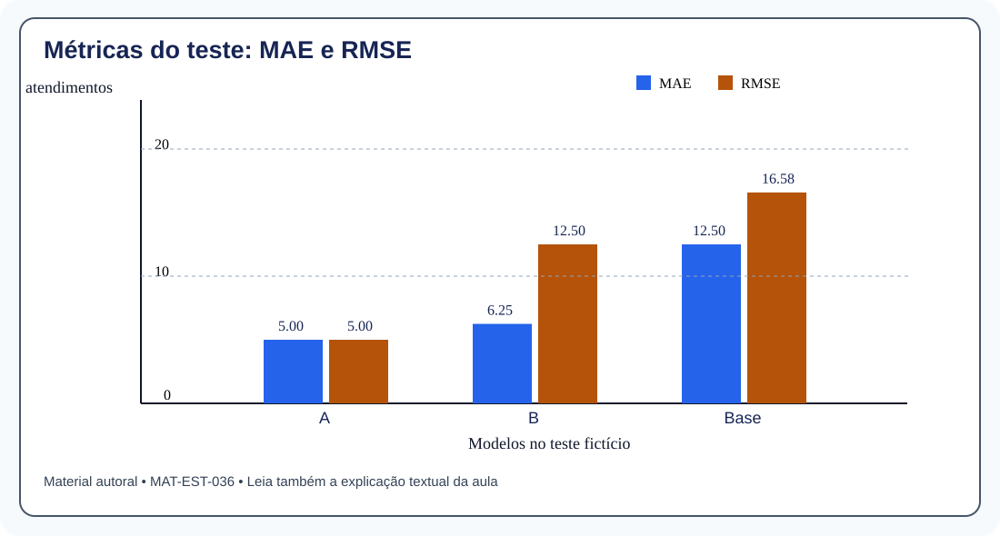
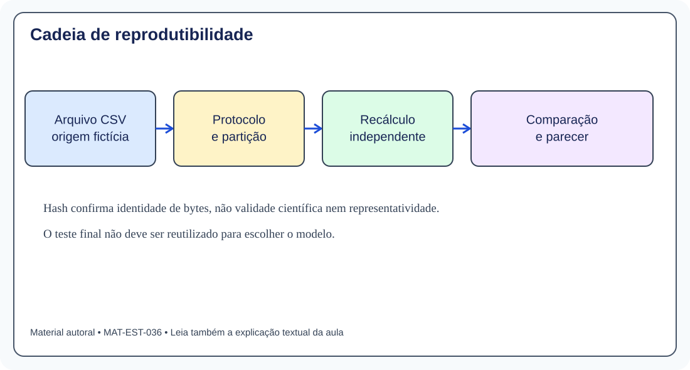
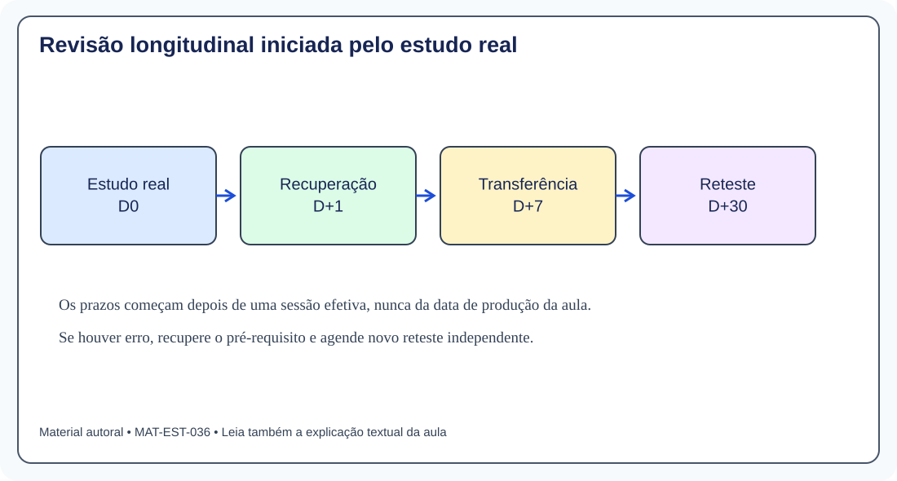

# MAT-EST-036 — Consolidação integradora da Estatística: mapa de pré-requisitos, revisão longitudinal e plano de avaliação individual

**Origem:** síntese didática autoral e questões inteiramente autorais. **Situação do estudante:** esta é produção editorial, não registro de tentativa. Os simulados MAT-EST-018, MAT-PRO-039 e MAT-PRO-054 permanecem pendentes de avaliação individual. **Duração sugerida:** quatro blocos de 25 a 50 minutos, sem matéria fixa por dia. **Nível:** integração de fundamentos escolares, aprofundamento e ponte universitária, distinguidos adiante. O conjunto de oito dias, suas previsões e seus custos são fictícios e não representam nenhuma instituição real.

## 1. Objetivo da aula e resultado esperado

Ao terminar o estudo real e a revisão posterior, você deverá conseguir: (a) localizar a habilidade requerida por uma pergunta; (b) recuperar primeiro o pré-requisito ausente, sem refazer toda a trilha; (c) distinguir descrição, inferência e previsão; (d) calcular medidas simples e justificar modelos; (e) detectar inferência sem sustentação, uso inadequado de testes ou dados vazados; (f) refazer uma comparação com a origem explícita; (g) produzir uma conclusão curta com unidade, hipótese, recorte e limitação. **Ler este texto não comprova nenhuma dessas capacidades.** Elas serão verificadas por tentativas efetivas no site.

Pré-requisitos: MAT-EST-019 a MAT-EST-035 e fundamentos de MAT-EST-001 a MAT-EST-018 conforme os identificadores reais do catálogo. O título de cada item anterior a 019 deve ser consultado no índice existente; não se atribuem nomes ou habilidades inventados àqueles IDs. A revisão usa também a base de probabilidade MAT-PRO-001 a MAT-PRO-055 quando o problema demandar contagem, condicionamento ou seleção de distribuições.

## 2. Por que uma revisão integradora não é outra lista de fórmulas

Em uma atividade isolada, você identifica o procedimento porque o título diz “intervalo de confiança”. Em uma situação nova, primeiro precisa decidir qual pergunta está sendo feita. Um gráfico pode descrever o passado, uma amostra pode estimar um parâmetro, um teste pode avaliar evidência em relação a uma hipótese e uma regressão pode gerar previsão. Trocar essas finalidades produz respostas aparentemente elaboradas e matematicamente inadequadas. A integração exige escolher o método **antes** de substituir números na fórmula.

Uma oficina de revisão deve, portanto, reunir três evidências: **explicação própria**, **resolução sem consulta ao gabarito** e **transferência a um enunciado novo após intervalo de tempo**. Não se presume que um estudante domine uma habilidade apenas porque o respectivo conteúdo foi publicado, nem se repete toda a matéria quando uma dificuldade pontual pode ser recuperada por um pré-requisito menor.

**Figura 1 — Mapa de pré-requisitos.** Texto alternativo: seis blocos ligam fundamentos, amostra, inferência, modelos, aplicação e revisão. Observe o retorno ao fundamento em vez de saltar diretamente do erro à correção. Conclusão: cada falha deve gerar uma tarefa de recuperação específica.

## 3. Mapa conceitual de Estatística e dependências

| Eixo | Pergunta-base | Conteúdos já produzidos | Que evidência pedir? |
|---|---|---|---|
| Fundamentos descritivos | O que os dados mostram? | Consultar IDs reais de MAT-EST-001 a 018 no catálogo existente | Ler tabela, unidade, frequências e dispersão sem alterar denominador |
| Amostragem e inferência | O que é possível afirmar além da amostra? | MAT-EST-019 a 022 | Explicar erro-padrão, IC, decisão, erros I e II, poder e hipóteses |
| Comparação de grupos | Os grupos diferem? | MAT-EST-023 a 025 | Identificar pareamento, ANOVA, multiplicidade e tipo de variável |
| Associação e regressão | Há relação? O que a reta significa? | MAT-EST-026 a 030 | Calcular/interpretrar resíduo, interação e diagnósticos; não afirmar causalidade |
| Predição e auditoria | O modelo se generaliza? É reprodutível? | MAT-EST-031 a 035 | Separar treino/teste, comparar métricas, auditar origem e documentar limites |

Essa organização é uma **proposta de revisão**, não uma substituição dos metadados dos tópicos anteriores. Se uma questão errou devido a fração, porcentagem, média ou leitura literal, a recuperação volta ao fundamento correspondente, ainda que o exercício estivesse em MAT-EST-032. O caminho é definido pela **causa do erro**, não pela página onde ele apareceu.

**Figura 2 — Amostragem.** Texto alternativo: sequência população, amostra e inferência, com advertência sobre viés. Observe que calcular corretamente uma estatística não garante que os indivíduos tenham sido selecionados de modo representativo. Conclusão: aumentar n não conserta automaticamente um desenho de amostragem inadequado.

## 4. Roteiro de decisão antes da conta

1. **Unidade:** qual é o elemento observado? Pessoa, dia, grupo, escola, corrida? Há repetições da mesma unidade?
2. **Variável:** há número medido, contagem, categoria nominal ou categoria ordenada? Quais unidades?
3. **Pergunta:** deseja descrever amostra, estimar parâmetro, testar hipótese, comparar grupos, estudar associação ou prever?
4. **Coleta e desenho:** a amostra sustenta generalização? Há pareamento, independência, aleatoriedade, mudança de período ou confundimento?
5. **Hipótese e cálculo:** que fórmula se aplica e quais condições devem ser examinadas antes da interpretação?
6. **Incerteza:** o número é estimativa, erro, intervalo, teste, aproximação, cota ou simples descritivo?
7. **Conclusão:** a resposta registra unidade, população ou recorte, hipótese, limite e a pergunta original?

### Escolher sem decorar nomes

Duas médias independentes sugerem verificar o teste t adequado ao desenho e à variância; medidas antes e depois nas mesmas pessoas pedem analisar diferenças pareadas. Três ou mais médias podem exigir análise de variância quando suas condições forem defensáveis; a rejeição global não prova que todos os pares sejam diferentes. Duas variáveis categóricas conduzem a uma tabela de contingência; variáveis quantitativas podem ser examinadas por gráfico de dispersão e medidas de associação. Previsão exige avaliação fora dos dados usados para escolher o modelo. **O método depende do problema e das hipóteses; essas frases são um mapa inicial, não uma receita automática.**

**Figura 3 — Cadeia inferencial.** Texto alternativo: pergunta, estimativa ou teste, conferência das condições e conclusão limitada. Observe a etapa de checagem antes da comunicação. Conclusão: uma operação correta pode estar respondendo à pergunta errada.

## 5. Revisão aprofundada de inferência

### Distribuição amostral, estimativa e intervalo

A média ou proporção obtida de uma amostra é uma **estatística**. Em uma repetição do mesmo plano amostral, outra amostra pode produzir outro valor: sua variabilidade é objeto da distribuição amostral. Para a média de n observações independentes com desvio-padrão populacional σ conhecido e variância finita, o erro-padrão é `EP = σ/√n`, lido “sigma dividido pela raiz quadrada de ene”. σ possui a unidade da variável; n é a quantidade de observações. Na prática, σ frequentemente é desconhecido e pode ser necessário substituí-lo por estimativa e justificar a distribuição usada.

**Exemplo resolvido 1.** Média amostral 50, n=64 e σ conhecido 8, sob modelo compatível com intervalo normal: EP = 8/8 = 1. Com multiplicador 1,96, os limites são 50 menos 1,96 e 50 mais 1,96, isto é, **48,04 a 51,96**. Esse intervalo integra um procedimento que cobriria o parâmetro em aproximadamente 95% das amostras repetidas se as condições se mantivessem. Não significa que 95% das pessoas tenham valores dentro desse intervalo; tampouco transforma o parâmetro fixo numa variável aleatória na interpretação frequentista.

**Exemplo resolvido 2.** Se 54 de 100 respostas independentes são positivas, a proporção observada é 0,54. O erro-padrão estimado é a raiz de `(0,54 × 0,46)/100`, aproximadamente 0,04984. O intervalo normal de Wald meramente ilustrativo é 0,54 mais ou menos 1,96 vezes 0,04984: aproximadamente **44,23% a 63,77%**. É necessário avaliar as condições da aproximação; esse procedimento não elimina viés de seleção e pode não ser o intervalo mais apropriado em outras situações.

### Hipóteses, erros e poder

Uma hipótese nula H0 é uma afirmação submetida a um procedimento de contraste, e H1 é a alternativa. O valor-p é calculado **condicionalmente ao modelo e a H0**: ele descreve quão extremos seriam os resultados, segundo o critério do teste, se H0 fosse verdadeira. Não mede a probabilidade de H0 ser verdadeira. Com valor-p 0,18 e nível α 0,05, não se rejeita H0 naquele teste; isso não comprova H0. Erro tipo I é rejeitar uma nula verdadeira; erro tipo II é deixar de rejeitar uma nula falsa. Poder é um menos beta, sob uma alternativa específica e um desenho determinado.

**Figura 4 — Erros de teste.** Texto alternativo: tabela dois por dois com estado real da hipótese e decisão, mostrando tipo I, tipo II e poder. Observe que uma decisão não rejeitada pode estar incorreta. Conclusão: resultados estatísticos são condicionais e não têm certeza infalível.

## 6. Revisão de comparação, associação e regressão

### Comparação de grupos e categorias

Em dados pareados, a variabilidade das **diferenças dentro de cada par** é central; duas listas que contêm observações repetidas das mesmas pessoas não devem ser tratadas como grupos independentes. Na análise de variância, uma estatística F relaciona variabilidade entre grupos e dentro dos grupos. Uma rejeição global indica que o modelo de médias iguais não explica bem os dados, mas não identifica automaticamente todos os pares. Se várias comparações são feitas, seu procedimento precisa considerar multiplicidade — por exemplo, Bonferroni, Holm ou Tukey conforme objetivo e condições.

Para uma tabela de contingência, a contagem esperada de uma célula sob independência é `(total da linha × total da coluna)/total geral`, lido “produto dos totais marginais dividido pelo total da tabela”. O qui-quadrado compara frequências observadas e esperadas; se as condições de aproximação não forem atendidas, pode ser necessário outro procedimento. Associação categórica não demonstra causalidade.

### Regressão: interpretação e diagnóstico

Um resíduo pode ser escrito `eᵢ = yᵢ − ŷᵢ`, lido “observado menos previsto para o registro i”. Com observado cem e previsão cento e cinco, e é menos cinco; a previsão excedeu o resultado em cinco unidades. Uma reta `ŷ = 30 + 2x` prevê cinquenta quando x vale dez. Se foi ajustada apenas para x entre dois e doze, substituí-la em x igual a vinte produz setenta **matematicamente**, mas a generalização é uma extrapolação sem validação naquele intervalo.

Em regressão múltipla, um coeficiente descreve uma associação **condicional aos demais termos presentes no modelo**, não um efeito causal automático. Uma variável indicadora D igual a zero ou um permite dois grupos. Se o modelo é `ŷ = 10 + 2x + 3D + xD`, o grupo zero tem intercepto dez e inclinação dois; o grupo um tem intercepto treze e inclinação três. A interação modifica a inclinação. Avaliar resíduos, heterocedasticidade, observações influentes, variáveis omitidas e o objetivo do ajuste continua necessário.

### Um contraexemplo que impede interpretação superficial

Considere x igual a menos dois, menos um, zero, um e dois; considere y igual a quatro, um, zero, um e quatro. Existe relação perfeita `y = x²`, lido “ípsilon igual a xis ao quadrado”, mas a correlação linear de Pearson é zero por simetria. Portanto, correlação linear nula **não demonstra ausência de toda associação**. Verificar o gráfico é parte da análise, não um adorno.

## 7. Desempenho preditivo e auditoria: um único caso reproduzível

Nesta aula reutilizamos **sem alteração** os arquivos `dados-ficticios.csv`, `calculos-reproduziveis-originais.json` e `auditoria-recalculada.json` do MAT-EST-035. Sua origem remonta ao MAT-EST-034. São oito dias inventados de demanda, dos quais os quatro últimos compõem a partição denominada teste. Previsões dos candidatos A e B já foram fornecidas didaticamente e não devem ser descritas como modelos treinados nas quatro linhas de referência.

| Dia de teste | Observado | Previsão A | Previsão B | Base |
|---:|---:|---:|---:|---:|
| 5 | 90 | 95 | 90 | 100 |
| 6 | 110 | 105 | 110 | 100 |
| 7 | 130 | 125 | 130 | 100 |
| 8 | 100 | 105 | 125 | 100 |

Cada número está em atendimentos por dia **fictícios**. Com a convenção observado menos previsto, A tem erros [−5,+5,+5,−5]; B tem [0,0,0,−25]; a base constante cem tem [−10,+10,+30,0]. O erro absoluto médio, MAE, é a média dos módulos. O erro quadrático médio, MSE, é a média dos quadrados; o RMSE é sua raiz, portanto retorna à unidade original.

| Candidato | MAE (atendimentos) | RMSE (atendimentos) |
|---|---:|---:|
| A | 5 | 5 |
| B | 6,25 | 12,5 |
| Base | 12,5 | aproximadamente 16,58 |

Observe que B erra três previsões em zero, mas concentra um erro de magnitude 25 no quarto dia. Essa concentração aumenta especialmente o RMSE. Em outra pergunta, a decisão pode depender de custos: se falta de previsão custa três por unidade e excesso custa um, A tem perda quarenta e B perda vinte e cinco. Se os pesos se invertem, a perda de B se torna setenta e cinco, enquanto a de A continua quarenta. Portanto, nem o valor de uma métrica, nem a comparação de uma função de perda fictícia, isoladamente comprova superioridade universal.

**Figura 5 — MAE e RMSE no conjunto fictício de quatro dias.** Texto alternativo: gráfico de barras com os modelos A, B e Base, eixo vertical em atendimentos, mostrando A 5/5, B 6,25/12,5 e Base 12,5/aproximadamente 16,58. Observe a diferença entre as duas barras de B. Conclusão: RMSE é mais sensível a erro de grande magnitude do que MAE nesse exemplo.

### O que precisa ser reprodutível

Registre: arquivo original e versão; definição das colunas e unidades; partição; momento em que cada variável estava disponível; fórmula e arredondamento; escolha de métricas e função de perda; resultado recalculado; divergências; e limitação do recorte. Um hash SHA-256 confirma identidade de bytes, não representatividade, correção metodológica ou causalidade. Se alguém modifica uma previsão após examinar o teste, a mudança deve ficar registrada e exigir nova avaliação independente, não substituir silenciosamente o resultado anterior.

**Figura 6 — Protocolo independente.** Texto alternativo: caminho arquivo CSV, protocolo de partição, recálculo e parecer. Observe que hash não prova validade científica. Conclusão: reprodução exige entradas verificáveis e procedimento explícito.

## 8. O que pertence a cada camada educacional

**Fundamento e vestibular:** leitura de tabelas e gráficos; frequências, médias, medidas de dispersão, amostragem, porcentagens e probabilidades; comparação de dados e argumentos com limites explícitos. Questões elaboradas aqui usam linguagem contextualizada e podem inspirar treino de ENEM, FUVEST, UNICAMP e UNESP, mas são **autoria do projeto**, não questões aplicadas por essas instituições. Para itens reais, verificar caderno, edição, versão e gabarito nos respectivos acervos oficiais. A matriz publicada pelo INEP orienta a elaboração de suas avaliações e não autoriza rotular toda esta unidade avançada como exigência formal de ENEM [fontes 1 e 2].

**Aprofundamento e ponte universitária:** poder e planejamento de testes, comparações múltiplas, diagnóstico de regressão múltipla, validação cruzada, previsão e auditoria reprodutível. São ferramentas valiosas para interpretar pesquisas e avançar em graduação, mas esta aula não afirma que cada uma seja obrigatória nas provas escolares citadas. O curso STAT 501 descreve a avaliação dos resíduos e a validação de modelos em dados novos [fontes 3 e 4].

## 9. Caderno de erros, recuperação e avaliação individual

Depois de uma tentativa efetiva em MAT-EST-018, no conjunto novo desta aula ou no futuro simulado, o site poderá associar o item a um ou mais pré-requisitos. Um erro em interpretação de intervalo pode dirigir a MAT-EST-019 e 020; confundir valor-p com a probabilidade de H0, a MAT-EST-021; tratar grupos pareados como independentes, a MAT-EST-023; confundir associação com causalidade, a MAT-EST-025 a 030; usar o teste final na seleção do modelo, a MAT-EST-031; confundir MAE e RMSE, a MAT-EST-032; omitir fonte e limite, a MAT-EST-034 e 035. O mapeamento indica a **primeira hipótese de recuperação**, a ser confirmada pela explicação da tentativa.

O caderno de erros admite **conteúdo, interpretação, cálculo, distração, memória, estratégia e tempo**. Para cada erro, anotar: ID do item, resposta dada, motivo provável observado, fundamento a recuperar, microatividade de 25–50 minutos, novo exercício independente e data de reteste. Um acerto por acaso não substitui a explicação; um erro de cálculo isolado não justifica reiniciar automaticamente toda a unidade.

**Protocolo sugerido (não diagnóstico já aplicado):** etapa 1, resposta independente antes de abrir a correção; etapa 2, reconstrução oral ou escrita do raciocínio; etapa 3, exercício em contexto diferente; etapa 4, revisões relativas a D+1, D+7 e D+30, contadas a partir da data real da sessão. A marcação “consolidado” somente poderá ocorrer após evidências registradas de explicação, resolução, transferência e recuperação posterior. Não criamos resultados fictícios nem atribuímos percentuais de domínio ao usuário.

**Figura 7 — Revisão após estudo efetivo.** Texto alternativo: caixas com D0, D+1, D+7 e D+30. Observe que a data inicial é a atividade realmente realizada, não a criação editorial deste arquivo. Conclusão: revisão espaçada serve para testar retenção, com remediação direcionada quando necessário.

## 10. Banco de exercícios autorais

As questões abaixo serão exibidas no site inicialmente **sem gabarito**, que deverá ser liberado após resposta real. O material editorial inclui gabarito integral na seção seguinte e no arquivo `exercicios.json` para que o publicador possa separar apresentação e correção. Nenhuma destas questões é oficial, e nenhuma tentativa individual foi criada.

### Camada A — Aprendizagem básica

**MAT-EST-036-EX-APR-01 — População e amostra.** Em uma cidade, deseja-se conhecer a proporção de adultos que usam transporte público. Foram entrevistadas 120 pessoas em pontos selecionados. O que é população e o que é amostra?

**MAT-EST-036-EX-APR-02 — Estimativa não é parâmetro.** De 100 respostas fictícias, 54 são positivas. Diga a frequência observada e se ela prova a proporção populacional.

**MAT-EST-036-EX-APR-03 — Erro-padrão da média.** Uma média amostral usa n = 64 valores e o desvio-padrão populacional é conhecido como σ = 8. Calcule o erro-padrão sob independência.

**MAT-EST-036-EX-APR-04 — Sentido do intervalo.** Um intervalo de confiança de 95% foi calculado como [48,04; 51,96]. É correto afirmar que a probabilidade de um parâmetro fixo estar nesse intervalo já calculado é 95%, na interpretação frequentista?

**MAT-EST-036-EX-APR-05 — Não rejeitar.** O teste produziu valor-p = 0,18 e nível de significância α = 0,05. Qual decisão é sustentada?

**MAT-EST-036-EX-APR-06 — Tipo I e tipo II.** Associe: rejeitar H0 verdadeira; deixar de rejeitar H0 falsa.

**MAT-EST-036-EX-APR-07 — Pareamento.** Os mesmos dez participantes são medidos antes e depois de uma intervenção. As duas coleções de valores são amostras independentes?

**MAT-EST-036-EX-APR-08 — Variável categórica.** Classifique “tipo de transporte” (ônibus, bicicleta, a pé) e “minutos de deslocamento”.

**MAT-EST-036-EX-APR-09 — Resíduo de regressão.** A previsão de uma observação é 105 e o valor observado é 100. Usando resíduo = observado − previsto, calcule-o.

**MAT-EST-036-EX-APR-10 — Treino e teste.** Uma pessoa escolhe o melhor modelo olhando repetidamente o erro no conjunto reservado como teste final. Que risco surge?

### Camada B — Consolidação

**MAT-EST-036-EX-CON-01 — Intervalo normal ilustrativo.** Sob amostra independente e σ populacional conhecido igual a 8, n=64 e média 50, use multiplicador 1,96 para estimar IC aproximado de 95% da média.

**MAT-EST-036-EX-CON-02 — Intervalo de proporção ilustrativo.** Em 100 respostas independentes, 54 são positivas. Use o intervalo normal de Wald com z=1,96, se = √[p(1−p)/n]. Calcule o resultado aproximado e cite uma limitação.

**MAT-EST-036-EX-CON-03 — Teste e intervalo bilateral.** Um intervalo bilateral de 95% para a diferença de médias é [1; 5]. Qual conclusão corresponde ao teste bilateral H0: diferença = 0, com α = 0,05, sob métodos compatíveis?

**MAT-EST-036-EX-CON-04 — Diferença pareada.** Cinco participantes tiveram diferenças depois−antes iguais a [2, 4, 0, 2, 2]. Calcule a média das diferenças.

**MAT-EST-036-EX-CON-05 — Comparações múltiplas.** Três comparações foram previamente definidas e será usada a correção Bonferroni com α familiar = 0,05. Qual o limiar individual?

**MAT-EST-036-EX-CON-06 — Esperados em tabela 2 por 2.** Em uma tabela com 100 pessoas, a primeira linha soma 40, a primeira coluna soma 30 e o total geral é 100. Qual a frequência esperada na célula de cruzamento sob independência?

**MAT-EST-036-EX-CON-07 — Correlação não é determinação.** Um ajuste linear simples com intercepto apresenta r = −0,8. Calcule r² e interprete sem afirmar causalidade.

**MAT-EST-036-EX-CON-08 — Interação entre grupos.** Para ŷ=10+2x+3D+1xD, onde D=0 no grupo A e D=1 no B, forneça as equações de cada grupo.

**MAT-EST-036-EX-CON-09 — Comparar MAE e RMSE.** No teste de quatro dias, o modelo A tem erros [−5, 5, 5, −5]. Calcule MAE e RMSE.

**MAT-EST-036-EX-CON-10 — Comparação com erro extremo.** No mesmo período o modelo B tem erros [0, 0, 0, −25]. Calcule MAE e RMSE.

### Camada C — Transferência e aprofundamento (questões autorais no estilo de exame)

**MAT-EST-036-EX-TRA-01 — Pesquisa com seleção enviesada.** Uma pesquisa voluntária feita apenas em uma academia encontra 80% de praticantes de atividade física. É legítimo aplicar o percentual a todos os adultos do município? Fundamente.

**MAT-EST-036-EX-TRA-02 — Estimativa com aparência precisa.** Um relatório apresenta 54,000% de respostas positivas em 100 respostas. Discuta o que os três algarismos decimais acrescentam à inferência.

**MAT-EST-036-EX-TRA-03 — Significância versus relevância.** Uma diferença média fictícia de 0,2 ponto tem valor-p 0,001 em amostra enorme, mas o critério de utilidade definido era melhoria mínima de 5 pontos. Escreva conclusão responsável.

**MAT-EST-036-EX-TRA-04 — Três grupos e descoberta pós-teste.** Um teste F rejeita igualdade global de médias em três grupos. É correto declarar que todos os três pares diferem?

**MAT-EST-036-EX-TRA-05 — Associação e condicionamento.** Entre 40 pessoas do grupo A, 12 respondem sim; entre 60 do grupo B, 9 respondem sim. Compare taxas e diga se isso demonstra que o grupo causa a resposta.

**MAT-EST-036-EX-TRA-06 — Correlação nula com padrão não linear.** Para x=[−2,−1,0,1,2] e y=[4,1,0,1,4], a correlação linear é zero. É correto dizer que não há associação?

**MAT-EST-036-EX-TRA-07 — Extrapolação.** Uma reta foi ajustada com x de 2 a 12 e a equação é ŷ=30+2x. Calcule a previsão em x=20 e qualifique-a.

**MAT-EST-036-EX-TRA-08 — Vazamento temporal.** Uma previsão para a próxima semana usa, como variável de entrada, um indicador que só será calculado depois que essa semana terminar. Explique o erro e a correção de desenho.

**MAT-EST-036-EX-TRA-09 — Critério de custo muda a decisão.** Na amostra sintética do projeto, A tem erros [−5,5,5,−5] e B [0,0,0,−25]. Se falta de capacidade custa 3 por unidade e excesso 1, calcule a perda de A e B. A decisão vale universalmente?

**MAT-EST-036-EX-TRA-10 — Relatório auditável.** Um relatório apresenta “B é superior em qualquer situação” a partir de quatro dias fictícios. Reescreva a afirmação com origem, indicador, recorte e limitação.

### Camada D — Reteste independente, apenas após revisão

**MAT-EST-036-EX-RET-01 — Reteste de erro-padrão.** Nova amostra independente tem n=100 e σ populacional conhecido igual a 15. Qual o erro-padrão da média?

**MAT-EST-036-EX-RET-02 — Reteste de intervalo.** Nova amostra com média 72, n=100 e σ conhecido igual a 10, sob condições para modelo normal. Use z=1,96 para calcular intervalo aproximado de 95%.

**MAT-EST-036-EX-RET-03 — Reteste de decisão de hipótese.** Em novo teste pré-especificado, α=0,01 e valor-p=0,03. Qual decisão?

**MAT-EST-036-EX-RET-04 — Reteste de tabela categórica.** Uma amostra sintética tem 200 registros; primeira linha soma 80 e segunda coluna soma 50. Qual é a frequência esperada na célula correspondente sob independência?

**MAT-EST-036-EX-RET-05 — Reteste de métrica.** Um novo modelo apresenta erros assinados [−2, 2, 2, −2] em quatro dias. Calcule MAE e RMSE.

**MAT-EST-036-EX-RET-06 — Reteste de afirmação responsável.** Um relatório novo encontra associação entre uso de aplicativo e notas, sem sorteio ou controle de fatores prévios. Escreva uma conclusão de até duas frases que não afirme causalidade.

## 11. Correção comentada para uso após tentativa

O site deve apresentar esta seção somente quando houver tentativa individual. Cada solução registra também o pré-requisito e uma hipótese de erro a ser investigada — nunca um diagnóstico pessoal automático.

### Aprendizagem

**MAT-EST-036-EX-APR-01 — População e amostra. Resposta:** População-alvo: adultos da cidade. Amostra: 120 entrevistados. A representatividade depende do recrutamento.

1. Defina o conjunto sobre o qual se pretende concluir.
2. Identifique quem efetivamente foi observado.
3. Não presuma aleatoriedade ao ler “entrevistados”.

**Revisar:** MAT-EST-019. **Verificar possível erro de interpretação:** Confundir local de coleta com a população-alvo.

**MAT-EST-036-EX-APR-02 — Estimativa não é parâmetro. Resposta:** 54/100 = 0,54, ou 54%; não determina exatamente a proporção populacional.

1. Divida o número positivo pelo total válido: 54 ÷ 100.
2. A estatística foi calculada na amostra; o parâmetro da população é desconhecido.

**Revisar:** MAT-EST-019. **Verificar possível erro de conteúdo:** Tomar um percentual amostral por certeza populacional.

**MAT-EST-036-EX-APR-03 — Erro-padrão da média. Resposta:** 8/√64 = 1 unidade.

1. Use EP = σ/√n, lido sigma dividido pela raiz de n.
2. A raiz quadrada de 64 é 8.
3. Divida 8 por 8; informe a unidade original.

**Revisar:** MAT-EST-019, MAT-EST-020. **Verificar possível erro de cálculo:** Dividir por n em vez de dividir por sua raiz.

**MAT-EST-036-EX-APR-04 — Sentido do intervalo. Resposta:** Não. O procedimento de construção teria 95% de cobertura em repetições sob as hipóteses; o intervalo realizado contém ou não o parâmetro fixo.

1. Distingua o parâmetro fixo dos limites aleatórios calculados a partir de amostras.
2. A taxa de cobertura se refere ao método em muitas amostras.

**Revisar:** MAT-EST-019, MAT-EST-020. **Verificar possível erro de interpretação:** Transformar confiança em probabilidade posterior sem modelo bayesiano.

**MAT-EST-036-EX-APR-05 — Não rejeitar. Resposta:** Não rejeitar H0; isso não demonstra que H0 seja verdadeira.

1. Compare 0,18 com 0,05.
2. Como 0,18 é maior, não há evidência suficiente segundo esse critério para rejeitar H0.

**Revisar:** MAT-EST-021, MAT-EST-022. **Verificar possível erro de interpretação:** Trocar falta de evidência por comprovação de igualdade.

**MAT-EST-036-EX-APR-06 — Tipo I e tipo II. Resposta:** Primeiro: erro tipo I. Segundo: erro tipo II.

1. O tipo I é falso positivo em relação a H0.
2. O tipo II é falha em detectar uma alternativa verdadeira.

**Revisar:** MAT-EST-021, MAT-EST-022. **Verificar possível erro de memória:** Inverter a definição dos dois erros.

**MAT-EST-036-EX-APR-07 — Pareamento. Resposta:** Não. As medidas estão pareadas por participante; analisar as diferenças individuais.

1. Encontre a identidade repetida em cada par.
2. A dependência faz parte do desenho e não deve ser ignorada.

**Revisar:** MAT-EST-023. **Verificar possível erro de estratégia:** Escolher fórmula antes de entender como os dados foram coletados.

**MAT-EST-036-EX-APR-08 — Variável categórica. Resposta:** Tipo de transporte: categórica nominal. Minutos: quantitativa.

1. Categorias são rótulos sem unidade métrica própria.
2. Minutos têm medida numérica com escala e unidade.

**Revisar:** MAT-EST-025. **Verificar possível erro de conteúdo:** Aplicar correlação de Pearson a rótulos sem codificação e justificativa.

**MAT-EST-036-EX-APR-09 — Resíduo de regressão. Resposta:** −5 unidades; houve superestimação de cinco.

1. Substitua os valores: 100 − 105.
2. Sinal negativo significa que a previsão excedeu o observado nesta convenção.

**Revisar:** MAT-EST-026, MAT-EST-027. **Verificar possível erro de cálculo:** Inverter a ordem da subtração sem declarar a convenção.

**MAT-EST-036-EX-APR-10 — Treino e teste. Resposta:** O teste deixa de ser uma avaliação independente; ocorre contaminação/vazamento por uso repetido na escolha.

1. O teste final deve ser preservado até a avaliação.
2. A escolha usa treino e validação, com desenho apropriado.

**Revisar:** MAT-EST-031, MAT-EST-032. **Verificar possível erro de estratégia:** Chamar o conjunto de teste de independente embora tenha servido à seleção.

### Consolidação

**MAT-EST-036-EX-CON-01 — Intervalo normal ilustrativo. Resposta:** 50 ± 1,96 × (8/8) = [48,04; 51,96].

1. Erro-padrão = 8/√64 = 1.
2. Margem = 1,96 × 1 = 1,96.
3. Subtraia e some a margem; explique as hipóteses.

**Revisar:** MAT-EST-019, MAT-EST-020. **Verificar possível erro de cálculo:** Esquecer o erro-padrão ou interpretar os limites como certezas.

**MAT-EST-036-EX-CON-02 — Intervalo de proporção ilustrativo. Resposta:** p=0,54; EP≈0,04984; IC≈[0,4423; 0,6377], ou 44,23% a 63,77%. A aproximação exige condições e não corrige viés de seleção.

1. Calcule p = 54/100.
2. EP = √(0,54 × 0,46/100) ≈ 0,04984.
3. Margem ≈ 0,09769; some e subtraia.
4. É um intervalo ilustrativo de Wald, não universalmente o mais adequado.

**Revisar:** MAT-EST-019, MAT-EST-020. **Verificar possível erro de cálculo:** Usar 54 como se fosse proporção igual a 54, sem dividir por 100.

**MAT-EST-036-EX-CON-03 — Teste e intervalo bilateral. Resposta:** O zero não pertence ao intervalo; rejeita-se a diferença nula no teste bilateral compatível.

1. Verifique se o valor nulo, zero, está dentro dos limites.
2. O intervalo exclui zero; ressalve que o resultado depende de hipóteses/métodos compatíveis.

**Revisar:** MAT-EST-019, MAT-EST-020, MAT-EST-021. **Verificar possível erro de interpretação:** Comparar níveis incompatíveis ou esquecer que o valor nulo depende do parâmetro.

**MAT-EST-036-EX-CON-04 — Diferença pareada. Resposta:** (2+4+0+2+2)/5 = 2 unidades.

1. Some as diferenças dentro de cada pessoa: 10.
2. Divida pelas cinco pessoas: 2.
3. A unidade observacional é a pessoa, não dez registros independentes.

**Revisar:** MAT-EST-023. **Verificar possível erro de cálculo:** Tratar cada par como duas pessoas distintas.

**MAT-EST-036-EX-CON-05 — Comparações múltiplas. Resposta:** 0,05/3 ≈ 0,01667.

1. Há três testes na família.
2. Divida o limiar familiar por três.
3. Não chame 0,01667 de valor-p observado: é o critério por teste.

**Revisar:** MAT-EST-024. **Verificar possível erro de conteúdo:** Confundir significância familiar com estatística produzida pelos dados.

**MAT-EST-036-EX-CON-06 — Esperados em tabela 2 por 2. Resposta:** 40 × 30 / 100 = 12.

1. Sob independência, Eij = total da linha × total da coluna / total geral.
2. Substitua 40, 30 e 100.
3. O valor esperado não é necessariamente o valor observado.

**Revisar:** MAT-EST-025. **Verificar possível erro de cálculo:** Usar percentuais de linha com denominador diferente do total.

**MAT-EST-036-EX-CON-07 — Correlação não é determinação. Resposta:** r² = 0,64. No ajuste linear simples com intercepto, 64% da variação amostral de Y é explicada pelo modelo linear; o sinal negativo indica associação linear inversa.

1. Eleve −0,8 ao quadrado: 0,64.
2. R² não retém o sinal; consulte r para direção.
3. Não conclua que X causa Y.

**Revisar:** MAT-EST-026, MAT-EST-027. **Verificar possível erro de interpretação:** Confundir 0,64 com 64% de certeza causal.

**MAT-EST-036-EX-CON-08 — Interação entre grupos. Resposta:** A: ŷ=10+2x. B: ŷ=13+3x.

1. Substitua D por zero e elimine os termos com D.
2. Substitua D por um, somando interceptos e inclinações.
3. A inclinação não é comum porque há interação.

**Revisar:** MAT-EST-028, MAT-EST-029, MAT-EST-030. **Verificar possível erro de estratégia:** Acrescentar o intercepto de B sem acrescentar o termo xD.

**MAT-EST-036-EX-CON-09 — Comparar MAE e RMSE. Resposta:** MAE=5 atendimentos. RMSE=√[(25+25+25+25)/4]=5 atendimentos.

1. MAE é a média dos módulos: 20/4=5.
2. MSE é a média dos quadrados: 100/4=25.
3. RMSE é a raiz quadrada de 25: 5.

**Revisar:** MAT-EST-031, MAT-EST-032. **Verificar possível erro de cálculo:** Esquecer a raiz no cálculo de RMSE.

**MAT-EST-036-EX-CON-10 — Comparação com erro extremo. Resposta:** MAE=25/4=6,25; RMSE=√(625/4)=12,5 atendimentos.

1. Uma falha de magnitude 25 domina o somatório.
2. MAE = (0+0+0+25)/4.
3. MSE = 625/4=156,25; raiz = 12,5.

**Revisar:** MAT-EST-031, MAT-EST-032. **Verificar possível erro de cálculo:** Confundir um erro concentrado com quatro erros pequenos.

### Transferência

**MAT-EST-036-EX-TRA-01 — Pesquisa com seleção enviesada. Resposta:** Não sem um desenho que sustente representatividade; adesão voluntária e local de recrutamento podem enviesar o resultado.

1. Identifique a população pretendida: adultos do município.
2. Descreva o quadro de recrutamento: pessoas de uma academia que responderam.
3. O tamanho da amostra, isoladamente, não remove viés de seleção.

**Revisar:** MAT-EST-019, MAT-EST-033. **Verificar possível erro de interpretação:** Confundir precisão aritmética com validade da amostragem.

**MAT-EST-036-EX-TRA-02 — Estimativa com aparência precisa. Resposta:** Nada: os dados fornecem 54/100=54%; decimais extras não aumentam representatividade nem informação coletada.

1. Recupere contagem e denominador.
2. Distingua formatação numérica de incerteza amostral.
3. Apresente seleção e intervalo quando justificáveis.

**Revisar:** MAT-EST-019, MAT-EST-020, MAT-EST-033. **Verificar possível erro de interpretação:** Confundir casas decimais com evidência.

**MAT-EST-036-EX-TRA-03 — Significância versus relevância. Resposta:** Existe evidência estatística de diferença sob o teste, mas 0,2 é inferior ao mínimo prático estipulado de 5; não se deve chamá-la relevante por causa apenas do valor-p.

1. Informe o efeito em unidade original.
2. Compare-o com 5, previamente definido.
3. Diferencie evidência de diferença e pertinência da decisão.

**Revisar:** MAT-EST-021, MAT-EST-022, MAT-EST-033. **Verificar possível erro de interpretação:** Tratar valor-p como tamanho do benefício.

**MAT-EST-036-EX-TRA-04 — Três grupos e descoberta pós-teste. Resposta:** Não. O teste global indica alguma diferença; pares específicos exigem contrastes planejados ou procedimento pós-teste adequado.

1. Enuncie a hipótese global: médias iguais.
2. Sua rejeição não identifica necessariamente quais pares.
3. Controle multiplicidade nos contrastes pertinentes.

**Revisar:** MAT-EST-024. **Verificar possível erro de estratégia:** Converter uma conclusão global em três conclusões não testadas.

**MAT-EST-036-EX-TRA-05 — Associação e condicionamento. Resposta:** A: 12/40=30%; B: 9/60=15%; diferença de 15 pontos percentuais; não demonstra causalidade.

1. Use o total de cada grupo como denominador.
2. Subtraia 30%-15%=15 pontos percentuais.
3. Considere confundimento e desenho observacional.

**Revisar:** MAT-EST-025, MAT-EST-019. **Verificar possível erro de interpretação:** Comparar apenas 12 com 9 sem considerar denominadores.

**MAT-EST-036-EX-TRA-06 — Correlação nula com padrão não linear. Resposta:** Não. Há relação quadrática exata y=x²; a covariância linear é zero por simetria.

1. Observe as correspondências x e y.
2. A média de x é zero e os termos x×(y−média de y) se cancelam em pares.
3. A correlação de Pearson detecta associação linear, não qualquer dependência.

**Revisar:** MAT-EST-026, MAT-EST-027. **Verificar possível erro de interpretação:** Confundir r=0 com independência.

**MAT-EST-036-EX-TRA-07 — Extrapolação. Resposta:** 70 unidades; previsão por extrapolação, sem garantia de validade além dos dados observados.

1. Substitua x=20: 30+40=70.
2. Compare 20 com o maior x observado (12).
3. A fórmula produz número, mas a validade externa não está demonstrada.

**Revisar:** MAT-EST-026, MAT-EST-027. **Verificar possível erro de estratégia:** Achar que substituição algébrica prova boa previsão.

**MAT-EST-036-EX-TRA-08 — Vazamento temporal. Resposta:** Existe vazamento de informação futura; usar apenas atributos disponíveis no instante real da previsão e validar em ordem temporal.

1. Defina o momento em que a decisão será feita.
2. Verifique quando cada variável passa a existir.
3. Exclua ou reprojete o indicador impossível de conhecer antes.

**Revisar:** MAT-EST-031, MAT-EST-032. **Verificar possível erro de estratégia:** Confundir dados históricos completos com dados disponíveis no momento da previsão.

**MAT-EST-036-EX-TRA-09 — Critério de custo muda a decisão. Resposta:** A = 2×5×3 + 2×5×1 = 40; B = 25×1=25. Nesse recorte e nesses custos fictícios, B tem menor perda. Não vale universalmente.

1. Erro positivo observado−previsto significa falta e recebe peso 3.
2. Erro negativo significa excesso e recebe peso 1.
3. Some os custos e declare período e pressupostos.

**Revisar:** MAT-EST-033, MAT-EST-034, MAT-EST-035. **Verificar possível erro de cálculo:** Escolher modelo por MAE sem levar em conta o custo do erro.

**MAT-EST-036-EX-TRA-10 — Relatório auditável. Resposta:** Exemplo: “Nos quatro dias fictícios de teste e sob custos de falta=3 e excesso=1, B teve perda 25, contra 40 de A; o resultado não demonstra superioridade em períodos ou serviços reais.”

1. Identifique exatamente o período.
2. Informe o critério e os dois valores.
3. Declare que os dados são sintéticos e que a comparação é condicional.

**Revisar:** MAT-EST-033, MAT-EST-034, MAT-EST-035. **Verificar possível erro de interpretação:** Omitir origem e generalizar além dos dados.

### Reteste

**MAT-EST-036-EX-RET-01 — Reteste de erro-padrão. Resposta:** 15/√100=1,5 unidade.

1. A raiz de 100 é 10.
2. Divida 15 por 10 e mantenha a unidade.

**Revisar:** MAT-EST-019, MAT-EST-020. **Verificar possível erro de cálculo:** Usar σ/n em vez de σ/√n.

**MAT-EST-036-EX-RET-02 — Reteste de intervalo. Resposta:** 72 ± 1,96×(10/10) = [70,04;73,96].

1. Erro-padrão=1.
2. Margem=1,96.
3. Some e subtraia; interprete cobertura do procedimento.

**Revisar:** MAT-EST-019, MAT-EST-020. **Verificar possível erro de cálculo:** Confundir multiplicador com margem calculada.

**MAT-EST-036-EX-RET-03 — Reteste de decisão de hipótese. Resposta:** Não rejeitar H0 a 1%; o mesmo resultado pode satisfazer outro α, mas este foi o predefinido.

1. Compare 0,03 com 0,01.
2. 0,03 > 0,01.
3. Não mude α depois de observar o resultado.

**Revisar:** MAT-EST-021, MAT-EST-022. **Verificar possível erro de estratégia:** Escolher o limiar retrospectivamente para forçar significância.

**MAT-EST-036-EX-RET-04 — Reteste de tabela categórica. Resposta:** 80×50/200=20.

1. Multiplique os totais marginais: 4000.
2. Divida pelo total geral: 200.
3. Não confunda frequência esperada com observada.

**Revisar:** MAT-EST-025. **Verificar possível erro de cálculo:** Trocar um dos marginais pelo valor de célula.

**MAT-EST-036-EX-RET-05 — Reteste de métrica. Resposta:** MAE=2 e RMSE=2 unidades.

1. Módulos somam 8; 8/4=2.
2. Quadrados somam 16; 16/4=4 e √4=2.

**Revisar:** MAT-EST-031, MAT-EST-032. **Verificar possível erro de cálculo:** Esquecer unidade e a raiz final.

**MAT-EST-036-EX-RET-06 — Reteste de afirmação responsável. Resposta:** Exemplo: “Na amostra observada, uso do aplicativo e notas se associaram. Não é possível concluir que o aplicativo causou a diferença sem um desenho e controles apropriados.”

1. Diga apenas o que os dados observacionais sustentam.
2. Informe a limitação de confundimento/desenho.
3. Evite transformar associação em efeito comprovado.

**Revisar:** MAT-EST-033, MAT-EST-034, MAT-EST-035. **Verificar possível erro de interpretação:** Inferir causalidade sem desenho capaz de sustentá-la.

## 12. Resumo para releitura e versão curta para ouvir

Uma boa conclusão estatística começa pela pergunta e pela origem dos dados. Descrever é resumir observações; inferir é tratar da incerteza ao falar de uma população; testar é avaliar a compatibilidade de resultados com hipóteses; prever é calcular um resultado para registros novos e verificar se o desempenho se mantém. Amostra grande não corrige seleção tendenciosa. Um intervalo de confiança depende do procedimento e de suas hipóteses. Um valor-p não é a probabilidade da hipótese nula. Associação não demonstra causalidade. Um modelo com menor erro na amostra de treino pode falhar fora dela. Quando houver erro, identifique o fundamento, reconstrua a explicação, resolva uma atividade nova e revise em datas relativas ao estudo realizado. Nenhum simulado pendente foi corrigido automaticamente.

## 13. Vídeo complementar e fontes

**Vídeo:** [Video 4: Validating the Model — MIT OpenCourseWare](https://ocw.mit.edu/courses/15-071-the-analytics-edge-spring-2017/resources/video-4-validating-the-model-0/), no curso *The Analytics Edge* (inglês). **Duração:** não confirmada na página consultada, portanto não informada como fato. **Assista após a seção 7**, para reforçar a validação em dados não utilizados para escolher o modelo e o cuidado ao comunicar resultados. A página institucional foi localizada em 28/09/2026; reprodução integral não testada. Toda a explicação necessária está nesta aula, mesmo sem vídeo.

Referências complementares: [INEP — Matrizes de Referência ENEM](https://www.gov.br/inep/pt-br/centrais-de-conteudo/acervo-linha-editorial/publicacoes-institucionais/avaliacoes-e-exames-da-educacao-basica/matrizes-de-referencia-enem); [INEP — Provas e Gabaritos](https://www.gov.br/inep/pt-br/areas-de-atuacao/avaliacao-e-exames-educacionais/enem/provas-e-gabaritos); [Penn State STAT 501 — Model Building and Cross-validation](https://online.stat.psu.edu/stat501/Lesson10); [Penn State STAT 501 — Assumptions](https://online.stat.psu.edu/stat501/Lesson04). As questões deste pacote são autorais; nenhum enunciado externo foi reproduzido.

## 14. Próximo passo editorial e pendências

**MAT-EST-037 — Simulado integrador de Estatística: aplicação multidimensional, correção comentada e auditoria de retenção.** A produção desta próxima peça não depende da criação de resultados fictícios. Já a correção e a consolidação individual de MAT-EST-018, MAT-PRO-039 e MAT-PRO-054 dependem das tentativas reais. Antes de publicar, integrar as rotas, verificar os sete SVGs no site, testar links, reproduzir integralmente o vídeo e ouvir trechos com a função Ler em voz alta do Microsoft Edge. Preservar o histórico e os identificadores anteriores.
