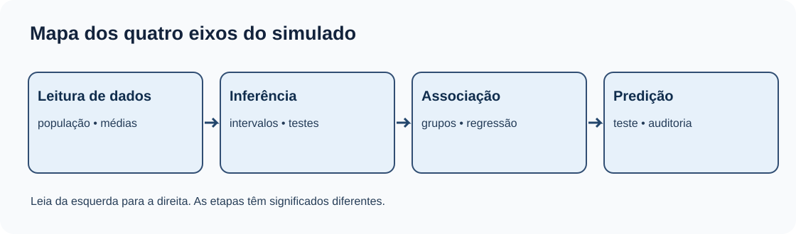
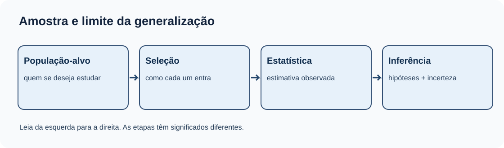
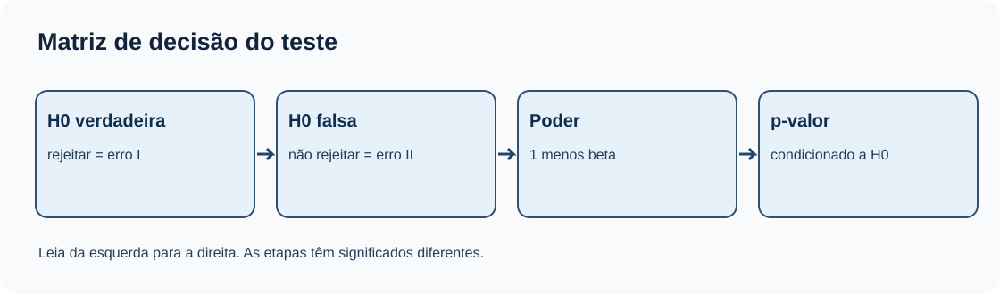
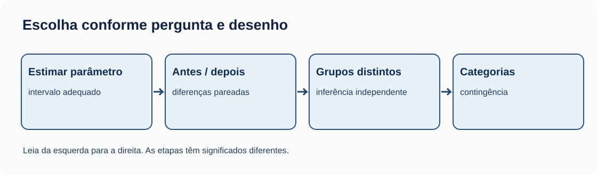
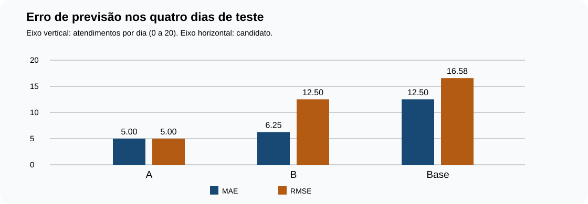
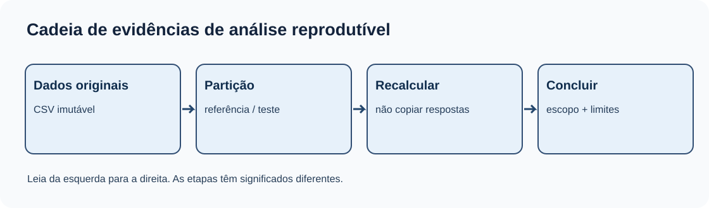
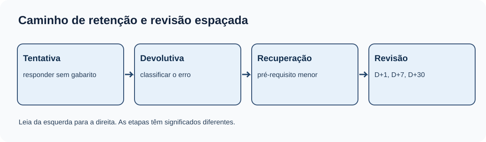

# MAT-EST-037 — Simulado integrador de Estatística: aplicação multidimensional, correção comentada e auditoria de retenção

**Natureza:** 48 itens autorais, sem reprodução de questões oficiais. Dados quantitativos do exercício são fictícios. O conteúdo é material editorial; NÃO representa tentativa, nota, domínio ou revisão efetiva do estudante.

**Uso sugerido:** quatro blocos de 25 a 50 minutos, com pausas conforme necessidade. A camada reteste deve ser aplicada somente após correção e remediação, em sessão posterior; não deve ser usada para inflar a nota da primeira tentativa. A correção está separada em `gabarito-comentado.json`.

## 1. Objetivos e pré-requisitos

Identificar a pergunta, o desenho, a variável e o limite da inferência antes de selecionar a fórmula; resolver situações simples, combinadas e novas; distinguir cálculo correto de interpretação válida; e verificar recuperação após intervalo de tempo. Para descrição anterior ao MAT-EST-019, recuperar os conteúdos efetivos do catálogo sem inventar título para cada código MAT-EST-001 a 018.

Pré-requisitos em cadeia: MAT-EST-019 a 036, fundamentos de leitura de dados, frações, porcentagens, média, variância e probabilidade. A unidade MAT-PRO é acionada quando o item exige raciocínio condicional. No teste, não inferir domínio a partir da publicação das aulas.

## 2. Antes de resolver: mapa de decisões

O mesmo número pode exigir análise diferente conforme a pergunta. Descrever os 54 resultados positivos observados entre 100 respostas é estatística descritiva. Estimar a proporção de toda uma população exige desenho de amostragem e incerteza. Testar uma hipótese requer modelo, hipótese nula, estatística de teste e condições verificadas. Prever um dia novo exige avaliar desempenho fora dos dados usados para escolher o modelo.

**Figura 1 — Mapa dos quatro eixos do simulado.** Texto alternativo: Fluxo entre leitura descritiva, inferência, comparação e predição; após correção há diagnóstico e reteste. O que observar: Observe que as camadas são integradas e não substituem os pré-requisitos. Conclusão em texto: O percurso só se fecha depois da tentativa, diagnóstico e recuperação.

Siga esta leitura em toda pergunta: população e unidade de análise; dados disponíveis; variável categórica ou quantitativa; grupos independentes ou pareados; finalidade — descrição, estimação, teste, associação ou previsão; condições do método; cálculo; conclusão e limitação. Não escolha automaticamente um teste por uma palavra isolada do enunciado.

**Figura 2 — Amostra e limite da generalização.** Texto alternativo: Seta liga população-alvo, seleção da amostra, estatística, inferência; seleção enviesada aparece como advertência. Observe: Observe que seleção antecede o cálculo. Conclusão: Mais respostas não corrigem automaticamente autoseleção.

## 3. Fundamentos que precisam estar audíveis e compreensíveis

A média é a soma dos valores dividida pela quantidade de valores. Para uma média amostral de n observações independentes, sob desvio-padrão populacional conhecido sigma, o erro-padrão é `EP = σ/√n`, lido “sigma dividido pela raiz quadrada de ene”. O erro-padrão descreve a variabilidade do estimador em repetições do desenho, não a dispersão de todos os indivíduos. Correlação entre observações ou amostra complexa exige outras fórmulas.

A forma geral de um intervalo é `estimativa ± multiplicador × erro-padrão`, lida “estimativa mais ou menos multiplicador vezes erro-padrão”. Um procedimento com 95% de cobertura produz intervalos que capturam o parâmetro fixo em cerca de 95% das aplicações hipotéticas sob as hipóteses corretas. Isso não significa que 95% dos dados caem no intervalo nem uma probabilidade posterior de 95% de o parâmetro fixo estar em determinado intervalo já observado.

Um teste de hipóteses compara o que foi observado com o comportamento esperado sob a hipótese nula. Valor-p pequeno pode indicar incompatibilidade entre dados e hipótese nula no modelo escolhido, mas não mede tamanho do efeito nem probabilidade de a hipótese ser verdadeira. Erro do tipo I é rejeitar uma hipótese nula verdadeira. Erro do tipo II é deixar de rejeitar uma hipótese nula falsa. O poder, igual a um menos beta, é definido sob uma alternativa especificada.

**Figura 3 — Matriz de decisão do teste.** Texto alternativo: Duas decisões cruzadas com hipótese verdadeira e hipótese falsa; aparecem erro I, erro II e poder. Observe: Observe que não rejeitar não prova igualdade. Conclusão: Alfa, beta e poder são propriedades condicionais do procedimento.

## 4. Escolha entre comparação e associação

Duas medidas da mesma pessoa formam pares: primeiro calcule as diferenças. Dois grupos de pessoas distintas são independentes apenas quando o desenho e a coleta justificarem essa hipótese. Para mais de dois grupos, a ANOVA contrasta variabilidade entre e dentro dos grupos; rejeitar a hipótese global não identifica automaticamente quais pares são diferentes. Para variáveis categóricas, a tabela de contingência permite observar margens e contagens esperadas. A aproximação qui-quadrado depende de condições de contagem, e associação não demonstra causalidade.

**Figura 4 — Escolha conforme pergunta e desenho.** Texto alternativo: Caixas relacionam estimativa, grupos pareados, grupos independentes e variáveis categóricas a famílias de análise. Observe: Leia pergunta, variável e vínculo entre observações antes de selecionar teste. Conclusão: O teste apropriado depende do desenho, não só da fórmula lembrada.

## 5. Regressão e modelos preditivos

O resíduo é `eᵢ = yᵢ − ŷᵢ`, lido “valor observado menos valor previsto para a observação i”. Resíduos com padrão podem indicar curvatura, variância desigual, dependência ou outros problemas a investigar. Em regressão múltipla, um coeficiente representa associação condicional aos termos incluídos, não causalidade garantida. Uma interação entre grupo e preditor admite inclinações diferentes.

MAE é a média dos valores absolutos dos erros; MSE é a média dos erros elevados ao quadrado; RMSE é a raiz quadrada do MSE, expressa na unidade da variável prevista. Uma métrica isolada não representa automaticamente os custos da decisão. Dados de teste precisam ficar preservados durante ajuste e escolha de modelos, inclusive durante transformação de variáveis.

### Exemplo resolvido: mesmo conjunto sintético das aulas MAT-EST-034 a 036

A tabela abaixo reproduz somente as quatro linhas de teste, dias 5 a 8. As unidades são atendimentos por dia fictícios; previsões A e B foram fornecidas didaticamente, sem afirmar que foram treinadas nos quatro dias anteriores.

| Dia | Observado | Candidato A | Candidato B | Referência constante |
|---:|---:|---:|---:|---:|
| 5 | 90 | 95 | 90 | 100 |
| 6 | 110 | 105 | 110 | 100 |
| 7 | 130 | 125 | 130 | 100 |
| 8 | 100 | 105 | 125 | 100 |

Adotando erro igual a observado menos previsto: A tem erros menos cinco, mais cinco, mais cinco, menos cinco; B tem zero, zero, zero, menos vinte e cinco; a referência tem menos dez, mais dez, mais trinta e zero. Portanto MAE de A vale 5 e RMSE vale 5; MAE de B vale 6,25 e RMSE vale 12,5; MAE da referência vale 12,5 e RMSE aproximadamente 16,58. Esses números foram recalculados a partir do CSV, não criados como histórico de um serviço real.

**Figura 5 — Comparação de MAE e RMSE no teste fictício.** Texto alternativo: Barras dos candidatos A, B e Base para MAE e RMSE nos dias 5 a 8, em atendimentos por dia. Observe: A=5 e 5; B=6,25 e 12,5; Base=12,5 e aproximadamente 16,58. Conclusão: O erro extremo de B aumenta mais o RMSE do que seu MAE.

Se falta de previsão custar três unidades monetárias fictícias por atendimento e excesso custar uma, o custo de A será 40 e o de B, 25. Se os pesos forem invertidos, A continuará 40 e B passará a 75. Essa comparação ilustra que uma métrica de qualidade preditiva não escolhe sozinha uma decisão, e os custos do problema precisam ser declarados.

## 6. Auditoria de origem e limites

As três cópias `dados-ficticios.csv`, `calculos-reproduziveis-originais.json` e `auditoria-recalculada.json` foram recebidas do pacote MAT-EST-036 e permanecem sem alteração. Hash SHA-256 igual pode comprovar a identidade dos bytes comparados, mas não demonstra representatividade de uma amostra, correção de cálculos ou causalidade. Uma revisão independente deve refazer os cálculos a partir do CSV, identificar partições e declarar suas condições.

**Figura 6 — Cadeia de evidências de análise reprodutível.** Texto alternativo: Sequência: dados, partição, cálculo independente, hipótese, interpretação, revisão e hash do arquivo. Observe: O hash só garante identidade dos bytes, não validade da conclusão. Conclusão: Reprodutibilidade e validade são etapas diferentes.

## 7. Aplicação do simulado e critérios

O material contém doze questões de aprendizagem, doze de consolidação, dezesseis de transferência e oito de reteste independente. A avaliação principal tem quarenta itens; os oito de reteste somente são aplicados em sessão posterior, após diagnóstico e recuperação. A pontuação não representa a escala do ENEM nem a correção oficial de FUVEST, UNICAMP ou UNESP. Em itens discursivos, a correção verifica leitura do comando, escolha justificada do método, unidades, cálculo, conclusão e limites.

Antes da tentativa: ocultar `gabarito-comentado.json`, registrar apenas respostas reais e permitir que o estudante descreva seu raciocínio. Depois: classificar por conteúdo, interpretação, cálculo, distração, memória, estratégia ou tempo. Não substituir silenciosamente uma resposta enviada; cada nova tentativa precisa de registro próprio.

## 8. Simulado — enunciados inéditos

**Atenção editorial:** os itens abaixo não são questões oficiais. No site, o gabarito deve permanecer oculto até a submissão efetiva. Para estudo por áudio, o identificador de cada questão antecede o enunciado.

### Camada A — Aprendizagem básica (12 itens)

**MAT-EST-037-EX-APR-01 — População e amostra.** Deseja-se estudar a renda de todos os moradores adultos de uma cidade. Entrevistaram-se 120 adultos. Defina população-alvo e amostra.

**MAT-EST-037-EX-APR-02 — Frequência observada.** Em 100 respostas válidas fictícias, 54 são positivas. Qual a proporção da amostra? A proporção populacional fica determinada?

**MAT-EST-037-EX-APR-03 — Média aritmética.** Os dados são 2, 4, 6 e 8 unidades. Calcule a média.

**MAT-EST-037-EX-APR-04 — Variância amostral.** Calcule a variância AMOSTRAL de 2, 4 e 6.

**MAT-EST-037-EX-APR-05 — Erro-padrão.** Para 36 observações independentes, o desvio-padrão populacional conhecido é 12. Qual o erro-padrão da média?

**MAT-EST-037-EX-APR-06 — Intervalo normal.** Média 50, erro-padrão 2 e multiplicador normal 1,96. Calcule o intervalo ilustrativo de 95%.

**MAT-EST-037-EX-APR-07 — Erro tipo I.** Em um teste com hipótese nula de igualdade, o que é erro do tipo I?

**MAT-EST-037-EX-APR-08 — Interpretação do valor-p.** Um teste fornece p = 0,03. Isso significa 3% de probabilidade de H0 ser verdadeira?

**MAT-EST-037-EX-APR-09 — Desenho pareado.** Uma mesma pessoa realiza teste de memória antes e depois de um curso. Qual unidade entra na análise?

**MAT-EST-037-EX-APR-10 — Escolha do teste por tipo de variável.** Em uma tabela dois por dois com duas variáveis categóricas, qual família de testes costuma investigar associação sob condições adequadas?

**MAT-EST-037-EX-APR-11 — Resíduo com unidade.** Um valor observado é 105 e sua previsão é 100 atendimentos. Adote resíduo observado menos previsto.

**MAT-EST-037-EX-APR-12 — Partição de teste.** Qual a função de um conjunto de teste final não consultado ao escolher modelos e parâmetros?

### Camada B — Consolidação (12 itens)

**MAT-EST-037-EX-CON-01 — Intervalo para proporção.** Em amostragem aleatória simples e observações independentes, 54 de 100 respostas foram positivas. Use o intervalo normal de Wald de 95%, z=1,96.

**MAT-EST-037-EX-CON-02 — Diferença de duas médias independentes.** Dois grupos independentes de 36 pessoas: médias 72 e 68; desvios-padrão populacionais conhecidos 12 e 9. Obtenha erro-padrão da diferença e intervalo z de 95%.

**MAT-EST-037-EX-CON-03 — Diferenças pareadas.** Três pares geram diferenças depois menos antes de 2, 4 e 6 unidades. Calcule média, desvio amostral e erro-padrão das diferenças.

**MAT-EST-037-EX-CON-04 — ANOVA explicada.** Três grupos têm observações [2,4], [4,6], [6,8]. Calcule SQ entre, SQ dentro e F da ANOVA de uma via.

**MAT-EST-037-EX-CON-05 — Qui-quadrado calculado.** Uma tabela de observados é [[30,20],[20,30]], com totais de linha e coluna 50 e N=100. Obtenha esperados e qui-quadrado.

**MAT-EST-037-EX-CON-06 — Correlação perfeita linear.** Para pares (x,y)=(1,2),(2,4),(3,6), identifique a reta e a correlação de Pearson.

**MAT-EST-037-EX-CON-07 — Interação entre grupo e x.** Modelo ŷ=10+2x+3D+xD, D igual 0 ou 1. Calcule a previsão para x=4 e D=1 e identifique a inclinação desse grupo.

**MAT-EST-037-EX-CON-08 — Métricas herdadas do projeto.** Use dias 5 a 8 do CSV: observados 90,110,130,100; previsões A 95,105,125,105. Calcule MAE e RMSE.

**MAT-EST-037-EX-CON-09 — Previsão com erro extremo.** No mesmo teste, previsões B 90,110,130,125. Calcule erros, MAE e RMSE.

**MAT-EST-037-EX-CON-10 — Custo de erros assimétricos.** Para os dias de teste, custo de falta = 3 por unidade e de excesso = 1. Compare custos dos candidatos A e B.

**MAT-EST-037-EX-CON-11 — Vazamento no pré-processamento.** Um pesquisador normaliza todas as linhas, inclusive teste, antes da divisão treino/teste. Identifique risco e correção.

**MAT-EST-037-EX-CON-12 — Métricas de três resíduos.** Observado [1,2,3], previsto [1,2,2]. Calcule MAE e RMSE.

### Camada C — Transferência e estilo vestibular (16 itens)

**MAT-EST-037-EX-VES-01 — Amostra de conveniência.** Uma enquete aberta em rede social tem 900 respostas e 90% a favor de uma medida. Pode-se declarar que 90% de todos os moradores concordam? Justifique.

**MAT-EST-037-EX-VES-02 — Taxa-base e teste positivo.** Condição fictícia com prevalência 2%, sensibilidade 90% e falso positivo 10%. Qual a probabilidade de condição dado teste positivo?

**MAT-EST-037-EX-VES-03 — Cobertura frequencista.** Uma rotina gera IC de 95% sob hipóteses corretas. O que significa a expressão 95% depois de observar um intervalo específico?

**MAT-EST-037-EX-VES-04 — Significância versus efeito.** Estudo muito grande fornece p=0,03 para diferença média de 0,1 unidade, considerada irrelevante para a decisão. Com alfa 0,05, qual conclusão cabe?

**MAT-EST-037-EX-VES-05 — Multiplicidade.** Dez testes independentes sob dez hipóteses nulas verdadeiras, cada um com 5% de erro I. Qual a chance de ao menos um falso positivo?

**MAT-EST-037-EX-VES-06 — Tamanho amostral e precisão.** Suponha amostras independentes com desvio populacional inalterado. Para reduzir erro-padrão da média à metade, por qual fator multiplicar n?

**MAT-EST-037-EX-VES-07 — Conclusão após ANOVA.** Uma ANOVA global rejeita igualdade entre quatro médias. É correto afirmar que todos os pares de grupos diferem?

**MAT-EST-037-EX-VES-08 — Célula pequena na contingência.** Uma tabela categórica tem contagem esperada 2 em uma das células. Qual preocupação surge?

**MAT-EST-037-EX-VES-09 — Paradoxo de Simpson ilustrado.** Grupo A tem 19/20 sucessos no estrato alto e 16/80 no baixo; grupo B tem 72/90 no alto e 1/10 no baixo. Calcule as taxas globais e explique a inversão.

**MAT-EST-037-EX-VES-10 — Associação não linear.** Pares x=[−2,−1,0,1,2], y=[4,1,0,1,4]. Descreva a relação e a correlação linear de Pearson.

**MAT-EST-037-EX-VES-11 — Extrapolação.** Modelo linear estimado usando x de 1 a 5 gera previsão em x=10. O cálculo é possível; o que falta para confiar na conclusão?

**MAT-EST-037-EX-VES-12 — Sobreajuste por exemplo.** Modelo simples tem MAE treino 5 e teste 6; modelo flexível tem treino 0 e teste 20. O que sugerem esses números?

**MAT-EST-037-EX-VES-13 — Variável pós-desfecho.** Modelo de previsão da demanda de amanhã usa variável conhecida apenas ao fim de amanhã. Qual problema e correção?

**MAT-EST-037-EX-VES-14 — Validação em série temporal.** Registros apresentam tendência ao longo de meses. Por que divisão aleatória de linhas pode não representar previsão do futuro?

**MAT-EST-037-EX-VES-15 — Mudança no erro do modelo.** Na amostra de referência o candidato B teve MAE 5 e RMSE 10; no teste posterior teve MAE 6,25 e RMSE 12,5. O que isso demonstra e o que não demonstra?

**MAT-EST-037-EX-VES-16 — Hash e revisão independente.** Dois relatórios compartilham o mesmo hash SHA-256 do CSV. Isso demonstra que o procedimento estatístico e a conclusão são corretos?

### Camada D — Reteste independente (8 itens; sessão posterior)

**MAT-EST-037-EX-RET-01 — Nova média.** Nova lista independente da anterior: 4, 6, 8 e 10. Qual a média?

**MAT-EST-037-EX-RET-02 — Novo erro-padrão.** Amostra independente de n=100 com desvio populacional conhecido 20. Calcule o erro-padrão da média.

**MAT-EST-037-EX-RET-03 — Novo intervalo ilustrativo.** Média 80, erro-padrão 3, multiplicador 1,96. Obtenha o intervalo normal ilustrativo.

**MAT-EST-037-EX-RET-04 — Novos pares.** Diferenças dentro das pessoas: 1, 3 e 5. Qual média das diferenças?

**MAT-EST-037-EX-RET-05 — Nova tabela categórica.** Observados [[12,8],[8,12]], totais de linha e coluna 20. Calcule χ² e graus de liberdade.

**MAT-EST-037-EX-RET-06 — Nova interação.** Modelo ŷ=5+3x+2D+2xD. Calcule para x=2, D=1.

**MAT-EST-037-EX-RET-07 — Novas métricas.** Quatro erros observado menos previsto são [1,−3,2,−2]. Calcule MAE e RMSE.

**MAT-EST-037-EX-RET-08 — Outro nível de significância.** Um teste fornece p=0,02 e alfa=0,01. Qual decisão formal?

## 9. Correção comentada — CONSULTAR DEPOIS da tentativa

**Orientação de publicação:** as resoluções são material editorial para impressão ou conferência posterior. O site deve usar `gabarito-comentado.json` de modo separado; não expor esta seção automaticamente antes da primeira submissão. Não há tentativa nem nota individual registradas.

### Correção — Camada A — Aprendizagem básica (12 itens)

**MAT-EST-037-EX-APR-01.** Resposta: População: todos os moradores adultos; amostra: os 120 entrevistados.

1. População é o conjunto sobre o qual se quer concluir.
2. A amostra reúne apenas as unidades observadas; seleção e cobertura ainda precisam ser avaliadas.
**Erro provável a investigar:** Confundir população com pessoas efetivamente entrevistadas. **Revisitar:** MAT-EST-019.

**MAT-EST-037-EX-APR-02.** Resposta: 54/100 = 0,54 = 54%; não se conhece exatamente o parâmetro da população.

1. Divida 54 por 100 e converta para porcentagem.
2. Uma frequência amostral é estimativa, não prova de prevalência populacional.
**Erro provável a investigar:** Apresentar estatística amostral como parâmetro exato. **Revisitar:** MAT-EST-019.

**MAT-EST-037-EX-APR-03.** Resposta: 5 unidades.

1. Some 2+4+6+8 = 20.
2. Divida por quatro registros: 20/4 = 5.
**Erro provável a investigar:** Dividir pela soma em vez do número de observações. **Revisitar:** MAT-EST-036.

**MAT-EST-037-EX-APR-04.** Resposta: 4 unidades ao quadrado.

1. Média: 4. Desvios: -2, 0 e +2.
2. Soma dos quadrados: 8; divida por n-1=2.
**Erro provável a investigar:** Usar divisor n na variância amostral usual. **Revisitar:** MAT-EST-019.

**MAT-EST-037-EX-APR-05.** Resposta: 12/√36 = 2 unidades.

1. A raiz de 36 é seis.
2. Divida 12 por seis; a fórmula exige o desenho e a independência assumidos.
**Erro provável a investigar:** Dividir 12 por 36 em vez de sua raiz. **Revisitar:** MAT-EST-019.

**MAT-EST-037-EX-APR-06.** Resposta: [46,08; 53,92].

1. Margem: 1,96 vezes 2 = 3,92.
2. Subtraia e some 3,92 a 50; interprete cobertura como propriedade do procedimento sob hipóteses.
**Erro provável a investigar:** Tratar 1,96 como margem completa ou afirmar que o parâmetro é aleatório. **Revisitar:** MAT-EST-020.

**MAT-EST-037-EX-APR-07.** Resposta: Rejeitar uma hipótese nula verdadeira.

1. Cruze situação real com decisão.
2. Alfa é a taxa de erro I estabelecida pelo procedimento sob a hipótese nula, respeitadas suas condições.
**Erro provável a investigar:** Inverter os erros I e II. **Revisitar:** MAT-EST-021, MAT-EST-022.

**MAT-EST-037-EX-APR-08.** Resposta: Não. É a probabilidade, sob H0 e o modelo assumido, de resultado tão extremo ou mais que o observado.

1. Condicione a probabilidade à hipótese nula e ao modelo.
2. O valor-p não é uma probabilidade posterior da hipótese nula.
**Erro provável a investigar:** Inverter P(dados|H0) com P(H0|dados). **Revisitar:** MAT-EST-021.

**MAT-EST-037-EX-APR-09.** Resposta: A diferença dentro de cada pessoa (medição depois menos antes, ou convenção declarada).

1. As observações antes e depois da mesma pessoa estão vinculadas.
2. Calcule as diferenças individuais e analise seu conjunto.
**Erro provável a investigar:** Tratar duas medidas da mesma pessoa como independentes. **Revisitar:** MAT-EST-023.

**MAT-EST-037-EX-APR-10.** Resposta: Teste qui-quadrado de independência; com contagens esperadas pequenas, avaliar teste exato apropriado.

1. Identifique que ambas as variáveis são categóricas.
2. Verifique frequências esperadas antes de confiar na aproximação qui-quadrado.
**Erro provável a investigar:** Usar correlação de Pearson diretamente em categorias nominais. **Revisitar:** MAT-EST-025.

**MAT-EST-037-EX-APR-11.** Resposta: Resíduo = +5 atendimentos.

1. Subtraia 100 de 105.
2. O sinal positivo representa subprevisão no modelo adotado.
**Erro provável a investigar:** Trocar a convenção e inverter o sinal sem aviso. **Revisitar:** MAT-EST-026, MAT-EST-027.

**MAT-EST-037-EX-APR-12.** Resposta: Avaliar desempenho em dados preservados, não usados para escolher ou ajustar o modelo.

1. Treino ajusta, validação auxilia a escolha, teste final avalia de forma independente.
2. Consultar o teste repetidamente pode contaminar a avaliação.
**Erro provável a investigar:** Usar dados de teste para ajustar transformações ou escolher o modelo. **Revisitar:** MAT-EST-031.

### Correção — Camada B — Consolidação (12 itens)

**MAT-EST-037-EX-CON-01.** Resposta: 0,54 ± 1,96√(0,54×0,46/100) ≈ [0,4423; 0,6377], isto é, 44,23% a 63,77%.

1. Calcule p amostral = 54/100.
2. Erro-padrão estimado √(0,54×0,46/100) ≈ 0,04984.
3. A margem ≈ 0,09768; use apenas sob condições apropriadas e descreva o método de aproximação.
**Erro provável a investigar:** Usar 54 no numerador do erro-padrão no lugar de 0,54. **Revisitar:** MAT-EST-019, MAT-EST-020.

**MAT-EST-037-EX-CON-02.** Resposta: Diferença 4; erro-padrão √(144/36 + 81/36) = 2,5; intervalo aproximado [-0,90; 8,90].

1. Use variâncias divididas por tamanhos separados e depois some.
2. Multiplicador 1,96 × 2,5 = 4,9.
3. O intervalo contém zero, sob o modelo e hipóteses de amostras independentes.
**Erro provável a investigar:** Somar desvios-padrão em vez de variâncias dos estimadores. **Revisitar:** MAT-EST-020, MAT-EST-023.

**MAT-EST-037-EX-CON-03.** Resposta: Média 4; desvio-padrão amostral 2; erro-padrão = 2/√3 ≈ 1,155.

1. Média das diferenças é quatro.
2. Quadrados dos desvios: 4+0+4=8; divida por 2, obtendo variância 4.
3. Divida s=2 por raiz de três.
**Erro provável a investigar:** Calcular médias separadas e ignorar vínculo dos pares. **Revisitar:** MAT-EST-023.

**MAT-EST-037-EX-CON-04.** Resposta: SQ entre = 16; SQ dentro = 6; graus 2 e 3; F=(16/2)/(6/3)=4.

1. Médias por grupo: 3,5,7; média geral 5.
2. Entre: 2×(3−5)² + 2×0² + 2×(7−5)² = 16.
3. Dentro: para cada grupo quadrados de -1 e +1 somam 2; total 6.
4. Compare quadrados médios 8 e 2; F = 4, sem afirmar significância sem referência adequada.
**Erro provável a investigar:** Confundir graus de liberdade entre e dentro. **Revisitar:** MAT-EST-024.

**MAT-EST-037-EX-CON-05.** Resposta: Quatro esperados iguais a 25; χ²=4, com um grau de liberdade.

1. Cada esperado é 50×50/100=25.
2. Cada célula contribui (5²)/25=1; some 4.
3. Não conclua causalidade a partir do teste de associação.
**Erro provável a investigar:** Usar observados na fórmula dos esperados. **Revisitar:** MAT-EST-025.

**MAT-EST-037-EX-CON-06.** Resposta: Reta y=2x; r=+1, com variação positiva não nula em x e y.

1. Cada valor y é o dobro de x.
2. A relação é estritamente linear crescente; coeficiente é um.
3. Uma relação perfeita nos três pontos não prova mecanismo causal.
**Erro provável a investigar:** Traduzir correlação perfeita diretamente em causalidade. **Revisitar:** MAT-EST-026.

**MAT-EST-037-EX-CON-07.** Resposta: ŷ=25; grupo D=1: ŷ=13+3x; inclinação 3.

1. Substitua D=1, some termos fixos 10+3.
2. Some inclinações 2+1; em x=4, 13+12=25.
**Erro provável a investigar:** Interpretar interação apenas como mudança fixa no intercepto. **Revisitar:** MAT-EST-028, MAT-EST-029.

**MAT-EST-037-EX-CON-08.** Resposta: Erros observado−previsto: -5,+5,+5,-5; MAE=5; RMSE=5 atendimentos.

1. Os quatro erros têm módulo 5.
2. MAE=20/4=5 e MSE=(25×4)/4=25; raiz =5.
**Erro provável a investigar:** Não restringir os cálculos às quatro linhas de teste. **Revisitar:** MAT-EST-032, MAT-EST-034.

**MAT-EST-037-EX-CON-09.** Resposta: Erros 0,0,0,-25; MAE=6,25; RMSE=12,5 atendimentos.

1. Somatório absoluto 25 dividido por 4 = 6,25.
2. Somatório de quadrados 625/4 = 156,25; raiz = 12,5.
3. Erros concentrados afetam RMSE mais intensamente.
**Erro provável a investigar:** Calcular raiz da soma antes de dividir por número de registros. **Revisitar:** MAT-EST-032, MAT-EST-034.

**MAT-EST-037-EX-CON-10.** Resposta: A: 40; B: 25 unidades monetárias fictícias.

1. Erros positivos significam falta: A tem duas faltas de cinco, custo 2×5×3=30.
2. A tem dois excessos de cinco, custo 10; total 40.
3. B tem somente excesso de 25; custo 25.
4. O critério depende dos custos fornecidos e não estabelece superioridade universal.
**Erro provável a investigar:** Tratar RMSE como única métrica de decisão com custos assimétricos. **Revisitar:** MAT-EST-032, MAT-EST-033.

**MAT-EST-037-EX-CON-11.** Resposta: Há vazamento potencial da distribuição do teste. Ajustar parâmetros de normalização só no treino e aplicar ao teste sem refazer.

1. Média e desvio usados para normalizar são aprendidos dos dados.
2. Se incluem teste, informação externa entra no treinamento.
3. Use pipeline dentro da validação cruzada.
**Erro provável a investigar:** Considerar normalização operação neutra que dispensa separação de dados. **Revisitar:** MAT-EST-031, MAT-EST-035.

**MAT-EST-037-EX-CON-12.** Resposta: Resíduos [0,0,+1]; MAE=1/3≈0,333; RMSE=√(1/3)≈0,577.

1. Some valores absolutos: 1; divida por 3.
2. Some quadrados: 1; divida por 3 e extraia raiz.
**Erro provável a investigar:** Confundir média de módulos com raiz da média dos quadrados. **Revisitar:** MAT-EST-032.

### Correção — Camada C — Transferência e estilo vestibular (16 itens)

**MAT-EST-037-EX-VES-01.** Resposta: Não. Alta quantidade de respostas não elimina autoseleção e problemas de cobertura; concluir sobre a população requer desenho apropriado.

1. Identifique população-alvo e mecanismo de inclusão.
2. Reconheça que visitantes voluntários podem diferir dos moradores em geral.
3. Evite usar uma margem de erro de amostragem aleatória para justificar seleção de conveniência.
**Erro provável a investigar:** Confundir grande n com representatividade. **Revisitar:** MAT-EST-019, MAT-EST-020.

**MAT-EST-037-EX-VES-02.** Resposta: 0,02×0,90/[0,02×0,90+0,98×0,10] = 0,018/0,116 ≈ 15,52%.

1. Calcule verdadeiros positivos relativos: 0,018.
2. Calcule falsos positivos relativos: 0,098.
3. Divida positivos verdadeiros pelo total de positivos; condições e taxas são hipotéticas.
**Erro provável a investigar:** Ignorar taxa-base e afirmar que positivo significa 90% de chance. **Revisitar:** MAT-EST-019, MAT-PRO-001.

**MAT-EST-037-EX-VES-03.** Resposta: Em repetições hipotéticas do procedimento, cerca de 95% dos intervalos construídos conteriam o parâmetro fixo; não é uma probabilidade posterior de 95% para o parâmetro naquele intervalo observado.

1. Distinguir parâmetro fixo de intervalos aleatórios.
2. Relacionar a frequência de cobertura ao procedimento e suas hipóteses.
**Erro provável a investigar:** Dizer que o parâmetro fixo muda aleatoriamente entre intervalos. **Revisitar:** MAT-EST-020.

**MAT-EST-037-EX-VES-04.** Resposta: Rejeita-se H0 no procedimento especificado, mas a relevância prática do efeito não foi demonstrada.

1. Compare p com alfa.
2. Informe magnitude, unidade, incerteza e critério de importância.
3. Não converta significância estatística automaticamente em benefício relevante.
**Erro provável a investigar:** Tratar rejeição de H0 como certificação de impacto substancial. **Revisitar:** MAT-EST-021, MAT-EST-022.

**MAT-EST-037-EX-VES-05.** Resposta: 1−0,95^10 ≈ 0,4013, ou 40,13%, sob independência e hipóteses descritas.

1. Calcule a probabilidade de nenhum erro: 0,95 multiplicado dez vezes.
2. Subtraia de um; se testes não são independentes a expressão exata pode mudar.
**Erro provável a investigar:** Somar 5% dez vezes como probabilidade exata, sem considerar sobreposição. **Revisitar:** MAT-EST-022, MAT-EST-024.

**MAT-EST-037-EX-VES-06.** Resposta: Por quatro.

1. EP=σ/√n.
2. Para dobrar a raiz de n, quadruplicar n; não elimina viés de seleção.
**Erro provável a investigar:** Achar que basta duplicar a amostra. **Revisitar:** MAT-EST-019, MAT-EST-022.

**MAT-EST-037-EX-VES-07.** Resposta: Não. A evidência global indica que ao menos uma média difere, dadas hipóteses; comparações de pares exigem procedimento adicional e controle apropriado de multiplicidade.

1. Declare o alcance da hipótese global.
2. Planeje comparações pós-teste conforme pergunta e desenho.
**Erro provável a investigar:** Inferir todos os pares a partir de um F global. **Revisitar:** MAT-EST-024.

**MAT-EST-037-EX-VES-08.** Resposta: A aproximação usual qui-quadrado pode ser inadequada; examinar desenho, contagens e alternativas como teste exato de Fisher para uma tabela 2×2 quando apropriado.

1. Calcule frequências esperadas por produtos marginais sobre total.
2. Escolha procedimento respeitando condições; Fisher não conserta amostragem enviesada.
**Erro provável a investigar:** Aplicar aproximação assintótica independentemente de esperados. **Revisitar:** MAT-EST-025.

**MAT-EST-037-EX-VES-09.** Resposta: A:35/100=35%; B:73/100=73%. Dentro do estrato alto: A95% > B80%; no baixo: A20% > B10%. Distribuições desiguais dos estratos produzem inversão agregada.

1. Calcule cada taxa dentro dos estratos, mantendo seu denominador.
2. Calcule os totais globais de sucessos e participantes.
3. Interprete a distribuição diferente entre estratos antes de concluir sobre o grupo.
**Erro provável a investigar:** Misturar taxas sem examinar os pesos dos estratos. **Revisitar:** MAT-EST-025, MAT-EST-033.

**MAT-EST-037-EX-VES-10.** Resposta: y=x² é dependência não linear perfeita nos cinco pontos; Pearson r=0 pela simetria.

1. A média de x é zero.
2. A soma x×(y−média de y) é zero por pares simétricos.
3. r nulo não significa ausência de toda relação.
**Erro provável a investigar:** Interpretar r=0 como independência ou ausência de qualquer associação. **Revisitar:** MAT-EST-026.

**MAT-EST-037-EX-VES-11.** Resposta: É extrapolação; exige justificativa estrutural e validação adicional fora da faixa observada.

1. Separe resultado da fórmula de validade empírica.
2. Examine comportamento do fenômeno e limites da amostra.
**Erro provável a investigar:** Confundir facilidade de calcular com evidência de validade. **Revisitar:** MAT-EST-027.

**MAT-EST-037-EX-VES-12.** Resposta: No recorte de teste, o flexível generalizou pior apesar do ajuste perfeito em treino; há indício de sobreajuste, a investigar.

1. Não escolha só pelo desempenho de treino.
2. Compare os erros de teste e tamanho/representatividade desse teste.
3. Não afirme que o modelo simples vencerá em todos os contextos.
**Erro provável a investigar:** Usar erro zero de treino como garantia para novos dados. **Revisitar:** MAT-EST-031, MAT-EST-032.

**MAT-EST-037-EX-VES-13.** Resposta: Vazamento temporal: a variável não está disponível quando a previsão seria feita. Excluir, substituir por preditor disponível no momento ou redefinir a tarefa e revalidar.

1. Fixe o instante de previsão.
2. Liste disponibilidade de cada variável naquele instante.
3. Refaça treino e avaliação com a restrição real.
**Erro provável a investigar:** Confundir informação histórica com informação futura. **Revisitar:** MAT-EST-031, MAT-EST-035.

**MAT-EST-037-EX-VES-14.** Resposta: Pode misturar informações posteriores e anteriores e criar avaliação otimista; uma validação por ordem temporal costuma ser mais fiel à tarefa prospectiva.

1. Identifique a direção temporal da previsão.
2. Reserve períodos posteriores para teste e evite vazamento em transformações.
**Erro provável a investigar:** Ignorar ordem cronológica em tarefa prospectiva. **Revisitar:** MAT-EST-031.

**MAT-EST-037-EX-VES-15.** Resposta: Demonstra alteração de métricas nesse recorte fictício; não prova a causa nem tendência populacional permanente, pois há apenas quatro observações em cada partição.

1. Leia partições corretamente.
2. Compare métricas com suas unidades; examine variabilidade, composição e quantidade de registros.
**Erro provável a investigar:** Atribuir piora causal e permanente a quatro registros. **Revisitar:** MAT-EST-032, MAT-EST-034, MAT-EST-035.

**MAT-EST-037-EX-VES-16.** Resposta: Não. Hash igual confere identidade dos bytes dos arquivos comparados; precisa-se ainda auditar fórmulas, versão, partição, hipóteses e interpretação.

1. Distinguir integridade de dados e validade da análise.
2. Reproduzir cálculos sem simplesmente copiar resultados publicados.
**Erro provável a investigar:** Tratar integridade técnica como garantia de inferência correta. **Revisitar:** MAT-EST-034, MAT-EST-035.

### Correção — Camada D — Reteste independente (8 itens; sessão posterior)

**MAT-EST-037-EX-RET-01.** Resposta: 7.

1. Some 28 e divida por 4.
**Erro provável a investigar:** Repetir resposta antiga sem recalcular. **Revisitar:** MAT-EST-036.

**MAT-EST-037-EX-RET-02.** Resposta: 20/√100 = 2.

1. A raiz de 100 é dez; divida 20 por dez.
**Erro provável a investigar:** Confundir n e raiz de n. **Revisitar:** MAT-EST-019.

**MAT-EST-037-EX-RET-03.** Resposta: [74,12; 85,88].

1. Margem 1,96×3 = 5,88.
2. Limites 80−5,88 e 80+5,88.
**Erro provável a investigar:** Esquecer o multiplicador ou arredondar cedo. **Revisitar:** MAT-EST-020.

**MAT-EST-037-EX-RET-04.** Resposta: 3 unidades.

1. Some 1+3+5=9 e divida por três.
2. Preserve o pareamento.
**Erro provável a investigar:** Tratar diferenças como grupos independentes. **Revisitar:** MAT-EST-023.

**MAT-EST-037-EX-RET-05.** Resposta: Esperados =10 em todas as células; χ²=4×(2²/10)=1,6; gl=1.

1. Cada esperado vale 20×20/40=10.
2. Cada diferença é ±2; cada contribuição é 0,4.
3. Somatório 1,6 e graus (2−1)(2−1)=1.
**Erro provável a investigar:** Aplicar fórmula a observados sem esperado. **Revisitar:** MAT-EST-025.

**MAT-EST-037-EX-RET-06.** Resposta: ŷ = 17.

1. Termos: 5+6+2+4=17.
2. Para D=1, intercepto é 7 e inclinação é 5.
**Erro provável a investigar:** Omitir o termo produto xD. **Revisitar:** MAT-EST-029.

**MAT-EST-037-EX-RET-07.** Resposta: MAE=(1+3+2+2)/4=2; RMSE=√[(1+9+4+4)/4]=√4,5≈2,121.

1. Some os módulos para MAE.
2. Eleve cada erro ao quadrado, obtenha média 4,5 e extraia raiz.
**Erro provável a investigar:** Cancelar erros positivos e negativos antes de obter MAE. **Revisitar:** MAT-EST-032.

**MAT-EST-037-EX-RET-08.** Resposta: Não rejeitar H0 ao nível de 1%; isso não confirma H0.

1. Compare 0,02 com 0,01.
2. Como p>alfa, não há evidência suficiente para rejeição no critério fixado.
**Erro provável a investigar:** Trocar alfa em andamento ou declarar H0 provada. **Revisitar:** MAT-EST-021.

## 10. Devolutiva pedagógica, recuperação e retenção

A primeira tentativa de quarenta itens deve ser datada apenas quando realizada. Para cada erro, registrar: ID, resposta enviada, modelo escolhido, motivo provável, fundamento a recuperar, exercício de recuperação e data de reteste. Uma resposta correta com justificativa incoerente exige revisão; uma resposta errada com método adequado pode indicar problema de cálculo pontual. Não inferir domínio de uma habilidade por um único item isolado.

| Observação na resposta real | Primeiro encaminhamento | Evidência posterior |
|---|---|---|
| Erro de denominador / média | Leitura de tabela, razão e média | Reconstruir o cálculo em novo exemplo |
| Confusão sobre IC / valor-p | Amostra, distribuição amostral e hipóteses | Interpretar caso inédito em palavras |
| Grupo ou desenho incorreto | Pareamento, independência, tipo de variável | Escolher método antes de calcular |
| Resíduo / métrica incorreta | Convenção do sinal e fórmulas MAE/RMSE | Recalcular em dados novos |
| Conclusão ampla demais | Amostragem, recorte, validação e causalidade | Reescrever conclusão com limitações |

Uma regra operacional proposta para o site: oferecer o reteste de oito itens apenas depois de recuperação específica. Programar revisões em um, sete e trinta dias contados de estudo realmente feito, e não da data da publicação. Consolidar só com evidências de explicar, resolver, transferir e recuperar o tema em revisão posterior; os limiares definitivos de proficiência dependem do sistema pedagógico em vigor, não devem ser presumidos por este documento.

**Figura 7 — Caminho de retenção e revisão espaçada.** Texto alternativo: Linha com tentativa real, devolutiva, recuperação, reteste novo e revisões futuras após 1, 7 e 30 dias. Observe: Observe que datas começam depois de estudo efetivo. Conclusão: Produção editorial nunca cria acertos ou domínio individual.

## 11. Resumo para ouvir no Microsoft Edge

Estatística começa com uma pergunta e um conjunto de observações. Antes de calcular, identifique o que está sendo medido e como os dados foram coletados. Descrição resume a amostra; inferência depende de hipótese e incerteza; associação não implica necessariamente causa; previsão precisa ser testada fora do conjunto usado para construí-la. Uma medida de erro resume um aspecto do resultado, mas não substitui os custos, o desenho e a explicação das limitações. O domínio se demonstra por resposta independente e recuperação posterior, não pela leitura da aula.

## 12. Vídeo complementar

**Video 4: Validating the Model — MIT OpenCourseWare, professor Dimitris Bertsimas.** Link oficial: https://ocw.mit.edu/courses/15-071-the-analytics-edge-spring-2017/resources/video-4-validating-the-model-0/. Idioma: inglês; duração não confirmada na página institucional. Assista após o exemplo de previsões e antes dos problemas de transferência. A aula mostra a importância de validar o modelo; é complemento e não substitui o texto. A página oficial foi localizada, mas reprodução integral não foi testada.

## 13. Fontes e delimitação dos exames

As explicações conceituais são síntese didática autoral a partir das fontes seguintes. O material de regressão avançada, inferência e validação é aprofundamento e ponte universitária; não se afirma que cada item integra obrigatoriamente a matriz de cada vestibular. Questões oficiais podem ser consultadas externamente no acervo do INEP, mas nenhum enunciado original foi reproduzido nesta prova.

- Pennsylvania State University — [STAT 200, Lesson 4: Confidence Intervals](https://online.stat.psu.edu/stat200/Lesson04). Aplicação: estimativa intervalar.
- Pennsylvania State University — [STAT 200, Lesson 6: Hypothesis Testing, Part 2](https://online.stat.psu.edu/stat200/Lesson06). Aplicação: erros, poder, significância prática e multiplicidade.
- Pennsylvania State University — [STAT 200, Lesson 9: Inference for Two Samples](https://online.stat.psu.edu/stat200/Lesson09). Aplicação: comparação de médias e proporções.
- Pennsylvania State University — [STAT 501, Lesson 4: SLR Model Assumptions](https://online.stat.psu.edu/stat501/Lesson04). Aplicação: diagnóstico de resíduos.
- Pennsylvania State University — [STAT 501: Regression Methods](https://online.stat.psu.edu/stat501/). Aplicação: modelos e inferência de regressão.
- INEP — [Provas e Gabaritos do ENEM](https://www.gov.br/inep/pt-br/areas-de-atuacao/avaliacao-e-exames-educacionais/enem/provas-e-gabaritos). Aplicação: acervo oficial externo, sem reprodução de questões.
- MIT OpenCourseWare — [Video 4: Validating the Model](https://ocw.mit.edu/courses/15-071-the-analytics-edge-spring-2017/resources/video-4-validating-the-model-0/). Aplicação: audiovisual complementar.

## 14. Próximo tópico e estado editorial

**Próximo:** MAT-EST-038 — Devolutiva integradora e fechamento editorial da unidade de Estatística: recuperação por evidências e ponte universitária.

Produção local concluída; publicação no site, sincronização no Google Drive, reprodução do vídeo e teste de Ler em voz alta no Edge ainda pendentes. Os simulados MAT-EST-018, MAT-PRO-039 e MAT-PRO-054 permanecem sem tentativas individuais registradas nos marcadores disponíveis. MAT-EST-037 também não cria tentativa, nota, revisão executada ou consolidação.
