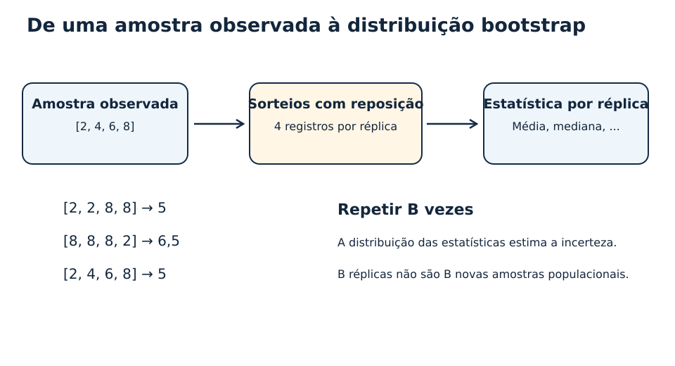
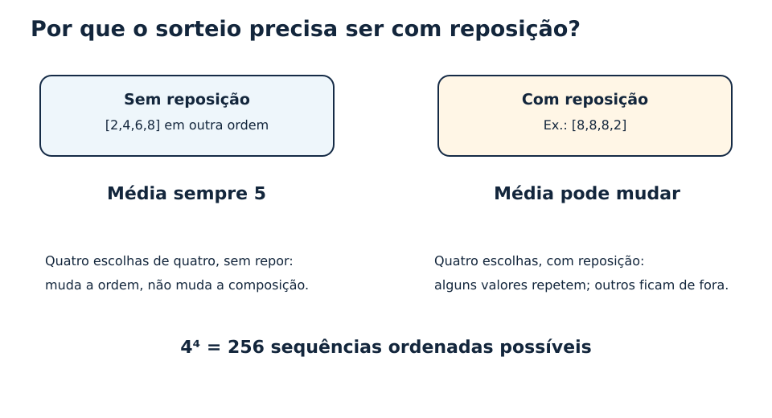
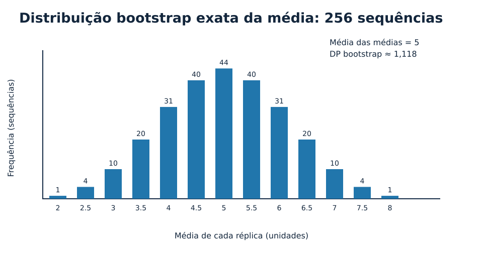
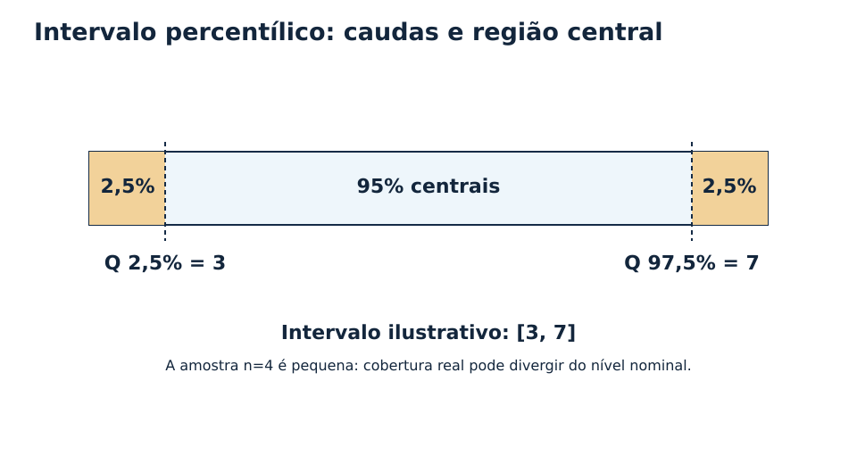
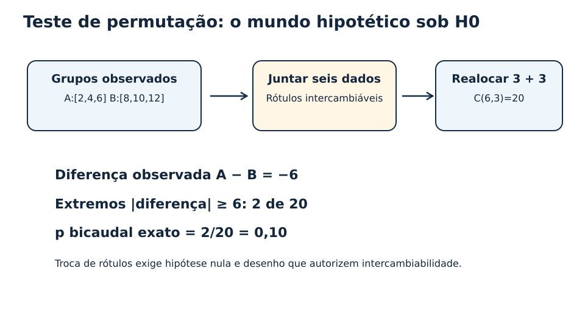
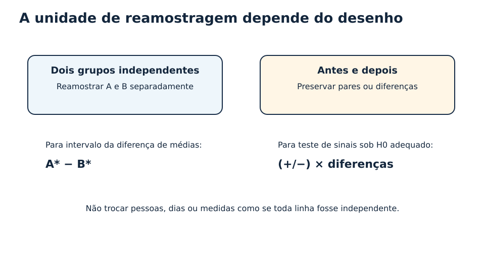
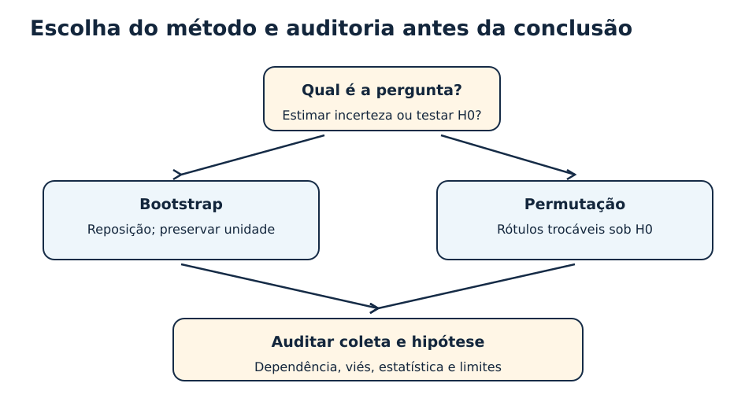

# MAT-EST-039 — Ponte universitária em Estatística: reamostragem, bootstrap e testes de permutação

**Tempo sugerido:** quatro blocos de 25 a 50 minutos, seguindo o ciclo puro. **Natureza:** aprofundamento e ponte universitária, não reivindicação de exigência específica de edital. **Situação individual:** sem tentativa ou consolidação automática.

## 1. Objetivo e lugar na árvore de pré-requisitos

Esta aula retoma a distribuição amostral (MAT-EST-019), os intervalos de confiança (MAT-EST-020), os testes de hipótese (MAT-EST-021), a diferença entre grupos independentes e pareados (MAT-EST-023), e a validação (MAT-EST-031). O MAT-EST-038 encerrou editorialmente uma etapa de Estatística; esta aula inaugura um aprofundamento na mesma trilha, **sem declarar domínio de avaliações pendentes**.

Ao final, o estudante deverá distinguir uma nova coleta de uma reamostragem computacional; gerar réplicas com reposição; calcular uma distribuição empírica de estatísticas; explicar o intervalo bootstrap percentílico; realizar um teste de permutação exato pequeno; reconhecer quando o desenho proíbe a troca indiscriminada de rótulos; e produzir uma conclusão que reconheça suas hipóteses e limitações.

**Pré-requisitos ativos:** média, mediana, fração e porcentagem; princípio multiplicativo e combinações; distribuição amostral e erro-padrão; intervalos de confiança; hipótese nula e valor-p; independência, pareamento e amostragem. Em caso de dificuldade, recuperar o primeiro fundamento insuficiente antes de prosseguir.

## 2. Por que inventamos a reamostragem?

Uma população extensa é desconhecida. Coletamos uma amostra e calculamos, por exemplo, a média. Uma única média não informa quanto ela mudaria se tivéssemos obtido outro conjunto de participantes. A teoria estatística fornece fórmulas para várias situações, mas, para uma mediana ou outra estatística complexa, a distribuição da estimativa pode ser difícil de deduzir.

**Reamostrar** é trabalhar computacionalmente com os dados disponíveis para compreender variabilidade sob um mecanismo explicitado. Não é voltar ao campo nem aumentar o número de pessoas observadas. Os dois procedimentos estudados aqui produzem distribuições distintas para perguntas distintas. A Pennsylvania State University apresenta o bootstrap como reamostragem com reposição e a distribuição de aleatorização para testar uma hipótese nula. [Fontes institucionais: STAT 500, lição 11](https://online.stat.psu.edu/stat500/Lesson11) e [STAT 200, lição 5](https://online.stat.psu.edu/stat200/Lesson05).

**Figura 1 — Ciclo de reamostragem.** Texto alternativo: da amostra [2,4,6,8], produzem-se réplicas de tamanho quatro com reposição, e em cada uma se calcula a média. Observe a possibilidade de repetição de observações. Conclusão: a distribuição das médias é uma aproximação computacional da incerteza, e não uma coleção de novas observações independentes da população.

## 3. Bootstrap não paramétrico: a intuição e o procedimento formal

Considere quatro observações fictícias independentes, em unidades arbitrárias: 2, 4, 6 e 8. A média original é (2+4+6+8)/4 = 5, ou seja, vinte dividido por quatro é cinco. Trataremos cada valor observado como uma das quatro possibilidades de um sorteio com probabilidade igual. Realizamos quatro sorteios **com reposição** e formamos uma réplica. Uma réplica possível é [8,8,8,2], de média 6,5. Outra é [2,2,8,8], de média 5.

A palavra *não paramétrico* aqui significa que usamos a distribuição empírica dos registros, sem supor, por exemplo, que os dados tenham distribuição normal. Para cada réplica, calculamos uma estatística: média, mediana, proporção ou outra medida apropriada. Repetimos o procedimento B vezes, em geral milhares quando fazemos uma aplicação computacional.

**Notação:** se a amostra tem n valores, escrevemos x*₁, ..., x*ₙ para as n observações sorteadas de uma réplica e θ* para a estatística da réplica. Leia: “xis estrela um até xis estrela ene; teta estrela é a estatística reamostrada”. Cada sorteio escolhe um dos dados originais com igual probabilidade no bootstrap simples.

**Figura 2 — Com reposição versus sem reposição.** Texto alternativo: sem reposição, selecionar todos os quatro valores apenas altera a ordem; com reposição, a composição muda. Observe como surgem médias diferentes. Conclusão: retirar os quatro valores sem reposição não cria a distribuição pretendida.

### 3.1 Derivação curta do erro-padrão no exemplo

A distribuição empírica inicial possui média cinco. Os quadrados dos desvios em relação à média são nove, um, um e nove. A soma é vinte, e a variância da distribuição empírica, com divisor quatro, é cinco. Como a média de quatro sorteios independentes dessa distribuição tem variância cinco dividido por quatro, a variância **exata da média bootstrap nesse modelo** é 1,25. Seu desvio-padrão é a raiz quadrada de 1,25, aproximadamente **1,118**. Este é o erro-padrão bootstrap exato do pequeno experimento enumerável, e não a garantia de precisão de qualquer inferência para uma população real.

Existem quatro possibilidades por sorteio. Portanto, há quatro à quarta potência, isto é, **256 sequências ordenadas**. Muitas sequências produzem a mesma média; ao enumerar as 256 sequências, a média das médias é cinco e sua dispersão é 1,118.

**Figura 3 — Histograma das médias bootstrap.** Eixo horizontal: média da réplica em unidades, de dois a oito. Eixo vertical: frequência das 256 sequências ordenadas. Observe a concentração no valor cinco e valores simétricos próximos. Conclusão: a variabilidade das estatísticas ajuda a estimar a incerteza do estimador, sob o modelo de reamostragem.

## 4. Intervalo bootstrap percentílico

Ordenam-se os resultados θ* das B réplicas. Para um intervalo nominal de 95%, selecionam-se os percentis 2,5 e 97,5: os valores que delimitam os 95% centrais da distribuição. **Leitura textual:** do percentil dois vírgula cinco ao percentil noventa e sete vírgula cinco. A convenção de cálculo de quantis e os empates precisam ser documentados.

No exemplo exato de 256 médias, usando postos percentílicos didáticos especificados nos dados de apoio, o 7º valor ordenado é três, e o 250º é sete. Assim, ilustramos o intervalo **[3;7]**. Isso ensina o mecanismo, mas não justifica confiar na cobertura efetiva de um intervalo com amostra original tão pequena. Para casos reais, examinar desenho, tamanho da amostra, assimetria e estabilidade; métodos como o intervalo ajustado por viés e aceleração, conhecido pela sigla BCa, podem ser mais adequados em alguns contextos, mas também requerem condições. O bootstrap percentílico não é universalmente exato.

**Figura 4 — Região central de 95%.** Texto alternativo: uma faixa contém 2,5% das médias em cada cauda e 95% na faixa central, com limites didáticos três e sete. Observe que o intervalo é construído a partir dos valores ordenados. Conclusão: intervalos derivados de uma amostra não tornam o parâmetro populacional uma variável aleatória na interpretação frequentista usual. A cobertura nominal se refere ao desempenho do procedimento em amostragens repetidas sob as hipóteses.

### 4.1 O que o bootstrap não corrige

Amostras voluntárias, exclusão sistemática de grupos, erros de medição e dependência não modelada não desaparecem porque produzimos dez mil réplicas. Reamostrar registros de dias consecutivos como se fossem independentes pode produzir precisão ilusória. Para dados com pacientes e múltiplas medidas por paciente, por exemplo, a unidade de reamostragem pode precisar ser o paciente inteiro. Em séries temporais, técnicas de blocos e avaliação temporal podem ser necessárias. Não usar uma técnica de reamostragem sem examinar o desenho.

## 5. Testes de permutação: outra pergunta, outro mundo hipotético

Agora desejamos testar se dois grupos independentes diferem. Dados fictícios: grupo A = [2,4,6]; grupo B = [8,10,12]. As médias são quatro e dez. A diferença A menos B é menos seis.

A hipótese nula usada neste exercício considera que, sob o desenho adotado, os rótulos A e B são **intercambiáveis**: qualquer distribuição de três rótulos A entre as seis unidades observadas é equiprovável. Sob esse mecanismo nulo, juntamos os seis valores e redistribuímos os rótulos três a três, sem alterar os números. Há seis escolhe três, ou **20 alocações possíveis**.

Em cada alocação, calculamos a diferença entre as médias. Somente duas das 20 alocações têm módulo da diferença igual ou superior a seis: uma com −6, outra com +6. O valor-p bicaudal **exato** é dois dividido por vinte, ou **0,10 (10%)**. Para um nível de significância de 5%, esse exemplo não fornece evidência suficiente para rejeitar a hipótese nula. Isso **não prova** que as populações sejam iguais. O exercício é intencionalmente pequeno e não autoriza generalizações reais.

**Figura 5 — Permutação em seis unidades.** Texto alternativo: são 20 redistribuições equiprováveis dos rótulos e duas atingem o módulo da diferença observada. Observe a contagem de resultados extremos em ambas as direções. Conclusão: p é calculado sob a distribuição nula, diferente do intervalo de incerteza gerado por bootstrap.

**Formulação:** p = número de configurações nulas tão extremas quanto a observada dividido pelo número total de configurações nulas, quando a enumeração é exata e equiprovável. Leia “p é a fração de resultados pelo menos tão extremos sob a hipótese nula”. Quando usamos B permutações aleatórias em vez da enumeração, podemos registrar a convenção Monte Carlo corrigida (k+1)/(B+1), em que k é o número de permutações simuladas tão extremas, com a configuração observada incluída uma vez. A precisão de Monte Carlo não é a mesma coisa que a incerteza estatística do estudo.

### 5.1 Hipóteses e limites

A permutabilidade não é automática só porque há dois grupos. Ela depende do desenho, da hipótese nula e da estatística. Pode falhar quando grupos têm estruturas de dependência distintas, quando há seleção enviesada ou quando as observações são pareadas e os rótulos são embaralhados como se as unidades fossem independentes. A [STAT 555](https://online.stat.psu.edu/stat555/node/35/) oferece um exemplo em que o pareamento exige procedimento diferente.

Se cada pessoa foi medida antes e depois, construir diferenças por pessoa preserva a unidade experimental. Um teste de troca de sinais dentro de pares pode ser apropriado sob hipótese nula de simetria/intercambiabilidade adequada; não basta misturar livremente todos os dados. No exemplo didático de diferenças [2,−1,3], existem dois ao cubo, ou oito configurações de sinais. O p bicaudal exato para a soma observada igual a quatro é quatro dividido por oito, ou 0,50, se forem consideradas todas as configurações equiprováveis.

**Figura 6 — Escolher a unidade amostral.** Texto alternativo: duas regras diferentes para grupos independentes e dados pareados. Observe que pacientes, pares ou blocos podem ser unidades inseparáveis. Conclusão: preservar o desenho evita incerteza estatística artificial.

## 6. Bootstrap e permutação lado a lado

| Pergunta | Bootstrap simples | Teste de permutação |
|---|---|---|
| Propósito | Estimar variação de uma estatística e construir intervalos | Testar hipótese nula, obtendo distribuição de referência |
| Sorteio | Valores/observações com reposição | Realocação de rótulos sob intercambiabilidade |
| Estatística recalculada | Média, mediana, diferença, proporção etc. | Diferença, correlação ou outra estatística adequada a H0 |
| Resultados principais | Distribuição bootstrap, erro-padrão e percentis | Distribuição nula e valor-p |
| Limitação comum | Não corrige viés de origem | Não funciona sem desenho que justifique o mecanismo nulo |

Em áudio: no bootstrap, exploramos a instabilidade da estimativa que obtivemos. Na permutação, examinamos se um resultado observado seria incomum num cenário nulo especificado. Ambos exigem amostragem e desenhos coerentes, mas respondem a perguntas distintas.

## 7. Ponte com o conjunto de dados do projeto aplicado

O arquivo `dados-ficticios-referencia.csv` é uma cópia idêntica do CSV de MAT-EST-038, herdado de MAT-EST-034/035. Contém oito dias e separa referência e teste em ordem temporal. Sua presença aqui é para **continuidade e auditoria**, não para afirmar que esses oito dias são observações independentes e identicamente distribuídas. Na avaliação de previsões, preservar a partição cronológica; se houver autocorrelação, não usar bootstrap ingênuo de linhas. As técnicas de bootstrap por blocos são assunto específico, não autorização para misturar os dias indiscriminadamente.

Uma conclusão defensável apresenta a pergunta, a origem e unidade dos dados, a estatística, o mecanismo de reamostragem, o número de réplicas ou permutações, a semente computacional quando houver, os resultados e as limitações da inferência.

**Figura 7 — Da pergunta ao método.** Texto alternativo: dois caminhos, bootstrap para estimar incerteza e permutação para testar uma hipótese nula, desembocam na auditoria de coleta e suposições. Observe o ponto comum dos dois procedimentos. Conclusão: nenhum algoritmo substitui uma seleção válida dos participantes ou do mecanismo de teste.

## 8. Exemplo reproduzível em Python

O arquivo `calculos-reproduziveis.py` contém a enumeração **exata** dos 256 resultados bootstrap e das 20 permutações, usando apenas a biblioteca padrão da linguagem. Abrir o arquivo permite reproduzir os números; não é necessário instalar biblioteca externa. Resultados numéricos de apoio ficam em `calculos-reproduziveis.json`.

## 9. Erros frequentes

- Confundir B réplicas artificiais com B amostras reais da população.
- Reamostrar sem reposição toda uma amostra e esperar que sua média varie.
- Tratar o intervalo bootstrap como correção automática de dados enviesados.
- Usar distribuição bootstrap observada como se ela fosse diretamente a distribuição nula de um teste.
- Quebrar o pareamento, os conglomerados ou a sequência temporal.
- Relatar um valor-p simulado como se fosse exato ou esconder a quantidade de simulações.
- Interpretar “não rejeitar H0” como prova de igualdade.
- Extrapolar o intervalo didático [3;7] de uma amostra de quatro números para dados reais sem auditar hipóteses e cobertura.

## 10. Exercícios em três camadas e reteste independente

**Orientação de uso:** responder no site antes de abrir `gabarito-comentado.json`. Todos os itens são autorais; não há questão oficial reproduzida. Registrar tipo de erro real depois da resposta, nunca por previsão automática. A dificuldade avançada serve de ponte universitária e não corresponde a uma afirmação sobre conteúdo obrigatório específico de banca.

### Camada A — Aprendizagem básica

**MAT-EST-039-EX-APR-01 — O que é bootstrap (autoral).** Descreva o que é uma réplica bootstrap não paramétrica de uma amostra com n observações.

**MAT-EST-039-EX-APR-02 — Por que com reposição (autoral).** A partir de [2, 4, 6, 8], por que o sorteio sem reposição de quatro elementos não cria variabilidade na média?

**MAT-EST-039-EX-APR-03 — Estatística original (autoral).** Calcule a média de [2, 4, 6, 8].

**MAT-EST-039-EX-APR-04 — Réplica com elementos repetidos (autoral).** Uma réplica bootstrap foi [2,2,8,8]. Qual sua média?

**MAT-EST-039-EX-APR-05 — Mediana original (autoral).** Qual a mediana de [2,4,6,8]?

**MAT-EST-039-EX-APR-06 — Média de réplica (autoral).** Calcule a média bootstrap de [8,8,8,2].

**MAT-EST-039-EX-APR-07 — Limite da reamostragem (autoral).** Uma amostra voluntária não representa a população. Reamostrar seus registros milhares de vezes elimina o viés de seleção? Justifique.

**MAT-EST-039-EX-APR-08 — Duas perguntas distintas (autoral).** Qual procedimento é orientado principalmente a estimar a incerteza de uma estatística observada e qual constrói uma distribuição sob hipótese nula de rótulos permutáveis?

**MAT-EST-039-EX-APR-09 — Bootstrap de nova amostra (autoral).** A amostra original é [1,1,3,3]. Uma réplica é [1,3,3,3]. Determine sua média.

**MAT-EST-039-EX-APR-10 — Percentis simulados (autoral).** Se forem calculadas 500 estimativas bootstrap, aproximadamente quantas ficam abaixo do percentil 5, desprezando empates?

### Camada B — Consolidação

**MAT-EST-039-EX-CON-01 — Contagem exata de réplicas ordenadas (autoral).** Com quatro valores originais distintos e quatro sorteios com reposição, quantas sequências ordenadas de réplica são possíveis?

**MAT-EST-039-EX-CON-02 — Erro-padrão bootstrap exato (autoral).** Para [2,4,6,8], todas as 256 sequências ordenadas com reposição têm média bootstrap com variância populacional exata 1,25. Calcule o desvio-padrão.

**MAT-EST-039-EX-CON-03 — Intervalo percentílico didático (autoral).** Enumerando as 256 médias bootstrap de [2,4,6,8], o 7º valor ordenado é 3 e o 250º é 7. Informe o intervalo percentílico ilustrativo de 95% usando postos percentis de cauda 2,5%.

**MAT-EST-039-EX-CON-04 — Diferença observada (autoral).** Dois grupos independentes têm valores A=[2,4,6] e B=[8,10,12]. Calcule a diferença entre médias A menos B.

**MAT-EST-039-EX-CON-05 — Número de permutações (autoral).** Em seis observações independentes, três rótulos serão A e três B. Quantas alocações distintas de rótulos existem?

**MAT-EST-039-EX-CON-06 — Valor-p de permutação exato (autoral).** Para A=[2,4,6] e B=[8,10,12], sob hipótese nula de permutabilidade, a enumeração das 20 alocações encontra duas com |diferença de médias|≥6. Qual valor-p bicaudal exato?

**MAT-EST-039-EX-CON-07 — Correção de Monte Carlo (autoral).** Em B=999 permutações aleatórias simuladas, 19 apresentam estatística pelo menos tão extrema quanto a observada. Use a correção (k+1)/(B+1).

**MAT-EST-039-EX-CON-08 — Teste exato pequeno (autoral).** A=[1,3] e B=[5,7]. Sob troca de rótulos de quatro unidades independentes em dois grupos de dois, há seis divisões e duas com |diferença|≥4. Calcule p bicaudal.

**MAT-EST-039-EX-CON-09 — Pareamento e sinais (autoral).** Três diferenças pareadas são [2,−1,3]. Sob troca de sinais independentes, sem diferenças nulas, quantos padrões de sinais existem?

**MAT-EST-039-EX-CON-10 — Média pareada (autoral).** Três diferenças depois menos antes são [−2,1,−3]. Qual a diferença média?

### Camada C — Transferência e estilo vestibular, autoral

**MAT-EST-039-EX-VES-01 — Seleção voluntária e intervalo (autoral).** Um formulário voluntário apresenta 60% de respostas favoráveis. Uma equipe faz 10.000 reamostragens bootstrap e afirma ter corrigido o viés de seleção. Audite a inferência.

**MAT-EST-039-EX-VES-02 — Unidade independente em dados clínicos fictícios (autoral).** Há cinco pacientes com quatro medidas por paciente. Para inferir entre pacientes, é seguro sortear as 20 linhas individualmente como se fossem independentes? Indique alternativa.

**MAT-EST-039-EX-VES-03 — Série temporal e dependência (autoral).** O CSV fictício MAT-EST-034/038 contém observações por dia e separação temporal referência/teste. É justificável misturar os dias com bootstrap independente indiscriminado para avaliar previsão futura?

**MAT-EST-039-EX-VES-04 — Intervalo e teste não são intercambiáveis (autoral).** Explique por que percentis de estimativas bootstrap observadas e a cauda de uma distribuição de permutação sob H0 respondem a perguntas diferentes.

**MAT-EST-039-EX-VES-05 — Dois grupos e bootstrap correto (autoral).** Para estimar a incerteza da diferença de médias de grupos independentes A=[2,4,6] e B=[8,10,12], explique como construir uma réplica bootstrap respeitando os grupos.

**MAT-EST-039-EX-VES-06 — Permutação sob hipótese nula (autoral).** No mesmo exemplo de dois grupos, por que reunir as seis observações e permutar os rótulos serve ao teste sob H0, mas não é automaticamente o bootstrap da diferença original?

**MAT-EST-039-EX-VES-07 — Teste de Monte Carlo e convenção (autoral).** Um teste aleatório de permutação gera B=100 configurações e observa k=7 estatísticas tão extremas quanto a observada. Calcule o valor-p com correção +1.

**MAT-EST-039-EX-VES-08 — Variabilidade de estimativa de p (autoral).** Para p≈0,10 estimado em 1.000 permutações aproximadamente independentes, calcule o desvio-padrão de Monte Carlo aproximado pela expressão √[p(1−p)/B].

**MAT-EST-039-EX-VES-09 — Pareamento no teste (autoral).** Se cada participante foi medido antes e depois, explique por que permutar livremente todos os valores entre grupos pode ser incorreto.

**MAT-EST-039-EX-VES-10 — Interpretação de intervalo (autoral).** Um intervalo bootstrap percentílico de 95% saiu [0,10;0,40] para certa proporção. É correto afirmar que um parâmetro fixo tem 95% de probabilidade de estar nesse intervalo já calculado?

### Reteste independente — após remediação real

**MAT-EST-039-EX-RET-01 — Número de sequências novo (autoral).** Com amostra [1,2,3], uma réplica bootstrap de três sorteios com reposição admite quantas sequências ordenadas?

**MAT-EST-039-EX-RET-02 — Média de réplica nova (autoral).** Para [1,2,3], uma réplica sorteada foi [1,1,3]. Determine sua média.

**MAT-EST-039-EX-RET-03 — Permutações de dois grupos (autoral).** Quatro unidades distintas são divididas em dois grupos de dois. Quantas alocações de rótulo são possíveis?

**MAT-EST-039-EX-RET-04 — Valor-p de um novo caso (autoral).** A=[1,2], B=[3,4], e a enumeração de 6 permutações apresenta 2 tão extremas quanto a diferença observada em módulo. Determine o p bicaudal exato.

**MAT-EST-039-EX-RET-05 — Sinais em pares novos (autoral).** Com quatro pares e diferenças todas não nulas, quantas configurações de troca de sinais existem, sob um teste pareado adequado?

**MAT-EST-039-EX-RET-06 — Limite de dados ausentes (autoral).** Uma população rara não aparece em uma pequena amostra. A produção de 20.000 réplicas bootstrap cria observações desse grupo e prova generalização?

## 11. Correção comentada e diagnóstico de erros

As respostas encontram-se no arquivo separado `gabarito-comentado.json`, vinculadas pelo identificador permanente. Cada correção apresenta o raciocínio, não apenas um número. Depois da tentativa efetiva, classificar a **primeira ruptura identificada** como conteúdo, interpretação, cálculo, distração, memória, estratégia ou tempo, e registrar a evidência. Os metadados `tipoErro` são sugestões editoriais de acompanhamento, não diagnóstico individual.

## 12. Revisão longitudinal

Depois de um estudo real: recordar a ideia e resolver um item no dia seguinte, repetir em contexto diferente após sete dias, recuperar o raciocínio após trinta dias. O calendário não começa na data de publicação. Um reteste independente só deve ser aplicado depois da recuperação do pré-requisito. A consolidação requer conseguir explicar, executar, transferir e reconhecer limites sem consultar o gabarito.

## 13. Resumo para ler ou ouvir

Reamostragem usa a informação disponível para formar distribuições computacionais de estatísticas. No bootstrap, uma réplica tem o mesmo tamanho da amostra original, e cada elemento é escolhido com reposição. Calculamos a estatística muitas vezes para avaliar sua dispersão e construir intervalos. No teste de permutação, consideramos uma hipótese nula que permite trocar certos rótulos e perguntamos em quantas configurações a estatística é tão extrema quanto a observada. Nunca misturamos unidades dependentes sem justificativa; mais simulações não consertam viés de coleta. Um método estatístico correto exige pergunta clara, desenho apropriado, execução verificável e conclusão proporcional às evidências.

## 14. Vídeo complementar verificado

**Video 11.1: Bootstrapping**, Penn State Online, curso STAT 500; inglês; duração não confirmada na página institucional. [Abrir a lição 11 com o vídeo 11.1](https://online.stat.psu.edu/stat500/Lesson11). Assistir após o exemplo da seção 3 e antes da seção 4. A videoaula mostra o procedimento de sorteio com reposição. Página e referência do vídeo verificadas em 28/09/2026; reprodução integral não testada. O texto desta aula permanece completo sem o vídeo.

## 15. Fontes e delimitação

- Pennsylvania State University, [STAT 500: Introduction to Nonparametric Tests and Bootstrap](https://online.stat.psu.edu/stat500/Lesson11).
- Pennsylvania State University, [STAT 200: Confidence Intervals](https://online.stat.psu.edu/stat200/Lesson04).
- Pennsylvania State University, [STAT 200: Hypothesis Testing, Part 1](https://online.stat.psu.edu/stat200/Lesson05).
- Pennsylvania State University, [STAT 555: Permutation Test](https://online.stat.psu.edu/stat555/node/35/).
- Documentos estruturais 01 a 08 do Projeto Reconstrução Escolar 2027 e pacote MAT-EST-038.

**Origem das questões:** 36 itens originais do projeto. Exemplos construídos para ensino; a ponte universitária não deve ser apresentada como conteúdo integral oficialmente exigido por ENEM, FUVEST, UNICAMP ou UNESP. Não houve reprodução de questões oficiais de prova.

## 16. Próximo passo editorial

MAT-EST-040 — Métodos de reamostragem em prática: comparação de intervalos, testes sob desenho amostral e auditoria de robustez. Avaliações MAT-EST-018, MAT-EST-037, MAT-PRO-039 e MAT-PRO-054 permanecem sem tentativa individual registrada; o progresso não se altera pela produção deste material.
