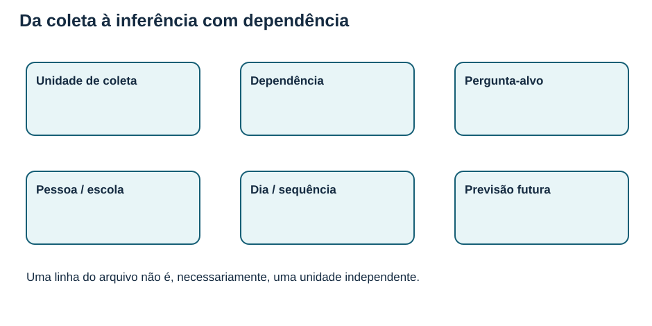
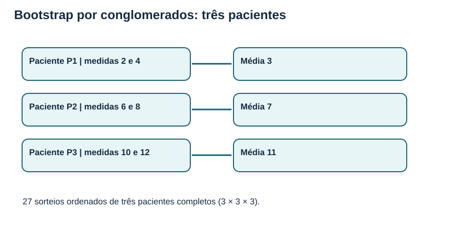
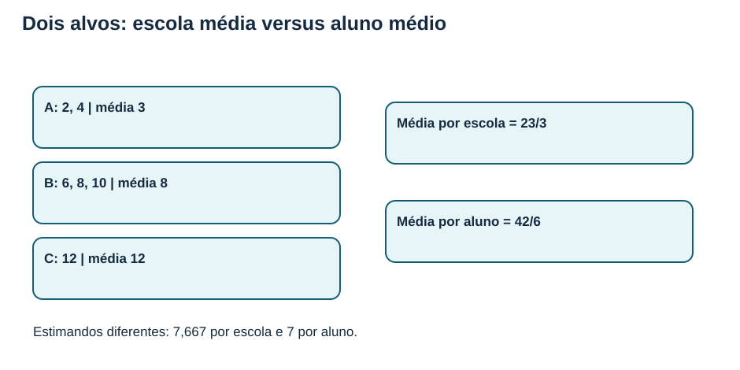
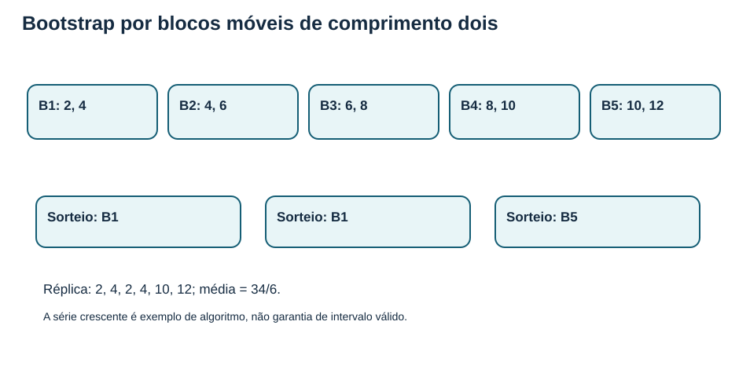
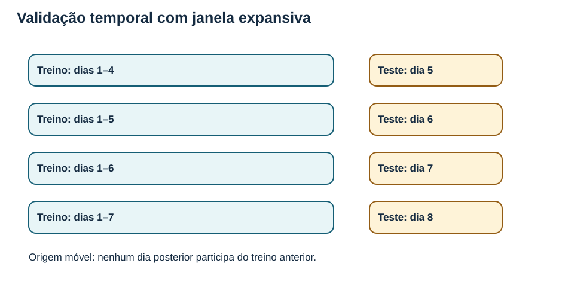
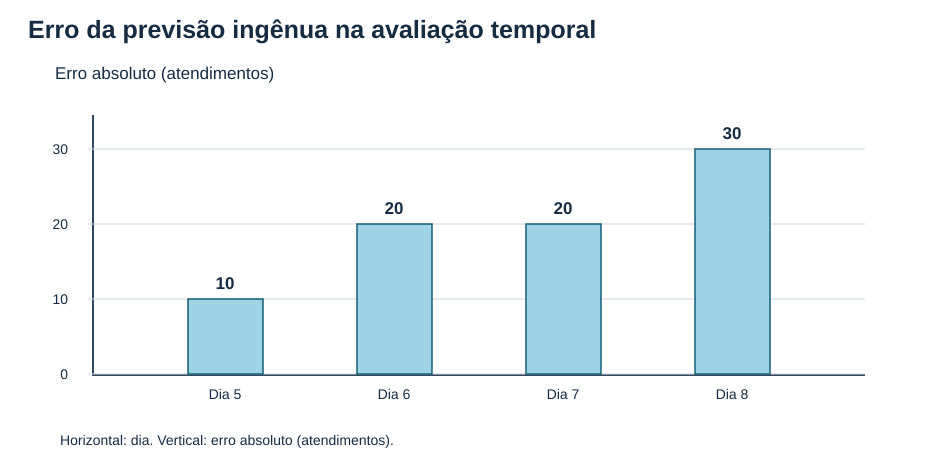
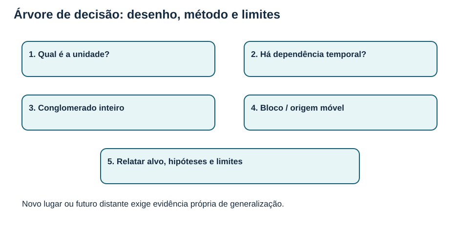

# MAT-EST-041 — Inferência com dados dependentes: reamostragem por blocos e conglomerados, validação temporal e limites de generalização

**Tempo sugerido:** cinco blocos de 25 a 50 minutos, em ciclo puro, não em dias fixos. **Nível:** aprofundamento e ponte universitária. Reamostragem por blocos e inferência para conglomerados são temas de aprofundamento, não apresentados como cobrança formal obrigatória nos editais do ENEM ou vestibulares citados. Nenhuma tentativa individual ou domínio é presumido.

## 1. Objetivos, contexto e pré-requisitos

Ao final desta aula, explicar a diferença entre observação e unidade independente; identificar dependência entre medições da mesma pessoa, escola e períodos próximos; reconstruir um bootstrap simples por conglomerado e por blocos; definir adequadamente média por grupo ou por indivíduo; organizar validação temporal sem consultar o futuro; justificar escolhas de intervalo, horizonte, alvo e população; detectar vazamentos de dados e delimitar generalizações. Revisar MAT-EST-039 e 040 para reamostragem, MAT-EST-023 para pareamento e MAT-EST-031 para avaliação fora da amostra.

A razão desta aula é simples: um arquivo com mil linhas pode conter apenas vinte pessoas repetidas ou datas consecutivas de uma única instituição. Mil linhas não significam mil unidades estatisticamente independentes. Se ignorarmos essa estrutura, podemos construir estimativas excessivamente precisas ou testar uma previsão com informação que ainda não estaria disponível no momento de prever. [Penn State, STAT 510, lição 1](https://online.stat.psu.edu/stat510/Lesson01); [R Journal, *Bootstrapping Clustered Data in R*](https://journal.r-project.org/articles/RJ-2023-015/).

**Figura 1.** Texto alternativo: unidade de coleta, dependência e pergunta-alvo representadas em três colunas. **Observe:** primeiro identifique quem ou o que pode ser tratado como unidade relativamente independente. **Conclusão para ouvir:** escolher um método antes de entender a coleta pode invalidar uma inferência mesmo com cálculos corretos.

## 2. Intuição: independência não é ausência de relacionamento entre temas

Imagine que seis medições foram feitas em três pessoas, duas por pessoa. Uma pessoa pode ter um nível próprio que aproxima suas duas respostas. Se sorteamos separadamente cada linha e as tratamos como pacientes diferentes, criamos artificialmente novos indivíduos. O mesmo problema surge quando alunos compartilham uma escola, quando famílias moram numa região e quando dias próximos contêm padrões de demanda semelhantes.

Chamamos isso de **dependência intragrupo ou dependência temporal**. A **correlação intraclasse** descreve semelhança entre observações do mesmo grupo; a **autocorrelação** descreve associação entre a série e versões defasadas dela. Dependência não torna um dado inutilizável: ela precisa entrar no desenho do procedimento. O material STAT 510 trata a ordem das observações como parte do significado dos dados. [Penn State STAT 510](https://online.stat.psu.edu/stat510/Lesson01).

Dois objetivos diferentes não podem ser confundidos: **inferência** usa uma amostra para quantificar características e incertezas de uma população sob hipóteses; **previsão** avalia resultados futuros realmente desconhecidos no instante da previsão. O bootstrap depende de hipóteses sobre o mecanismo gerador e a unidade de reamostragem. A validação temporal depende de disponibilidades de dados e da ordem cronológica. Uma técnica não substitui automaticamente a outra.

## 3. Bootstrap por conglomerados: preserve a pessoa inteira

Retomemos o exemplo fictício da aula anterior. P1 tem medidas 2 e 4; P2 tem 6 e 8; P3 tem 10 e 12. As médias dos pacientes são, respectivamente, 3, 7 e 11. Se a pergunta é sobre o paciente médio, observamos **três pacientes**, não seis pacientes. Em cada réplica, sorteamos três pacientes inteiros, com reposição, mantendo as duas medições de cada um. Assim, uma réplica possível é P1, P1 e P3, que repete integralmente as duas linhas de P1.

Se usamos **peso igual por paciente**, a estatística da réplica é a média das três médias sorteadas. A amostra original produz (3 + 7 + 11) / 3 = **7**. O espaço de todas as réplicas ordenadas possui 3³ = **27** possibilidades. Como cada seleção é equiprovável, a média das 27 médias reamostradas também é 7.

### 3.1 Por que o erro-padrão muda?

A variância da distribuição empírica das médias [3, 7, 11], usando divisor três para representar probabilidades de sorteio, é ((3 − 7)² + (7 − 7)² + (11 − 7)²) / 3 = **32/3**, ou trinta e dois terços. A média de três sorteios com reposição tem variância (32/3)/3 = **32/9**. Seu desvio-padrão bootstrap exato neste pequeno experimento é √(32/9) = √32/3 ≈ **1,886**. Leia “raiz quadrada de trinta e dois, dividida por três”.

A abordagem ingênua com as seis linhas [2,4,6,8,10,12] sorteadas independentemente tem variância empírica 35/3 e variância da média com seis sorteios igual a **35/18**. Seu desvio-padrão ilustrativo seria √(35/18) ≈ **1,394**. A diferença demonstra que o mecanismo de sorteio determina a variabilidade calculada. **Não** permite afirmar que 1,886 é um erro-padrão confiável para uma população real com apenas três conglomerados. Com pouquíssimos grupos, a distribuição inferencial e a cobertura de intervalos continuam frágeis. [R Journal: bootstrap por clusters](https://journal.r-project.org/articles/RJ-2023-015/).

**Figura 2.** Texto alternativo: três pacientes com duas medições e médias 3, 7 e 11. **Observe:** o sorteio repete pessoas completas, não valores isolados. **Conclusão para ouvir:** seis medições pertencem a somente três unidades agrupadas.

### 3.2 Estimando e pesos quando grupos têm tamanhos diferentes

Considere outro exemplo fictício, de três escolas: A possui notas [2,4], B possui [6,8,10] e C possui [12]. Cada escola tem média 3, 8 e 12. A **média por escola**, dando peso igual às instituições, é (3 + 8 + 12)/3 = **23/3 ≈ 7,667**. Já a **média por aluno**, dando peso igual a cada um dos seis alunos, é (2 + 4 + 6 + 8 + 10 + 12)/6 = **7**.

Ambas são corretas para perguntas **diferentes**. Se uma réplica sorteia as escolas A, A e C, a média por escola é (3 + 3 + 12)/3 = **6**. Empilhando todos os cinco alunos repetidos e fazendo a média por aluno, temos (2 + 4 + 2 + 4 + 12)/5 = **4,8**. Os dois números não se contradizem: os pesos foram definidos por alvos distintos. Não trocar o estimando durante o cálculo. Em amostragens complexas, também podem ser necessários pesos do desenho original e outras correções.

**Figura 3.** Texto alternativo: três escolas de tamanhos 2, 3 e 1, contrastando média de escolas 7,667 com média de alunos 7. **Observe:** escolher quem recebe peso igual muda o alvo. **Conclusão para ouvir:** ponderação precisa corresponder ao parâmetro que queremos descrever.

## 4. Bootstrap por blocos móveis: preserve a vizinhança temporal

Uma série temporal é uma sequência ordenada. Em muitos cenários, dias próximos compartilham informação. O bootstrap simples de linhas avulsas perde essa vizinhança; uma família de alternativas é o **bootstrap por blocos móveis**, ou *moving block bootstrap*. Escolhe-se um comprimento de bloco; constroem-se janelas consecutivas sobrepostas; sorteiam-se janelas com reposição; concatenam-se os trechos e calculam-se as estatísticas. As fronteiras entre blocos sorteados são artificiais, e o tamanho do bloco representa uma escolha com consequências sobre a dependência preservada. [CRAN, documentação de moving block bootstrap](https://packages.oit.ncsu.edu/cran/web/packages/modernBoot/refman/modernBoot.html).

**Exemplo aritmético, sem pretensão inferencial.** Tome a série fictícia [2,4,6,8,10,12], com seis períodos, e blocos de comprimento dois. Existem cinco janelas: B1=[2,4]; B2=[4,6]; B3=[6,8]; B4=[8,10]; B5=[10,12]. Sorteamos três janelas com reposição para reconstruir seis posições. Há 5³ = **125 réplicas ordenadas**. B1, B1, B5 produz [2,4,2,4,10,12], com média 34/6 ≈ **5,667**.

Para conferir todo o pequeno espaço exato, as médias das cinco janelas são [3,5,7,9,11]. Sua média é 7 e sua variância empírica probabilística é (16 + 4 + 0 + 4 + 16)/5 = **8**. Como a réplica média é a média de três médias de janelas selecionadas independentemente, sua variância é 8/3 e seu desvio-padrão é √(8/3) ≈ **1,633**. O programa `calculos-reproduziveis.py` enumera as 125 sequências para confirmar, sem depender desta explicação.

**Limite decisivo:** a série [2,4,6,8,10,12] tem tendência ascendente determinística. Foi escolhida para facilitar a enumeração, não para justificar cobertura de intervalos bootstrap. O bootstrap de blocos em séries reais requer condições sobre a dependência, frequentemente alguma forma de estacionariedade ou tratamento explícito de tendência e sazonalidade; a escolha do tamanho do bloco importa. No sentido fraco, estacionariedade exige média e variância constantes ao longo do tempo e covariância dependente da defasagem, não da posição no calendário. [Penn State STAT 510](https://online.stat.psu.edu/stat510/Lesson01).

**Figura 4.** Texto alternativo: cinco janelas de dois valores e sorteio de B1, B1, B5. **Observe:** cada janela conserva dois momentos consecutivos, mas a emenda entre janelas cria uma fronteira nova. **Conclusão para ouvir:** são 125 réplicas matemáticas, não 125 novas sequências observadas nem prova de confiança estatística.

## 5. Qual método usar? Conglomerados não são a mesma coisa que blocos

- Uma escola tem seus próprios alunos: para generalizar sobre escolas amostradas, reamostrar **escolas inteiras**, preservando os alunos de cada uma, segundo o desenho.
- Os mesmos pacientes respondem a várias avaliações: manter **pacientes inteiros** ou diferenças pareadas, conforme o estimando.
- Uma série de medições próximas apresenta dependência temporal: considerar **blocos consecutivos** quando suas hipóteses se aplicam, ou um modelo explícito dessa dependência.
- O objetivo é estimar desempenho **no futuro**: reservar origens cronológicas e avaliar previsões feitas sem informação posterior, em vez de misturar observações ao acaso.
- Os dados têm escolas e datas: examinar **as duas dimensões**. Uma separação temporal correta ainda pode conter as mesmas escolas nos dois lados, e uma separação por escolas ainda pode usar o futuro para prever o passado.

Um teste de permutação exige o mesmo cuidado. Se o tratamento foi sorteado por escola, permutar o rótulo **de cada aluno isolado** inventa randomizações impossíveis. O nível de permutação deve respeitar o esquema realmente utilizado. Dependência entre blocos ou poucos grupos pode exigir procedimentos especializados: não declarar valor-p legítimo só porque o computador enumerou rearranjos.

## 6. Validação temporal: treinar no passado, testar no futuro

Em avaliação por origem móvel, definimos um instante de previsão e usamos apenas informação disponível até ele. Na **janela expansiva**, o treino cresce: dias 1–4 para testar dia 5; dias 1–5 para testar dia 6; dias 1–6 para testar dia 7; dias 1–7 para testar dia 8. Na **janela deslizante**, o tamanho é fixo: dias 1–4 para dia 5; 2–5 para dia 6; 3–6 para dia 7; 4–7 para dia 8. A escolha depende do quanto o passado distante ainda é relevante. Para prever mais de um passo à frente, reservar a informação correspondente ao horizonte real. Se existe atraso de registro ou uma variável só se consolida dias depois, criar intervalo de segurança (*gap*) apropriado. [Hyndman e Athanasopoulos, seção 5.10](https://otexts.com/fpp3/tscv.html); [scikit-learn, TimeSeriesSplit](https://scikit-learn.org/stable/modules/generated/sklearn.model_selection.TimeSeriesSplit.html).

**Figura 5.** Texto alternativo: quatro janelas expansivas, com treino 1–4, 1–5, 1–6 e 1–7 e teste nos dias 5, 6, 7 e 8. **Observe:** nenhuma linha de teste antecede a parte usada para treinar. **Conclusão para ouvir:** a previsão deve ser calculada como se o futuro ainda não tivesse ocorrido.

### 6.1 Laboratório com os dados fictícios já utilizados no projeto

O arquivo `dados-ficticios-referencia.csv` é uma **cópia binária** daquele presente no MAT-EST-040, sem edição dos registros. A sequência observada de atendimentos nos dias um a oito é: [80,100,120,100,90,110,130,100]. Use como modelo elementar “amanhã será igual a hoje”: a previsão do dia 5 é o observado no dia 4, cem; para o dia 6, noventa; para o dia 7, cento e dez; para o dia 8, cento e trinta. Os observados correspondentes são [90,110,130,100]. Os erros absolutos são [10,20,20,30], somando oitenta. O **MAE é 80/4 = 20 atendimentos**. MAE significa erro absoluto médio.

Uma referência que sempre prevê 100, nos mesmos quatro dias, tem erros [10,10,30,0], total cinquenta e MAE **12,5**. Isso descreve apenas esse recorte fictício. No CSV, já existem também previsões pré-calculadas: modelo A tem erros absolutos [5,5,5,5], logo MAE **5**; modelo B tem [0,0,0,25], logo MAE **6,25**. Essas duas colunas foram herdadas para comparação e **não** representam modelos reestimados nas quatro dobras descritas aqui. Não apresentar o placar como resultado de uma validação cruzada que não foi executada.

**Figura 6.** Texto alternativo: barras para erros absolutos de dez, vinte, vinte e trinta nos dias cinco a oito; eixo vertical em atendimentos. **Observe:** o maior erro ocorre no último dia. **Conclusão para ouvir:** o MAE é vinte atendimentos; quatro datas seguidas não são quatro séries independentes.

### 6.2 Vazamento de informação: quando até o treino correto produz teste incorreto

Ordenar o corte é necessário, porém insuficiente. Seria vazamento preencher valores ausentes de um dia antigo usando médias calculadas com meses posteriores; padronizar todo o banco antes das dobras; construir uma variável como “total de atendimentos do próprio dia” para antecipar esse total; ou escolher hiperparâmetros olhando repetidamente o teste final. Cada transformação aprendida dos dados deve ser ajustada somente dentro do trecho de treino correspondente. Dados de pessoas ou locais repetidos exigem também avaliação por grupo conforme a pergunta. No exemplo de média móvel, só podem entrar valores efetivamente disponíveis na hora da previsão. [Documentação scikit-learn sobre validação temporal](https://scikit-learn.org/stable/modules/generated/sklearn.model_selection.TimeSeriesSplit.html).

## 7. Limites de generalização: população, lugar, época e horizonte

Um MAE de cinco numa instituição e em quatro dias não significa MAE de cinco em outra cidade, após um feriado ou daqui a dois anos. A transferência requer representatividade de locais e períodos, estabilidade relevante do mecanismo, horizonte de previsão definido, disponibilidade real das variáveis e dados posteriores para monitoramento. Se a decisão envolve escolas novas, teste por escolas nunca vistas; se envolve amanhã, teste em períodos posteriores; se envolve ambas as situações, estabeleça testes coerentes com ambas, sem reutilizar um conjunto final para escolher o modelo.

Para intervalos e testes, documentar quem foi amostrado, quais unidades foram repetidas, o estimando, a hipótese sob a qual a reamostragem foi proposta, a quantidade de conglomerados/blocos, a estratégia para mudanças temporais, a convenção do intervalo, o número de simulações e a semente. **Mais réplicas reduzem ruído de Monte Carlo, mas não criam novas unidades de coleta nem eliminam viés de seleção.** Uma evidência pequena pode sustentar uma boa demonstração didática sem sustentar inferência populacional.

**Figura 7.** Texto alternativo: identificar unidade, dependência, método por grupo ou tempo e limites. **Observe:** a árvore não começa por um botão de software. **Conclusão para ouvir:** a resposta deve ser proporcional ao desenho e aos dados de que realmente dispomos.

## 8. Protocolo prático de investigação e auditoria

Antes de executar os exercícios, escreva em linguagem comum: qual a pergunta, a população e o período? Uma linha é uma pessoa ou uma medição? O alvo é pessoa média, aluno médio, escola média ou erro amanhã? O que já estaria conhecido no instante da previsão? A coleta sustenta generalização para quais locais? Depois escolha método, calcule, confira um exemplo manual, observe extremos e compare com uma referência. Anote hipóteses que não puderam ser verificadas, em vez de escondê-las.

O arquivo `calculos-reproduziveis.py` só utiliza a biblioteca padrão do Python e lê o CSV incluído. Ele confirma exatamente 27 sequências de pacientes, 125 sequências de blocos e os erros temporais. A enumeração permite verificar a **aritmética** dos exemplos; não prova as hipóteses estatísticas de aplicações futuras.

## 9. Exercícios graduais — todos autorais, sem questões oficiais reproduzidas

O gabarito comentado está separado em `gabarito-comentado.json`. No site, exibir primeiro o enunciado e registrar uma resposta efetiva antes de liberar a correção. A causa provável de erro é uma hipótese editorial, não diagnóstico do estudante.

### Camada A — Aprendizagem

**MAT-EST-041-EX-APR-01 — Linha versus unidade (autoral).** Três pacientes foram medidos duas vezes. Quantas pessoas independentes há no exemplo?

**MAT-EST-041-EX-APR-02 — O que é dependência temporal (autoral).** Explique por que medições em dias seguidos podem não ser independentes.

**MAT-EST-041-EX-APR-03 — Nomear o conglomerado (autoral).** Um estudo seleciona aleatoriamente escolas e registra todos os alunos dentro delas. Qual unidade sorteada deve permanecer junta no bootstrap de escolas?

**MAT-EST-041-EX-APR-04 — Reposição de grupos (autoral).** Num bootstrap de três pacientes, um mesmo paciente pode aparecer duas vezes na réplica?

**MAT-EST-041-EX-APR-05 — Valor médio por paciente (autoral).** P1=[2,4]. Calcule sua média antes da agregação por pessoas.

**MAT-EST-041-EX-APR-06 — Janela consecutiva (autoral).** Na série [2,4,6,8,10,12], indique a primeira janela de comprimento dois.

**MAT-EST-041-EX-APR-07 — Quantas janelas móveis (autoral).** Uma série tem seis períodos e blocos sobrepostos de comprimento dois. Quantos blocos de partida existem?

**MAT-EST-041-EX-APR-08 — Treino e amanhã (autoral).** Um modelo será avaliado no dia cinco. O valor observado do próprio dia cinco pode entrar no ajuste anterior?

**MAT-EST-041-EX-APR-09 — Horizonte de previsão (autoral).** Diferencie prever amanhã de prever quatro dias adiante na montagem do teste.

**MAT-EST-041-EX-APR-10 — Mais simulações (autoral).** Cem mil reamostragens criam cem mil escolas observadas?

### Camada B — Consolidação

**MAT-EST-041-EX-CON-01 — Média das três pessoas (autoral).** Calcule a média com peso igual para pacientes cujas médias são 3,7,11.

**MAT-EST-041-EX-CON-02 — Sequências de pacientes (autoral).** Com três pacientes, três seleções ordenadas com reposição geram quantas réplicas exatas?

**MAT-EST-041-EX-CON-03 — Variância empírica de pacientes (autoral).** Para médias [3,7,11] com probabilidade igual, calcule a variância empírica probabilística.

**MAT-EST-041-EX-CON-04 — Erro-padrão em réplicas de pessoas (autoral).** A variância empírica das médias de pacientes vale 32/3. Qual variância da média de três sorteios com reposição?

**MAT-EST-041-EX-CON-05 — Converter para erro-padrão (autoral).** Calcule √(32/9) com três casas decimais.

**MAT-EST-041-EX-CON-06 — Média das escolas desiguais (autoral).** Escolas com médias 3,8,12: calcule média por escola.

**MAT-EST-041-EX-CON-07 — Média por aluno (autoral).** Alunos [2,4,6,8,10,12]. Calcule sua média.

**MAT-EST-041-EX-CON-08 — Contagem de blocos sorteados (autoral).** Com cinco janelas disponíveis e três seleções ordenadas com reposição, quantas réplicas?

**MAT-EST-041-EX-CON-09 — Réplica por blocos (autoral).** Concatene B1=[2,4], B1=[2,4] e B5=[10,12] nesta ordem.

**MAT-EST-041-EX-CON-10 — Média da réplica (autoral).** Calcule a média de [2,4,2,4,10,12].

### Camada C — Transferência e estilo vestibular, autoral

**MAT-EST-041-EX-VES-01 — Exclusão indevida de linhas (autoral).** Uma escola foi sorteada, mas a análise reamostra seus alunos separadamente. Explique qual premissa do bootstrap de conglomerados foi quebrada.

**MAT-EST-041-EX-VES-02 — Estimandos diferentes na réplica (autoral).** Se a réplica é A,A,C, com A=[2,4] e C=[12], encontre (a) média de escola e (b) média de aluno.

**MAT-EST-041-EX-VES-03 — Comparar dois erros-padrão (autoral).** O erro-padrão por conglomerados é aproximadamente 1,886 e o ingênuo por linha é aproximadamente 1,394. O que os números demonstram e o que não demonstram?

**MAT-EST-041-EX-VES-04 — Algoritmo contra hipótese (autoral).** A série 2,4,6,8,10,12 produziu 125 réplicas por bloco. Explique por que isso não autoriza divulgar um intervalo de confiança de cobertura demonstrada.

**MAT-EST-041-EX-VES-05 — Variância das médias por blocos (autoral).** Os blocos têm médias [3,5,7,9,11]. Calcule a variância empírica probabilística dessas cinco médias e a da média de três blocos com reposição.

**MAT-EST-041-EX-VES-06 — Plano de teste cronológico (autoral).** Escreva as quatro divisões expansivas para teste nos dias 5,6,7,8 iniciando treino em 1–4.

**MAT-EST-041-EX-VES-07 — Modelo de último valor (autoral).** Nos dias 4 a 8, observam-se 100,90,110,130,100. Usando o último valor conhecido como previsão dos dias 5 a 8, calcule MAE.

**MAT-EST-041-EX-VES-08 — Comparar baseline fixo (autoral).** Os observados dias 5–8 são 90,110,130,100. Uma referência prevê sempre 100. Qual o MAE, e como se compara ao MAE 20 de último valor no mesmo recorte?

**MAT-EST-041-EX-VES-09 — Preditivo pré-calculado versus dobra (autoral).** O CSV contém as previsões A e B para dias 5–8. É válido afirmar que essas colunas são frutos do reajuste de modelos em cada origem móvel?

**MAT-EST-041-EX-VES-10 — Transporte cidade e período (autoral).** Um estudo mede quatro dias de uma unidade e quer estimar desempenho em escolas desconhecidas no ano seguinte. Proponha duas verificações de generalização.

### Reteste independente — somente após tentativa, correção e recuperação reais

**MAT-EST-041-EX-RET-01 — Novo desenho de grupos (autoral).** Quatro famílias têm três respostas cada. Ao estimar a média por família via bootstrap, qual unidade é sorteada e quantos sorteios por réplica?

**MAT-EST-041-EX-RET-02 — Contagem nova de blocos (autoral).** Uma série possui oito registros e janelas móveis consecutivas de comprimento três. Quantas janelas distintas existem?

**MAT-EST-041-EX-RET-03 — Réplica independente de blocos (autoral).** Seis janelas estão disponíveis e uma réplica utiliza duas escolhas ordenadas com reposição, quantas sequências de escolhas existem?

**MAT-EST-041-EX-RET-04 — Novo corte temporal (autoral).** A previsão alvo é o dia 9, e o último dia de informação autorizado é 7 por atraso do sistema. É legítimo usar dia 8 como variável de entrada?

**MAT-EST-041-EX-RET-05 — Mudança de população (autoral).** O bootstrap de alunos em uma escola só demonstra representatividade de todas as escolas do estado?

**MAT-EST-041-EX-RET-06 — Erro de último valor em novo trecho (autoral).** Na sequência [10,14,11,13], use a última observação conhecida para prever os últimos três valores e calcule o MAE.

## 10. Correção comentada e Caderno de Erros

As soluções completas estão em `gabarito-comentado.json`, em arquivo separado para não revelar respostas antes da tentativa no site. Corrigir o raciocínio, os pesos, a unidade de análise e as condições do método; o acerto numérico isolado não basta. Após resposta real, classificar uma possível ruptura em conteúdo, interpretação, cálculo, distração, memória, montagem da estratégia ou tempo. As causas sugeridas no JSON não são dados individuais registrados.

## 11. Revisão espaçada e recuperação

Contar D+1, D+7 e D+30 somente a partir do estudo real, sem atribuir datas antecipadas. No primeiro retorno, reexplicar por que sorteamos paciente inteiro. No segundo, reconstruir uma réplica de blocos e duas dobras temporais sem consultar a aula. No terceiro, resolver reteste com nova série e dizer por que uma instituição não representa automaticamente o país. Se houver erro, retornar ao fundamento específico, não trocar de matéria. Status inicial: **não iniciado**; publicar material não significa consolidar aprendizado.

## 12. Resumo em texto para leitura em voz alta no Edge

Quando as medições estão agrupadas, a unidade do sorteio deve preservar esse grupo. Quando o dado vem em sequência temporal, a ordem carrega informação e blocos consecutivos podem preservar parte da dependência sob hipóteses apropriadas. Para prever o futuro, os testes devem vir depois dos períodos de treino, e cada variável deve existir no instante da previsão. No exemplo de três pacientes, existem vinte e sete sequências bootstrap de pacientes. No exemplo matemático de seis valores e janelas de dois, existem cento e vinte e cinco sorteios ordenados de três blocos. Na previsão de último valor do arquivo fictício, os quatro erros absolutos somam oitenta e a média é vinte atendimentos. Nenhuma dessas contas prova sozinha cobertura inferencial ou capacidade de previsão em outras populações.

## 13. Vídeo complementar verificado

**Título:** Lecture 12: Time Series Analysis. **Instituição/canal:** Massachusetts Institute of Technology, MIT OpenCourseWare, curso *Topics in Mathematics with Applications in Finance*, edição de 2024. **Duração:** não confirmada pelo reprodutor pesquisado. **Link:** [MIT OCW — Lecture 12: Time Series Analysis](https://ocw.mit.edu/courses/18-642-topics-in-mathematics-with-applications-in-finance-fall-2024/resources/18642-lecture-12-version-2_mp4/). **Momento:** depois da seção 4, para observar estacionariedade, autocorrelação e relação entre valores consecutivos. **Motivo:** reforça a dependência temporal que justifica não embaralhar linhas indiscriminadamente. O vídeo não cobre sozinho o desenho de conglomerados ou os exercícios desta aula, que são autossuficientes. A página oficial com indicação de vídeo foi localizada em 28/09/2026; reprodução integral e experiência real no Edge não testadas.

## 14. Fontes e distinção editorial

- [Pennsylvania State University, STAT 510, Lesson 1 — Time Series Basics](https://online.stat.psu.edu/stat510/Lesson01): conceito de autocorrelação, tendência e estacionariedade.
- [The R Journal, *Bootstrapping Clustered Data in R using lmeresampler*](https://journal.r-project.org/articles/RJ-2023-015/): reamostragem do conglomerado como unidade.
- [Hyndman e Athanasopoulos, *Forecasting: Principles and Practice*, seção 5.10](https://otexts.com/fpp3/tscv.html): origem móvel e horizonte de previsão.
- [scikit-learn, documentação de TimeSeriesSplit](https://scikit-learn.org/stable/modules/generated/sklearn.model_selection.TimeSeriesSplit.html): divisões cronológicas e parâmetros operacionais.
- [CRAN, modernBoot, documentação de moving block bootstrap](https://packages.oit.ncsu.edu/cran/web/packages/modernBoot/refman/modernBoot.html): janelas móveis e reamostragem dependente.
- [MIT OpenCourseWare, Lecture 12: Time Series Analysis](https://ocw.mit.edu/courses/18-642-topics-in-mathematics-with-applications-in-finance-fall-2024/resources/18642-lecture-12-version-2_mp4/): videoaula complementar.
- Base fictícia preservada de MAT-EST-040, originalmente encadeada às aulas MAT-EST-034/035/039. Arquivos de cálculo e hash documentam a reprodução dos exemplos; explicações e 36 questões são **inteiramente autorais**, não transcrições oficiais de exames.

## 15. Próximo passo

**MAT-EST-042 — Dependência temporal e modelos iniciais de séries: defasagens, autocorrelação, médias móveis e diagnóstico de resíduos.** A produção editorial não altera os testes individuais pendentes em MAT-EST-018, MAT-EST-037, MAT-PRO-039 e MAT-PRO-054; ainda não há publicação no site ou sincronização no Google Drive.
