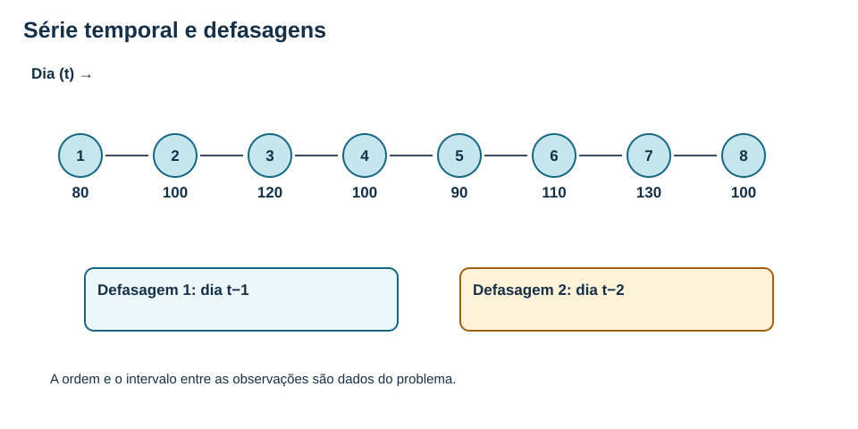
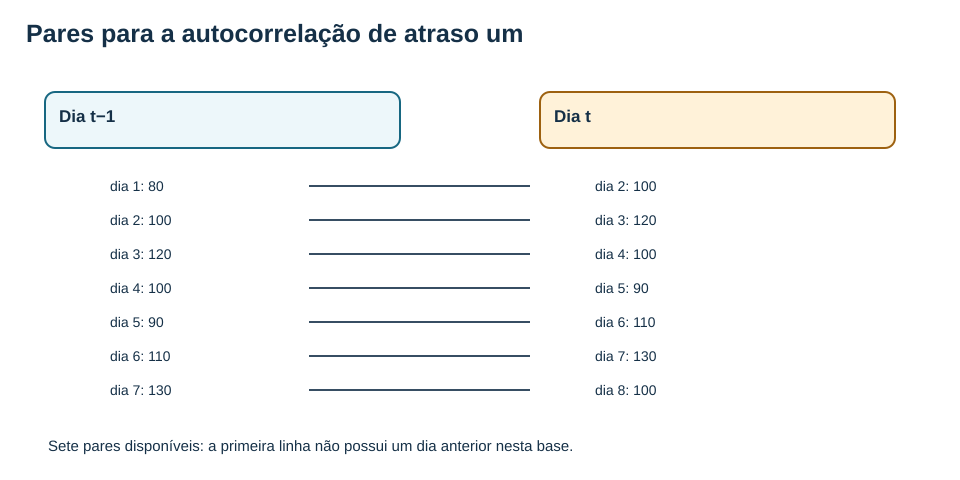
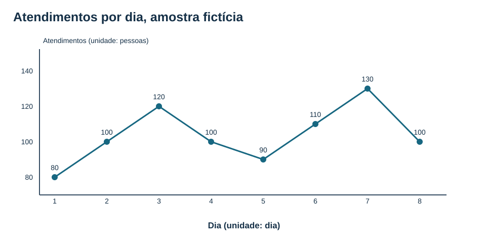
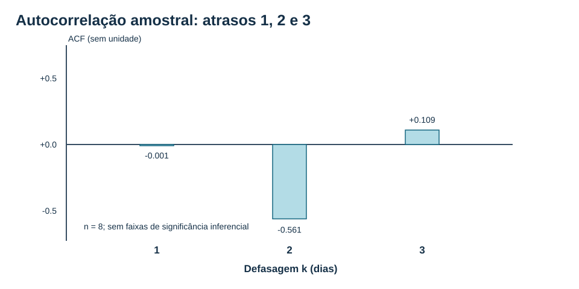
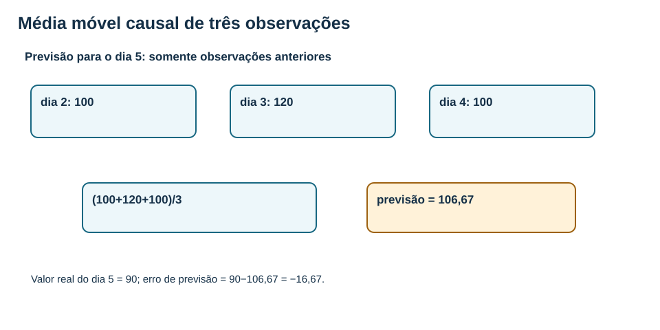
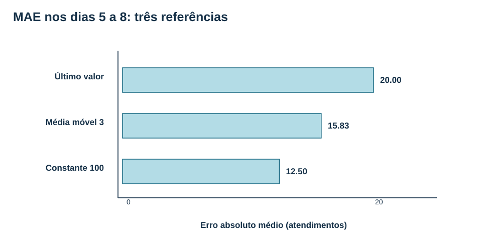
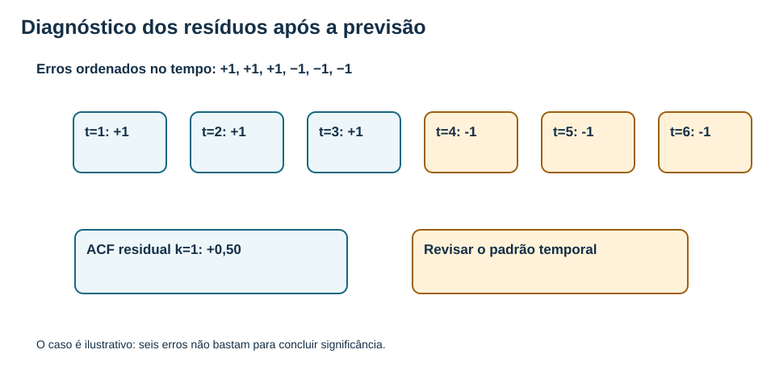

# MAT-EST-042 — Dependência temporal e modelos iniciais de séries: defasagens, autocorrelação, médias móveis e diagnóstico de resíduos

**Duração sugerida:** cinco blocos de 25 a 50 minutos, com continuidade pelo ponto exato de parada, não por dia fixo. **Natureza:** aprofundamento e ponte universitária. Os fundamentos de leitura de gráficos, médias e interpretação de dados dialogam com o ENEM e vestibulares; ACF teórica e modelos AR/MA são apresentados como extensão universitária, sem afirmar cobrança obrigatória por banca. **Situação individual:** ainda não iniciado, sem tentativa registrada.

## 1. Por que a ordem altera a pergunta estatística?

O MAT-EST-041 ensinou que observações próximas no tempo podem ser dependentes e que a validação deve respeitar a cronologia. Agora perguntamos: **como enxergar, medir e começar a representar essa dependência?** Uma série temporal é uma coleção de observações em momentos identificados. Trocar as posições de dois valores pode preservar a média, mas altera pares, saltos, defasagens e o contexto das previsões. Uma mesma pessoa que registra atendimentos diariamente não possui oito amostras independentes apenas por ter oito linhas.

**Objetivos.** Identificar as defasagens um e dois; distinguir nível de primeira diferença; construir e interpretar autocorrelação amostral segundo uma convenção explícita; calcular uma média móvel causal e compará-la com referências em datas futuras; reconhecer a diferença entre suavização e o processo estatístico MA; explicar um modelo autorregressivo inicial; identificar estrutura temporal residual sem tirar conclusões excessivas de uma amostra curta; documentar limitações e próximos exames.

**Pré-requisitos.** Revisar média, variância e correlação em MAT-EST-019 e 020; a separação temporal em MAT-EST-031; o erro de previsão em MAT-EST-034; e dependência e validação temporal em MAT-EST-041. Quando necessário, retomar diferença, fração e representação de pontos num gráfico antes de interpretar a ACF.

**Figura 1.** Texto alternativo: oito registros cronológicos e caixas para uma e duas defasagens. **Observe:** em um instante t, o índice t menos um significa período anterior, não subtração de unidades do valor observado. **Conclusão em áudio:** o tempo é parte da informação, e previsão honesta não consulta o futuro.

## 2. Defasagem: relacionar um período aos anteriores

Escrevemos x(t) para o valor observado no período t, lido “xis no instante t”. A **defasagem um**, escrita x(t−1), significa o valor um período antes; x(t−2), dois períodos antes. No quinto dia de nossa base, x(5)=90, x(4)=100 e x(3)=120. Portanto, a previsão ingênua de um passo à frente, produzida ao encerrar o dia quatro, usa x(4)=100; não pode usar x(5)=90.

A série fictícia, herdada *sem alteração* do arquivo CSV do MAT-EST-041, é **80, 100, 120, 100, 90, 110, 130 e 100 atendimentos**, nos dias um a oito. É um exemplo didático, não coleta de um posto de saúde real. No arquivo, os primeiros quatro dias foram identificados como referência, e os quatro últimos como teste.

**Figura 2.** Texto alternativo: sete pares sequenciais, de dia um com dois até dia sete com oito. **Observe:** para uma defasagem, oito períodos originam sete pares; para duas, seis pares. **Conclusão em áudio:** associação temporal exige comparar valores com intervalo definido.

### 2.1 Nível, variação e primeira diferença

O nível é o próprio x(t). A **primeira diferença** é Δx(t)=x(t)−x(t−1), lida “delta xis no instante t, igual a xis de t menos xis do período anterior”. No quarto dia, a diferença é 100−120=**−20 atendimentos**. Isso não é uma queda de vinte por cento: a diferença está na unidade original. As sete diferenças da série são [20,20,−20,−10,20,20,−30]. Diferenciar uma série pode ajudar a analisar mudanças, mas não prova por si só estacionariedade ou independência.

## 3. Primeiro gráfico: descrever, não inventar um padrão

**Figura 3.** Texto alternativo: gráfico temporal dos oito dias, com eixo horizontal em dias e eixo vertical em atendimentos. **Observe:** há aumento inicial até 120, queda a 90 no dia cinco, aumento a 130 no sete e recuo a 100 no oito. **Conclusão em áudio:** oito pontos descrevem oscilações nesse recorte; não demonstram uma sazonalidade estável, uma tendência futura ou causa de qualquer variação.

Uma série pode conter tendência, sazonalidade, mudança de patamar, dispersão variável, dependência serial e acontecimentos externos. Antes de nomear um padrão, pergunte quantas repetições foram observadas e se a frequência de coleta permite identificá-lo. A **estacionariedade fraca** de uma série, como aprofundamento, exige média e variância constantes no tempo e covariância dependente apenas da separação temporal. Uma série com tendência não atende automaticamente a essas condições. A explicação de referência está no [curso STAT 510, lição 1](https://online.stat.psu.edu/stat510/Lesson01).

## 4. Autocorrelação: quanto a série se relaciona consigo mesma?

A autocorrelação compara a sequência original com cópias deslocadas dela. Usaremos a convenção amostral

**r(k) = soma de (x(t) − média) vezes (x(t−k) − média), para t de k+1 até n, dividida pela soma de (x(t) − média) ao quadrado, para t de 1 até n.**

Leia “erre de cá: soma dos produtos de desvios separados por cá períodos, dividida pela soma global dos quadrados de desvios”. A definição do denominador importa, pois livros ou programas podem usar convenções amostrais diferentes. Nossa média global é 830/8=**103,75**, e o denominador vale **1.787,5** atendimentos ao quadrado.

O numerador para k=1 é **−1,5625**. Logo r(1)=−1,5625/1.787,5=**−1/1144 ≈ −0,000874**. Para k=2, o numerador é **−1.003,125**, produzindo r(2)=**−321/572 ≈ −0,56119**. O arquivo de cálculos apresenta os valores centrados e reproduz a conta. O fato de o atraso um ser quase zero **não prova independência**: pode haver associação em outros atrasos, não linearidade, sazonalidade ou simples oscilação amostral.

**Figura 4.** Texto alternativo: barras da autocorrelação para defasagens um, dois e três, aproximadamente zero, menos 0,561 e mais 0,109. Eixo horizontal é atraso em dias; eixo vertical é correlação, sem unidade. **Observe:** a relação depende do atraso escolhido. **Conclusão em áudio:** esta base tem somente oito dias, portanto não calculamos faixas de significância ou afirmamos que o padrão caracteriza o processo populacional.

**Cuidado com causalidade.** Autocorrelação positiva ou negativa é associação amostral no tempo. Não responde sozinha por que uma demanda mudou, nem separa fatores como feriados, clima, escala ou erro de registro. Para avaliar causalidade seria necessário outro desenho de investigação.

## 5. Médias móveis simples: suavizar e prever são tarefas diferentes

Uma **média móvel simples causal de três períodos** para prever o próximo dia usa apenas as últimas três observações disponíveis: previsão de x(t) = [x(t−1)+x(t−2)+x(t−3)]/3. Em português: somamos os três valores anteriores e dividimos por três. O dia cinco usa dias dois, três e quatro, com valores 100, 120 e 100. A previsão é **320/3, cerca de 106,67**; quando o real 90 chega, o erro definido como real menos previsto é aproximadamente **−16,67**.

Uma **média móvel centrada** para representar visualmente o dia t pode usar x(t−1), x(t) e x(t+1). Ela ajuda numa descrição retrospectiva, mas **não** é uma previsão legítima feita antes de t: incorpora o próprio valor a prever e um momento posterior.

**Figura 5.** Texto alternativo: caixas dos dias dois, três e quatro, usadas para antecipar o dia cinco. **Observe:** só se consultam os três dias passados. **Conclusão em áudio:** a previsão de 106 e dois terços não é igual ao resultado real de noventa e o erro só pode ser aferido após a observação.

### 5.1 Avaliação sobre os dias ainda não vistos

Mantivemos o corte temporal herdado: dias um a quatro servem como referência inicial, e dias cinco a oito são avaliados em origem móvel, cada qual previsto com os registros disponíveis até o dia anterior. As quatro previsões da média móvel de três dias são **106,67; 103,33; 100; 110**; os reais são **90; 110; 130; 100**. Os módulos dos erros, sem arredondar antes do cálculo, são **50/3; 20/3; 30; 10**. Assim, o erro absoluto médio, MAE, vale **95/6 ≈ 15,83 atendimentos**. O erro quadrático médio com raiz, RMSE, vale **raiz de 2.975 dividida por três ≈ 18,18 atendimentos**.

Usando os mesmos quatro períodos, a previsão ingênua que repete o último valor tem MAE **20**, e a referência constante 100 tem MAE **12,5**. A tabela apresenta exatamente o recorte fictício, não uma comparação universal entre algoritmos.

| Estratégia | Previsões dias 5–8 | MAE (atendimentos) | RMSE (atendimentos) |
|---|---|---:|---:|
| Último valor observado | 100; 90; 110; 130 | 20,00 | 21,21 |
| Média dos três anteriores | 106,67; 103,33; 100; 110 | 15,83 | 18,18 |
| Constante 100 | 100; 100; 100; 100 | 12,50 | 16,58 |

No recorte fictício, a referência constante tem menor MAE e RMSE. Não reestimamos os modelos A e B pré-calculados no CSV, nem usamos o conjunto de teste para otimizar a janela; isso impediria descrever a comparação como teste final intocado. O código preserva os valores exatos antes de arredondar a apresentação.

**Figura 6.** Texto alternativo: três barras horizontais, em atendimentos: erro absoluto médio de vinte, quinze vírgula oitenta e três e doze vírgula cinquenta. **Observe:** menor barra significa menor MAE apenas nestes quatro dias. **Conclusão em áudio:** comparar a mesma métrica, nos mesmos períodos e com a mesma informação disponível evita afirmações enganosas.

### 5.2 Previsões de um passo e de vários passos

A janela causal descrita acima avalia previsão de **um dia à frente**, atualizada após cada novo observado. Antecipar simultaneamente uma semana exige outro protocolo: não se pode alimentar os passos seguintes com resultados futuros ainda não disponíveis. Definir horizonte e instante de emissão da previsão é parte do modelo.

## 6. Por que média móvel simples e modelo MA(q) não são sinônimos?

A média móvel simples da seção anterior combina observações. Já um **modelo estocástico MA(1)**, “modelo de médias móveis de ordem um”, pode ser descrito como x(t)=μ+ε(t)+θ ε(t−1), ou “valor de t é média mais perturbação presente mais teta vezes perturbação anterior”. Os ε, chamados inovações, são choques de média zero e sem correlação serial dentro das hipóteses do modelo. Esse processo **não** consiste em tirar a média aritmética dos últimos três valores.

Como extensão universitária, sua variância teórica é σ²(1+θ²), e a covariância de atraso um é θσ². Portanto, rho(1)=θ/(1+θ²). Com θ=0,5, rho(1)=0,5/1,25=**0,4** e rho(k)=0 para atrasos a partir de dois, supondo choques brancos. Esse resultado descreve o modelo hipotético, **não** um ajuste feito à base de oito dias. Veja [STAT 510, lição 2](https://online.stat.psu.edu/stat510/Lesson02).

## 7. Modelo autorregressivo inicial AR(1): o passado como preditor

Em um modelo autorregressivo simples, o valor atual se relaciona ao valor imediatamente anterior. Uma forma centrada ilustrativa para previsão é **previsão de x(t+1) = μ + φ[x(t)−μ]**, lida “média mais fi vezes o desvio do último valor em relação à média”. Se μ=100, φ=0,6 e x(t)=110, prevemos 100+0,6×10=**106** para o próximo período. Sem observação nova, a previsão de dois passos fica 100+0,6×(106−100)=**103,6**.

Para um AR(1) fracamente estacionário com |φ| menor que um e inovações nas hipóteses usuais, a autocorrelação teórica segue rho(k)=φ elevado a k. Nesse caso, rho(1)=0,6 e rho(2)=0,36. Isso difere do exemplo teórico de MA(1), no qual a correlação se encerra depois do primeiro atraso. **Não ajustar nem selecionar automaticamente AR/MA com somente oito pontos**: os valores aqui são fornecidos para derivação conceitual.

## 8. Diagnóstico de resíduos: erro médio zero não encerra o trabalho

Depois de estimar um modelo, examinamos os **resíduos de ajuste**, ou, em avaliação posterior, os **erros fora da amostra**. Primeiro verificamos o sinal, a magnitude, os valores extremos e mudanças de dispersão. Depois, colocamos os erros em ordem temporal e inspecionamos a autocorrelação. Um modelo que retém estrutura serial nos resíduos talvez tenha deixado informação útil sem representar. A conclusão depende do desenho, da quantidade de dados e da hipótese específica; não é legítimo declarar “resíduos independentes” só porque a média é zero.

No exemplo autoral [1,1,1,−1,−1,−1], a média dos erros é zero. No entanto, há três sinais positivos seguidos de três negativos. A soma dos quadrados é 6, e o numerador da autocorrelação amostral no atraso um é 3; logo r(1)=3/6=**0,5**. Essa observação solicita investigação, mas a amostra de seis erros não justifica um teste conclusivo.

**Figura 7.** Texto alternativo: seis erros de média zero, ordenados em duas sequências de três sinais iguais. **Observe:** o padrão temporal não aparece na média agregada. **Conclusão em áudio:** residuais precisam de diagnóstico temporal; a ACF de um período é meio neste pequeno exemplo.

### 8.1 Um protocolo honesto de diagnóstico

1. Registre o objetivo e o horizonte da previsão. Separe treino e teste segundo a disponibilidade real dos dados.
2. Faça gráfico temporal dos observados, diferenças e resíduos, com eixos, unidades, períodos faltantes e acontecimentos conhecidos.
3. Calcule as correlações amostrais de defasagens previamente justificadas e declare a convenção. Não trate um pico isolado numa série curta como descoberta robusta.
4. Compare uma referência simples e, quando houver dados, modelos concorrentes em origens móveis e períodos posteriores. Não use o teste final para refazer indefinidamente a escolha.
5. Reporte MAE e, se adequado, RMSE, incluindo quantidade de períodos, horizonte e erros relevantes. Verifique a degradação de qualidade ao longo do tempo.
6. Documente alterações de frequência de medição, feriados, dados ausentes e mudanças de operação. Considere a possibilidade de padrões espúrios, tendência e sazonalidade.

A [lição 1 de STAT 510](https://online.stat.psu.edu/stat510/Lesson01) aborda ACF e análise de resíduos; o curso [*Forecasting: Principles and Practice*](https://otexts.com/fpp3/) contextualiza avaliação fora da amostra. O protocolo acima é uma organização didática autoral.

## 9. Vídeo complementar e orientação de uso

**Título:** *Lecture 12: Time Series Analysis*. **Canal:** MIT OpenCourseWare; professor Peter Kempthorne, curso MIT 18.642 de 2024. **Acesso:** [página institucional e vídeo da aula](https://ocw.mit.edu/courses/18-642-topics-in-mathematics-with-applications-in-finance-fall-2024/resources/18642-lecture-12-version-2_mp4/); [publicação no YouTube](https://www.youtube.com/watch?v=qlytPllimpQ). **Duração:** não confirmada pelos dados institucionais consultados. **Momento:** após a seção 7, para observar como a noção de estacionariedade e as estruturas AR e MA são conectadas. **Motivo:** complementa a distinção entre dependência observada, modelos e transformações. Página e publicação foram identificadas; reprodução integral e teste no Microsoft Edge continuam pendentes. O vídeo não substitui as explicações nem a resolução dos exemplos.

## 10. Exercícios graduais — enunciados antes do gabarito

As 36 questões são **inteiramente autorais**; dez de aprendizagem, dez de consolidação, dez de transferência/estilo vestibular e seis de reteste. Nenhuma foi apresentada como questão oficial do ENEM, da FUVEST, da UNICAMP ou da UNESP. Responda antes de acessar `gabarito-comentado.json`; o site deverá oferecer correção apenas após tentativa. A classificação de causa provável é hipótese editorial, não diagnóstico individual.

### Aprendizagem

**MAT-EST-042-EX-APR-01 — Ordem é informação.** Uma planilha contém os totais por dia 80, 100, 120, 100. É válido embaralhar os quatro valores para estudar dependência temporal?

**MAT-EST-042-EX-APR-02 — Defasagem de um dia.** A série dos dias 1 a 5 é 80, 100, 120, 100, 90. Qual é x(t−1) quando t=5?

**MAT-EST-042-EX-APR-03 — Defasagem de dois dias.** Na mesma série dos dias um a cinco, qual observação corresponde a x(t−2), defasagem de dois períodos, quando t=5?

**MAT-EST-042-EX-APR-04 — Pares disponíveis.** Oito dias consecutivos admitem quantos pares observados para autocorrelação de defasagem um?

**MAT-EST-042-EX-APR-05 — Primeira diferença.** Se x(3)=120 e x(4)=100, calcule a primeira diferença do dia quatro.

**MAT-EST-042-EX-APR-06 — Previsão ingênua.** Se o último valor disponível no dia quatro foi 100, quanto prevê para o dia cinco o método do último valor?

**MAT-EST-042-EX-APR-07 — Média móvel causal.** Os três últimos valores disponíveis são 100, 120 e 100. Qual a média móvel simples de três valores para o próximo dia?

**MAT-EST-042-EX-APR-08 — Média centralizada e futuro.** Para prever o dia cinco, pode ser usada a média de dias quatro, cinco e seis?

**MAT-EST-042-EX-APR-09 — Erro com sinal.** Uma previsão foi 106,67 e o valor observado foi 90. Usando erro igual a observado menos previsto, qual o sinal?

**MAT-EST-042-EX-APR-10 — O que é um resíduo?.** Explique a diferença entre um resíduo de ajuste e um erro de previsão em dado futuro.

### Consolidação

**MAT-EST-042-EX-CON-01 — Pares para atraso dois.** Na série de oito dias, quais pares de índices entram no numerador da ACF de atraso dois?

**MAT-EST-042-EX-CON-02 — Centro da série.** Calcule a média dos oito atendimentos 80,100,120,100,90,110,130,100.

**MAT-EST-042-EX-CON-03 — Denominador ACF.** Qual é o denominador soma dos quadrados dos desvios ao usar média 103,75 nessa base?

**MAT-EST-042-EX-CON-04 — ACF de atraso um.** O numerador calculado do atraso um é −1,5625 e o denominador é 1.787,5. Ache r(1).

**MAT-EST-042-EX-CON-05 — ACF de atraso dois.** O numerador do atraso dois é −1.003,125 e o denominador 1.787,5. Encontre r(2).

**MAT-EST-042-EX-CON-06 — Média móvel dia seis.** Para prever dia seis, use apenas os valores dos dias três, quatro e cinco: 120, 100, 90. Calcule.

**MAT-EST-042-EX-CON-07 — Média móvel dia sete.** Para o dia sete, os dias quatro, cinco e seis tiveram 100, 90 e 110. Ache a previsão causal.

**MAT-EST-042-EX-CON-08 — MAE média móvel três.** Nos dias cinco a oito os erros absolutos são 50/3, 20/3, 30 e 10. Qual é o MAE?

**MAT-EST-042-EX-CON-09 — Comparação justa.** A média móvel de três dias teve MAE 15,83; a referência constante 100 teve MAE 12,50 nos mesmos dias. Qual descreve corretamente esses dados?

**MAT-EST-042-EX-CON-10 — Resíduo com média zero.** Se erros sequenciais são +1,+1,+1,−1,−1,−1, sua média nula basta para dizer que não há estrutura temporal?

### Transferência e aprofundamento — situações autorais

**MAT-EST-042-EX-VES-01 — Dado fictício, questão autoral: atendimento sazonal.** Uma unidade registra 100, 150, 100, 150 por quatro semanas, nessa ordem. Um estudante diz que basta a média 125 para provar periodicidade anual. Avalie.

**MAT-EST-042-EX-VES-02 — Dado fictício, questão autoral: lag e disponibilidade.** Ao prever o dia dez, o sistema utiliza uma coluna rotulada “valor anterior” que foi preenchida com o valor do dia onze em cinco linhas. Qual falha de avaliação ocorreu?

**MAT-EST-042-EX-VES-03 — Dado fictício, questão autoral: ACF e causalidade.** Uma série apresenta r(2)=−0,56. É válido concluir que valores elevados causam queda exatamente dois dias depois?

**MAT-EST-042-EX-VES-04 — Dado fictício, questão autoral: filtro retrospectivo.** Um gráfico usa média centralizada de três dias para reduzir ruído e a legenda diz “previsão disponível no próprio dia”. Identifique duas ressalvas.

**MAT-EST-042-EX-VES-05 — Dado fictício, questão autoral: AR(1) centrado.** Sob o modelo ilustrativo μ=100 e φ=0,6, o último valor é 110. Qual previsão de um passo pela equação μ+φ(x(t)−μ)?

**MAT-EST-042-EX-VES-06 — Dado fictício, questão autoral: AR dois passos.** No mesmo AR(1), sem novas observações, qual a previsão dois passos adiante?

**MAT-EST-042-EX-VES-07 — Dado fictício, questão autoral: dois significados de MA.** Uma equipe afirma que a média aritmética dos últimos três dias é o mesmo que um modelo MA(1) com θ=0,5. Explique o equívoco.

**MAT-EST-042-EX-VES-08 — Dado fictício, questão autoral: ACF teórica MA1.** Em um processo MA(1) com choques brancos e θ=0,5, quanto vale a autocorrelação teórica de atraso um?

**MAT-EST-042-EX-VES-09 — Dado fictício, questão autoral: AR1 versus MA1.** Um AR(1) estacionário com φ=0,6 e um MA(1) com θ=0,5 têm qual autocorrelação teórica no atraso dois?

**MAT-EST-042-EX-VES-10 — Dado fictício, questão autoral: política de modelo.** Os MAEs são 20 (último valor), 15,83 (média móvel 3) e 12,50 (constante 100). Um gestor pretende adotar o terceiro sem monitorar. Que proposta estatística cabe?

### Reteste independente

**MAT-EST-042-EX-RET-01 — Reteste: mudar a série.** Valores observados 3, 5, 8, 4, 7. Quais são os pares (anterior, atual) para atraso um?

**MAT-EST-042-EX-RET-02 — Reteste: diferença versus nível.** Uma série tem x(4)=42 e x(5)=38. Calcule Δx(5) e indique se significa taxa percentual.

**MAT-EST-042-EX-RET-03 — Reteste: média causal diferente.** Dados passados 9, 12, 15, 6. Usando só os últimos três, preveja o período seguinte.

**MAT-EST-042-EX-RET-04 — Reteste: ACF centrada.** Em uma amostra já centrada com desvios [−1,0,1], calcule r(1) com o denominador global.

**MAT-EST-042-EX-RET-05 — Reteste: diagnóstico de resíduos.** Erro cronológico +2,+2,+2,+2,−2,−2,−2,−2 tem média zero. Que investigação específica ainda é necessária?

**MAT-EST-042-EX-RET-06 — Reteste: desenhar a verificação.** Você precisa prever o total de sexta-feira toda quinta à noite. Como impedir vazamento numa validação por origem móvel?

**Correção e critérios.** O gabarito separado traz resposta, resolução textual e possível categoria de erro. Após tentativa efetiva, registrar erro de conteúdo, interpretação, cálculo, distração, memória, estratégia ou tempo com evidência da própria resposta. Reteste só depois da recuperação. O arquivo `exercicios.json` contém os 36 enunciados, sem respostas; `gabarito-comentado.json` é o documento de correção.

## 11. Resumo falado e revisão em espiral

Defasagem é o período anterior ou o intervalo entre dois registros. Primeira diferença é a variação em unidades, não porcentagem. Autocorrelação compara a série consigo mesma num atraso especificado, mas não prova causa nem independência. Média móvel de observações anteriores é uma ferramenta de suavização ou previsão causal; uma média centrada usa o futuro para uma previsão feita no presente. O processo MA(1) descreve choques atual e anterior e não é esse filtro aritmético. O AR(1) usa o valor anterior em um modelo probabilístico, sob hipóteses. Resíduos com média zero ainda podem ter padrão temporal.

**Revisão espaçada:** programar revisões nos dias um, sete e trinta **a partir da realização individual efetiva**, jamais da data de produção editorial. Em cada revisão, explicar de memória uma figura, recalcular um exemplo, resolver itens inéditos e justificar por que o uso de informação posterior geraria vazamento. Marcar `consolidado` somente após evidência em exercícios e aplicação nova. Os estados possíveis continuam: `não iniciado`, `aprendendo`, `revisar` e `consolidado`.

## 12. Fontes e provenance

- [Penn State — STAT 510, lição 1: Time Series Basics](https://online.stat.psu.edu/stat510/Lesson01): características de séries, estacionariedade, autocorrelação e resíduos.
- [Penn State — STAT 510, lição 2: MA Models](https://online.stat.psu.edu/stat510/Lesson02): distinção e propriedades dos processos MA.
- [MIT OpenCourseWare — Lecture 12: Time Series Analysis](https://ocw.mit.edu/courses/18-642-topics-in-mathematics-with-applications-in-finance-fall-2024/resources/18642-lecture-12-version-2_mp4/): videoaula complementar.
- [Hyndman e Athanasopoulos — Forecasting: Principles and Practice, edição 3](https://otexts.com/fpp3/): previsão e diagnóstico, consulta de apoio.
- O arquivo `dados-ficticios-referencia.csv` foi copiado sem qualquer alteração de MAT-EST-041, com SHA-256 documentado. Questões, exercícios, diagramas e protocolos são autorais e independentes de qualquer caderno oficial.

## 13. Próximo passo

**MAT-EST-043 — Tendência, sazonalidade e decomposição de séries temporais: padrões, diferenças sazonais e previsões de referência.** Não registrar tentativas fictícias nem alterar pendências individuais anteriores: MAT-EST-018, MAT-EST-037, MAT-PRO-039 e MAT-PRO-054. Material ainda não publicado nem sincronizado com Google Drive.
