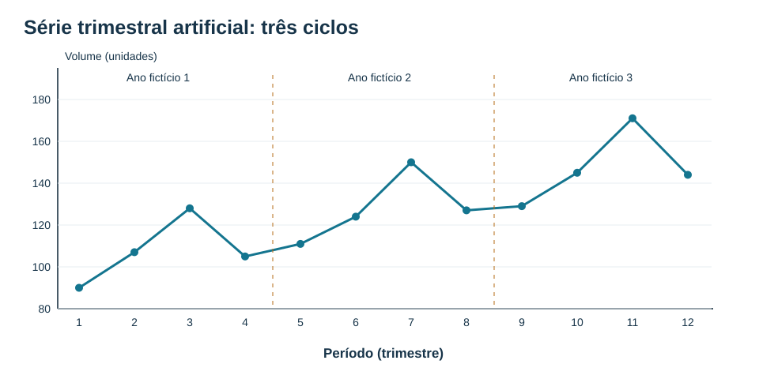
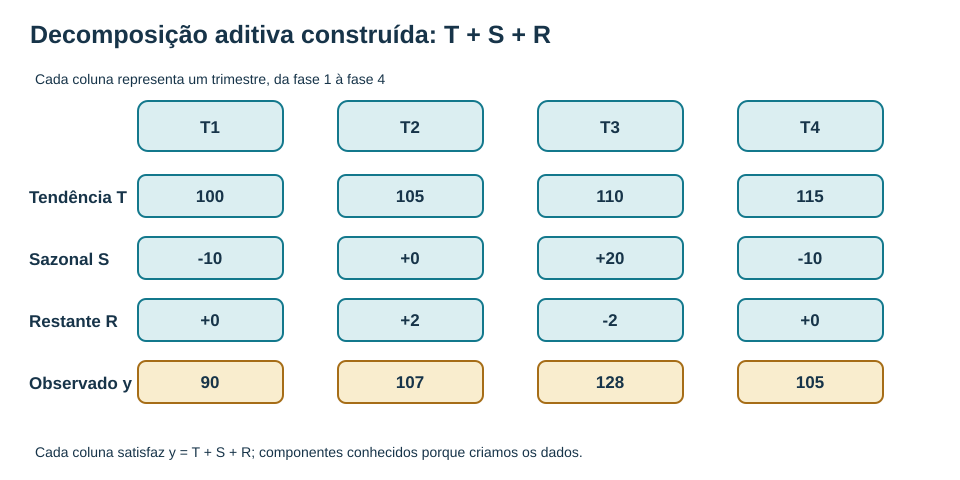
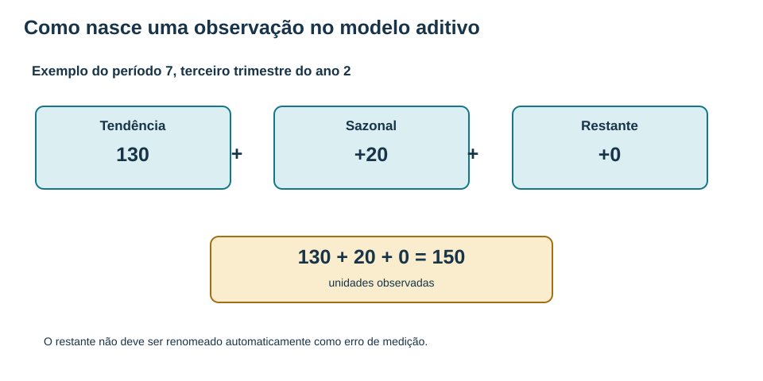
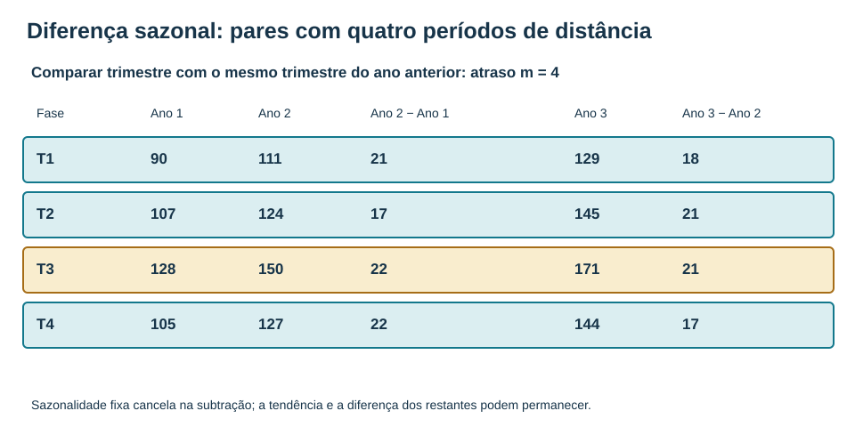
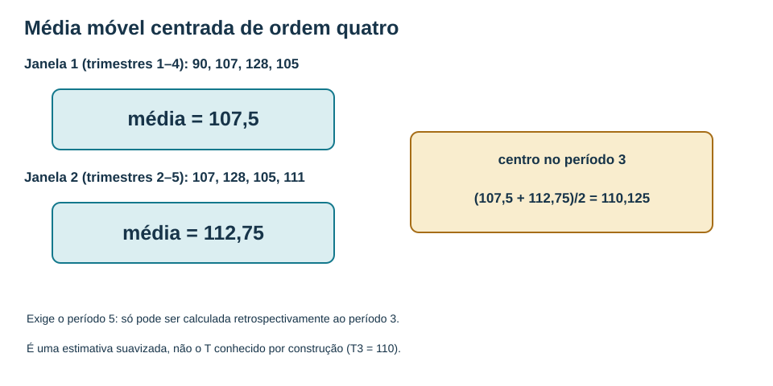
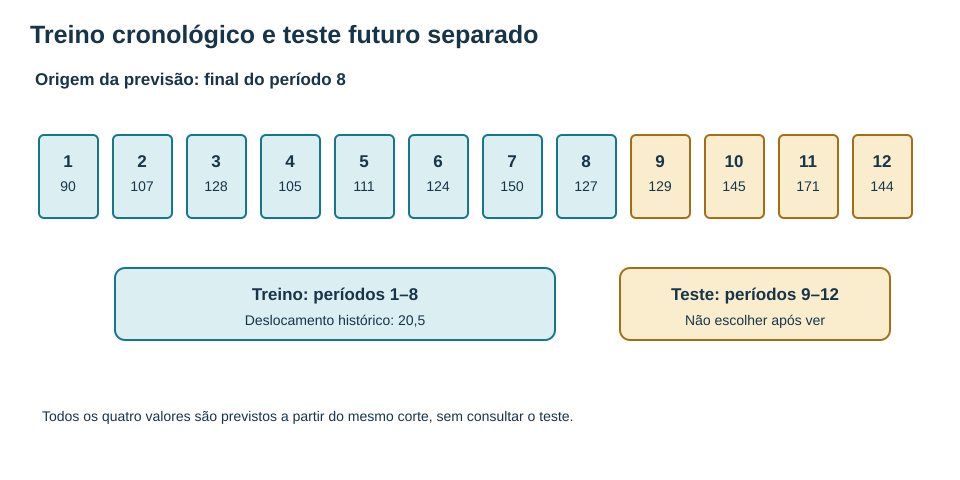
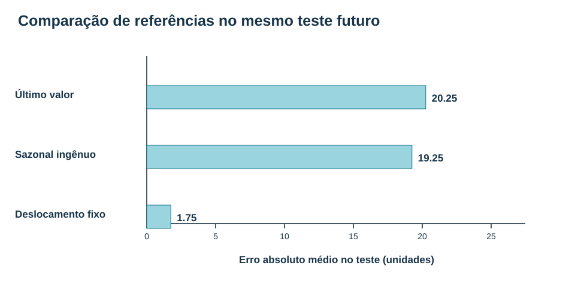

# MAT-EST-043 — Tendência, sazonalidade e decomposição de séries temporais: padrões, diferenças sazonais e previsões de referência

**Duração sugerida:** blocos de 25 a 50 minutos, sem pressionar para terminar tudo numa leitura. **Status:** conteúdo editorial produzido; nenhuma tentativa individual registrada. **Tipo:** ponte universitária. ENEM, FUVEST, UNICAMP e UNESP envolvem leitura de gráficos, proporções, variação e estatística elementar; os procedimentos formais de decomposição STL e diferenças sazonais são aprofundamentos universitários, não requisitos aqui atribuídos aos editais.

## 1. Objetivos e pré-requisitos

Ao final do estudo e das práticas, distinguir tendência, sazonalidade, ciclo e restante; reconhecer o período sazonal na unidade de coleta; reconstruir uma decomposição aditiva; entender quando faz sentido pensar numa decomposição multiplicativa; calcular e interpretar uma diferença sazonal; construir uma média móvel centrada de ordem par; comparar previsões sazonais de referência sob um mesmo corte cronológico; e explicar os limites das conclusões com apenas três ciclos fictícios.

Pré-requisitos: leitura de gráficos e operações básicas (MAT-EST-019 e MAT-EST-020); média e variação; previsões, validação temporal e métricas (MAT-EST-031, 032 e 041); defasagem, primeira diferença e média móvel causal (MAT-EST-042). Se a diferença entre x(t) e x(t−4) estiver confusa, retome a explicação das defasagens antes de avançar.

**Contexto:** demandas de atendimento, consumo de energia, emprego e vendas podem variar por tendências de longo prazo, períodos recorrentes e acontecimentos excepcionais. Saber separar essas descrições ajuda a interpretar os números, mas um padrão estatístico, sozinho, não estabelece uma causa.

## 2. Quando uma série muda, que tipo de mudança vemos?

**Tendência** é uma mudança persistente no nível ao longo de muitos períodos. Pode crescer, cair ou variar suavemente; não precisa ser uma reta. **Sazonalidade** é o padrão ligado à posição que se repete em intervalo regular, como trimestres, meses ou dias da semana. **Ciclo** é flutuação com duração menos estável, que não precisa repetir exatamente o mesmo intervalo. **Restante** é o que sobra sob o procedimento de decomposição escolhido; pode conter choques, variação não explicada e estrutura ainda não representada.

Uma série registrada por trimestre tem quatro observações por ano: seu período sazonal anual candidato é **m=4**, lido “eme igual a quatro observações”. Isso identifica o intervalo de calendário, não demonstra que a sazonalidade está presente. Com registros mensais e padrão anual, m=12; em registros diários com repetição semanal, m=7. A definição é compatível com [Forecasting: Principles and Practice, capítulo 3](https://otexts.com/fpp3/decomposition.html).

**Figura 1.** Texto alternativo: eixo horizontal com períodos 1 a 12, em trimestres; eixo vertical em unidades, aproximadamente de 80 a 180. A série é 90, 107, 128, 105, 111, 124, 150, 127, 129, 145, 171, 144. **Observe:** o terceiro trimestre tem máximos repetidos na série construída, sobre um nível que sobe. **Conclusão em áudio:** foram criados três ciclos artificiais, úteis para aprender a conta, mas não para alegar que um fenômeno real continuará assim.

## 3. Uma base nova para enxergar a estrutura, sem mudar a base anterior

O CSV de oito dias de MAT-EST-042 foi **copiado sem alterações** para `dados-ficticios-referencia.csv`. Oito dias não oferecem repetição de trimestres. Portanto, criamos um exemplo **separado**, em `dados-ficticios-trimestrais.csv`, com doze valores inventados a partir de uma regra explícita. Nele, a tendência é T(t)=100+5(t−1), os quatro efeitos sazonais se repetem na ordem −10, zero, +20 e −10, e o restante foi especificado como [0,2,−2,0,1,−1,0,2,−1,0,1,−1]. Toda unidade nesta base significa um volume hipotético sem relação com atendimentos reais.

| Período | Ano/fase | Tendência T | Sazonal S | Restante R | Observado y | Uso |
|---:|---|---:|---:|---:|---:|---|
| 1 | 1 / T1 | 100 | -10 | +0 | 90 | treino |
| 2 | 1 / T2 | 105 | +0 | +2 | 107 | treino |
| 3 | 1 / T3 | 110 | +20 | -2 | 128 | treino |
| 4 | 1 / T4 | 115 | -10 | +0 | 105 | treino |
| 5 | 2 / T1 | 120 | -10 | +1 | 111 | treino |
| 6 | 2 / T2 | 125 | +0 | -1 | 124 | treino |
| 7 | 2 / T3 | 130 | +20 | +0 | 150 | treino |
| 8 | 2 / T4 | 135 | -10 | +2 | 127 | treino |
| 9 | 3 / T1 | 140 | -10 | -1 | 129 | teste |
| 10 | 3 / T2 | 145 | +0 | +0 | 145 | teste |
| 11 | 3 / T3 | 150 | +20 | +1 | 171 | teste |
| 12 | 3 / T4 | 155 | -10 | -1 | 144 | teste |

**Leitura em áudio:** os dois primeiros anos, períodos um a oito, são o treino; os quatro períodos do terceiro ano, de nove a doze, são teste. Os valores observados nos quatro primeiros períodos são 90, 107, 128 e 105. Nos períodos cinco a oito são 111, 124, 150 e 127. No terceiro ano são 129, 145, 171 e 144. O restante e os componentes são conhecidos *porque nós os criamos*: isso não significa que um método de decomposição recupere exatamente seus valores de uma série real.

## 4. Modelo aditivo: por que os componentes são somados?

A identidade **y(t)=T(t)+S(t)+R(t)** lê-se “valor observado no período t é igual à tendência mais o efeito sazonal mais o restante”. Todos os termos usam a mesma unidade. Um efeito sazonal de vinte unidades significa adicionar vinte, independentemente do nível da tendência. Na série artificial, o efeito é normalizado para soma zero em cada grupo de quatro trimestres: menos dez, zero, vinte, menos dez.

**Figura 2.** Texto alternativo: em quatro fases, tendência de 100 a 115, sazonalidade −10, 0, +20, −10 e restantes 0, +2, −2 e 0; somas observadas 90,107,128,105. **Observe:** cada coluna precisa satisfazer a soma. **Conclusão em áudio:** cada observado desta ilustração foi construído como soma das três linhas, sem ajuste estatístico posterior.

**Exemplo resolvido 1.** No período sete, T=130, S=20 e R=0. Primeiro identifique a fase, terceiro trimestre do segundo ano. Depois some 130 mais 20 mais zero. O observado é **150 unidades**. Para encontrar o restante a partir de uma tendência e uma sazonalidade conhecidas, isole R=y−T−S. No período seis: 124−125−0=**−1**.

**Figura 3.** Texto alternativo: caixas cento e trinta, vinte e zero somadas dão cento e cinquenta. **Observe:** os termos são volumes absolutos. **Conclusão em áudio:** o período sete contém tendência 130, sazonalidade mais 20 e restante zero.

**Ajuste sazonal aditivo** significa subtrair S: y ajustado = y−S = T+R. No período três, 128−20=**108**. Atenção: 108 não é exatamente a tendência conhecida 110, pois ainda contém o restante −2. Esse detalhe impede tratar uma série dessazonalizada como se tivesse removido toda incerteza ou todo ruído.

### 4.1 Quando a estrutura multiplicativa é mais apropriada?

Na estrutura **y=T×S×R**, lê-se “observado é tendência vezes fator sazonal vezes fator restante”. O fator S=1,20 representa nível vinte por cento acima da tendência. Com T=100 e R=1, o observado é 100×1,20×1=**120**. Quando uma oscilação aproximadamente dobra de amplitude ao dobrar o patamar da série, vale investigar sazonalidade proporcional. É uma decisão de modelagem, não uma lei automática. A divisão y/S faz o ajuste sazonal multiplicativo; zeros e valores não positivos exigem cuidado especial. A diferença entre as hipóteses aditiva e multiplicativa é explicada em [Forecasting: Principles and Practice, seção 3.2](https://otexts.com/fpp3/components.html).

## 5. Diferença sazonal: compare o mesmo trimestre em anos sucessivos

Defina **Δ₄y(t)=y(t)−y(t−4)**, lida “diferença sazonal de quatro: valor atual menos valor de quatro períodos atrás”. Quando a periodicidade é quatro, a primeira diferença sazonal disponível é do período cinco, pois é o primeiro com trimestre correspondente no ano anterior.

**Figura 4.** Texto alternativo: quadro com quatro fases e três anos; diferenças do segundo ano em relação ao primeiro 21,17,22,22, e do terceiro em relação ao segundo 18,21,21,17. **Observe:** pares de mesma estação ficam na mesma linha. **Conclusão em áudio:** a diferença sazonal compara sempre a mesma fase, não períodos adjacentes.

**Exemplo resolvido 2.** Período cinco: 111−90=**21**. Período doze: 144−127=**17**. A lista completa é 21, 17, 22, 22, 18, 21, 21, 17, respectivamente para os períodos cinco a doze. Não confunda com a primeira diferença do período doze, que é 144−171=**−27**.

**Justificação da fórmula.** Se y(t)=T(t)+S(t)+R(t) e o padrão sazonal fixo satisfaz S(t)=S(t−4), então a subtração y(t)−y(t−4) elimina a parcela S(t)−S(t−4), que vale zero. Permanecem a diferença das tendências e a diferença dos restantes. Em nosso exemplo T cresce cinco unidades por trimestre, portanto a diferença de tendência de um ano para outro é 5×4=**20**. As diferenças observadas oscilam ao redor desse valor porque os restantes também mudam. A eliminação dessa parcela sazonal **não** prova estacionariedade nem ausência de autocorrelação, como ressalta [STAT 510, lição 4](https://online.stat.psu.edu/stat510/Lesson04).

## 6. Médias móveis e o problema das bordas

Para suavizar retrospectivamente uma série trimestral, uma média móvel de quatro observações agrega um ano completo e pode atenuar parte de uma sazonalidade de soma zero. Primeiro calcule a janela dos períodos um a quatro: (90+107+128+105)/4=**107,5**. Depois, a janela dos períodos dois a cinco: (107+128+105+111)/4=**112,75**. Cada janela de tamanho par fica entre dois períodos; a média das duas médias permite centralizar o resultado no período três: (107,5+112,75)/2=**110,125**.

**Figura 5.** Texto alternativo: duas médias anuais, 107,5 e 112,75, fornecem valor centrado 110,125 no período três. **Observe:** o segundo bloco usa o período cinco, posterior ao três. **Conclusão em áudio:** essa média é uma descrição retrospectiva, não previsão disponível no próprio período três. Ela também não recupera exatamente a tendência construída, que é 110 nesse período.

A média centrada não existe automaticamente nas bordas sem dados adicionais ou suposições explícitas. Não invente períodos anteriores ou posteriores para preencher a planilha. Métodos mais flexíveis, como STL (*Seasonal and Trend decomposition using Loess*), permitem tendência e sazonalidade estimadas por suavizações; uma versão robusta pode reduzir a influência de valores atípicos, mas escolha de janelas e limites amostrais continuam relevantes. Veja [Forecasting: Principles and Practice, seção 3.6](https://otexts.com/fpp3/stl.html). Nesta aula nós **não executamos STL** e não apresentamos os componentes artificiais como resultados estimados por esse método.

## 7. Previsões de referência: começar pelo simples e respeitar o tempo

Uma previsão sazonal ingênua repete o último valor da mesma fase do calendário. Ao terminar o período oito, as previsões para nove, dez, onze e doze são os valores cinco, seis, sete e oito: **111, 124, 150, 127**. Já uma referência do **último valor global** prevê 127 para todos os quatro períodos seguintes quando emitida nesse mesmo corte. Ambas são regras legítimas de referência, mas não necessariamente apropriadas em todas as séries.

Uma terceira regra **autoral e apenas didática** será fixada com o treino: calcule os quatro incrementos anuais de mesma fase entre o primeiro e o segundo ano, 21, 17, 22 e 22. A média é **20,5**. Preveja cada trimestre do terceiro ano somando 20,5 ao valor do segundo ano na mesma fase. Assim obtemos **131,5; 144,5; 170,5; 147,5**. Esse método não é um modelo STL ajustado; é uma referência sazonal com deslocamento histórico constante definida antes de abrir o teste.

**Figura 6.** Texto alternativo: doze períodos; treino um a oito e teste nove a doze. **Observe:** o valor 20,5 é calculado apenas no treino. **Conclusão em áudio:** a comparação só é honesta se as três previsões forem emitidas com o mesmo conjunto de informações disponíveis no fim do período oito.

### 7.1 Cálculo auditável no conjunto de teste

| Regra previamente fixada | Previsões períodos 9 a 12 | MAE, unidades | RMSE, unidades |
|---|---|---:|---:|
| Último valor global do treino | 127; 127; 127; 127 | 20,25 | {rmse(test,naive):.2f} |
| Sazonal ingênua, m=4 | 111; 124; 150; 127 | 19,25 | {rmse(test,snaive):.2f} |
| Deslocamento histórico fixo | 131,5; 144,5; 170,5; 147,5 | 1,75 | {rmse(test,adjusted):.2f} |

Os observados do teste são **129; 145; 171; 144**. O MAE, erro absoluto médio, é a média dos módulos de observado menos previsão; o RMSE, raiz do erro quadrático médio, é a raiz da média dos erros ao quadrado. Para a referência sazonal ingênua, os erros são 18,21,21,17. O MAE é 77/4=**19,25** e o RMSE é raiz de (1495/4), ou raiz de 1495 dividida por dois, aproximadamente **{rmse(test,snaive):.2f}**. Para o deslocamento, os erros são −2,5; +0,5; +0,5; −3,5. Seu MAE é 7/4=**1,75**, e seu RMSE é raiz de 19 dividida por dois, aproximadamente **{rmse(test,adjusted):.2f}**. Não arredonde cada previsão antes de calcular os erros.

**Figura 7.** Texto alternativo: barras de erro absoluto médio, no mesmo teste: último valor 20,25, sazonal ingênuo 19,25, deslocamento histórico 1,75 unidade. **Observe:** a menor barra descreve este teste artificial de apenas quatro trimestres. **Conclusão em áudio:** ao incluir a tendência linear construída, o deslocamento histórico melhora a precisão nesta amostra inventada; não é prova de superioridade geral.

**Não ajuste o método depois de olhar as respostas.** Se uma equipe seleciona a regra após comparar t9 a t12, esses períodos também participaram da seleção. Uma avaliação final posterior exigiria novos dados futuros não utilizados. Na prática, deve-se acompanhar estabilidade por anos e contextos, comparar erros por estação e registrar intervalos e limitações. Veja [a explicação em português dos métodos simples](https://otexts.com/fpppg/simple-methods.html) e [previsão a partir de decomposição](https://otexts.com/fpp3/forecasting-decomposition.html).

## 8. Aplicações e erros frequentes

Em Geografia, a leitura de séries históricas distingue tendência de crescimento e ciclos econômicos. Em Ciências da Natureza, séries de temperatura ou vazão exigem atenção às estações e à frequência de medição. Na Administração, planejar insumos com demandas trimestrais pede comparação do mesmo trimestre e reconhecimento de eventos extraordinários. Em Redação e Linguagens, descrever um gráfico exige distinguir constatação numérica de hipótese explicativa.

Erros comuns: chamar qualquer oscilação de sazonalidade; comparar dezembro com novembro quando a pergunta exige dezembro com dezembro; supor que y−S elimina também o restante; confundir um fator multiplicativo de 1,2 com adição de 1,2 unidade; usar uma média centrada como se estivesse disponível em tempo real; declarar que diferença sazonal garante estacionariedade; presumir que uma identidade gerada artificialmente foi descoberta por STL; e escolher o método vencedor depois de examinar o teste e ainda chamá-lo de teste intocado.

### Perguntas de revisão sem consultar o gabarito

1. O que se repete para que algo seja chamado sazonal? 2. Que unidade representa m=4 numa série trimestral? 3. Em y=T+S+R, o que sobra em y−S? 4. Por que y(t)−y(t−4) cancela S fixa? 5. Por que uma média centrada de ordem quatro consulta informação futura em uma avaliação em tempo real? 6. Qual valor sazonal ingênuo é previsto para o período nove no corte oito? 7. Por que o melhor MAE entre quatro períodos artificiais não é certificação de desempenho futuro?

## 9. Vídeo complementar

**Título:** *Week 02: Lecture 06: Time Series Decomposition*. **Canal:** NPTEL IIT Bombay. **Publicação identificada:** 24/01/2025. **Idioma:** inglês. **Duração:** não confirmada. **Link:** https://www.youtube.com/watch?v=JbJjislNHFY . **Quando assistir:** após as seções quatro a seis, para rever a interpretação de componentes e a finalidade da decomposição. **Motivo:** aula de instituição de ensino superior dedicada especificamente à decomposição de séries temporais. O resultado indexado confirma título, canal e existência da publicação; reprodução integral e teste real de áudio ainda não foram efetuados. A presente aula é completa independentemente do vídeo.

## 10. Exercícios autorais por camada — primeiro responda, depois abra o gabarito

**Orientação:** questões de aprendizagem isolam um conceito; as de consolidação combinam cálculos; as de transferência trazem novas situações no estilo interpretativo de vestibulares, **sem representar questão oficial**; o reteste usa outros números e deve ser feito somente após correção. Não registrar como resolvidas questões ainda não respondidas.

### Aprendizagem — 10 questões

**MAT-EST-043-EX-APR-01 — Ordem e periodicidade.** Uma série trimestral registra quatro observações por ano. Qual é o período sazonal m em observações?

**MAT-EST-043-EX-APR-02 — Identificar tendência.** Na construção fictícia T(t)=100+5(t−1), quanto vale o componente de tendência no período 4?

**MAT-EST-043-EX-APR-03 — Sazonalidade constante.** Um exemplo aditivo usa os efeitos trimestrais −10, 0, +20, −10. Qual o efeito do terceiro trimestre?

**MAT-EST-043-EX-APR-04 — Índice sazonal centrado.** Uma decomposição aditiva hipotética tem os efeitos sazonais −10, 0, 20 e −10 unidades. Qual é a soma dos quatro efeitos em um ciclo completo?

**MAT-EST-043-EX-APR-05 — Soma no período sete.** No período 7, T=130, S=20 e R=0. Qual o observado construído pela identidade aditiva?

**MAT-EST-043-EX-APR-06 — Restante conhecido.** No período 6, o observado é 124, T=125 e S=0. Determine o restante R.

**MAT-EST-043-EX-APR-07 — Ajuste sazonal aditivo.** No período 3, y=128 e S=+20. Qual seria a série ajustada sazonalmente por subtração?

**MAT-EST-043-EX-APR-08 — Diferença sazonal simples.** O primeiro trimestre do ano 1 teve 90 unidades e o primeiro trimestre do ano 2 teve 111. Qual a diferença sazonal do período 5?

**MAT-EST-043-EX-APR-09 — Primeira diferença não sazonal.** O período 4 tem 105 e o período 5 tem 111. Qual a primeira diferença do período 5?

**MAT-EST-043-EX-APR-10 — Referência sazonal ingênua.** No fim do período 8, o último primeiro trimestre observado foi o período 5, com 111 unidades. Qual previsão sazonal ingênua para o período 9?

### Consolidação — 10 questões

**MAT-EST-043-EX-CON-01 — Decomposição de um valor.** Para o período 12, T=155, S=−10 e R=−1. Reconstrua y e interprete os sinais.

**MAT-EST-043-EX-CON-02 — Oito diferenças sazonais.** Partindo da série [90,107,128,105,111,124,150,127,129,145,171,144], calcule as diferenças de atraso 4, do período 5 ao 12.

**MAT-EST-043-EX-CON-03 — Cancelamento do efeito sazonal.** Na identidade y(t)=T(t)+S(t)+R(t), com S(t)=S(t−4), expresse y(t)−y(t−4).

**MAT-EST-043-EX-CON-04 — Média móvel quatro.** Calcule a média dos períodos 1 a 4, cujos observados são 90,107,128,105.

**MAT-EST-043-EX-CON-05 — Centralização par.** A média dos períodos 1 a 4 é 107,5 e a dos períodos 2 a 5 é 112,75. Calcule a média centrada de ordem quatro no período 3.

**MAT-EST-043-EX-CON-06 — Modelo multiplicativo ilustrativo.** Para uma série positiva hipotética, T=100, fator sazonal S=1,20 e fator restante R=1. Qual y multiplicativo?

**MAT-EST-043-EX-CON-07 — Deslocamento anual do treino.** As quatro diferenças sazonais inteiramente observadas no treino são 21,17,22,22. Qual o deslocamento médio anual usado na previsão didática?

**MAT-EST-043-EX-CON-08 — Previsão para período nove.** Se o último primeiro trimestre disponível vale 111 e o deslocamento histórico fixo de mesma fase é 20,5, preveja o período 9.

**MAT-EST-043-EX-CON-09 — MAE sazonal ingênuo.** No teste, os observados são [129,145,171,144] e a previsão sazonal ingênua é [111,124,150,127]. Calcule MAE.

**MAT-EST-043-EX-CON-10 — RMSE sazonal ingênuo.** A referência sazonal apresenta erros [18,21,21,17]. Calcule seu RMSE sem arredondamento intermediário.

### Transferência e estilo vestibular (autoral) — 10 questões

**MAT-EST-043-EX-VES-01 — Questão autoral: gráfico e evidência.** Uma série de oito dias oscila. Um relatório afirma que existe sazonalidade trimestral estável, embora não existam trimestres registrados. Identifique o problema de desenho.

**MAT-EST-043-EX-VES-02 — Questão autoral: aditivo ou multiplicativo.** Uma série passa de nível 100 para 200 e a oscilação sazonal passa aproximadamente de 10 para 20 unidades. Qual estrutura vale investigar e por quê?

**MAT-EST-043-EX-VES-03 — Questão autoral: previsão e vazamento.** Uma equipe calcula a média móvel centrada no período 7 usando o período 9 e apresenta o resultado como previsão emitida no fim do período 6. Avalie.

**MAT-EST-043-EX-VES-04 — Questão autoral: remover sazonalidade.** Ao calcular y(t)−y(t−4), o resultado fica constante em todos os períodos para uma série exatamente T(t)=100+5(t−1) e S repetida, com R zero. Qual constante?

**MAT-EST-043-EX-VES-05 — Questão autoral: diferença de fase.** No trimestre 12 da base artificial, y(12)=144 e y(8)=127. Calcule a diferença sazonal e indique por que não é a primeira diferença.

**MAT-EST-043-EX-VES-06 — Questão autoral: desempenho do deslocamento.** Com previsões fixadas antes do teste [131,5;144,5;170,5;147,5] e observados [129;145;171;144], calcule MAE.

**MAT-EST-043-EX-VES-07 — Questão autoral: RMSE em teste.** Para as mesmas previsões, os erros observado menos previsto são −2,5;+0,5;+0,5;−3,5. Calcule RMSE.

**MAT-EST-043-EX-VES-08 — Questão autoral: escolher após inspecionar teste.** Três regras foram comparadas no período 9 a 12. Um pesquisador quer escolher a melhor por esse desempenho e ainda chamar os mesmos dados de teste intocado. O que fazer?

**MAT-EST-043-EX-VES-09 — Questão autoral: afirmar recuperação exata.** Um programa extrai componentes de dados reais por média móvel. O analista afirma que os valores extraídos devem ser idênticos ao T,S,R usados para inventar a base desta aula. Analise.

**MAT-EST-043-EX-VES-10 — Questão autoral: previsão por estação.** Um relatório compara MAE da referência sazonal em t9–12 com MAE de um modelo ajustado em t1–12 e avaliado nesses mesmos t9–12. A comparação é justa?

### Reteste independente — 6 questões

**MAT-EST-043-EX-RET-01 — Reteste: periodicidade mensal.** Uma série mensal apresenta comportamento anual repetido. Qual atraso sazonal liga o mesmo mês em anos consecutivos?

**MAT-EST-043-EX-RET-02 — Reteste: outro ciclo curto.** Uma série trimestral independente tem valores [40,60,50,70,44,63,56,72]. Calcule suas quatro diferenças sazonais de atraso 4.

**MAT-EST-043-EX-RET-03 — Reteste: nova decomposição.** Uma observação fictícia vale 44, com tendência especificada T=60 e sazonalidade S=−10. Qual restante aditivo?

**MAT-EST-043-EX-RET-04 — Reteste: prever sazonalmente.** Para [40,60,50,70,44,63,56,72], emitindo previsão ao fim de t8, quanto prevê para t9 a referência sazonal ingênua?

**MAT-EST-043-EX-RET-05 — Reteste: série com período três.** Em [12,20,15,14,21,17], com período sazonal m=3, calcule as diferenças de atraso três em t4, t5 e t6.

**MAT-EST-043-EX-RET-06 — Reteste: dados após o corte.** Uma previsão para t7 emitida no fim de t6 utiliza uma estimativa de sazonalidade recalculada com o valor real de t7. Ela é uma avaliação fora da amostra válida?

**Correção após tentativa:** o arquivo `gabarito-comentado.json` reúne resposta, explicação e causa provável de erro. O site deve exibir esse arquivo somente após tentativa registrada. Classifique causas efetivas como conteúdo, interpretação, cálculo, distração, memória, montagem da estratégia ou tempo, de acordo com a resposta do estudante, não presumindo motivo por antecipação.

## 11. Resumo em linguagem para ouvir

Séries temporais são sequências com datas e intervalos. Tendência é mudança prolongada no nível. Sazonalidade é padrão de posição que volta em intervalos regulares. Em uma decomposição aditiva, o observado é tendência mais efeito sazonal mais restante. Em uma decomposição multiplicativa, os fatores são multiplicados e a sazonalidade pode representar uma proporção. Diferença sazonal trimestral é observado atual menos observado de quatro períodos antes. A média móvel centrada ajuda a descrever o passado e exige cuidado com informações futuras. Uma previsão sazonal ingênua repete a última observação da mesma fase, e toda referência deve ser avaliada em dados posteriores ao instante em que foi emitida.

## 12. Revisão espaçada, limites e próximo passo

Após o **primeiro estudo real** e a primeira tentativa, programar revisão no dia seguinte, depois de sete dias e depois de trinta dias, ajustando pelo caderno de erros. Não criar registros com datas inventadas. Para considerar consolidado, pedir evidências em cálculo, interpretação de outra série e justificativa contra vazamento temporal. Oito dias anteriores não servem para afirmar padrão trimestral; os doze pontos da base nova são artificiais e os componentes foram definidos em vez de estimados de observações externas.

**Próximo tópico editorial: MAT-EST-044 — Suavização exponencial e previsões sazonais iniciais: parâmetros, atualização e avaliação temporal.** Pendências individuais preservadas: MAT-EST-018, MAT-EST-037, MAT-PRO-039 e MAT-PRO-054. O presente arquivo ainda não foi publicado nem sincronizado com Google Drive.

## 13. Referências verificadas e proveniência

- Hyndman e Athanasopoulos. *Forecasting: Principles and Practice*, terceira edição, capítulo 3 e seções 3.2, 3.6, 5.2 e 5.7. https://otexts.com/fpp3/ . Referências conceituais externas; exemplos e questões deste pacote são autorais.
- The Pennsylvania State University, STAT 510, Lesson 4, *Seasonal Models*. https://online.stat.psu.edu/stat510/Lesson04 . Referência para diferença sazonal e não sazonal.
- NPTEL IIT Bombay, *Week 02: Lecture 06: Time Series Decomposition*. https://www.youtube.com/watch?v=JbJjislNHFY . Vídeo de apoio, reprodução integral ainda não testada.
- Arquivo anterior `MAT-EST-042/dados-ficticios-referencia.csv`: copiado sem alteração, com hash registrado; série trimestral artificial nova está em arquivo diferente.
