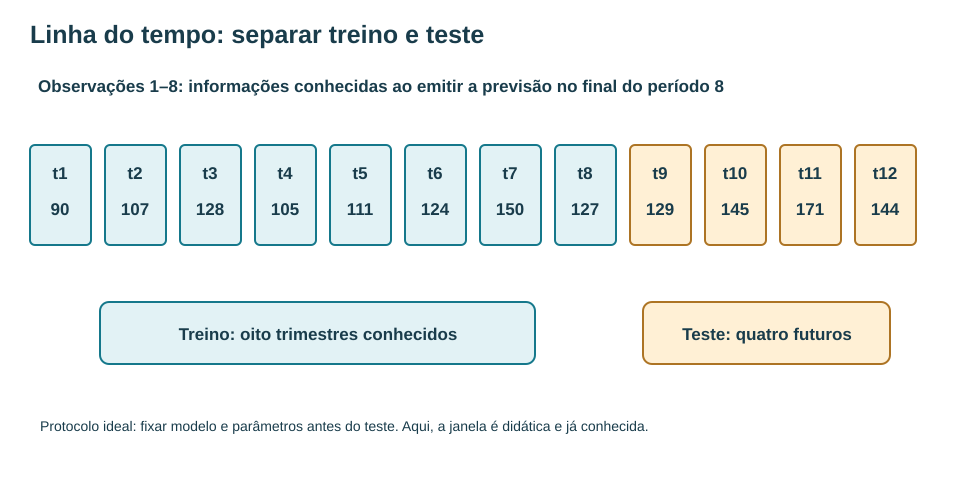
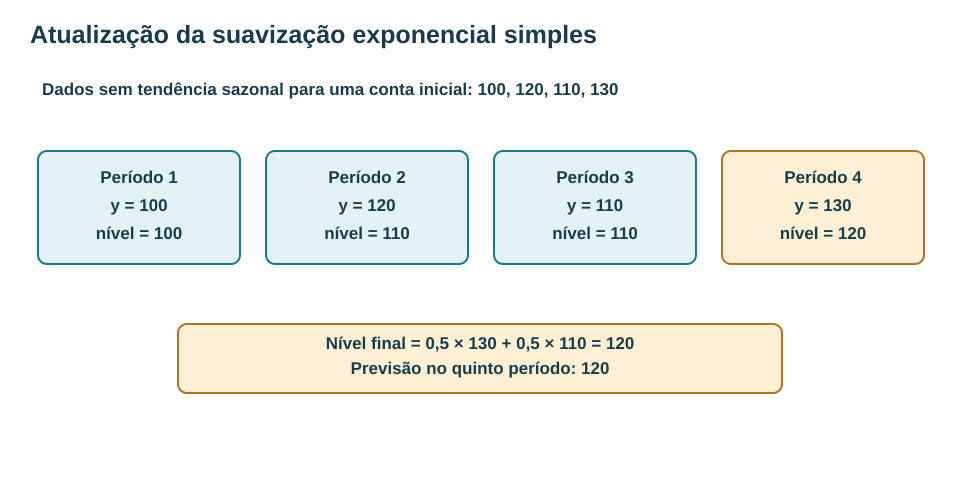
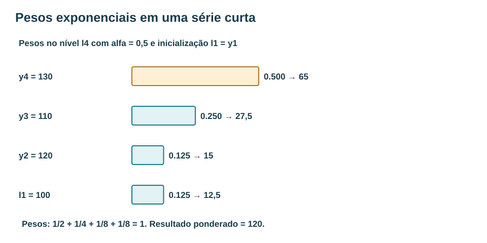
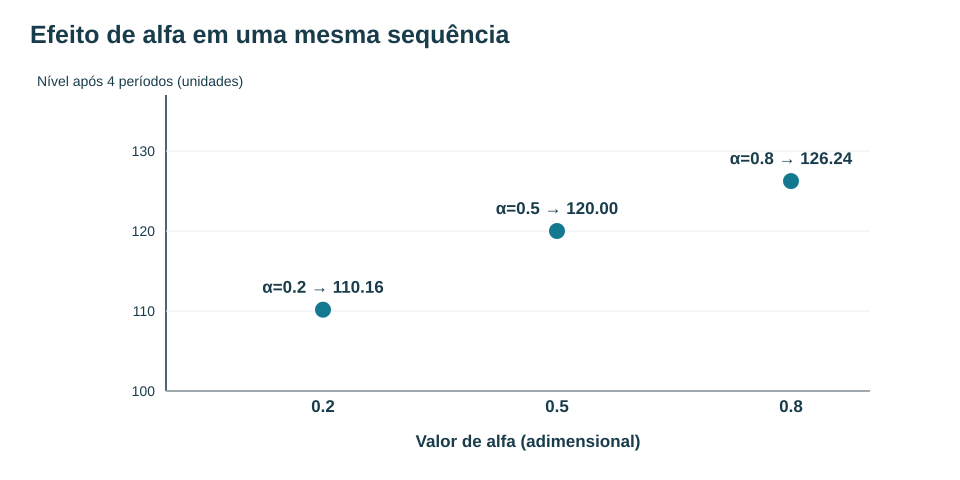
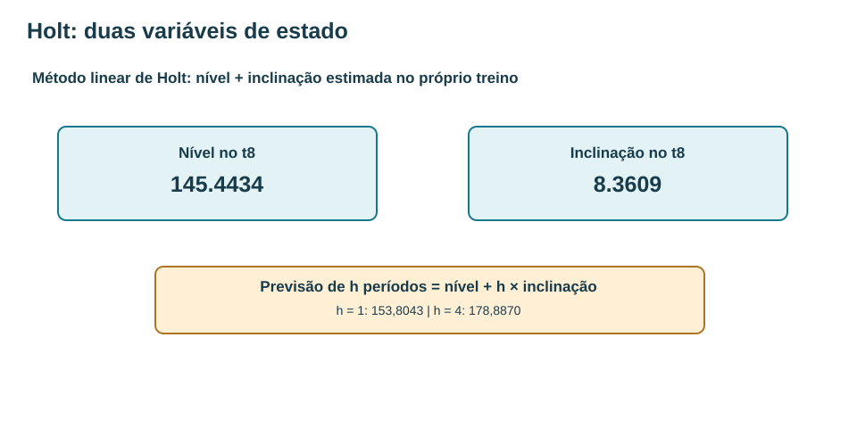
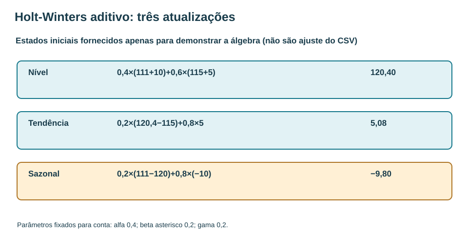
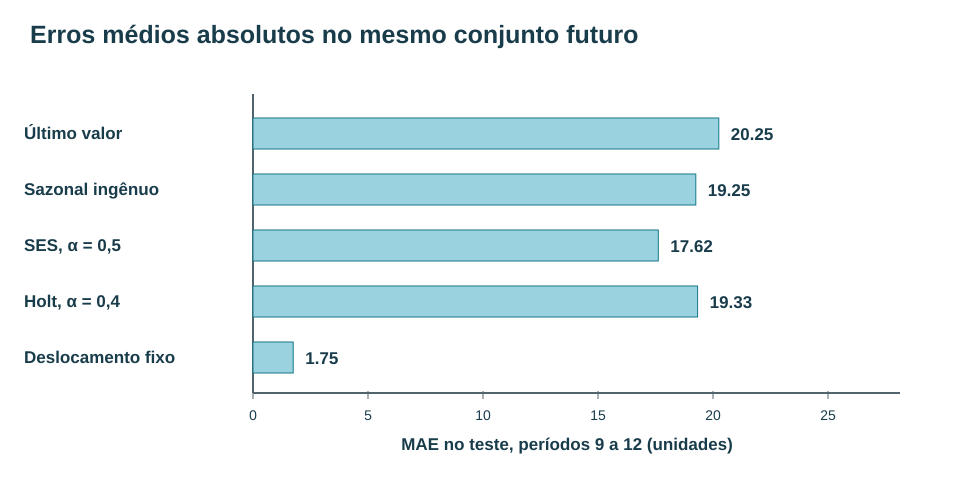

# MAT-EST-044 — Suavização exponencial e previsões sazonais iniciais: parâmetros, atualização e avaliação temporal

**Duração sugerida:** dividir em blocos de 25 a 50 minutos, continuar do ponto de interrupção. **Situação:** produção editorial, sem tentativa do estudante, sem certificado de domínio. **Classificação:** ponte universitária; os exercícios em estilo ENEM/FUVEST/UNICAMP/UNESP trabalham interpretação e cálculo, mas as recursões formais de Holt-Winters não são aqui atribuídas às matrizes desses exames.

## 1. Objetivo, pré-requisitos e motivação

**Objetivos:** explicar o peso exponencial de observações antigas; calcular SES em uma sequência curta; distinguir nível e previsão; interpretar alfa; derivar a abertura da recursão; reconhecer quando acrescentar tendência de Holt e sazonalidade de Holt-Winters; executar uma atualização aditiva com estados fornecidos; produzir e comparar previsões na mesma origem temporal; calcular MAE e RMSE; diagnosticar o risco de ajuste no teste.

**Pré-requisitos:** média ponderada, porcentagens e proporções; gráficos de linhas; MAT-EST-031/032 (treino, teste, MAE e RMSE); MAT-EST-041/042 (ordem cronológica e defasagens); MAT-EST-043 (tendência, sazonalidade e referências sazonais). Se o cálculo de `0,5 × 120 + 0,5 × 100` ainda exigir esforço, retome média ponderada antes das equações de tendência. Não é necessário conhecer programação.

**Contexto:** imaginar a procura de um serviço em trimestres. Usar só o último valor ignora parte do histórico. Usar a média de todos os valores dá o mesmo peso para períodos muito antigos. Suavização exponencial oferece uma alternativa: atualizar uma estimativa ao chegar cada dado, com maior peso para o que é recente. Trata-se de um algoritmo de previsão, e não de uma explicação causal da demanda.

## 2. Preservação dos dados e corte de informação

Mantivemos **sem modificar nenhum byte** os arquivos `dados-ficticios-referencia.csv` e `dados-ficticios-trimestrais.csv` de MAT-EST-043. O primeiro é uma referência histórica de oito dias, não usado para deduzir sazonalidade trimestral. O segundo é a série inventada de doze trimestres, construída artificialmente; seus componentes internos são conhecidos por construção e **não** foram estimados de uma instituição ou de pessoas reais.

Os observados trimestrais, em unidades fictícias, são **90, 107, 128, 105, 111, 124, 150, 127, 129, 145, 171 e 144**. Os períodos 1–8 são treino; 9–12 correspondem à janela de avaliação **já exibida em MAT-EST-043**, e são reutilizados somente para comparar contas no mesmo horizonte. Não representam novo teste prospectivo independente nesta sequência. Todos os métodos avaliados emitirão quatro previsões simultaneamente **no final de t8**, sem atualizar estados com informações t9, t10 e t11. A diferenciação evita confundir uma avaliação de quatro passos à frente com avaliações de um passo após o recebimento de novos dados.

**Figura 1.** Texto alternativo: Doze caixas ordenadas do período 1 ao 12; oito primeiras representam treino e as quatro finais teste, com observados 129, 145, 171 e 144. **Observe:** Os estados e parâmetros das fórmulas usam t1 a t8; a comparação usa os valores já conhecidos de t9 a t12. **Conclusão em áudio:** A origem de previsão é o final do oitavo trimestre, com horizonte de um a quatro períodos.

## 3. Intuição e definição da suavização exponencial simples

Considere primeiro **um exemplo didático independente**, sem sazonalidade: `100, 120, 110, 130`. A suavização exponencial simples, abreviada SES, atualiza um **nível** usando uma parte da observação recente e o complemento do nível anterior. Sua equação é:

\[\ell_t = \alpha y_t + (1-\alpha)\ell_{t-1}.\]

**Leitura da equação:** “nível no período t igual a alfa vezes a observação no período t, mais um menos alfa vezes o nível do período anterior”. O símbolo alfa é um número entre zero e um. Nesta aula, fixamos explicitamente o estado inicial em `l1 = y1 = 100` e escolhemos `alfa = 0,5` **antes das contas**. A primeira atualização acontece com y2.

- Em t2: nível `l2 = 0,5 × 120 + 0,5 × 100 = 110`.
- Em t3: `l3 = 0,5 × 110 + 0,5 × 110 = 110`.
- Em t4: `l4 = 0,5 × 130 + 0,5 × 110 = 120`.

**Figura 2.** Texto alternativo: Quatro caixas mostram y e o nível recursivo; a quarta atualização faz sessenta e cinco mais cinquenta e cinco, resultando em cento e vinte. **Observe:** Cada novo nível combina observação atual com o nível anterior, sem usar y futuro. **Conclusão em áudio:** Com alfa meio e nível inicial cem, a previsão emitida após a quarta observação é 120.

O nível não é a própria observação: no quarto período, o observado foi 130, mas o nível estimado é 120. **A previsão emitida depois do período quatro é 120**, quer se pergunte pelo período cinco ou pelo seis, se não houver nova atualização. Formalmente, `ŷ(t+h | t) = l(t)`, lido “previsão para t mais h, feita no tempo t, é o nível no tempo t”. Essa previsão **plana** mostra a limitação estrutural do SES puro quando existem tendência e sazonalidade. Veja [Forecasting: Principles and Practice, 8.1](https://otexts.com/fpp3/ses.html) e [Penn State STAT 510, lição 5](https://online.stat.psu.edu/stat510/Lesson05).

### 3.1 Por que os pesos diminuem exponencialmente?

Substituir um nível anterior pela sua própria equação revela o histórico dos pesos. Em t4, com alfa meio e inicialização em l1:

\[\ell_4=\tfrac12 y_4+\tfrac14 y_3+\tfrac18 y_2+\tfrac18\ell_1.\]

**Versão textual:** metade do quarto valor, um quarto do terceiro, um oitavo do segundo e um oitavo do nível inicial. Numericamente: `65 + 27,5 + 15 + 12,5 = 120`. Os pesos somam um. **Importante:** com poucos períodos, a contribuição do nível inicial ainda aparece; não a elimine apenas porque a fórmula infinita frequentemente omite esse termo por aproximação em séries longas.

A forma expandida geral após T atualizações desde um estado inicial l0 é uma soma dos observados com coeficientes `alfa × (1 − alfa)` elevado ao número de defasagens, **mais** `(1 − alfa)^T × l0`. A expressão é uma consequência da recursão, não um macete. Ela mostra por que observações antigas têm participação menor quando alfa está estritamente entre zero e um.

**Figura 3.** Texto alternativo: Barras: peso de y4 é 0,5; y3 é 0,25; y2 0,125; nível inicial y1 0,125. Contribuições 65, 27,5, 15 e 12,5. **Observe:** O valor atual recebe peso maior; em amostras finitas existe também o peso remanescente da condição inicial. **Conclusão em áudio:** A soma dos quatro coeficientes é um, e a previsão é 120 unidades.

### 3.2 O papel de alfa e dos estados iniciais

Alfa pequeno preserva mais do nível anterior; alfa grande reage mais à última observação. Com a sequência independente 100,120,110,130 e sempre l1=100, obtemos:

| Alfa | Níveis de t1 até t4 | Previsão emitida depois de t4 |
|---:|---|---:|
| 0,2 | 100; 104; 105,2; 110,16 | 110,16 |
| 0,5 | 100; 110; 110; 120 | 120 |
| 0,8 | 100; 116; 111,2; 126,24 | 126,24 |

Neste exemplo, alfa maior aproximou mais o resultado de y4=130. Isso **não** diz que alfa alto é sempre superior. No limite alfa zero, o nível fica congelado no início; com alfa um, o SES se torna a previsão ingênua de último valor. Escolher alfa e a inicialização faz parte do ajuste, que deve usar apenas dados permitidos. A escolha por erro mínimo no treino é possível, mas pode ser instável em séries curtas: valide cronologicamente e não escolha depois de inspecionar o teste.

**Figura 4.** Texto alternativo: Eixo horizontal alfa 0,2, 0,5 e 0,8, sem unidade; eixo vertical nível final em unidades. Três pontos sobem de 110,16 para 126,24. **Observe:** No exemplo, alfa maior responde mais ao último valor 130; em outros dados o sentido da variação final pode diferir. **Conclusão em áudio:** Alfa controla sensibilidade à observação mais recente; seu valor deve ser escolhido com critério de treino e validação, nunca pelo teste final.

## 4. Aplicação do SES ao treino trimestral existente

Voltamos agora à base de MAT-EST-043, mantendo alfa 0,5 somente como parâmetro didático, e l1=90. Os níveis sucessivos no treino, sem ler teste, são:

| t | Observado y | Nível SES após ver y |
|---:|---:|---:|
| 1 | 90 | 90.00000000 |
| 2 | 107 | 98.50000000 |
| 3 | 128 | 113.25000000 |
| 4 | 105 | 109.12500000 |
| 5 | 111 | 110.06250000 |
| 6 | 124 | 117.03125000 |
| 7 | 150 | 133.51562500 |
| 8 | 127 | 130.25781250 |

O nível no fim de t8 é **130.25781250 unidades**; a previsão emitida nesse corte para t9, t10, t11 e t12 é a mesma: aproximadamente **130,2578** em cada período. A sazonalidade visível na base artificial faz essa opção conceitualmente limitada, mas queremos enxergar essa limitação comparando os erros de forma auditável, e não descartá-la sem cálculo.

## 5. Método de Holt: acrescentar tendência à atualização

Quando há mudança de nível persistente, Holt estima **dois estados**: nível `l(t)` e inclinação `b(t)` por período. A convenção de [Forecasting: Principles and Practice, 8.2](https://otexts.com/fpp3/holt.html) usa os parâmetros alfa e beta asterisco:

\[\ell_t=\alpha y_t +(1-\alpha)(\ell_{t-1}+b_{t-1}),\]
\[b_t=\beta^*(\ell_t-\ell_{t-1})+(1-\beta^*)b_{t-1},\]
\[\hat y_{t+h|t}=\ell_t+h b_t.\]

**Leitura:** o novo nível pondera observação atual e projeção que era esperada pelo estado anterior; a nova tendência pondera a variação mais recente de nível e a tendência anterior; a previsão a h períodos soma h vezes essa tendência ao nível atual.

Para mostrar toda a conta **sem usar teste**, fixamos alfa 0,4; beta asterisco 0,2; inicialização em `l2=y2=107` e `b2=y2−y1=17`. A primeira atualização calculada ocorre em t3 com y3=128:

- Projeção disponível antes de t3: `107 + 17 = 124`.
- Novo nível: `l3 = 0,4×128 + 0,6×124 = 125,6`.
- Nova tendência: `b3 = 0,2×(125,6−107) + 0,8×17 = 17,32`.

Repetindo até t8, obtemos `l8 ≈ 145.443423` e `b8 ≈ 8.360892`; logo as previsões t9 a t12 são aproximadamente **153.804; 162.165; 170.526; 178.887**. São quatro previsões com a **mesma origem t8**. A tendência é captada, mas a versão de Holt mostrada aqui não dispõe de estado sazonal: diante de oscilações entre trimestres, isso importa.

**Figura 5.** Texto alternativo: Duas caixas com nível cento e quarenta e cinco vírgula quatro e inclinação oito vírgula trinta e seis; fórmula soma h vezes a inclinação. **Observe:** Neste exemplo a sazonalidade é ignorada por Holt, apesar de estar presente nos dados construídos. **Conclusão em áudio:** A previsão de Holt cresce linearmente no horizonte; não garante que cada trimestre sazonal seja representado.

## 6. Holt-Winters: acrescentar o componente sazonal

Em dados com padrão repetido ao longo do ano, a extensão de Holt-Winters adiciona o estado sazonal `s(t)`. Na versão **aditiva**, o efeito sazonal entra em unidades absolutas; na **multiplicativa**, ele age de modo proporcional ao nível, e requer cuidados adicionais em séries com zero ou valores negativos. A estrutura deve ser escolhida pela natureza da variação e avaliada em dados futuros, não pela preferência pelo nome do modelo.

Na convenção aditiva de [Forecasting: Principles and Practice, 8.3](https://otexts.com/fpp3/holt-winters.html), com m=4 trimestres:

\[\ell_t=\alpha(y_t-s_{t-4})+(1-\alpha)(\ell_{t-1}+b_{t-1}),\]
\[b_t=\beta^*(\ell_t-\ell_{t-1})+(1-\beta^*)b_{t-1},\]
\[s_t=\gamma(y_t-\ell_{t-1}-b_{t-1})+(1-\gamma)s_{t-4}.\]

**Leitura da terceira equação:** índice sazonal novo igual a gama vezes a observação menos a projeção de nível e tendência anterior, mais um menos gama vezes o índice da mesma fase quatro trimestres antes. Esclarecemos a convenção porque algumas referências usam outro parâmetro gama asterisco e atualizam o sazonal depois de calcular o novo nível; as formas exigem uma relação entre parâmetros e **não podem ser misturadas sem ajuste**.

### 6.1 Cálculo totalmente identificado como estado hipotético

Para exercitar a álgebra, suponha que foram **fornecidos pelo enunciado**, e **não estimados do CSV**, os estados no final de t4: `l4=115`, `b4=5` e `s1=−10`. Chega y5=111. Adote alfa 0,4; beta asterisco 0,2; gama 0,2. Pela convenção anterior:

- Novo nível: `l5=0,4×[111−(−10)]+0,6×(115+5)=0,4×121+0,6×120=120,4`.
- Nova inclinação: `b5=0,2×(120,4−115)+0,8×5=5,08`.
- Novo índice sazonal: `s5=0,2×(111−115−5)+0,8×(−10)=−9,8`.

O resultado confirma uma **operação condicional**, não um ajuste completo Holt-Winters e nem um erro de teste. Para ajustar um modelo real, é preciso escolher como inicializar os estados sazonais, nível e tendência no treino; definir ou estimar parâmetros de suavização; garantir histórico suficiente para os ciclos; e seguir o protocolo de validação temporal.

**Figura 6.** Texto alternativo: Três linhas numeradas mostram fórmulas com α=0,4, β*=0,2, γ=0,2 e resultados 120,40; 5,08; menos 9,80. **Observe:** Os estados anteriores são dados do enunciado; não se deve alegar que foram estimados pelo algoritmo a partir do CSV. **Conclusão em áudio:** A suavização sazonal atualiza um efeito da mesma fase do ciclo, com período m igual a quatro.

### 6.2 Previsão sazonal de um estado conhecido

Para uma conta independente, imagine que no fim de t8 outro enunciado forneça **estados hipotéticos** `l8=137`, `b8=5` e os últimos índices da mesma fase do ciclo `s5=−10`, `s6=0`, `s7=20`, `s8=−10`. Uma previsão aditiva no próximo ciclo é “nível atual mais h vezes a inclinação mais o índice sazonal correspondente”. Assim t9 a t12 seriam **132; 147; 172; 147**. Não compare essas previsões com os modelos efetivamente calculados do treino como se o algoritmo tivesse descoberto os estados; eles foram fornecidos à mão somente para demonstrar a fórmula.

## 7. Comparação temporal na mesma origem: cinco referências

Para uma comparação didática sobre os mesmos quatro trimestres — já revelados na aula anterior — usamos cinco procedimentos: último valor global do treino; sazonal ingênuo; deslocamento histórico de 20,5 estimado no próprio treino em MAT-EST-043; SES com alfa 0,5 e l1=90; e Holt com alfa 0,4, beta asterisco 0,2, l2=107 e b2=17. São escolhas **didáticas declaradas**, não hiperparâmetros estimados nem uma seleção independente: o conjunto de avaliação já tinha sido publicado no MAT-EST-043. As métricas seguintes referem-se exclusivamente ao teste fictício t9 a t12, cujos observados são 129;145;171;144.

**MAE**, erro absoluto médio, é a média de `|observado−previsto|`, em unidades originais. **RMSE**, raiz do erro quadrático médio, eleva os erros ao quadrado, calcula sua média e tira a raiz; por isso responde fortemente a grandes discrepâncias. Todas as projeções foram computadas como se emitidas no corte oito, sem incorporar na recursão os observados de t9 a t12. Contudo, por já terem aparecido em MAT-EST-043, não se trata de aferição prospectiva independente.

| Procedimento fixado | Previsões t9 a t12 | MAE (unidades) | RMSE (unidades) |
|---|---|---:|---:|
| Último valor global | 127; 127; 127; 127 | 20.2500 | 25.2636 |
| Sazonal ingênuo, m=4 | 111; 124; 150; 127 | 19.2500 | 19.3326 |
| Deslocamento sazonal histórico fixo | 131.5; 144.5; 170.5; 147.5 | 1.7500 | 2.1794 |
| SES, alfa=0,5 | 130.2578; 130.2578; 130.2578; 130.2578 | 17.6211 | 22.7359 |
| Holt, alfa=0,4 e beta*=0,2 | 153.8043; 162.1652; 170.5261; 178.887 | 19.3326 | 23.0609 |

Exemplo do SES: erros absolutos de aproximadamente **1,2578; 14,7422; 40,7422; 13,7422**. Somados e divididos por quatro, dão **MAE≈17,6211**. Seu **RMSE≈22,7359** é maior porque o terceiro trimestre concentra discrepância elevada. O deslocamento sazonal histórico, que já tínhamos definido no treino, reproduz melhor a construção artificial com incremento anual: MAE=1,75 neste exemplo; isso não é uma afirmação de superioridade universal, pois temos somente **dois ciclos de treino e um de teste**, intencionalmente construídos. O Holt mostrado pode ultrapassar certos valores observados por extrapolar tendência sem distinguir cada fase sazonal.

**Figura 7.** Texto alternativo: Gráfico em barras horizontais: cinco MAEs sobre os mesmos quatro observados 129,145,171,144; eixos identificados e unidades. **Observe:** A referência com deslocamento capturou a tendência criada, mas o teste é artificial e tem apenas quatro observações. **Conclusão em áudio:** Nesta comparação didática, alfa e beta foram fixados para as contas; a janela já era conhecida da aula anterior e não equivale a teste prospectivo novo.

**Cuidados práticos:** se a meta é escolher alfa, beta ou a estrutura sazonal, use treino e blocos temporais de validação anteriores ao teste final; não reaproveite os quatro observados para selecionar o menor erro e depois anunciar esse mesmo erro como avaliação independente. Não trate médias de erros como intervalos de previsão. Modelos de espaço de estados permitem desenvolver incerteza preditiva, mas isso requer hipóteses, estimação e calibração adicionais que não executamos nesta aula. O desempenho por horizonte e por fase sazonal também precisa ser acompanhado quando houver dados futuros suficientes.

## 8. Armadilhas, aplicações e conexões interdisciplinares

**Erros comuns:** confundir valor suavizado de t com previsão disponível antes de t; considerar SES uma modelagem completa de sazonalidade; aplicar índice trimestral a série mensal; tomar índice aditivo como porcentagem; omitir a condição inicial ao expandir poucos passos; chamar uma média móvel simples de modelo de médias móveis probabilístico ou de SES; combinar fórmulas diferentes de atualização sazonal sem converter parâmetros; ajustar alfa no teste; misturar previsão de quatro passos na origem oito com atualização posterior no teste; e concluir que quatro observações construídas certificam precisão futura.

**Aplicações:** gestão de estoques pode demandar previsões com calendário; energia e ambiente apresentam padrões recorrentes; História e Geografia exigem distinguir tendência longa de oscilações; em Língua Portuguesa e Redação, relatórios confiáveis precisam nomear unidades, horizonte e limites. Nada aqui estabelece que séries fictícias sejam registros reais de pessoas, escolas ou serviços.

## 9. Vídeo complementar, fontes e áudio

**Título:** *Mod-02 Lec-02 Forecasting — Time series models — Simple Exponential smoothing*. **Canal:** NPTEL, curso de Operations and Supply Chain Management do professor G. Srinivasan, IIT Madras. **Link:** https://www.youtube.com/watch?v=k9dhcfIyOFc . **Duração:** não confirmada. **Quando assistir:** depois de compreender as seções 3 e 4, para reforçar o mecanismo de SES antes de Holt. **Por quê:** aula universitária dedicada à forma simples do método. A publicação e a descrição foram identificadas no YouTube; a reprodução integral e o teste de áudio no Microsoft Edge **não** foram realizados. Todo conteúdo necessário para responder aos exercícios está nesta aula.

**Fontes conceituais:** [Forecasting: Principles and Practice, 8.1 SES](https://otexts.com/fpp3/ses.html), [8.2 Holt](https://otexts.com/fpp3/holt.html), [8.3 Holt-Winters](https://otexts.com/fpp3/holt-winters.html) e [Penn State STAT 510, Lição 5](https://online.stat.psu.edu/stat510/Lesson05). Fórmulas e convenções foram identificadas para evitar misturar parametrizações. Exemplo, CSV, diagramas e todas as questões são **autorais**.

## 10. Exercícios graduais — primeiro responder, depois revelar a correção

Não se registra nota nem domínio com a leitura. Resolver cada questão, expor o raciocínio, conferir a resolução e classificar o motivo **real** de erro como conteúdo, interpretação, cálculo, distração, memória, montagem da estratégia ou tempo. Os rótulos sugeridos no arquivo de gabarito servem apenas como hipótese para investigação, não diagnóstico individual automático. O site deverá carregar o gabarito separado após tentativa efetiva. Questões de transferência são **no estilo** interpretativo de exames, nunca questões oficiais.

### Aprendizagem — 10 questões

**MAT-EST-044-EX-APR-01 — Objetivo da suavização.** O que representa o nível l(t) na suavização exponencial simples?

**MAT-EST-044-EX-APR-02 — Parâmetro alfa.** Se alfa vale 0,30, que peso da atualização simples recai sobre o nível anterior?

**MAT-EST-044-EX-APR-03 — Inicialização explicitada.** Para o exemplo didático y=[100,120,110,130], foi escolhido l1=y1. Quanto vale l1?

**MAT-EST-044-EX-APR-04 — Primeira atualização.** Com alfa=0,5, l1=100 e y2=120, calcule l2.

**MAT-EST-044-EX-APR-05 — Segunda atualização.** Com alfa=0,5, l2=110 e y3=110, quanto vale l3?

**MAT-EST-044-EX-APR-06 — Terceira atualização.** Com alfa=0,5, l3=110 e y4=130, calcule l4.

**MAT-EST-044-EX-APR-07 — Previsão em vários horizontes.** No SES com nível final 120, quais as previsões emitidas para períodos 5 e 6, sem incorporar nova observação?

**MAT-EST-044-EX-APR-08 — Extremo alfa zero.** Se alfa=0 e o nível inicial vale 100, como evolui o SES independentemente de observações posteriores?

**MAT-EST-044-EX-APR-09 — Extremo alfa um.** Se alfa=1 e o último valor observado é 130, qual previsão SES do próximo período?

**MAT-EST-044-EX-APR-10 — Sazonalidade trimestral.** Uma série tem observações por trimestre e repetição anual. Qual o valor candidato de m para Holt-Winters?

### Consolidação — 10 questões

**MAT-EST-044-EX-CON-01 — Peso finito do primeiro estado.** Abra a recursão de quatro observações com alfa=0,5 e l1=y1. Quais pesos multiplicam y4,y3,y2 e l1?

**MAT-EST-044-EX-CON-02 — Soma ponderada.** Usando pesos 0,5;0,25;0,125;0,125 sobre 130,110,120,100, encontre a previsão.

**MAT-EST-044-EX-CON-03 — Alfa baixo.** Para a sequência 100,120,110,130, l1=100 e alfa=0,2, encontre o nível final.

**MAT-EST-044-EX-CON-04 — Alfa alto.** Na mesma sequência e inicialização, com alfa=0,8, encontre l4.

**MAT-EST-044-EX-CON-05 — SES trimestral no corte oito.** Com alfa=0,5 e l1=90, quais níveis de t2 e t3 da série trimestral 90,107,128?

**MAT-EST-044-EX-CON-06 — SES trimestral no final.** A partir do histórico do exercício anterior, complete a recursão até t8 e indique l8.

**MAT-EST-044-EX-CON-07 — Atualização de Holt.** Em t2 o estado é nível 107 e tendência 17. Com y3=128, alfa=0,4 e beta asterisco=0,2, calcule l3 e b3.

**MAT-EST-044-EX-CON-08 — Previsão de Holt.** No corte t8, l8≈145,44342342 e b8≈8,36089229. Encontre a previsão de t9.

**MAT-EST-044-EX-CON-09 — Atualização sazonal exemplar.** No exemplo hipotético do Holt-Winters aditivo, y5=111, s1=−10, l4=115, b4=5, alfa=0,4. Determine l5.

**MAT-EST-044-EX-CON-10 — Holt-Winters três estados.** Dado o l5=120,4 anterior, beta asterisco=0,2 e gama=0,2, obtenha b5 e s5 pela convenção do livro FPP3.

### Transferência e estilo vestibular — 10 questões

**MAT-EST-044-EX-VES-01 — Escolha de estrutura.** Uma série mensal aumenta ao longo dos anos e tem picos recorrentes em dezembro. Por que SES puro é estruturalmente limitado?

**MAT-EST-044-EX-VES-02 — Não escolher pelo teste.** Um analista examina t9 a t12, testa 50 alfas e apresenta o menor MAE no mesmo conjunto como teste final. Qual falha houve?

**MAT-EST-044-EX-VES-03 — Horizonte coerente.** No fim de t8 alguém prevê t9 a t12 e calcula o erro de t12 depois de atualizar os estados com y9, y10 e y11. Qual o problema de comparação?

**MAT-EST-044-EX-VES-04 — Comparação de SES e sazonal ingênuo.** No teste y=[129,145,171,144], SES prevê 130,2578125 em todos os trimestres, e sazonal ingênuo prevê [111,124,150,127]. Calcule o MAE de ambos.

**MAT-EST-044-EX-VES-05 — RMSE sensível ao extremo.** No mesmo teste, o SES com previsões planas gera um erro absoluto grande em t11. Por que seu RMSE pode ultrapassar seu MAE?

**MAT-EST-044-EX-VES-06 — Holt sem sazonalidade.** No teste trimestral, o Holt do exemplo prevê aproximadamente 153,804;162,165;170,526;178,887. Por que o pico de t11 não basta para validar o método?

**MAT-EST-044-EX-VES-07 — Previsão com estado hipotético.** Um modelo sazonal aditivo recebe para o corte 8 os estados HIPOTÉTICOS l8=137, b8=5, s5..s8=[−10,0,20,−10]. Calcule previsões para t9 a t12.

**MAT-EST-044-EX-VES-08 — Aditivo ou multiplicativo.** Em dados positivos, a oscilação sazonal acompanha aproximadamente 10% do nível, em vez de 10 unidades fixas. Qual estrutura sazonal seria uma candidata e por quê?

**MAT-EST-044-EX-VES-09 — Valor mensal versus trimestral.** Uma série é coletada uma vez por mês, com padrão anual. Que m usar e por que não quatro?

**MAT-EST-044-EX-VES-10 — Relatório transparente.** Com apenas dois ciclos no treino e quatro trimestres artificiais no teste, quais limitações devem acompanhar um MAE favorável?

### Reteste independente — 6 questões, somente após correção

**MAT-EST-044-EX-RET-01 — Reteste SES alternativo.** Nova sequência [40,60,50], nível inicial 40 e alfa=0,25. Calcule nível final e previsão seguinte.

**MAT-EST-044-EX-RET-02 — Reteste peso passado.** Se alfa=0,4, qual coeficiente de y(t−1) na abertura da atualização l(t) com pelo menos três observações?

**MAT-EST-044-EX-RET-03 — Reteste previsão Holt.** Num estado novo, lT=80 e bT=3. Encontre previsões de um e três períodos no método de Holt.

**MAT-EST-044-EX-RET-04 — Reteste previsão sazonal.** Num estado aditivo hipotético l8=200, b8=2 e índices [−6,0,10,−4] para os trimestres, calcule t9.

**MAT-EST-044-EX-RET-05 — Reteste avaliação.** Para observados [10,20] e previsões [12,14], encontre MAE e RMSE.

**MAT-EST-044-EX-RET-06 — Reteste controle temporal.** Um processo seleciona alfa usando t5 a t8. Emite previsões t9 a t12, sem reestimar com esses valores. Isso preserva o teste?

## 11. Correção comentada, resumo e revisão

As 36 respostas esperadas, demonstrações passo a passo e hipóteses iniciais de causa de erro estão em `gabarito-comentado.json`. Este documento mantém **os enunciados separados do gabarito** para publicação no site com revelação após tentativa. Não apresentar uma marca de consolidação por conteúdo apenas publicado.

**Resumo para leitura em voz alta:** SES atualiza apenas nível, e alfa define a resposta às observações recentes. Holt atualiza nível e tendência. Holt-Winters acrescenta os efeitos de cada fase sazonal. Toda previsão precisa ter data de emissão e horizonte claros. A comparação justa mantém o mesmo conjunto de teste e evita escolher parâmetros com os dados futuros. MAE é a média dos módulos dos erros; RMSE amplia a influência de erros grandes. Inicialização e escolha de parametrização fazem parte do procedimento e precisam constar da documentação.

**Revisão espaçada:** depois de uma tentativa verdadeira, agendar revisões para um dia, sete dias e trinta dias; se houver falha, recuperar o pré-requisito antes de insistir no mesmo bloco. A situação do tópico só muda para “consolidado” depois de explicação autônoma e aplicação a números não memorizados. O reteste independente fica disponível após a correção, sem ser marcado como realizado antecipadamente.

**Próximo passo editorial:** MAT-EST-045 — Modelos de suavização sazonal em prática: inicialização, ajuste e comparação com referências temporais. A decisão pedagógica de avançar individualmente depende de evidência de aprendizagem, ainda não registrada.
