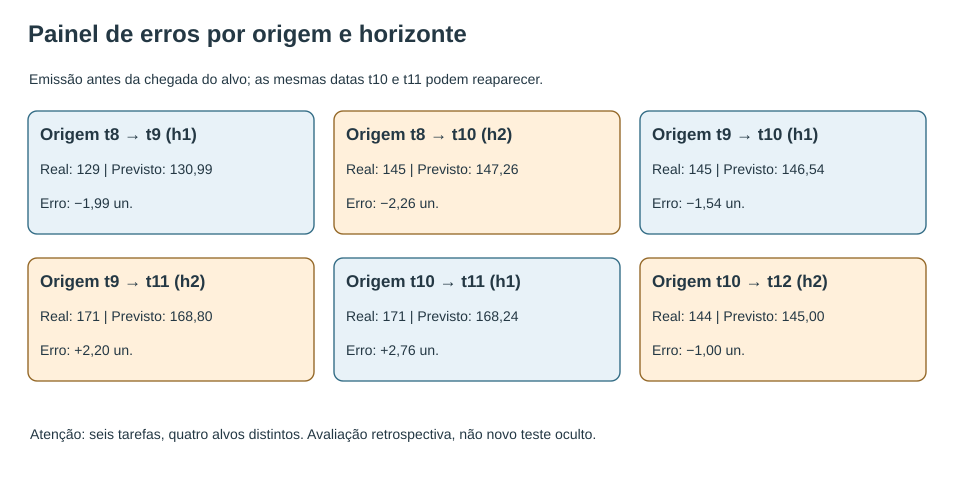
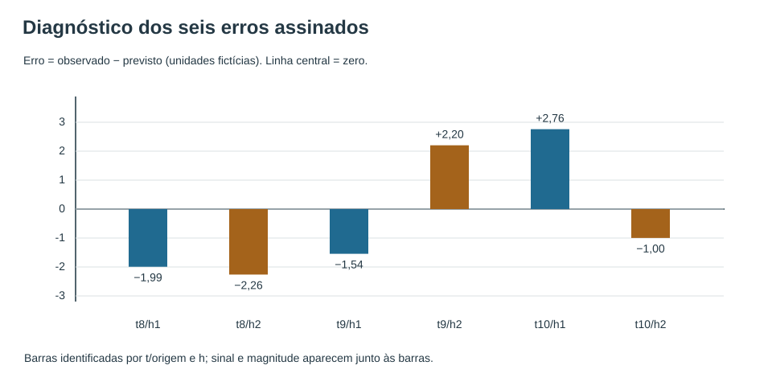
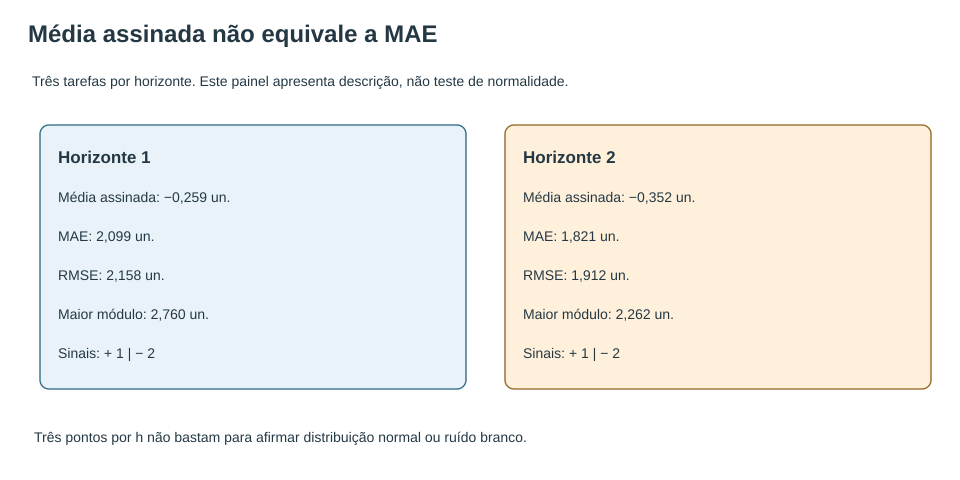
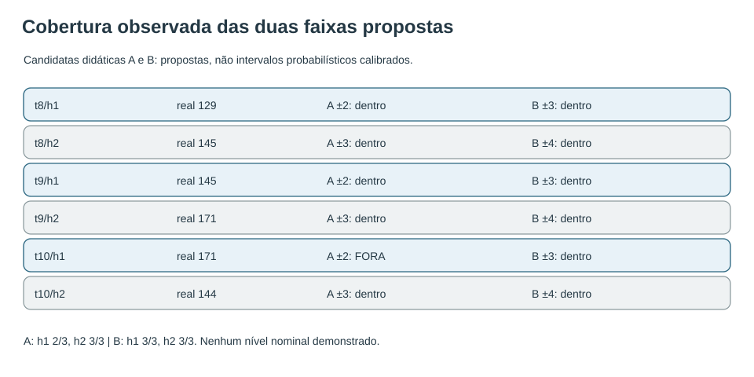
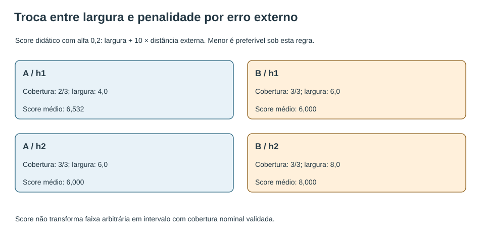
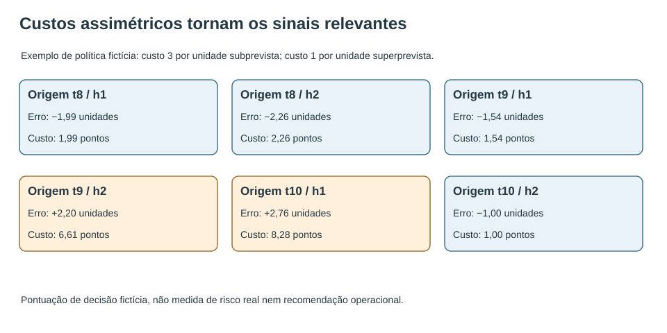
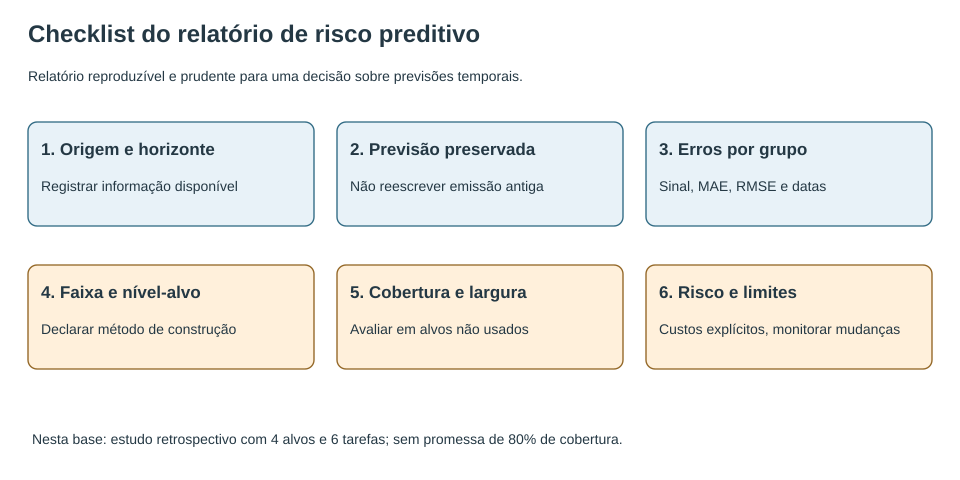

# MAT-EST-047 — Diagnóstico e calibração de previsões temporais: resíduos por horizonte, intervalos avaliáveis e comunicação de risco

**Área:** Matemática. **Unidade:** Estatística — ponte universitária em séries temporais. **Código:** MAT-EST-047. **Anterior:** MAT-EST-046. **Próximo:** MAT-EST-048. **Origem:** aula e exercícios autorais; questões oficiais: zero. **Progresso individual:** não iniciado; produzir material não constitui estudo ou aprovação.

**Organização sugerida:** bloco A, diagnóstico dos erros (25 a 50 minutos); bloco B, interpretação e avaliação de intervalos (25 a 50 minutos); bloco C, comunicação de risco e atividades graduais (25 a 50 minutos). O cronômetro organiza a aula; quem determina a progressão é a compreensão demonstrada, sem matéria fixa por dia.

## 1. Objetivos, pré-requisitos e perguntas orientadoras

Ao terminar o estudo e corrigir sua tentativa, o estudante deverá conseguir: (1) explicar diferença entre erro de previsão fora do ajuste e resíduo de ajuste; (2) separar tarefas por origem e horizonte; (3) calcular média assinada, MAE e RMSE; (4) detectar possíveis sinais de viés, sem exagerar a evidência de três erros; (5) calcular limites, largura, cobertura observada e escore intervalar; (6) explicar a distinção entre intervalo proposto e calibrado; (7) verificar sobreposição dos alvos; (8) redigir um relatório de incerteza e custo sem transformar um diagnóstico fictício em garantia real.

**Pré-requisitos:** subtração com números negativos; média, módulo, quadrado, raiz e porcentagem; MAT-EST-031 e 032, para divisão temporal e métricas; MAT-EST-039 e 041, para dependência; MAT-EST-042, para resíduo e autocorrelação; MAT-EST-043–046, para sazonalidade, Holt-Winters e origens múltiplas. Se uma conta bloquear a compreensão, resolver primeiro um exercício menor de operações e só então avançar.

**Relevância para exames:** leitura de tabelas, gráficos, índices, porcentagens e afirmações sustentadas por dados é transferível a questões do ENEM e dos vestibulares. Cálculos detalhados de Holt-Winters e pontuação de intervalos pertencem à ponte de aprofundamento universitário; não são apresentados como exigência de uma banca sem documento oficial que o comprove. Todas as atividades desta aula são autorais, inclusive as chamadas de estilo vestibular.

## 2. Contexto: uma previsão que parece precisa, mas ainda exige diagnóstico

O modelo de MAT-EST-046 foi aplicado a uma série fictícia de doze trimestres. Em três datas de emissão — encerramentos dos períodos oito, nove e dez — foram calculadas previsões para um e dois períodos à frente. O procedimento de Holt-Winters aditivo conservou parâmetros e inicialização já definidos: alfa igual a 0,3, beta-asterisco igual a 0,2, gama igual a 0,2, ciclo sazonal de quatro trimestres. Cada previsão usou somente observações disponíveis até sua origem.

A base tem os valores observados, em unidades fictícias: `90, 107, 128, 105, 111, 124, 150, 127, 129, 145, 171, 144`. Os arquivos CSV desta aula são cópias byte a byte dos anteriores, com conferência por hash SHA-256. São números inventados para raciocínio matemático, e não dados de pessoa ou instituição.

Como os alvos dos períodos nove a doze já foram publicados em aulas precedentes, esta é uma **auditoria retrospectiva educativa**. Não vamos alegar novo teste prospectivo, intervalo validado para a população ou probabilidade de sucesso operacional. A pergunta apropriada é: *que contas e ressalvas são indispensáveis para avaliar previsões e aprender a montar uma avaliação mais séria no futuro?*

## 3. Diferentes resíduos: cuidado com as palavras

Escrevemos um erro de previsão com a origem explícita:

\[e_{o,h} = y_{o+h} - \widehat y_{o+h\mid o}.\]

Leitura: erro da previsão feita no período ó para agá períodos à frente é valor observado no alvo menos o valor que foi previsto naquela origem. Sinal positivo indica que o observado superou a previsão, ou **subprevisão**; negativo indica que o modelo previu acima do ocorrido, ou **superprevisão**.

Aqui, vamos chamar os seis valores de **erros de previsão retrospectivamente avaliados**, separados por horizonte. O termo *resíduo de inovação* costuma designar erro de um passo calculado a partir de uma estrutura de série em seu próprio procedimento de ajuste. Os resíduos de ajuste de um modelo cujos parâmetros foram estimados com dados posteriores não devem ser automaticamente apresentados como previsões externas genuínas. A obra *Forecasting: Principles and Practice*, seções 5.4 e 5.8, explicita essas distinções. [Diagnóstico de resíduos](https://otexts.com/fpp3/diagnostics.html) e [avaliação de previsão](https://otexts.com/fpp3/accuracy.html).

**Figura 1.** Texto alternativo: H1 e H2 são calculados em t8, t9 e t10, e os alvos t10 e t11 reaparecem em origens distintas. **Observe:** Observe os sinais dos erros, o horizonte e a repetição das datas de alvo. **Conclusão pronunciável:** Há seis tarefas preditivas, não seis observações independentes; reportar o horizonte evita misturar condições de informação.

## 4. Exemplo resolvido: seis erros e sua dependência

| Origem / horizonte | Alvo | Observado (un.) | Previsão (un.) | Erro observado menos previsto (un.) |
|---|---:|---:|---:|---:|
| t8 / h1 | t9 | 129 | 130,992532 | −1,992532 |
| t8 / h2 | t10 | 145 | 147,261924 | −2,261924 |
| t9 / h1 | t10 | 145 | 146,544613 | −1,544613 |
| t9 / h2 | t11 | 171 | 168,796374 | +2,203626 |
| t10 / h1 | t11 | 171 | 168,240313 | +2,759687 |
| t10 / h2 | t12 | 144 | 144,996946 | −0,996946 |

**Síntese por áudio:** na origem oito, os dois erros são negativos; na origem nove, um é negativo e outro positivo; na origem dez, um é positivo e outro negativo. Quatro tarefas ficaram acima do observado e duas abaixo. A tabela apresenta seis previsões feitas em diferentes momentos, mas somente quatro valores-alvo distintos: t9, t10, t11 e t12. Os alvos t10 e t11 aparecem duas vezes, em horizontes diferentes. Essa sobreposição impede tratar os seis erros como seis observações estatisticamente independentes.

**Primeiro cálculo.** Na origem t8, a previsão h1 para t9 foi 130,99253184. O observado foi 129. O erro é 129 menos 130,99253184, isto é, menos 1,99253184 unidade. O sinal negativo revela superprevisão; sua magnitude absoluta é 1,99253184. Para o erro quadrático, elevamos 1,99253184 ao quadrado, preservando a unidade ao quadrado antes de aplicar a raiz da média no RMSE.

**Figura 2.** Texto alternativo: Quatro erros negativos e dois positivos; a maior magnitude positiva está em t10/h1, cerca de mais 2,76. **Observe:** Compare os sinais sem cancelar magnitudes. Verifique quais valores pertencem a h1 e h2. **Conclusão pronunciável:** A média assinada perto de zero pode coexistir com erros absolutos próximos de duas unidades.

## 5. Viés, magnitude e padrão temporal não são sinônimos

**Bloco A — 25 a 50 minutos.** Para cada horizonte, calcule primeiro a média assinada, depois o MAE e o RMSE:

\[\overline e_h = \frac{1}{n_h}\sum_i e_{i,h},\qquad \operatorname{MAE}_h = \frac{1}{n_h}\sum_i |e_{i,h}|,\qquad \operatorname{RMSE}_h = \sqrt{\frac{1}{n_h}\sum_i e_{i,h}^2}.\]

Leitura: a média assinada soma os erros com seus sinais; o MAE soma o módulo de cada erro e divide pelo número de tarefas; o RMSE é a raiz quadrada da média dos quadrados. O primeiro informa a direção média, o segundo informa tamanho médio, e o terceiro dá maior peso a magnitudes grandes. O valor de n agá aqui é três em cada horizonte.

| Diagnóstico | Horizonte 1 | Horizonte 2 |
|---|---:|---:|
| Média assinada (unidades) | −0,259153 | −0,351748 |
| MAE (unidades) | 2,098944 | 1,820832 |
| RMSE (unidades) | 2,158077 | 1,911908 |
| Maior erro absoluto (unidades) | 2,759687 | 2,261924 |
| Erros positivos / negativos | 1 / 2 | 1 / 2 |

**Síntese por áudio:** as médias assinadas são negativas e pequenas em módulo quando comparadas aos erros absolutos, porque os sinais se compensam. Os MAEs ficam próximos de duas unidades: aproximadamente 2,099 no horizonte um e 1,821 no horizonte dois. Como só temos três previsões por horizonte, isso não permite concluir que um horizonte maior seja usualmente mais fácil, nem que o viés verdadeiro seja negativo.

**Figura 3.** Texto alternativo: Ambos os horizontes possuem média assinada negativa pequena, mas MAE perto de duas unidades. **Observe:** Compare a média com sinal ao MAE e observe o tamanho três em cada grupo. **Conclusão pronunciável:** Correção de viés e redução de dispersão respondem a problemas diferentes; a amostra curta não autoriza inferência robusta.

**Diagnóstico temporal propriamente dito.** Num estudo com dados suficientes, examinaríamos a sequência das inovações de um passo e suas autocorrelações por defasagem. O ideal de uma inovação não correlacionada e com média zero é uma referência de diagnóstico, não garantia de que o modelo seja ótimo. Aqui só dispomos de três erros por horizonte e alvos repetidos. Podemos visualizar sinais e levantar hipóteses exploratórias; não seria justificável anunciar um teste robusto de ruído branco, normalidade, estacionariedade ou independência. Consulte [Penn State STAT 510, introdução e autocorrelação](https://online.stat.psu.edu/stat510/Lesson01).

## 6. Intervalos: da faixa proposta à calibração verificável

**Bloco B — 25 a 50 minutos.** Uma previsão pontual é um centro. Um intervalo acrescenta limites inferior e superior. Sua **largura** é superior menos inferior. A **cobertura observada** é o número de alvos dentro dos limites inclusivos dividido pelo total de tarefas avaliadas. Essas contas podem ser executadas para qualquer faixa desenhada; porém, isso não prova que a faixa tenha cobertura probabilística nominal.

Em um modelo probabilístico adequadamente especificado, poderíamos, sob hipóteses apropriadas como distribuição preditiva normal e desvio-padrão de previsão para o horizonte em questão, construir aproximadamente:

\[I_{95\%,h} = [\widehat y_h-1{,}96\widehat\sigma_h,\;\widehat y_h+1{,}96\widehat\sigma_h].\]

Leitura: intervalo preditivo nominal de noventa e cinco por cento vai do centro menos uma vírgula noventa e seis vezes o desvio-padrão preditivo do horizonte ao centro mais essa mesma quantidade. O desvio-padrão da previsão **não** pode ser legitimamente substituído pelo RMSE dos três erros do horizonte sem fundamentar a estimação. A construção e a cobertura dependem das hipóteses do método. [Fonte técnica: distribuições e intervalos de previsão](https://otexts.com/fpp3/prediction-intervals.html).

### Duas propostas fictícias para aprender a medir cobertura

Mantemos os mesmos seis centros previstos. Definimos duas faixas **puramente ilustrativas**, sem ajuste estatístico e sem calibração: candidata A tem meia largura de duas unidades em h1 e três em h2; candidata B tem meia largura de três unidades em h1 e quatro em h2. O rótulo de 80% que utilizaremos depois pertence somente ao **parâmetro da fórmula de pontuação**, e não a uma cobertura garantida destas propostas.

| Candidata | Semilargura h1 | Largura h1 | Semilargura h2 | Largura h2 | Cobertura observada h1 | Cobertura observada h2 |
|---|---:|---:|---:|---:|---:|---:|
| A | 2 | 4 | 3 | 6 | 2 de 3 | 3 de 3 |
| B | 3 | 6 | 4 | 8 | 3 de 3 | 3 de 3 |

**Síntese por áudio:** ao aumentar a largura, a proposta B incluiu a observação que ficara fora de A em h1. Isso é uma contagem retrospectiva de três casos por horizonte, não demonstra que B ou A cumpra uma cobertura nominal futura. B custa mais em largura mesmo nos casos em que a largura adicional não foi necessária.

**Figura 4.** Texto alternativo: A tem uma observação fora, na origem dez e horizonte um; B abrange os seis alvos-tarefa. **Observe:** Verifique que B é mais larga por definição e o denominador por horizonte é apenas três. **Conclusão pronunciável:** Cobertura observada na amostra curta não demonstra que alguma candidata atinge 80% no futuro.

**Cálculo do caso fora da faixa.** Na origem dez, horizonte um, a previsão foi 168,240313060864. A faixa A vai de 166,240313060864 até 170,240313060864. Como a observação t11 foi 171, ela ficou acima do limite superior por 0,759686939136 unidade. A candidata B, com meia largura três, inclui esse observado; esta inclusão não é surpresa porque B é mais larga por construção.

## 7. Avaliação conjunta: cobrir tudo não resolve sozinho

Uma faixa gigantesca pode incluir todos os alvos e, ainda assim, não ser útil à decisão. É necessário equilibrar **largura** e **penalização por ficar fora**. Um exemplo técnico é o escore intervalar de Winkler. Para uma proposta que anunciasse cobertura nominal de um menos alfa, sua fórmula é:

\[W_\alpha(\ell,u;y)=(u-\ell)+\frac{2}{\alpha}\max(\ell-y,\;y-u,\;0).\]

Leitura: escore é largura do intervalo mais duas vezes, dividido por alfa, a distância da observação para fora do limite mais próximo; se o observado está dentro, a distância é zero. A expressão usa o maior entre três valores: limite inferior menos observado, observado menos limite superior e zero. [Fonte técnica: escore de Winkler](https://otexts.com/fpp3/distaccuracy.html).

**Exercício demonstrativo, não validação probabilística:** escolhemos alfa igual a 0,2, que corresponderia à meta nominal de 80% numa proposta formalmente construída. Assim, duas vezes dividido por 0,2 é dez. Aplicaremos a fórmula como pontuação algébrica às candidatas arbitrárias A e B para enxergar a troca entre amplitude e falha. Esse cálculo **não transforma** as bandas em intervalos probabilísticos calibrados para 80%.

Na origem dez, h1, a candidata A tem largura quatro e distância externa 0,759686939136. Seu escore é quatro mais dez vezes 0,759686939136, igual a **11,59686939136**. A candidata B tem largura seis e inclui o observado; seu escore é seis, sem multa adicional.

| Candidata e horizonte | Cobertos | Largura média (un.) | Escore intervalar médio demonstrativo |
|---|---:|---:|---:|
| A / h1 | 2/3 | 4,000 | 6,532290 |
| A / h2 | 3/3 | 6,000 | 6,000000 |
| B / h1 | 3/3 | 6,000 | 6,000000 |
| B / h2 | 3/3 | 8,000 | 8,000000 |

**Síntese por áudio:** em horizonte um, A recebe penalidade por sua única falha, enquanto B evita a falha à custa de maior largura em todos os casos. Em horizonte dois, ambas contêm os três observados e a faixa A, de seis unidades, pontua menos do que a faixa B, de oito. Agregando as seis tarefas com pesos iguais, A pontua aproximadamente 6,266145 e B pontua 7,000000. Estes resultados ilustram a regra escolhida em um conjunto previamente conhecido, sem selecionar um sistema novo nem certificar probabilidades futuras.

**Figura 5.** Texto alternativo: A em h1 é mais estreita mas perde a cobertura de um alvo; B é mais larga e inclui as três observações desse horizonte. **Observe:** Compare escores dentro do mesmo horizonte e observe o preço de alargar todas as previsões. **Conclusão pronunciável:** O escore pondera largura e falha, mas os seis alvos-tarefa são poucos e parcialmente sobrepostos.

**Por que a calibração exige mais:** um método de construção deve ser fixado antes de olhar os alvos usados na avaliação. Devem ser registrados horizonte, período, quantidade e dependência das tarefas, cobertura empiricamente observada e largura média; a estabilidade em vários períodos posteriores precisa ser acompanhada. Três tarefas por horizonte com datas repetidas não sustentam afirmação probabilística forte. Também não se deve escolher a largura após examinar os erros e anunciar a mesma contagem como teste intacto.

## 8. Comunicação de risco: estatística e consequência são perguntas diferentes

**Bloco C — 25 a 50 minutos.** A previsão serve a alguma decisão. A importância de errar para baixo pode não ser igual à importância de errar para cima. Para estudar o raciocínio sem sugerir uma política real, suponha custos **puramente fictícios**: três pontos por unidade subprevista e um ponto por unidade superprevista. Se e é observado menos previsto:

\[C(e)=3\max(e,0)+\max(-e,0).\]

Leitura: o custo fictício é três vezes a parte positiva do erro, mais o módulo de sua parte negativa. Um erro positivo de dois custa seis pontos; um erro negativo de dois custa dois pontos. O custo depende da escolha prévia de uma regra decisória; não é substituto universal para MAE ou para um parecer administrativo real.

No caso da origem dez e horizonte um, o erro positivo foi aproximadamente 2,759686939136. Multiplicado pelo custo três, produz **8,279060817408 pontos fictícios**. Se apenas informássemos o valor absoluto, apagaríamos a assimetria relevante para essa decisão hipotética.

**Figura 6.** Texto alternativo: O erro positivo de t10/h1 tem custo três vezes a própria magnitude; erros negativos são penalizados na proporção um para um. **Observe:** Não substitua MAE por custo sem declarar a regra e sua finalidade. **Conclusão pronunciável:** A regra de risco deve ser definida antes de examinar os alvos; um resultado estatístico não fixa sozinho a decisão.

### Modelo de comunicado de quatro parágrafos

**Pergunta e origem:** “Foram auditadas retrospectivamente seis tarefas fictícias do mesmo procedimento de previsão sazonal, emitidas nas origens oito, nove e dez para horizontes um e dois.”

**Resultados pontuais:** “Os MAEs foram aproximadamente 2,099 e 1,821 unidades para horizontes um e dois; as médias assinadas são menores em módulo devido ao cancelamento entre erros positivos e negativos.”

**Incerteza avaliada:** “Faixas arbitrárias A cobriram dois de três alvos em h1 e três de três em h2. Um escore de largura e penalidade permite comparar propostas neste exercício, mas nenhuma foi calibrada para cobertura probabilística nominal.”

**Limites e ação de monitoramento:** “A série possui somente doze pontos inventados, seus alvos já eram conhecidos editorialmente e algumas tarefas compartilham o mesmo observado. Para uso real seria necessário congelar protocolo, acompanhar novas emissões, avaliar cobertura e custo por horizonte e verificar mudanças no processo gerador dos dados.”

**Figura 7.** Texto alternativo: A avaliação do intervalo aparece depois da emissão e antes de decisões com custo; a revisão exige dados futuros de verdade. **Observe:** Acompanhe a separação entre estimativa, avaliação e decisão. **Conclusão pronunciável:** Comunicar limites, origem e método protege contra certeza exagerada e permite reprodutibilidade.

## 9. Erros comuns, aplicações e relações entre matérias

**Erros frequentes:** chamar média assinada pequena de precisão; ignorar o sinal quando a decisão tem custos assimétricos; fundir horizontes diferentes; tratar dois erros com o mesmo alvo como observações independentes; inferir autocorrelação ou normalidade com três valores; chamar faixa escolhida a olho de intervalo de 80%; não diferenciar semilargura e largura total; usar o próprio alvo para ajustar a banda e relatar a mesma cobertura como avaliação externa; usar erro de treino como distribuição preditiva futura sem justificar; extrapolar resultados dos dados inventados para o mundo real.

**Aplicações práticas:** planejamento de uma fila hipotética de atendimentos pode exigir horizonte correspondente ao prazo das decisões; uma previsão de demanda depende de custos de excesso e insuficiência, sujeitos a prioridades humanas e regras administrativas reais; no jornalismo de dados, verificar horizonte, período e largura de faixas ajuda a evitar comunicação enganosa. Não confundir resultado de demonstração matemática com recomendação de gestão pública, saúde ou finanças.

**Ligações conceituais:** em Matemática, trabalhamos média, módulo, raízes, desigualdades, funções definidas por partes e proporções; em Língua Portuguesa e Redação, exercitamos conclusão com critérios e limites explícitos; em metodologia científica, pré-registro do protocolo, replicação e distinção entre exploração e teste; em computação, cálculo reproduzível e controle de versões de dados.

## 10. Vídeo complementar e leituras

**Vídeo:** [Lecture 12: Time Series Analysis — MIT OpenCourseWare](https://ocw.mit.edu/courses/18-642-topics-in-mathematics-with-applications-in-finance-fall-2024/resources/18642-lecture-12-version-2_mp4/). **Canal:** MIT OpenCourseWare. **Apresentador:** Peter Kempthorne. **Duração:** não confirmada. **Quando assistir:** após estudar o diagnóstico dos erros, antes dos exercícios de consolidação. **Por que foi selecionado:** apresenta os fundamentos de séries temporais, autocorrelação e estrutura da dependência; o vídeo não substitui as explicações e os cálculos de escore intervalar apresentados aqui. A página institucional e a publicação foram localizadas; reprodução integral e teste no Microsoft Edge permanecem pendentes.

**Referências específicas para esta aula:** [FPP3: diagnóstico de resíduos](https://otexts.com/fpp3/diagnostics.html); [FPP3: intervalos de previsão](https://otexts.com/fpp3/prediction-intervals.html); [FPP3: avaliação de previsões distributivas](https://otexts.com/fpp3/distaccuracy.html); [FPP3: validação cruzada temporal](https://otexts.com/fpp3/tscv.html); [Penn State STAT 510](https://online.stat.psu.edu/stat510/Lesson01). As duas candidatas de faixa, os dados e o custo fictício são exemplos autorais, não resultados retirados de uma instituição real.

## 11. Exercícios graduais — gabarito editorial separado

No site, apresentar apenas os enunciados de `exercicios.json` antes da primeira tentativa verdadeira. O arquivo `gabarito-comentado.json` inclui respostas esperadas, raciocínio e possível tipo de erro; deverá ser liberado só após a tentativa. Cada questão tem identificador permanente. Nenhuma é questão oficial.

### 11.1 Aprendizagem básica

**MAT-EST-047-EX-APR-01 — Erro de uma emissão concreta.** A previsão de t9 emitida em t8 foi 130,99253184, e o observado foi 129. Calcule erro = observado menos previsto e interprete o sinal.

**MAT-EST-047-EX-APR-02 — Horizontes sem confusão.** Qual a diferença entre prever t10 ao fim de t8 e prever t10 ao fim de t9, mesmo que o observado seja 145 em ambos os casos?

**MAT-EST-047-EX-APR-03 — Dois tipos de erro.** Considere erros −2 e +2. Calcule a média assinada e o erro absoluto médio, MAE.

**MAT-EST-047-EX-APR-04 — Desempenho do horizonte um.** Os erros de h1 são aproximadamente −1,993; −1,545; +2,760. Quantos representam superprevisão e quantos subprevisão?

**MAT-EST-047-EX-APR-05 — Desempenho do horizonte dois.** Para h2, os erros são aproximadamente −2,262; +2,204; −0,997. Calcule a soma aproximada sem usar módulo.

**MAT-EST-047-EX-APR-06 — Limites de uma banda A.** A faixa didática A para h1 tem previsão central 130,99253184 e meia largura 2. Escreva os limites.

**MAT-EST-047-EX-APR-07 — Dentro, inclusive fronteira.** Uma observação é exatamente 132 e o intervalo exibido é [128;132]. Conta como coberta pela regra adotada?

**MAT-EST-047-EX-APR-08 — Largura não é semilargura.** Um intervalo hipotético vai de 164 até 172 unidades. Calcule sua largura total e sua meia largura se for simétrico.

**MAT-EST-047-EX-APR-09 — Calibração versus contagem.** Em três previsões do mesmo horizonte, duas observações ficaram dentro de faixas arbitrárias. Qual afirmação é permitida?

**MAT-EST-047-EX-APR-10 — Unidade do risco.** A regra fictícia cobra 3 pontos por unidade subprevista e 1 ponto por unidade superprevista. Qual o custo de erro +2?

### 11.2 Consolidação

**MAT-EST-047-EX-CON-01 — Média assinada h1.** Use os erros exatos h1 −1,99253184; −1,5446130176; +2,759686939136. Calcule a média assinada.

**MAT-EST-047-EX-CON-02 — MAE contra média com sinal.** Use os mesmos três erros de h1 para obter MAE e explique por que ele difere da média assinada.

**MAT-EST-047-EX-CON-03 — Comparação h1 h2 sem regra universal.** Por que MAE de h2 ≈ 1,821 ser menor que MAE de h1 ≈ 2,099 não prova que previsões de longo prazo são sempre mais precisas?

**MAT-EST-047-EX-CON-04 — Autocorrelação: descrição, não diagnóstico definitivo.** Um colega vê dois erros negativos seguidos em h1 e afirma que existe autocorrelação estatisticamente significativa. Qual a falha?

**MAT-EST-047-EX-CON-05 — Cobertura A por horizonte.** A candidata A tem meia largura 2 em h1 e 3 em h2. As contagens são 2 de 3 e 3 de 3. Qual a cobertura empírica em cada horizonte?

**MAT-EST-047-EX-CON-06 — Custo de intervalo ultrapassado.** Na origem t10/h1, o erro HW é +2,759686939136. Na candidata A, meia largura 2. Quanto ficou o observado acima do limite superior?

**MAT-EST-047-EX-CON-07 — Escore para a falha de A.** O score intervalar ilustrativo usa alfa=0,2: largura + (2/alfa) vezes distância externa. Calcule para A na origem t10/h1, largura 4 e distância 0,759686939136.

**MAT-EST-047-EX-CON-08 — Faixa B com cobertura completa.** Se B usa meia largura 3 em h1 e 4 em h2, quais larguras totais correspondem e quantas das seis tarefas ficam cobertas?

**MAT-EST-047-EX-CON-09 — Erro assinado e custo de subprevisão.** A previsão t11 na origem t10 tem erro +2,759686939136. Calcule o custo na regra 3 por unidade subprevista.

**MAT-EST-047-EX-CON-10 — Treino não vira teste novo.** A série inteira t1..t12 foi divulgada em aulas anteriores. Mesmo recalculando cada origem apenas com seu prefixo, por que a presente comparação não é um novo teste cego?

### 11.3 Transferência e estilo vestibular — questões autorais

**MAT-EST-047-EX-VES-01 — Auditoria de viés e magnitude.** Em seis tarefas, a média assinada geral é pequena. Um relatório afirma: “o modelo quase não erra”. Reescreva a conclusão usando a diferença entre média assinada e MAE.

**MAT-EST-047-EX-VES-02 — Candidatas A e B com mesmo centro.** Uma pessoa conclui que B está estatisticamente calibrada para 80% porque abrangeu 6 de 6 tarefas, enquanto A abrangeu 5 de 6. Qual é a resposta metodológica?

**MAT-EST-047-EX-VES-03 — Score médio de A/h1.** Os scores da candidata A em h1 são 4, 4 e 11,59686939136. Calcule a média e interprete o papel da observação externa.

**MAT-EST-047-EX-VES-04 — Comparação de escores agregados.** Os scores médios globais das seis tarefas são A≈6,266145 e B=7. É correto afirmar que A é universalmente melhor?

**MAT-EST-047-EX-VES-05 — Penalidade de faixa estreita.** Uma proposta C tem centro 100, limites [99;101], alvo observado 104, alfa=0,2. Calcule a distância externa e o score intervalar.

**MAT-EST-047-EX-VES-06 — Sobreposição de alvos.** As seis tarefas avaliadas têm como alvos t9,t10,t10,t11,t11,t12. Quantos valores observados distintos aparecem e como relatar a dependência?

**MAT-EST-047-EX-VES-07 — Custo assimétrico versus MAE.** Para dois erros hipotéticos −4 e +2, calcule MAE e custo médio se subprevisão custa 3 e superprevisão 1 por unidade.

**MAT-EST-047-EX-VES-08 — Escolher a banda depois do observado.** Um analista amplia a candidata A só para a observação de t11 até a faixa conter y11 e anuncia 100% de cobertura. Que alteração do protocolo ocorreu?

**MAT-EST-047-EX-VES-09 — Interpretação condicional de intervalo normal.** Uma previsão central hipotética é 150 e o desvio-padrão preditivo estimado, sob modelo apropriado, é 5. Use 1,96 para escrever um intervalo nominal aproximado de 95%.

**MAT-EST-047-EX-VES-10 — Comunicado técnico para decisão.** Escreva uma síntese de quatro frases usando: h1 MAE≈2,099, h2 MAE≈1,821, cobertura A h1 2/3 e h2 3/3; mencione por que são resultados limitados.

### 11.4 Reteste independente, em momento posterior

**MAT-EST-047-EX-RET-01 — Reteste de custo independente.** Em nova simulação, um erro de previsão é −2,4 e a regra custa 1 por unidade superprevista, 3 por unidade subprevista. Qual custo e sinal da decisão?

**MAT-EST-047-EX-RET-02 — Reteste de faixa e score.** Uma faixa hipotética [20;28] tem alvo real 30 e alfa do escore 0,2. Encontre largura, distância externa e score.

**MAT-EST-047-EX-RET-03 — Reteste com cinco observações.** De cinco tarefas realmente novas, quatro ficam dentro de um intervalo. Qual a cobertura empírica e qual conclusão ainda não pode ser feita?

**MAT-EST-047-EX-RET-04 — Reteste com viés cancelado.** Uma série de erros é [−3; +1; +2]. Calcule média assinada e MAE.

**MAT-EST-047-EX-RET-05 — Reteste sobre futuro informacional.** Uma previsão de t15 foi emitida ao fechar t12. Um método usa y13 na calibração de sua faixa antes dessa emissão. Há vazamento?

**MAT-EST-047-EX-RET-06 — Reteste de relatório com alvos repetidos.** Uma avaliação apresenta dez tarefas de previsão, mas somente sete datas-alvo distintas. Redija uma ressalva estatística objetiva.

## 12. Correção comentada, síntese e revisão

**Correção:** aplicar as justificativas individuais de `gabarito-comentado.json` após a tentativa, com devolutiva sobre conteúdo, interpretação, cálculo, estratégia, distração, memória ou tempo. Em itens de custo e intervalo, conferir unidade, convenção do sinal e se foi usada a largura inteira ou somente a semilargura. Não marcar como dominada uma etapa apenas por ter sido lida.

**Resumo pronunciável:** erros assinados mostram a direção; módulos mostram tamanho; RMSE destaca magnitudes grandes. A validação por horizonte impede misturar tarefas com níveis diferentes de informação. Um intervalo inclui um valor observado ou não, mas a contagem numa amostra pequena não comprova calibração probabilística. O escore de intervalo soma largura e uma multa por falha; sua aplicação a uma faixa arbitrária é uma conta didática, não chancela um nível nominal. A decisão acrescenta custos e restrições que devem ser declarados separadamente.

**Revisão espaçada:** contar um, sete e trinta dias **a partir do estudo e da tentativa efetiva**, nunca da data de geração deste documento. No primeiro retorno, refazer a convenção de sinais e calcular uma média assinada e um MAE. No sétimo dia, reconstruir as faixas A e B, a contagem e um escore intervalar. No trigésimo dia, resolver o reteste sem gabarito e redigir quatro parágrafos sobre objetivos, evidência, incerteza e limitações.

**Critério de consolidação a observar futuramente:** justificar origem e horizonte, calcular métricas com unidade, separar viés e magnitude, reconhecer alvos repetidos, distinguir cobertura retrospectiva de calibração validada e escrever conclusão sem certeza exagerada. Se errar cálculos básicos, recuperar a etapa correspondente antes de declarar consolidação.

**Próximo tópico editorial:** MAT-EST-048 — Monitoramento prospectivo de séries temporais: registro de previsões, deriva de dados e protocolos de revisão de modelos.

**Limites de execução:** arquivos produzidos apenas localmente; sincronização com Google Drive, integração no GitHub/site, teste real do Edge, visualização por leitor de tela e reprodução integral do vídeo não realizados. Nenhuma avaliação pendente (MAT-EST-018, MAT-PRO-039, MAT-PRO-054, MAT-EST-037) foi respondida pelo usuário nesta geração; progresso individual não foi alterado.
