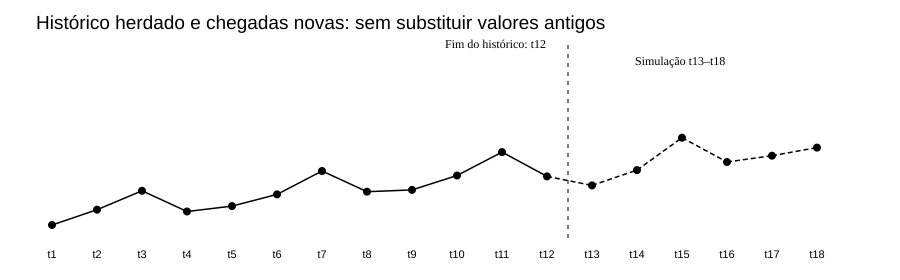
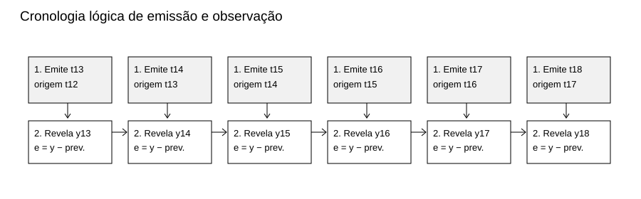
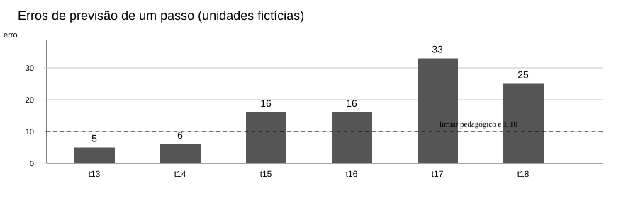
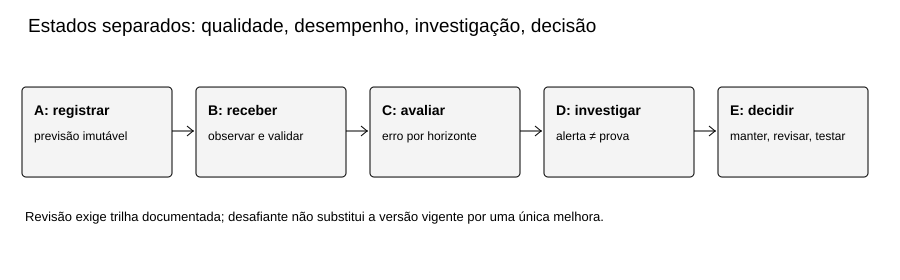
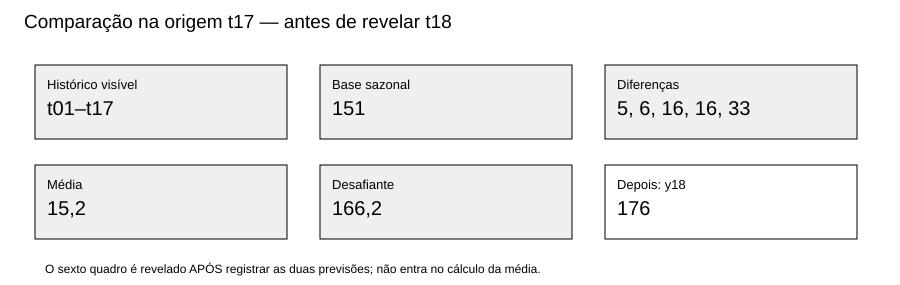

# MAT-EST-048 — Monitoramento prospectivo de séries temporais: registro de previsões, deriva de dados e protocolos de revisão de modelos

**Área:** Matemática. **Unidade:** Estatística, ponte universitária em séries temporais. **Nível:** 6 — Ponte universitária. **Anterior:** MAT-EST-047. **Próximo tópico editorial proposto:** MAT-EST-049 — Comparação prospectiva de modelos temporais: desafiante, referência, custos e decisão de atualização. **Situação do material:** pacote editorial produzido localmente. **Progresso individual:** não iniciado, sem alteração. **Questões oficiais:** zero. Todas as 36 questões são autorais, inclusive as da camada intitulada “estilo vestibular”.

**Organização em blocos flexíveis:** A, registro verificável (25 a 50 minutos); B, deriva e gatilhos (25 a 50 minutos); C, revisão controlada e questões graduais (25 a 50 minutos). Estudar só a leitura não consolida o tópico. Recuar ao pré-requisito necessário quando surgir dificuldade.

## 1. Objetivos e pré-requisitos

Ao estudar e resolver a aula, explicar por que uma previsão deve ser congelada antes da chegada do alvo; representar origem, alvo e horizonte; reconstruir seis emissões sequenciais sem vazamento; calcular erros, médias, faixas e um gatilho previamente definido; distinguir sinal descritivo de deriva, alerta de qualidade de alerta de desempenho e análise exploratória de confirmação; calcular um desafiante com dados até a origem; propor revisão responsável sem apagar a versão anterior.

**Pré-requisitos:** operações, média aritmética, módulo, porcentagem, gráficos temporais; MAT-EST-031 e 032 (avaliação com divisão temporal), MAT-EST-039 e 041 (dependência), MAT-EST-042 (resíduos), MAT-EST-043–046 (sazonalidade e previsões múltiplas) e MAT-EST-047 (erros, horizontes e bandas não calibradas). Se divisão ou subtração com sinal impedir a compreensão, retomar a habilidade antes do problema completo.

**Relação com provas:** gráficos, proporção, interpretação de uma afirmação e limites de evidência podem aparecer em questões do Exame Nacional do Ensino Médio e vestibulares. Monitoramento de modelo, registro de versões e deriva, no detalhamento aqui utilizado, são aprofundamento universitário; não são anunciados como exigência específica de edital sem comprovação institucional.

## 2. Por que monitorar, e não somente ajustar?

Uma previsão é uma afirmação feita **antes** de se conhecer o resultado. Um modelo pode ter feito contas corretas em doze trimestres e deixar de acompanhar as próximas condições. Para descobrir isso, não basta abrir uma planilha com dados que já chegaram e gerar previsões retroativas: é necessário registrar o que realmente estava disponível em cada origem.

Uma analogia: escrever a previsão em uma folha datada e guardá-la antes de abrir o envelope com o resultado. Depois de abrir o envelope, corrigimos a conta, mas não reescrevemos a folha para fingir que previmos melhor. Neste pacote, a ordem de eventos é uma **simulação editorial reproduzível**, não uma prova independente de horários reais de um sistema de produção.

A MAT-EST-047 estudou uma auditoria retrospectiva educativa dos doze dados conhecidos. Aqui o histórico mantém exatamente os **valores**: 90, 107, 128, 105, 111, 124, 150, 127, 129, 145, 171 e 144. Não se declara identidade byte a byte com CSV de pacote anterior, que não estava disponível para cotejo. Para ensinar chegada sucessiva, criamos outro bloco inteiramente fictício, explicitamente novo: **t13 a t18 = 134, 151, 187, 160, 167, 176**. Nenhuma dessas observações foi obtida de instituição, pessoa ou serviço real.

**Figura 1 — Continuidade sem mistura de bases. Texto alternativo:** doze observações históricas até t12 e seis chegadas simuladas de t13 a t18, separadas por um traço vertical. **Observe:** há elevação nos valores de t15 a t18, mas o gráfico sozinho não determina a causa. **Conclusão para áudio:** toda previsão emitida em t12 dispõe só de t1 a t12; dados de t13 em diante são revelados progressivamente.

## 3. Registro prospectivo: informação disponível é parte do cálculo

Para uma previsão emitida na origem o para h passos adiante, escreveremos:

\[\widehat y_{o+h\mid o}=f_{M,v}(y_1,\ldots,y_o;h),\qquad e_{o,h}=y_{o+h}-\widehat y_{o+h\mid o}.\]

**Leitura por extenso:** a previsão de ípsilon na data ó mais agá, condicionada às informações até ó, é o resultado da função do modelo M, versão vê, aplicada só aos valores conhecidos até ó. O erro assinado é observado no alvo menos previsão. “Agá” é horizonte, medido em períodos; os resultados aqui usam unidades fictícias, não pessoas ou atendimentos. Um erro positivo indica subprevisão. A versão do modelo e dos dados deve constar no registro.

Campos mínimos: identificador imutável; emissão e ordem temporal; versão do procedimento; origem; alvo; horizonte; última observação permitida; valor previsto; faixa com tipo declarado; evento de revelação do observado; valor revelado; erro; eventual revisão e motivo. Em sistema real são necessários relógio confiável, fuso horário, trilha de auditoria, autorização e controles de integridade; a numeração lógica usada aqui demonstra a ideia, não substitui tais garantias.

**Figura 2 — Ordem de informação. Texto alternativo:** em cada período, primeiro se congela uma previsão, depois se revela a observação e só então se avalia o erro. **Observe:** os dados novos podem alimentar a próxima emissão, nunca a anterior. **Conclusão para áudio:** registrar primeiro e comparar depois é a condição essencial para evitar vazamento temporal.

### 3.1 Um modelo de referência separado de Holt-Winters

Para manter continuidade conceitual sem fingir que recuperamos os estados internos completos de Holt-Winters da aula anterior, a demonstração de acompanhamento adota um **modelo de referência sazonal ingênuo, BASE-SNAIVE-v1**. É um procedimento novo e explicitamente identificado, não substituição retroativa nem reprodução dos resultados de Holt-Winters em MAT-EST-047.

Com sazonalidade m igual a quatro trimestres, a previsão de um passo para t usa o valor observado na mesma estação anterior:

\[\widehat y_{t\mid t-1}=y_{t-4}.\]

**Leitura:** previsão de ípsilon em t, emitida ao fechar t menos um, é o valor observado quatro períodos antes. “Quatro” corresponde a quatro trimestres, isto é, um ciclo anual neste exemplo. Para o lote de t12, os alvos t13, t14, t15 e t16 têm previsões já congeláveis em t12: 129, 145, 171 e 144. Essas mesmas cifras podem reaparecer em emissões móveis de horizonte um, mas com identificadores, origens e tarefas distintos: não são oito observações independentes.

| Emissão h1 / origem | Referência disponível | Previsão congelada | Observado revelado depois | Erro assinado |
|---|---:|---:|---:|---:|
| t12 → t13 | y9 = 129 | 129 | 134 | +5 |
| t13 → t14 | y10 = 145 | 145 | 151 | +6 |
| t14 → t15 | y11 = 171 | 171 | 187 | +16 |
| t15 → t16 | y12 = 144 | 144 | 160 | +16 |
| t16 → t17 | y13 = 134 | 134 | 167 | +33 |
| t17 → t18 | y14 = 151 | 151 | 176 | +25 |

**Síntese pronunciável:** as seis previsões foram 129, 145, 171, 144, 134 e 151; depois de cada emissão, o observado foi 134, 151, 187, 160, 167 e 176. Os erros, sempre observado menos previsto, foram cinco, seis, dezesseis, dezesseis, trinta e três e vinte e cinco unidades positivas. O arquivo `registro-previsoes.json` guarda os dois eventos por chegada com ordem explícita. Os CSVs separados conservam os dados herdados, os simulados e as avaliações sem respostas de exercícios.

## 4. Monitoramento do erro: magnitude, direção e janela

Erro assinado preserva o sentido. Para avaliar a magnitude média, usamos a média dos valores absolutos, ou MAE, da sigla em inglês *mean absolute error*:

\[MAE=\frac{1}{n}\sum_{i=1}^n |e_i|.\]

**Leitura:** a soma dos módulos de todos os erros dividida pelo número de tarefas avaliadas. Todos os erros aqui são positivos; por isso a média assinada coincide numericamente com o MAE, uma peculiaridade da simulação, não uma regra geral.

- Nos dois primeiros alvos novos, MAE é cinco mais seis, dividido por dois: **5,5 unidades**.
- Nos quatro seguintes, é dezesseis mais dezesseis mais trinta e três mais vinte e cinco, dividido por quatro: **22,5 unidades**.
- No trecho completo, a soma é cento e um, dividida por seis: **aproximadamente 16,83 unidades**.

Comparar janelas de tamanhos diferentes é uma descrição útil, mas não comprova inferência estatística, independência ou causa. A série criada foi deliberadamente curta; a própria escolha editorial dos números explica parte do padrão.

**Figura 3 — Erros h1 em unidades fictícias. Texto alternativo:** seis barras com alturas cinco, seis, dezesseis, dezesseis, trinta e três e vinte e cinco; uma linha tracejada mostra dez unidades. **Observe:** os três erros de t15, t16 e t17 são positivos e pelo menos dez. **Conclusão para áudio:** a regra didática de investigação, especificada antes do exercício, dispara ao revelar t17; isso não é um teste formal de mudança de regime.

## 5. Deriva de dados, deriva de conceito e problemas de qualidade

**Deriva de dados:** mudança na distribuição da informação recebida em comparação com referência pertinente. Dependendo do problema, observar média, dispersão, proporção de valores ausentes ou características de entradas. Em uma série sazonal, comparar um trimestre com outro sem respeitar a estação pode produzir falso sinal. Documentação técnica de monitoramento também diferencia a mudança dos dados de entrada da mudança nas saídas de previsão ([Google Cloud, visão de monitoramento](https://docs.cloud.google.com/gemini-enterprise-agent-platform/machine-learning/model-monitoring/overview)).

**Deriva de conceito:** mudança na relação entre informações explicativas e o alvo que se quer prever. Não declarar tal mecanismo comprovado a partir de seis valores de uma única série sem covariáveis e sem análise pertinente. **Piora do desempenho:** aumento dos erros de previsões já congeladas, mensurável somente após chegada dos respectivos observados. Esses sinais podem coexistir, mas não são sinônimos. A discussão da [IBM sobre deriva de modelos](https://www.ibm.com/think/topics/model-drift) distingue esses mecanismos.

**Problema de qualidade ou de pipeline:** valor ausente, repetido, atraso de atualização, mudança de unidade de medida, sensor ou definição de indicador. Deve ser checado antes de reestimar o modelo. Não converter alteração administrativa de medição em afirmação sobre mudança natural do fenômeno.

### 5.1 Comparação sazonal justa

Na mesma posição do ciclo anual, temos: t13 menos t9 igual a cinco; t14 menos t10 igual a seis; t15 menos t11 igual a dezesseis; t16 menos t12 igual a dezesseis. A média desses quatro deslocamentos sazonais é **10,75 unidades**. Ela mostra uma elevação no cenário inventado sem misturar posições sazonais diferentes. Não é um teste de hipótese nem permite prever o futuro sem ressalvas.

### 5.2 Intervalos ainda precisam de validação

Usaremos somente uma **faixa ilustrativa de previsão central mais ou menos doze unidades**. Ela tem largura total vinte e quatro unidades; não foi ajustada nem calibrada para cobertura probabilística de 80%, 90% ou 95%. Em t13, previsão 129 implica faixa de 117 a 141, que contém 134. Em t15, a previsão 171 implica faixa de 159 a 183, que não contém o observado 187, distante quatro unidades da borda superior. Em todo o trecho, apenas t13 e t14 estão dentro: duas de seis observações, ou aproximadamente 33,33% de cobertura descritiva. Não chamar essa taxa de “nível de confiança” da faixa futura.

## 6. Gatilhos predefinidos: investigar antes de substituir

O protocolo **PED-MAT-048-v1**, definido para ensinar decisões auditáveis antes de examinar as revelações, estabelece:

1. **Atenção:** dois erros consecutivos com módulo estritamente maior que 12 unidades, por horizonte. Primeiro evento observado: t16, com +16 e +16 em t15 e t16.
2. **Investigação:** três erros positivos consecutivos maiores ou iguais a 10 unidades, no mesmo horizonte. Primeiro evento observado: t17, com +16, +16 e +33 em t15, t16 e t17.
3. **Ao investigar:** conferir origem, versões, duplicidades, faltas, unidade, sazonalidade, qualidade de coleta e alterações conhecidas no processo; documentar hipóteses e limites.
4. **Revisão do modelo:** criar uma versão desafiante com metodologia escrita e comparação prospectiva emparelhada com a referência. Nenhuma promoção é automática; registrar autorização, justificativa, data de vigência e plano de reversão quando aplicável.

Esses números são **limiares pedagógicos arbitrários**, não derivam de teste formal de detecção, intervalo de confiança, análise de custo real ou recomendação para uso em saúde, gestão ou finanças. Trocar o limiar depois de ver os dados pode ser útil como exploração, mas não pode ser descrito como confirmação do protocolo prévio. Em séries reais, escolher critérios com base em variabilidade de referência, dependência serial, risco de falso alarme e custo de não detectar alterações.

**Figura 4 — Protocolo de monitoramento. Texto alternativo:** cinco estados sequenciais: registrar previsão, receber e validar observação, avaliar erro, investigar sinal e decidir manter, testar ou revisar. **Observe:** investigação separa alerta e decisão; resultados não reescrevem previsões anteriores. **Conclusão para áudio:** uma regra de alerta organiza o trabalho, mas não garante que houve mudança nem torna legítima uma atualização automática.

## 7. Exemplo resolvido: desafiante calculado sem olhar t18

Após fechar t17, só estão disponíveis os dados até t17. A referência sazonal prevê t18 por y14 igual a 151. Para um desafiante didático, usamos a média das diferenças **sazonais já observadas** de t13 a t17: cinco, seis, dezesseis, dezesseis e trinta e três. Somam setenta e seis; sua média é 15,2. Assim:

\[\widehat y^{desafiante}_{18\mid17}=y_{14}+\frac{5+6+16+16+33}{5}=151+15,2=166,2.\]

**Leitura:** previsão do desafiante para t dezoito, calculada ao fechar t dezessete, é cento e cinquenta e um mais quinze vírgula dois, resultando em cento e sessenta e seis vírgula dois. Só após registrar ambas as emissões revelamos t18 igual a 176. Então o erro da base é 176 menos 151, igual a **+25**; o do desafiante é 176 menos 166,2, igual a **+9,8**. O desafiante errou menos neste alvo compartilhado, porém uma comparação pontual não prova vantagem futura e não justifica promoção automática. A escolha do ajuste foi demonstrativa, não otimizada por conhecer t18.

**Figura 5 — Fronteira informacional em t17. Texto alternativo:** as cinco diferenças sazonais e os dois valores previstos pertencem à origem t17; o valor observado 176 é mostrado num quadro posterior. **Observe:** a observação de t18 não entra na média que formou 166,2. **Conclusão para áudio:** comparação justa congela duas versões antes do mesmo alvo, avalia depois e exige mais tarefas para uma decisão geral.

### Checklist de revisão e de comunicação

Documente a pergunta e o horizonte. Informe quais previsões foram registradas antes das chegadas e quais são apenas retrospectivas. Mostre o observado, os erros e os limiares originais. Separe mudança observada de hipótese causal; informe que dados são fictícios. Registre versão-base, candidato, diferenças metodológicas, métrica e tarefas emparelhadas. Registre tanto a justificativa de eventual atualização quanto os critérios de reversão. Preserve previsão emitida e dados originais, mesmo após correção de um erro de digitação: correção deve criar anotação/versionamento, não apagamento silencioso.

## 8. Vocabulário, usos e armadilhas

**Origem:** último período cuja informação pode participar da previsão. **Alvo:** período a prever. **Horizonte:** quantidade de passos entre ambos. **Congelamento:** imutabilidade lógica de previsão, dados permitidos e versão. **Monitoramento de desempenho:** comparação sistemática com observado que já chegou. **Drift ou deriva:** alteração a investigar, cujo tipo precisa ser declarado. **Desafiante:** versão alternativa testada sob comparador e datas pré-fixados. **Avaliação em sombra:** candidato calcula sem alterar a versão vigente.

Erros frequentes: rever a previsão após conhecer o resultado; usar dado futuro para compor uma média de correção; misturar horizontes; contar o mesmo alvo como independente em duas origens; mudar limiares após ver erros e apresentá-los como prévios; confundir média de valores com mudança estatisticamente comprovada; confundir mudança de unidade com mudança do fenômeno; tomar uma faixa arbitrária por um intervalo de 95%; promover um desafiante após uma única melhora; não indicar que toda a experiência é fictícia.

**Conexões:** raciocínio matemático sobre média e desigualdade; metodologia científica sobre pré-registro e revisão; tecnologia da informação sobre logs, versão, integridade e monitoramento; Língua Portuguesa e Redação sobre separação entre observação, inferência e recomendação. Os dados não representam atuação profissional real e não dão orientação operacional para serviços públicos ou saúde.

## 9. Exercícios graduais e correção separada

Este pacote dispõe de **36 questões autorais**, cada uma com ID permanente, quatro conjuntos e solução individual em arquivo não exposto na página de tentativa: 10 de aprendizagem, 10 de consolidação, 10 contextualizadas ao estilo vestibular e 6 de reteste. Leia e resolva no arquivo `exercicios.md` ou `exercicios.json`; somente após tentativa, consulte `gabarito-comentado.md` ou `gabarito-comentado.json`. Não liberar a resposta no mesmo componente de formulário antes de enviar a tentativa. Os motivos prováveis dos erros registram conteúdo, interpretação, cálculo, estratégia ou memória e devem ser confirmados na correção, não atribuídos automaticamente ao estudante.

**Orientação para resolver:** identificar origem, alvo e horizonte; listar dados permitidos; escrever regra; fazer conta; checar sinal, escala e independência; relatar o limite da conclusão. O reteste deve ficar disponível em uma etapa posterior, sem gabarito visível.

## 10. Síntese para leitura em voz alta e revisão espaçada

Uma previsão só é verificável como antecipação quando seu valor e método são registrados antes do resultado. O exemplo preserva doze observações anteriores e revela seis novos valores inventados, um por vez. O modelo de referência sazonal repete o dado quatro períodos antes. Os erros do exemplo são cinco, seis, dezesseis, dezesseis, trinta e três e vinte e cinco. Dois erros acima de doze levam à atenção ao chegar t16; três erros positivos de pelo menos dez provocam investigação ao chegar t17. Esses limiares foram escolhidos para a aula, não constituem prova de deriva. Um desafiante emitido em t17 prevê 166,2 para t18, frente à base 151. Ao chegar o observado 176, os erros são 9,8 e 25. A diferença em uma única tarefa não basta para substituir um modelo. Registro, investigação, revisão e comunicação são operações distintas.

**Revisão em um, sete e trinta dias após estudo/tentativa efetivos, não após a produção editorial:** no primeiro dia, reconstruir a ordem emissão e chegada e os dois primeiros erros; no sétimo, calcular os gatilhos e o deslocamento sazonal; no trigésimo, resolver o reteste independente e escrever um comunicado de quatro frases com limites, hipótese e decisão. Consolidar só após conseguir explicar, calcular e aplicar em situação nova; o status individual continua não iniciado até evidência real.

## 11. Vídeo complementar e referências

**Vídeo/recurso audiovisual recomendado:** “Forecasting: Principles and Practice”, apresentação de Rob J Hyndman, disponibilizada no [site do autor com reprodutor incorporado](https://robjhyndman.com/hyndsight/fpp-video/). Idioma: inglês. Duração: não informada na página consultada. **Assistir após a seção 3**, como reforço de vocabulário e de metodologia de previsão; não substitui a demonstração de monitoramento. O [catálogo de vídeos dos próprios autores, publicado em 2023](https://robjhyndman.com/hyndsight/fpp3_videos.html), apresenta vídeos de seções do livro, mas a reprodução integral e duração exata do vídeo não foram verificadas aqui. Revalidar antes da publicação no site.

**Leitura principal:** Hyndman e Athanasopoulos, [*Forecasting: Principles and Practice*, 3ª edição — seção 5.8, avaliação de previsões](https://otexts.com/fpp3/accuracy.html), especialmente a separação entre erro de treino e previsão de dados genuinamente novos; e [seção 6.2, princípios de registro e feedback](https://otexts.com/fpp3/judgmental-principles.html). **Complementos técnicos:** [Google Cloud — visão geral de monitoramento](https://docs.cloud.google.com/gemini-enterprise-agent-platform/machine-learning/model-monitoring/overview) e [IBM — definição e formas de deriva](https://www.ibm.com/think/topics/model-drift). São fontes explicativas, não inventários de conteúdo exigido em editais brasileiros.

## 12. Próximo passo e limites da entrega

**Próximo passo editorial, não iniciado:** MAT-EST-049 — Comparação prospectiva de modelos temporais: desafiante, referência, custos e decisão de atualização. Ele poderá utilizar o mesmo registro, sem reescrever o passado, e deve iniciar pela conferência do checkpoint. Não iniciar automaticamente neste pacote.

**Limites:** pacote de conteúdo gerado localmente; não houve sincronização no Drive, integração no GitHub, deploy, verificação manual no Edge ou em leitor de tela, nem confirmação da reprodução audiovisual. Os arquivos CSV herdados foram reconstruídos com os mesmos valores disponíveis da aula anterior, sem atestar hash igual ao CSV inacessível. O gráfico e o registro prospectivo representam a ordem dentro de uma simulação já especificada, não evidência de emissão em datas do mundo real. Sem tentativa do usuário, o progresso individual não se modifica.
