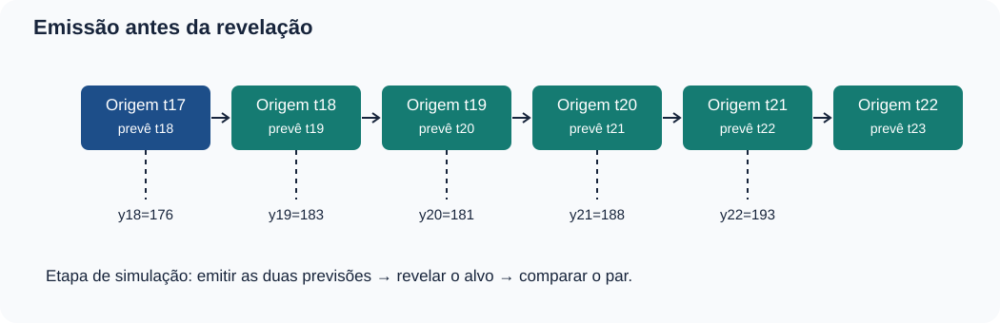
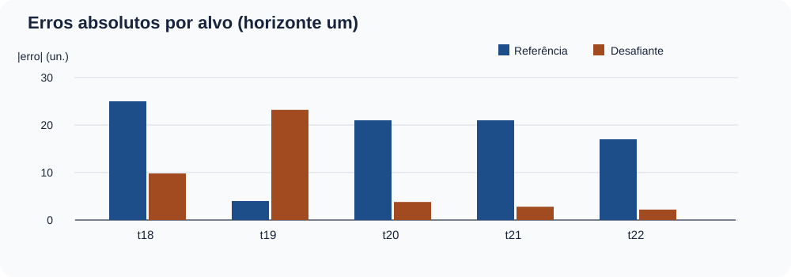
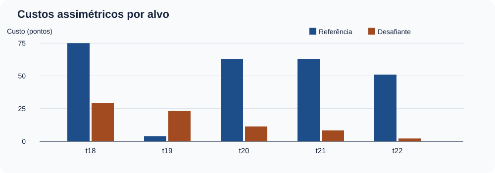
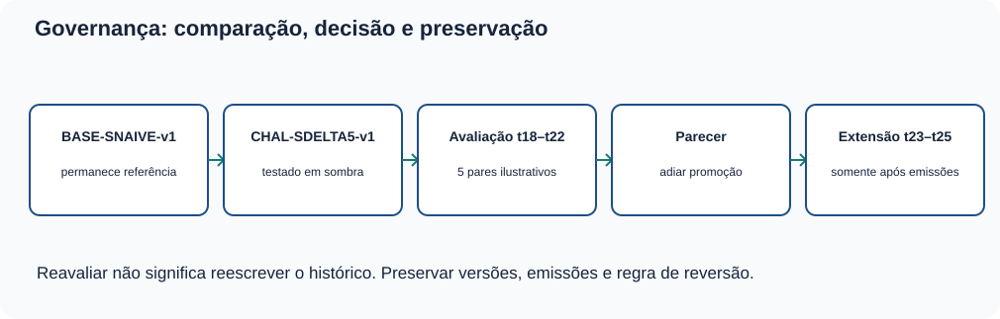

# MAT-EST-049 — Comparação prospectiva de modelos temporais: desafiante, referência, custos e decisão de atualização

**Área:** Matemática. **Unidade:** Estatística e séries temporais — ponte universitária. **Nível:** 6. **Anterior:** MAT-EST-048. **Próximo tópico editorial proposto:** MAT-EST-050 — Robustez temporal: cenários, sensibilidade a custos e documentação de limites de generalização. **Origem:** conteúdo e questões autorais. **Questões oficiais:** nenhuma. **Estado individual:** não iniciado; a produção deste material não demonstra estudo ou domínio. **Situação:** artefato editorial local, não publicado.

**Ritmo sugerido:** bloco A, hipótese e congelamento da comparação (25 a 50 minutos); bloco B, registros emparelhados e métricas (25 a 50 minutos); bloco C, critério decisório, crítica e exercícios (25 a 50 minutos). Recuar até a conta ou a definição que ainda não estiver compreendida; não concluir a unidade somente pela leitura.

## 1. O que aprender e o que já é necessário saber

Ao terminar o estudo e realizar uma tentativa independente, deverá ser possível: (a) justificar por que dois modelos precisam prever o **mesmo alvo e horizonte** antes da revelação; (b) reproduzir o método sazonal ingênuo e o desafiante por média móvel das diferenças sazonais; (c) distinguir erros assinados, valores absolutos, diferença pareada e custo de decisão; (d) calcular média do erro absoluto, redução relativa e custo médio; (e) localizar uma piora individual escondida por uma média mais favorável; (f) aplicar critérios fixados antes dos resultados sem trocar regras posteriormente; (g) redigir parecer que diferencie simulação, evidência e decisão; e (h) conservar registro, versões e possibilidade de reversão.

**Pré-requisitos:** frações e média; soma e subtração com sinais; módulo, porcentagem e desigualdade; série temporal, sazonalidade de quatro períodos, origem, horizonte, avaliação fora do ajuste e dependência; MAT-EST-031, 032, 039, 041, 042 e MAT-EST-043 a 048. Recuperação breve: se o observado é 183 e a previsão é 206,2, o erro, definido como observado menos previsto, é menos 23,2, e seu módulo é 23,2. Esse passo vem antes de qualquer comparação sofisticada.

**Alcance curricular:** leitura de gráficos, médias, porcentagens e avaliação de argumentos são competências transferíveis para ENEM, FUVEST, UNICAMP e UNESP. Os procedimentos pormenorizados de monitoramento de versões, comparação de modelos e função assimétrica de perda são aprofundamento de ponte universitária. Não se declara uma cobrança específica de prova sem conferência do respectivo documento oficial.

## 2. Contexto e proveniência: comparar sem recontar o passado

Na MAT-EST-047, avaliamos previsões retrospectivas. Na MAT-EST-048, construímos uma **simulação editorial de acompanhamento** com os doze valores antigos, `90, 107, 128, 105, 111, 124, 150, 127, 129, 145, 171, 144`, e com seis chegadas inventadas em t13 a t18: `134, 151, 187, 160, 167, 176`. Esses números foram preservados aqui. Os três CSVs trazidos do pacote 048 são cópias byte a byte daquele ZIP disponível nesta sessão; isso não certifica identidade com um arquivo de MAT-EST-047 não recuperado.

O modelo de referência de MAT-EST-048 se chama `BASE-SNAIVE-v1`: para prever um trimestre, repete-se o observado na mesma estação do ano anterior, quatro trimestres antes. O desafiante demonstrado em t17 chama-se neste pacote `CHAL-SDELTA5-v1`: soma a esse valor sazonal a média das cinco diferenças sazonais **já disponíveis na origem**. O valor previsto para t18 foi 166,2, diante da referência 151; o observado 176 já apareceu em MAT-EST-048. Portanto, t18 é uma **comparação herdada e já divulgada**, não um novo alvo cego.

Para ensinar novas emissões, esta aula acrescenta um **cenário sintético t19 a t22**, com valores 183, 181, 188 e 193, revelados progressivamente na ordem do roteiro. São números construídos para aprendizagem, não medições externas e não evidência independente de capacidade preditiva. Mesmo que um log de simulação ordene as etapas, a equipe editorial já conhece os valores no arquivo final. Não chamaremos isso de validação real em produção.

**Figura 1 — Emissão antes da revelação.** Texto alternativo: as origens t17 a t21 emitem duas previsões de horizonte um para t18 a t22; as observações são apresentadas após cada emissão. **Observe:** origem e alvo são diferentes, e t18 vem do pacote anterior. **Conclusão para áudio:** uma comparação justa calcula ambos os métodos com os dados disponíveis no mesmo instante; simular essa ordem não equivale a ter registros reais de produção.

## 3. Por que manter uma referência simples?

Uma versão mais elaborada não deve ser elogiada apenas por ter mais operações. A referência sazonal ingênua responde à pergunta: “O que aconteceria se repetíssemos o valor da mesma estação do ano anterior?”. É transparente, barata de conferir e oferece uma linha de base. Comparar com ela torna o eventual benefício do novo método verificável. A obra *Forecasting: Principles and Practice*, seções 5.8 e 5.10, discute avaliação em dados novos, referências e origens móveis: [avaliação do erro pontual](https://otexts.com/fpp3/accuracy.html) e [validação cruzada temporal](https://otexts.com/fpp3/tscv.html).

Se o período de interesse é t e há quatro estações, definimos:

\[\widehat y^{B}_{t\mid t-1}=y_{t-4}.\]

**Leitura por extenso:** a previsão da referência para t, emitida ao encerrar t menos um, repete o valor observado quatro períodos antes. A letra B identifica a versão base; todas as grandezas são unidades fictícias. Por exemplo, para t19, emitida em t18, a referência usa y15, igual a 187, sem consultar y19.

A diferença sazonal de um período já observado j é:

\[d_j=y_j-y_{j-4}.\]

**Leitura:** dê índice jota é o valor observado no trimestre jota menos o valor da estação correspondente no ano anterior. Diferença positiva significa aumento em relação à mesma estação anterior, não uma tendência causal demonstrada. A regra candidata, definida antes de avaliar t18, é:

\[\widehat y^{C}_{t\mid t-1}=y_{t-4}+\frac{d_{t-5}+d_{t-4}+d_{t-3}+d_{t-2}+d_{t-1}}{5}.\]

**Leitura por extenso:** previsão do desafiante é o observado na mesma estação anterior mais a média das cinco diferenças sazonais disponíveis até a origem. A letra C identifica o candidato. A janela móvel sempre tem **cinco diferenças**; não pode incluir a diferença d t, pois ela contém justamente o observado que queremos prever. A regra permanece igual para todos os alvos, mesmo quando se revela um erro ruim.

### 3.1 Derivação do primeiro par

Ao fechar t17, as diferenças conhecidas d13 a d17 são 5, 6, 16, 16 e 33. Sua soma é 76 e a média 15,2. Logo, a referência de t18 é y14, igual a 151; o desafiante de t18 é 151 mais 15,2, igual a **166,2**. Após as duas emissões, a simulação revela y18 igual a 176. Os erros, observado menos previsto, são 25 para B e 9,8 para C. Esse mesmo exemplo já foi apresentado na aula 048 e serve de ligação, não de nova descoberta.

### 3.2 Próxima origem, outra janela

Em t18, a diferença recém-observada é d18 = 176 menos 151, igual a 25. A janela para prever t19 precisa abandonar d13 igual a 5 e conter d14 a d18: 6, 16, 16, 33 e 25. A soma é 96; a média é 19,2. A referência prevê 187 e o desafiante prevê 187 mais 19,2, igual a **206,2**. Somente depois de registrar ambos se revela o novo dado sintético y19, igual a 183. Aqui a referência erra menos quatro, enquanto o desafiante erra menos 23,2. O fato de o candidato ter ajudado em t18 não o protege de perder em t19.

**Atenção à dependência:** cada média nova compartilha quatro diferenças com a anterior. Esses resultados vizinhos não são ensaios independentes. Um único trimestre extremo pode continuar influenciando várias previsões. Cinco pares na mesma série também não representam cinco séries distintas.

## 4. Registro reproduzível: mesmos alvos, mesmas condições

Em cada linha abaixo, os dois valores preditos são calculados a partir da origem anterior ao alvo. O erro usa `observado − previsto` (unidades fictícias). A tabela é de **comparação educacional**, com t18 herdado e t19 a t22 sintéticos. O arquivo `dados/comparacao-emparelhada-t18-t22.csv` inclui origem, alvo, janela, previsões, erros, módulos, custos e ordem lógica de emissão e revelação.

| Alvo / origem | Observado | B: previsão | C: previsão | Erro B | Erro C |
|---|---:|---:|---:|---:|---:|
| t18 / t17 | 176 | 151 | 166,2 | +25 | +9,8 |
| t19 / t18 | 183 | 187 | 206,2 | −4 | −23,2 |
| t20 / t19 | 181 | 160 | 177,2 | +21 | +3,8 |
| t21 / t20 | 188 | 167 | 185,2 | +21 | +2,8 |
| t22 / t21 | 193 | 176 | 195,2 | +17 | −2,2 |

**Resumo acessível da tabela:** nos cinco alvos, os erros absolutos da referência são 25, 4, 21, 21 e 17. Os erros absolutos do candidato são 9,8; 23,2; 3,8; 2,8 e 2,2. O candidato erra menos em quatro datas e mais em t19. Só o número de vitórias por linha não mede toda a magnitude, custo ou confiança na mudança de modelo.

As novas contas das janelas, para auditoria, são: t20 utiliza diferenças 16, 16, 33, 25 e menos 4, de média 17,2; t21 utiliza 16, 33, 25, menos 4 e 21, de média 18,2; t22 utiliza 33, 25, menos 4, 21 e 21, de média 19,2. Esse detalhamento demonstra que nenhuma previsão usa seu próprio alvo.

**Figura 2 — Comparação de módulos por alvo.** Texto alternativo: pares de barras para t18 a t22, com referência 25, 4, 21, 21 e 17 e desafiante 9,8, 23,2, 3,8, 2,8 e 2,2. Eixo horizontal: período-alvo; eixo vertical: erro absoluto em unidades fictícias. **Observe:** em t19 a barra do candidato supera a referência, apesar de o padrão geral favorecer seu erro médio. **Conclusão para áudio:** o agregado e o comportamento de cada observação precisam ser lidos juntos, sem depender das cores.

## 5. As métricas contam histórias diferentes

### 5.1 Erro assinado e erro absoluto

Defina e = observado menos previsto. Um erro positivo corresponde a subprevisão; um negativo, a superprevisão. O módulo, escrito |e| e lido “módulo do erro”, transforma ambos os sinais em magnitudes não negativas. A média dos módulos, MAE, é:

\[MAE_M=\frac{1}{n}\sum_{i=1}^n |e_{M,i}|.\]

**Leitura:** a soma dos erros absolutos do modelo M, dividida pelo número de alvos emparelhados. Aqui há cinco alvos e a unidade do resultado continua sendo a unidade fictícia da série. A soma de B é 25 mais 4 mais 21 mais 21 mais 17, igual a 88, e MAE de B é 17,6. A soma de C é 9,8 mais 23,2 mais 3,8 mais 2,8 mais 2,2, igual a 41,8; MAE de C é 8,36.

A redução relativa observada frente à referência é:

\[R_{MAE}=\frac{MAE_B-MAE_C}{MAE_B}=1-\frac{8{,}36}{17{,}60}=0{,}525.\]

**Leitura:** a diferença entre erro absoluto médio da referência e do candidato, dividida pelo erro absoluto médio da referência, resulta em 0,525, ou **52,5 por cento**. O denominador é 17,6, não 8,36. Esta é uma descrição da simulação, não previsão de desempenho futuro. Uma razão desse tipo fica indefinida se o MAE de referência for zero; não se deve disfarçar esse caso.

### 5.2 Diferença pareada: onde está a perda escondida?

Para cada alvo i, defina:

\[\Delta_i=|e_{B,i}|-|e_{C,i}|.\]

**Leitura:** delta i é o erro absoluto da referência menos o do desafiante. Delta positivo indica que, naquele alvo, o candidato teve erro absoluto menor; delta negativo, que teve maior. As diferenças observadas são: t18, mais 15,2; t19, **menos 19,2**; t20, mais 17,2; t21, mais 18,2; t22, mais 14,8. A média das cinco diferenças é 9,24, exatamente 17,60 menos 8,36. Isso acontece porque os mesmos cinco alvos entram nas duas médias.

A **piora local do candidato** é definida como |erro C| menos |erro B|, isto é, o negativo de delta. Em t19, ela é 23,2 menos 4, igual a **19,2 unidades**, e não “19,2 por cento”. Um balanço global positivo não apaga esse fato.

**Figura 3 — Agregado versus falha.** Texto alternativo: à esquerda, média absoluta 17,60 na referência e 8,36 no candidato; à direita, no alvo t19, erro absoluto 4 na referência e 23,2 no candidato. **Observe:** a distribuição temporal importa quando perdas locais são relevantes. **Conclusão para áudio:** a diminuição na média não garante superioridade em cada período e não torna suficiente uma amostra curta.

### 5.3 Por que uma média de apenas cinco não basta?

A escolha inicial do candidato foi motivada por sinais de subprevisão já percebidos em MAT-EST-048. Isso é um motivo legítimo para **formular** uma alternativa, mas exige separação entre fase exploratória e avaliação posterior. Além disso, o episódio de t18 foi exposto no pacote anterior; os quatro alvos seguintes foram criados para a presente aula, não coletados de modo cego em campo. Não calcularemos valor de p, intervalo de confiança de ganho, evidência de causalidade, superioridade generalizável ou promessa operacional com esses cinco pontos dependentes.

Uma comparação observacional pode ser reproduzível na matemática e ainda insuficiente para uma decisão real. A referência define a comparação; protocolo, quantidade de alvos, qualidade de dados e impacto adverso local definem o alcance do parecer. A [validação cruzada em séries temporais dos autores Hyndman e Athanasopoulos](https://otexts.com/fpp3/tscv.html) enfatiza preservar a ordem de informações.

## 6. Acrescentar custos: a direção do erro pode importar

A MAT-EST-047 apresentou uma perda pedagógica assimétrica. Reutilizaremos a **mesma convenção fictícia**, sem lhe atribuir validade gerencial real:

\[C(e)=3\max(e,0)+\max(-e,0).\]

**Leitura por extenso:** custo de um erro é três vezes sua parte positiva mais uma vez sua parte negativa em magnitude. O símbolo máximo escolhe o maior entre os argumentos. Se e é mais 2, o custo é 6 pontos; se e é menos 2, o custo é 2 pontos. As constantes três e um são regras inventadas, em pontos fictícios por unidade errada, e não valores financeiros ou relativos a atendimentos reais.

| Alvo | Custo B (pontos) | Custo C (pontos) |
|---|---:|---:|
| t18 | 75 | 29,4 |
| t19 | 4 | 23,2 |
| t20 | 63 | 11,4 |
| t21 | 63 | 8,4 |
| t22 | 51 | 2,2 |
| **Soma** | **256** | **74,6** |
| **Média** | **51,2** | **14,92** |

**Resumo pronunciável:** a soma dos custos hipotéticos é 256 pontos para a referência e 74,6 para o desafiante; dividindo cada soma pelos cinco alvos, as médias são 51,2 e 14,92 pontos. A redução descritiva do custo médio é cerca de **70,86 por cento**, porque 51,2 menos 14,92, dividido por 51,2, vale aproximadamente 0,7086. Em t19, porém, o desafiante custa 23,2 e a referência somente 4; o custo piora naquele alvo. A média depende da assimetria escolhida: trocar a regra de perda pode alterar as conclusões.

**Figura 4 — Custos ilustrativos por data-alvo.** Texto alternativo: pares de barras com custos da referência 75, 4, 63, 63 e 51 e custos do desafiante 29,4, 23,2, 11,4, 8,4 e 2,2 pontos. Eixo horizontal: alvo; vertical: pontos de custo fictício. **Observe:** em t19 o custo do desafiante é superior, apesar do valor agregado menor. **Conclusão para áudio:** decisão tem critérios de erro e de consequência; nenhum número de custo desta aula é recomendação para um serviço real.

## 7. Protocolo de decisão: critérios prévios, não promoção automática

A simulação adota um protocolo **didático, arbitrário e explícito**, armazenado em `protocolo-predefinido.json`. Ele é especificado como regra da experiência antes da apresentação dos resultados completos. Sua data lógica de congelamento é t17, quando as cinco diferenças sazonais para t18 já estão disponíveis. Não estamos alegando uma ata real registrada em data passada. O candidato permanece em **sombra**, isto é, calcula estimativas para comparação, sem substituir a referência vigente.

Para **considerar** uma promoção no exercício, são necessárias simultaneamente: oito alvos h1 emparelhados, de t18 a t25, abrangendo dois ciclos de quatro trimestres; redução de MAE de pelo menos 20 por cento; redução do custo médio fictício de pelo menos 20 por cento; **nenhuma piora de erro absoluto superior a 10 unidades em um único alvo**; verificação da qualidade dos dados; e aprovação humana registrada, com versão e plano de reversão. “Considerar” não significa promover obrigatoriamente, mesmo se tudo passar. O limiar não é teste estatístico e serve somente à prática de governança.

Nesta etapa, apenas cinco pares estão definidos. Os critérios médios ultrapassam as reduções mínimas, mas são incompletos e existe a falha local de t19, que piora 19,2 unidades, excedendo o máximo didático de dez. Assim, **o protocolo atual não autoriza promover `CHAL-SDELTA5-v1`**. Conservar `BASE-SNAIVE-v1` como referência desta simulação não prova que ela seja melhor em geral: somente respeita a política experimental declarada.

| Porta do protocolo | Resultado nos cinco pares | Situação |
|---|---|---|
| Pelo menos 8 pares em 2 ciclos | 5 de 8 | Pendente |
| Redução MAE de pelo menos 20% | 52,5% | Atende no exercício |
| Redução de custo médio de pelo menos 20% | aproximadamente 70,86% | Atende no exercício |
| Nenhuma piora absoluta acima de 10 | t19 piora 19,2 | Falha |
| Auditoria da qualidade e autorização | não executadas em contexto real | Pendente |

**Síntese sem tabela:** ainda faltam três alvos para a quantidade estabelecida, duas médias descritivas satisfazem as metas arbitrárias, e uma perda local viola a guarda. Uma porta obrigatória que falha impede a conclusão “todos os critérios cumpridos”. Não ajustar o limiar para vinte depois de olhar o t19 e apresentá-lo como se sempre tivesse sido esse; um protocolo alternativo pode ser formulado, mas deve receber novo nome, justificativa e teste em novos alvos.

**Figura 5 — Leitura das seis portas.** Texto alternativo: amostra pendente, erro médio atende, custo médio atende, guarda local falha, qualidade pendente e decisão adiada. **Observe:** cada porta tem um nome e um estado textual, sem depender das cores. **Conclusão para áudio:** duas métricas agregadas favoráveis não bastam quando condições obrigatórias de amostra e piora local não estão satisfeitas.

### 7.1 E se o objetivo real for diferente?

Uma política pode aceitar perdas locais maiores para obter redução média ou ser muito mais conservadora com extremos. Essas são escolhas de finalidade, não verdades fornecidas pelo MAE. Antes de utilizar um modelo fora da aula, seria necessário definir custos com pessoas responsáveis, validar a origem e a qualidade dos dados, avaliar efeitos adversos, documentar revisão independente, obter aprovação pertinente e preparar possibilidade de reversão. Não simulemos essa autorização com um botão fictício.

## 8. Versões, extensão e reversão: manter histórico auditável

`BASE-SNAIVE-v1` e `CHAL-SDELTA5-v1` são nomes distintos. O primeiro permanece o comparador e o segundo não deve sobrescrever linhas antigas. Para eventual continuação t23 a t25, registrar ambas as previsões antes de revelar cada novo observado, preservar o protocolo original e documentar qualquer mudança de dados, fórmula, seleção de janela ou critério. Não existe t23 a t25 observado neste pacote. Um resultado editorial adicionado depois não deve ser apresentado como previsão originalmente emitida em t21.

Se uma versão fosse implantada em um cenário real, manteríamos um registro com: identificador da versão; dados permitidos; fórmula e parâmetros; momento da emissão; alvo; canal de aprovação; métricas de revisão; justificativa; responsável; condição de retorno à referência; e eventos de retorno sem apagar o histórico. No caso fictício atual, a conclusão é simplesmente **adiar promoção** e preservar os dois procedimentos para extensão comparável ou reformulação explícita da política.

**Figura 6 — Histórico e revisão.** Texto alternativo: cinco quadros apresentam referência, candidato em sombra, cinco pares de avaliação, parecer de adiar e eventual extensão, sem sobrescrever os registros anteriores. **Observe:** o fluxo separa cálculo, evidência e decisão. **Conclusão para áudio:** não se corrige o passado editando as previsões; qualquer revisão cria uma nova versão e uma trilha de justificativas.

## 9. Um relatório responsável: exemplo resolvido em quatro partes

**Questão:** comparar dois procedimentos h1 da simulação sem exagerar os resultados.

**Protocolo e dados:** “Foram comparadas cinco previsões de um trimestre à frente sobre os mesmos alvos fictícios t18 a t22. A referência replica a observação da mesma estação anterior e o desafiante acrescenta uma média móvel de cinco diferenças sazonais. t18 foi apresentado anteriormente; t19 a t22 são uma sequência criada para esta aula.”

**Achados descritivos:** “O MAE foi 17,60 na referência e 8,36 no candidato, redução de 52,5 por cento. O custo médio da regra assimétrica ilustrativa foi 51,2 e 14,92 pontos, respectivamente.”

**Ressalvas:** “O candidato foi pior em t19, com erro absoluto 23,2, contra 4 da referência: piora de 19,2 unidades. A amostra é pequena, temporalmente dependente e inteiramente fictícia; os valores não sustentam inferência de vantagem geral.”

**Decisão conforme critério:** “O protocolo requer oito pares e proíbe piora local superior a dez unidades, além de auditoria e aprovação. Por isso a etapa não aprova promoção. Os registros e as duas versões devem ser preservados; qualquer novo teste necessita emissões anteriores aos observados.”

## 10. Vocabulário, erros frequentes e relações com outras matérias

**Modelo de referência:** procedimento simples usado para dar sentido à comparação. **Desafiante ou candidato:** procedimento alternativo avaliado sem substituir o vigente. **Par emparelhado:** duas previsões para o mesmo alvo, horizonte e universo informacional. **Diferença sazonal:** observado menos observado de mesma estação anterior. **Avaliação em sombra:** calcular o candidato sem torná-lo o procedimento decisório vigente. **Regra de perda:** transformação de erro em consequência segundo objetivo declarado. **Guarda:** condição de proteção adicional à média. **Promoção:** troca da versão vigente, distinta de mera análise. **Reversão:** retorno documentado a uma versão anterior se condições previstas surgirem.

**Erros frequentes:** calcular a média móvel incluindo d do alvo que ainda não ocorreu; comparar t18 de um método com t19 de outro; usar MAE de treino como teste novo; chamar cinco dados da mesma série de cinco replicações independentes; inverter o sinal de erro; dizer que queda de 9,24 unidades significa queda de 9,24 por cento; confundir melhora média e melhora em todos os alvos; esconder falha em t19; aplicar custos sem declarar a regra; trocar limiares depois de ver a tabela e chamá-los de prévios; promover o candidato só porque uma métrica agregada é menor; tratar um roteiro de revelações como registro temporal de uma operação real.

**Relações:** média, porcentagem, módulo e função por partes em Matemática; coleta, hipótese e desenho de teste em metodologia científica; logs e versionamento em Tecnologia da Informação; argumentação e distinção entre fato, interpretação e limitação em Língua Portuguesa e Redação; debate sobre consequências e responsabilização em Filosofia e Sociologia. Dados e custos deste exemplo não representam serviços, pacientes, receitas ou instituições.

## 11. Exercícios graduais, tentativa independente e correção

O pacote inclui **36 questões autorais com identificadores permanentes**, divididas em dez de aprendizagem, dez de consolidação, dez contextualizadas no estilo de vestibulares e seis de reteste. O enunciado e a estrutura estão em `exercicios.md` e `exercicios.json`, enquanto soluções e hipóteses de erro estão **somente em arquivos separados**, `gabarito-comentado.md` e `gabarito-comentado.json`. Não expor esses arquivos na interface da tentativa antes do envio. A seção de exercícios não deve antecipar o gabarito. Uma questão “estilo vestibular” não é questão oficial de qualquer instituição.

**Como responder:** identificar origem e alvo; listar valores realmente permitidos; escolher a expressão correta; substituir números; checar sinal, unidade, denominador e diferença entre descrição e conclusão. Os motivos de erro nos arquivos são hipóteses para correção comentada, não diagnósticos automáticos. A tela de progresso deve continuar em “não iniciado” até uma tentativa individual comprovada.

## 12. Síntese pronunciável para ouvir no Microsoft Edge

A comparação entre modelos só faz sentido quando eles preveem o mesmo alvo no mesmo horizonte usando dados disponíveis na mesma origem. A referência desta aula repete o valor de quatro trimestres antes. O desafiante acrescenta a média das últimas cinco diferenças entre cada trimestre e sua estação anterior. Em uma simulação com cinco alvos, o erro absoluto médio caiu de dezessete vírgula seis para oito vírgula trinta e seis unidades. Entretanto, no alvo t dezenove, o candidato errou vinte e três vírgula dois, enquanto a referência errou quatro. Seu pior desempenho local foi de dezenove vírgula dois unidades. O custo médio ilustrativo caiu de cinquenta e um vírgula dois para quatorze vírgula noventa e dois pontos, mas a política educativa exige oito pares e proíbe piora local superior a dez. Portanto a promoção fica adiada. Os dados são fictícios; a sequência de emissão e revelação é uma simulação editorial, não um teste de campo. Preservar versões e limites é parte da conclusão.

**Revisão espaçada:** planejar um, sete e trinta dias **após estudo e tentativa efetivos**, nunca contando da data de geração desta aula. Na primeira revisão, refazer t19 sem ver a solução. Na segunda, recalcular dois erros, MAE e custo com uma regra alternativa explicitada previamente. Na terceira, resolver o reteste sem gabarito e produzir relatório com hipótese, números, falha local, tamanho da amostra e decisão. Consolidar somente com evidência de explicação, cálculo, transferência e recordação posterior.

## 13. Vídeo e leituras complementares

**Vídeo recomendado e verificado como resultado público da plataforma:** [*Forecasting Principles & Practice: 5.10 Time series cross-validation* — canal OTexts, YouTube](https://www.youtube.com/watch?v=OGpENuxjRWM). Publicado pelo canal em 5 de março de 2023; idioma inglês; duração exata não foi identificada na verificação da página, portanto não será inventada. **Assista depois da seção 4.** O vídeo reforça a ideia de origem móvel e a proibição de usar observações futuras na avaliação. Ele não substitui as contas de perda assimétrica nem discute necessariamente esta política didática de promoção. O link foi localizado em pesquisa pública; reprodução integral, legendas e funcionamento posterior no Edge não foram testados nesta sessão.

Leituras principais, autores Rob J. Hyndman e George Athanasopoulos: [seção 5.8, avaliação de precisão pontual](https://otexts.com/fpp3/accuracy.html) e [seção 5.10, validação cruzada temporal](https://otexts.com/fpp3/tscv.html). [Lista de vídeos publicada pelos autores](https://robjhyndman.com/hyndsight/fpp3_videos.html). As referências fundamentam os princípios gerais, não os limiares arbitrários nem os números inventados nesta aula.

## 14. Limites da entrega e próximo passo

**Material editorial:** aula, seis SVGs com título e descrição internos, CSVs, modelo de registros, exercícios e gabaritos separados, metadados, manifesto de hashes, prévia local e ZIP. **Sem comprovação de:** publicação no site, integração em GitHub, sincronização com Google Drive, teste de áudio no Microsoft Edge, teste de navegação por teclado em navegador, leitura completa do vídeo. Os arquivos novos preservam os dados herdados e distinguem simulação de observação real. Nenhuma tentativa individual foi registrada.

**Próximo tópico proposto, ainda não iniciado:** MAT-EST-050 — Robustez temporal: cenários, sensibilidade a custos e documentação de limites de generalização. Antes de começar, consultar o checkpoint canônico e não presumir observações t23 a t25. Quando Anderson escrever “Continuar”, realizar somente esse passo editorial ou, se a matriz canônica trouxer ordem diferente, registrar a divergência e preservar a sequência verificada.
