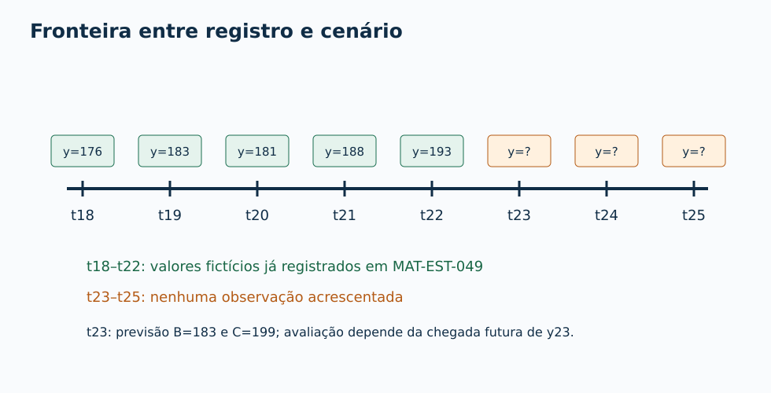
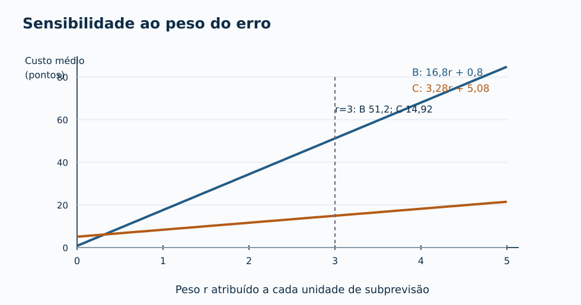
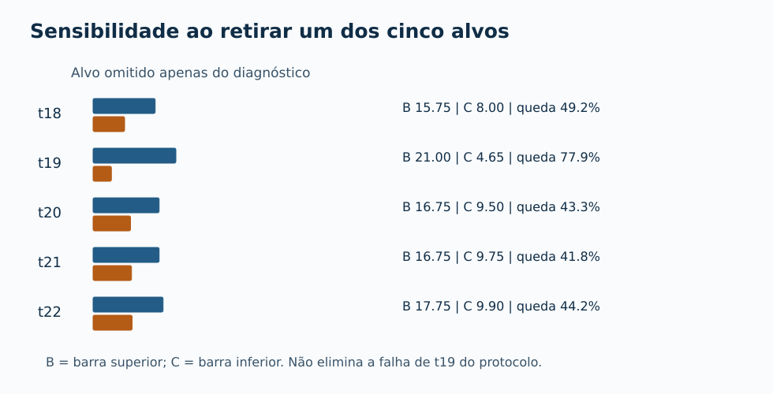
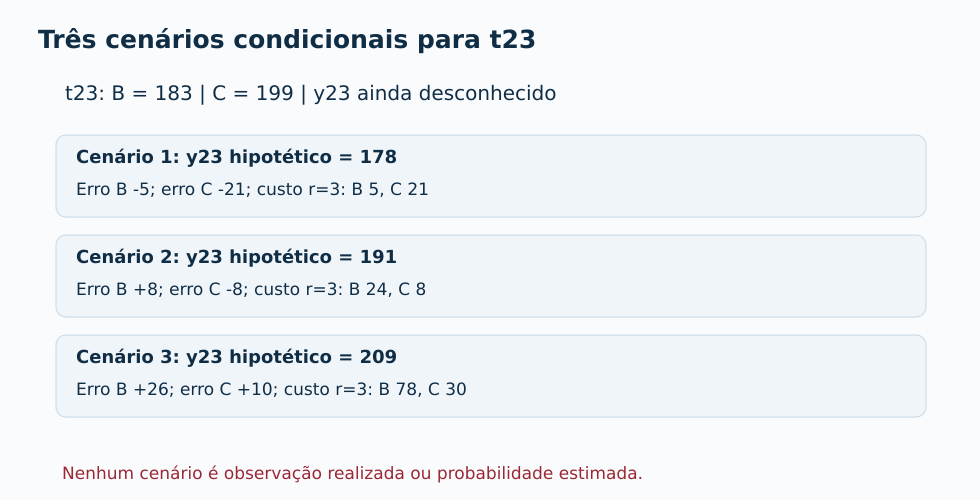
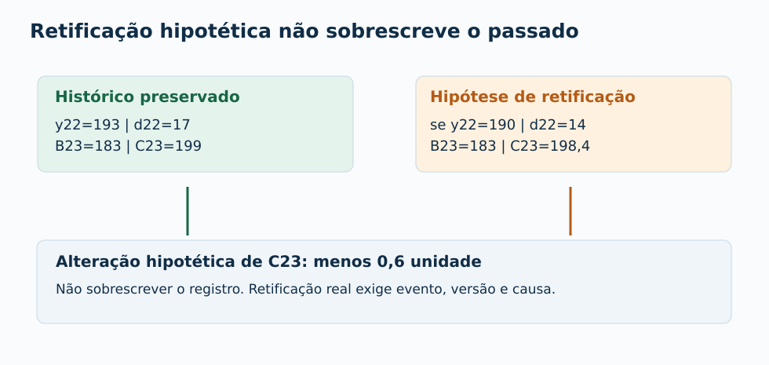

# MAT-EST-050 — Robustez temporal: cenários, sensibilidade a custos e documentação de limites de generalização

**Área:** Matemática. **Unidade:** Estatística — séries temporais, ponte universitária. **Nível:** 6. **Anterior:** MAT-EST-049. **Próximo tópico editorial proposto:** MAT-EST-051 — Desenho de uma avaliação temporal futura: hipóteses, coleta, critérios e análise pós-registro. **Origem:** conteúdo, tabelas, diagramas e exercícios autorais; nenhuma questão oficial foi reproduzida. **Progresso individual:** não iniciado; produzir este material não constitui estudo, tentativa ou domínio.

**Atenção ao tipo de evidência:** este é um exercício com uma série *inventada*. Os valores de t01 a t22 preservam a narrativa dos pacotes anteriores. O valor observado de t23, t24 e t25 **não existe** neste pacote. Números usados em cenários não devem ser inseridos na coluna de observações nem transformados retroativamente em registros de previsão prospectiva em campo.

**Blocos de estudo:** A (30–45 minutos), sentido de robustez e fronteira temporal; B (30–50 minutos), análise de sensibilidade a custos e composição da amostra; C (30–50 minutos), cenários futuros condicionais, revisões, relatório e exercícios. O tempo é indicativo: se aparecer dificuldade, retomar a operação ou definição necessária e não avançar só porque o bloco terminou.

## 1. Objetivos e pré-requisitos

Ao final de uma tentativa real e de sua correção, espera-se que você consiga: definir robustez sem confundi-la com média baixa; distinguir hipótese de observação; reconstruir um custo assimétrico como função de um peso variável; obter o peso em que duas médias de custo se igualam; medir como o resumo muda ao retirar *temporariamente* um alvo, sem apagar o acontecimento; recalcular previsões de t23 com dados disponíveis até t22; avaliar três valores hipotéticos diferentes para o mesmo alvo; explicar por que uma retificação de dados exige registro de versão; reconhecer critérios de protocolo ainda bloqueados; escrever um parecer com resultados, limites, riscos e plano de avaliação futura.

**Pré-requisitos essenciais:** subtração com números positivos e negativos; módulo, média, divisão, proporções e porcentagem; funções lineares e desigualdades. **Pré-requisitos curriculares:** MAT-EST-031 e MAT-EST-032 (divisão temporal e avaliação); MAT-EST-039 e MAT-EST-041 (dependência); MAT-EST-042 (resíduos); MAT-EST-043 a MAT-EST-047 (sazonalidade, métodos e erro por horizonte); MAT-EST-048 (registro de emissão e monitoramento); MAT-EST-049 (comparação emparelhada e regras de decisão). Se o problema for, por exemplo, resolver a desigualdade de duas retas, faça primeiro a subtração dos dois lados e verifique um valor simples da variável.

**Relação com provas:** leitura de gráficos, tabelas, funções do primeiro grau, porcentagens, inferência contextual e limites de interpretação são competências gerais transferíveis a ENEM, FUVEST, UNICAMP e UNESP. Análise de robustez de modelos de previsão, governança de versões e regra formal de promoção compõem aqui um aprofundamento da ponte universitária. Não se atribui essa técnica específica ao conteúdo obrigatório de uma banca sem conferir seu documento oficial. Todas as questões denominadas “estilo vestibular” adiante são **autorais**.

## 2. Contexto: por que uma média favorável não é uma garantia?

Na MAT-EST-049 comparamos, nos mesmos cinco alvos fictícios de t18 a t22 e sempre um trimestre à frente, duas regras: referência `BASE-SNAIVE-v1`, abreviada B, e desafiante `CHAL-SDELTA5-v1`, abreviada C. Seus erros absolutos médios foram, respectivamente, **17,60** e **8,36 unidades**. Na regra de custo escolhida anteriormente — três pontos por unidade subprevista e um ponto por unidade superprevista — os custos médios foram **51,20** e **14,92 pontos fictícios**. Esses são resumos descritivos da série criada, não desempenho de serviço real.

A candidata C, contudo, teve um erro absoluto de **23,2** em t19, enquanto B errou **4**. Sua piora local foi **19,2 unidades**. A política didática `MAT-EST-049-PROT-v1` exige pelo menos oito pares, melhora mínima de vinte por cento nas duas médias e nenhuma piora local superior a dez unidades, além de controle de qualidade e autorização humana. Existem apenas cinco pares, e a piora de t19 já viola uma condição. Por isso a política **não autoriza promoção**, mesmo com as duas médias menores. Os três alvos restantes do protocolo são t23, t24 e t25; seus valores não estão observados.

A pergunta da presente aula não é “como fazer C ganhar?”. É: **quais afirmações continuam verdadeiras quando modificamos, de forma declarada, a pergunta, a regra de custo, a composição do resumo ou o cenário futuro?** Uma conclusão robusta indica precisamente sob quais condições continua válida e onde deixa de valer.

**Figura 1 — Fronteira informacional.** Texto alternativo: Linha de t18 a t25; t18 a t22 têm valores fictícios já registrados e t23 a t25 aparecem sem valores observados. **Observe:** a linha que divide retrospectiva de projeção. **Conclusão em áudio:** podemos calcular uma previsão a partir de t22 e fazer perguntas condicionais sobre t23, mas não relatar acertos ou erros reais de t23.

### Vocabulário sem confusões

**Robustez:** estabilidade da interpretação quando submetemos o resultado a mudanças justificadas de hipótese, amostra ou parâmetro. É sempre *robustez em relação a algo*, nunca uma propriedade ilimitada. **Sensibilidade:** quantidade de mudança na conclusão ou no indicador quando um dado ou parâmetro varia. **Cenário contrafactual:** descrição de algo que aconteceria *se* um valor assumido se concretizasse; não é ocorrência factual. **Guarda local:** condição que restringe o tamanho de uma perda em uma observação individual. **Generalização:** passagem justificada de achados de um conjunto específico para uma classe mais ampla de casos; não decorre automaticamente de cinco números inventados. **Análise exploratória:** instrumento para descobrir perguntas e pontos frágeis, não substitui teste posterior preservado da escolha exploratória.

## 3. Recupere os cinco pares exatamente como foram registrados

O erro assinado é `e = observado − previsto`; em notação, \(e_t=y_t-\widehat y_t\). Leitura: “erro é o valor observado no período t menos a previsão para o mesmo período”. Erro positivo representa subprevisão; erro negativo, superprevisão. Módulo \(|e|\) significa ignorar o sinal somente para medir o tamanho do erro.

| Alvo | Observado fictício | Previsto B | Previsto C | Erro B | Erro C | Módulo B | Módulo C |
|---|---:|---:|---:|---:|---:|---:|---:|
| t18 | 176 | 151 | 166,2 | +25 | +9,8 | 25 | 9,8 |
| t19 | 183 | 187 | 206,2 | −4 | −23,2 | 4 | 23,2 |
| t20 | 181 | 160 | 177,2 | +21 | +3,8 | 21 | 3,8 |
| t21 | 188 | 167 | 185,2 | +21 | +2,8 | 21 | 2,8 |
| t22 | 193 | 176 | 195,2 | +17 | −2,2 | 17 | 2,2 |
| Soma dos módulos | — | — | — | — | — | **88** | **41,8** |

**Leitura da tabela por áudio:** no primeiro alvo, C reduziu o erro absoluto de 25 para 9,8. No segundo, ocorreu o contrário: C errou 23,2, ante quatro da referência. Nos três alvos seguintes, o módulo de C foi menor. Os totais de 88 e 41,8, divididos por cinco, produzem 17,6 e 8,36. Os alvos são os mesmos, logo a comparação é pareada. Não escolher um alvo novo para C e outro para B.

A comparação numérica é reprodutível com o CSV herdado sem alterar uma linha. Mas a série é sintética: t18 já constava na MAT-EST-048; t19 a t22 foram construídos para a MAT-EST-049. Não foi um experimento cego com dados reais. A distinção entre ajuste e avaliação temporal em dados novos é descrita em [*Forecasting: Principles and Practice*, seção 5.8](https://otexts.com/fpp3/accuracy.html).

## 4. Primeira lente de robustez: mudar explicitamente o peso do custo

Uma métrica não é uma opinião neutra sobre todas as decisões possíveis. MAE, erro absoluto médio, dá o mesmo peso a erros positivos e negativos. Uma decisão pode atribuir custos diferentes a eles. A regra do exercício anterior é uma escolha de cenário; mantê-la congelada é diferente de *explorar* regras alternativas para entender a dependência da conclusão.

Defina a família de funções:

\[C_r(e)=r\max(e,0)+\max(-e,0),\qquad r\ge 0.\]

**Leitura pronunciável:** custo de e, para um peso r não negativo, é r vezes a parte positiva do erro, mais a magnitude de sua parte negativa. O valor r é o custo em pontos para cada unidade de subprevisão; o custo de cada unidade de superprevisão continua um ponto. Se r é três, voltamos à política anterior. É uma escala inventada em **pontos fictícios**, não valor monetário ou avaliação de atendimento de pessoas. Se r é um, os dois sinais custam igualmente, e o custo médio passa a ser o MAE.

### 4.1 Como obter uma fórmula para cada modelo

Os erros positivos de B são 25, 21, 21 e 17; somam **84**. Seu único erro negativo é −4; a soma das magnitudes negativas é quatro. Dividindo cada parcela por cinco alvos, o custo médio de B, como função do peso, é:

\[\overline C_B(r)=\frac{84r+4}{5}=16{,}8r+0{,}8.\]

Leitura: “custo médio da referência é dezesseis vírgula oito vezes r, mais zero vírgula oito”. A unidade é pontos fictícios por previsão.

Os positivos de C somam 9,8 mais 3,8 mais 2,8, igual a **16,4**. As magnitudes negativas são 23,2 e 2,2, que somam **25,4**. Assim:

\[\overline C_C(r)=\frac{16{,}4r+25{,}4}{5}=3{,}28r+5{,}08.\]

Leitura: “custo médio do candidato é três vírgula vinte e oito vezes r, mais cinco vírgula zero oito”. Observe que r não é uma probabilidade e tampouco uma porcentagem. Variar esse parâmetro não muda os erros observados no roteiro; altera a importância atribuída aos sinais.

### 4.2 Em que peso as duas médias empatam?

Igualamos as duas retas:

\[16{,}8r+0{,}8=3{,}28r+5{,}08.\]

Primeiro subtraia 3,28r dos dois lados; depois subtraia 0,8 dos dois lados:

\[13{,}52r=4{,}28,\qquad r=\frac{4{,}28}{13{,}52}\approx0{,}31657.\]

**Leitura:** r é aproximadamente zero vírgula três um seis cinco sete. Para r maior que esse valor, C tem menor custo médio *nesses cinco pares inventados*. Para r menor, B tem menor custo médio; na igualdade, empatam. Verifique substituindo r igual a 0,25: B custa 5,00 e C custa 5,90 pontos. Esse contracheque algébrico é útil: uma conclusão sobre custo depende do peso escolhido.

| Peso ilustrativo r | Média B (pontos) | Média C (pontos) | Menor média neste recorte |
|---|---:|---:|---|
| 0,25 | 5,00 | 5,90 | B |
| 0,50 | 9,20 | 6,72 | C |
| 1 | 17,60 | 8,36 | C |
| 2 | 34,40 | 11,64 | C |
| **3, protocolo herdado** | **51,20** | **14,92** | **C, apenas pelo agregado** |
| 5 | 84,80 | 21,48 | C |

**Síntese em áudio:** no peso um, custo e MAE coincidem. No peso três, reproduzimos os custos do último pacote. Com um peso muito pequeno para subprevisões, como 0,25, a referência passa a ter menor custo médio. A mudança de ordenação demonstra sensibilidade ao objetivo, não vitória de um modelo universal. Nenhuma linha altera retrospectivamente `MAT-EST-049-PROT-v1`, e a falha local t19 continua verdadeira em todas as linhas.

**Figura 2 — Duas retas de custo.** Texto alternativo: eixo horizontal mostra o peso r, de zero a cinco, sem unidade; eixo vertical o custo médio, em pontos. A linha B cresce segundo 16,8r + 0,8 e C segundo 3,28r + 5,08; cruzam-se perto de r igual a 0,317. **Observe:** a preferência por um agregado depende da definição do custo. **Conclusão em áudio:** com peso três, a média de C é menor; isso não derruba a guarda de piora local.

### Erro comum: calibrar o peso para beneficiar uma resposta

Se alguém observou o gráfico e mudou r de três para 0,25 só para apresentar B como mais barata, ou ajustou o peso para favorecer C, a comparação deixou de ser a execução do protocolo anterior. É válido registrar uma **análise de sensibilidade pós-estudo**, desde que rotulada como tal; não é válido afirmar que o novo parâmetro era o compromisso original nem usá-lo como prova de desempenho futuro.

## 5. Segunda lente: o resultado agregado depende de um único alvo?

Podemos retirar *temporariamente* um alvo da conta e perguntar como mudam as médias dos outros quatro. Isso se chama aqui **diagnóstico por retirada de um alvo** ou *leave-one-out* descritivo. A expressão inglesa significa “deixar um de fora”. A operação **não apaga** o alvo, não reemite previsões, não estabelece independência temporal e não produz um conjunto de teste novo. Seu propósito é revelar influência de observações individuais sobre o resumo.

Se \(A_B=88\) é a soma dos módulos de B e \(a_{B,i}\) é o módulo de B na linha retirada, então:

\[MAE_{B,-i}=\frac{88-a_{B,i}}{4}.\]

Leitura: “erro absoluto médio de B, retirado o alvo i, é oitenta e oito menos o módulo daquela linha, dividido por quatro”. Para C, troque oitenta e oito por 41,8 e o módulo correspondente.

**Exemplo resolvido — retirar t19 da conta de diagnóstico:** B fica com soma 88 menos 4, igual 84; sua média entre os outros quatro é 21. C fica com 41,8 menos 23,2, igual 18,6; sua média é 4,65. A redução relativa apresentada nesse recorte é (21 menos 4,65) dividido por 21, igual a aproximadamente 77,86 por cento. Ela é **maior** que os 52,5 por cento do conjunto completo precisamente porque se omitiu o caso mais desfavorável para C. Isso é informação sobre influência, não justificativa para descartar a falha.

| Retirado apenas do diagnóstico | MAE B nos quatro restantes | MAE C nos quatro restantes | Redução descritiva de C |
|---|---:|---:|---:|
| t18 | 15,75 | 8,00 | 49,21% |
| t19 | 21,00 | 4,65 | 77,86% |
| t20 | 16,75 | 9,50 | 43,28% |
| t21 | 16,75 | 9,75 | 41,79% |
| t22 | 17,75 | 9,90 | 44,23% |

**Leitura em áudio:** retirando t18, a redução descritiva fica próxima de 49 por cento; ao retirar t19, sobe para quase 78 por cento; retirando cada um dos três alvos seguintes, fica entre cerca de 42 e 44 por cento. A amplitude revela influência considerável de t19. Não é intervalo estatístico de confiança nem estimativa de vantagem futura.

**Figura 3 — Influência de cada alvo.** Texto alternativo: cinco pares de barras horizontais apresentam os MAEs de quatro pontos após retirar separadamente t18, t19, t20, t21 ou t22. **Observe:** retirar t19 favorece numericamente o desafiante, mas essa seleção seria incompatível com a regra que exige considerar todas as perdas locais. **Conclusão em áudio:** um resumo estável em alguns subconjuntos não autoriza apagar uma falha previamente registrada.

### Qual é o limite dessa técnica?

Os alvos são uma sequência temporal, não cinco pessoas sorteadas ao acaso. Além disso, o modelo C foi idealizado após padrões já explorados na série, e os dados foram inventados editorialmente. Logo, os cinco resultados de retirada não devem virar intervalo de confiança, valor de p, cinco experimentos externos independentes ou validação temporal adicional. Para escolher uma versão e relatar desempenho, a avaliação realmente futura precisa preservar origem e alvo, como detalhado na [seção 5.10 do livro de Hyndman e Athanasopoulos](https://otexts.com/fpp3/tscv.html).

## 6. Terceira lente: prever t23 sem conhecer t23

Nesta aula não acrescentamos um novo observado. Em vez disso, reconstruímos **estimativas condicionadas ao histórico t01–t22**, assumindo as duas fórmulas já registradas. Elas são cálculos didáticos reproduzidos agora, **não um log assinado de uma emissão de campo realizada em t22**.

A referência sazonal de quatro trimestres prevê, para t23, a observação quatro períodos antes: \(\widehat y^{B}_{23\mid22}=y_{19}=183\). Leitura: “a previsão B para t23 emitida com informação até t22 é igual a y19, cento e oitenta e três”.

O desafiante soma à referência a média de cinco diferenças sazonais disponíveis até t22, definidas como \(d_j=y_j-y_{j-4}\). Leitura: “diferença sazonal de j é o observado atual menos o observado quatro períodos antes”. A janela é:

| Diferença | Conta | Valor (unidades) |
|---|---|---:|
| d18 | 176 − 151 | +25 |
| d19 | 183 − 187 | −4 |
| d20 | 181 − 160 | +21 |
| d21 | 188 − 167 | +21 |
| d22 | 193 − 176 | +17 |
| Soma | 25 − 4 + 21 + 21 + 17 | **80** |

A média é oitenta dividido por cinco, ou **16 unidades**. Portanto, \(\widehat y^C_{23\mid22}=183+16=199\). Leitura: “previsão C para t23 com origem t22 é cento e noventa e nove”. Ambas usam somente dados até t22, preservando os IDs `BASE-SNAIVE-v1` e `CHAL-SDELTA5-v1`. Não reestime o modelo com y23 para depois fingir que a previsão existia antes de revelar esse mesmo valor.

### 6.1 Três cenários — perguntas do tipo “e se?”

Suponha três valores **hipotéticos, mutuamente alternativos**, para y23: 178 (queda em relação à previsão), 191 (entre as duas previsões) e 209 (alta). Nenhum é observação ou distribuição de probabilidades. Para cada hipótese, subtraímos 183 e 199 do valor assumido, obtemos erro, módulo e custo com o peso três herdado apenas para comparação didática.

| Cenário de y23 NÃO OBSERVADO | Erro B | Erro C | Custo B, r=3 | Custo C, r=3 | Piora do módulo de C |
|---|---:|---:|---:|---:|---:|
| Se y23 fosse 178 | −5 | −21 | 5 | 21 | +16 |
| Se y23 fosse 191 | +8 | −8 | 24 | 8 | 0 |
| Se y23 fosse 209 | +26 | +10 | 78 | 30 | −16 |

**Síntese em áudio:** se o valor futuro fosse 178, o candidato erraria 21 unidades, dezesseis a mais que a referência, e criaria outra piora acima de dez. Se fosse 191, as duas magnitudes seriam oito, mas os custos difeririam por causa dos sinais. Se fosse 209, C erraria dez e B, vinte e seis; C reduziria o módulo em dezesseis unidades. Nenhum desses três cenários pode ser lançado como acerto real ou usado para anunciar “seis pares concluídos”.

**Figura 4 — Três futuros condicionais.** Texto alternativo: caixas para y23 igual a 178, 191 e 209, cada uma com erros e custos correspondentes. **Observe:** previsões B e C permanecem 183 e 199 nos três casos; o que muda é a hipótese para o observado. **Conclusão em áudio:** cenário não é amostra, frequência nem probabilidade. Ele testa a vulnerabilidade lógica de uma decisão sob possibilidades declaradas.

**Uma sutileza importante — o horizonte seguinte:** só depois de existir um valor validado para y23 pode ser calculada a atualização de C para t24 conforme sua janela deslizante. Se, meramente para dedução, o cenário y23=191 se materializasse, d23 seria 191 menos 183, igual a oito; a janela d19 a d23 seria −4, 21, 21, 17 e 8, média 12,6. Como B para t24 usaria y20 igual a 181, C para t24 seria 193,6. Mas isso continua **condicional a y23=191**; não é previsão registrada hoje nem observado de t24. A referência B para t24 poderia ser calculada com y20 conhecido, mas não devemos misturá-la com uma estimativa C que utiliza y23 sem avisar a premissa.

## 7. Quarta lente: e se um registro anterior precisar de correção?

Dados podem ser retificados, atrasar ou faltar. Robustez operacional exige distinguir: (a) qual era o valor usado na emissão original; (b) qual revisão foi feita e quando; (c) se uma previsão nova foi criada com outra versão dos dados. O histórico original de **y22 igual a 193** não deve ser sobrescrito neste pacote. Vamos apenas supor, em outra linha de cenário, que houvesse evidência auditada de que deveria ser **190**.

Com y22 igual a 190, a diferença sazonal d22 seria 190 menos 176, igual a **14**, e não 17. A soma das cinco diferenças passaria de oitenta para 77; a média passaria de 16 para **15,4**. B para t23 continuaria 183, pois usa y19. C passaria, *somente nessa retificação hipotética*, de 199 para **198,4**. A sensibilidade local do candidato à retificação seria **menos 0,6 unidade** para uma retificação de menos três no dado y22. Uma retificação real deveria gerar registro de evento, origem, justificativa, momento, versão e reemissão explícita; jamais editar a previsão já publicada como se a nova tivesse sido emitida antes.

**Figura 5 — Revisão rastreável.** Texto alternativo: à esquerda, y22 registrado 193, d22 igual 17, C23 igual 199; à direita, hipótese de y22 igual 190, d22 igual 14, C23 igual 198,4. **Observe:** as duas versões ficam lado a lado. **Conclusão em áudio:** o efeito numérico da revisão pode ser pequeno neste exemplo, mas o dever de preservar proveniência independe de seu tamanho.

### E se o valor estiver faltando?

Se y22 estivesse ausente na origem t22, não se poderia aplicar a janela de cinco diferenças exatamente como está escrita, pois d22 depende dele. É incorreto substituí-lo silenciosamente por 193 ou por uma média e chamar o resultado de `CHAL-SDELTA5-v1` original. As escolhas explícitas seriam: aguardar o dado, manter uma previsão apenas do modelo que possua insumos válidos, ou criar outra versão com política de imputação previamente documentada e avaliar seus efeitos. O tratamento adequado também depende de se t22 é “faltante”, “zero real” ou “valor ainda não processado”; essas situações têm significados diferentes.

## 8. Quinta lente: instabilidade temporal e limites da generalização

**Mudança de nível:** a série salta para um patamar diferente; a regra sazonal ingênua pode ficar sistematicamente atrasada. **Mudança de tendência:** a direção de crescimento ou queda se modifica. **Mudança de padrão sazonal:** a diferença entre trimestres deixa de ser parecida com a dos ciclos anteriores. **Atraso e retificação:** o dado disponível na emissão não coincide com o dado final. **Mudança do processo de medição:** a definição da variável, cobertura ou procedimento de registro muda, mesmo quando o fenômeno subjacente não muda. Não são sinônimos; exigem investigação distinta.

Considere a série criada: há somente cinco comparações emparelhadas do novo experimento, uma das quais foi conhecida antes da formulação completa da aula seguinte. Não é apropriado estimar distribuição de erros, normalidade, nível de confiança, p-valor de superioridade, frequência populacional de extremos ou probabilidade de um cenário t23 com esse material. A dependência temporal torna ainda mais problemática a contagem das linhas como experiências independentes. Por isso a informação que temos sustenta **aritmética descritiva e críticas de protocolo**, não previsão confiável de desempenho geral.

Uma avaliação externa futura necessitaria: definir a população e período de interesse; manter a mesma janela informacional para ambos os modelos; congelar versões e regras antes das emissões; registrar previsões com data, origem, horizonte e alvo; revelar depois o observado validado; manter dados brutos e retificações em histórico; olhar médias e perdas locais; preservar um bloco não usado para inventar ou ajustar o desafiante; investigar mudanças de fonte ou sazonalidade; conferir custo e impacto com responsáveis humanos; relatar quantidade e dependência dos alvos, inclusive resultados desfavoráveis. A avaliação por origens móveis descrita pelos autores de [*Forecasting: Principles and Practice*, seção 5.10](https://otexts.com/fpp3/tscv.html), motiva impedir qualquer utilização de observado futuro na construção da previsão. Ela não transforma nossa narrativa inventada em experimento externo.

### Um caso de comunicação inadequada — e sua correção

**Frase excessiva:** “O modelo C foi comprovado como 52,5 por cento melhor e será implantado para reduzir riscos.” A frase confunde ganho descritivo em cinco pares fabricados, garantia generalizável e aprovação operacional.

**Versão limitada pela evidência:** “Na comparação matemática autoral de cinco alvos fictícios, o MAE de C foi 52,5 por cento menor. Esse recorte não valida superioridade futura. Uma piora local de 19,2 unidades excede a guarda predefinida, restam três alvos não observados e não foram executadas auditoria de qualidade ou autorização; o protocolo não permite promoção.”

A competência de explicitar escopo, unidade, premissas e exceções conecta Matemática, Estatística, Redação, Tecnologia da Informação e metodologia científica.

## 9. Protocolo herdado: sensibilidade não é licença para trocar o compromisso

**Condições herdadas de `MAT-EST-049-PROT-v1`:** oito pares de um trimestre à frente para t18–t25; redução de ao menos vinte por cento no MAE; redução de ao menos vinte por cento no custo médio com r igual a três; ausência de piora absoluta individual superior a dez unidades; auditoria de qualidade; autorização humana, versionamento e plano de reversão. A regra não se altera porque r igual a 0,25 ou um subconjunto produz outra leitura.

| Critério | Estado que esta aula preserva | Consequência |
|---|---|---|
| Oito pares no mesmo horizonte | cinco pares t18–t22 | três ainda não avaliáveis |
| Redução média de MAE >= 20% | 52,5% descritiva nos cinco | não basta isoladamente |
| Redução média do custo com r=3 >= 20% | cerca de 70,86% descritiva | não basta isoladamente |
| Nenhuma piora absoluta >10 | t19 teve 19,2 | **condição falhou** |
| Dados auditados e decisão humana | não realizados em campo | pendentes |

**Leitura da tabela por áudio:** há resultados favoráveis nas duas médias, mas faltam três pares e a guarda individual já falhou; qualidade e autorização também não estão completas. Mesmo que cenários futuros produzam valores muito favoráveis, isso não elimina a ocorrência t19. A decisão editorial válida é **não promover C dentro do protocolo herdado**. Isso não equivale a afirmar que B seja universalmente superior. Se outras restrições forem legítimas, elas exigem uma política nova, novo identificador e futura avaliação não contaminada pela escolha pós-resultado.

**Figura 6 — Portas de decisão.** Texto alternativo: sequência de cartões informa cinco de oito pares, melhora média, falha da guarda t19, auditoria pendente e decisão de não promoção. **Observe:** duas médias não anulam uma condição obrigatória de segurança. **Conclusão em áudio:** o protocolo é uma conjunção: todas as portas exigidas precisam estar atendidas antes mesmo de *considerar* atualização de modelo.

### Quando outras escolhas de objetivo fazem sentido?

Uma análise de sensibilidade mostra que o peso atribuído aos erros importa. Ela ajuda a levar perguntas aos responsáveis por uma decisão: por que subprevisão tem custo três? Que riscos não são redutíveis a uma média? Quem aceita a regra? Existe limiar de perda em caso isolado? As escolhas exigem contexto, não saem automaticamente de uma fórmula. Não se deve usar uma política ficcional para orientar saúde, finanças, administração pública ou decisões relativas a pessoas.

## 10. Exemplos resolvidos em sequência

**Exemplo A — custo com r=2.** Para B, substitua r por dois em 16,8r+0,8: resulta 34,4. Para C, em 3,28r+5,08: resulta 11,64. A diferença das médias é 22,76 pontos fictícios. C é menor no agregado sob a regra alternativa r=2, mas a regra anterior continua r=3 e a guarda t19 continua violada.

**Exemplo B — piora local.** Em t19, B tem previsão 187 e observado 183, erro menos quatro e módulo quatro. C tem previsão 206,2, erro menos 23,2 e módulo 23,2. Sua piora é 23,2 menos quatro, igual 19,2 unidades. O sinal negativo dos dois erros não torna negativa a *piora absoluta*.

**Exemplo C — cenário y23=191.** Como B prevê 183 e C prevê 199, erros condicionais são mais oito e menos oito. Ambos têm módulo oito. Com r=3, o custo B é três vezes oito, ou 24; o custo C é oito, já que é superprevisão. A igualdade em MAE não implica igualdade na perda assimétrica.

**Exemplo D — retificação hipotética.** Se y22 caísse de 193 para 190, a única diferença da janela que mudou seria d22 de 17 para 14. Cinco parcelas somadas caem três, então a média cai três quintos, ou 0,6. C23 cairia de 199 para 198,4. Isso não autoriza sobrescrever o histórico original.

**Exemplo E — relatório de limite.** Escreva quatro partes: objetivo (comparar B e C em t18–t22), evidência (MAEs e custos com regra expressa), contraprova (t19), decisão e limites (cinco de oito, dados fictícios, sem auditoria, sem promoção). A utilidade de um texto técnico está tanto no que declara quanto no que evita prometer.

## 11. Erros frequentes e intervenções de aprendizagem

1. **Tomar cenário por observado:** escrever y23=178 no CSV principal quando é só uma hipótese. Solução: manter uma coluna `tipo=contrafactual_nao_observado` e não incorporá-la à série.
2. **Pegar uma média boa como prova geral:** cinco pares sintéticos não estabelecem desempenho futuro. Solução: declarar população, origem, horizonte, natureza dos dados e limitações.
3. **Trocar protocolo após t19:** aumentar a guarda de 10 para 20 para “fazer passar”. Solução: registrar nova versão prospectiva, sem renomear a regra antiga.
4. **Apagar t19 na análise de retirada:** remoção é uma pergunta de diagnóstico, não autorização para retirar perda real de critérios obrigatórios.
5. **Inverter o erro assinado:** usar previsto menos observado muda a interpretação da penalidade assimétrica. Solução: pronunciar “observado menos previsto”.
6. **Misturar unidade com porcentagem:** piora local de 19,2 **unidades** não é piora de 19,2 por cento.
7. **Usar futuro para calcular C24:** d23 depende de y23; só pode constar em cenário condicional antes do observado.
8. **Revisar dado sem rastro:** uma correção real gera evento e versão, preservando o insumo que existia na previsão original.
9. **Chamar análise pós-resultado de teste independente:** toda escolha motivada pelos próprios resultados deve ser separada de avaliação futura.
10. **Confundir ausência com zero:** valor ausente, zero registrado e valor atrasado não são a mesma coisa.

## 12. Atividade independente — três camadas e reteste posterior

Os enunciados estão em `exercicios.md` e, para integração, em `exercicios.json`. São 10 exercícios de aprendizagem, 10 de consolidação, 10 questões **autorais no estilo de vestibulares** e 6 itens de reteste. Tente primeiro sem consultar o arquivo de correções. O gabarito explicativo fica em `gabarito-comentado.md` e `gabarito-comentado.json`, para apresentação **somente após a tentativa efetiva** na aplicação. O reteste também não deve ser entregue resolvido antes de sua tentativa posterior. Nenhum item é questão oficial do ENEM ou de qualquer universidade.

**Estratégia para cada resolução:** reescreva o que se sabe, diga se o número é histórico ou hipótese, identifique a fórmula ou regra, faça a conta passo a passo, cheque sinal e unidade, e justifique o alcance da conclusão. Se errar, anote se o motivo provável foi conteúdo, interpretação, cálculo, distração, memória, estratégia ou tempo. Uma nota editorial não modifica automaticamente o progresso individual.

## 13. Resumo pronunciável para revisão

Robustez não significa que uma média baixa seja verdadeira em todo lugar. Significa procurar o que continua ou deixa de continuar válido quando mudamos, de modo transparente, a pergunta e as hipóteses. Nos cinco pares fictícios da aula anterior, a média dos módulos é 17,6 para a referência e 8,36 para a candidata. No custo herdado, com peso três para erros positivos, as médias são 51,2 e 14,92 pontos. Se o peso variar, as duas médias seguem retas; a igualdade ocorre perto de 0,317. A retirada temporária de t19 deixa o candidato numericamente muito favorecido nos outros quatro alvos, mas não apaga a piora de 19,2 em t19. Com dados até t22, as previsões didáticas para t23 são 183 e 199; não existe um observado t23 neste material. Três números hipotéticos mostram resultados condicionais, não acertos futuros. Uma correção hipotética de y22 exigiria versão e rastro se acontecesse de fato. Como ainda há cinco pares de oito, falha de guarda e pendências de auditoria, o protocolo não autoriza promover o candidato. Não extraia generalização de uma simulação desenhada para ensinar.

## 14. Revisão espaçada e critério de domínio

**Após um dia contado da tentativa efetiva:** reconstrua a fórmula de custo a partir da soma de erros positivos e negativos e resolva uma desigualdade simples. **Após sete dias:** refaça sem olhar o quadro de retirada de t19 e as previsões didáticas de t23. **Após trinta dias:** resolva o reteste independente, redija um parecer curto com quatro seções e explique por que cenário, teste prospectivo e revisão retroativa são coisas diferentes. As datas não devem ser marcadas a partir da data de produção editorial; dependem de estudo real.

**Só considerar consolidação mediante evidências futuras:** calcular com sinais e unidades corretos, explicar o cruzamento das duas retas, preservar a falha local durante uma análise de sensibilidade, evitar vazamento do futuro, diferenciar hipóteses de observados, registrar a limitação da generalização e aplicar os conceitos numa situação nova. Se houver dificuldade, retornar ao pré-requisito pontual antes de trocar de unidade. Situação individual permanece **não iniciada** neste pacote.

## 15. Vídeo e leituras complementares

**Vídeo complementar recomendado:** *Time series cross-validation*, associado à seção 5.10 de *Forecasting: Principles and Practice* (3ª edição), dos autores Rob J. Hyndman e George Athanasopoulos, disponibilizado na coleção de vídeos do livro. **Canal/coleção:** OTexts / materiais dos autores. **Idioma:** inglês. **Duração:** não confirmada; não inventar estimativa. **Quando assistir:** depois da seção 5, antes de interpretar cenários t23. **Por que foi escolhido:** reforça a separação entre dados anteriores à origem e alvos que só podem ser avaliados depois. Consulte [seção 5.10, com vídeo incorporado no material do livro](https://otexts.com/fpp3/tscv.html) e [apresentação da coleção de vídeos pelos próprios autores](https://robjhyndman.com/hyndsight/fpp3_videos.html). **Verificação:** a página do livro e a existência da coleção foram consultadas nesta preparação; a reprodução integral do YouTube, a duração, legendas e desempenho no Edge não foram verificadas. A aula é completa sem o vídeo. Antes da publicação em site, checar novamente a incorporação e a experiência real de reprodução.

**Leituras:** [seção 5.8 — avaliação de precisão com dados de teste](https://otexts.com/fpp3/accuracy.html); [seção 5.10 — avaliação por origens móveis](https://otexts.com/fpp3/tscv.html). Esses recursos apoiam os princípios gerais de avaliação temporal; os dados, fórmulas de custo, limiares e cenários próprios desta aula são **autoria didática do projeto**, não prescrições dos autores do livro.

## 16. Próximo passo e limites de execução

**Próximo tópico editorial proposto:** MAT-EST-051 — Desenho de uma avaliação temporal futura: hipóteses, coleta, critérios e análise pós-registro. Não gerar observados de t23–t25 nem inventar log auditável para completar oito pares. Na próxima etapa, diferenciar com rigor plano de coleta, previsão futura genuína e hipóteses condicionais, preservando os modelos existentes ou explicando uma proposta nova de versão.

**Estado desta entrega:** arquivos e cálculos produzidos localmente; integração e publicação no site, Google Drive e GitHub **não realizadas**. Teste real de Ler em voz alta, Modo de Leitura, leitor de tela, zoom, navegação por teclado e reprodução do vídeo no Microsoft Edge **pendentes**. Um eventual PNG de prévia é uma composição ilustrativa, salvo se houver teste real de navegador documentado. A produção editorial não altera estudo, respostas, revisões ou consolidação individual.
