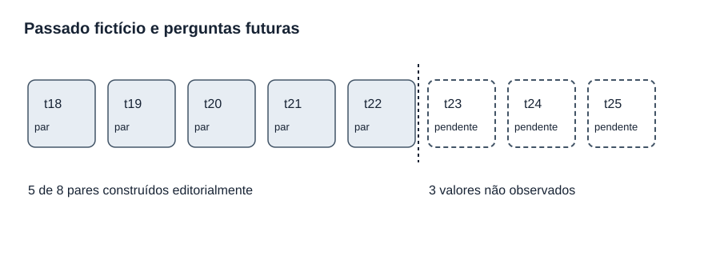
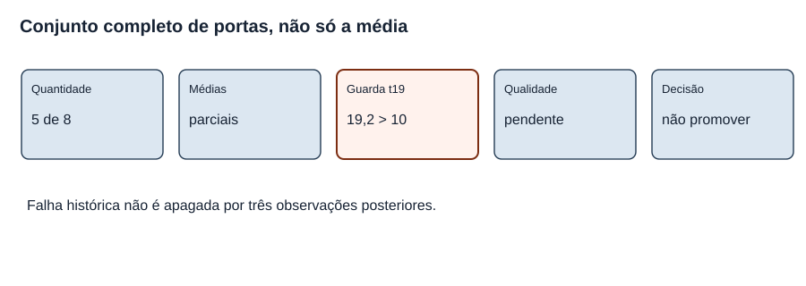
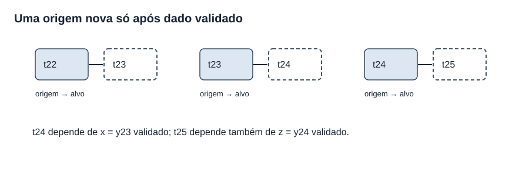
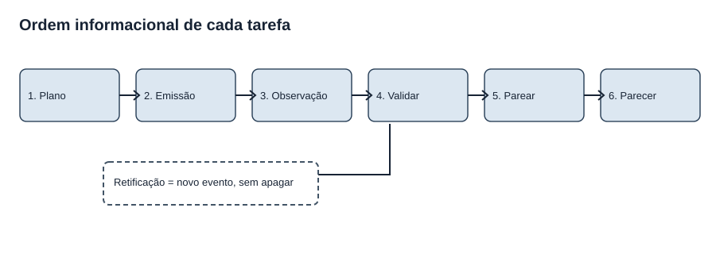
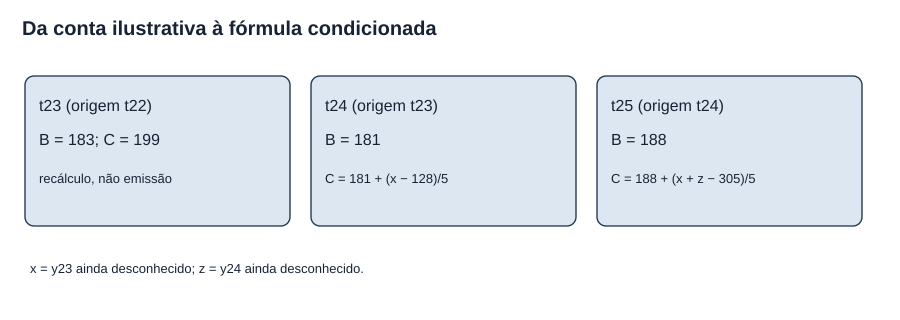
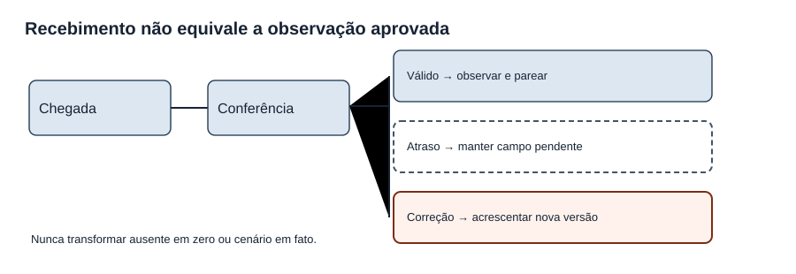

# MAT-EST-051 — Desenho de uma avaliação temporal futura: hipóteses, coleta, critérios e análise pós-registro

**Área:** Matemática. **Unidade:** Estatística — séries temporais / ponte universitária. **Nível:** 6. **Anterior:** MAT-EST-050. **Próximo, proposto:** MAT-EST-052 — Ensaio operacional de monitoramento: integridade do registro, atrasos de observação e encerramento auditável. **Material:** texto, dados, gráficos e 36 questões autorais, sem reprodução de questões oficiais. **Progresso individual:** não iniciado e inalterado.

**Estado dos dados:** os 22 pontos de t01 a t22 são números **inventados** e mantidos como narrativa histórica do projeto. Em t23, t24 e t25 **ainda não existem valores observados**. Os valores 178, 191 e 209 são três cenários alternativos *para t23*, não observações, não probabilidades e não três novas linhas de uma série. A previsão de t23 calculada retroativamente com dados até t22 é **ilustrativa**, não registro autenticado de uma emissão real naquele instante. Nenhuma decisão de produção ou ciência empírica decorre destes dados.

**Roteiro de estudo:** bloco A, 30 a 45 minutos, pergunta avaliativa, evidência e tempo informacional; bloco B, 30 a 50 minutos, protocolo, registro e critérios; bloco C, 30 a 50 minutos, análise condicionada, exercícios, relatório e revisão. Se uma fórmula não for compreendida, recuperar médias, diferenças ou funções lineares antes de passar ao próximo bloco.

## 1. Objetivos e pré-requisitos

Ao estudar e tentar as atividades, você deverá conseguir: distinguir hipótese, critério, cenário e observação; definir de antemão uma tarefa com origem e horizonte; identificar quando uma previsão passa de cálculo ilustrativo a emissão registrável; preparar um esquema auditável de coleta e versões; derivar as previsões condicionais de t24 e t25 sem acessar alvos futuros; construir métricas emparelhadas com denominador explícito; aplicar portas de decisão sem ignorar falhas históricas; explicar como dados ausentes e retificados entram em registros apend-only; e redigir uma análise pós-registro que separe resultados, ressalvas e autorização humana.

**Conhecimentos anteriores:** frações, proporções, médias, módulo, números negativos, funções simples, séries sazonais e avaliação de previsões. Na árvore do projeto, recuperar MAT-EST-031, 032, 039, 041, 042 e MAT-EST-043 a 050 quando necessário. A ligação com ENEM e vestibulares é a leitura crítica de gráficos, tabelas, proporcionalidade, formulação de hipóteses e qualidade de argumentos; governança de modelos é o aprofundamento universitário aqui proposto, **não** uma exigência curricular específica atribuída a qualquer banca.

## 2. Por que desenhar a avaliação antes de receber a resposta?

É relativamente fácil criar critérios depois de descobrir os resultados: excluir um trimestre ruim, trocar um custo ou considerar um cenário como observado. Isso produz uma história favorável, mas impede distinguir previsão genuína de explicação construída com o alvo já conhecido. Um protocolo pré-especificado indica qual pergunta será respondida, quais observações poderão entrar, quando serão obtidas, como serão comparadas e o que será feito se faltar um dado. Um registro temporal verificável estabelece a ordem entre emissão, observação e correção. Chama-se aqui **avaliação prospectiva** aquela cuja previsão e cujo protocolo existem antes de se conhecer o respectivo resultado; no presente pacote criamos apenas o **desenho didático** dessa avaliação.

O livro aberto *Forecasting: Principles and Practice*, seção 5.10, explica a avaliação por origens temporais sucessivas: cada previsão deve usar apenas observações anteriores ao alvo. A literatura de avaliação de previsões alerta também para vazamento de informação durante pré-processamento, escolha de modelo e comparação. Isso fundamenta o método geral, **não valida os valores inventados desta aula**. Fontes ao final.

**Figura 1 — Tempo da pergunta e da resposta.** Texto alternativo: uma faixa de t18 a t22 contém cinco alvos fictícios emparelhados; uma divisória separa t23 a t25 ainda sem observado. **Observe:** uma coluna futura vazia não é zero e um cenário não pode substituí-la. **Conclusão por áudio:** o desenho de avaliação precede a chegada dos resultados; não há sexto, sétimo ou oitavo par efetivo neste pacote. **Autoria:** projeto, diagrama original.

### Vocabulário que não deve ser misturado

*Hipótese* é uma proposição testável: por exemplo, “o desafiante reduzirá o MAE em pelo menos vinte por cento nos oito pares previstos”. *Critério de decisão* indica a regra operacional para permitir ou impedir uma ação; pode exigir mais do que uma hipótese média. *Cenário* é um “e se”: se t23 fosse 178, calcularíamos determinados erros. *Observação* é o valor efetivamente recebido e verificado conforme a fonte e o momento declarados; nosso mundo aqui é inteiramente fictício, mas mesmo a simulação deve respeitar suas etiquetas. *Pré-registro* é a documentação anterior ao acesso às respostas futuras. *Apend-only* significa adicionar eventos sem sobrescrever silenciosamente os anteriores: uma correção é outro evento vinculado ao registro original.

## 3. O que o projeto já possui e o que continua bloqueado

A referência sazonal `BASE-SNAIVE-v1`, abreviada B, toma o valor quatro períodos antes: \(\widehat y^B_{t\mid t-1}=y_{t-4}\). Leitura: previsão de B para o próximo período é o observado quatro períodos antes. O desafiante `CHAL-SDELTA5-v1`, abreviado C, soma a B a média de cinco diferenças sazonais recentes \(d_j=y_j-y_{j-4}\). A equação é \(\widehat y^C_{t\mid t-1}=y_{t-4}+\frac15\sum_{j=t-5}^{t-1}d_j\). Leitura: para prever t, C usa a mesma observação sazonal de B e acrescenta a média de cinco diferenças já disponíveis no fechamento do período t menos um. Nenhum parâmetro foi reaprendido aqui; trata-se das regras documentadas na MAT-EST-049.

| Alvo fictício | Origem | Observado fictício | Previsão B | Previsão C | Erro B | Erro C |
|---|---|---:|---:|---:|---:|---:|
| t18 | t17 | 176 | 151 | 166,2 | +25 | +9,8 |
| t19 | t18 | 183 | 187 | 206,2 | −4 | −23,2 |
| t20 | t19 | 181 | 160 | 177,2 | +21 | +3,8 |
| t21 | t20 | 188 | 167 | 185,2 | +21 | +2,8 |
| t22 | t21 | 193 | 176 | 195,2 | +17 | −2,2 |

O erro assinado é \(e=y-\widehat y\). Pronuncie: “erro igual a observado menos previsto”. Um sinal positivo indica que faltou previsão; um sinal negativo indica que houve previsão excessiva. A soma dos módulos é 88 para B e 41,8 para C, portanto \(MAE_B=88/5=17,6\) e \(MAE_C=41,8/5=8,36\), ambos em unidades fictícias. MAE lê-se “erro absoluto médio”. Sob o custo congelado \(C(e)=3\max(e,0)+\max(-e,0)\), as médias são 51,2 e 14,92 pontos fictícios.

**Mas:** em t19, o módulo de C foi 23,2, contra quatro de B: piora local de **19,2 unidades**. `MAT-EST-049-PROT-v1` exige pelo menos oito pares em dois ciclos sazonais; redução mínima de vinte por cento para MAE e custo médio; nenhuma piora local acima de dez unidades; qualidade auditada; aprovação humana e plano de reversão. **A falha de t19 é irrevogável para esse protocolo.** Novos dados podem completar o registro para fins pedagógicos ou fundamentar *outro* protocolo declarado antecipadamente, mas não apagar a falha nem autorizar a promoção na versão antiga. Há cinco pares completos de oito planejados. Preservamos `MAT-EST-049-PROT-v1` byte a byte.

**Figura 2 — Portas cumulativas.** Texto alternativo: há cinco de oito pares; as duas médias atuais são descritivamente menores; a guarda local t19 foi violada; auditoria e decisão humana ainda são ausentes. **Observe:** a guarda continua fechada mesmo se o total chegar a oito. **Conclusão por áudio:** atender um agregado não substitui todas as condições de aprovação. **Autoria:** projeto, diagrama original.

## 4. Perguntas e registro propostos: o que é fixo e o que é derivado

**Pergunta primária congelada herdada:** nos alvos t18 a t25, horizonte um, o candidato C pode ser analisado para promoção segundo todas as portas de `MAT-EST-049-PROT-v1`? A resposta quanto à promoção sob essa versão já é **não**, pois t19 viola uma porta. Ainda é instrutivo registrar os alvos restantes sem apagar perdas e escrever um encerramento honesto. A segunda pergunta, de aprendizagem operacional, é se o desenho permite reproduzir emissões e avaliações futuras, com origem, data de disponibilidade, versão do modelo, dados conhecidos e retificações.

**Hipóteses descritivas a verificar somente quando houver pares válidos:** H1, o MAE médio do desafiante será no máximo oitenta por cento do MAE da referência no conjunto completo t18–t25; H2, o custo médio de C, usando o *mesmo peso três* anterior, será no máximo oitenta por cento do custo médio de B; H3, nenhuma tarefa terá piora de módulo superior a dez unidades; H4, a trilha de dados terá proveniência e conferência suficientes. Escrever cada uma não a torna verdadeira. H3 já foi violada em t19. Não se atribui probabilidade de sucesso nem teste estatístico a uma amostra inventada.

**Regra de origem e alvo:** t23 deve corresponder à origem t22, t24 à origem t23, t25 à origem t24. O horizonte é sempre um período. Para cada alvo, B e C usam a mesma versão validada da observação disponível naquela origem. O objetivo primário utiliza pares, não o mesmo valor de t23 reciclado como se fossem dois alvos. Um modelo não recebe acesso a dados posteriores por antecipação.

**Figura 3 — Três origens móveis.** Texto alternativo: origem t22 aponta para alvo t23; t23 aponta para t24 apenas depois de uma observação válida; t24 aponta para t25 sob a mesma condição. **Observe:** o segundo e terceiro pares dependem da chegada dos dados anteriores. **Conclusão por áudio:** a regra de um passo só pode avançar quando há observação admitida e emissão preservada. **Autoria:** projeto, diagrama original.

### Contrato de registro prospectivo didático: `MAT-EST-051-PLAN-v1`

Este é um **plano para possível simulação posterior**, não uma alteração de `MAT-EST-049-PROT-v1` nem um log efetivamente emitido. Uma ficha de emissão precisa, no mínimo: `event_id`; `protocol_id`; `model_version`; `origin_period`; `target_period`; `horizon`; `forecast_value`; `unit`; `input_data_snapshot_id`; `input_max_period`; `issued_at` ou índice de sequência autenticado; `status`; `algorithm_version`; `digest`. A ficha de observação traz `observation_id`, `target_period`, `observed_value` ou nulo, `source`, `available_at`, `quality_status`, `data_version` e eventual referência a correção. A comparação registra os dois `event_id` compatíveis, a observação aprovada e o método de cálculo. O comunicado final lista também a quantidade de pares previstos, completos, ainda pendentes, excluídos **por regra prévia**, versões utilizadas e bloqueios.

**Sem relógio verificável, não inventar horário.** Um número de sequência de simulação pode mostrar a lógica, mas não prova ordem de eventos real. Um resumo criptográfico, como SHA-256, ajuda a verificar bytes preservados; isoladamente não prova que o arquivo existiu antes da observação nem autentica quem o produziu. Um protocolo genuinamente prospectivo exigiria trilha externa de data e controle de acesso. Não existe esse registro para t23 nesta aula.

**Figura 4 — Registro com ordem verificável.** Texto alternativo: planejamento leva a emissão imutável; depois vem observação, validação de qualidade, emparelhamento e parecer. Uma retificação entra em ramo novo, sem apagar a versão antiga. **Observe:** a observação não alimenta retroativamente a emissão antiga. **Conclusão por áudio:** corrigir dados significa adicionar uma versão e recalcular explicitamente as consequências, nunca editar previsões históricas silenciosamente. **Autoria:** projeto, diagrama original.

### Um registro inicialmente incompleto é um resultado de controle legítimo

O `plano-emissoes-pendentes-t23-t25.csv` apresenta três linhas de planejamento com `forecast_status=nao_emitido`. Na coluna de observação o estado é `nao_observado` e o valor permanece vazio. Há um CSV *separado*, `projecoes-ilustrativas-t23.csv`, para os cálculos B igual a 183 e C igual a 199, marcados como `recalculo_didatico_nao_log_autenticado`. Não copiar esses valores para um campo que indique emissão autenticada; isso seria fabricar evidência temporal. O arquivo `cenarios-herdados-t23-nao-observados.csv` mantém os cenários alternativos em sua própria classe.

## 5. Como preparar previsão futura sem revelar futuro: exemplo resolvido

No fechamento fictício de t22 temos y19 igual a 183, y20 igual a 181, y21 igual a 188, y22 igual a 193. Para t23, a referência toma y19: **B23 = 183**. As diferenças sazonais d18 a d22 são, respectivamente, 25, menos quatro, 21, 21 e 17. Somam 80; a média é 16. Assim, **C23 = 183 + 16 = 199**. Estas são contas condicionadas ao histórico, não provas de emissão em tempo real.

### 5.1 E se recebermos t23 igual a x, futuramente?

Não atribuímos número a x. Apenas demonstramos qual conta será possível **depois** de registrar e validar esse observado. Na origem t23, a referência para t24 será y20, igual a **181**. Para C24, a janela passa a d19, d20, d21, d22 e d23. Os quatro conhecidos somam menos quatro mais 21 mais 21 mais 17, igual a **55**. Como \(d_{23}=x-183\), a soma vira \(x-128\). Portanto:

\[\widehat y^C_{24\mid23}=181+\frac{x-128}{5}.\]

Leitura: “previsão C para o período vinte e quatro, feita na origem vinte e três, é cento e oitenta e um mais x menos cento e vinte e oito dividido por cinco”. O valor x é um possível observado de t23, ainda desconhecido. Não calcular uma previsão numérica para t24 sem x e depois alegar que se trata de uma emissão de horizonte um.

### 5.2 E se, mais tarde, t24 for registrado como z?

Para t25 a referência toma y21, logo **B25 = 188**. A janela de C passa a d20, d21, d22, d23 e d24: os três primeiros somam 21 mais 21 mais 17, igual a 59. O quarto é x menos 183 e o quinto é z menos 181. A soma total é \(x+z-305\). Então:

\[\widehat y^C_{25\mid24}=188+\frac{x+z-305}{5}.\]

Leitura: “previsão C para vinte e cinco é cento e oitenta e oito mais x mais z menos trezentos e cinco, tudo dividido por cinco”. Para aprender, se *hipoteticamente* x igual a 191 e z igual a 185, C24 seria 193,6 e C25 seria 202,2. Esses números permanecem em uma ficha de **exemplo condicionado**, jamais no registro de fatos do estudo. Em especial, o cenário 191 já existia como uma das alternativas t23 na aula anterior, sem probabilidade ou status observado.

**Figura 5 — Valores ainda desconhecidos.** Texto alternativo: B23 e C23 têm valores ilustrativos 183 e 199, enquanto C24 depende de x, o ainda não observado t23, e C25 depende de x e z, sendo z o ainda não observado t24. **Observe:** cada variável aparece apenas depois que a origem autorizada a conhece. **Conclusão por áudio:** fórmula simbólica permite planejar sem preencher indevidamente o futuro. **Autoria:** projeto, diagrama original.

## 6. Critérios e denominadores: planejar a conta antes do resultado

Para um conjunto de N pares elegíveis, compare erro absoluto médio, MAE, separadamente, mas no **mesmo alvo e horizonte**:

\[MAE_M=\frac{\sum_{i=1}^{N}|y_i-\widehat y_{M,i}|}{N}.\]

Leitura: “erro absoluto médio do modelo M é a soma de N módulos de observado menos previsto, dividida por N”. A unidade é a mesma da série. O custo médio congelado usa \(C(e)=3\max(e,0)+\max(-e,0)\), em pontos fictícios por previsão. O ganho descritivo relativo em MAE é \(G_{MAE}=1-MAE_C/MAE_B\), lido “um menos o erro médio de C dividido pelo erro médio de B”, se o denominador for maior que zero. Para o custo, a forma é análoga. Se o denominador for zero, a razão fica indefinida e um protocolo deveria dizer como tratar esse caso, em vez de inventar percentuais.

Há dois limiares de vinte por cento: \(MAE_C\leq0,8\,MAE_B\) e \(\overline C_C\leq0,8\,\overline C_B\). Leitura: a média do desafiante deve ser no máximo oitenta por cento da média da referência em cada métrica. Além disso, para **todo alvo elegível**, \(|e_C|-|e_B|\leq10\) unidades; pronuncie “módulo do erro do candidato menos módulo do erro da referência deve ser menor ou igual a dez”. A desigualdade falhou em t19: 23,2 menos quatro igual a 19,2. Isso não pode ser reparado calculando outra média.

| Critério do protocolo herdado | Estado demonstrado até t22 | Situação |
|---|---|---|
| Oito pares t18–t25, mesmo horizonte | Cinco completos, três futuros | Pendente |
| Redução MAE pelo menos 20% | Resultado parcial 52,5% | Descritivo, não final |
| Redução de custo médio pelo menos 20%, peso 3 | Resultado parcial cerca de 70,86% | Descritivo, não final |
| Piora local nunca acima de dez | t19 igual a 19,2 | **Falhou** |
| Auditoria, autorização humana, rollback | Não realizados | Pendente |

**Síntese por áudio:** completar mais três linhas não elimina a falha ocorrida em t19; por isso o status de promoção sob este protocolo permanece bloqueado. Os resultados agregados parciais são medidas sobre cinco pares sintéticos, não inferência para oito tarefas nem para demandas reais. O documento de planejamento não modifica os limiares antigos.

### Exemplo de contagem com atraso

Suponha que duas previsões novas foram **devidamente emitidas e registradas**, mas chegou apenas uma observação de qualidade aprovada. A contagem de pares elegíveis sobe em um, não em dois. O outro alvo permanece pendente. Nunca preencher zero, usar o cenário 178 como substituto ou dividir a soma pelo total planejado como se todas as observações existissem. É necessário reportar `N_planejado`, `N_emitido`, `N_observado_validado`, `N_pareado` e `N_pendente`. Uma eventual exclusão deve decorrer de regra documentada, com razão e histórico preservados.

## 7. Falhas de coleta e correções: governança antes do cálculo

O valor observado pode chegar atrasado, duplicado, com unidade errada ou sujeito a retificação. O fluxo recomendado para o projeto simulado é: receber em quarentena; conferir período, tipo, fonte e unidade; registrar `observation_id` e versão; comparar com os eventos de emissão anteriores; aceitar ou classificar a divergência; calcular métricas apenas em pares válidos; produzir relatório com denominadores. Uma retificação jamais deve apagar a versão inicial. Um evento `OBS-CORRECTION` aponta para o anterior, relata motivo e mantém os dois valores, o momento em que se tornaram disponíveis e o efeito sobre o parecer.

Imagine, **apenas como demonstração**, uma futura linha t23 inicialmente registrada como 191 e corrigida para 190 depois. A emissão B23=183 e C23=199 teria de permanecer com o mesmo valor se tiver registro prévio válido; os erros calculados seriam atualizados com rastro de versões. A nova observação não pode ser usada para refazer a previsão original. Neste pacote, porém, 191 e 190 **não são observações**, nem há evento efetivamente corrigido em t23. Este exemplo serve para ensinar a operação, não para criar dados.

**Figura 6 — Qualidade sem preenchimento enganoso.** Texto alternativo: dado recebido entra em conferência; se válido, torna-se elegível; se atrasado, permanece pendente; se incorreto, retificação é evento novo e mantém a versão antiga. **Observe:** não há seta que transforme o campo vazio em zero ou cenário. **Conclusão por áudio:** métricas só podem usar observações aceitas e previsões comprovadamente anteriores aos alvos. **Autoria:** projeto, diagrama original.

### Uma tabela mínima para publicação e auditoria

| Campo de saída | Conteúdo exigido |
|---|---|
| Pergunta e amostra | Períodos-alvo, horizonte, número previsto e número completo |
| Proveniência | Fonte, data/ordem confiável, versões dos dados e modelos |
| Desempenho | MAE, custo, piora local e respectivos denominadores |
| Irregularidades | Atrasos, ausências, correções, duplicações, janela sazonal |
| Decisão | Portas individualmente, responsável humano e versão da decisão |
| Limitação | Série sintética, seleção do candidato e não generalização |

Dizer apenas “o candidato reduziu o MAE” oculta a falha t19 e a incompletude da amostra. Dizer “não promover” sem registrar as médias também seria um relatório empobrecido. Boa comunicação inclui os dois lados, as condições e as reservas.

## 8. Como separar análise registrada, exploração e mudança de protocolo

O plano proposto mantém `MAT-EST-049-PROT-v1` intacto como base do exercício. Qualquer teste de sensibilidade à retirada de uma linha, ao peso do custo ou a cenários de t23 pode acompanhar o relatório em apêndice rotulado **exploratório**. Uma alteração de regra para um novo ciclo deve ser escrita como novo ID antes de ver os resultados daquele ciclo e não ser apresentada como cumprimento do protocolo antigo. O modelo em sombra pode permanecer disponível para estudo, sujeito a qualidade e responsabilidade, sem ser promovido. O momento de emissão e o momento de avaliação são duas etapas separadas; o envio dos valores hipotéticos 178, 191 ou 209 a uma planilha de observados destruiria essa separação.

Em um sistema de aprendizagem, o mesmo cuidado se aplica à avaliação do aluno: produzir aula não é realizar tentativa. Este pacote não registra estudo, pontuação, revisão feita ou consolidação. A revisão poderá ser programada em um, sete e trinta dias **depois de tentativa efetiva**, não depois da geração do material.

## 9. Exemplo completo de relatório de pré-registro, sem inventar resultado

**Pergunta:** o ciclo de oito tarefas sazonais de horizonte um compara B e C nos mesmos alvos t18 a t25, segundo a regra congelada `MAT-EST-049-PROT-v1`. T18 a t22 são pares editoriais sintéticos já existentes; t23 a t25 continuam sem observado e sem log autenticado de emissão futura.

**Procedimento:** preservar o arquivo do protocolo, regras de B e C, janela de cinco diferenças e a métrica assinalada. Ao fechar uma origem, validar as entradas, calcular as duas previsões e registrar eventos imutáveis antes de admitir o alvo. Receber cada resultado com proveniência, permitir retificação como nova versão, parear somente eventos elegíveis e calcular MAE, custos e perdas locais. Separar dúvidas exploratórias do teste congelado.

**Estado:** há cinco pares no roteiro sintético, MAE B=17,6 e C=8,36, custo médio B=51,2 e C=14,92; em t19 a piora do erro absoluto de C foi 19,2, ultrapassando dez. A regra herdada já impede promoção. O objetivo de preencher eventual avaliação restante é documentar, ensinar e auditar, não apagar esse resultado.

**Limitações e próximos controles:** os dados são criados para aprender e não há uma avaliação temporal prospectiva real; não se conhecem observações futuras nem probabilidades de seus cenários. A condição de confiabilidade da coleta e a autorização humana não foram satisfeitas. Antes de qualquer uso externo, seriam necessários fontes autênticas, protocolo efetivamente datado, proteção contra vazamento, monitoramento adequado e validação específica no contexto de aplicação.

## 10. Erros recorrentes e ligações conceituais

**Erros frequentes:** registrar cenário como observado; afirmar que uma conta feita hoje foi uma previsão autenticada ontem; confundir três cenários do mesmo alvo com três pares independentes; misturar horizontes; alterar o peso três após ver o resultado e atribuí-lo ao protocolo anterior; reemitir previsão depois de conhecer a resposta; apagar uma falha individual por causa de médias favoráveis; usar como denominador oito quando só cinco pares existem; tratar ausência como zero; confundir hash com carimbo temporal; perder a versão corrigida de um dado; declarar validação externa para série criada editorialmente.

**Relações com outras matérias:** funções e álgebra permitem manter x e z simbólicos, sem fingir observações; em Língua Portuguesa e Redação, hipóteses e limitações precisam ser escritas de forma verificável; em Ciências, pré-registro ajuda a separar teste de exploração; em tecnologia, esquema de eventos, controle de versões e hashes apoiam reprodutibilidade; em Educação Matemática, uma explicação narrada deve dizer como a figura comunica a separação entre passado e futuro. Em contextos públicos ou de saúde, o exercício não autoriza previsão real de atendimento nem regra operacional para pessoas.

## 11. Vídeo complementar e leitura verificada

**Vídeo:** [Forecasting: Principles & Practice — 5.10 Time series cross-validation](https://www.youtube.com/watch?v=OGpENuxjRWM), **canal OTexts**, em inglês, publicado em 5 de março de 2023 conforme resultado indexado do YouTube. **Duração:** não confirmada; não reproduzimos integralmente o vídeo e o carregamento direto do YouTube não foi concluído neste ambiente. Seu título e a vinculação com a coleção do livro estão disponíveis. **Assistir depois da seção 4**, para reforçar a regra de que cada origem usa apenas informações anteriores ao alvo. A aula permanece completa sem o vídeo. Conferir a reprodução direta e legendas antes da publicação no site.

**Leituras:** Hyndman e Athanasopoulos, [*Forecasting: Principles and Practice*, 3ª ed., seção 5.10: Time series cross-validation](https://otexts.com/fpp3/tscv.html) e [seção 5.8: Evaluating forecast accuracy](https://otexts.com/fpp3/accuracy.html); [artigo científico sobre erros comuns em avaliação de previsões](https://link.springer.com/article/10.1007/s10618-022-00894-5), publicado em 2022, edição 2023. A fundamentação bibliográfica refere-se a método, não a um resultado factual da série inventada.

## 12. Atividades graduais e correção

Os enunciados completos estão em `exercicios.md` e `exercicios.json`: dez de aprendizagem básica, dez de consolidação, dez autorais em estilo vestibular e seis de reteste em outra sessão, totalizando **36 questões autorais**. A resolução individual, com justificativa, conferência das contas e categoria provável de erro, está **separada** em `gabarito-comentado.md` e `gabarito-comentado.json`. Não exibir automaticamente a resposta antes da tentativa; nenhuma dessas questões é oficial de ENEM, FUVEST, UNICAMP ou UNESP.

**Orientação de resolução:** em toda questão pergunte primeiro qual é a origem informacional, qual é o alvo, qual o status do número (registrado, hipotético ou pendente), que operação é necessária e que afirmação os dados autorizam. Refaça contas sem gabarito antes de classificar o erro em conteúdo, interpretação, cálculo, distração, memória, estratégia ou tempo.

## 13. Resumo pronunciável para ouvir

Uma previsão só pode ser avaliada de modo prospectivo quando a sua origem, versão e valor já estavam registrados antes de conhecer a resposta. Até t22 há cinco pares criados editorialmente, enquanto t23 a t25 ainda não possuem valores observados. Os cálculos B23 igual a cento e oitenta e três e C23 igual a cento e noventa e nove são reconstruções didáticas com dados até t22, não prova de emissão em campo. Para prever t24 em horizonte um, dependemos de um x que represente o futuro observado de t23, devidamente validado; para t25, dependemos também de z, futuro observado de t24. A amostra tem cinco pares, não oito. O erro pior do desafiante em t19 foi dezenove vírgula dois unidades acima do erro da referência, infringindo a guarda de dez unidades; nenhuma média posterior apaga essa falha histórica no protocolo antigo. Planejar não é observar, registrar não é avaliar, corrigir não é sobrescrever, e concluir exige mostrar tanto a conta quanto os limites.

**Revisão espaçada após tentativa real:** no primeiro retorno, reproduza uma origem, um alvo e a distinção cenário versus observado. Após sete dias, derive novamente C24 em função de x e monte a tabela de critérios com denominadores. Após trinta dias, resolva o reteste sem consultar o gabarito e escreva um pré-registro de um parágrafo e um parecer de resultados de dois parágrafos. Se um cálculo travar, retome sua operação elementar e reteste; não alterar progresso individual por leitura ou por geração editorial.

**Próximo passo editorial proposto:** MAT-EST-052 — Ensaio operacional de monitoramento: integridade do registro, atrasos de observação e encerramento auditável. Não criar observações para t23 a t25 automaticamente e não declarar execução de uma avaliação prospectiva real.

**Limites desta entrega:** arquivos locais, sem sincronização com Google Drive ou GitHub, publicação ou teste real do Edge, e sem verificação de reprodução integral do vídeo. Nenhuma tentativa de estudante foi fornecida nesta geração.
