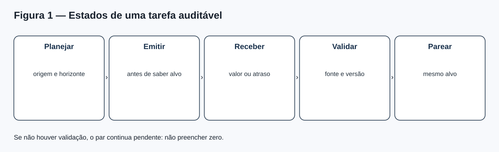
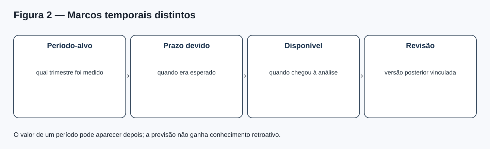
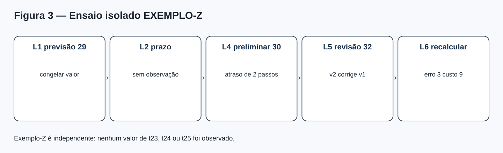
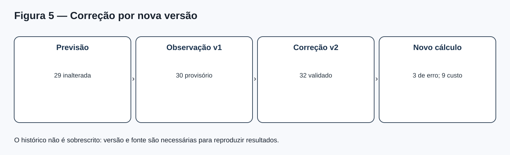
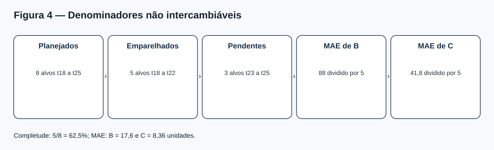
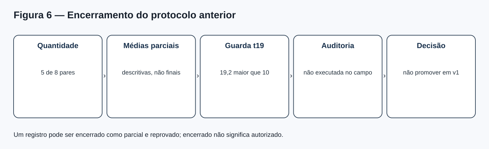

# MAT-EST-052 — Ensaio operacional de monitoramento: integridade do registro, atrasos de observação e encerramento auditável

**Área:** Matemática. **Unidade:** Estatística — séries temporais / ponte universitária. **Nível:** 6. **Anterior:** MAT-EST-051. **Próximo proposto:** MAT-EST-053. **Origem:** aula, diagramas e exercícios autorais. Questões oficiais: zero. **Progresso individual:** não iniciado; a produção deste material não significa estudo nem aprovação.

**Situação editorial e fronteira factual.** Os períodos t01 a t22 constituem uma narrativa com dados inteiramente inventados. Os períodos t23, t24 e t25 **não têm valores observados nem emissões autenticadas**. A referência `BASE-SNAIVE-v1`, abreviada B, e o desafiante `CHAL-SDELTA5-v1`, abreviado C, permanecem sujeitos ao protocolo `MAT-EST-049-PROT-v1`. Os exemplos de eventos desta aula vivem no espaço separado `EXEMPLO-Z-ISOLADO`: são um ensaio de funcionamento, não observações da série nem prova de operação real. Os arquivos herdados foram copiados sem alterações.

**Organização em três blocos:** A — 30 a 45 minutos: identidade e ordem dos eventos; B — 30 a 50 minutos: atraso, validação, retificação e contas; C — 30 a 50 minutos: relatórios, encerramento, aplicação e exercícios. Não é uma matéria por dia; o avanço depende de compreensão demonstrada.

## 1. Objetivos, dependências e pergunta central

Após estudar e tentar as atividades, o estudante deve conseguir separar previsão planejada, emissão comprovada, dado recebido, dado validado e avaliação; identificar origem, alvo e horizonte; mostrar por que a ordem informacional importa; explicar os marcos temporais de uma observação — período que representa, prazo, data de disponibilização e data de revisão —; organizar eventos sem sobrescrita silenciosa; distinguir atraso, ausência, quarentena e valor zero; recalcular uma avaliação após retificação sem reescrever a previsão; escolher corretamente os denominadores das métricas; e redigir encerramento que não transforme documentação completa em autorização para promover um modelo.

**Pré-requisitos:** subtração, módulos, porcentagem e média; noções de variáveis, lógica condicional e sequência temporal; MAT-EST-031/032, MAT-EST-042 e o encadeamento MAT-EST-047 a 051. Em caso de dificuldade com 5 dividido por 8 ou com o sinal de um erro, reconstruir primeiro essa operação. **Relação com exames:** habilidades gerais de tabelas, gráficos, razão e interpretação sustentam ENEM e vestibulares; versionamento de avaliação de modelos constitui aprofundamento universitário, sem alegação de exigência específica por banca.

**Pergunta motivadora.** Se um resultado chega tarde, é depois corrigido, e alguém recalcula a previsão, qual dos números retrata o que se sabia *antes* da resposta? A avaliação séria exige uma trilha que preserve o passado informacional. Uma planilha com o último número disponível, mas sem histórico de quando ele apareceu, não basta para provar uma previsão genuinamente prospectiva.

## 2. Explicação intuitiva: previsão é compromisso antes da resposta

Pense numa prova entregue ao professor. Você pode corrigir seu raciocínio depois da devolução, mas não pode chamar a resposta revisada de resposta entregue antes da correção. O mesmo ocorre com modelos temporais. A previsão deve guardar qual origem foi usada, qual valor foi emitido, qual modelo o produziu, qual versão de dados estava acessível e como se comprova a ordem de emissão. Quando a observação chega, ela forma outro registro; quando é corrigida, a correção deve apontar para a versão anterior. Mais tarde, podemos calcular o erro com uma versão de dado explicitamente nomeada.

A abordagem de validação por origens móveis apresentada em *Forecasting: Principles and Practice*, seção 5.10, usa apenas observações anteriores ao alvo no treinamento e na previsão. O ensaio de log aqui é uma proposta didática para tornar verificável essa separação. **Um hash calculado agora confere integridade do arquivo a partir de agora; sozinho, não prova que houve uma emissão na data histórica que alguém escreveu no registro.** Essa prova depende de controles externos confiáveis, como autenticação, relógios, controles de acesso e arquivamento verificável.

**Figura 1 — Estados da tarefa.** Texto alternativo: planejar com origem e horizonte, emitir antes da resposta, receber dado ou atraso, validar fonte e versão, formar par com alvo comum. **Observe:** receber não equivale a validar. **Conclusão por áudio:** sem emissão demonstrável e sem observação validada, ainda não há um par final elegível para as métricas. **Autoria:** projeto, SVG original.

## 3. Uma linguagem formal para o registro

Uma tarefa é identificada pela origem o, pelo horizonte h e pelo alvo o mais h. A previsão do modelo m é escrita como \(\widehat y^m_{o+h\mid o}\). Leitura: valor estimado por m para o alvo, calculado usando informações disponíveis na origem. O erro assinado, se houver observação validada, é \(e^m_{o,h}=y_{o+h}-\widehat y^m_{o+h\mid o}\). Leitura: observado menos previsto. O sinal positivo indica subprevisão; negativo, superprevisão.

Para um registro auditável, cada **emissão** deveria ter `event_id`, `protocol_id`, `model_version`, `origin_period`, `target_period`, `horizon`, valor, unidade, `input_data_snapshot_id`, `input_max_period`, ordenação autenticada, versão do algoritmo e digest. Deve satisfazer: o maior período dos dados de entrada não passa da origem. Também se exige evidência de que a emissão precedeu o conhecimento do alvo. Previsões B e C para a mesma comparação precisam referir-se ao mesmo alvo, horizonte e convenção de dados disponível naquela origem.

Uma **observação** deveria registrar `observation_id`, alvo, fonte, valor (ou nulo), horário de disponibilidade, estado de qualidade, versão e, se for retificação, vínculo `corrects_event_id`. O vínculo é crucial: não se apaga a versão anterior apenas para que a base pareça limpa. A escolha de qual versão da observação vale no fechamento deve ser declarada no protocolo ou na política de avaliação.

Um **par avaliável** combina as duas previsões comparáveis com uma observação validada específica. Guarda os IDs dessas três evidências, erros assinados, módulos, custos e deterioração local. Identificadores permanentes impedem que a mesma observação seja contada duas vezes no mesmo conjunto de tarefa-alvo. **Observação nula não deve virar zero nem uma previsão ilustrativa deve virar emissão autenticada.**

**Figura 2 — Período e disponibilidade.** Texto alternativo: quatro caixas distinguem período-alvo, prazo esperado, momento em que o dado ficou disponível e revisão posterior. **Observe:** uma revisão pode alterar o valor conhecido para um período antigo sem mudar o que estava disponível na origem histórica. **Conclusão por áudio:** tempo representado pelo dado e tempo em que conhecemos o dado são dimensões diferentes. **Autoria:** projeto, SVG original.

### Tempo de referência, prazo, disponibilidade e revisão

Um dado pode representar o trimestre t, mas só ser publicado alguns dias depois. Definimos, por convenção do exercício, o atraso como \(L = \max(0,a-d)\), em que a é a ordem ou horário de disponibilidade e d é o prazo estabelecido, na mesma unidade. Leitura: atraso é o maior entre zero e o instante de chegada menos o prazo. **Essa medida só faz sentido quando prazo, calendário e unidade foram definidos previamente.** Se um arquivo era esperado no segundo passo e chegou no quarto, o atraso foi de dois passos. Não é legítimo converter automaticamente passos didáticos em dias reais.

## 4. Exemplo guiado: ensaio isolado sem alterar a série

No espaço independente `EXEMPLO-Z-ISOLADO`, imaginamos uma previsão congelada de 29 unidades no passo lógico L1. O registro do evento identifica a previsão como fictícia, não como emissão histórica da série do projeto. A fonte deveria informar a observação em L2, mas nada foi recebido até L4. Em L4, chega 30, marcado **provisório**. Em L5, uma revisão validada corrige o mesmo alvo para 32 e aponta explicitamente a versão anterior. Em L6, o relatório recalcula os resultados usando a versão validada.

1. A chegada provisória ocorreu no passo quatro; o prazo era o passo dois. O atraso didático foi quatro menos dois, isto é, **dois passos**.
2. Com a observação provisória 30, o erro calculado seria 30 menos 29, igual a **+1 unidade**. Sob a regra congelada de custo assimétrico, o custo provisório é **3 pontos fictícios**; ele não entra numa métrica *final* enquanto a fonte não for validada.
3. Depois da retificação para 32, a previsão **continua 29**. O erro para a versão validada é 32 menos 29, igual a **+3 unidades**. O custo correspondente é **9 pontos fictícios**.
4. O evento de retificação referencia o evento do dado 30. O recálculo referencia a retificação; assim é possível explicar por que um relatório preliminar e outro final possuem resultados diferentes sem falsificar a sequência.

A regra de custo herdada é \(C(e)=3\max(e,0)+\max(-e,0)\). Leitura: três vezes a parte positiva do erro, somada ao módulo da parte negativa. A regra penaliza subprevisão três vezes mais que superprevisão de igual magnitude **nesta simulação**; não é padrão universal. O protocolo previamente documentado do projeto, `MAT-EST-049-PROT-v1`, não foi alterado.

**Figura 3 — EXEMPLO-Z.** Texto alternativo: L1 previsão 29; L2 prazo; L4 chegada provisória 30; L5 revisão validada 32; L6 recálculo de erro três e custo nove. **Observe:** a previsão não é alterada quando muda a observação. **Conclusão por áudio:** esta sequência demonstra versionamento sem produzir qualquer observação para t23, t24 ou t25. **Autoria:** projeto, SVG original.

### Log apend-only e integridade

O arquivo `dados/ensaio-eventos-EXEMPLO-Z.jsonl` contém sete registros de ensaio, cada um com identificador, sequência, espaço lógico, tipo, payload, digest anterior e digest próprio. Para produzir um digest, serializamos os campos de cada evento em ordem determinística e aplicamos SHA-256; cada novo registro aponta para o digest anterior. Se um registro intermediário fosse alterado depois, uma verificação de toda a cadeia detectaria inconsistência **desde que se retenha uma âncora confiável e se confira a cadeia original**. Não se trata de assinatura digital nem de prova independente de data real. Os eventos são demonstrações didáticas, não logs operacionais externos.

A propriedade importante não é o nome em inglês, mas o procedimento: **acrescentar um novo evento, preservando o anterior**. Corrigir dado não autoriza editar silenciosamente o valor de uma previsão passada. Se a fonte estiver indisponível, criar um evento de indisponibilidade com valor nulo, motivo e tentativa de coleta — não inventar um número. Se receber um valor provisório, registrar a política de quarentena ou uso provisório, sem confundir com o conjunto final.

**Figura 4 — Duas versões de uma resposta.** Texto alternativo: previsão 29; observação provisória versão um igual a 30; correção validada versão dois igual a 32; novo erro três e custo nove. **Observe:** ambos os eventos observacionais permanecem. **Conclusão por áudio:** auditoria preserva o que foi conhecido em cada momento, inclusive evidências posteriormente corrigidas. **Autoria:** projeto, SVG original.

## 5. Dados atrasados, pendentes, inválidos e zeros verdadeiros

Quatro situações exigem respostas diferentes. **Pendente:** o alvo ainda não amadureceu ou a fonte ainda não publicou; não há valor. **Atrasado:** o prazo de entrega já passou conforme calendário previamente declarado; ainda não há dado elegível. **Em quarentena:** algo foi recebido, mas falta comprovar qualidade, fonte ou definição. **Zero observado:** a fonte validou efetivamente uma medida numérica igual a zero. Só o último é zero. Se o sistema substituir ausente por zero, tanto o erro quanto o custo podem ser distorcidos.

Exemplo numérico independente da série: previsão 12; fonte não entregou o resultado. Como não há observado, **não é possível calcular** 0 menos 12. Se, em outra tarefa, a fonte validasse um observado genuinamente zero, o erro seria −12, o módulo seria doze, e o custo assimétrico seria doze pontos. Mesmo símbolo gráfico vazio e zero exibido com fonte confirmada têm consequências radicalmente diferentes.

Também é essencial estabelecer uma política para dados que chegam *depois* do fechamento. Um relatório congelado precisa informar a versão de dados utilizada; um relatório revisto pode incorporar a nova informação, desde que identifique ambos, anote o motivo e evite misturar versões dentro da mesma métrica. Não há obrigação de usar sempre o primeiro ou o último valor: a pergunta avaliativa e o protocolo decidem qual versão é pertinente, mas a escolha não deve ser feita retroativamente para favorecer um modelo.

## 6. O que realmente se sabe sobre a sequência t18–t25

A narrativa anterior já possui cinco pares editoriais simulados t18 a t22. A tabela abaixo não inclui `EXEMPLO-Z`, que vive em um espaço independente.

| Conjunto didático | Valor | Significado |
|---|---:|---|
| Tarefas planejadas t18–t25 | 8 | Oito alvos do protocolo anterior |
| Pares já documentados t18–t22 | 5 | Cinco comparações simuladas no material anterior |
| Tarefas futuras t23–t25 | 3 | Sem observação registrada e sem emissão autenticada |
| Soma de módulos B nos cinco pares | 88 | Erros absolutos da referência |
| Soma de módulos C nos cinco pares | 41,8 | Erros absolutos do desafiante |
| MAE parcial B | 17,6 | 88 dividido por 5 |
| MAE parcial C | 8,36 | 41,8 dividido por 5 |

**Síntese para ouvir:** foram planejados oito alvos; apenas cinco possuem pares no cenário didático anterior. A completude é cinco dividido por oito, equivalente a **62,5 por cento**, mas a métrica de erro é calculada sobre cinco observações elegíveis, nunca dividindo a soma por oito. Os três alvos restantes continuam sem valores observados. Uma taxa de pontualidade exigiria, além disso, prazos reais ou lógicos previamente definidos e informações sobre quais alvos já venceram; não se pode chamar automaticamente as três tarefas futuras de atrasadas.

A média de erros absolutos, MAE, tem a forma \(MAE=\frac1n\sum_{i=1}^n |e_i|\). Leitura: somar o módulo de cada erro avaliável e dividir pelo número de pares válidos daquele conjunto. Se os três resultados futuros não existem, o denominador atual é cinco. A proporção de conclusão é outra fórmula: pares válidos divididos pelos pares planejados, ou cinco sobre oito. **A contagem de pares deve considerar mesma origem, mesmo alvo e mesmo horizonte para os dois modelos, não duplicar alvos com lançamentos retificados.**

**Figura 5 — Cinco não são oito.** Texto alternativo: oito alvos planejados, cinco pares simulados e três pendentes; MAE da referência é 88 dividido por cinco e do desafiante 41,8 dividido por cinco. **Observe:** o denominador de completude e o de erro respondem a perguntas diferentes. **Conclusão por áudio:** dados faltantes não entram como zero e não criam novos pares. **Autoria:** projeto, SVG original.

### Previsões t23, t24 e t25: só o que foi realmente preparado

O material MAT-EST-051 forneceu recálculos **ilustrativos, não emissões temporalmente autenticadas** para t23: B igual a 183 e C igual a 199, computados com informações até t22. Os cenários alternativos 178, 191 e 209 para t23 são perguntas do tipo “e se”, não são medidas nem três amostras independentes. No plano condicional, chamando o futuro observado validado de t23 de x e o de t24 de z, obtivemos B24 igual a 181; C24 igual a 181 mais (x menos 128) dividido por cinco; B25 igual a 188; C25 igual a 188 mais (x mais z menos 305) dividido por cinco. Essas fórmulas não geram emissão válida sem os dados, versões e a sequência temporal correspondentes. Como não há observação válida para x ou z, **não substituiremos variáveis por valores fabricados**.

O caderno herda dez CSVs do pacote 051, incluindo seis arquivos históricos que esse pacote já havia preservado. Ele acrescenta somente novos artefatos explicitamente rotulados como ensaios (`EXEMPLO-Z` ou checklist); a base histórica e o protocolo de comparação permanecem byte a byte.

## 7. Encerramento auditável não é promoção

Um processo pode ser encerrado sob diferentes motivos: concluído com todas as evidências; concluído com decisão negativa; interrompido por qualidade insuficiente; ou fechado **parcialmente** para documentar limites de uma simulação. Encerrar não significa demonstrar desempenho superior, autorizar implementação ou dispensar revisão humana. Uma boa ficha de encerramento precisa enumerar o planejado, o efetivamente registrado, versões, datas ou ordens confiáveis, atrasos, correções, critérios, cálculos, limitações, responsáveis e decisão. Neste projeto, só produzimos uma **ficha-modelo de encerramento editorial**, não o fechamento de uma operação externa.

O `MAT-EST-049-PROT-v1` exige oito pares e todos os seguintes requisitos cumulativos: MAE de C no máximo 80 por cento do MAE de B; custo médio de C no máximo 80 por cento do custo médio de B, conservando o peso três; nenhuma piora local de módulo acima de dez unidades; qualidade auditada; aprovação humana, controle de versão e possibilidade de reversão. Com apenas cinco de oito pares, ainda falta informação. Além disso, no alvo t19 o erro absoluto de C foi 23,2 contra quatro de B: a deterioração local, vinte e três vírgula dois menos quatro, é **19,2 unidades**, acima de dez. Assim, **não se promove C sob essa versão congelada** mesmo que uma média parcial seja numericamente melhor. Dados novos não apagam a ocorrência anterior. Uma política alternativa exigiria outro protocolo explícito, nunca uma reescrita retroativa.

**Figura 6 — Uma porta já falhou.** Texto alternativo: cinco de oito pares, médias parciais, deterioração local t19 igual a 19,2 maior que dez, auditoria externa não executada e decisão de não promover na versão um. **Observe:** documentação e aprovação são etapas diferentes. **Conclusão por áudio:** um resultado parcial não invalida uma salvaguarda previamente fixada. **Autoria:** projeto, SVG original.

### Modelo de relatório de encerramento, em linguagem verificável

**Objeto e contexto:** “Relatamos o ensaio editorial fictício de monitoramento e controle de versões, sem operação sobre dados externos ou instituições reais.”

**Evidência e qualidade:** “Estão documentados cinco pares simulados entre t18 e t22, enquanto t23 a t25 não apresentam observações registradas ou emissões autenticadas; os eventos de atraso e correção usam um conjunto de exemplo isolado.”

**Resultados:** “Nos cinco pares documentados, MAE de B é 17,60 e MAE de C é 8,36 unidades; a completude em relação a oito alvos planejados é 62,5 por cento. Em t19, o candidato apresentou deterioração local de 19,2 unidades, superior à guarda de dez.”

**Parecer e limites:** “O protocolo MAT-EST-049-PROT-v1 não autoriza promover o candidato. O relatório registra uma conclusão didática e uma estrutura de evidências; não demonstra coleta prospectiva de campo, validade populacional, aprovação humana nem testes de acesso no ambiente final.”

## 8. Erros comuns e ligações com outras áreas

Confundir zero e ausente é um erro de **conteúdo e interpretação**. Dividir a soma dos erros por oito quando só existem cinco pares válidos é um erro de **estratégia de cálculo**. Trocar o resultado de uma previsão após saber a observação é **vazamento informacional e violação de protocolo**. Usar uma correção sem preservar a versão anterior prejudica **rastreabilidade**. Assumir que a presença de um hash prova um horário de emissão passado confunde **integridade com autenticação temporal**. Recontar duas revisões do mesmo alvo como dois pares gera **duplicação**. Transformar uma média parcial favorável em autorização ignora **guardas e decisão humana**.

**Aplicações:** metodologia científica (registro antes de conhecer resultado e trilha de retificações), língua portuguesa (relatórios com premissas e limitações), computação (eventos, versões, testes de integridade), jornalismo de dados (diferença entre número preliminar e revisado) e gestão de operações (prazo, disponibilidade, auditoria). Nos exemplos, não há recomendação administrativa, médica ou financeira real derivada de números inventados.

## 9. Prática independente em três camadas

O arquivo `exercicios.md` apresenta dez questões de aprendizagem, dez de consolidação e dez autorais no estilo contextualizado de vestibular, além de seis itens de reteste. A descrição “estilo vestibular” indica formato cognitivo; **nenhuma** é questão oficial de ENEM, FUVEST, UNICAMP ou UNESP. Responda antes de abrir `gabarito-comentado.md`. Em cada correção, registre motivo provável do erro: conteúdo, interpretação, cálculo, distração, memória, estratégia ou tempo. O gabarito individual explica o raciocínio e evita apenas apresentar uma letra.

**Autoverificação antes de corrigir:** consigo definir a origem e o alvo? O dado é observado, provisório, cenário ou desconhecido? O denominador corresponde à pergunta? Sei mostrar a ordem em que a informação ficou disponível? A regra de decisão foi definida antes dos resultados? Minha conclusão explicita as limitações?

## 10. Vídeo complementar e fontes

**Vídeo:** [Forecasting: Principles & Practice — 5.10 Time series cross-validation](https://www.youtube.com/watch?v=OGpENuxjRWM), canal **OTexts**, inglês, duração aproximada de **16 minutos e 35 segundos** conforme índice público consultado (não aferida por reprodução integral). Assista depois da seção 3. Foi selecionado para reforçar o princípio de que cada previsão deve usar apenas informação anterior ao seu alvo. Não ensina sozinho a implementação do nosso log de eventos: essa parte está integralmente explicada no texto. O link foi encontrado no índice público do YouTube e associado à seção oficial do livro; a reprodução integral e os recursos de legendas devem ser conferidos antes da publicação.

**Referências externas consultadas:** Rob J. Hyndman e George Athanasopoulos, [*Forecasting: Principles and Practice*, seção 5.10 — validação cruzada temporal](https://otexts.com/fpp3/tscv.html). Croushore, [*Forecasting with Real-Time Macroeconomic Data*](https://www.sciencedirect.com/science/article/pii/S1574070605010177), referência de apoio sobre revisões e versões de dados; seus exemplos empíricos não são transferidos para a base fictícia. **Fonte interna primária para o caso:** dados e protocolo preservados de MAT-EST-049 a 051.

## 11. Resumo para ouvir e revisão espaçada

**Resumo por áudio:** Uma previsão é um compromisso registrado antes da resposta. A observação pode chegar tarde, ser provisória ou receber uma correção. A retificação deve acrescentar evidência, não apagar o passado. Ausente não é zero e cenário não é observado. As métricas usam somente pares válidos, mantendo separado o total planejado. Cinco de oito significa 62,5 por cento de completude da narrativa, mas o MAE divide a soma dos cinco módulos por cinco. A falha histórica em t19 impede a promoção no protocolo original, mesmo que as médias parciais favoreçam o candidato. Um hash ajuda a detectar alterações em registros depois de ancorados, mas não comprova sozinho a data antiga de emissão.

**Revisão após tentativa efetiva:** aproximadamente um dia depois, reconstruir o fluxo de estados e explicar nulo contra zero. Após sete dias, refazer EXEMPLO-Z com erro, custo e correção, e demonstrar os denominadores. Após trinta dias, resolver os itens de reteste sem consultar o gabarito e redigir o parecer de quatro parágrafos. Essas datas devem ser contadas **da sessão de estudo real**, não do dia da geração editorial. O tópico só poderá ser considerado consolidado se o estudante explicar o fluxo, resolver contas, interpretar situações novas e recuperar a ideia numa revisão.

**Próximo tópico editorial proposto, não iniciado:** MAT-EST-053 — Qualidade e versionamento de dados temporais: proveniência, reprocessamento e políticas de avaliação por versão. Manter t23 a t25 não observados enquanto não houver evidência legítima, e não inventar execução operacional anterior.

**Limites de produção:** pacote criado localmente; não houve sincronização no Drive, integração no GitHub, deploy, teste real do Edge ou reprodução integral do vídeo. A prévia PNG é ilustração original e não captura do site. Nenhuma tentativa do estudante foi recebida; progresso individual preservado.
