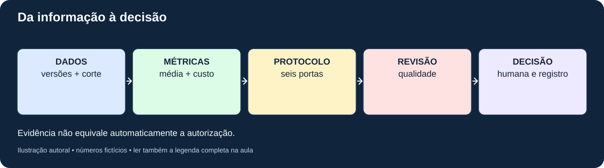
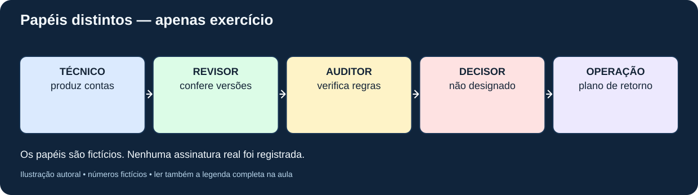
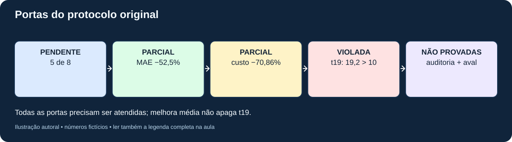
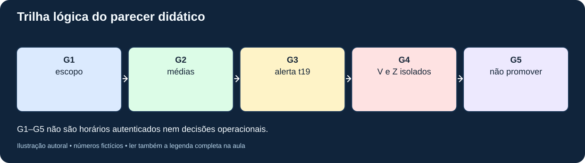
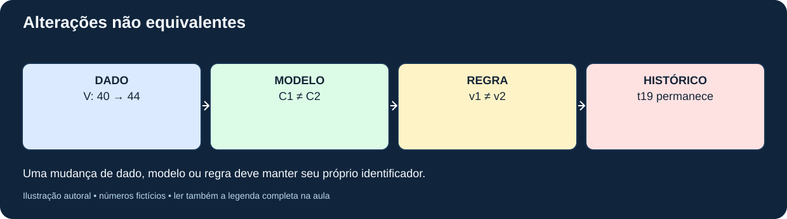
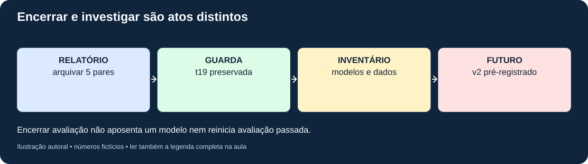

# MAT-EST-055 — Governança de modelos temporais: documentação de decisões, responsáveis, revisões e critérios de encerramento

**Código:** MAT-EST-055. **Área:** Matemática. **Unidade:** Estatística e séries temporais — ponte universitária. **Nível:** 6. **Anterior:** MAT-EST-054. **Próximo (proposto):** MAT-EST-056. **Origem:** aula, figuras e todas as 36 questões autorais; nenhuma questão oficial. **Progresso individual:** não iniciado e não modificado. **Estado:** pacote editorial local; não publicado, não sincronizado.

**Blocos sugeridos:** A, responsabilidades e regras de decisão (25 a 50 minutos); B, aplicação do protocolo herdado e parecer (25 a 50 minutos); C, mudanças controladas, encerramento, exercícios e revisão (25 a 50 minutos). Se a porcentagem ou o sinal do erro estiverem frágeis, recuperar o fundamento antes de avançar.

## 1. Objetivos, pré-requisitos e pergunta norteadora

Ao concluir seu estudo e sua tentativa, você deverá conseguir: distinguir previsão técnica de decisão autorizada; explicar a função de um protocolo previamente fixado; identificar evidências, versões, responsáveis e impedimentos; verificar as seis portas de MAT-EST-049-PROT-v1; calcular proporções e reduções sem confundir os denominadores; preservar a falha de t19; separar revisão de modelo, revisão de protocolo, encerramento de avaliação e aposentadoria; redigir um parecer justificável, limitado e auditável.

**Pré-requisitos:** operações, média, módulo e porcentagem; MAT-EST-047 (erros e intervalos); MAT-EST-049 e 050 (comparação e robustez); MAT-EST-051 (plano); MAT-EST-052 e 053 (eventos, atraso e versões); MAT-EST-054 (relatórios reproduzíveis). Não se exige formação em administração nem conhecimento prévio de engenharia de sistemas.

**Relevância para provas:** interpretar gráficos, proporções, regras condicionais, argumentação e qualidade das fontes pode ser transferido ao ENEM e a vestibulares. Este estudo de governança é aprofundamento universitário, e não uma alegação de conteúdo específico cobrado por uma banca.

## 2. Intuição: uma métrica boa não assina uma decisão

Imagine um painel que mostra dois métodos de previsão. O segundo apresenta erro médio menor. Alguém propõe ativá-lo. Contudo, a equipe havia declarado **antes** da comparação que exigiria oito pares e nenhuma piora local acima de dez unidades. Até o corte analisado, há somente cinco pares, e o segundo modelo piorou 19,2 unidades em uma data. O painel revela evidências parciais; não concede autorização. A pergunta de governança é: *quem pode decidir o quê, a partir de quais evidências, sob quais regras e com qual registro de revisão?*

Governança não é uma conta adicional que transforma uma reprovação em aprovação. Ela organiza o processo de decisão, torna responsabilidades explícitas e protege o registro histórico contra seleção oportunista de resultados. A indicação de quem preparou as contas não substitui uma pessoa autorizada a deliberar. No presente material, todos os papéis são apenas **funções fictícias**, sem qualquer assinatura real.

**Figura 1 — Do dado à decisão.** Texto alternativo: dados e versões identificados alimentam métricas reproduzíveis; estas são confrontadas com o protocolo congelado e a revisão de qualidade; a decisão humana documentada é uma etapa distinta. **Observe:** nenhuma seta salta das métricas para uma promoção automática. **Conclusão em áudio:** cálculo, regra, qualidade e autorização são evidências distintas e cumulativas. Autoria: projeto.

## 3. Formalização: quatro registros com finalidades diferentes

Um **inventário de modelo** identifica versão, finalidade, entrada, horizonte, limitações e responsável designado. Um **protocolo de avaliação** congela antes dos resultados o conjunto de alvos, métricas, limites e regras de comparação. Um **relatório de evidências** descreve observações elegíveis, seus IDs, suas versões, suas contas e as ressalvas. Um **registro de decisão** associa esses documentos a um encaminhamento, status, responsável, motivo, plano de revisão e eventual possibilidade de desfazer a mudança.

Uma proposta de registro de decisão contém: ID permanente, namespace, protocolo e versão; pergunta, contexto e modelo considerado; corte informacional; IDs de previsões e observações; numerador, denominador e unidade de cada métrica; condições cumpridas, pendentes e violadas; riscos e casos divergentes; papéis responsáveis; opção adotada ou proposta; critério de revisão/encerramento; vínculo com registro anterior; informação sobre autenticação da autoria e do horário.

Uma trilha com hashes detecta mudanças de bytes em comparação com uma cópia de referência. **Não certifica identidade, ordem real de emissão, aprovação humana ou verdade material.** Por isso `G1` a `G5` no pacote são apenas marcos lógicos de uma simulação, não atas oficiais.

## 4. Responsabilidades: quem prepara, confere e autoriza?

O papel técnico calcula e justifica previsões, mas não aprova sozinho sua implantação. O revisor de dados confere proveniência, disponibilidade temporal e versões; não preenche lacunas com zero. O auditor examina as regras previamente fixadas e registra violações sem apagar resultados indesejados. Um decisor humano designado pela organização, quando existir, pode deliberar de acordo com o processo aplicável. O responsável operacional mantém inventário de versões, contingência e procedimento para voltar à versão anterior (*rollback*).

No pacote, `governanca/responsabilidades.csv` contém exclusivamente essas descrições didáticas. A função de decisão aparece **sem pessoa designada e sem aprovação**, para que o ensaio não simule uma assinatura real.

**Figura 2 — Separação de funções.** Texto alternativo: técnico produz evidências, revisor confere dados, auditor verifica regras, decisor humano autoriza e responsável operacional controla mudança e retorno. **Observe:** a coluna de decisão não contém um nome ou assinatura. **Conclusão em áudio:** pessoas e papéis precisam ser definidos antes de mudar um sistema; papéis fictícios não são autorização verdadeira. Autoria: projeto.

## 5. Exemplo resolvido: aplicar as seis portas do protocolo histórico

O protocolo **MAT-EST-049-PROT-v1** descreve dois modelos: referência `BASE-SNAIVE-v1`, ou B, e desafiante `CHAL-SDELTA5-v1`, ou C. A amostra simulada contém cinco pares no mesmo horizonte, correspondentes a t18, t19, t20, t21 e t22. Os novos períodos t23, t24 e t25 continuam sem observações e sem emissões autenticadas.

A regra primária é erro absoluto médio, ou MAE. A regra secundária utiliza custo fictício assimétrico: erro positivo custa três pontos por unidade subprevista, e erro negativo custa um ponto por unidade superprevista. Formalmente, escrevemos:

\[ C(e)=3\max(e,0)+\max(-e,0). \]

**Leitura:** custo do erro igual a três vezes a parte positiva do erro, mais a parte positiva do erro de sinal oposto. O erro é o observado menos o previsto, medido nas unidades fictícias da série; o custo é medido em pontos fictícios. Exemplo: se a previsão foi 40 e se observou 42, o erro é mais dois e o custo é seis pontos. Não confunda o custo de gestão escolhido no exercício com uma grandeza universal.

| Porta congelada | Exigência | Evidência no corte | Estado didático |
|---|---|---|---|
| Amostra | oito pares | cinco de oito: 62,5% da meta numérica | pendente |
| MAE | redução mínima de 20% | B 17,60; C 8,36; redução de 52,5% | satisfeita somente na amostra parcial |
| Custo médio | redução mínima de 20% | B 51,20; C 14,92; redução de 70,859375% | satisfeita somente na amostra parcial |
| Guarda local | nenhuma piora superior a 10 | t19: piora de 19,2 | violada |
| Auditoria | qualidade aprovada | não houve auditoria operacional real | não comprovada |
| Autorização e retorno | aprovação humana, versão e plano de retorno | não houve aprovação real nem troca operacional | não comprovada |

**Como derivar as reduções:** uma redução relativa é a diferença entre a referência e o candidato dividida pelo valor da referência, vezes cem. Para MAE: dezessete vírgula sessenta menos oito vírgula trinta e seis resulta em nove vírgula vinte e quatro; nove vírgula vinte e quatro dividido por dezessete vírgula sessenta é zero vírgula quinhentos e vinte e cinco; logo, 52,5%. Para custo: cinquenta e um vírgula vinte menos quatorze vírgula noventa e dois é trinta e seis vírgula vinte e oito; dividir por cinquenta e um vírgula vinte produz 70,859375%. Os cálculos não aumentam o tamanho da amostra.

**A guarda, passo a passo:** em t19, o erro absoluto de B foi 4; o de C, 23,2. Portanto, a piora local de C é 23,2 menos 4, igual a **19,2 unidades**, acima do máximo de dez. Trata-se de uma condição exigida para **cada** alvo; um resultado médio bom em outras datas não a cancela. O protocolo só permite examinar eventual promoção quando todas as portas forem satisfeitas. A evidência presente sustenta o parecer didático: **não promover C sob o protocolo original**.

**Figura 3 — Portas cumulativas.** Texto alternativo: duas reduções médias atingidas no subconjunto de cinco pares, uma amostra pendente, uma guarda violada e duas aprovações reais inexistentes. **Observe:** cada requisito precisa de evidência própria; a melhora média não resolve a deterioração em t19. **Conclusão em áudio:** a condição necessária não foi satisfeita. Autoria: projeto.

## 6. Como documentar a decisão sem fabricar uma decisão operacional

O arquivo `governanca/parecer-didatico.json` é uma **síntese editorial local**, com escopo, indicadores, vínculos com o protocolo e conclusão condicional. O registro `governanca/trilha-exemplo.jsonl` reúne cinco marcos: abertura do caso, cálculo, alerta t19, segregação dos exemplos V e Z e parecer não operacional. Cada item carrega ID e resumo SHA-256 do registro anterior, segundo serialização definida no pacote. Isso oferece prática de verificação de integridade de uma trilha fictícia.

Um texto de parecer adequado é: “Nos cinco pares simulados disponíveis, C apresentou menores erros absolutos médios e custos médios que B. A amostra ainda não atingiu os oito pares previstos e, em t19, C teve piora local de 19,2 unidades, superior ao limite congelado de dez. Não foi demonstrada auditoria ou aprovação operacional real. Portanto, não há autorização de promoção sob MAT-EST-049-PROT-v1; novos estudos devem ser identificados separadamente.”

Esse texto não equivale à instrução para uma instituição alterar sistemas. É o resultado lógico de **critérios arbitrários pedagógicos e números inteiramente fictícios**. A própria aprovação humana está representada como campo faltante, não como pessoa inventada.

**Figura 4 — Rastro do parecer.** Texto alternativo: G1 delimita escopo, G2 recalcula métricas, G3 registra quebra da guarda t19, G4 mantém V e Z isolados e G5 formula parecer didático sem assinatura operacional. **Observe:** G3 não desaparece quando G5 é elaborado. **Conclusão em áudio:** preservar a razão do impedimento permite compreender decisões futuras. Autoria: projeto.

## 7. Revisão responsável: mudar modelo não é mudar retroativamente a regra

Um **reprocessamento de dados** pode substituir a versão usada numa avaliação, mas precisa mostrar qual observação foi retificada e quais resultados mudaram, preservando relatórios antigos identificados. Uma **atualização de parâmetros ou algoritmo** produz outra versão do modelo e demanda nova avaliação pertinente. Uma **mudança de protocolo** altera regras para um experimento novo, com seu próprio ID e congelamento anterior aos resultados; não renomeia o protocolo original nem transforma t19 em aprovação retrospectiva.

Considere duas propostas hipotéticas. Proposta A: alterar a guarda de dez para vinte somente depois de observar a falha de dezenove vírgula dois e manter o mesmo ID de protocolo. Isso vicia o critério original e é inadequado como avaliação daquela regra. Proposta B: documentar um novo objetivo, justificar o risco, fixar protocolo v2 **antes** de novos alvos elegíveis e distinguir as análises exploratórias anteriores das novas avaliações. Essa proposta pode ser examinada, mas não cria novas observações nem prova que C funcionará. A regra antiga permanece descumprida.

Os casos V e Z ajudam a lembrar outra separação: revisar o valor observado altera os erros reportados, mas não cria uma previsão nova. Em V, B42 e C43 ficam congelados; a observação preliminar 40 gera módulos B2/C3 e a validada 44 gera B2/C1. Em Z, previsão 29, preliminar 30 e corrigida validada 32 geram erros mais um e mais três, respectivamente. Nenhum dos dois casos isolados pertence ao denominador principal de cinco pares.

**Figura 5 — Três mudanças distintas.** Texto alternativo: ramo de observação revisa V e Z mantendo previsões; ramo de modelo cria novo modelo a avaliar; ramo de protocolo cria regra nova sem editar MAT-EST-049-PROT-v1. **Observe:** as trilhas não devem ser fundidas. **Conclusão em áudio:** versões de dado, modelo e regra respondem a perguntas diferentes. Autoria: projeto.

## 8. Encerrar o quê? Avaliação, incidente ou ciclo de vida do modelo

**Encerrar uma avaliação** significa terminar um relatório com seus dados, resultados, cortes, limitações e encaminhamento registrado. Pode-se encerrar uma avaliação como “sem autorização de promoção” sem aposentar a referência. **Encerrar um incidente** exige classificar o risco, documentar providências e verificar se as condições de acompanhamento foram atendidas. **Descontinuar um modelo** é ato de governança operacional separado: dependências, usuários afetados, inventário, procedimento de substituição, comunicação e plano de retorno precisam ser considerados. Não confundir “encerramento da aula” com qualquer um desses atos.

Um registro de fechamento educacional do caso deve conter: escopo e responsáveis propostos; identificação dos cinco pares e de suas versões; ressalva sobre t23 a t25; seis portas e respectivos estados; trilha t19; referência a Z e V como casos externos à amostra; decisão didática de não promover; condições para eventual experimento novo; limite de validade e registro de que não há aprovação operacional.

**Figura 6 — Fechamento não apaga histórico.** Texto alternativo: relatório de cinco pares fica arquivado com falha t19; modelos e dados permanecem versionados; um futuro estudo, se autorizado, recebe novo protocolo sem reaproveitar cenários como observações. **Observe:** o novo estudo sai de uma bifurcação documentada e não reescreve o antigo. **Conclusão em áudio:** uma avaliação pode ser encerrada com pendências ou impedimento explícitos, mantendo caminho para nova investigação. Autoria: projeto.

## 9. Aplicações, conexões e limites

**Planejamento e informática:** sistemas de previsão usados em filas ou estoques exigem que o responsável técnico diferencie indicadores e autorização. **Matemática:** média, diferença, porcentagem e lógica de condições simultâneas ajudam a ler um parecer. **Redação e metodologia científica:** separar fato, inferência, pressuposto, limitação e encaminhamento torna o texto verificável. **História da informação:** corrigir um documento sem apagar a versão que fundamentou uma decisão anterior evita reinterpretação retrospectiva enganosa.

Como referência externa opcional, o NIST apresenta o *AI Risk Management Framework* como orientação voluntária sobre governar, mapear, medir e gerenciar riscos. O framework trata de sistemas de inteligência artificial de modo amplo e **não é regra oficial para um modelo sazonal escolar nem para aprovação de vestibular**. Inspiramo-nos na distinção entre responsabilidade, evidência e tratamento de riscos, sem atribuir ao NIST as seis portas autorais deste projeto. Sobre a avaliação de previsão, Hyndman e Athanasopoulos destacam a importância de dados não utilizados para ajustar o modelo e de origens temporais corretamente separadas.

**Fontes de apoio:** [NIST AI Risk Management Framework, funções centrais](https://airc.nist.gov/airmf-resources/airmf/5-sec-core/); [NIST Playbook](https://www.nist.gov/itl/ai-risk-management-framework/nist-ai-rmf-playbook); [Forecasting: Principles and Practice, avaliação de previsões](https://otexts.com/fpp3/accuracy.html); [validação cruzada de séries temporais](https://otexts.com/fpp3/tscv.html). A fonte primária dos valores, regras e decisões demonstradas é o **acervo autoral herdado** do projeto.

## 10. Erros comuns e como detectá-los

- Interpretar uma média melhor como autorização automática. Pergunte quais portas são cumulativas.
- Dividir uma diferença média pelo candidato em vez de dividi-la pela referência indicada na regra. Escreva o denominador antes de calcular.
- Declarar oito pares quando somente cinco estão disponíveis, ou incluir V e Z como novos alvos principais. Confira IDs e namespace.
- Apagar t19 porque os períodos seguintes foram favoráveis. A guarda original é por alvo, não uma média.
- Alterar limite depois de ver o resultado e manter o mesmo protocolo. Escreva nova versão e delimite análise exploratória.
- Tratar SHA-256 como certificado de identidade ou carimbo temporal. É uma ferramenta de comparação de bytes, sem autenticidade externa por si só.
- Redigir “aprovado” sem evidência de pessoa autorizada. No ensaio, há somente papéis didáticos.
- Chamar ausência de dado de erro zero ou divulgar B23/C23 como emissões reais. Nenhum t23–t25 foi observado.
- Confundir retirar um modelo de produção com encerrar o relatório sobre o candidato. São decisões diferentes.

## 11. Vídeo complementar

**Título:** Episode 4: AI Risk Management Framework (NIST AI RMF). **Canal:** Collibra. **Idioma:** inglês. **URL:** https://www.youtube.com/watch?v=09PdKJa3wj0 . **Duração:** não confirmada pela busca; conferir diretamente antes de publicar. **Verificação:** o título, a descrição e a existência do endereço foram localizados publicamente em 29/09/2026; reprodução integral e disponibilidade em todas as regiões não foram testadas. O canal pertence a uma empresa; o vídeo é comentário explicativo e não material oficial do NIST.

**Quando assistir:** depois da seção 4, para ouvir a distinção geral entre funções de governar, mapear, medir e gerenciar. **O que reforçar:** responsabilidade e repetição do acompanhamento. Não transferir automaticamente afirmações do vídeo sobre sistemas empresariais ao pequeno modelo fictício da aula. A aula permanece completa sem o vídeo.

## 12. Exercícios, correção e revisão

Realize as atividades separadas em `exercicios.md`: dez de aprendizagem, dez de consolidação, dez de transferência autoral no estilo vestibular e seis de reteste posterior, total 36. Não abra `gabarito-comentado.md` antes da tentativa. Toda solução explica o motivo da regra e sugere categorias de erro, sem atribuir um erro individual antes de haver resposta.

**Resumo para leitura em voz alta:** previsão, métrica, protocolo e autorização são documentos diferentes. A comparação fictícia de cinco pares apresenta melhora média de cinquenta e dois vírgula cinco por cento no erro absoluto médio do candidato, mas inclui piora local de dezenove vírgula dois em t19, acima da guarda de dez. Cinco pares não atendem ao mínimo de oito. Portanto, o protocolo antigo não autoriza a promoção. Revisões futuras requerem novas versões sem apagar o histórico, e exemplos V e Z permanecem isolados. Nenhum ato operacional nem aprovação de pessoa real está demonstrado.

**Revisão espaçada:** um, sete e trinta dias **após estudo e tentativa reais**, nunca a partir da data de criação. No dia um, refaça as seis portas sem consultar o texto. No dia sete, reconstrua reduções, a falha t19 e um parecer de quatro frases. No dia trinta, faça o reteste e explique as diferenças entre reprocessamento, novo modelo, novo protocolo e encerramento. Status individual só evolui com evidência de resolução, explicação e recuperação posterior.

**Próximo tópico editorial proposto:** MAT-EST-056 — Revisão controlada de experimentos temporais: protocolo sucessor, pré-registro e prevenção de contaminação da avaliação. Ainda não iniciado.

**Limites editoriais:** arquivo local, sem publicação, sincronização ou avaliação operacional. O vídeo não foi reproduzido integralmente; o Edge e leitores de tela ainda necessitam de teste manual. As seis figuras foram criadas especificamente para esta aula. Nenhuma observação futura, assinatura humana real ou progresso individual foi acrescentado.
