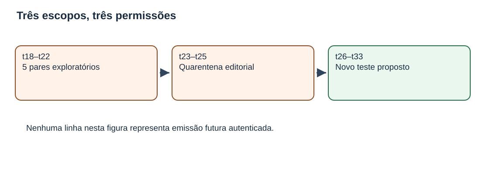
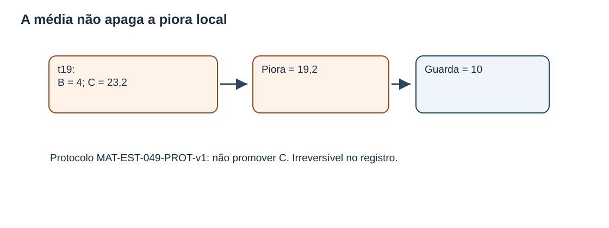
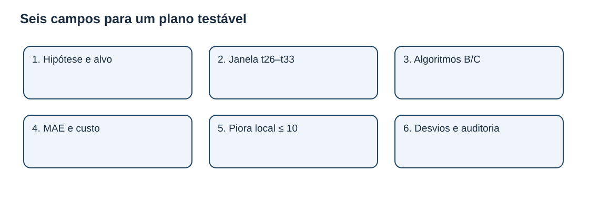
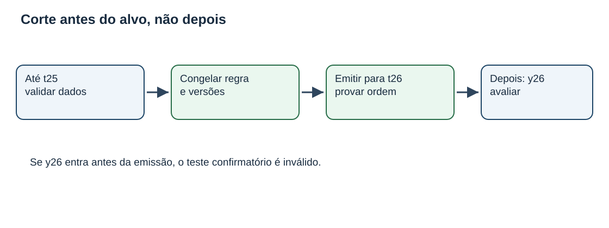
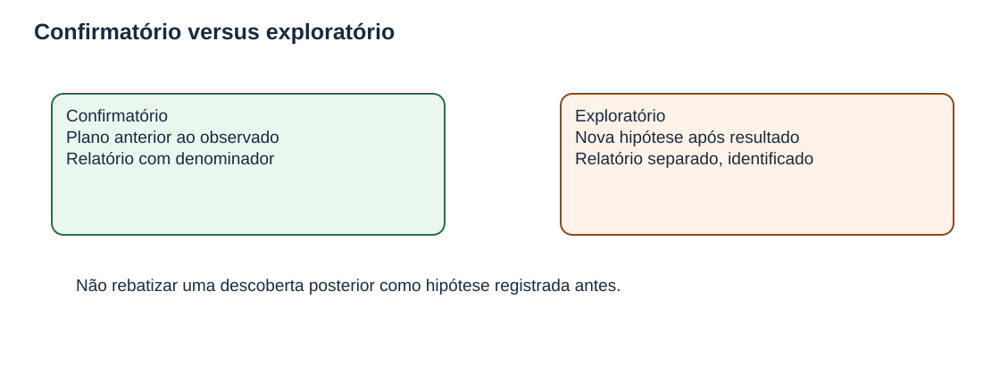
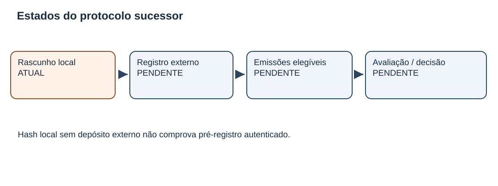

# MAT-EST-056 — Revisão controlada de experimentos temporais: protocolo sucessor, pré-registro e prevenção de contaminação da avaliação

**Área:** Matemática. **Unidade:** Estatística e séries temporais — nível 6, ponte universitária. **Anterior:** MAT-EST-055. **Próximo proposto:** MAT-EST-057. **Material:** integralmente autoral; zero questões oficiais. **Estado do estudante:** não iniciado; produzir material não demonstra tentativa nem domínio. **Estado da entrega:** apenas produção editorial local.

**Blocos recomendados:** A. De onde vem a contaminação (35 minutos); B. Como especificar um protocolo sucessor (45 minutos); C. Contas, revisão e exercícios (45 minutos). São orientações flexíveis. Se um pré-requisito bloquear a leitura, recuperar operações, média e porcentagem antes de avançar.

## 1. Objetivos e pré-requisitos

Ao estudar e praticar esta aula, o estudante deverá ser capaz de diferenciar estudo exploratório e confirmatório; separar coortes de teste; justificar a necessidade de um novo identificador para um protocolo sucessor; especificar horizonte, modelos, versões, janelas, métricas, regras de ausência e critérios decisórios antes de conhecer os novos resultados; detectar vazamento informacional; calcular reduções percentuais sem desconsiderar guardas locais; e explicar o que um hash local prova e o que não prova.

**Pré-requisitos:** módulos, números negativos, médias, frações e porcentagens; MAT-EST-047 (erros por horizonte), MAT-EST-049 e 050 (comparação emparelhada e robustez), MAT-EST-051 (desenho futuro), MAT-EST-052 a 054 (registros e versões), MAT-EST-055 (responsabilidades e parecer). A aula avança a metodologia, não presume que a leitura anterior tenha consolidado essas competências.

**Relevância para exames:** ENEM e vestibulares podem exigir interpretação quantitativa, relação entre afirmação e evidência e avaliação de argumentos; o pré-registro detalhado de modelos é aqui uma extensão de ponte universitária, não requisito específico atribuído a ENEM, FUVEST, UNICAMP ou UNESP. Todas as questões são **autorais**, inclusive as de transferência no estilo vestibular.

## 2. Problema intuitivo: um resultado visto não pode voltar a ser surpresa

Imagine que alguém compare dois métodos de previsão e, após encontrar uma falha desfavorável ao método preferido, altere a janela, retire a observação problemática e passe a dizer que a nova regra era a inicial. As contas da nova média podem estar corretas aritmeticamente, mas o estudo deixa de responder à pergunta que alegava ter definido antes da observação. O problema não é explorar uma hipótese nova: explorar é útil. O problema é ocultar que ela surgiu depois de examinar o resultado.

Há, portanto, duas perguntas diferentes. **Exploração:** que hipótese os dados já vistos inspiram? **Confirmação:** o que acontece com uma hipótese e uma regra fixadas antes de acessar os novos alvos elegíveis? A confirmação exige um registro de plano e observações futuras realmente novas para essa comparação. As datas declaradas em um arquivo local são apenas texto, não autenticação independente.

**Figura 1.** Texto alternativo: três caixas separam t18–t22, t23–t25 e t26–t33. **Observe:** o primeiro bloco já foi examinado, o segundo contém cenários editoriais mas não observações, e o terceiro é proposto para outro estudo. **Conclusão por áudio:** os cinco pares conhecidos servem de contexto e exploração; os três alvos em quarentena não são resultados; os oito alvos futuros propostos ainda não possuem emissão ou observado autenticados. Figura original do projeto.

## 3. Estado que não pode ser reescrito

A referência **BASE-SNAIVE-v1**, identificada por B, e o desafiante **CHAL-SDELTA5-v1**, identificado por C, foram comparados em cinco tarefas fictícias com alvos t18 até t22. O protocolo **MAT-EST-049-PROT-v1** exige oito pares e seis condições: pelo menos dois ciclos de quatro períodos, redução mínima de vinte por cento em MAE, redução mínima de vinte por cento em custo médio, nenhuma deterioração local de erro absoluto maior que dez unidades, auditoria de qualidade e autorização humana com reversão planejada. Essas são regras didáticas arbitrárias do acervo, não critérios universais de teste estatístico.

Nos cinco pares, MAE B igual a 17,60 unidades e MAE C igual a 8,36 unidades. A redução parcial é:

\[R_{MAE}=\frac{17,60-8,36}{17,60}\cdot100\%=52,5\%.\]

Leitura: dezessete vírgula sessenta menos oito vírgula trinta e seis, dividido por dezessete vírgula sessenta, vezes cem; cinquenta e dois vírgula cinco por cento. No custo fictício médio B igual a 51,20 e C igual a 14,92 pontos, a redução é aproximadamente 70,86 por cento. São bons indicadores médios **dentro dos cinco pares inventados**, mas isso não preenche as outras condições.

No alvo t19, B estimou 187 e C estimou 206,2, enquanto a observação fictícia foi 183. Pela convenção erro igual a observado menos previsto, o erro B é menos quatro e o erro C é menos vinte e três vírgula dois. Logo, os módulos são quatro e vinte e três vírgula dois. A deterioração de C relativamente a B é:

\[d_{19}=|e_{C,19}|-|e_{B,19}|=23,2-4=19,2.\]

Leitura: módulo do erro de C menos módulo do erro de B resulta em dezenove vírgula dois. Como dezenove vírgula dois é maior que o limite dez, a guarda antiga foi violada. **Não promover C sob MAT-EST-049-PROT-v1.** Mesmo três novos pares favoráveis sob o plano antigo não apagariam o fato histórico. O parecer MAT-EST-055-PARECER-DIDATICO-v1 mantém esta síntese e não representa assinatura ou decisão operacional real.

**Figura 3.** Texto alternativo: o erro absoluto em t19 foi quatro para B e vinte e três vírgula dois para C; diferença dezenove vírgula dois, acima do limite de dez. **Observe:** uma média agregada e uma restrição local respondem a perguntas diferentes. **Conclusão por áudio:** melhora média não cancela quebra de guarda; o resultado histórico permanece guardado em arquivo. Figura original.

## 4. O que significa pré-registro, exatamente?

Pré-registro é tornar verificável a versão do plano antes de examinar os resultados que servirão para julgá-lo. O [Open Science Framework, ou OSF, descreve o pré-registro](https://help.osf.io/article/330-welcome-to-registrations) como um plano com versão somente de leitura, marca temporal e submissão a repositório antes da coleta ou análise. Um **rascunho editorial local** como o produzido nesta aula é preparação desse processo, não comprovação de pré-registro real em OSF ou em qualquer outro repositório.

Devem ser especificados: pergunta e hipótese; população, amostra e horizonte; versões dos modelos, fórmulas, dados e corte temporal; métricas, unidades e sinal; critérios de elegibilidade e exclusão; tratamento de atraso e retificações; guardas e regras decisórias; análises auxiliares e distinção entre análise confirmatória e exploratória; rastros de alterações, auditoria e autorização. Se o procedimento mudar porque a análise já revelou algo inconveniente, essa mudança merece uma **emenda explícita**, com efeito prospectivo e histórico preservado. Uma emenda não transmuta em teste novo os resultados que a motivaram.

**Figura 5.** Texto alternativo: seis caixas apresentam hipótese, janela, algoritmos, métricas, guarda e tratamento de desvios. **Observe:** o desenho contém regras de inclusão e decisão, não apenas o nome de um modelo. **Conclusão por áudio:** sem definir antecipadamente como contar e julgar os casos, resultados posteriores podem ser reinterpretados de modo arbitrário. Figura original.

### Por que um hash não basta?

O resumo criptográfico SHA-256 permite conferir se bytes de um arquivo continuam iguais aos bytes esperados. Mas alguém pode criar um arquivo depois do resultado, inserir uma data anterior e calcular seu hash nesse momento. O valor criptográfico não comprova autoria pessoal nem existência anterior ao alvo. Para alegar pré-registro autêntico seriam necessários controles externos verificáveis de registro, acesso, hora, identidade e versão. Este pacote não possui tais provas. O campo `public_registry.status` do desenho sucessor está explicitamente marcado como não submetido.

## 5. Separar tempo de desenvolvimento e tempo de confirmação

O documento **MAT-EST-056-PROT-SUC-v1** foi criado aqui como **proposta didática local**, sem execução. Mantém o protocolo MAT-EST-049-PROT-v1 intocado e evita reaproveitar como confirmação os alvos cujo resultado ou cenário já foi examinado. A separação conservadora sugerida é:

| Intervalo | Situação na continuidade | Uso no protocolo sucessor |
|---|---|---|
| t18–t22 | Cinco pares fictícios conhecidos; a guarda t19 falhou | Contexto exploratório; fora do denominador novo |
| t23–t25 | Nenhum observado nem emissão autenticada; cenários divulgados | Quarentena editorial; não reclassificar como confirmação |
| t26–t33 | Oito alvos propostos; zero observados e zero emissões | Futura coorte elegível, somente após condições prévias e comprovação temporal |
| Exemplos V e Z | Casos isolados de versões de dados | Material pedagógico, não pares do modelo principal |

A síntese por áudio é que os alvos históricos já foram vistos, os três próximos estão sem observado embora cenários tenham sido discutidos, e os oito mais distantes são somente um plano. A quarentena é uma opção conservadora deste exercício; não é regra estatística para toda série temporal.

A recomendação bibliográfica de [Hyndman e Athanasopoulos sobre validação cruzada temporal](https://otexts.com/fpp3/tscv.html) fundamenta a separação das origens: cada previsão deve ser construída apenas com dados anteriores ao seu alvo. A avaliação por origem deslizante não autoriza reutilizar futuro na preparação do passado.

## 6. Protocolo sucessor didático: uma proposta verificável, não um estudo executado

**Identificador proposto:** MAT-EST-056-PROT-SUC-v1. **Objeto:** comparar B e C, horizonte um período, em oito alvos exclusivos propostos t26 a t33. **Situação:** apenas desenho local; pré-registro externo não submetido; nenhuma assinatura; zero emissões e observações. O modelo não mudou de identidade nesta aula, e o custo histórico também não foi reescrito.

As fórmulas para a previsão do alvo t na origem t menos um permanecem:

\[B_t=y_{t-4}.\]

Leitura: B para t é o observado de quatro períodos antes, mantendo a estação comparável.

\[C_t=y_{t-4}+\frac15\sum_{j=t-5}^{t-1}(y_j-y_{j-4}).\]

Leitura: C é o observado de quatro períodos antes, mais a média de cinco diferenças sazonais, cada uma calculada como o observado j menos o observado quatro períodos antes de j. Para emitir C para t26, a janela j21 até j25 exigiria dados até y25; hoje, y23 a y25 não foram registrados, logo **não existe aqui previsão numérica C26**. B26 corresponderia a y22, conhecido como 193, mas mencionar essa expressão matemática não prova emissão t25. Não criar registro com hora inventada para cobrir esse vazio.

**Critérios propostos** (os mesmos números usados como exemplo de desenho, agora em **outro ID e outra coorte**): oito pares elegíveis, redução de MAE pelo menos vinte por cento, redução do custo médio pelo menos vinte por cento, piora local máxima de dez unidades, auditoria da qualidade de entradas e autorização humana verdadeira com plano de reversão. Nenhum critério está atualmente satisfeito ou refutado na nova coorte porque **não há resultados**. Os oito não equivalem a amostra inferencial suficiente em geral; trata-se de limiar fictício de exercício, não de garantia de generalização.

**Proveniência mínima por emissão futura:** identificador de evento, protocolo, versões de modelos e algoritmo, origem, alvo, horizonte, valor e unidade, snapshot de dados, maior período usado e evidência externa de ordem temporal. **Por observação:** alvo, fonte, versão, momento de disponibilidade, validação e ligação com eventual retificação. **Por par:** referenciar duas emissões anteriores ao alvo e uma única versão validada por alvo. Exigir que a prova de ordem temporal preceda a recepção de y-alvo; uma reconstituição a posteriori só pode ser chamada de reconstrução.

**Contingências:** se o observado atrasar, marcar pendente, sem substituir por zero. Se for retificado, manter a previsão fixa e reavaliar separadamente cada vintage. Se não houver oito pares elegíveis, descrever a incompletude e suspender conclusão sob este desenho; não selecionar somente alvos favoráveis. Se uma exclusão inesperada for proposta depois da leitura do resultado, apresentá-la como desvio e análise exploratória, ou registrar outro protocolo prospectivo; jamais alterar silenciosamente a versão congelada.

**Figura 2.** Texto alternativo: validação até t25 precede congelamento e emissão para t26; y26 chega depois. **Observe:** os dados usados na previsão precisam anteceder o alvo. **Conclusão por áudio:** se o próprio observado do alvo entrar no cálculo antes da previsão, a avaliação externa fica comprometida. Figura original.

## 7. Derivando métricas de um teste realmente emparelhado

Para cada futuro alvo elegível, os modelos devem compartilhar a mesma informação disponível e a mesma versão validada do observado. Define-se erro assinado como:

\[e_{B,t}=y_t-B_t,\qquad e_{C,t}=y_t-C_t.\]

Leitura: para cada modelo, subtraia do observado sua previsão, sempre na mesma unidade. O erro absoluto de cada um é o módulo desse resultado.

Se e somente se os oito pares planejados forem validados, as duas médias de erro absoluto serão:

\[MAE_B=\frac{\sum_{t=26}^{33}|e_{B,t}|}{8},\quad MAE_C=\frac{\sum_{t=26}^{33}|e_{C,t}|}{8}.\]

Leitura: somar os oito erros absolutos elegíveis de cada modelo e dividir por oito. Se existirem só sete pares, escrever “sete de oito pendentes de conclusão” na apresentação confirmatória em vez de modificar sem explicação a regra.

O custo assimétrico **da proposta didática** conserva a regra de peso três para subprevisão e peso um para superprevisão:

\[K(e)=3\max(e,0)+\max(-e,0).\]

Leitura: o custo é três vezes a parte positiva do erro, somado à parte negativa tomada em módulo. A piora local é:

\[D_t=|e_{C,t}|-|e_{B,t}|.\]

Leitura: módulo de C menos módulo de B; valores positivos mostram deterioração de C, valores negativos mostram melhora. A regra de guarda é conferir se **algum** D em alvo elegível ultrapassa dez, não apenas a média de D.

### Exemplo independente e integralmente resolvido, fora da série t

Imagine um alvo fictício de demonstração sem código temporal da série: observado cento e dez, previsão B cento e cinco e C cento e doze. O erro de B é cento e dez menos cento e cinco, igual a mais cinco; o erro de C é cento e dez menos cento e doze, igual a menos dois. Os módulos são cinco e dois. A piora de C é dois menos cinco, igual a menos três: C melhora o erro absoluto em três unidades. Pela regra de custo, B custa três vezes cinco, igual a quinze pontos; C custa dois pontos. **Esse exemplo não representa observação ou emissão t26–t33.** Serve apenas para aprender a operação antes de aplicá-la a dados realmente elegíveis.

## 8. Três formas de contaminação e seus antídotos

**Contaminação por alvo futuro:** usar y do próprio alvo ou outra informação indisponível na origem para gerar previsão. Antídoto: versionar o snapshot por origem, registrar maior período de entrada e verificar temporalmente a sequência emissão → observado → avaliação.

**Contaminação por escolha após ver o erro:** trocar a janela, o peso do custo, o modelo preferido ou a regra de exclusão depois de inspecionar os resultados, fingindo compromisso anterior. Antídoto: plano específico anterior e relatório com duas colunas conceituais: análises previstas e explorações novas. O leitor deve conseguir reconstruir qual decisão veio antes de qual evidência.

**Contaminação por compartilhamento de tarefas:** contar uma mesma data-alvo repetida, várias vintages do mesmo observado, ou casos pedagógicos V e Z como se cada entrada adicionasse uma nova observação independente da série principal. Antídoto: identificador único de par por alvo e horizonte, registro separado de versões e origem; não dobrar o denominador.

**Figura 4.** Texto alternativo: análise confirmatória usa compromisso antes do resultado; análise exploratória apresenta hipótese surgida depois, com rótulo explícito. **Observe:** explorar não é proibido; ocultar a ordem dos acontecimentos prejudica a validade do argumento. **Conclusão por áudio:** hipóteses novas exigem novos dados quando se deseja avaliá-las como confirmação independente. Figura original.

## 9. Versões de dados, de modelos e de regras não são a mesma coisa

A retificação de uma observação muda os valores que entram no relatório; não dá licença para editar uma previsão congelada. Os casos isolados ajudam a enxergar isso. No **EXEMPLO-Z**, previsão 29, preliminar 30 e validada 32: o erro muda de um para três. No **EXEMPLO-V**, previsões B42 e C43, preliminar 40 e validada 44: módulos de B e C mudam de dois/três para dois/um. Esses casos continuam didáticos e não pertencem ao denominador principal.

Uma atualização do algoritmo de C exigiria uma versão de **modelo** nova. Uma alteração do limiar ou da janela confirmatória exigiria uma versão de **protocolo** nova, com escopo temporal separado. Um novo registro deve apontar o antecedente, explicar motivo, data, informação disponível naquele momento e a partir de quais alvos a emenda poderia valer. Versões posteriores não apagam relatórios históricos. Consulte também o relatório de auditoria herdado em `relatorios/relatorio-auditoria.json` para estudar a reavaliação por vintage.

## 10. O que um desenho local pode afirmar?

A proposta foi redigida e teve seus bytes verificados neste pacote. O documento não foi depositado como pré-registro em repositório externo, não recebeu selo de tempo independente, não produziu previsões reais, não captou y23–y33 e não obteve assinatura humana. Portanto, seu status é **rascunho editorial**, não experimento realizado. O ID MAT-EST-056-PROT-SUC-v1 identifica a peça didática e não autoriza sua promoção automática a uma aplicação externa.

**Figura 6.** Texto alternativo: estado atual “rascunho local”, seguido por registro externo, emissões elegíveis e avaliação/decisão, todos pendentes. **Observe:** não existe seta que vá diretamente do rascunho para um resultado. **Conclusão por áudio:** planejar, comprovar o compromisso temporal, executar e avaliar são atividades distintas. Figura original.

## 11. Erros frequentes e relações entre áreas

Erros frequentes: afirmar que uma queda média “compensa” a piora local t19; mudar o peso do custo de três para cinco sem criar estudo próprio; rebatizar cenário t23 como medição; chamar um arquivo com data escrita de pré-registro autenticado; usar a mesma observação em várias versões como pares independentes; transformar ausência em zero; confundir B26=y22 como emissão comprovada; reduzir de oito para sete pares após conhecer o resultado sem mencionar mudança; e confundir documento elaborado com aprovação humana.

As aplicações conectam Matemática (funções definidas por partes, percentuais, módulo, média, amostragem), Computação (snapshots, versões, hashes e testes automatizados), Língua Portuguesa e Redação (argumento com ressalvas e escopo) e metodologia científica (hipóteses, critérios de inclusão, transparência de desvios). Os números não são dados de saúde, finanças ou serviço público; nenhuma decisão administrativa real deriva desta simulação.

## 12. Vídeo complementar e fontes

**Vídeo:** [Simplifying the Preregistration Process (Video)](https://help.osf.io/article/626-simplifying-the-preregistration-process), suporte oficial OSF, inglês. **Duração:** não exibida na página consultada. **Por que assistir:** apresenta por que registrar um plano antes de coletar dados e como documentar desvios posteriormente. **Quando:** depois da seção quatro, para relacionar nossa ficha editorial à prática de registro externo. **Verificação:** a página de suporte e sua indicação de vídeo estavam acessíveis em 29 de setembro de 2026; a reprodução integral do vídeo incorporado não foi testada. A explicação desta aula é autossuficiente sem o vídeo.

Leitura adicional: [OSF — Registrations & Preregistrations](https://help.osf.io/article/330-welcome-to-registrations); [Hyndman e Athanasopoulos — avaliação por origem deslizante](https://otexts.com/fpp3/tscv.html) e [avaliação de precisão de previsões](https://otexts.com/fpp3/accuracy.html). Esses textos embasam os **conceitos gerais**; os IDs, valores, guardas, modelos e escolhas de quarentena pertencem ao acervo autoral do projeto.

## 13. Exercícios em três camadas e correção separada

O arquivo `exercicios.md` oferece dez atividades básicas, dez de consolidação, dez de transferência autoral no estilo de vestibulares e seis de reteste para momento posterior, num total de 36 IDs únicos. Há a versão estruturada `exercicios.json`. O raciocínio completo e sugestões de possíveis motivos de erro ficam apenas no `gabarito-comentado.md` e no respectivo JSON, a consultar **depois da tentativa**. Nenhum item é prova oficial ou avalia automaticamente o estudante. Se houver dificuldade na regra de sinal, volte ao exemplo de 110 antes de tentar os itens de custo.

## 14. Resumo pronunciável e revisão espaçada

**Versão curta para ouvir:** o protocolo antigo documenta cinco pares e uma violação de guarda em t19; não será reescrito. Um novo estudo precisa de ID, regra, corte e amostra próprios, definidos antes do novo alvo. Nesta aula, t18 a t22 são história examinada; t23 a t25 são alvos ainda sem observado, com cenários já expostos; t26 a t33 são somente planejamento. O erro é observado menos previsto, e a média dos módulos não substitui a checagem da maior piora individual. Pré-registro de verdade precisa de prova temporal externa; nenhum documento local aqui certifica sua execução.

**Revisão:** após a primeira tentativa efetiva, programar retomadas aproximadas um, sete e trinta dias depois — não contar a partir da data de geração deste arquivo. Na primeira revisão, reconstruir em voz alta os três escopos e a guarda t19. Na segunda, resolver itens de redução percentual, vazamento e vintage sem ver a resposta. Na terceira, preencher de memória os seis campos de um plano e responder o reteste independente. Consolidar só depois de resolver, justificar, transferir para situação nova e recuperar o conteúdo após intervalo, nunca por leitura passiva.

## 15. Próximo passo editorial e limites de execução

**MAT-EST-057 (proposto):** Registro de desvios e auditoria prospectiva simulada: pendências, exclusões e relatório por coorte sem inventar alvos futuros. Ainda não iniciado.

**Limites expressos:** pacote produzido apenas localmente; não publicado no site, Drive ou GitHub; sem teste manual no Edge; sem certificação temporal externa, assinatura, execução de estudo ou reprodução integral do vídeo. Progresso individual permanece **não iniciado** por ausência de evidência de estudo ou tentativa. O projeto continua a partir deste checkpoint, não cria nova trilha.
