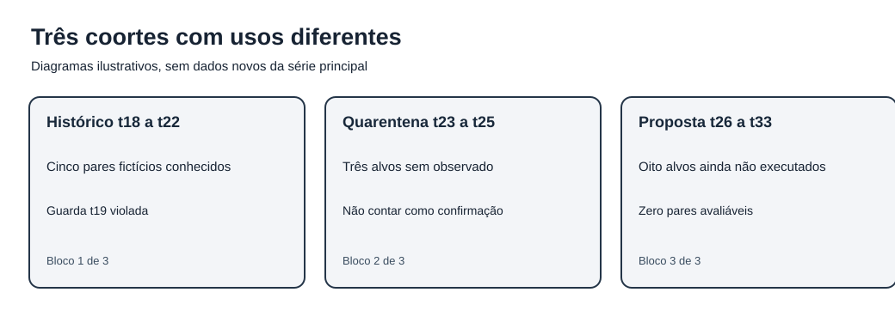
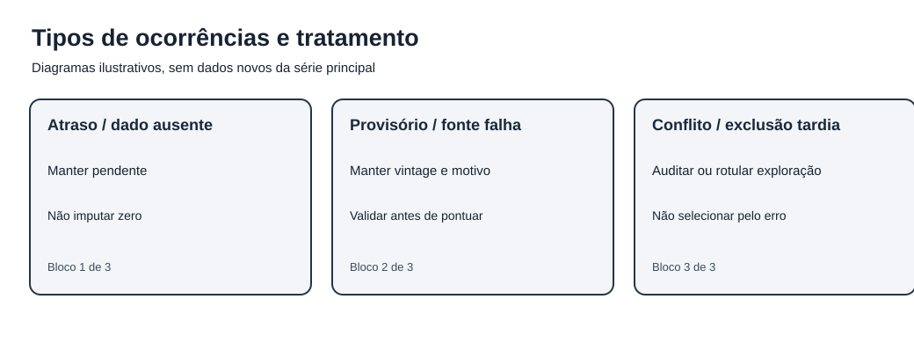
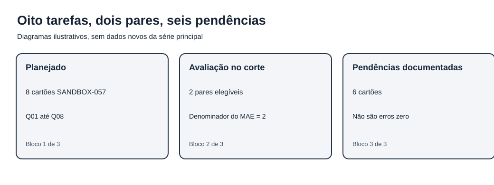
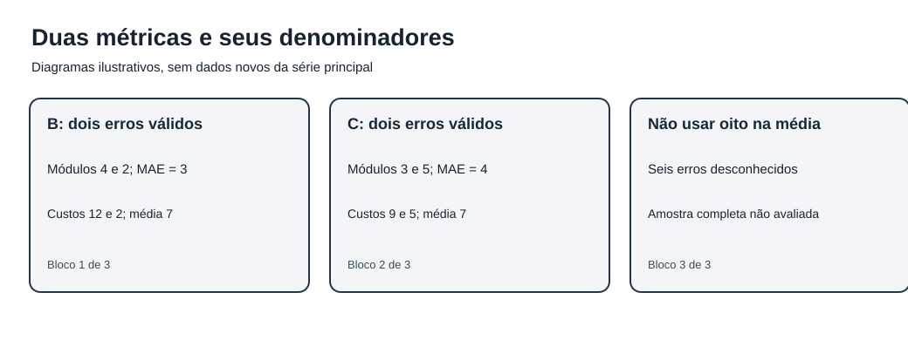
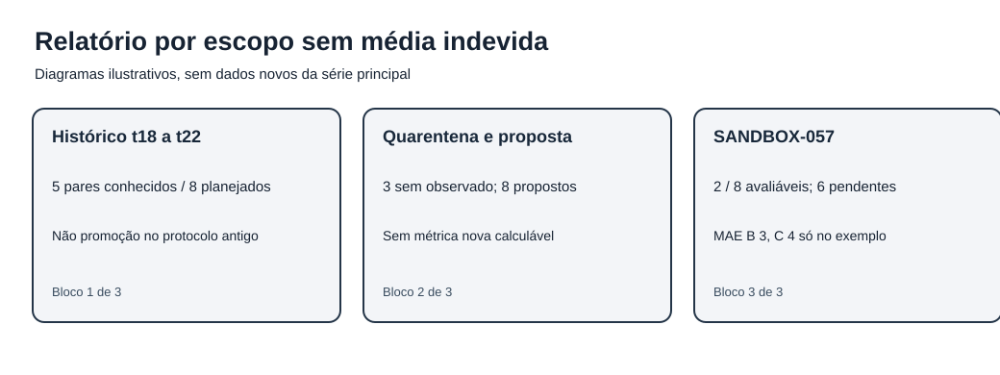

# MAT-EST-057 — Registro de desvios e auditoria prospectiva simulada: pendências, exclusões e relatório por coorte sem inventar alvos futuros

**Área:** Matemática. **Unidade:** Estatística e séries temporais, ponte universitária (nível 6). **Anterior:** MAT-EST-056. **Próxima aula proposta:** MAT-EST-058. **Origem:** conteúdo e todas as questões autorais. **Estado individual:** não iniciado; não houve tentativas registradas. **Entrega:** material editorial produzido localmente, sem publicação.

**Organização sugerida:** bloco A, distinguir estados e desvios, de 30 a 40 minutos; bloco B, relatórios por coorte e contas, 35 a 50 minutos; bloco C, integridade, exercícios e reteste, 35 a 50 minutos. Se houver dificuldade com frações ou porcentagens, retomar essas operações antes de interpretar o protocolo.

## 1. Objetivo, pré-requisitos e questão central

**Objetivo geral.** Elaborar o registro de uma avaliação temporal sem fabricar pares, apagar ocorrências desfavoráveis ou transformar um rascunho em pré-registro autenticado. Ao estudar e responder exercícios, você deverá: identificar estados de emissão e observação; distinguir desvio, ausência, exclusão predefinida e análise exploratória; construir uma tabela de fluxos que conserve o denominador; calcular métricas só nos pares elegíveis e qualificá-las; manter retratos por versão; produzir relatório auditável com pendências e limites.

**Pré-requisitos.** Média aritmética, módulo, frações, porcentagem, sinais dos números, leitura de tabela; MAT-EST-047 (erro por horizonte), MAT-EST-049 e 050 (pares e guardas), MAT-EST-051 a 054 (emissão, validação, versões e relatórios), MAT-EST-055 e 056 (governança e novo desenho). Leitura da aula anterior não é prova de domínio desses conhecimentos.

**Questão orientadora.** Se uma coorte tem oito alvos planejados e apenas dois pares que podem ser avaliados no corte, é legítimo anunciar o desempenho como se todos os oito já tivessem sido testados? Não. Precisamos declarar o que foi planejado, o que existe, o que está pendente e qual subconjunto pode gerar uma conta.

**Relevância para exames.** Contagens, frações, percentuais, interpretação de tabelas, justificativas e distinção entre hipótese e evidência podem ser transferidos a questões do ENEM e de vestibulares. Auditoria formal de pré-registro de modelos pertence aqui ao aprofundamento universitário; não é atribuída como conteúdo obrigatório de nenhuma banca sem comprovação específica.

## 2. Contexto: três grupos que não podem ser misturados

O primeiro grupo, **t18 a t22**, contém cinco pares de uma simulação editorial anterior. O protocolo congelado **MAT-EST-049-PROT-v1** tinha oito alvos pretendidos, mas apenas cinco pares apresentados. Os erros absolutos médios foram 17,60 para a referência B e 8,36 para o desafiante C. Os custos médios didáticos foram 51,20 e 14,92 pontos. Esses números são retrospectivos, não resultado de operação real. Na data-alvo t19, a piora local do desafiante foi 19,2 unidades, maior que a guarda de dez. Por isso a conclusão histórica permanece: **não promover C sob o protocolo antigo**.

O segundo grupo, **t23 a t25**, reúne três alvos para os quais não há observação registrada nem emissão temporal autenticada. O acervo já expôs cenários e recálculos: B23 igual a 183 e C23 igual a 199 são números explicativos, NÃO emissões efetivas. A quarentena editorial evita reciclá-los como confirmação independente do novo desenho.

O terceiro grupo, **t26 a t33**, contém oito alvos exclusivos propostos no rascunho local **MAT-EST-056-PROT-SUC-v1**. Nesse grupo há exatamente **zero emissões autenticadas, zero observações e zero pares avaliáveis**. O protocolo não foi depositado externamente, executado ou autorizado. A matriz `dados/coortes-matriz-editorial-MAT-EST-057.csv` registra apenas esses estados, não novos valores observados.

**Figura 1.** Texto alternativo: três regiões separam o histórico de cinco pares t18–t22, os três alvos t23–t25 sem observado e os oito futuros alvos t26–t33 planejados. **Observe:** nenhuma barra do sucessor representa resultado. **Conclusão por áudio:** os três grupos têm propósitos informacionais diferentes. Não somamos cinco resultados antigos com oito alvos ainda inexistentes para calcular uma nova taxa de sucesso. Figura original do projeto.

## 3. Por que um registro de desvios é diferente de um gabarito dos resultados?

Uma avaliação previamente planejada especifica regras que procuram evitar a escolha de resultados convenientes depois de ver o observado. O *registro de desvios*, por sua vez, documenta circunstâncias ou modificações que ocorreram durante a execução: quem notou a ocorrência, o que estava previsto, qual evidência existe, o efeito na análise, a versão e se a avaliação confirmatória permanece interpretável. Uma boa ocorrência não é apagada porque foi resolvida; registra-se também a resolução e a ligação com o evento anterior.

**Desvio** é discrepância entre o plano fixado e o procedimento efetivamente executado, como trocar modelo depois de conhecer y ou perder um registro obrigatório de emissão. **Pendência** é requisito ainda não satisfeito: dado tardio, qualidade indefinida, emissão ausente. **Exclusão planejada** segue critério definido antes da observação; **exclusão pós-resultado** seleciona a amostra depois de conhecer a consequência e precisa ser explicitada como alteração ou análise exploratória. **Retificação** cria uma nova versão do mesmo alvo sem apagar a anterior.

Um exemplo perigoso: excluir t19 porque prejudicou C. O erro t19 não desapareceu do estudo antigo, e o corte proposto depois do resultado não estava presente na regra original. Pode-se estudar, de forma exploratória e rotulada, quanto o resultado depende de t19, mas não reescrever a conclusão protocolar.

O [guia oficial do Open Science Framework](https://help.osf.io/article/330-welcome-to-registrations) recomenda explicitar hipóteses, critérios de exclusão e contingências previamente, e documentar atualizações sem modificar silenciosamente o histórico. Um hash SHA-256 local serve para verificar bytes preservados, não certifica a data real de criação nem prova pré-registro externo.

**Figura 2.** Texto alternativo: cinco tipos — atraso, observação provisória, emissão conflitante, exclusão pós-resultado e retificação — encaminham-se a registro, quarentena ou exploração rotulada. **Observe:** a decisão de excluir nunca depende apenas do resultado mais favorável. **Conclusão por áudio:** a categoria define o que pode ser contado, e a história das mudanças permanece disponível. Figura original.

## 4. Oito cartões fictícios para aprender sem criar y26 a y33

Para treinar a leitura de um relatório, criamos um **ambiente de demonstração completamente isolado**, chamado `SANDBOX-057`. Suas tarefas são Q01 a Q08, e NÃO equivalem a t26, t27 ou qualquer período da série principal. Esses cartões são inventados para aprender a classificar estados, não para testar B e C no mundo real.

| Cartão inventado | Estado no corte didático | Motivo |
|---|---|---|
| S01 (Q01) | par avaliável | emissão demonstrativa anterior ao alvo e observação validada |
| S02 (Q02) | par avaliável | mesmas condições, segundo exemplo independente apenas dentro da ficção |
| S03 (Q03) | pendente | previsão não foi emitida |
| S04 (Q04) | pendente no corte | observação chegou depois do corte demonstrativo |
| S05 (Q05) | pendente no corte | observação somente provisória |
| S06 (Q06) | pendente no corte | duas versões conflitantes de emissão; não escolher pela menor perda |
| S07 (Q07) | pendente no corte | fonte da observação foi reprovada na qualidade |
| S08 (Q08) | pendente no corte | observado ainda não disponível |

A tabela mostra **oito tarefas planejadas, duas avaliáveis e seis pendências**. Não diz que as seis tinham valor observado zero. Também não prova que a taxa de disponibilidade do mundo real seja 25 por cento: tudo ocorreu em um exercício inventado.

O arquivo `sandbox/SANDBOX-057-cartoes.csv` mantém uma linha por tarefa Q01–Q08. O arquivo `sandbox/SANDBOX-057-desvios.jsonl` registra cinco ocorrências fictícias em formato que permite acrescentar novas linhas sem reescrever as anteriores. Nenhum desses arquivos modifica os 23 documentos herdados cujo SHA-256 é controlado.

**Figura 3.** Texto alternativo: oito cartões do exercício passam por três verificações; dois chegam à categoria par avaliável e seis ficam explicitamente pendentes. **Observe:** o denominador planejado oito não é confundido com o denominador de erros dois. **Conclusão por áudio:** guardar cada etapa impede apresentar taxas relativas a duas tarefas como se descrevessem oito alvos completos. Figura original.

## 5. Formalização: denominadores diferentes respondem a perguntas diferentes

Defina **N**, a quantidade planejada; **n**, a quantidade de pares elegíveis no corte; e **p**, a quantidade pendente. Se cada alvo pertence a uma categoria e não há duplicação, então:

\[N = n + p.\]

**Leitura da fórmula:** quantidade planejada é igual a quantidade avaliável mais quantidade pendente. No sandbox, oito é igual a dois mais seis. Trata-se de uma partição didática; em estudos com exclusões pré-definidas, teremos de acrescentar explicitamente a categoria de exclusões, sem ocultá-la em pendências.

A taxa de pares disponíveis no corte é:

\[T_{disponível} = \frac{n}{N}\times 100\%.\]

**Leitura:** taxa disponível é o número de pares elegíveis dividido pelo número planejado, vezes cem. Como dois dividido por oito é um quarto, o resultado é **25 por cento**. Complementarmente, seis dividido por oito é **75 por cento de pendências**. Percentual de disponibilidade NÃO significa precisão de previsão, probabilidade de sucesso, cobertura de intervalo ou estatística inferencial.

**Quando houver exclusões legítimas.** Se o desenho fixar antecipadamente uma regra de exclusão e ela for aplicável sem consultar qual modelo venceu, precisamos distinguir **E** (excluídos por critérios previstos) e escrever N igual a n mais p mais E. No presente sandbox, E é zero: nenhuma exclusão baseada na observação foi autorizada. S06 e S07 são pendências de verificação, não descartes oportunistas.

**Quando uma previsão faltar.** Não é possível definir erro como observado menos previsto sem um previsto válido. Não substitua o previsto ausente por zero. **Quando o observado faltar.** Sem y validado, o erro não é zero e o MAE futuro é **indefinido**. A célula vazia ou o valor nulo deve permanecer distinto do numeral zero. Se duas versões forem recebidas para o mesmo alvo, continuam sendo **um alvo**, com vintages distintos; não contam como dois pares independentes.

## 6. Exemplo resolvido: dois pares avaliáveis em oito cartões

Os erros assinados inventados para os cartões S01 e S02 são, respectivamente: referência B, **mais quatro e menos dois**; desafiante C, **mais três e menos cinco**. O sinal vem de erro igual a observado menos previsto. Nenhum desses quatro erros pertence aos alvos t26–t33.

O erro absoluto médio, MAE, é a soma dos módulos dos erros dividida pelo número de pares avaliáveis:

\[MAE_B=\frac{|4|+|-2|}{2}=3;\qquad MAE_C=\frac{|3|+|-5|}{2}=4.\]

**Leitura:** para B, quatro mais dois divididos por dois resultam em três unidades. Para C, três mais cinco divididos por dois resultam em quatro unidades. São médias calculadas **somente nos dois cartões elegíveis**, e não nas oito tarefas planejadas. Dividir a soma seis por oito e chamar de MAE incluiria implicitamente erros zero em seis casos que não foram avaliados.

A regra de custo pedagógica herdada é:

\[C(e)=3\max(e,0)+\max(-e,0).\]

**Leitura:** custo é três vezes a parte positiva do erro, mais o tamanho de sua parte negativa. Um erro positivo custa três pontos por unidade subprevista; um erro negativo custa um ponto por unidade superprevista. Assim, em S01, B custa 12 e C custa 9. Em S02, B custa 2 e C custa 5. O custo médio para ambos é **sete pontos**: B igual a doze mais dois sobre dois; C igual a nove mais cinco sobre dois. O MAE não precisa produzir a mesma ordenação que o custo, pois medem aspectos diferentes.

A piora local de C no S02 é módulo de menos cinco menos módulo de menos dois, isto é, **três unidades**. No S01 a diferença é três menos quatro, **menos uma unidade**, um ganho local. Essas duas contas apenas ensinam a fórmula; NÃO revogam a violação de 19,2 em t19 no protocolo anterior.

**Figura 4.** Texto alternativo: oito tarefas planejadas; somente duas entram nas médias, com MAE três para B e quatro para C, enquanto os custos médios são sete para ambos. **Observe:** toda métrica explicita denominador dois. **Conclusão por áudio:** a conta aritmética de dois cartões pode estar correta sem permitir a conclusão sobre os seis pendentes. Figura original.

## 7. E se o observado chegar depois? Fotografia A e fotografia B

Suponha, no sandbox, que a observação de S04 foi validada depois do corte A. A fotografia A deve permanecer intacta: dois avaliáveis, seis pendentes. Uma fotografia B pode apontar para A e registrar a chegada tardia, a versão do valor, o motivo da alteração e a nova contagem, conforme o protocolo aplicável. Se o caso for validado e cumprir também os requisitos de emissão, a fotografia B terá três avaliáveis e cinco pendentes. Isso é uma **nova versão do relatório**, não autorização para substituir A silenciosamente. Não atribuímos valores observados nem erros numéricos a S04, pois esta etapa ensina o fluxo e não precisa fabricá-los.

A comparação entre A e B deve declarar o corte usado, possíveis mudanças de qualidade, critérios previamente previstos e casos ainda não elegíveis. Se o plano não permitia análise posterior ao corte como confirmação, a fotografia B pode ser apresentada como acompanhamento exploratório ou justificada em emenda, mas não inventa retrospectivamente o critério. Carimbos textuais locais sem fonte independente não comprovam tempo real.

Um registro de ocorrência útil contém: ID permanente, ID do protocolo, alvo ou caso, qual regra era aplicável, tipo de evento, evidência disponível, estado anterior, novo estado, efeito na elegibilidade, tratamento confirmatório ou exploratório, vínculo com a versão anterior, responsável designado e lacunas de autorização. Os exemplos DEV-DEMO-01 a DEV-DEMO-05 são ficcionais e não contêm assinatura humana real.

**Figura 5.** Texto alternativo: a fotografia A com dois pares e seis pendências permanece arquivada; a fotografia B é um documento separado com eventual validação tardia, condicionada aos requisitos. **Observe:** uma seta de derivação não é uma seta de apagamento. **Conclusão por áudio:** atualizar a evidência exige versão nova e rastreamento da causa, sem apagar o estado original. Figura original.

## 8. Como uma ausência pode distorcer a comparação

Imagine que o registro faltante seja justamente aquele em que o modelo desafiante teria erro grande. Calcular média só com os casos disponíveis pode tornar o modelo artificialmente melhor. O contrário também pode acontecer. O mecanismo chama-se **seleção por disponibilidade**: os casos em que existe observação não precisam representar os casos em que ela falta. Não é possível assumir, sem evidência, que dados faltaram completamente ao acaso.

Sem impor limite ao tamanho dos seis erros ausentes, não existe um limite superior finito para o MAE dos oito cartões. A soma observada dos módulos de B é seis e a de C é oito; ambas poderiam crescer arbitrariamente com os erros ainda não vistos. Para demonstrar a ideia de *análise de sensibilidade*, suponha explicitamente uma condição artificial que não foi comprovada: cada módulo ausente estaria entre zero e dez. Então o MAE eventual de B estaria entre seis sobre oito, ou **0,75**, e sessenta e seis sobre oito, ou **8,25**. Para C, estaria entre oito sobre oito, ou **1,00**, e sessenta e oito sobre oito, ou **8,50**. As faixas se sobrepõem. Isto NÃO é intervalo de confiança nem previsão de erro; é apenas um cálculo condicional a uma premissa ilustrativa.

Se não houver justificativa para o teto dez, retire a faixa em vez de apresentá-la como fato. Mesmo com teto assumido, não atribua um erro específico a cada caso pendente. O conjunto futuro continua desconhecido.

## 9. Como escrever o relatório por coorte e registrar desvios

Um relatório reproduzível deve mostrar, em ordem: qual pergunta e qual versão do protocolo; dados e período disponíveis; coorte planejada e grupos não elegíveis; fotografia ou corte; fluxo de emissões e validações; numeradores e denominadores; métrica nos pares efetivamente avaliáveis; lista de pendências com justificativa; desvios, versões, conflitos e resoluções; guardas pré-definidas; limitações; ações futuras condicionadas à chegada de dados.

**Relatório histórico:** t18–t22, cinco pares editoriais conhecidos em oito planejados; MAE B 17,60 e C 8,36, custos 51,20 e 14,92, violação t19 igual a 19,2 acima de dez; conclusão histórica de não promoção. **Relatório da quarentena:** t23–t25, três alvos sem observação nem emissão autenticada; não há métricas. **Relatório do sucessor proposto:** t26–t33, oito alvos propostos, zero emissões e zero observações; MAE e custo ainda indefinidos. **Relatório do SANDBOX-057:** oito cartões inventados, dois avaliáveis e seis pendentes; MAE B três e C quatro nos dois cartões, custo médio sete para ambos. Essas quatro frases não podem ser condensadas numa única média.

O relatório didático gerado pelo arquivo `sandbox/SANDBOX-057-resumo-metricas.json` usa a palavra **indefinido** para as métricas reais futuras. Uma planilha que converta ausências em zero ou misture os exemplos V e Z com a coorte principal violaria a regra de escopo. Uma sugestão pós-resultado de excluir S02 está em DEV-DEMO-04 e fica rotulada como exploratória; não altera a fotografia didática planejada.

**Figura 6.** Texto alternativo: quatro linhas mostram histórico cinco pares, quarentena três sem observado, sucessor oito ainda propostos, e sandbox oito cartões com dois avaliáveis; seus estados e denominadores não são agregados. **Observe:** o quadro identifica onde existe cálculo e onde não existe. **Conclusão por áudio:** a unidade fundamental do relatório é a combinação coorte, versão, corte e critério de elegibilidade, não uma média única sem contexto. Figura original.

## 10. Aplicações e relações com outras matérias

**Saúde e administração pública:** um relatório de fila de atendimentos precisa separar ausência de registro e ausência de atendimento; uma simulação estatística não autoriza decisões sobre pessoas. **Computação:** estruturas append-only, identificadores únicos, valores nulos e hashes ajudam a reconstruir a linhagem dos dados; são mecanismos técnicos, não comprovação automática de quem registrou ou quando. **Língua Portuguesa e Redação:** afirmar que dois de oito casos são elegíveis é diferente de afirmar que a precisão do método é 25 por cento. **Metodologia científica:** planejar critérios antes, tornar desvios públicos e diferenciar exploração de confirmação evita respostas moldadas ao resultado.

**Erros frequentes:** trocar ausência por zero; duplicar um alvo retificado; calcular MAE com planejados no denominador; escolher a previsão vencedora depois de conhecer o observado; eliminar t19; somar V ou Z à série; chamar rascunho local de pré-registro público; publicar taxa de cobertura sem informar versão e corte; relatar cenários futuros como medições; supor que a disponibilidade de dois pares prova alguma propriedade estatística populacional.

## 11. Vídeo complementar e referências

**Vídeo:** [Simplifying the Preregistration Process (Video), OSF Support](https://help.osf.io/article/626-simplifying-the-preregistration-process). **Canal/organização:** suporte oficial do Open Science Framework. **Idioma:** inglês. **Duração:** não confirmada. **Por que assistir:** compreender a documentação antecipada de plano, alterações e transparência. **Momento recomendado:** depois da seção 3 e antes dos exercícios. A página oficial com o vídeo foi localizada em 29/09/2026; a reprodução integral e a duração NÃO foram verificadas, portanto a integração deve repetir essa conferência antes de publicar. A aula permanece suficiente independentemente do vídeo.

**Leituras de apoio:** [OSF — visão geral sobre registros e pré-registros](https://help.osf.io/article/330-welcome-to-registrations); [Forecasting: Principles and Practice — validação cruzada de séries temporais](https://otexts.com/fpp3/tscv.html); [Forecasting: Principles and Practice — avaliação de precisão](https://otexts.com/fpp3/accuracy.html). A última fonte ajuda a distinguir erros de ajuste e erros externos. Todos os critérios numéricos locais são regras didáticas do projeto e não endossos dessas instituições.

## 12. Exercícios, correção, resumo e revisão

Resolva primeiro `exercicios.md`, sem consultar `gabarito-comentado.md`. As 36 tarefas autorais estão em quatro conjuntos: dez de aprendizagem, dez de consolidação, dez de transferência em estilo vestibular e seis de reteste. Uma questão no estilo de vestibular é autoral, não questão oficial. Os gabaritos comentados explicam raciocínio e possíveis causas dos erros. O arquivo JSON permanece separado para permitir correção posterior na interface.

**Resumo pronunciável:** planejar oito casos não significa possuir oito erros. Cada tarefa deve ter previsão válida emitida na ordem temporal correta e observado validado. Uma pendência continua nomeada até resolução; uma exclusão precisa de regra registrada previamente; uma retificação produz nova versão. No sandbox, dois de oito cartões são avaliáveis e os erros médios desses dois são três e quatro unidades. Na coorte proposta t26–t33 não há qualquer par, logo suas métricas continuam indefinidas. A falha histórica t19 de dezenove vírgula dois permanece preservada.

**Revisão espaçada, apenas depois de tentativa real:** após um dia, refazer a partição oito igual dois mais seis e explicar por que ausente não é zero; após sete dias, reconstruir a fotografia A, a possível B e o registro de S02 sem gabarito; após trinta dias, resolver o reteste, escrever relatório separado para histórico, quarentena e sucessor, e justificar por que não se pode concluir o desempenho dos alvos ainda não observados. Nenhuma revisão é agendada pela simples data de geração do pacote.

**Evidência para consolidar depois:** explicar com suas palavras o que define um par elegível; calcular MAE e custo com denominador correto; distinguir exclusão prevista de sugestão pós-resultado; manter versões sem apagar passado; interpretar limites de ausência e transferir esse raciocínio a um contexto novo. O status individual permanece **não iniciado** até estudo e tentativa demonstráveis.

**Próximo tópico editorial proposto:** MAT-EST-058 — Leitura crítica de relatórios temporais: resultados parciais, viés de seleção e comunicação de incerteza por coorte. Não iniciado. Não houve publicação no site, sincronização Drive ou GitHub, autenticação externa, teste real de áudio no Edge ou alteração de progresso individual nesta geração.
