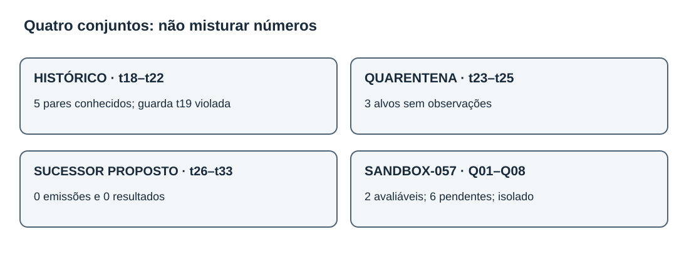
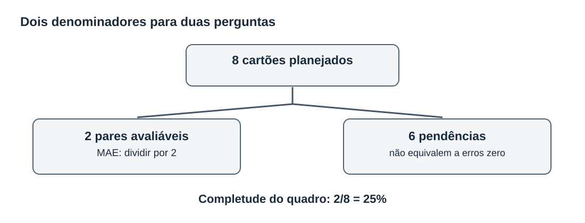
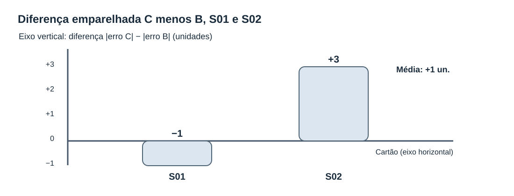
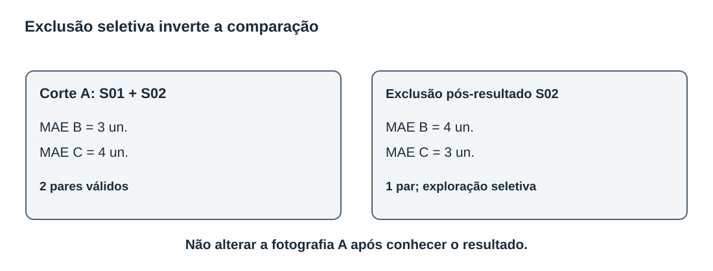
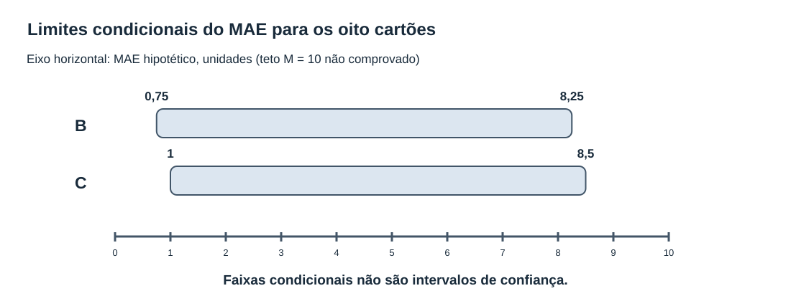
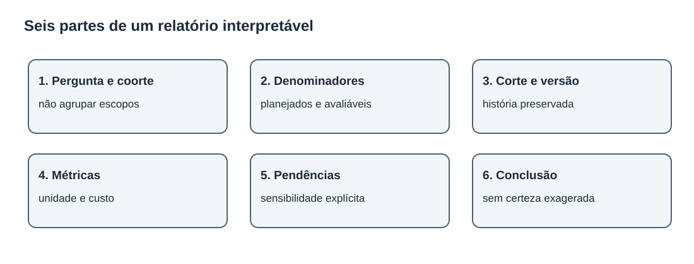

# MAT-EST-058 — Leitura crítica de relatórios temporais: resultados parciais, viés de seleção e comunicação de incerteza por coorte

**Área:** Matemática. **Unidade:** Estatística, séries temporais e ponte universitária. **Nível:** 6. **Anterior:** MAT-EST-057. **Próxima aula proposta:** MAT-EST-059. **Origem:** aula, diagramas e 36 exercícios autorais. **Progresso individual:** não iniciado; produção editorial não comprova estudo. **Natureza:** demonstração matemática local, sem avaliação ou publicação operacional.

**Blocos sugeridos:** A — leitura do relatório e denominadores (35 a 45 minutos); B — seleção, contas e sensibilidade (35 a 50 minutos); C — relatório responsável, prática e reteste (35 a 50 minutos). O avanço depende da compreensão, não apenas da leitura do arquivo.

## 1. Objetivo, pré-requisitos e contexto

Ao estudar e tentar os exercícios, você deverá conseguir: reconstruir o denominador planejado e a quantidade avaliável; calcular médias e diferenças emparelhadas sem confundir a amostra com o plano completo; identificar escolhas que favorecem um resultado após sua observação; distinguir análise planejada, exploratória e hipótese contrafactual; reconhecer que a razão da ausência pode afetar o viés; produzir limites aritméticos condicionais, sem chamá-los de intervalo de confiança; redigir conclusões proporcionais à evidência, separando coortes e versões.

**Pré-requisitos:** frações, porcentagem, média, números negativos, módulo e desigualdades; MAT-EST-047, 049, 050 e 057; noções de emissão anterior ao alvo, corte, versão do observado e custo assimétrico. Se a conta de `2/8` for difícil, trabalhe a fração e sua transformação em porcentagem antes de continuar.

**Por que existe o tema?** Uma manchete pode dizer que um modelo teve erro médio de apenas três unidades. Mas três unidades calculadas em dois resultados disponíveis são uma descrição desses dois resultados, não uma demonstração de desempenho nos oito casos planejados. Um texto pode omitir os seis casos pendentes ou retirar o caso em que o modelo foi pior. A conta continuará correta para a amostra escolhida; o sentido da afirmação mudará. Precisamos auditar a passagem do dado ao relato.

**Relação com exames:** interpretação de gráficos, médias, percentuais, amostras e afirmações sustentadas por evidência transfere-se ao ENEM e a vestibulares. A auditoria formal de modelos é aprofundamento universitário nesta trilha; não se afirma que qualquer banca exija este protocolo específico. Todas as questões desta aula são autorais, inclusive as chamadas de estilo vestibular.

## 2. Retomada exata: quatro universos, quatro funções

A série principal inventada de t01 a t22 permanece intocada. Na avaliação histórica do protocolo MAT-EST-049-PROT-v1, conhecem-se cinco pares simulados de t18 a t22, com erro absoluto médio de **17,60** para a referência B e **8,36** para o desafiante C; custos médios **51,20** e **14,92**, respectivamente. A piora local de C em t19, **19,2 unidades**, excedeu a guarda de dez. Portanto, sob o protocolo histórico congelado, a decisão continua sendo **não promover C**. Os três pares faltantes não são supridos com observações inventadas.

Os períodos t23 a t25 ficam em **quarentena editorial**: nem observado nem emissão autenticada foi criado. B23=183 e C23=199 são recálculos ilustrativos conhecidos, não registros autenticados de um teste independente. O protocolo sucessor MAT-EST-056-PROT-SUC-v1 é um **rascunho local não registrado externamente** que propõe oito alvos t26 a t33: nesses alvos, são **zero emissões, zero observações e zero pares avaliáveis**.

Finalmente, o **SANDBOX-057** é um quadro isolado com cartões S01 a S08, ou Q01 a Q08. São oito tarefas inventadas para aprender contagem de elegibilidade. Só S01 e S02 tinham, no corte didático A, previsão demonstrativa anterior ao alvo e observação validada. Os seis demais estão pendentes por razões diferentes. Não têm ligação com t26 a t33, nem se transformam em uma nova previsão real.

**Figura 1 — Quatro escopos informacionais.** Texto alternativo: histórico t18 a t22 tem cinco resultados conhecidos e falha t19; quarentena t23 a t25 tem três alvos sem observação; sucessor t26 a t33 tem oito alvos propostos sem emissão; SANDBOX-057 tem oito cartões, dois avaliáveis somente na ficção. **Observe:** o sandbox fica separado das coortes temporais. **Conclusão por áudio:** não é legítimo somar amostras de naturezas diferentes para dizer que o sucessor já foi validado. Ilustração original do projeto.

## 3. O denominador vem antes da média

Uma contagem precisa responder três perguntas: qual conjunto foi planejado? Qual condição torna uma tarefa avaliável? Em qual versão ou data de corte a contagem foi registrada? No SANDBOX-057, o plano tem oito cartões. No corte A, dois possuem os elementos necessários para calcular erro; seis não possuem.

| Cartão fictício | Estado no corte A | Consequência para o cálculo |
|---|---|---|
| S01 | par demonstrativo avaliável | entra nas médias do sandbox |
| S02 | par demonstrativo avaliável | entra nas médias do sandbox |
| S03 | previsão não emitida | pendente; não é erro zero |
| S04 | observação chegou após o corte | pendente em A; não retroagir |
| S05 | observação apenas provisória | pendente até validação |
| S06 | versões de previsão conflitantes | pendente até conciliação sem escolher pela perda |
| S07 | fonte reprovada em qualidade | pendente; justificar a falha |
| S08 | observado indisponível | pendente; não estimar valor como fato |

Assim, `8 = 2 + 6`, isto é: oito planejados são dois avaliáveis mais seis pendentes. A taxa de pares avaliáveis no exercício é `2/8 = 0,25 = 25%`, ou dois oitavos, igual a um quarto, igual a vinte e cinco por cento. Isso não mede completude real de uma instituição; é apenas uma propriedade dos cartões inventados. A média do erro usa denominador **dois**, e a taxa de disponibilidade usa denominador **oito**. Trocar esses denominadores confunde duas perguntas.

Se quisermos comparar modelos de maneira emparelhada, cada caso incluído deve possuir previsão B, previsão C e o mesmo observado validado, na mesma origem e horizonte, segundo a regra congelada. Não vale usar dois casos para B e três outros para C sem explicar a mudança de população. Se alguém disser “os dois casos disponíveis representam os oito”, deverá justificar por que a disponibilidade não selecionou casos mais fáceis. Aqui essa justificativa inexiste.

**Figura 2 — Fluxo da coorte fictícia.** Texto alternativo: oito cartões planeados dividem-se em dois avaliáveis e seis pendentes, sem exclusão silenciosa. **Observe:** uma média dos avaliáveis e uma taxa de completude usam denominadores distintos. **Conclusão por áudio:** o relatório deve citar ambos, dois em oito e duas observações no cálculo, e informar por que seis não foram avaliadas. Figura original.

## 4. Exemplo resolvido: contas corretas e conclusão condicionada

Adotamos erro assinado como observado menos previsto. Erro positivo significa observado maior que a previsão. O custo didático é três pontos por unidade subprevista e um ponto por unidade superprevista. O custo é uma escolha hipotética e não regra de gestão real.

| Cartão | Erro B (un.) | Módulo B | Erro C (un.) | Módulo C | Custo B (pontos) | Custo C (pontos) |
|---|---:|---:|---:|---:|---:|---:|
| S01 | +4 | 4 | +3 | 3 | 12 | 9 |
| S02 | −2 | 2 | −5 | 5 | 2 | 5 |

**Leitura por áudio:** no primeiro cartão, B erra quatro para menos e C erra três para menos; no segundo, B prevê dois acima e C prevê cinco acima. Os erros absolutos B são quatro e dois; os de C são três e cinco. Os custos B são doze e dois; os de C são nove e cinco.

A fórmula do erro absoluto médio, abreviado MAE, é a soma dos módulos dos erros dividida pelo número de casos avaliados. Assim, MAE de B é `(4+2)/2 = 3` unidades. MAE de C é `(3+5)/2 = 4` unidades. **São métricas somente dos dois pares fictícios elegíveis**, não dos oito planejados e muito menos de t26 a t33.

A média assinada de B é `(4−2)/2 = +1` unidade. A de C é `(3−5)/2 = −1` unidade. O sinal mostra a direção média, mas erros positivos e negativos podem se cancelar. O custo médio de B é `(12+2)/2 = 7` pontos. O custo médio de C é `(9+5)/2 = 7` pontos. Logo, uma métrica favorece B nos dois pares disponíveis e a outra mostra empate; isso não determina como se comportariam os outros seis.

É útil ainda construir uma diferença **por cartão**: `d_i = |e_C,i| − |e_B,i|`. Leitura: diferença di é o módulo do erro de C menos o módulo do erro de B no mesmo caso. Em S01, `3−4 = −1`, favorecendo C nessa comparação; em S02, `5−2 = +3`, favorecendo B. A média das diferenças é `(-1+3)/2 = +1` unidade, equivalente à diferença dos MAEs quando os mesmos pares são usados. Essa equivalência seria perdida caso os subconjuntos fossem diferentes.

**Figura 3 — Diferença do erro absoluto C menos B, por cartão.** Texto alternativo: eixo horizontal contém S01 e S02; eixo vertical mede a diferença em unidades. S01 está em menos uma unidade e S02 em mais três, média em mais uma. A linha zero divide melhora e piora do desafiante. **Observe:** um bom caso e um caso desfavorável coexistem. **Conclusão por áudio:** a média positiva de uma unidade mostra pior erro absoluto de C nos dois cartões avaliáveis, mas não estima o desempenho dos seis cartões sem resultado. Gráfico original.

## 5. Viés de seleção: retirar um caso muda a história

Considere uma edição indevida do relatório: o autor analisa S01 e S02, vê que C foi pior em S02 e decide eliminar S02 sem que tal exclusão esteja no plano inicial. Sobra somente S01. O MAE passa a ser quatro para B e três para C. O custo passa a doze para B e nove para C. Agora o relato aparenta favorecer C. **Nenhuma previsão melhorou. A amostra é que mudou depois de conhecer o desfecho.** A escolha é uma análise pós-resultado e deve ser identificada como exploração, não como substituição silenciosa do retrato A.

Isso demonstra viés de seleção potencial: o grupo selecionado pode diferir do planejado de maneira relacionada ao erro. Mas não autoriza afirmar que qualquer ausência gera necessariamente viés de uma direção determinada. Também não é possível concluir, a partir do status de S03 a S08, que os seus erros seriam altos ou baixos. O mecanismo da ausência precisa ser investigado, e sua classificação pode exigir informação não presente no relatório.

Três ideias ajudam a interpretar a falta de dados. **Ausência completamente ao acaso** significa que a ocorrência da ausência não depende dos valores dos dados, nem observados nem não observados, sob o modelo de análise considerado. **Ausência ao acaso condicionada aos dados observados** permite dependência de informações já conhecidas. **Ausência não ao acaso** envolve dependência do valor não observado mesmo depois do condicionamento apropriado. São hipóteses estatísticas sobre um mecanismo, não etiquetas que podemos deduzir de oito cartões fictícios. A análise de casos completos pode alterar a representatividade, e o modo como isso ocorre depende do mecanismo, das variáveis e do estimando que queremos aprender. Não prometer “ausência ao acaso” sem justificativa.

**Figura 4 — A mesma amostra após exclusão seletiva.** Texto alternativo: com S01 e S02 juntos o MAE é B três e C quatro; removendo S02 após observar seu resultado, o MAE fica B quatro e C três. **Observe:** o número de cartões cai de dois para um e a direção aparente se inverte. **Conclusão por áudio:** excluir resultado desfavorável muda a pergunta respondida; a fotografia original não pode ser substituída pela seleção exploratória. Diagrama original.

## 6. Como comunicar incerteza sem inventar probabilidades

Um indicador obtido com duas observações não descreve, por si só, a distribuição dos outros seis resultados. Uma forma transparente de estudar a dependência de hipóteses é trabalhar com **limites condicionais**, declarando claramente que não foram observados. Suponha, exclusivamente como exercício matemático, que cada erro absoluto pendente esteja entre zero e dez unidades para os dois modelos. Esse teto `M = 10` (eme igual a dez) não foi estabelecido empiricamente e não é uma garantia.

Para B, a soma dos dois módulos conhecidos é seis. Com mais seis erros entre zero e dez, a média sobre os oito estaria entre `6/8 = 0,75` e `(6+6×10)/8 = 8,25` unidades. Para C, a soma conhecida é oito: a média estaria entre `8/8 = 1` e `(8+60)/8 = 8,5` unidades. Os intervalos são amplos e se sobrepõem; somente com essa hipótese não se conhece a ordem final. A diferença da média dos erros absolutos, C menos B, começa com soma conhecida `8−6 = 2`; os seis pares desconhecidos poderiam adicionar de menos sessenta a mais sessenta. Assim, a diferença condicional estaria entre `(2−60)/8 = −7,25` e `(2+60)/8 = +7,75` unidades. É um limite aritmético conservador, não uma previsão dos valores faltantes e **não é um intervalo de confiança de 95 por cento**.

Se o teto dez não for defensável, esse resultado não é aplicável. Se nenhuma cota finita de erro for conhecida, não há limite superior finito para a média absoluta apenas com os dois resultados apresentados. E o emparelhamento dos valores faltantes pode impor relações mais específicas caso conheçamos as previsões, informações que este exercício não fornece. Portanto, enuncie as premissas e não venda esses limites como certeza probabilística.

Uma segunda análise contrafactual usa S04: **imagine, sem registrar nenhuma nova observação**, que S04 fosse futuramente elegível e tivesse erro B igual a mais oito e erro C igual a mais dois. A média com os três cartões hipotéticos seria `14/3 ≈ 4,67` para B e `10/3 ≈ 3,33` para C. Isso mostra como resultados selecionados ou uma nova fotografia podem modificar a comparação; não transforma os erros oito e dois em dados do SANDBOX-057. Se S04 passar a ser elegível por documentação, mas ainda não tiver erros numéricos reproduzíveis, podemos mudar a contagem de status na fotografia B conforme a regra, porém ainda **não podemos calcular a média de três erros**.

**Figura 5 — Intervalos aritméticos com hipótese de teto dez.** Texto alternativo: eixo horizontal é MAE hipotético em unidades, escala de zero a dez. B poderia variar de zero vírgula setenta e cinco a oito vírgula vinte e cinco; C de um a oito vírgula cinco. **Observe:** as faixas se sobrepõem; os limites só valem supondo seis erros adicionais entre zero e dez para cada modelo. **Conclusão por áudio:** não há ranking global comprovado nem cobertura probabilística inferida por esse gráfico. Gráfico original.

## 7. Um relatório por coorte que não confunde ausência com derrota ou êxito

Uma boa leitura começa por separar as populações e dar nome à pergunta de cada taxa. A tabela a seguir ilustra a fotografia editorial atual, sem mesclar os resultados.

| Conjunto | Alvos planejados no respectivo desenho | Pares presentes nesta fotografia | Estado e inferência permitida |
|---|---:|---:|---|
| Histórico MAT-EST-049-PROT-v1 | 8 | 5 | cinco resultados simulados conhecidos; t19 violou guarda; não promoção |
| Quarentena t23–t25 | 3 | 0 | sem observado ou emissão autenticada; não reutilizar como teste sucessor |
| Sucessor t26–t33 | 8 propostos | 0 | rascunho editorial sem pré-registro externo; não há métricas de previsão |
| SANDBOX-057, Q01–Q08 | 8 cartões fictícios | 2 | 25% demonstrativo de cartões avaliáveis; seis pendências; dados isolados |

Leia a tabela por áudio assim: o histórico tem cinco pares de um plano de oito e falha de segurança registrada. A quarentena contém três alvos sem observado. O sucessor reúne oito alvos apenas propostos, sem qualquer emissão ou observado. O sandbox é um exercício separado: dois de oito cartões permitiram cálculo; isso não aumenta a quantidade de pares do sucessor.

Se o sucessor ainda tem zero pares, o MAE não é zero: é **indefinido/não estimável**. O cálculo teria denominador zero. Também não é correto chamar sua taxa de êxito de cem por cento por não existirem falhas registradas; nenhuma avaliação foi feita. Para o histórico, uma melhora média exploratória de C não revoga a falha t19 nem resolve as três pendências antigas. O protocolo histórico conserva sua conclusão, e qualquer novo protocolo precisa coletar novos alvos legitimamente.

**Figura 6 — Ordem de leitura e auditoria do relatório.** Texto alternativo: seis caixas em sequência identificam pergunta e coorte, denominadores, corte e versão, métricas, pendências e sensibilidade, limites e decisão protocolar. **Observe:** a decisão aparece apenas depois das ressalvas. **Conclusão por áudio:** um número sem população, data de corte, versão e condições não informa adequadamente uma decisão. Esquema original.

### Modelo de conclusão em quatro parágrafos

**Escopo.** “Foi lido o retrato didático A do SANDBOX-057, de oito cartões independentes da série temporal principal. Apenas S01 e S02 tinham pares avaliáveis; seis permanecem pendentes por motivos documentados.”

**Resultado restrito.** “Nos dois pares fictícios avaliáveis, o erro absoluto médio foi de três unidades para B e quatro para C, com custo médio de sete pontos para ambos. Esses valores não representam o desempenho de todos os oito cartões.”

**Incerteza e seleção.** “A exclusão pós-resultado de S02 inverteria a comparação de MAE e, por isso, não pode substituir a análise planejada. Limites condicionais obtidos supondo teto de dez unidades para os seis casos ausentes são apenas hipóteses didáticas, não intervalos de confiança nem dados observados.”

**Relação com o projeto.** “Na série principal, t23 a t25 seguem sem observações autenticadas; o protocolo sucessor de t26 a t33 tem zero pares e não possui métrica avaliável. O protocolo histórico mantém a falha em t19 e não autoriza a promoção do desafiante.”

## 8. Erros frequentes e estratégia de leitura

Confundir taxa de completude com precisão; usar oito como denominador de uma média que contém somente dois módulos; transformar falta em zero; escolher subconjunto após observar erros; apresentar uma fotografia posterior como se existisse no corte original; agrupar os cartões do sandbox com a série principal; chamar limites sob uma suposição arbitrária de intervalo de confiança; definir mecanismo de ausência só a partir da descrição textual; interpretar amostra pequena como estimativa estável; comparar custos sem declarar a função de custo; retirar t19 do protocolo já congelado; confundir resultado de demonstração com autorização de uso real.

Ao avaliar qualquer relatório, escreva: (1) qual pergunta foi planejada, (2) qual população e corte são relevantes, (3) quais dados efetivamente entraram, (4) quais faltam e por quê, (5) qual métrica foi calculada e com que denominador, (6) o que ocorreria se a seleção fosse diferente, (7) qual conclusão o protocolo permite. Se o resultado depende de uma hipótese adicional, coloque a hipótese antes da conta.

**Conexões:** leitura crítica de manchetes e porcentagens em Língua Portuguesa; ética da comunicação científica; desenho de pesquisa e amostragem; computação e controle de versões; análise de políticas públicas como exemplo genérico de necessidade de critérios transparentes, sem converter estes dados inventados em recomendações administrativas ou de saúde.

## 9. Vídeo complementar e fontes

**Vídeo complementar:** [Sampling Methods and Bias with Surveys: Crash Course Statistics #10](https://www.youtube.com/watch?v=Rf-fIpB4D50), canal verificado **CrashCourse**, idioma inglês, publicado em 28 de março de 2018. Duração aproximada não confirmada nesta consulta. **Assista depois da seção 5:** explica amostragem e problemas de seleção com pesquisas e entrevistas. É uma **analogia** para aprender a desconfiar de amostras convenientes: o vídeo não avalia o SANDBOX-057, não ensina todos os mecanismos de ausência em séries temporais e não substitui o conteúdo desta aula. Página pública do vídeo localizada; a reprodução integral não foi realizada no ambiente editorial.

**Fontes técnicas e leituras:** [Hyndman e Athanasopoulos — Time series cross-validation](https://otexts.com/fpp3/tscv.html), que exige treinamento antes do alvo; [Forecast accuracy](https://otexts.com/fpp3/accuracy.html), sobre erro fora do ajuste; [BMJ Open — Reporting missing participant data](https://bmjopen.bmj.com/content/5/12/e008431), cujas boas práticas de declarar perdas e motivos são aqui usadas **por analogia de transparência**, não como protocolo específico de previsão; [CONSORT 2025 — explicação sobre dados faltantes](https://www.bmj.com/content/389/bmj-2024-081124), também citado apenas como analogia de relatório metodológico. Fontes externas orientam conceitos, mas todos os cartões e cálculos da aula são autorais e fictícios.

## 10. Exercícios, revisão e continuidade

As **36 questões autorais** estão em `exercicios.md` e `exercicios.json`: dez de aprendizagem, dez de consolidação, dez no estilo de interpretação vestibular e seis de reteste independente. O **gabarito comentado** fica isolado em `gabarito-comentado.md` e `gabarito-comentado.json`, para não antecipar respostas. A tentativa deve preceder a abertura do gabarito.

**Resumo pronunciável:** oito cartões planejados não significam oito erros conhecidos. Dois foram avaliáveis e seis permaneceram pendentes. Nos dois casos disponíveis, B teve MAE três e C teve MAE quatro, com custos médios empatados em sete. Retirar o caso desfavorável de C após conhecer seu erro muda o resultado sem melhorar o modelo. Um limite de erro imposto aos dados ausentes permite fazer aritmética condicional, mas não cria observações nem confiança estatística. Histórico, quarentena, sucessor e sandbox exigem relatórios separados.

**Revisão espaçada somente após tentativa real:** em um dia, recuperar denominadores e refazer os dois MAEs; em sete dias, reconstruir a diferença emparelhada e explicar a exclusão pós-resultado; em trinta dias, resolver o reteste sem consultar respostas, interpretar os limites condicionais e redigir o relatório em quatro parágrafos. Não marcar consolidado apenas porque a aula foi produzida ou lida.

**Critério de consolidação posterior:** explicar os conceitos com palavras próprias; calcular módulo, média, custo e diferença por par; localizar e justificar pendências; reconhecer os limites das hipóteses; transferir a interpretação para um problema diferente; recuperar o raciocínio numa revisão. Registrar erros por conteúdo, interpretação, cálculo, distração, memória, estratégia ou tempo.

**Próximo tópico editorial proposto:** MAT-EST-059 — Comunicação comparativa de desempenho temporal: gráficos honestos, incerteza condicional e relatório executivo verificável. Ainda não iniciado. Não publicar ou afirmar sincronização sem executar as operações correspondentes.
