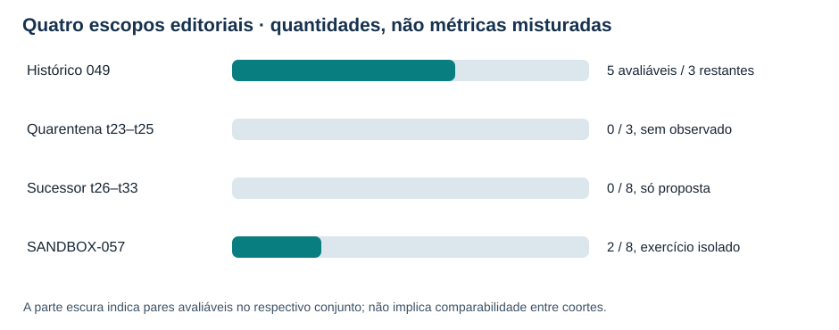
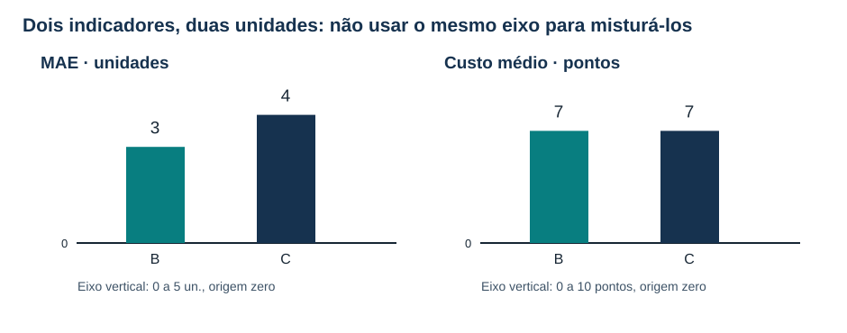
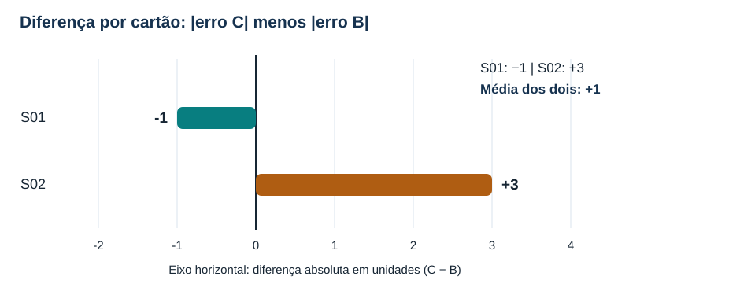
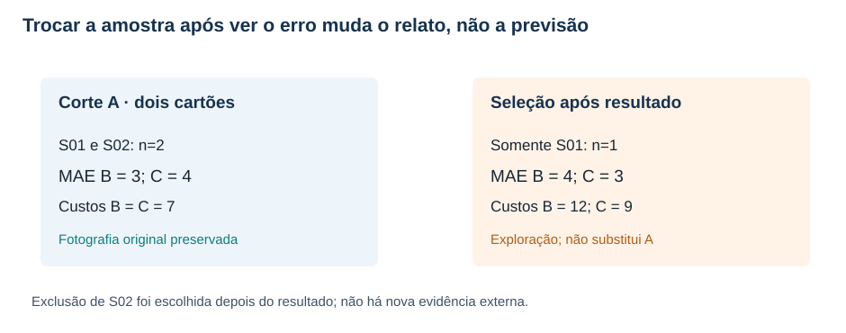
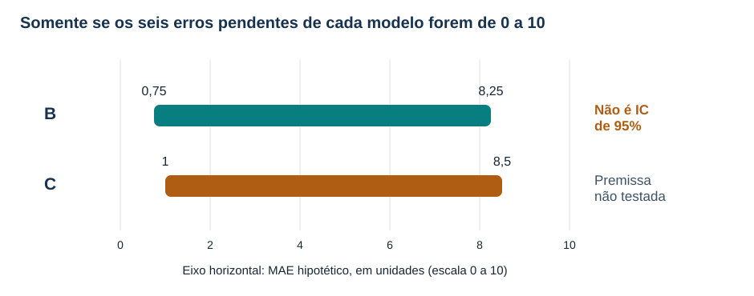
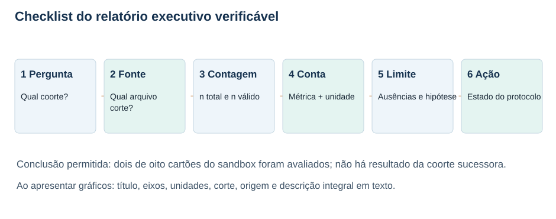

# MAT-EST-059 — Comunicação comparativa de desempenho temporal: gráficos honestos, incerteza condicional e relatório executivo verificável

**Área:** Matemática. **Unidade:** Estatística, séries temporais e ponte universitária. **Nível:** 6. **Anterior:** MAT-EST-058. **Próxima proposta:** MAT-EST-060. **Origem:** aula e exercícios autorais; zero questões oficiais. **Progresso individual:** não iniciado, inalterado. Produzir este pacote não comprova leitura nem domínio.

**Organização flexível:** bloco A, preservar populações e interpretar gráficos (25–50 minutos); bloco B, avaliar diferenças, seleção e limites (25–50 minutos); bloco C, escrever, auditar e praticar o relatório (25–50 minutos). O estudo pode retomar qualquer fundamento necessário, sem fixar disciplina por dia.

## 1. Objetivo, pré-requisitos e por que esta aula existe

Ao estudar e realizar as atividades, você deverá: distinguir coorte histórica de exercício didático; definir denominadores antes de exibir médias; construir gráficos cuja escala não exagere diferenças; apresentar dois indicadores de unidades diferentes em painéis separados; explicar uma diferença por par e não apenas duas médias; enunciar as premissas dos limites condicionais; detectar exclusão posterior ao resultado; redigir um relatório executivo que permita refazer cada número a partir de arquivos, versão e corte; e separar evidência descritiva de decisão de governança.

Pré-requisitos conceituais: fração, porcentagem, média, módulo, diferença com sinal, leitura de eixos e escala. Precedentes específicos: MAT-EST-047, para diagnóstico de erros; MAT-EST-049 e MAT-EST-050, para comparação e guarda; MAT-EST-053 e MAT-EST-054, para proveniência; MAT-EST-056 a MAT-EST-058, para protocolo, pendências e risco de seleção. Se a conta de média estiver insegura, refaça primeiro um exemplo com dois números em vez de avançar sem compreensão.

Por que o tópico existe? Um relatório pode usar números aritmeticamente corretos e comunicar uma conclusão indevida. Basta começar o eixo de um gráfico de colunas muito próximo dos valores, retirar silenciosamente um caso adverso, usar o total planejado no lugar da amostra avaliada ou apresentar um limite hipotético como se fosse intervalo de confiança. Nosso objetivo é construir uma comunicação que resistiria a perguntas simples: “Qual era o conjunto?”, “Quando foi congelado?”, “De onde veio o número?”, “O que não sabemos?” e “O que o protocolo permite concluir?”.

A camada transferível ao ENEM e aos vestibulares é a leitura crítica de gráficos, médias, proporcionalidade, representatividade e argumentação baseada em dados. Os detalhes de governança de modelos são uma ponte universitária; não afirmamos, sem edital, que uma banca exige este protocolo.

## 2. Primeiro separe os quatro universos: não existe uma média única de tudo

A série fictícia principal foi construída até **t22**. Os cinco pares históricos da experiência MAT-EST-049-PROT-v1 estão em t18–t22. Erro absoluto médio (MAE, sigla inglesa para *mean absolute error*) da referência B: **17,60 unidades**; do desafiante C: **8,36 unidades**. Custos didáticos médios B: **51,20 pontos**; C: **14,92 pontos**. Em t19 ocorreu **piora local de C igual a 19,2 unidades**, acima da guarda de dez unidades; o protocolo original continua não autorizando a promoção. O plano tinha oito pares, mas só cinco aparecem no relatório histórico. Nada aqui foi substituído por uma nova coorte.

Os alvos **t23–t25** estão em quarentena editorial: faltam observações e emissões autenticadas. Os valores B23=183 e C23=199, vistos em aula precedente, são recálculos ilustrativos, não registros comprovados antes do alvo. Não foram incorporados a nenhuma média atual. Os alvos **t26–t33** estão somente propostos no protocolo sucessor MAT-EST-056-PROT-SUC-v1, que permanece rascunho local. Há **zero emissões, zero observações e zero pares avaliáveis**. Portanto MAE do sucessor é não estimável, e não zero.

O **SANDBOX-057** é um ambiente didático independente de oito cartões S01–S08, no corte A: dois pares avaliáveis, S01 e S02; seis pendências. Completude didática: dois divididos por oito, ou vinte e cinco por cento. A tabela de erros abaixo descreve somente S01 e S02. Nem o sandbox nem os casos isolados EXEMPLO-V e EXEMPLO-Z incrementam o histórico ou o sucessor.

**Figura 1 — Quatro escopos, cada um com seu denominador.** Texto alternativo: gráfico de barras que apresenta histórico cinco de oito, quarentena zero de três, sucessor zero de oito e sandbox dois de oito. **Observe:** a escala da barra representa fração avaliada *dentro de cada coorte*; não coloca os erros de todos os grupos na mesma média. **Conclusão por áudio:** há cinco pares históricos, nenhum resultado no futuro principal e apenas dois pares em um exercício isolado. Autoria: original do projeto.

É legítimo comunicar as contagens em uma tabela por coorte, mas não comparar um MAE ausente a um MAE existente como se fosse empate. Também não é legítimo juntar S01 e S02 aos cinco pares principais para obter “sete observações”; são populações, procedimentos e objetivos diferentes.

## 3. Gramática mínima de um gráfico verificável

Antes de escolher cores ou formas, escreva em texto a frase que o gráfico deverá sustentar. Por exemplo: “No corte A do exercício SANDBOX-057, dois entre oito cartões são avaliáveis, e as seis pendências não recebem erro zero”. O título deve declarar o assunto; os eixos precisam dizer a grandeza e a unidade; o subtítulo informa o corte e o n; a legenda nomeia símbolos sem depender exclusivamente da cor; e uma frase final mostra o padrão perceptível por áudio.

**Tipo de gráfico e escala.** Barras medem comprimento a partir da base: para comparar magnitudes positivas de erros e custos, use origem zero. Se mostrar uma tendência temporal numa linha, a origem vertical não precisa ser sempre zero, mas um recorte deve estar visível e justificado, sem criar exagero. Não interpolar uma linha contínua através de períodos sem dados: um espaço vazio é uma informação. Um gráfico de diferenças assinadas deve exibir a linha zero claramente, para separar valores positivos e negativos. E não misture unidades e pontos de custo em um único eixo numérico: são grandezas diferentes.

O guia da [Datawrapper sobre barras iniciadas em zero](https://www.datawrapper.de/academy/why-our-column-and-bar-charts-start-at-zero) explica por que truncar a origem pode distorcer a comparação visual; o [guia de linhas](https://www.datawrapper.de/academy/what-to-consider-when-creating-line-charts) discute quando a origem zero é facultativa. Essa é orientação externa, complementar aos números fictícios do nosso projeto.

**Uma legenda não substitui o texto alternativo.** O atributo `alt` ou a descrição do SVG deve falar o que está desenhado. A legenda explica o motivo didático; o parágrafo seguinte explicita os números e a inferência. Se o estudante escutar só “barra azul maior que verde”, não terá recebido o conceito. Também não use apenas tonalidades como “bom” e “ruim”: identifique B e C em texto, com sinal e unidades.

**Armadilha deliberada para reconhecer:** imagine um painel em que B=3 e C=4 sejam duas colunas, mas o eixo vertical comece em 2,9. A altura visível da coluna B seria 0,1 e de C seria 1,1; visualmente, a segunda pareceria onze vezes a primeira, embora os valores originais estejam na razão quatro para três. A solução é recuperar o zero em barras ou trocar por um gráfico de pontos claramente rotulado. Este exemplo de escala é autoral e não altera qualquer dado da série.

## 4. Exemplo resolvido: uma tabela, dois indicadores e dois eixos corretos

A convenção de erro é **observado menos previsto**. Erro positivo significa subprevisão; erro negativo significa superprevisão. O custo artificial é três pontos por unidade subprevista mais um ponto por unidade superprevista. A tabela a seguir é do SANDBOX-057, não da coorte principal.

| Cartão | Erro B (un.) | Erro C (un.) | Módulo B (un.) | Módulo C (un.) | Custo B (pontos) | Custo C (pontos) |
|---|---:|---:|---:|---:|---:|---:|
| S01 | +4 | +3 | 4 | 3 | 12 | 9 |
| S02 | −2 | −5 | 2 | 5 | 2 | 5 |

Por áudio: em S01 ambos os modelos subpreviram, com módulos quatro e três. Em S02 ambos superpreviram, com módulos dois e cinco. Somar módulos permite calcular MAE, enquanto o custo depende da direção. O custo de B em S01 é três vezes quatro, igual a doze pontos; o custo de C em S02 é cinco pontos, pois o erro foi negativo.

A fórmula do erro absoluto médio é `MAE = soma dos módulos dos erros / número de pares elegíveis`. Leitura: eme-á-ê é a soma dos tamanhos dos erros dividida pelo número de casos realmente avaliáveis. Assim, B tem `(4+2)/2 = 3` unidades; C tem `(3+5)/2 = 4` unidades. O custo médio é B `(12+2)/2 = 7` pontos e C `(9+5)/2 = 7` pontos. O denominador é dois para ambas as médias, não oito; oito vale para a taxa de completude.

**Figura 2 — Magnitudes com origem zero e eixos separados.** Texto alternativo: à esquerda, MAE B três e C quatro em unidades; à direita, custo médio B sete e C sete em pontos; ambos os eixos verticais começam em zero. **Observe:** um indicador difere e o outro empata; uma visualização isolada não responde todas as perguntas. **Conclusão por áudio:** C teve maior erro absoluto médio nos dois cartões, mas os custos médios são iguais para a regra fictícia definida. Autoria: original do projeto.

Se fizermos um painel com título “C é 33,3% pior em MAE”, a conta `(4−3)/3 = 1/3` está correta **somente para os dois cartões do sandbox e com B no denominador**. O adjetivo “pior” deve vir acompanhado do escopo e da métrica; ele não autoriza extrapolação ao conjunto de oito, ao protocolo sucessor ou ao mundo real. Também não há porcentagem de vantagem para custo, pois a diferença entre as médias de custo é zero.

## 5. A diferença emparelhada mostra o que a média oculta

Defina `d_i = |erro de C no cartão i| − |erro de B no mesmo cartão i|`. Leia: dê índice i é módulo do erro de C menos módulo do erro de B no mesmo caso. Valores negativos significam que C teve erro absoluto menor naquele cartão; positivos significam maior. Em S01, três menos quatro dá menos uma unidade. Em S02, cinco menos dois dá mais três unidades. A média das duas diferenças é `(-1+3)/2 = +1` unidade, compatível com MAE C quatro menos MAE B três.

**Figura 3 — Duas diferenças de sinais opostos.** Texto alternativo: eixo horizontal em unidades, com zero visível; S01 está em menos uma unidade, S02 em mais três e média em mais uma. **Observe:** o mesmo desafiante teve um caso com módulo menor e outro com módulo maior. **Conclusão por áudio:** o resumo de mais uma unidade é média de dois casos heterogêneos, não uma lei sobre períodos futuros. Autoria: original do projeto.

Por que emparelhar? Cada diferença compara modelos sobre **o mesmo alvo**, preservando as condições comuns ao caso. Se fossem escolhidos conjuntos de casos diferentes para B e C, a diferença entre duas médias não corresponderia à média das diferenças por alvo; ela misturaria desempenho com composição de amostra. Tampouco transforme duas diferenças em uma estimativa confiável de dispersão futura: são apenas dois resultados inventados.

## 6. Como um gráfico pode esconder uma seleção posterior

A fotografia primária do sandbox inclui S01 e S02. Se, depois de conhecer os resultados, alguém retira S02 porque C teve erro cinco ali, o painel passa a conter só S01. Nessa seleção posterior, o MAE fica B quatro, C três; os custos ficam B doze, C nove. Pareceria haver inversão da comparação. Nenhuma previsão melhorou. A amostra foi alterada depois de conhecer o desfecho. Uma análise assim pode ser registrada como exploração *pós-resultado*, mas não substituir o corte A previamente identificado.

**Figura 4 — Duas fotografias não intercambiáveis.** Texto alternativo: à esquerda, corte A com dois cartões e MAEs três e quatro; à direita, seleção apenas de S01 e MAEs quatro e três. **Observe:** a direção aparente se inverte porque S02 foi excluído após o resultado. **Conclusão por áudio:** informe sempre o denominador, o motivo e o momento de cada exclusão; não oculte os seis pendentes nem sobrescreva o corte original. Autoria: original do projeto.

Um relatório verificável deve incluir o registro da versão do conjunto de dados, a regra de elegibilidade, o instante lógico do corte, a lista de casos incluídos, pendentes e excluídos, o motivo e a data da alteração. A presença de uma correção em uma fotografia B não implica que A esteja errada: cada fotografia responde a uma pergunta temporal diferente. Os exercícios S04, S05 e S06 ilustram, respectivamente, chegada posterior ao corte, versão apenas provisória e ambiguidade de emissão; nenhum recebeu erro válido em A.

## 7. Incerteza condicional é uma conta “se... então...”, não garantia probabilística

Os seis cartões pendentes não informam seus erros. Para estudar o tamanho da ignorância, MAT-EST-058 propôs um teto puramente **hipotético**: em cada um dos seis casos, para cada modelo, o módulo do erro estaria entre zero e dez unidades. Essa hipótese `M = 10` não foi demonstrada, não é limite operacional, não é cobertura estatística e não gera observações.

Para B, os módulos conhecidos somam seis. Oito módulos hipoteticamente completos somariam no mínimo seis e no máximo sessenta e seis. Dividindo por oito, o MAE condicional de B estaria entre `6/8 = 0,75` e `66/8 = 8,25` unidades. Para C, os módulos conhecidos somam oito; a média condicional estaria entre `8/8 = 1` e `68/8 = 8,5` unidades. A diferença C menos B começa em soma oito menos seis, igual a dois; cada par adicional poderia contribuir entre menos dez e mais dez. Assim, a diferença média condicional poderia situar-se entre `(2−60)/8 = −7,25` e `(2+60)/8 = +7,75` unidades.

**Figura 5 — Faixas de MAE condicionadas a um teto artificial.** Texto alternativo: eixo horizontal mede MAE hipotético entre zero e dez unidades; B varia de 0,75 a 8,25 e C de 1 a 8,5. As faixas se sobrepõem. **Observe:** não há graus de confiança ou chance atribuídos aos limites. **Conclusão por áudio:** sem defender o teto dez, nem esses limites podem ser usados; nenhuma direção global de desempenho fica estabelecida para os oito cartões. Autoria: original do projeto.

**Distinguir três tipos de faixa:** um *intervalo de predição* pretende descrever futuros valores de uma variável com método e hipóteses estatísticas especificadas; um *intervalo de confiança* pretende expressar a incerteza de um procedimento de estimação de parâmetro sob condições próprias; aqui temos somente **limites determinísticos condicionais a uma restrição hipotética dos seis erros faltantes**. Usar a expressão “95% de confiança” nesta figura seria uma afirmação inventada. As premissas precisam constar no título, na legenda, no texto alternativo e no relatório executivo.

**Demonstração de sensibilidade, sem criar novos dados:** se o teto hipotético fosse cinco, B estaria entre seis oitavos, ou 0,75, e trinta e seis oitavos, ou 4,5; C entre um e trinta e oito oitavos, ou 4,75. A diferença média condicional iria de `(2−30)/8 = −3,5` a `(2+30)/8 = +4`. Essa conta explica que conclusões mudam com a premissa. Não há evidência empírica para preferir cinco a dez no sandbox. Se nenhum teto finito for justificável, não se obtém limite superior finito apenas com as duas observações conhecidas.

## 8. Produzir um relatório executivo que possa ser refeito

“Executivo” significa breve, mas não significa esconder ressalvas. Separe quatro parágrafos: pergunta e universo; números e forma de cálculo; ausência e incerteza; estado do protocolo e próxima verificação. Acrescente uma tabela pequena de proveniência com ID, corte e arquivo. O relatório não deve declarar autoria humana, assinatura, certificação temporal ou sincronização técnica que não ocorreram. A matriz local `relatorios/MAT-EST-059-matriz-afirmacoes-fontes-limites.json` liga dez afirmações a seus cálculos e limitações; isso torna possível refazer o texto sem transformá-lo em uma auditoria externa.

**Modelo de relatório, exclusivamente didático:**

> No corte A do exercício isolado SANDBOX-057, oito cartões estavam planejados e dois eram avaliáveis (25%); seis permaneciam pendentes. Esse exercício não é a avaliação do sucessor t26–t33.
>
> Nos dois pares avaliáveis, o erro absoluto médio foi de três unidades para B e quatro para C. Os custos médios foram iguais a sete pontos sob a regra artificial de três pontos por unidade subprevista e um por unidade superprevista. As diferenças emparelhadas dos módulos foram menos uma e mais três unidades, média mais uma.
>
> Os dados dos seis cartões não avaliáveis não possuem erros apurados. As faixas obtidas impondo teto hipotético dez aos erros faltantes são apenas limites aritméticos condicionais; não são intervalos de confiança e não resolvem a ordem final dos modelos. A seleção de apenas S01 após observar S02 é exploratória, não o corte primário.
>
> No histórico MAT-EST-049-PROT-v1 há cinco de oito pares e uma violação da guarda local em t19 (19,2 unidades contra limite dez), motivo pelo qual C não foi promovido no protocolo antigo. A quarentena t23–t25 não recebeu observações autenticadas. O sucessor t26–t33 é proposta editorial com zero emissões, observados e métricas estimáveis. O passo responsável é preservar os registros e aguardar evidência elegível antes de reavaliar qualquer decisão.

**Figura 6 — Seis elos de uma afirmação auditável.** Texto alternativo: fluxo da pergunta e universo para fonte e corte, denominador, conta com unidade, limites e estado do protocolo. **Observe:** nenhum elo pode ser pulado sem perder rastreabilidade. **Conclusão por áudio:** uma frase numérica responsável informa sua população, de onde veio, como foi calculada e até onde sua conclusão alcança. Autoria: original do projeto.

### Tabela de rastreabilidade mínima

| Afirmação do relatório | Fonte local correspondente | Conferência independente |
|---|---|---|
| Dois entre oito avaliáveis | `sandbox/SANDBOX-057-cartoes.csv` | Contar oito linhas e dois `eligible_demo` |
| MAEs três e quatro | Mesmo CSV | Calcular módulos de S01 e S02 |
| Custos médios sete e sete | Mesmo CSV e regra didática | Aplicar a convenção do sinal |
| Faixas sob teto dez | `relatorios/MAT-EST-058-leitura-critica-SANDBOX-057.json` | Refazer extremos, sem tratá-los como IC |
| Falha t19 = 19,2 | `dados/comparacao-emparelhada-t18-t22.csv` | Ler a linha t19 e a guarda histórica |
| Sucessor sem dados | `protocolo-sucessor/MAT-EST-056-PROT-SUC-v1.json` | Conferir contadores e estado rascunho |

Em áudio: cada afirmação tem uma fonte concreta que permanece no pacote. Todos os números estão circunscritos a universos explicitados. O campo `null` de uma métrica do sucessor significa não estimável e não deve ser trocado por zero em gráficos ou por um espaço silencioso na tabela.

## 9. Aplicações, relações entre disciplinas e erros comuns

**Matemática:** proporção, média, módulo, números negativos, escalas, diferença pareada e funções por partes para custo. **Língua Portuguesa e Redação:** identificar tese, qualificar afirmações, evitar generalização sem base, formular sínteses curtas com evidência. **Computação:** arquivo de origem, versão, manifesto SHA-256, reprodutibilidade; o hash apenas identifica bytes, não certifica a veracidade de um fato nem a anterioridade de uma emissão. **Metodologia científica:** separar análise exploratória de protocolo previamente definido, registrar exclusões e condições de uso. **Ciências e Humanidades:** interpretar visualizações públicas sem confundir população estudada e população sobre a qual se afirma algo.

Erros a reconhecer em exercícios: representar dado ausente como zero; combinar custos e módulos em um eixo; usar duas médias de amostras diferentes para fingir uma comparação pareada; truncar uma coluna sem aviso; omitir os seis pendentes; excluir um resultado inconveniente e chamar a nova amostra de original; inventar observação para t23; confundir limite condicional com intervalo estatístico; interpretar uma média menor como revogação automática da guarda; declarar “modelo aprovado” sem autorização real. Ao corrigir, classifique o erro provável como conteúdo, interpretação, cálculo, estratégia, memória, distração ou tempo, e volte ao pré-requisito necessário.

### Roteiro de checagem antes de publicar um gráfico

Pergunte em prosa: que pergunta é respondida? A unidade e o horizonte estão escritos? O título diz qual coorte e qual corte? As barras começam em zero? A linha de diferença contém zero? Os valores inválidos e pendentes aparecem sem ser interpolados? O atributo de texto alternativo e a legenda repetem os números essenciais? A tabela de dados e seu hash constam do pacote? O gráfico comunica uma hipótese como hipótese? A conclusão do relatório é compatível com a decisão registrada no protocolo?

## 10. Vídeo complementar e referências

**Vídeo:** [How to spot a misleading graph — Lea Gaslowitz](https://www.youtube.com/watch?v=E91bGT9BjYk), canal TED-Ed, em inglês, cerca de quatro minutos e dez segundos segundo fontes públicas secundárias. Assistir depois da seção 3 e antes de refazer os gráficos 2 e 3. Foi escolhido porque demonstra como escalas, cortes, seleção e contexto alteram a percepção de dados. O vídeo foi localizado na página pública do TED-Ed e no resultado do YouTube, mas a reprodução integral em navegador e a duração direta no player não foram realizadas nesta etapa. Ele é complemento: todos os raciocínios da aula estão explicados aqui.

**Fontes externas de orientação:** [Forecasting: Principles and Practice, validação cruzada temporal](https://otexts.com/fpp3/tscv.html); [avaliação da acurácia de previsões](https://otexts.com/fpp3/accuracy.html); [Datawrapper, por que barras começam em zero](https://www.datawrapper.de/academy/why-our-column-and-bar-charts-start-at-zero); [Datawrapper, cuidados com gráficos de linhas](https://www.datawrapper.de/academy/what-to-consider-when-creating-line-charts); [TED-Ed, lição original sobre gráfico enganoso](https://ed.ted.com/lessons/how-to-spot-a-misleading-graph-lea-gaslowitz). Essas fontes fundamentam a orientação geral; todos os números S01–S08 e t01–t33 citados na aula são materiais fictícios do projeto, não dados dessas instituições.

## 11. Exercícios, avaliação e revisão

Os arquivos `exercicios.md` e `exercicios.json` incluem dez questões básicas, dez de consolidação, dez de transferência em estilo vestibular (autorais; nenhuma questão oficial) e seis de reteste posterior. Não abra o `gabarito-comentado.md` ou `gabarito-comentado.json` antes da tentativa se estiver estudando. Eles explicam cada etapa, interpretação, unidades e motivo provável do erro.

**Resumo pronunciável:** primeiro declare a coorte e o corte; depois conte planejados e avaliáveis. Mostre MAE em unidades e custo em pontos em visuais separados, ambos com base zero se forem barras. Uma diferença emparelhada preserva o mesmo alvo. Não apague um cartão após ler seu erro. Uma faixa baseada no teto hipotético de dez é apenas uma consequência da hipótese, não uma probabilidade nem uma estimativa validada. O relatório deve informar fonte, cálculo, limite, pendências e estado do protocolo; cinco pares históricos e dois cartões didáticos não se misturam. O desafiante continua não promovido no protocolo antigo devido à violação da guarda t19.

**Revisão espaçada somente após tentativa real:** contar um, sete e trinta dias desde o primeiro estudo efetivo, não desde a geração editorial. Em um dia, reconstruir as duas médias e o gráfico da diferença; em sete dias, produzir sem gabarito uma legenda completa, o teste de corte A e as faixas condicionais; em trinta dias, resolver o reteste e escrever um relatório de quatro parágrafos. **Critério de consolidação futura:** explicar denominadores, reconstruir contas com unidades, distinguir escala de seleção, detectar hipótese sem evidência, produzir gráfico acessível e manter a decisão histórica sem confundi-la com métrica média. O status não foi alterado nesta produção.

**Próximo tópico editorial proposto:** MAT-EST-060 — Auditoria de gráficos e relatórios automatizados: testes de consistência, versões e acessibilidade de publicação. Ainda não iniciado.

**Limites da execução:** pacote produzido apenas localmente; sem publicação no site, sincronização Drive ou GitHub, teste real de leitor de tela/Edge, pré-registro externo, emissão ou observação nova e sem reprodução integral do vídeo. A imagem PNG de prévia é uma composição editorial ilustrativa, não uma captura do site.
