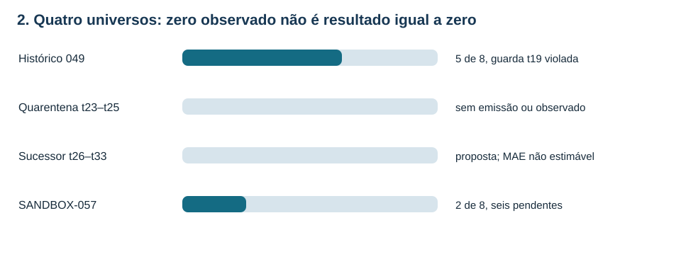
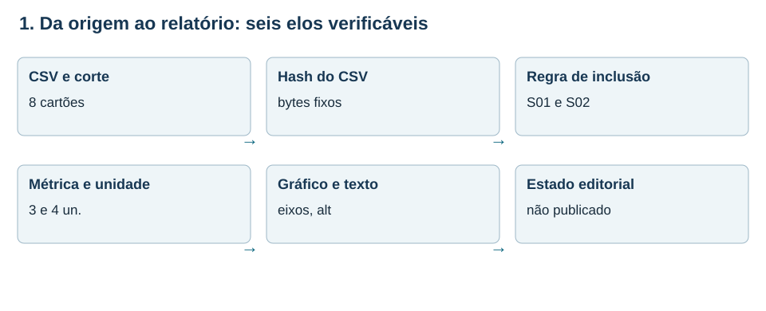
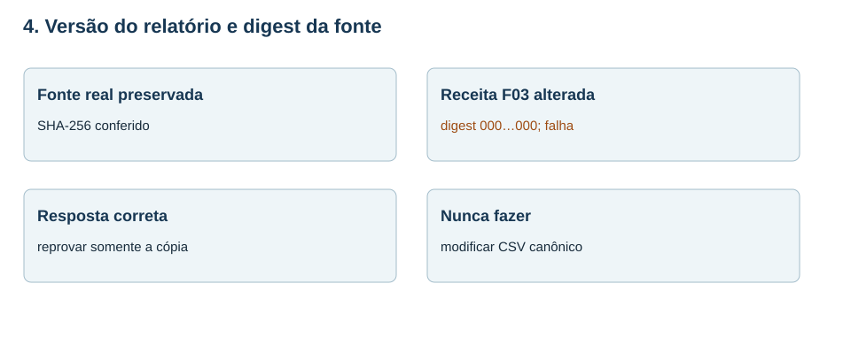
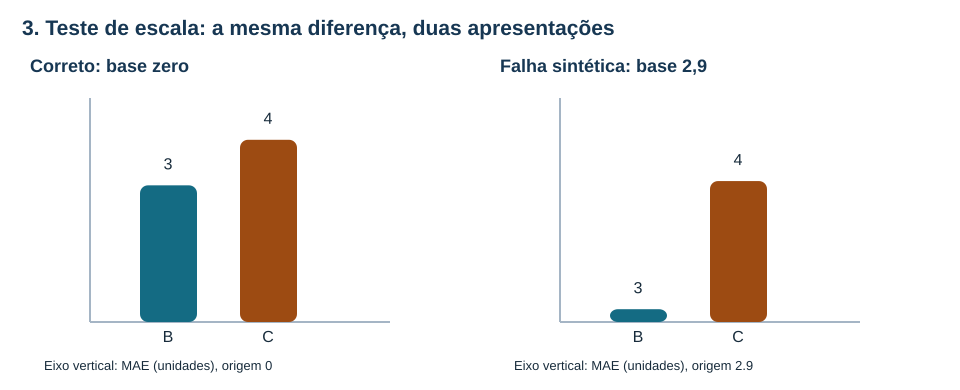
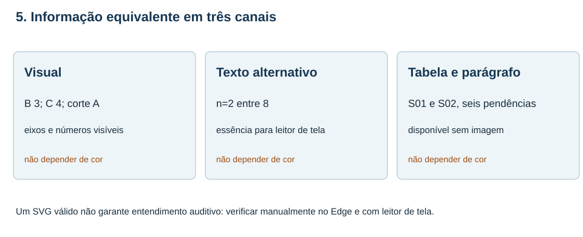
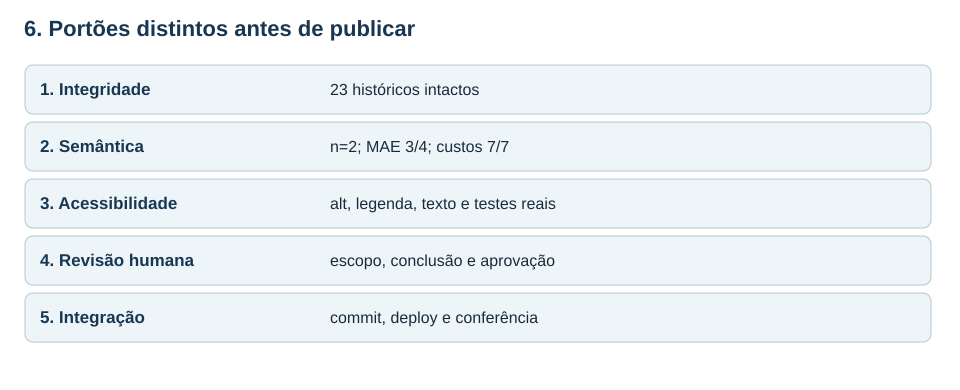

# MAT-EST-060 — Auditoria de gráficos e relatórios automatizados: testes de consistência, versões e acessibilidade de publicação

**Área:** Matemática. **Unidade:** Estatística, séries temporais e ponte universitária. **Nível:** 6. **Anterior:** MAT-EST-059. **Próxima proposta:** MAT-EST-061. **Origem:** aula e exercícios autorais, zero questões oficiais. **Progresso individual:** não iniciado, inalterado; a produção editorial não demonstra estudo.

**Ritmo flexível:** bloco A (25 a 50 minutos), rastrear origem e conferir números; bloco B (25 a 50 minutos), testar gráficos e versões; bloco C (25 a 50 minutos), acessibilidade, publicação simulada e exercícios. Não avançar se a diferença entre dado ausente e zero não estiver clara.

## 1. Objetivo, contexto e pré-requisitos

Ao concluir uma tentativa real, espera-se que você consiga: (a) especificar a população e o corte que um relatório descreve; (b) recomputar de uma fonte congelada as métricas; (c) detectar adulterações de denominador, unidade, digest e eixo; (d) separar testes de máquina de julgamento editorial e testes reais com tecnologia assistiva; (e) usar estados de publicação precisos; e (f) explicar por que um relatório deve ser refeito quando a fonte muda, sem apagar sua versão anterior.

**Pré-requisitos:** média, módulo, proporção, porcentagem, custo definido por partes, eixos cartesianos, leitura de tabelas e diferença entre observação, hipótese e ausência. Recuperar MAT-EST-049 e MAT-EST-050 para a guarda histórica; MAT-EST-053 e MAT-EST-054 para versão e hash; MAT-EST-057 a MAT-EST-059 para coortes, seleção e comunicação.

**Por que existe?** Um gráfico feito automaticamente pode conter erros bem menos visíveis do que um erro de soma: um valor nulo convertido em zero, a legenda de uma coorte antiga acoplada a dados mais novos, um eixo truncado, um relatório que continua dizendo que algo está aprovado depois de um protocolo registrar o contrário. Nenhuma dessas falhas deve ser escondida por uma aparência profissional. Por isso fazemos verificações de *contrato*: estabelecemos antes quais entradas, transformações, unidades e limites são aceitáveis. O tema é transferível à leitura de estatística e gráficos em exames; a engenharia detalhada das verificações é ponte universitária, não uma cobrança afirmada de qualquer banca.

## 2. O acervo que NÃO será reescrito

A série principal é inteiramente fictícia. Seu histórico t01–t22 permanece invariável. No protocolo original MAT-EST-049-PROT-v1 há cinco de oito pares planejados, MAE B=17,60 e C=8,36 unidades e custos médios B=51,20 e C=14,92 pontos. Apesar dessas médias, em t19 o desafiante teve deterioração local de 19,2 unidades: ultrapassou a guarda de dez. Não foi promovido pelo protocolo original. Os três alvos t23–t25 continuam sem emissões autenticadas e sem observados. O sucessor t26–t33 é apenas rascunho, com zero pares; sua métrica é **não estimável**, nunca igual a zero.

Em separado existe o SANDBOX-057, com oito cartões fictícios S01–S08. Apenas S01 e S02 são avaliáveis no corte A; os outros seis ficam pendentes. Os erros assinados são B [+4, −2] e C [+3, −5], sempre observado menos previsto. Por isso os módulos são B [4,2] e C [3,5].

| Recorte | Planejados | Avaliáveis | Métrica identificável |
|---|---:|---:|---|
| Histórico 049 | 8 | 5 | MAE B=17,60; C=8,36; guarda t19 violada |
| Quarentena t23–t25 | 3 | 0 | Sem MAE estimável |
| Sucessor t26–t33 | 8 | 0 | Sem MAE estimável; apenas proposta |
| SANDBOX-057 corte A | 8 | 2 | MAE B=3; C=4; custo médio 7 em ambos |

**Versão por áudio:** o histórico possui cinco pares, os futuros ainda não têm pares e o exercício isolado tem apenas dois. Não se pode juntar essas contagens nem transformar a falta de uma métrica em zero.

**Figura 1 — A barra só indica completude dentro de cada universo.** Texto alternativo: histórico cinco de oito, quarentena zero de três, sucessor zero de oito e sandbox dois de oito; a falta de pares do sucessor significa métrica não estimável. **Observe:** o gráfico não mistura as quatro coortes. **Conclusão por áudio:** cada denominador pertence a uma população e a um corte. Autoria: original do projeto.

## 3. Da fonte ao resultado: seis elos

Uma fonte não é o mesmo objeto que o gráfico produzido com ela. Comece por identificar `sandbox/SANDBOX-057-cartoes.csv` e congelar uma fotografia de seus bytes, anotando o identificador do corte A. A seguir, selecione apenas linhas marcadas `eligible_demo` — no nosso conjunto, exatamente S01 e S02 — e aplique as contas com unidade. Depois produza tabela, gráfico, texto alternativo, legenda e relatório. Por último, informe a situação de integração. Há um arquivo demonstrativo `auditoria/MAT-EST-060-fonte-congelada.json` que registra o digest SHA-256 dessas fontes locais e os números derivados. Um digest diferente indica bytes diferentes; digest igual não prova que um fato externo aconteceu, nem certifica a anterioridade de uma previsão.

**Figura 2 — Seis elos de um artefato verificável.** Texto alternativo: o CSV e corte ligam-se ao hash, à inclusão S01 e S02, ao cálculo com unidade, ao gráfico acessível e ao estado editorial não publicado. **Observe:** trocar qualquer elo exige uma revisão e novo identificador de versão, não uma edição invisível. **Conclusão por áudio:** um relatório é rastreável se cada número tem população, fonte, operação e limitação. Autoria: original do projeto.

A fórmula do erro absoluto médio é `MAE = (soma dos valores absolutos dos erros) / n`. Leitura por extenso: eme-á-ê é a soma dos módulos de erro dividida pelo número de pares elegíveis. Para B: `(4+2)/2=3` unidades. Para C: `(3+5)/2=4` unidades. O custo didático é `C(e)=3·máximo(e,0)+máximo(−e,0)`. Leitura: três vezes a parte positiva do erro, mais a parte positiva do erro com sinal invertido. Em B, os custos são doze e dois pontos; média sete. Em C, nove e cinco pontos; média sete. Oito é o denominador da completude de 25%, e **não** das médias calculadas com dois pares.

Se um programa dividir a soma seis de B por oito, reportará 0,75 e parecerá ter melhorado o modelo sem obter uma única previsão correta adicional. Essa saída deve falhar no teste `DENOMINATOR_MISMATCH`.

## 4. Teste de contrato: coerência entre CSV, cálculo e narrativa

O verificador local `auditoria/auditar_publicacao.py` lê o CSV novamente, seleciona os dois elegíveis e recalcula as quatro métricas; só então compara uma receita de visualização com o esperado. Compara também o hash do arquivo que o relatório diz usar, as unidades, o estado ausente do sucessor e um marcador de conclusão. Essa verificação evita confiar cegamente num JSON de painel gerado anteriormente. O arquivo `auditoria/MAT-EST-060-fixtures-didaticos.json` contém nove receitas: F00 é uma versão didática coerente; F01 a F08 são alterações deliberadamente defeituosas, criadas em cópias de receita — **não** são defeitos identificados nos arquivos anteriores.

| Receita experimental | Alteração em cópia isolada | Código esperado |
|---|---|---|
| F00 | Valores e contexto coerentes | Apto somente nos testes automáticos |
| F01 | Divide por oito, não por dois | DENOMINATOR_MISMATCH |
| F02 | Faz MAE futuro ausente virar zero | NOT_ESTIMABLE_MUST_BE_NULL |
| F03 | Troca digest da receita por zeros | REPORT_SOURCE_HASH_DIVERGENT |
| F04 | Faz eixo de barra começar em 2,9 | BAR_AXIS_ZERO_REQUIRED |
| F05 | Remove alternativa textual | ALT_INSUFFICIENT |
| F06 | Declara promoção histórica inexistente | DECISION_UNSUPPORTED |
| F07 | Rotula custo em unidades, não pontos | UNIT_MISMATCH |
| F08 | Retira legenda e contexto de corte A | CAPTION_MISSING_CONTEXT |

**Por áudio:** o fixture correto precisa passar; os oito defeituosos precisam falhar pelo motivo apropriado. Uma rotina de teste que só aceita dados corretos, sem conseguir detectar dados deliberadamente incorretos, não foi adequadamente examinada.

## 5. Versões, dados nulos e integridade do relatório

Imagine que o relatório tenha sido gerado a partir do CSV de oito cartões, e que um editor reescreva o arquivo posteriormente. Se publicar o gráfico antigo como atual, o arquivo de origem apontado pode não reproduzir o número exposto. Nossa checagem compara o digest declarado com o digest dos bytes presentes. No fixture F03, só a *receita fictícia* recebe um hash com 64 zeros. O arquivo canônico permanece idêntico; a falha é `REPORT_SOURCE_HASH_DIVERGENT`. Não temos prova de quando um hash foi calculado antes de existir um registro externo autenticado.

Outra situação ocorre com o sucessor t26–t33: o campo de erro absoluto médio é `null`, que significa cálculo ainda indisponível. Transformá-lo em zero comunica precisão perfeita sem uma observação sequer. Nem gráfico, tabela ou leitura em voz alta deve fazer essa conversão. Uma versão corrigida de relatório deve informar versão anterior, motivo da correção, diferenças e fonte usada; não apagar a trilha anterior. Para dados numéricos, confirmar também o tipo do campo: o texto “4” não é automaticamente uma medição nova.

**Figura 3 — Fonte estável, relatório experimental defeituoso.** Texto alternativo: a fonte CSV real conserva seu SHA-256; a receita F03 tem digest substituído por zeros e deve falhar, sem alteração do dado canônico. **Observe:** um hash identifica bytes, não certifica a realidade de uma observação. **Conclusão por áudio:** detectar divergência é um alerta para reconstruir e investigar, não autorização para sobrescrever uma versão histórica. Autoria: original do projeto.

## 6. Gráficos: forma, escala e informação equivalente

Uma automação precisa validar sua visualização como parte do *conteúdo*, não só verificar que gerou um SVG. Para barras que representam magnitude, comece no zero. Para diferenças assinadas, mostre a origem zero e os dois lados do eixo. Dê título, corte, tamanho de amostra, grandeza e unidade; não misture pontos de custo com unidades de erro num mesmo eixo. Se o resultado estiver ausente, use uma indicação textual de pendência, e não uma barra de altura zero. Ao usar cor, repita nomes e valores ao lado das marcas.

**Figura 4 — Dois desenhos dos mesmos MAEs, um contrafactual.** Texto alternativo: no painel correto, barras de B três e C quatro começam no zero; no desenho deliberadamente defeituoso, começam em 2,9, ampliando a diferença visível. **Observe:** os números não mudaram; a representação sim. **Conclusão por áudio:** o teste F04 detecta uma opção inadequada para barras de magnitude; isso não constitui achado real no pacote MAT-EST-059. Autoria: original do projeto.

Não basta que um SVG tenha elementos `title` e `desc`: a informação essencial também deve estar na legenda visível e em texto corrido, para permanecer compreensível quando a imagem não carregar ou quando apenas a leitura em voz alta for utilizada. A alternativa deve dizer algo como: “No sandbox, B tem MAE de três e C de quatro unidades; somente dois de oito cartões foram avaliáveis”. Uma legenda pode adicionar que existem seis pendências e que as contas não se aplicam ao sucessor. A tabela de dados oferece recuperação exata por coluna e linha. As recomendações do [W3C WAI sobre nomes e descrições](https://www.w3.org/WAI/ARIA/apg/practices/names-and-descriptions/) e da [Datawrapper sobre descrições alternativas](https://www.datawrapper.de/academy/how-to-write-good-alternative-descriptions-for-your-data-visualization) ajudam nesta prática.

**Figura 5 — O gráfico não é a única fonte de compreensão.** Texto alternativo: três canais trazem a mesma informação sobre B três, C quatro, dois avaliáveis de oito e seis pendências: gráfico, alternativa textual e tabela com parágrafo. **Observe:** não é suficiente descrever apenas a cor ou uma altura relativa. **Conclusão por áudio:** quem escuta precisa receber os números, sua unidade, população e principal limitação. Autoria: original do projeto.

## 7. Teste automatizado não é teste real de acessibilidade

O script consegue detectar arquivo vazio, marcação SVG malformada, falta estrutural de `title` e `desc`, ausência de palavra-chave no texto alternativo, eixos inconsistentes numa receita e links internos quebrados. Não consegue assegurar sozinho que o narrador do Microsoft Edge pronuncie a fórmula com clareza, que o foco percorra os elementos na ordem certa, que o zoom não oculte conteúdo ou que um leitor de tela reconheça adequadamente uma combinação concreta de navegador e tecnologia assistiva. Esses pontos exigem uma sessão real de avaliação, anotada com navegador, versão, dispositivo, modo claro/escuro e defeitos encontrados. A página local é uma prévia, não prova de acessibilidade da produção.

O conteúdo HTML deve ter um único título principal, subtítulos em ordem lógica, tabelas com `caption` e cabeçalhos, imagens com alternativa e legenda, links descritivos e foco identificável. Se a visualização não carregar, o parágrafo seguinte ainda transmite as conclusões principais. Não deixar a tela anunciar apenas “imagem 3”. [W3C WAI, tutoriais de tabelas](https://www.w3.org/WAI/tutorials/tables/) é apoio para marcação semântica; a validação exata no Edge permanece uma ação futura.

## 8. Miniensaio resolvido: três falhas simultâneas

Suponha que uma cópia experimental de relatório diga: “O sucessor tem MAE zero. No SANDBOX-057, B tem MAE de 0,75, C de 1,00 unidades. O modelo C foi promovido”. Há três problemas diferentes. Primeiro, o sucessor sem pares não admite MAE zero, mas apenas não estimável. Segundo, 0,75 e 1,00 surgem de somas seis e oito divididas por **oito**, não pelo denominador dois: o resultado correto é B três e C quatro unidades entre os avaliáveis. Terceiro, uma conclusão textual sobre promoção contradiz a decisão do histórico, cuja guarda falhou em t19. A correção precisa explicitar cada violação, reconstruir o relatório a partir da fonte intacta e manter a versão experimental separada; não é suficiente alterar o título do gráfico.

Não use o erro absoluto médio de B ou C da série histórica para corrigir o sandbox. Os históricos têm população, período e propósito diferentes. Esse princípio impede que uma automação faça uma agregação enganosa mesmo quando todos os valores são numéricos.

## 9. Portões editoriais e relatório de teste

Depois dos testes, gere um relatório com arquivo de origem, digest esperado, digest lido, corte, número de casos incluídos, todas as métricas, alterações das receitas sintéticas e uma lista de verificações manuais ainda abertas. Na nossa saída, F00 é apenas **apto nos testes automáticos locais**, não “publicado” ou “aprovado por auditoria externa”. F01 a F08 falham como esperado; esse é um resultado de teste positivo, pois as armadilhas foram identificadas. O código não faz deploy, não testa leitores de tela e não registra pré-registro externo.

**Figura 6 — O teste local é apenas parte do processo.** Texto alternativo: os cinco portões são integridade, semântica, acessibilidade com teste manual, revisão humana e integração com verificação pública. **Observe:** nenhum teste matemático sozinho realiza ou substitui os demais. **Conclusão por áudio:** publicar exige evidências adicionais que esta entrega local não gerou. Autoria: original do projeto.

**Roteiro de publicação futura:** conferir documentos herdados e hashes; recalcular dados e revisar critérios; inspecionar os SVG e a tabela no HTML; ouvir trecho real no Edge e navegar por teclado; pedir revisão editorial humana; integrar no repositório autorizado; registrar commit, URL e teste pós-deploy. A falta de qualquer etapa deve aparecer como pendência, e não ser preenchida por inferência.

## 10. Exemplos em outras disciplinas e erros frequentes

Em Língua Portuguesa e Redação, cada frase do relatório é uma afirmação sustentada por dados; a revisão deve flagrar conclusão mais ampla do que a amostra. Em Ciências, um gráfico experimental precisa expor unidade e condição de medida; em História e Geografia, mapas e séries históricas precisam identificar período, fonte e mudanças de definição. Em Computação, testes reexecutáveis evitam regressões quando o projeto cresce. Em Matemática, confira denominadores, sinais, médias, escalas e funções definidas por partes antes de delegar o cálculo a um código.

Erros recorrentes: acreditar que código que terminou sem exceção produz verdade; usar oito como denominador do erro quando só dois cartões são avaliáveis; ocultar seis pendências; substituir `null` por zero; tratar digest como assinatura ou carimbo temporal; ler cor como único identificador; omitir legenda, unidade ou corte; supor que o teste de SVG substitui ouvir uma leitura real; mudar texto sobre governança após a falha de t19; classificar uma prévia como site publicado; unir a coorte principal e o sandbox por coincidirem no campo “MAE”.

## 11. Vídeo e fontes para aprofundamento

**Vídeo complementar:** [Vídeo de Introdução à Acessibilidade Web e Padrões W3C](https://www.w3.org/WAI/videos/standards-and-benefits/pt-BR), publicado pela Iniciativa de Acessibilidade Web (WAI) do Consórcio World Wide Web (W3C). Idioma: há transcrição e legenda em português brasileiro na página oficial. Duração aproximada: não confirmada diretamente no reprodutor. Assistir **depois da seção 7**, para relacionar HTML semântico e textos alternativos à experiência de pessoas que usam tecnologias assistivas. A página oficial oferece vídeo, transcrição com descrição visual e alternativas de arquivo, mas a reprodução integral não foi executada aqui. Esta aula não depende de assistir ao vídeo.

**Referências externas:** [W3C WAI: nomes e descrições acessíveis](https://www.w3.org/WAI/ARIA/apg/practices/names-and-descriptions/); [W3C WAI: tabelas](https://www.w3.org/WAI/tutorials/tables/); [Datawrapper: descrições alternativas](https://www.datawrapper.de/academy/how-to-write-good-alternative-descriptions-for-your-data-visualization); [Datawrapper: recursos acessíveis em gráficos e tabelas](https://www.datawrapper.de/academy/how-we-make-sure-our-charts-maps-and-tables-are-accessible). Elas fundamentam princípios de acessibilidade, não os dados inventados S01–S08 ou t01–t33 deste projeto.

## 12. Exercícios, revisão e próximo passo

Os arquivos `exercicios.md` e `exercicios.json` trazem dez atividades de aprendizagem básica, dez de consolidação, dez de transferência em estilo vestibular **todas autorais**, e seis de reteste para uma sessão posterior. As respostas comentadas ficam separadas em `gabarito-comentado.md` e `gabarito-comentado.json` e incluem cálculo, contexto e motivo provável do erro.

**Resumo curto para ouvir:** use a mesma fonte, versão e corte em todos os componentes; calcule MAE só nos dois elegíveis do sandbox; preserve seis pendências; custo e erro usam unidades distintas; sucessor sem pares não possui MAE igual a zero; um digest apenas compara bytes; um gráfico requer eixos, números e alternativa textual; testes automatizados identificam falhas possíveis, mas não substituem leitura real nem revisão humana; a guarda antiga t19 permanece violada e nenhum modelo foi promovido aqui.

**Revisão espaçada:** marcar um, sete e trinta dias após uma tentativa efetiva, nunca após a geração desta aula. No primeiro retorno, refazer os denominadores e explicar `null`; no sétimo, desenhar uma receita correta e defeituosa e verbalizar as diferenças; no trigésimo, executar o reteste sem gabarito e produzir uma checklist de publicação com as pendências manuais. Para considerar domínio futuramente, é preciso justificar cada regra, detectar contraexemplos, corrigir números com unidade, produzir uma legenda compreensível por áudio e distinguir teste local de publicação comprovada. Nenhuma tentativa individual foi registrada neste momento.

**Próxima etapa editorial proposta:** MAT-EST-061 — Teste de regressão editorial e preparação de publicação: evidências humanas, rollback e comunicação de correções. Ainda não iniciada.

**Limites desta entrega:** arquivos apenas locais; sem sincronização Drive ou GitHub, sem publicação, sem revisão de pessoa externa, sem teste real de Edge ou leitor de tela e sem reprodução integral do vídeo. A imagem PNG é uma composição demonstrativa, não captura do site.
