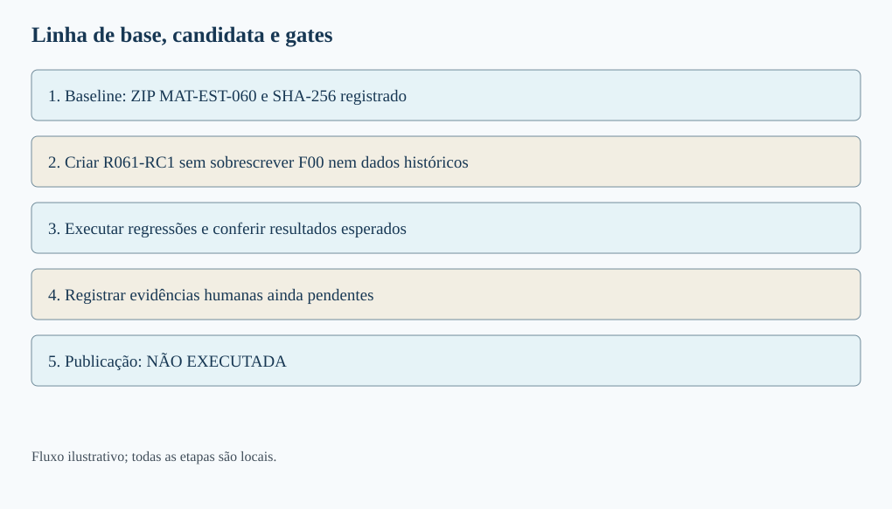
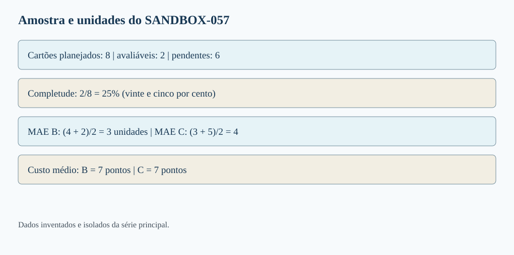
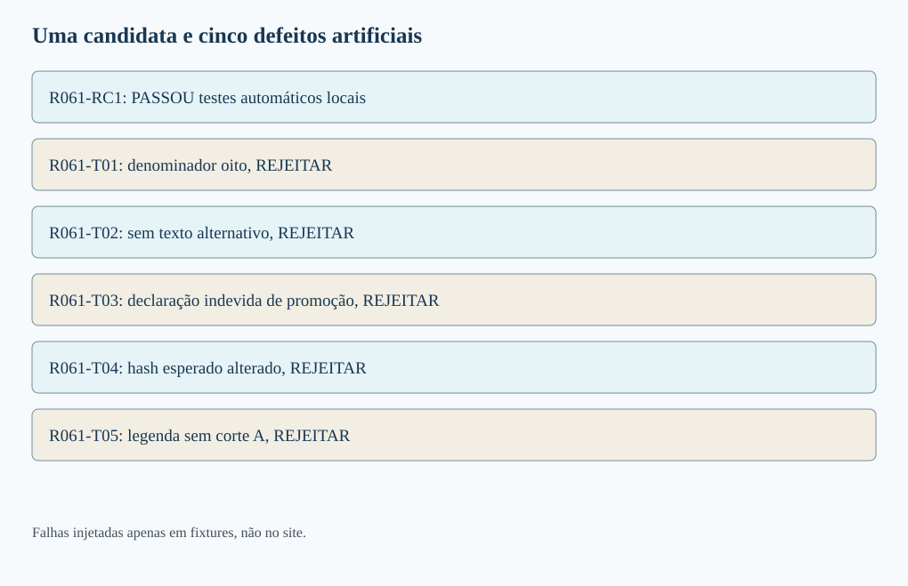
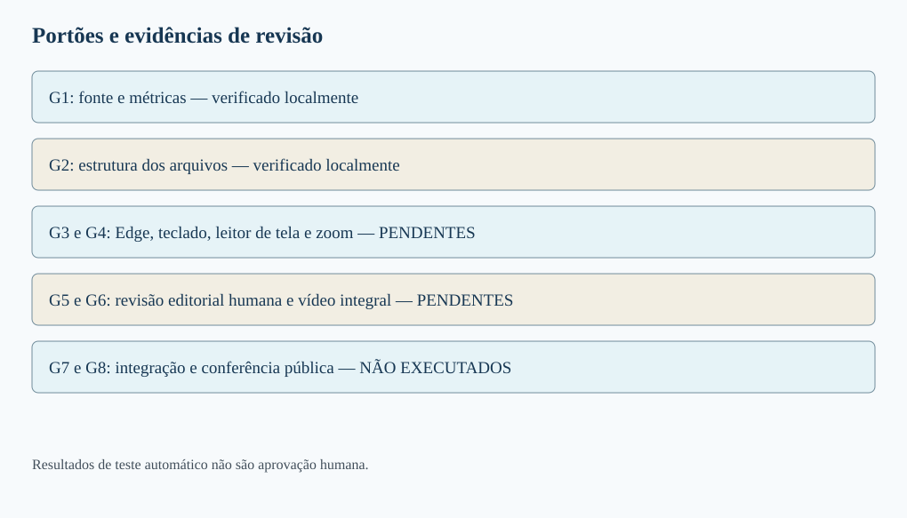
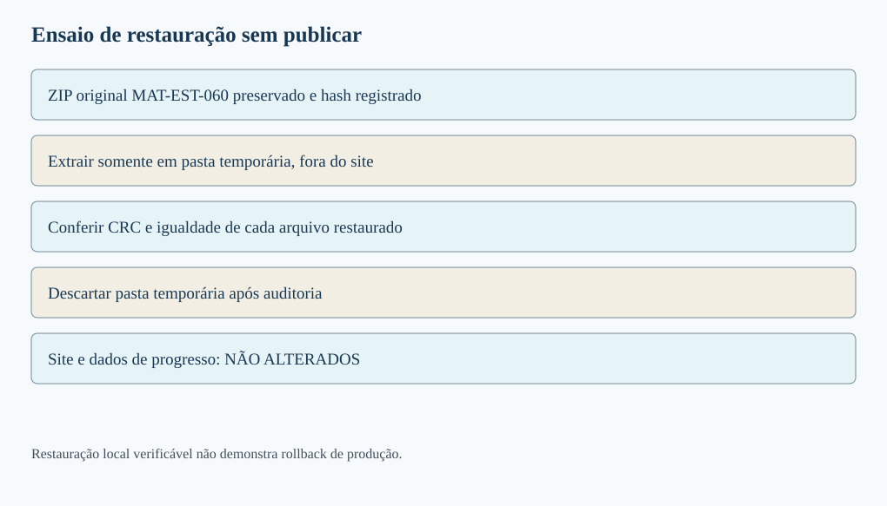
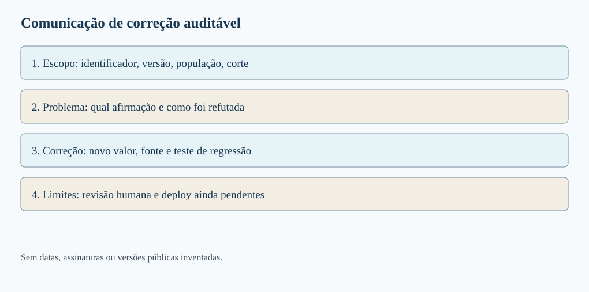

# MAT-EST-061 — Teste de regressão editorial e preparação de publicação: evidências humanas, rollback e comunicação de correções

**Área:** Matemática. **Unidade:** Estatística e séries temporais — ponte universitária. **Nível:** 6. **Anterior:** MAT-EST-060. **Próximo proposto:** MAT-EST-062. **Origem:** aula, diagramas e questões autorais; questões oficiais: zero. **Progresso individual:** não iniciado, sem alteração por produção editorial. **Estado:** material local, não publicado nem sincronizado.

**Três blocos sugeridos, cada um de 25 a 50 minutos:** bloco A, estabelecer linha de base e regressão; bloco B, evidência humana e ensaio de restauração; bloco C, comunicação de correções e prática em níveis. Os blocos não são calendário fixo: se um pré-requisito falhar, refaça a etapa antes de avançar.

## 1. Objetivos e pré-requisitos

Ao estudar e realmente tentar os exercícios, você deverá conseguir: (1) distinguir teste de regressão de uma validação numérica isolada; (2) construir um conjunto mínimo de verificações que reflita os defeitos já conhecidos; (3) verificar um candidato sem apagar sua linha de base; (4) reconhecer o que uma ferramenta automática NÃO pode afirmar sobre leitura, significado e acessibilidade; (5) descrever uma restauração verificável e diferenciá-la de um rollback de produção; (6) redigir uma comunicação de correção com escopo, evidências, pendências e consequência editorial.

**Antes de começar:** média, módulo, porcentagem, números com sinal e unidade; significado de `null` como valor não disponível; versão e hash SHA-256; distinção entre amostra planejada e avaliável; conteúdo das aulas MAT-EST-053 a MAT-EST-060. Caso a expressão \( (4+2)/2 \) pareça opaca, retome a média: quatro mais dois, divididos por dois, é três.

**Relevância para exames:** as ideias de leitura de gráfico, denominador, média, afirmação sustentada e linguagem clara são transferíveis ao ENEM e a vestibulares. Fluxos de integração contínua, testes de regressão e rollback são aprofundamento interdisciplinar; não afirmamos que uma banca exige esses nomes ou procedimentos específicos.

## 2. A pergunta: passar nos testes anteriores basta?

Imagine que o relatório de MAT-EST-060 tenha sido modificado para explicar melhor as seis pendências do exercício SANDBOX-057. A nova legenda ficou mais clara. Entretanto, alguém copiou uma planilha incorreta que divide a soma dos erros por oito, em vez de dois. Uma melhoria textual pode coexistir com uma regressão matemática, isto é, uma falha que reaparece depois de uma alteração. Por isso não verificamos só se a nova legenda está bonita. Reexecutamos os controles anteriores e os testes diretamente ligados à mudança.

Uma **linha de base**, ou baseline, registra exatamente qual artefato foi utilizado na comparação: nome, versão, conteúdo e digest criptográfico. Um **candidato de publicação** é uma composição preparada e testada, não uma publicação aprovada. Um **teste de regressão** pergunta se uma propriedade antes satisfatória continua satisfeita após a alteração, e se defeitos conhecidos continuam sendo detectados. Há também testes novos, criados quando se descobre um risco que antes não estava coberto.

O comando de teste que devolve sucesso não certifica a verdade de uma previsão fictícia, a adequação de uma política ou a acessibilidade vivida por pessoas. Cada verificação tem alcance e limitação. O W3C explica que ferramentas automatizadas assistem a avaliação de acessibilidade, mas não substituem julgamento humano: [panorama da avaliação de acessibilidade](https://www.w3.org/WAI/test-evaluate/).

**Figura 1 — Baseline, alteração isolada e gates.** Texto alternativo: MAT-EST-060 permanece guardada, um candidato de legenda aprimorada é criado em separado, regressões automáticas são executadas e verificações humanas ainda precisam ser realizadas. **Observe:** nenhuma seta leva diretamente de teste local ao site publicado. **Conclusão para ouvir:** melhorar uma legenda não autoriza transformar um pacote não publicado em uma entrega aprovada.

## 3. Os dados realmente disponíveis continuam os mesmos

A série principal de t01 a t22 é inventada e permanece intacta. O protocolo MAT-EST-049-PROT-v1 registra cinco de oito pares t18 a t22; o erro absoluto médio, ou MAE, da referência B é **17,60 unidades**, e o do desafiante C é **8,36 unidades**. O custo médio da regra fictícia é B **51,20 pontos** e C **14,92 pontos**. Em t19, a piora local de C foi **19,2 unidades**, superior à guarda de dez. A média melhor não elimina a violação, e o modelo C não foi promovido pelo protocolo antigo.

Os alvos t23 a t25 seguem sem observações nem emissões autenticadas. O protocolo sucessor MAT-EST-056-PROT-SUC-v1 continua um rascunho local para t26 a t33, com **zero pares avaliáveis; MAE não estimável**. Não se registra zero como se fosse precisão perfeita. Os exemplos V e Z continuam isolados. Nenhuma etapa desta aula acrescenta um alvo à série principal.

O SANDBOX-057, igualmente fictício e isolado, possui oito cartões S01 a S08, mas apenas S01 e S02 avaliáveis no corte A. Em B, os erros são mais quatro e menos dois; em C, mais três e menos cinco. O erro absoluto médio é:

\[MAE_B=\frac{|4|+|-2|}{2}=3,\qquad MAE_C=\frac{|3|+|-5|}{2}=4.\]

Leitura: erro absoluto médio de B é quatro mais dois, dividido por dois, igual a três unidades. Para C, três mais cinco, dividido por dois, igual a quatro unidades. A regra fictícia de custo cobra três pontos por unidade de subprevisão, quando o erro é positivo, e um por unidade superprevista, quando é negativo. Assim, B custa em média \((12+2)/2=7\) pontos e C custa \((9+5)/2=7\) pontos. Não misturar a unidade de erro, em unidades da demanda, com o custo, em pontos da regra.

**Figura 2 — Denominadores e unidades.** Texto alternativo: oito cartões planejados, dois avaliáveis e seis pendentes. No corte A, B tem MAE três unidades, C quatro unidades, e ambos têm custo sete pontos. **Observe:** a barra de completude representa 2 de 8, isto é, 25 por cento; as médias dos erros usam denominador dois. **Conclusão para ouvir:** a mesma tabela pode exigir denominadores diferentes, conforme a pergunta, mas nunca autoriza contar erro inexistente como zero.

## 4. Exemplo resolvido A: mudança isolada e regressão de defeitos conhecidos

Em MAT-EST-060, a receita didática F00 passou nos verificadores automáticos; F01 a F08 são alterações intencionalmente defeituosas e foram rejeitadas. Aqui criamos uma **cópia isolada**, R061-RC1, que apenas explicita na legenda e no texto alternativo que há seis pendências e que o exercício não representa o protocolo sucessor. A receita histórica F00 não é substituída. Em seguida aplicamos cinco mutações negativas novas sobre a cópia, em arquivos próprios:

| Receita | Mudança exclusivamente sintética | Resultado esperado |
|---|---|---|
| R061-RC1 | Legenda e alternativa mais explícitas | Passar nos testes automáticos locais |
| R061-T01 | Denominador indevidamente oito | Ser rejeitada |
| R061-T02 | Apagar texto alternativo | Ser rejeitada |
| R061-T03 | Declarar que C foi promovido | Ser rejeitada |
| R061-T04 | Substituir o digest esperado por zeros | Ser rejeitada |
| R061-T05 | Omitir o corte A na legenda | Ser rejeitada |

A sequência lógica é: congelar a fonte, produzir candidata isolada, rodar cálculos novamente, verificar texto e unidades, registrar a lista de erros de cada cenário e comparar o observado com o esperado. **Uma falha sintética detectada é um teste que passou**, não evidência de defeito real no site. A verificação de digest compara bytes com a referência preservada; não fornece assinatura digital independente nem comprova a data real de emissão.

**Figura 3 — Uma candidata e cinco falhas artificiais.** Texto alternativo: R061-RC1 é a única receita aprovada automaticamente; T01 a T05 são deliberadamente defeituosas e foram detectadas. **Observe:** os nomes das receitas são identificadores de teste e não relatórios publicados. **Conclusão para ouvir:** a bateria deve tanto aceitar a cópia coerente quanto rejeitar defeitos artificiais conhecidos, mantendo as fontes históricas idênticas.

## 5. Evidência rastreável e revisão humana: três estados diferentes

Um registro de evidência deve dizer *o que foi testado*, *sobre qual versão*, *com qual procedimento*, *o resultado*, *quem verificou* e *qual informação ficou faltando*. Para o teste automático podemos anexar um relatório de execução local e o hash da origem. Para o teste humano é preciso realmente executar a ação e registrar o ambiente, a observação e a pessoa responsável. Não preenchemos campo de revisor ou data com nomes e datas inventados.

Nesta entrega, G1 confere cálculo e fonte, G2 confere estrutura automatizada. G3, leitura em voz alta e teclado no Microsoft Edge, permanece **pendente**. G4, leitor de tela e zoom, **pendente**. G5, revisão humana de significado, **pendente**. G6, vídeo completo, **pendente**. G7, integração e deploy, **não executado**. G8, inspeção pública pós-deploy, **não executado**.

A documentação da [Iniciativa de Acessibilidade Web sobre ferramentas de avaliação](https://www.w3.org/WAI/test-evaluate/tools/) alerta que parte das verificações exige intervenção manual. Uma validação de HTML ou SVG não demonstra sozinha a experiência de quem ouve o conteúdo. Nosso teste automatizado só pode afirmar o que de fato observou. Uma política editorial proposta pode exigir todos os gates humanos; esse é um desenho de processo do exercício, não uma permissão já concedida.

**Figura 4 — Evidência com status, não promessa.** Texto alternativo: G1 e G2 aparecem como verificados localmente; G3 a G6 estão pendentes; G7 e G8 não foram executados. **Observe:** cada linha tem um estado textual, mesmo sem cor. **Conclusão para ouvir:** a soma dos testes locais não se transforma automaticamente em aprovação humana ou confirmação de URL pública.

### Modelo de ficha para uma revisão real futura

Campos mínimos: ID do gate; versão exata e hash; URL ou caminho da prévia; equipamento e versão do navegador; passos reproduzidos; evidência observada; problemas encontrados; avaliador que realmente fez o teste; data real; resultado (passou, falhou, pendente ou não se aplica, com justificativa). Para Edge, ouvir ao menos a leitura de uma fórmula por extenso, legenda e tabela; navegar por Tab e Shift+Tab; testar foco visível e zoom. Nenhum desses procedimentos foi manualmente executado por esta geração.

## 6. Exemplo resolvido B: ensaio local de restauração não é rollback público

**Rollback** significa reverter uma mudança aplicada em determinado ambiente para um estado anterior identificado. Antes disso, devem existir cópia recuperável, versão e integridade do artefato, autorização de mudança e plano de verificação pós-restauração. Um arquivo ZIP salvo no histórico permite ensaiar a recuperação; não demonstra que aquele arquivo corresponde à última versão realmente publicada.

Nesta aula, preservamos dentro de `historico/` o ZIP integral de MAT-EST-060 e calculamos seu SHA-256. Extraímos essa cópia em um diretório *temporário de testes*, conferimos CRC e comparamos os bytes recuperados com os contidos no ZIP. O ensaio produz `PASSOU_APENAS_EM_STAGING_LOCAL`. **Não houve alteração de repositório, site, progresso de usuário ou ambiente de produção.** A extração é descartada ao final do teste; os arquivos da aula nova ficam no pacote próprio.

Se existisse um incidente real de publicação, o roteiro proposto seria: detectar e registrar a falha; interromper nova liberação; identificar commit/artefato e origem corretos a partir do histórico real de deploy; guardar evidências e eventual estado de dados separado; obter autorização; aplicar o procedimento apropriado ao fluxo efetivamente usado; conferir URL, hash, navegação, recursos e dados depois; publicar nota de correção. Reverter apenas a interface não equivale a desfazer migração de banco ou estado individual de estudo. Os procedimentos concretos dependem da arquitetura e das permissões: nunca disparar reversão sem verificar qual versão está realmente ativa.

A documentação do GitHub oferece [histórico de deploy e commits associados](https://docs.github.com/en/actions/how-tos/deploy/configure-and-manage-deployments/view-deployment-history) e [ambientes com regras de proteção](https://docs.github.com/en/actions/concepts/workflows-and-actions/deployment-environments). São referências de planejamento, não evidência de execução neste projeto.

**Figura 5 — Restauração em diretório temporário.** Texto alternativo: ZIP MAT-EST-060 preservado, extração isolada, verificação dos bytes e descarte do ambiente temporário; o site público aparece separado, sem seta de alteração. **Observe:** recuperar um arquivo e publicar uma versão são operações distintas. **Conclusão para ouvir:** a restauração local comprovou apenas que o arquivo guardado podia ser extraído e comparado, não que houve rollback na internet.

## 7. Exemplo resolvido C: comunicar uma correção sem esconder a avaliação

Uma nota de correção útil precisa apresentar: **escopo**, isto é, qual aula ou gráfico; **problema**, com o comportamento observável; **versão afetada e correção proposta**; **resultado do novo teste**; **limites e pendências**; e **estado real de publicação**. Evite frases como “tudo corrigido” se apenas a prévia foi ajustada. Também evite apagar a versão anterior quando ela é importante para reconstruir por que a alteração ocorreu.

**Exemplo hipotético, NÃO incidente do site:** “Na candidata local R061-T01, o erro absoluto médio foi calculado com oito em vez de dois cartões elegíveis. O cálculo correto para B é seis dividido por dois, igual a três unidades; para C, oito dividido por dois, igual a quatro unidades. A receita corrigida R061-RC1 passa nas verificações automáticas locais, e o caso defeituoso foi mantido no conjunto de testes para evitar regressão. Continuam pendentes teste real de acessibilidade, revisão editorial humana e publicação. Nenhum dado histórico, protocolo ou progresso individual foi alterado.”

O relatório técnico deve guardar o identificador da afirmação afetada, a fonte com hash, a versão antiga, a versão corrigida e o teste que justificou o novo estado. Em Língua Portuguesa e Redação, essa prática exercita a relação entre tese, evidência e ressalva: uma conclusão precisa corresponder à população realmente analisada. Em Ciência, preserva a possibilidade de reproduzir procedimentos; em História e Geografia, lembra que datas, definições e edições de fontes podem mudar o sentido de uma série.

**Figura 6 — Problema, evidência, correção e limite.** Texto alternativo: quatro partes numeradas mostram escopo e versão; falha verificável; correção testada e evidência; ações e estados pendentes. **Observe:** a palavra “publicado” não aparece como resultado do ensaio. **Conclusão para ouvir:** transparência não é anunciar perfeição, mas permitir que outra pessoa rastreie a mudança e saiba o que ainda falta verificar.

## 8. Erros recorrentes e limites de generalização

Não comparar candidato com um arquivo mutável sem versão; não substituir automaticamente um baseline quando uma candidata parece mais bonita; não usar ausência como zero; não agregar sandbox e histórico; não alterar a guarda t19 depois de conhecer a falha; não confundir teste negativo intencional com defeito constatado; não escrever que houve aprovação humana com campo de revisor vazio; não tratar hash como assinatura de autenticidade; não reverter arquivos sem preservar estados de dados; não chamar a extração temporária de rollback do site; não reportar como publicado o que existe apenas em HTML local; não transformar uma amostra de dois cartões em conclusão geral de desempenho.

A relação entre estatística e engenharia editorial é uma dependência conceitual: primeiro definimos população, medição, unidade e versão; depois executamos os cálculos; só então construímos gráfico e conclusão; antes de publicar, verificamos também o uso humano do material. A ordem evita que um relatório visualmente atraente apresente uma afirmação que nenhuma fonte sustenta.

## 9. Vídeo complementar e referências

**Vídeo:** [Evaluation Tools Overview — W3C Web Accessibility Initiative](https://www.w3.org/WAI/test-evaluate/tools/). **Canal/instituição:** W3C WAI. **Idioma:** áudio em inglês, com transcrição textual e descrição dos recursos visuais na página oficial. **Duração:** não confirmada no player. **Quando assistir:** depois da seção 5. **Motivo:** explica visualmente por que ferramentas automáticas ajudam, mas não substituem intervenção humana. A página com vídeo e transcrição foi localizada; não declaramos reprodução integral. O conteúdo da aula é independente do vídeo.

**Outras referências institucionais:** [W3C sobre avaliação de acessibilidade](https://www.w3.org/WAI/test-evaluate/); [modelo de relatório de avaliação W3C](https://www.w3.org/WAI/test-evaluate/report-template/); [GitHub sobre histórico de deploy](https://docs.github.com/en/actions/how-tos/deploy/configure-and-manage-deployments/view-deployment-history); [GitHub sobre ambientes de implantação](https://docs.github.com/en/actions/concepts/workflows-and-actions/deployment-environments). Fontes externas fundamentam procedimentos gerais e não certificam os dados fictícios locais.

## 10. Exercícios, correção, resumo e revisão

Os arquivos `exercicios.md` e `exercicios.json` guardam dez questões de aprendizagem, dez de consolidação, dez de transferência em estilo vestibular **todas autorais** e seis para reteste posterior. Gabaritos comentados separados, em Markdown e JSON, explicam o raciocínio e um motivo provável do erro. Só consulte após tentar.

**Resumo curto para ouvir:** um teste de regressão protege propriedades que já deveriam funcionar. A referência precisa estar congelada e o candidato deve permanecer separado. O sandbox tem dois avaliáveis entre oito, com MAE três para B e quatro para C. Cinco falhas artificiais testam a capacidade de rejeição, sem alterar o histórico. Verificação automática, experiência humana e publicação são estados diferentes. O ZIP anterior foi restaurado apenas em diretório temporário, sem tocar no site. A falha histórica em t19 permanece, enquanto os períodos futuros continuam sem observados.

**Revisão espaçada:** programar um, sete e trinta dias **após tentativa e estudo reais**, jamais a partir da mera criação da aula. Na primeira revisão, explicar baseline, candidato e regressão; na segunda, recomputar o sandbox e distinguir pendente de zero; na terceira, fazer o reteste sem gabarito e redigir uma nota de correção com evidências e pendências. Considerar consolidação apenas se conseguir detectar contraexemplos, manter os dados corretos e explicar com suas palavras por que um teste automático não equivale a publicação. Nenhuma tentativa foi registrada nesta geração.

**Próximo tópico editorial proposto:** MAT-EST-062 — Manutenção de evidências e prontidão de publicação: checklist auditável, rastreio de pendências e validação pós-deploy. Ainda não iniciado.

**Limites:** pacote local, sem publicação ou sincronização, sem revisão humana real, sem teste real no Edge ou leitor de tela, sem reprodução integral do vídeo; prévia PNG ilustrativa, não captura de site.
