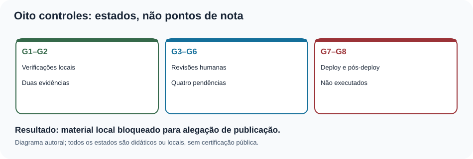
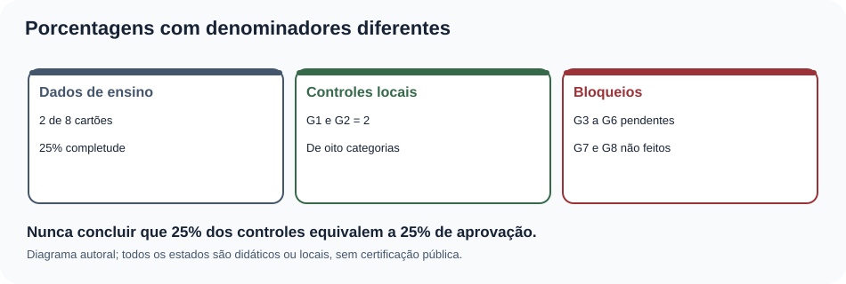
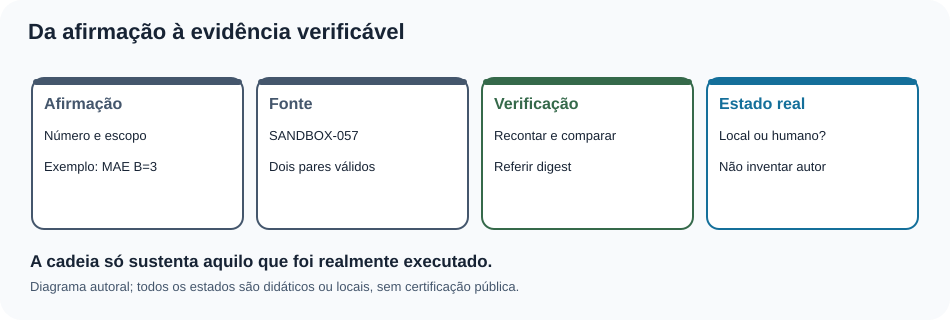
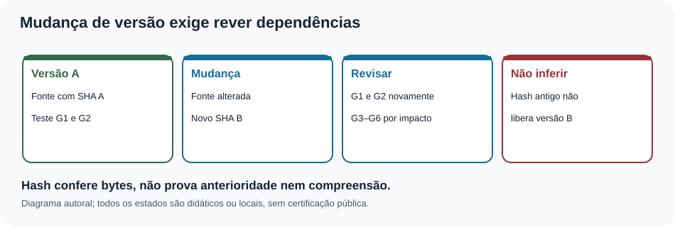
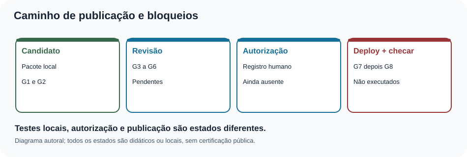
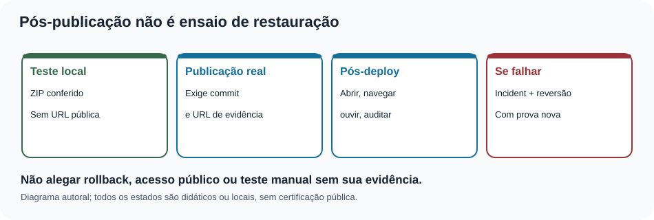

# MAT-EST-062 — Manutenção de evidências e prontidão de publicação: checklist auditável, rastreio de pendências e validação pós-deploy

**Área:** Matemática. **Unidade:** Estatística e séries temporais; ponte universitária com metodologia científica e informática. **Nível:** 6. **Anterior:** MAT-EST-061. **Próximo proposto:** MAT-EST-063. **Origem:** aula, dados demonstrativos e exercícios autorais; nenhuma questão oficial. **Progresso individual:** não iniciado; a preparação do material não comprova estudo nem tentativa. **Estado da entrega:** local, sem sincronização ou publicação.

**Organização em três blocos:** A, inventário e validade das evidências (25 a 50 minutos); B, regras de prontidão e manutenção de pendências (25 a 50 minutos); C, validação pós-deploy, incidentes e prática (25 a 50 minutos). Estude em ciclo contínuo: uma dificuldade no denominador ou no sentido de versão deve ser resolvida antes de avançar.

## 1. Objetivo e pré-requisitos

Após estudo e tentativa real, explique por que uma evidência precisa de versão, escopo, método e resultado; separe controles locais, revisão humana, publicação e pós-publicação; calcule completude usando o denominador adequado; identifique evidência vencida após uma alteração; organize uma fila auditável de pendências; proponha um roteiro de validação com evidências realmente coletáveis; e comunique uma correção sem alegar ações que ainda não ocorreram.

**Pré-requisitos:** porcentagem, média, módulo, classificação de dados ausentes, noções de hash SHA-256, MAT-EST-053 até MAT-EST-061. Em particular, lembrar que os dois erros de B no SANDBOX-057 têm módulos quatro e dois: a média é seis dividido por dois, ou três unidades. Se isso não estiver claro, retomar o cálculo antes de analisar um painel de publicação.

**Relevância para exames:** ler gráficos, identificar denominadores, avaliar inferências e justificar conclusões são competências transferíveis ao ENEM e vestibulares. Hashes, deploy e governança editorial são aprofundamento interdisciplinar e não são atribuídos a uma banca como exigência específica sem edital.

## 2. Por que manter evidências, em vez de apenas colecionar resultados positivos?

Imagine que um programa confirme que trinta e seis questões têm IDs únicos. Em seguida, alguém altera a página para publicar um novo vídeo e uma legenda. O teste antigo confirma a versão antiga, não necessariamente a nova. A manutenção de evidências pergunta: *qual arquivo e qual versão foram examinados? por qual procedimento? quando e por quem? quais pendências permanecem? o que mudou desde então?*

Um **resultado** é um valor ou a saída de uma verificação. Uma **evidência** é um registro contextualizado que permite reexaminar a afirmação. Um **parecer** é uma interpretação que delimita o que a evidência sustenta. Uma **autorização** é um ato de alguém com responsabilidade legítima. Nenhuma dessas quatro coisas substitui automaticamente as outras. Um programa pode calcular um hash correto; não pode inventar uma assinatura humana nem afirmar que alguém ouviu a aula no Edge.

O número de verificações aprovadas depende do número e da importância de cada teste; não é uma probabilidade de qualidade. Três testes triviais não compensam uma falha crítica na referência dos dados ou a ausência de autorização.

**Figura 1.** Texto alternativo: G1 e G2 estão conferidos localmente; G3 a G6 permanecem pendentes; G7 e G8 não foram executados. **Observe:** são categorias distintas, não degraus com peso igual. **Conclusão para ouvir:** o candidato continua local; não há evidência de aprovação humana ou publicação.

## 3. Reconstituição rigorosa do que existe

A série inventada principal contém os períodos t01 a t22. Sob MAT-EST-049-PROT-v1, cinco dos oito pares planejados foram comparados: erro absoluto médio, ou MAE, de B igual a 17,60 unidades e de C igual a 8,36 unidades; custos médios fictícios de B igual a 51,20 e C igual a 14,92 pontos. A piora local de C em t19 é 19,2 unidades, maior que a guarda de dez. Por isso o protocolo histórico **não aprovou a promoção de C**. Não se pode apagar a guarda usando as médias.

Os períodos t23 a t25 não têm observações ou emissões autenticadas. O sucessor MAT-EST-056-PROT-SUC-v1 é proposta editorial local para t26 a t33: zero emissões e zero pares. Consequentemente, seu MAE é *não estimável*, representado por `null`, nunca zero. Os exemplos V e Z são isolados da série principal.

O SANDBOX-057 também é separado: oito cartões S01 a S08, dois avaliáveis, seis pendentes. Para S01 e S02, erros assinados B são mais quatro e menos dois; C são mais três e menos cinco. Com custo de três pontos por unidade subprevista e um por unidade superprevista, temos:

\[\mathrm{MAE}_B=(|4|+|-2|)/2=3,\qquad \mathrm{MAE}_C=(|3|+|-5|)/2=4.\]

Leitura: o erro absoluto médio de B é quatro mais dois, dividido por dois, igual a três unidades; para C é três mais cinco, dividido por dois, igual a quatro unidades. O custo médio B é doze mais dois, dividido por dois, igual a sete pontos. O custo médio C é nove mais cinco, dividido por dois, também sete pontos. A completude do corte A é dois dividido por oito, igual a 25 por cento; as médias de erros dividem por **dois**, não por oito. Pendência não é erro zero.

**Figura 2.** Texto alternativo: dois dos oito cartões são avaliáveis; dois controles técnicos estão registrados como conferidos; controles humanos e externos não foram finalizados. **Observe:** a fração dois oitavos da amostra responde outra pergunta que a contagem G1 e G2. **Conclusão para ouvir:** vinte e cinco por cento de completude didática não é vinte e cinco por cento de autorização editorial.

## 4. Exemplo resolvido: a ficha de evidência de uma afirmação

Considere a frase: “No corte A do SANDBOX-057, o MAE de B é três unidades”. Uma ficha verificável precisa explicitar: (a) identidade do conjunto e o corte A; (b) cartões elegíveis S01 e S02; (c) erros assinados mais quatro e menos dois; (d) método: média dos módulos; (e) saída: três *unidades*, não pontos de custo; (f) caminho do arquivo; (g) digest, ou hash, da versão analisada; (h) resultado da verificação e seu alcance; (i) autoria e revisão humana, se de fato ocorreram.

O digest SHA-256 identifica com grande sensibilidade uma sequência de bytes. Se os bytes mudam, esperamos outro digest. Isso ajuda a detectar divergência com um valor esperado confiável. **Não prova por si só** quando o arquivo foi criado, quem o assinou ou que alguém leu seu conteúdo. A versão anterior precisa continuar acessível para auditar uma mudança posterior.

A cadeia mínima pode ser representada como: afirmação → fonte congelada → procedimento de cálculo → resultado → responsável pelo que efetivamente foi realizado → eventuais pendências. Neste pacote, os papéis humanos são apenas campos de planejamento; nomes, assinaturas e datas reais não foram preenchidos.

**Figura 3.** Texto alternativo: a afirmação depende de origem, corte, cálculo e evidência com estado explícito. **Observe:** uma conclusão que cita apenas um número perdeu parte da cadeia. **Conclusão para ouvir:** quem consulta o relatório precisa saber o que o número significa e como foi obtido.

## 5. Oito controles como dependências, não placar

O registro herdado de MAT-EST-061 conserva:

| Controle | Significado | Estado realmente herdado |
|---|---|---|
| G1 | Integridade e cálculo da fonte | conferido localmente |
| G2 | Estrutura de Markdown, HTML e SVG | conferido localmente |
| G3 | Ouvir no Edge e navegar por teclado | pendente de execução humana |
| G4 | Leitor de tela, zoom e reflow em ambientes reais | pendente de execução humana |
| G5 | Revisão editorial humana do significado e das fontes | pendente de execução humana |
| G6 | Assistir integralmente ao vídeo complementar | pendente de execução humana |
| G7 | Integração autorizada e deploy | não executado |
| G8 | Verificação pública do site após deploy | não executado |

O trecho acima é uma **fotografia documental** do pacote anterior, e não uma atualização dos controles. Uma possível regra de trabalho é exigir G1 a G6 concluídos com evidência antes de solicitar autorização para G7, e realizar G8 somente após um G7 comprovado. Não se pode marcar G8 aprovado quando G7 ainda não ocorreu. Tampouco é adequado calcular “2 de 8, logo 25% pronto”: os oito itens são portas com naturezas e ordem distintas, não avaliações intercambiáveis.

Uma pendência útil registra código permanente, descrição, causa, consequência, responsável por *papel* até atribuição real, evidência necessária, dependência e estado. Não registrar data fictícia para parecer cronologicamente completo. A fila em `controle/MAT-EST-062-pendencias.csv` mantém G3 até G8 sem nome de avaliador, carimbo ou URL inventados.

## 6. Como uma evidência perde validade depois de uma alteração

Imagine que G1 mediu a versão A de um CSV. Um editor substitui esse arquivo pela versão B, mesmo que altere apenas uma célula. A evidência “G1 da versão A passou” permanece verdadeira **para A**, mas não serve automaticamente para B. O mesmo vale para um HTML cujo texto alternativo foi atualizado depois da inspeção no navegador: a avaliação antiga descrevia outro conteúdo.

A decisão de repetir controles depende de uma análise de impacto: uma mudança na fonte exige novo cálculo, hash e revisão de afirmações dependentes; uma mudança de legenda exige revisão da legenda, alternativa textual e leitura em contexto; uma alteração no roteamento ou estilo pode exigir teclado, zoom, links, foco e leitor de tela. Uma mudança sem impacto demonstrável ainda precisa ser documentada; ela não deve apagar a história de verificações anteriores.

**Figura 4.** Texto alternativo: a versão A tem um hash e testes associados; a versão B requer reavaliação das dependências alteradas. **Observe:** o histórico da versão A é preservado, mas não libera a versão B. **Conclusão para ouvir:** uma evidência não se transfere automaticamente entre versões.

## 7. Exemplo resolvido: matriz de dependência e decisão bloqueada

Uma candidata local passa nos cálculos G1 e na estrutura G2. Ainda falta escutar e operar o conteúdo no Edge, testar leitor de tela e reflow, obter revisão editorial e validar o vídeo inteiro. Isso significa G3, G4, G5 e G6 pendentes. Mesmo que G1 e G2 não tenham apontado problemas, **não existe ainda autorização documentada para publicar**. G7 não foi executado e G8 não pode ser verificado.

Um exercício artificial altera o estado de G3 para “concluído”, mas deixa evidência, avaliador e data vazios. O verificador demonstrativo deve rejeitar o registro como prova humana insuficiente. Outra alteração artificial declara G7 como executado sem URL ou identificador de commit. Também deve ser rejeitada. São testes de regras no computador, não relatos de ações realizadas. No arquivo `controle/MAT-EST-062-ensaios-estados.json`, a simulação é explicitamente separada dos oito estados reais herdados.

Há uma diferença entre **prontidão de arquivo** e **prontidão de publicação**. Um pacote pode estar completo para que um integrador o receba, mas ainda não estar liberado para deploy. A folha de encaminhamento deve declarar “pacote local pronto para análise de integração; portas humanas e externas não concluídas”, sem ambiguidade.

**Figura 5.** Texto alternativo: candidato local, revisão humana, autorização e publicação com verificação posterior são etapas diferentes. **Observe:** não há passagem direta de testes automáticos para um site aprovado. **Conclusão para ouvir:** o fluxo só avança quando evidências correspondentes existem.

## 8. Preparar a validação pós-deploy sem fingir que ela ocorreu

O plano `controle/MAT-EST-062-plano-pos-deploy.json` lista dez verificações futuras. Antes de existir URL pública e commit de destino, seu estado é **não executado**. Quando uma integração for autorizada, deverá ser possível: abrir a URL exata; identificar a versão servida; conferir a rota da aula e os links anterior/próximo; verificar que o gabarito continua separado; recalcular indicadores; confirmar a guarda histórica e o estado sem pares do sucessor; inspecionar os seis visuais e suas alternativas; usar teclado e Ler em voz alta no Edge; testar zoom, leitor de tela e contraste; verificar atualização do cache e o procedimento de incidentes.

Cada item requer resultado real e contexto do teste: navegador e versão quando relevante, URL, data da execução, responsável que realmente testou, descrição do resultado, problema encontrado e referência à evidência. Uma captura de tela pode ajudar a mostrar um defeito visual, mas não comprova sozinha leitura em voz alta ou navegação por teclado. A mesma inspeção pode precisar ser repetida após correção ou nova implantação.

A [Iniciativa de Acessibilidade na Web do W3C](https://www.w3.org/WAI/test-evaluate/tools/) lembra que ferramentas automáticas têm alcance limitado e avaliações humanas são indispensáveis. A [documentação da Microsoft sobre o Modo de Leitura do Edge](https://support.microsoft.com/pt-br/edge/use-immersive-reader-in-microsoft-edge) descreve os recursos que o roteiro pretende experimentar; citar a documentação não significa já ter executado o ensaio.

## 9. O que fazer quando o pós-deploy falha?

Suponha, apenas em cenário hipotético, que uma versão pública carregue a aula, mas deixe de carregar o gráfico 4. Não se deve marcar “G8 aprovado” com uma observação em rodapé. Registrar a versão afetada, a URL, a condição reproduzível, a severidade, os responsáveis de fato envolvidos, uma medida temporária se cabível e o estado da investigação. Em seguida decidir, conforme autorização e impacto, entre corrigir e implantar nova versão ou restaurar uma versão previamente conhecida. A decisão e sua execução exigem evidência.

**Rollback**, ou retorno a uma versão anterior, não se confunde com o ensaio local de extração do arquivo ZIP. Para afirmar que um rollback público ocorreu, precisamos de identificador da versão anterior e da versão restaurada, execução autorizada, confirmação da URL e novos testes de funcionamento. É possível que conteúdo em cache continue servindo uma versão antiga por algum tempo; a verificação deve considerar esse risco e identificar a versão efetivamente exibida.

**Figura 6.** Texto alternativo: extrair um arquivo local não confirma deploy; publicação requer commit, URL e verificação pública, enquanto restauração exige nova evidência. **Observe:** o fluxo tem uma etapa de validação depois de publicar ou restaurar. **Conclusão para ouvir:** cada afirmação de funcionamento deve corresponder a um teste efetivamente feito.

## 10. Síntese interdisciplinar e limites

**Matemática:** denominadores, porcentagens, médias, unidades, noções de lógica e condição necessária versus suficiente. **Português e Redação:** enunciados com escopo e ressalvas claras. **Metodologia científica:** preservar protocolos, registrar desvios e permitir reprodução. **Computação:** versionamento, hashes, testes, publicação e tratamento de falhas. Um relatório honesto precisa combinar esses campos: número sem proveniência é frágil; evidência sem comunicação pode ser inutilizável; interface publicada sem teste de acesso pode excluir leitores.

**Erros frequentes:** escrever MAE zero quando não há pares; chamar 2 de 8 controles de 25% de “certificação”; trocar uma previsão depois de observar o alvo; confundir teste sintético com falha do site; declarar G3 concluído porque um SVG possui `title`; considerar reprodução parcial do vídeo suficiente; inventar revisor ou data; marcar pós-deploy como concluído antes de G7; usar hash como assinatura humana; chamar extração local de rollback real.

## 11. Vídeo complementar e fontes verificadas

**Vídeo:** [Evaluation Tools Overview — World Wide Web Consortium, Web Accessibility Initiative](https://www.w3.org/WAI/test-evaluate/tools/). Idioma inglês, com transcrição descritiva disponível na página institucional. **Duração:** não confirmada. **Por que assistir:** enfatiza que verificações automáticas ajudam a identificar problemas, mas dependem de julgamento e testes humanos. **Momento recomendado:** após a seção 8. A página e a presença do vídeo/transcrição foram verificadas; a reprodução integral do conteúdo audiovisual não foi efetuada. A aula é independente do vídeo.

**Outras fontes de apoio:** [W3C: modelo de relatório de acessibilidade](https://www.w3.org/WAI/test-evaluate/report-template/); [W3C: seleção de ferramentas de avaliação](https://www.w3.org/WAI/test-evaluate/tools/selecting/); [Microsoft: modo de leitura e Ler em voz alta no Edge](https://support.microsoft.com/pt-br/edge/use-immersive-reader-in-microsoft-edge). A estrutura pedagógica e a cadeia de dados fictícios seguem os documentos canônicos do projeto e a MAT-EST-061; não se atribuem aos órgãos externos os números inventados desta simulação.

## 12. Atividades autorais graduais

O caderno `exercicios.md` contém dez exercícios de aprendizagem, dez de consolidação, dez problemas autorais em estilo vestibular e seis de reteste. Todos têm IDs únicos. As correções completas ficam em `gabarito-comentado.md` e em JSON separado, para apresentação somente **após tentativa**. Não há questões oficiais nesta aula.

## 13. Resumo curto para ouvir

A evidência é um registro situado: versão, fonte, método, resultado e alcance. Dois controles automáticos foram conferidos localmente, mas quatro dependem de revisão humana e dois exigem atividades externas. A completude de uma amostra não mede prontidão de publicação. Se um arquivo muda, as evidências dependentes precisam ser revistas. A etapa pós-deploy só começa depois de uma publicação comprovada; o sucesso de um ZIP local não prova URL pública. Os números históricos permanecem iguais, inclusive a guarda violada em t19. Nenhum dado futuro foi observado nesta aula.

**Revisão espaçada:** programar retornos após um, sete e trinta dias **contados a partir de estudo e tentativa efetivos**. No primeiro, explicar diferença entre dado, evidência, parecer e autorização. No segundo, preencher uma ficha demonstrativa identificando origem e corte. No terceiro, resolver o reteste sem consultar o gabarito e redigir uma decisão honesta sobre G1 até G8. A consolidação depende de evidência real de compreensão, não de leitura do arquivo.

**Próximo tópico editorial proposto:** MAT-EST-063 — Gestão de incidentes editoriais: classificação de falhas, comunicação de impacto e reteste de correções. Ainda não iniciado.

**Limites de execução:** foram gerados arquivos locais e testes de integridade; não houve publicação, sincronização com Drive/GitHub, aprovação humana, teste manual no Edge/leitor de tela, reprodução integral do vídeo, deploy, rollback público, nova observação prospectiva ou alteração do progresso individual.
