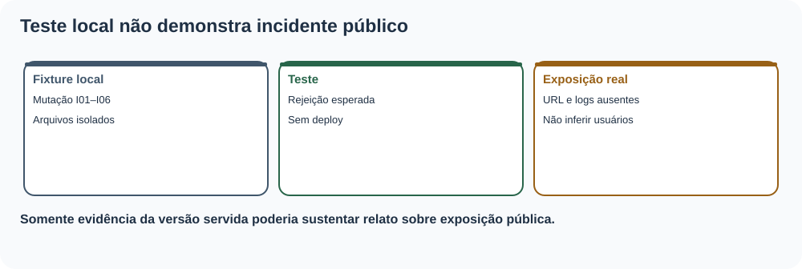
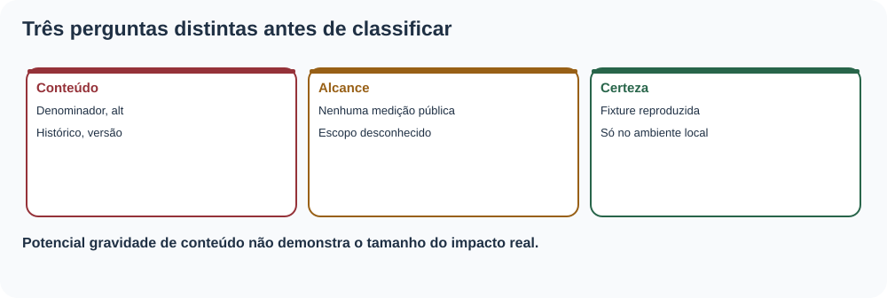
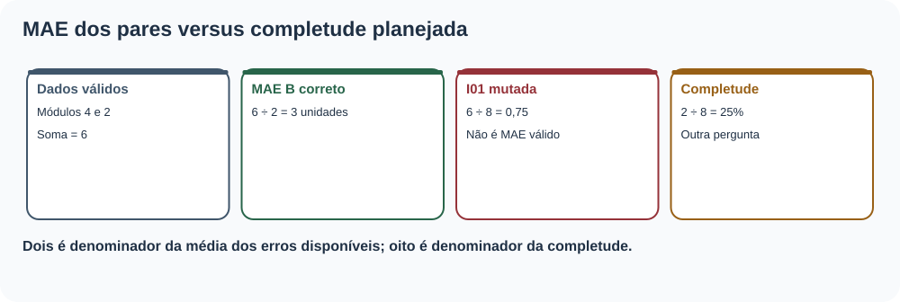
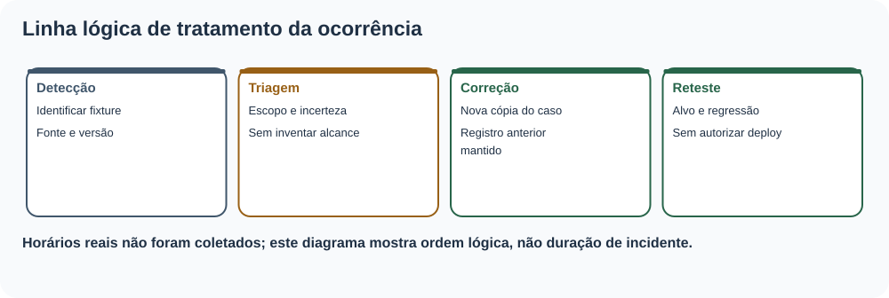
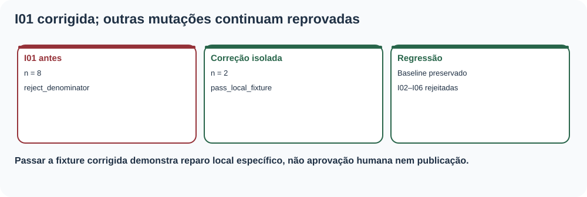
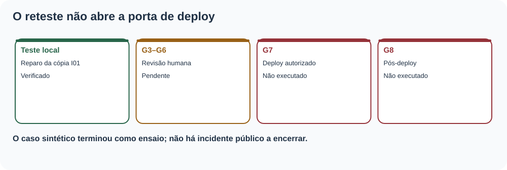

# MAT-EST-063 — Gestão de incidentes editoriais: classificação de falhas, comunicação de impacto e reteste de correções

**Matéria:** Matemática. **Unidade:** Estatística e séries temporais — ponte universitária, qualidade de comunicação quantitativa. **Nível:** 6. **Anterior:** MAT-EST-062. **Próximo tópico proposto:** MAT-EST-064. **Origem:** aula, dados adicionais e exercícios autorais. **Questões oficiais:** nenhuma. **Progresso individual:** não iniciado; elaboração editorial não comprova estudo.

**Organização sugerida:** bloco A, classificação e impacto (25–50 minutos); bloco B, contenção, correção e reteste (25–50 minutos); bloco C, comunicação, exercícios e revisão (25–50 minutos). Não se determina a evolução apenas pelo tempo de leitura.

## 1. O que será aprendido e o que precisa saber antes

Ao estudar e tentar os exercícios, você deverá explicar (1) a diferença entre falha de uma cópia de teste, defeito confirmado em um pacote real e incidente com exposição pública; (2) como classificar gravidade sem inventar alcance; (3) como calcular corretamente denominador e impacto quantitativo; (4) como montar um registro cronológico rastreável; (5) como separar contenção, correção, reteste, autorização, deploy e verificação pública; (6) como comunicar uma retificação sem ocultar versões; (7) quando uma evidência anterior perde validade; (8) como usar pós-incidente para aprendizado sem transformar um ensaio em ocorrência real.

Pré-requisitos conceituais: subtração, módulo, média e porcentagem; MAT-EST-049, 053, 054, 057–062; noções de proveniência e identificador criptográfico SHA-256. Se o denominador ainda gerar dúvida, refaça primeiro o exemplo de média dos dois pares desta aula. **Relevância para exames:** leitura de gráficos, frações, proporcionalidade e avaliação crítica de fontes são transferíveis ao ENEM e vestibulares. Gestão operacional de incidentes é uma extensão de ponte universitária e não é anunciada como tópico obrigatório de qualquer banca.

## 2. Contexto: detectar não é publicar e reprovar fixture não é incidente real

A candidata didática `R061-RC1` descreve corretamente o exercício isolado SANDBOX-057. MAT-EST-060 testou alterações artificiais que deveriam ser rejeitadas. MAT-EST-061 demonstrou o reteste de uma candidata em pasta local. MAT-EST-062 congelou a matriz de controles. Agora vamos aprender a registrar e comunicar uma **ocorrência hipotética** com precisão.

O pacote herdado tem: G1 e G2 em `checked_local`; G3, G4, G5 e G6 em `pending`; G7 e G8 em `not_performed`. Isso significa que **não há publicação comprovada nem revisão humana concluída**, e uma falha sintética não permite concluir que usuários tenham visto conteúdo incorreto. Foi criada uma série de sete *fixtures* de teste: I00 é uma cópia válida; I01 a I06 são seis mutações artificiais independentes. Não são seis incidentes na plataforma.

Para cada relato, faça três perguntas: *o que foi observado e em qual artefato?*; *qual efeito seria possível caso estivesse exposto?*; *qual evidência falta para afirmar exposição e alcance real?* A terceira pergunta impede que uma gravidade potencial seja confundida com dano comprovado.

**Figura 1.** Texto alternativo: a seta vai de alteração deliberada em cópia de teste a rejeição automática; somente verificação em versão real e exposição comprovada autorizariam abrir relato de incidente operacional. **Observe:** O ramo sintético termina sem público afetado identificado. **Conclusão por áudio:** defeito de exercício é evidência de teste, não prova de incidente do site.

## 3. Classificação: impacto, exposição, certeza e prioridade

**Defeito** é um comportamento divergente de um requisito verificável. **Incidente operacional** é um acontecimento que impacta um serviço ou seu uso, documentado com contexto e alcance. **Evento de teste** é alteração deliberada em um ambiente isolado. **Desvio editorial** é diferença da versão congelada ou de seu protocolo, que pode exigir investigação mesmo sem deploy. **Quase-incidente**, quando o termo for empregado, precisa ser claramente definido, porque uma falha barrada antes de publicação não comprova usuários afetados.

Esta aula oferece uma **rubrica autoral ilustrativa**, não um padrão oficial universal: gravidade alta quando a versão hipoteticamente exibida comprometer interpretação histórica, exclusão de acesso essencial ou rastreabilidade central; moderada quando unidades ou legendas puderem alterar o entendimento sem contaminar toda a conclusão; baixa quando a apresentação for superficial e a informação continuar intacta e acessível. A classificação deve ser reavaliada quando surgirem evidências de alcance, alternativas de acesso e tempo de exposição. Não há pontuação automática de severidade a partir do simples número de erros detectados.

| Mutação sintética | Potencial efeito se exposta | Exposição efetivamente demonstrada |
|---|---|---|
| I01: denominador de 2 substituído por 8 | MAE divulgado como 0,75 em vez de 3 | Nenhuma: cópia de teste |
| I02: alternativa textual retirada | Obstáculo ao acesso à informação visual | Nenhuma: cópia de teste |
| I03: conclusão histórica reescrita | Alegar falsamente promoção de C | Nenhuma: cópia de teste |
| I04: hash de fonte trocado | Perda de rastreabilidade | Nenhuma: cópia de teste |
| I05: custo chamado de unidades | Confundir custo com erro absoluto | Nenhuma: cópia de teste |
| I06: legenda sem corte A | Ocultar seis pendências e enfraquecer leitura | Nenhuma: cópia de teste |

**Síntese para ouvir:** a gravidade potencial ajuda a ordenar a resposta; a coluna de exposição real permanece não verificada. Ausência de evidência não é evidência de zero usuários afetados. Não escrever “nenhum usuário afetado” sem logs ou outra verificação pertinente.

**Figura 2.** Texto alternativo: três perguntas independentes: qual conteúdo falhou, quão amplo foi o alcance comprovado e qual é a certeza da conclusão. **Observe:** gravidade potencial não preenche automaticamente a coluna de alcance. **Conclusão por áudio:** uma hipótese de dano exige contenção proporcional, sem ser relatada como dano medido.

## 4. Exemplo matemático resolvido: o erro de denominador I01

Na fotografia didática SANDBOX-057 existem oito cartões planejados: S01 e S02 são avaliáveis no corte A; seis são pendentes. Os erros assinados da referência B são mais quatro e menos dois. Seus módulos são quatro e dois. Assim, o erro absoluto médio é:

\[MAE_B=\frac{|+4|+|-2|}{2}=\frac{6}{2}=3\;\text{unidades}.\]

Leitura por extenso: MAE de B é a soma dos módulos, quatro mais dois, dividida pelo número de pares avaliáveis, que é dois. O resultado é três unidades. Se uma mutação usar o número planejado de oito como denominador, ela obtém **seis dividido por oito, igual a zero vírgula setenta e cinco**. Esse valor não é o MAE dos pares disponíveis; ele aplica zeros indevidos aos seis cartões sem erro calculável. O resultado correto para C é `(3+5)/2=4` unidades.

A completude tem outro denominador e responde a outra pergunta:

\[completude=\frac{2}{8}=0,25=25\%.\]

Leitura: dois dos oito cartões planejados estão avaliáveis, o que corresponde a vinte e cinco por cento de completude. Há seis de oito pendentes, ou setenta e cinco por cento. Não dividir a soma dos erros pelos oito planejados. A diferença entre **3 e 0,75** no exemplo de B é 2,25 unidades; a cifra incorreta é um quarto da correta. Na hipótese de um boletim com tal erro, a correção precisa explicar *qual denominador mudou*, *quais números permanecem válidos* e *quais leitores poderiam ter sido atingidos*, em vez de simplesmente substituir um algarismo.

O custo médio didático permanece **sete pontos para B e sete pontos para C**. A unidade “pontos de custo” não deve ser trocada por “unidades da série”. A série principal t01–t22 e os cenários t23–t33 não participam desse recálculo.

**Figura 3.** Texto alternativo: no lado correto, seis unidades de erro absoluto divididas por dois pares resultam em três; no lado mutado, dividir por oito gera 0,75; completude é dois sobre oito. **Observe:** duas frações diferentes respondem a perguntas distintas. **Conclusão por áudio:** a amostra prevista informa completude, mas não substitui o total de erros observados no denominador do MAE.

## 5. Registro de incidente: esquema mínimo que preserva versões

Uma ficha auditável tem identificador, escopo, fonte e versão, descrição de achado observável, mecanismo de detecção, hipótese de alcance, evidências confirmadas, informações desconhecidas, classificação provisória, proposta de contenção, correção, testes de regressão, estado de autorização, possível comunicado e critério de encerramento. Quando existir operação real, registrar instantes de ocorrência, detecção, reconhecimento, contenção e resolução com fuso e prova correspondente. **Não inventar datas retroativas** para um ensaio lógico como este.

O arquivo `incidentes/MAT-EST-063-caderno-sintetico.json` contém seis fichas claramente marcadas como simuladas, com `responsavel_real`, `url_real` e `data_real` nulos. Uma pessoa responsável seria designada apenas em execução real. O registro original não é apagado depois da correção: acrescentar evento de retificação, versão nova e vínculo com a versão anterior. Nem hash nem assinatura de aprovação são intercambiáveis: hash demonstra identidade de bytes comparados; não garante que um humano leu, que o arquivo existia na data alegada ou que o site foi publicado.

**Tempo até detecção** requer hora de ocorrência e de detecção comprovadas. A expressão é `instante de detecção menos instante de ocorrência`. **Tempo até recuperação** necessita uma definição operacional de recuperação e registros dos dois instantes. Em nossas fichas didáticas não existem esses horários; logo os tempos permanecem **não estimáveis**, não zero minuto.

**Figura 4.** Texto alternativo: detecção, classificação, contenção, correção, reteste e encerramento são eventos separados, cada qual ligado a uma versão. **Observe:** corrigir gera nova versão, sem excluir a ficha anterior. **Conclusão por áudio:** registrar a ordem protege a reprodutibilidade e a comunicação posterior.

## 6. Conter, corrigir e retestar são ações distintas

**Contenção** limita a chance de propagação enquanto se investiga. Num teste local, basta manter a fixture mutada fora da candidata. Em operação pública comprovada, a ação deve depender do impacto verificado e das permissões: por exemplo, interromper a distribuição de um gráfico enganoso, mostrar uma ressalva visível ou, quando autorizado, restaurar uma versão conhecida. Não realizar rollback público só porque um ZIP foi extraído em pasta temporária.

**Correção** elimina a causa definida. No exemplo I01, altera-se somente o denominador da cópia de oito para dois; não se fabricam erros para S03–S08, não se muda C e não se reescreve o corte A. **Reteste alvo** verifica novamente o cálculo: `(4+2)/2=3`. **Regressão** verifica se outras propriedades permanecem corretas: `MAE_C=4`, custo B=C=7, corte A de dois sobre oito, texto alternativo, hashes, conclusão histórica e estados G1–G8. A demonstração gerou `MAT-EST-063-reteste-demonstrativo.json`: a cópia I01 falha antes e passa após reparo, enquanto as demais mutações continuam falhando como esperado. Nenhuma alteração foi aplicada ao baseline herdado.

**Revalidação da prova:** um teste G1 feito para a versão A não autoriza afirmar que a versão B foi validada, se os bytes fonte mudaram. É necessário rastrear dependências e repetir os testes atingidos. **Aprovação humana** só poderá ser anotada com pessoa, resultado e evidência reais. **Deploy** exige identificador real, caminho e versão efetivamente disponibilizada. **Pós-deploy** requer olhar a versão servida ao usuário, não somente o ZIP de origem.

**Figura 5.** Texto alternativo: I01 falha com denominador oito; sua cópia corrigida usa dois e passa, enquanto I02–I06 continuam reprovados. **Observe:** a correção isolada não deve fazer outras mutações sumirem nem alterar o baseline. **Conclusão por áudio:** um reteste confirma a correção específica; regressão evita perdas colaterais.

## 7. Comunicação de impacto: separar fato, hipótese, ação e pendência

Uma mensagem responsável pode seguir quatro blocos. **Fato verificado:** “Em uma cópia local deliberadamente mutada, o teste detectou denominador oito no lugar de dois.” **Possível consequência:** “Se essa variante fosse disponibilizada, o MAE B seria apresentado como 0,75, embora seu valor no corte A seja 3 unidades.” **Ação no ensaio:** “A cópia foi corrigida e retestada; os arquivos históricos ficaram idênticos.” **Limite:** “Não houve comprovação de versão pública afetada; não existem URL, horários de exposição nem contagem de pessoas impactadas.”

Em um incidente real, esses campos precisam ser preenchidos com observações obtidas, identificação da versão, alcance verificável, canal da retificação e instruções proporcionais. Um comunicado de correção não deve esconder a cifra anterior nem afirmar “problema solucionado para todos” antes da checagem pós-publicação. O relatório de avaliação de acessibilidade do W3C recomenda declarar escopo, método, resultados e ações sugeridas. O capítulo de resposta a incidentes do Google SRE enfatiza coordenação, registros e comunicação, enquanto a análise pós-incidente documenta fatos e ações sem imputar culpa. Essas referências são boas práticas de apoio; **as categorias e números I01–I06 são autorais deste projeto**.

## 8. Encerramento e revisão posterior sem confundir estados

Para fechar uma ocorrência real, perguntar: a causa foi corrigida em versão identificada? O teste específico passou? A regressão relevante passou? Houve revisão humana quando exigida? A publicação, se autorizada, foi comprovada? A versão efetivamente servida foi inspecionada? A retificação chegou ao público que podia ter recebido a informação anterior? As pendências residuais foram designadas, com critérios de verificação? Se as perguntas não têm evidência, o estado deve permanecer parcial, pendente ou não executado.

No caso desta aula, a resposta é explícita: apenas um **reteste sintético local** foi concluído. G1–G8 preservam os estados anteriores. P01–P10, roteiro de pós-deploy herdado, seguem não executados. A falha histórica do modelo C em t19 foi 19,2 unidades, acima da guarda de dez; o modelo não é promovido no protocolo original. O protocolo sucessor continua proposta sem observações t26–t33. Os alvos t23–t25 continuam sem observações ou emissões autenticadas. Não existem indicadores novos de desempenho principal.

**Figura 6.** Texto alternativo: há um reteste didático bem-sucedido, porém revisão humana, deploy e pós-deploy continuam abertos. **Observe:** conclusão de teste não salta diretamente para status de publicação. **Conclusão por áudio:** fechar uma fixture é diferente de resolver um incidente que atingiu leitores reais.

## 9. Aplicações, erros comuns e interdisciplinaridade

Em Matemática e Estatística, o tema exige distinguir numerador, denominador, conjuntos avaliáveis e medidas não estimáveis. Em Redação e Língua Portuguesa, exercita comunicações objetivas com ressalvas e correção explícita. Em computação, relaciona controle de versão, teste de regressão, proveniência e restauração. Em cidadania digital, ensina a ler erratas e avaliar se uma alegação de correção apresenta evidência verificável.

**Erros comuns:** chamar uma fixture de incidente público; tratar “alcance desconhecido” como “ninguém afetado”; divulgar MAE com denominador de pares planejados; transformar pendência em erro de zero; medir tempo até detecção sem datas; reclassificar a gravidade sem novos dados; corrigir o gráfico e esquecer legenda ou alternativa textual; alterar resultado histórico após a falha; chamar G1/G2 de autorização; reportar extração de ZIP como rollback público; esconder a versão anterior; afirmar revisor humano inexistente; encerrar caso sem a confirmação de versão servida.

## 10. Vídeo complementar e fontes

**Vídeo complementar:** [Easy Checks – A First Review of Web Accessibility — W3C Web Accessibility Initiative](https://www.w3.org/WAI/test-evaluate/preliminary/). **Idioma:** inglês; a página oferece vídeo e transcrição descritiva. **Duração:** não confirmada. **Momento recomendado:** após a seção 6, para observar como um teste inicial pode detectar barreiras, mas não substitui avaliação mais completa. O vídeo está referido em página institucional consultada; reprodução audiovisual integral não realizada. A aula é autossuficiente.

Fontes externas de apoio: [Google SRE, Incident Response](https://sre.google/workbook/incident-response/); [Google SRE, Postmortem Culture](https://sre.google/workbook/postmortem-culture/); [W3C WAI, modelo de relatório de avaliação](https://www.w3.org/WAI/test-evaluate/report-template/); [W3C WAI, avaliação de acessibilidade](https://www.w3.org/WAI/test-evaluate/). Material estruturante do projeto: visão, metodologia, matriz curricular, acessibilidade, padrão visual, arquitetura e regras de fontes (documentos 01–07). Os dados e a rubrica de prioridade são exercícios autorais, não políticas dessas instituições.

## 11. Atividades e forma de correção

Existem 36 atividades independentes em `exercicios.md`, divididas em aprendizagem (10), consolidação (10), aplicação autoral em estilo vestibular (10) e reteste posterior (6). Os gabaritos estão em arquivos separados para não antecipar a resolução ao estudante. Cada resposta tem justificativa e uma hipótese de erro a registrar: conceito, interpretação, cálculo, estratégia, memória, distração ou tempo. Nenhuma questão é apresentada como oficial.

## 12. Resumo para ouvir e revisão espaçada

Um incidente editorial precisa de versão, escopo, evidência e limite do que se sabe. A mutação de teste I01 trocou o denominador dos dois pares pelo total de oito cartões: o MAE B incorreto cairia de três para 0,75. A correção isolada devolve o denominador dois; o reteste não equivale a aprovação, deploy ou ausência comprovada de usuários afetados. As demais mutações demonstram riscos de alternativa textual, alteração histórica, fonte, unidade e legenda. O histórico permanece imutável e a série futura permanece não observada.

**Revisão espaçada:** depois de uma tentativa real, retornar em um, sete e trinta dias. No primeiro retorno, explicar com as próprias palavras a diferença entre defeito de fixture e incidente exposto. No sétimo, refazer o cálculo do MAE e um comunicado condicionado a evidências. No trigésimo, resolver o reteste sem gabarito, escrever um registro auditável e apontar quais controles G1–G8 ainda não possuem prova. O estado pessoal “consolidado” exige desempenho demonstrado, não leitura ou geração de arquivos.

**Próximo tópico editorial proposto:** MAT-EST-064 — Análise pós-incidente e prevenção editorial: causas sistêmicas, ações verificáveis e revisão de controles. Ainda não iniciado.

**Limites de execução:** pacote produzido e verificado apenas localmente; sem incidente real, aprovação humana, sincronização com Google Drive/GitHub, publicação, rollback externo, inspeção real de leitores, teste manual Edge ou reprodução integral do vídeo; progresso individual inalterado.
