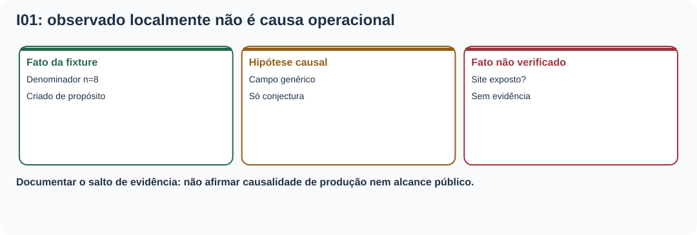
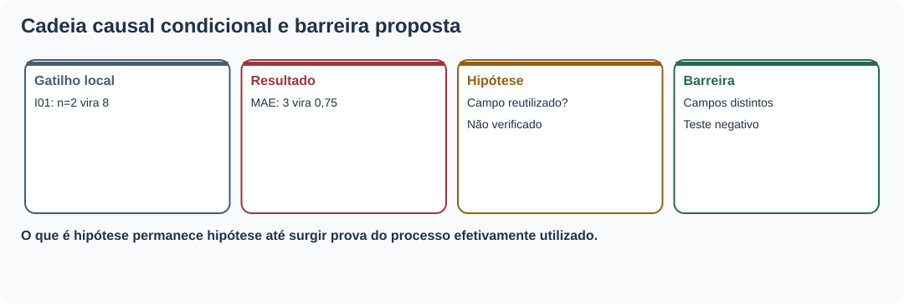
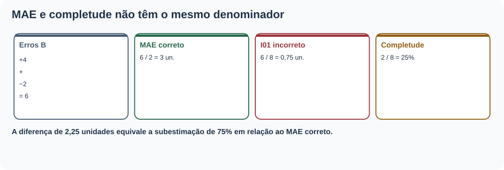
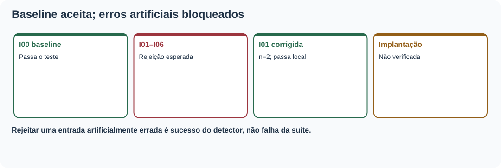
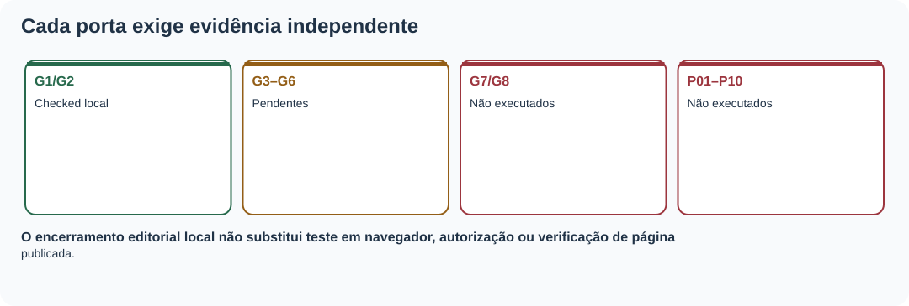

# MAT-EST-064 — Análise pós-incidente e prevenção editorial: causas sistêmicas, ações verificáveis e revisão de controles

**Área:** Matemática. **Unidade:** Estatística — ponte universitária, auditoria e comunicação quantitativa. **Nível:** 6. **Anterior:** MAT-EST-063. **Próximo proposto:** MAT-EST-065. **Origem:** material e exercícios autorais; **questões oficiais: zero**. **Progresso individual:** não iniciado, sem evidência de estudo ou tentativa.

**Organização:** bloco A, fato, mecanismo e hipóteses causais (25 a 50 minutos); bloco B, ações verificáveis e matemática do risco de relatório (25 a 50 minutos); bloco C, revisão de controles, atividades, comunicação e síntese (25 a 50 minutos). Não presuma domínio por leitura.

## 1. Objetivos, pré-requisitos e limites do caso

Você deverá conseguir: distinguir o defeito artificial de um incidente realmente exposto; construir uma sequência causal em que evento, condição que permitiu a falha e barreira ausente são coisas distintas; formular hipótese causal sem afirmá-la como fato; converter recomendação vaga em ação verificável; recalcular médias com denominador correto; reconhecer detecção, prevenção e mitigação; distinguir teste do controle em fixture de implantação no site; preservar evidências antigas e atualizar uma política somente mediante novo registro; comunicar uma conclusão proporcional ao que foi observado.

**Pré-requisitos:** fração, média, porcentagem, módulos, MAT-EST-047, MAT-EST-049 e MAT-EST-053–063. Se a diferença entre `6 ÷ 2` e `6 ÷ 8` ainda causar dificuldade, refaça primeiro o exercício da seção 4.

**Relação com vestibulares:** proporcionalidade, leitura crítica de tabelas, medidas estatísticas, interpretação de texto e argumentação. A investigação de processos e controles editoriais é ponte universitária, não requisito específico atribuído ao ENEM ou a uma banca sem confirmação institucional.

**Escopo do ensaio:** a MAT-EST-063 produziu as cópias artificiais I01–I06 e a referência I00. **Nenhum desses casos demonstra um incidente público**, nem há evidência de pessoas afetadas, URL publicada, horário real, responsável designado ou aprovação. MAT-EST-064 não transforma hipóteses de falha sistêmica em diagnóstico operacional. Vamos praticar o método com os arquivos locais herdados.

## 2. Por que estudar o que acontece depois da correção?

Imagine um relatório que trocou o número de pares válidos pelo número de cartões previstos. Corrigir um número numa cópia pode devolver o resultado correto hoje. Mas, se a lógica de produção permite repetir a troca, o próximo relatório pode voltar a ficar incorreto. A investigação pós-incidente pergunta não somente **qual erro apareceu**, mas **que condições o teriam permitido** e **como detectar ou bloquear reincidência**. Em nosso ensaio não temos código de implantação real: as condições propostas serão explicitamente hipóteses e as medidas são um plano autoral de prevenção.

Uma boa análise documenta fatos, lacunas, mecanismos plausíveis, testes que discriminariam hipóteses, ações com evidência verificável e limitações. A literatura de Engenharia de Confiabilidade de Sites, ou SRE, apresenta análises pós-incidente sem atribuição de culpa e ações rastreáveis com prioridade, responsável e critério de término. Não se trata de usar a palavra “causa raiz” como certeza quando só existe uma mutação fabricada.

**Figura 1.** Texto alternativo: I01 foi mutada deliberadamente com n igual a oito; hipótese de falha sistêmica requer evidência adicional; usuários atingidos não foram verificados. **Observe:** são três categorias de afirmação. **Conclusão para áudio:** um experimento local descreve o mecanismo que queremos evitar, não demonstra defeito nem dano em produção.

## 3. Gatilho, mecanismo, condições contribuintes e barreiras

No exemplo I01, o **gatilho artificial** é trocar o campo `denominator` de dois para oito em uma cópia isolada. O **mecanismo matemático** é misturar duas populações: dois pares com erros conhecidos e oito cartões planejados. Uma **hipótese de condição contribuinte** seria um gerador que usa um único campo de contagem em todos os indicadores. **Não verificamos esse gerador em operação**. Uma **barreira proposta** é obrigar campos diferentes, `count_evaluable` e `count_planned`, com um teste negativo que bloqueia a troca. Uma segunda barreira é tornar explícita a legenda do corte A.

Perguntar “por que?” sucessivamente pode auxiliar, mas não cria prova. O primeiro porquê aponta para a divisão pelo denominador inadequado; o segundo levanta a possibilidade de reutilização de campo; o terceiro questiona se havia contrato de dados e testes. Os dois últimos são hipóteses de desenho e devem ser averiguados por inspeção do código e dos registros pertinentes antes de serem tratados como causa confirmada.

O mesmo método se aplica a I02, alternativa textual vazia; I03, decisão histórica reescrita; I04, hash divergente; I05, troca da unidade de custo; I06, legenda sem corte e pendências. Não concluir que o mesmo mecanismo causou todos: o padrão aparente vem de alterações intencionais feitas no laboratório editorial.

**Figura 2.** Texto alternativo: mutação observada, interpretação matemática, hipótese de mecanismo, prova ausente e barreira proposta aparecem numa cadeia sem afirmar causalidade real. **Observe:** o passo da hipótese para a causa operacional depende de evidência que não foi coletada. **Conclusão por áudio:** não preencher lacunas de investigação com suposições.

## 4. O exemplo numérico de ponta a ponta: duas perguntas, dois denominadores

O SANDBOX-057 contém oito cartões fictícios do corte A, dos quais somente S01 e S02 são avaliáveis. Os seis restantes são pendentes. Os erros assinados do modelo de referência B são mais quatro e menos dois; seus módulos são quatro e dois. O erro absoluto médio, chamado MAE, é:

\[\operatorname{MAE}_B=\frac{|4|+|-2|}{2}=\frac{6}{2}=3\ \text{unidades}.\]

**Leitura:** o erro absoluto médio de B é quatro mais dois, dividido pelos **dois pares avaliáveis**, igual a três unidades. Se dividíssemos a mesma soma pelos oito cartões planejados, sairia zero vírgula setenta e cinco unidade, um valor inválido para essa média. A diferença absoluta é três menos zero vírgula setenta e cinco, ou **2,25 unidades**; a cifra falsa seria **75% inferior ao valor correto**, calculando dois vírgula vinte e cinco dividido por três. Isso quantifica a distorção da fixture, não pessoas afetadas ou impacto público.

Para a **completude**, o denominador é outro: dois avaliáveis divididos por oito planejados, igual a um quarto, ou **25%**. Esses 25% não são medida de precisão de previsão. No modelo C, módulos três e cinco dão MAE igual a quatro unidades; custo médio sete pontos em B e em C sob a regra didática anterior.

| Medida | Numerador | Denominador | Resultado e unidade |
|---|---:|---:|---|
| MAE B, válido | 4 + 2 = 6 | 2 avaliáveis | 3 unidades |
| MAE B mutado I01, inválido | 6 | 8 planejados | 0,75 unidade (não divulgar) |
| Completude | 2 avaliáveis | 8 planejados | 25 por cento |
| MAE C, válido | 3 + 5 = 8 | 2 avaliáveis | 4 unidades |

**Síntese para ouvir:** MAE só divide erros conhecidos por pares elegíveis; completude divide os pares elegíveis pelo total planejado. Usar oito na média de seis unidades fabrica aparente precisão. Um zero no campo de observação pendente não é valor observado.

**Figura 3.** Texto alternativo: seis dividido por dois resulta três unidades e dois dividido por oito resulta vinte e cinco por cento; seis dividido por oito resulta zero vírgula setenta e cinco incorreto como MAE. **Observe:** cada denominador se vincula à pergunta. **Conclusão para áudio:** uma contagem pode estar correta e ainda ser usada na medida errada.

## 5. De recomendação vaga a ação verificável

“Ter mais cuidado com os gráficos” não identifica artefato, comportamento esperado ou teste. O plano autoral `MAT-EST-064-PLANO-v1` propõe sete ações distintas. A64-01 exige contagens separadas para pares elegíveis e planejados; A64-02 exige alternativa textual com os dados essenciais; A64-03 protege a conclusão histórica contra alterações; A64-04 vincula fonte e hash; A64-05 valida unidades; A64-06 obriga legenda com corte e pendências; A64-07 mantém revisão e deploy bloqueados sem evidências correspondentes.

Um critério de aceitação para A64-01 é específico: baseline com MAE B três e C quatro, completude vinte e cinco por cento e mutação que divide por oito rejeitada. O teste deve ser guardado com código da ação, versão e resultado. Para ações humanas, é preciso identificar quem efetivamente verificou e quando, em vez de completar artificialmente o campo de responsável.

Os testes desta aula **reutilizam fixtures**, e por isso os resultados A64-01 a A64-06 significam somente “teste local executado sobre exemplo”. Eles não equivalem a implantação de controles numa plataforma real nem a prevenção estatisticamente demonstrada. A64-07 é apenas proposta, porque os controles G3–G8 permanecem sem evidência de conclusão.

**Figura 4.** Texto alternativo: ações A64-01 a A64-06 contam com ensaio local de fixtures; A64-07 depende de registros humanos e externos inexistentes. **Observe:** resultado de teste e estado de implementação ocupam campos diferentes. **Conclusão por áudio:** não encerrar uma ação apenas porque ela possui uma descrição ou um teste didático.

## 6. Reteste, prevenção, detecção e efeitos colaterais

**Prevenir** significa dificultar que a versão incorreta seja criada: esquema com campos tipados e validação da grandeza. **Detectar** significa rejeitar um relatório que já traz denominador, alt, decisão, hash, unidade ou legenda incompatíveis. **Mitigar** significa impedir que uma versão suspeita se propague enquanto se verifica seu escopo. **Corrigir** altera uma cópia identificada; **retestar** comprova que a alteração específica não rompeu outro requisito. Nada disso prova, por si só, que houve implantação pública.

O exercício automatizado herdou I00 e I01–I06 sem reescrevê-las. I00 passou como referência; as seis mutações continuaram reprovadas pelos motivos esperados. O reteste em cópia de I01 restaurou denominador dois e passou, com o baseline intacto. Um teste negativo continua útil quando reprova: sua tarefa é identificar uma condição propositalmente errada.

É inadequado anunciar “cem por cento dos incidentes prevenidos” porque sete receitas artificiais foram verificadas. O denominador sete se refere **apenas às sete receitas do laboratório**, sem amostragem de incidentes reais. Uma métrica de eficácia futura exigiria população definida, período, exposição real e processo de coleta.

**Figura 5.** Texto alternativo: o teste local aceita I00 e a cópia corrigida de I01, e rejeita I01 a I06 ainda mutadas. **Observe:** reprovação de mutação negativa é resultado esperado. **Conclusão por áudio:** um conjunto de testes de laboratório pode provar comportamento do validador nas entradas usadas, mas não a eficácia de um controle publicado.

## 7. Revisão dos controles e condições para encerrar

Os estados herdados continuam: G1 e G2 `checked_local` — conferidos localmente; G3 a G6 `pending` — pendentes de revisão humana; G7 e G8 `not_performed` — não executados. P01–P10, itens do plano de pós-deploy, também seguem não executados. Alterar esses campos sem evidências seria introduzir uma falha nova no processo de auditoria.

O encerramento **deste estudo editorial** exige aula, questões, assets, hashes e validação do ZIP. O encerramento de uma **ação local** requer teste adequado e registro de resultado. O encerramento de um **incidente real**, se algum dia houver, exigiria escopo público verificado, registros temporais, comunicação pertinente, responsável e reteste da versão servida. Não existe incidente real a encerrar agora.

Para o histórico dos modelos, MAT-EST-049-PROT-v1 continua com cinco de oito pares, MAE B igual a 17,60 e MAE C igual a 8,36, custos médios 51,20 e 14,92 pontos, e piora local do desafiante de 19,2 unidades em t19, maior que a guarda de dez. Logo, C **não foi promovido sob o protocolo original**. t23–t25 não possuem observações nem emissões autenticadas; t26–t33 continuam alvos apenas propostos, sem pares avaliáveis. A aula não cria métricas novas para esses períodos.

**Figura 6.** Texto alternativo: G1 e G2 verificados localmente, G3 a G6 pendentes, G7 e G8 não executados; não há deploy nem revisão humana comprovados. **Observe:** cada controle precisa de sua evidência própria. **Conclusão por áudio:** teste local aprovado não implica autorização para publicação.

## 8. Modelo de mini-relatório pós-incidente, sem alegações indevidas

**Contexto:** “Reanalisamos apenas sete receitas deliberadamente artificiais da MAT-EST-063. Não foi detectado nem estimado incidente público nesta atividade.”

**Achado verificável:** “A mutação I01 trocou o denominador dois por oito. O MAE B passaria de três para zero vírgula setenta e cinco unidade, diferença de dois vírgula vinte e cinco unidades.”

**Hipótese e plano:** “Uma possível fragilidade seria a ausência de campos distintos para pares elegíveis e cartões planejados. A64-01 propõe validá-los separadamente. Não houve inspeção de implantação real que confirme essa hipótese.”

**Verificação e limites:** “O baseline e a cópia reparada de I01 passaram no teste local; seis mutações negativas foram rejeitadas como esperado. Revisão humana, implementação operacional e pós-deploy não foram realizados.”

## 9. Aplicações, relações conceituais e erros frequentes

**Ligações:** em Estatística, o denominador define a população de uma medida; em Computação, testes negativos e hashes dão rastreabilidade; em Língua Portuguesa e Redação, termos como “se”, “hipótese”, “observado” e “não verificado” evitam conclusões sem prova; em gestão de informação, ações especificam quem fará o quê, qual prova será preservada e quando rever a decisão. A análise pós-incidente é um exercício de causalidade, não de culpabilização.

**Erros comuns:** chamar mutação criada deliberadamente de defeito público; confundir gatilho com causa sistêmica; concluir causa pelo método dos porquês sem evidência; dividir por oito no MAE; usar “maioria dos controles” como substituto de G3–G8; tratar reprovação esperada de fixture como falha do teste; afirmar “incidentes evitados” sem observações externas; prometer prioridade, pessoa, prazo ou aprovação não registrados; substituir a versão anterior em vez de preservar ambas; declarar taxa zero em série sem pares; misturar unidade de custo com unidade de erro; omitir limitação ao comunicar um resultado.

## 10. Vídeo complementar e referências

**Vídeo recomendado:** [Postmortem Action Items: Plan the Work and Work the Plan — John Lunney (Google SRE), USENIX SREcon17 Europe](https://www.usenix.org/conference/srecon17europe/conference-program/presentation/lunney). A página institucional oferece vídeo da apresentação e arquivo de áudio. **Idioma:** inglês. **Duração aproximada:** sessão anunciada de uma hora, duração efetiva do vídeo não aferida. **Assistir:** depois da seção 5, para observar por que ações vagas não bastam e como transformar conclusões em compromissos rastreáveis. A página de mídia foi localizada; reprodução integral não realizada. A explicação da aula não depende do vídeo.

Leituras complementares: [Google SRE, Postmortem Culture, Workbook](https://sre.google/workbook/postmortem-culture/); [Google SRE, Postmortem Culture, SRE Book](https://sre.google/sre-book/postmortem-culture/); [Google Research, Postmortem Action Items](https://research.google/pubs/postmortem-action-items-plan-the-work-and-work-the-plan/); [W3C WAI, Easy Checks](https://www.w3.org/WAI/test-evaluate/easy-checks/). Referências institucionais informam boas práticas gerais, não validam as métricas ou classificações autorais do SANDBOX-057.

## 11. Exercícios, correção e autoavaliação

As **36 questões autorais** estão em `exercicios.md`, em quatro blocos: dez de aprendizagem, dez de consolidação, dez de aplicação em estilo vestibular e seis de reteste posterior. **Nenhuma é questão oficial.** O `gabarito-comentado.md` é separado, para permitir tentativa independente. A correção identifica cálculo, conceito, interpretação, distração, memória, estratégia ou tempo. Registrar uma tentativa real antes de mudar o status individual.

## 12. Resumo pronunciável e revisão espaçada

O relatório de pós-incidente começa pelo que foi comprovado, não por uma causa presumida. I01 é uma falha produzida artificialmente: trocar dois por oito como divisor transformaria MAE três em valor incorreto zero vírgula setenta e cinco. Um controle útil separa contagem planejada da contagem elegível, guarda evidência de teste e depende de nova validação quando muda o artefato. Os demais erros sintéticos exercitam texto alternativo, história, hash, unidade e legenda. Uma aprovação local não prova revisão humana ou publicação. O histórico até t22 continua intacto e nenhum alvo de t23 a t33 ganhou observação nesta aula.

**Revisão espaçada:** contar um, sete e trinta dias a partir de uma tentativa REAL. No primeiro retorno, reconstruir a cadeia de I01 sem chamar hipótese de causa confirmada. No sétimo, calcular MAE e completude, explicar uma ação e seu teste. No trigésimo, realizar reteste e redigir o mini-relatório sem consultar respostas. Critério de domínio: explicar, calcular, transferir e reconhecer limites da evidência.

**Próxima etapa proposta, ainda não iniciada:** MAT-EST-065 — Indicadores de qualidade editorial: definição operacional, linhas de base e acompanhamento sem métricas ilusórias.

**Limites de execução:** material local, sem publicação, sincronização no Drive ou GitHub, incidente real, validação humana, deploy, teste manual no Edge ou reprodução integral do vídeo. Progresso individual inalterado.
