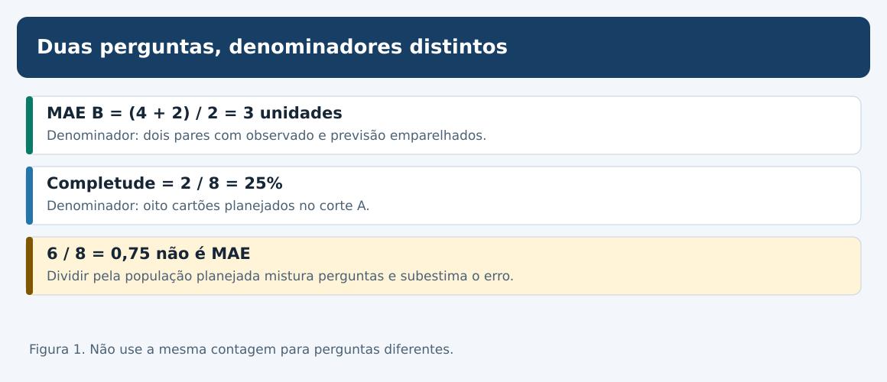
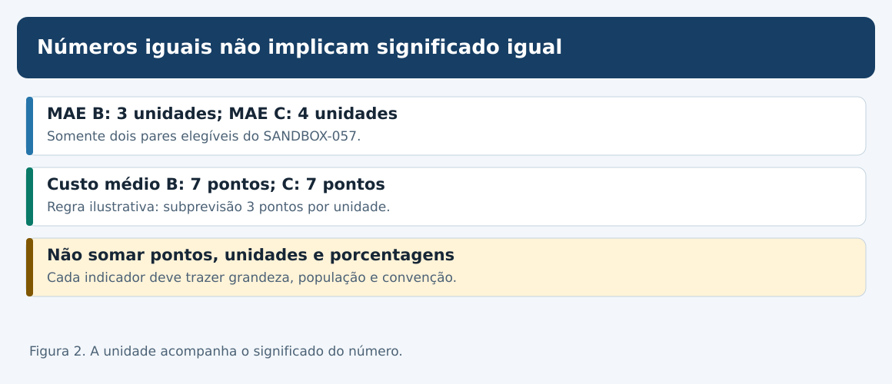
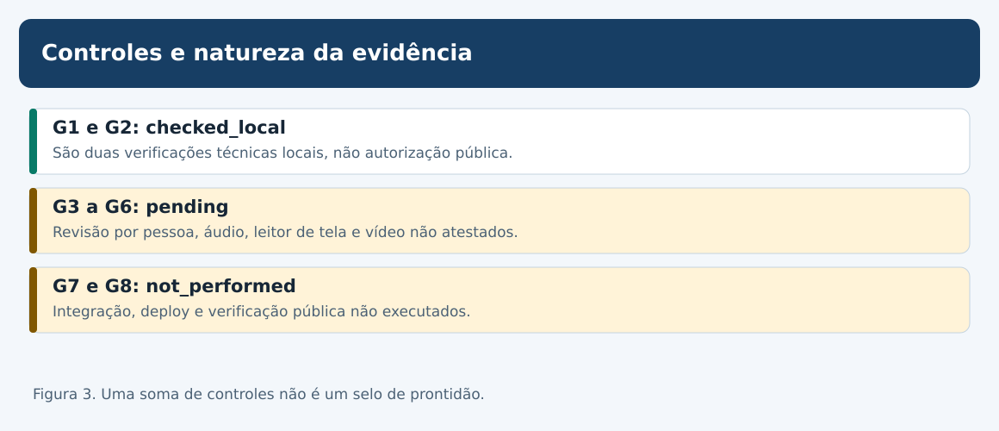
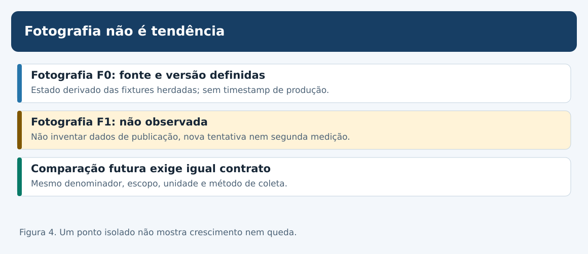
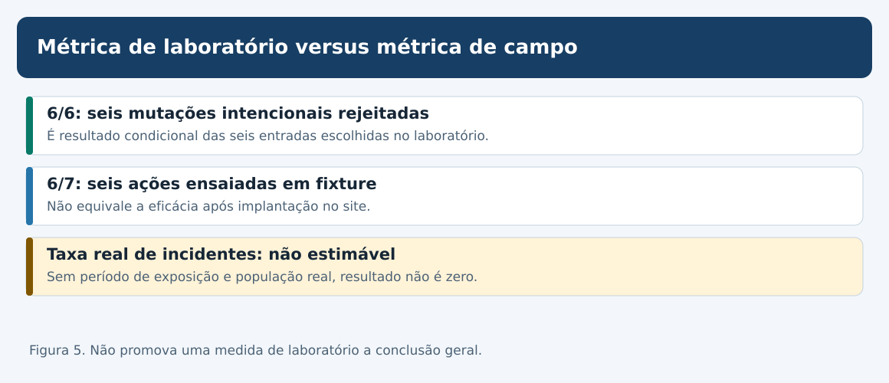
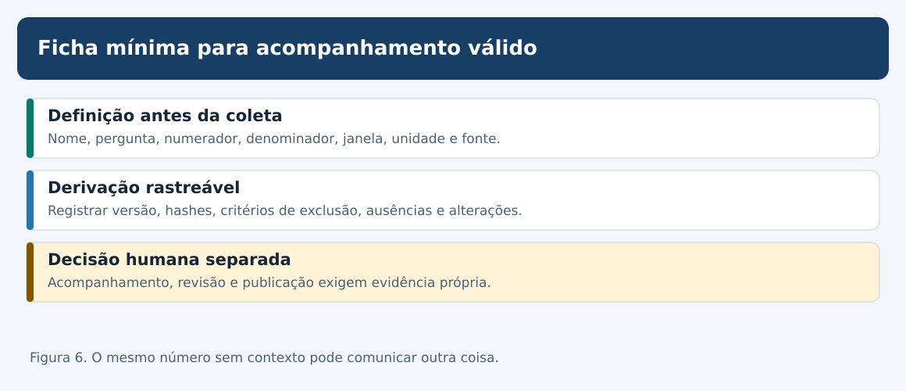

# MAT-EST-065 — Indicadores de qualidade editorial: definição operacional, linhas de base e acompanhamento sem métricas ilusórias

**Matéria:** Matemática. **Unidade:** Estatística — ponte universitária. **Nível:** 6. **Anterior:** MAT-EST-064. **Próximo tópico editorial proposto:** MAT-EST-066. **Origem:** aula, figuras e todas as questões autorais; zero questões oficiais. **Estado de estudo individual:** não iniciado; não houve tentativa registrada. **Estado da produção:** concluída em pacote local; não publicada.

**Blocos de estudo sugeridos:** A, conceito e denominadores (25 a 50 minutos); B, qualidade de medidas e linhas de base (25 a 50 minutos); C, interpretação, relatório e exercícios (25 a 50 minutos). É permitido parar e recuperar a divisão, a média e a porcentagem antes de avançar.

## 1. Objetivo e pré-requisitos

Ao estudar e resolver os exercícios, você deverá conseguir: definir um indicador pelo que efetivamente mede; separar população, corte temporal, numerador, denominador e unidade; calcular métricas somente sobre observações elegíveis; preservar valores não estimáveis como ausentes; distinguir resultado de teste local de qualidade em operação; criar uma linha de base auditável; identificar incentivos para maquiar indicadores; redigir um painel que não comunique certeza excessiva; indicar quais evidências faltam para monitorar o site de verdade.

**Pré-requisitos:** fração e porcentagem, média e erro absoluto; distinção entre observação e valor ausente (MAT-EST-047, 052 e 057); avaliação emparelhada e viés de seleção (MAT-EST-049 e 058); proveniência e auditoria (MAT-EST-053 e 054); testes de regressão e pendências (MAT-EST-060 a 064). Se MAE ainda for difícil, refazer primeiro a conta de quatro mais dois, divididos por dois.

**Importância nos exames:** porcentagens, médias, leitura de gráficos, escolha de denominadores e análise crítica de inferências têm transferência para ENEM e vestibulares. Governança de indicadores editoriais e metodologias de avaliação são aprofundamento de ponte universitária; não são atribuídas aqui a um edital específico sem comprovação. Todas as atividades são autorais, inclusive as de estilo vestibular.

## 2. Por que indicadores existem, e por que enganam

Uma equipe só consegue acompanhar uma atividade se formular perguntas precisas. “As aulas estão boas?” parece simples, mas mistura fatores diversos: correção do conteúdo, exercícios verificáveis, acessibilidade, aprovação humana, publicação e experiência real do estudante. Nenhum número isolado cobre todas essas dimensões.

Um **indicador** é uma regra de observação ou de cálculo que responde a uma pergunta delimitada. Sua **definição operacional** informa quais eventos contam, qual população está incluída, em que momento, qual fonte é usada, qual unidade aparece e como lidar com ausências e correções. Dois indicadores que mostram 25% podem significar coisas completamente distintas.

Neste capítulo, os dados são apenas os exemplos já existentes. Não há uma campanha real de mensuração, incidentes comprovados em produção ou usuários medidos. A fotografia inicial é uma **derivação didática local**, não o início de uma série temporal autenticada. A aplicação de acompanhamento a um site real exigiria eventos e verificações futuros.

## 3. A pergunta determina a fórmula

O SANDBOX-057 é um laboratório independente com oito cartões S01–S08. Apenas S01 e S02 são avaliáveis no corte A; os outros seis têm pendências. Para a referência B, os erros assinados são mais quatro e menos dois. Para o desafiante C, são mais três e menos cinco. O erro absoluto é a magnitude, sem o sinal.

\[\mathrm{MAE}_B=\frac{|+4|+|-2|}{2}=\frac{6}{2}=3\text{ unidades}.\]

**Leitura para voz:** o erro absoluto médio de B é quatro mais dois, dividido pelos dois pares avaliáveis: três unidades. O numerador é a soma das magnitudes de erro; o denominador é a quantidade de pares elegíveis com observado e previsão disponíveis no corte e na versão declarados.

\[\mathrm{Completude}=\frac{2\text{ pares avaliáveis}}{8\text{ cartões planejados}}=\frac14=25\%.\]

**Leitura para voz:** completude é dois dividido por oito, igual a um quarto ou vinte e cinco por cento. Aqui o denominador não é dois: são os oito cartões planejados. Completude é quantidade de material avaliável, não acerto ou precisão do modelo.

Se alguém dividir seis por oito e publicar 0,75 como erro absoluto médio de B, terá trocado o denominador; esse é precisamente o defeito artificial I01. A diferença para o resultado válido é 2,25 unidades; 0,75 é 75% inferior a três. Usar os seis pendentes como erros zero também produz distorção. Pendente não é zero.

**Figura 1.** Texto alternativo: o MAE de B usa seis unidades de erro e dois pares, resultando em três; completude usa dois avaliáveis entre oito planejados, resultando em 25%; seis dividido por oito não é MAE. **Observe:** a população muda com a pergunta. **Conclusão para áudio:** escolher o denominador é uma decisão de significado, não um detalhe de cálculo.

## 4. Unidades, sinais, custos e populações emparelhadas

Para C, o erro absoluto médio é três mais cinco, dividido por dois: **quatro unidades**. Assim, neste corte restrito, B tem MAE três e C quatro. A diferença dos erros absolutos de C menos B é menos um em S01 e mais três em S02; a média emparelhada é mais um. Nada disso representa uma inferência para séries futuras, pois existem apenas dois pares artificiais.

Uma regra decisória diferente cobra três pontos por unidade quando o erro é positivo, subprevisão, e um ponto por unidade quando é negativo, superprevisão. Podemos escrevê-la como:

\[C(e)=3\max(e,0)+\max(-e,0).\]

**Leitura:** custo de um erro é três vezes sua parte positiva mais o valor absoluto de sua parte negativa. Em B, o erro mais quatro custa doze pontos e o erro menos dois custa dois pontos; a média é sete pontos. Em C, mais três custa nove pontos e menos cinco custa cinco pontos; a média também é sete pontos. **Ponto de custo não é unidade observacional.** Empates de custo não significam empates de MAE nem equivalência generalizável.

| Medida do SANDBOX-057 | Cálculo | Resultado | População |
|---|---|---:|---|
| MAE B | (4 + 2) / 2 | 3 unidades | S01 e S02 |
| MAE C | (3 + 5) / 2 | 4 unidades | S01 e S02 |
| Custo B | (12 + 2) / 2 | 7 pontos | S01 e S02 |
| Custo C | (9 + 5) / 2 | 7 pontos | S01 e S02 |
| Completude | 2 / 8 | 25% | Oito cartões planejados |

**Síntese pronunciável:** são dois pares fictícios, seis pendências, erro médio de três unidades em B e quatro em C e custo médio empatado em sete pontos. O percentual de completude descreve a quantidade de casos avaliáveis, não a qualidade dos modelos.

**Figura 2.** Texto alternativo: erro médio usa unidades e custo médio usa pontos; modelos B e C diferem em MAE e empatam no custo fictício. **Observe:** toda comparação exige regra e unidade explícitas. **Conclusão por áudio:** números iguais podem medir coisas distintas.

## 5. O dicionário de indicadores e o tipo de evidência

Uma ficha útil contém: identificador, pergunta, população elegível, numerador, denominador, fórmula ou regra, unidade, fonte e versão, corte temporal, tratamento de nulos, limitações, frequência pretendida e interpretação permitida. O arquivo `indicadores/MAT-EST-065-dicionario-indicadores.json` conserva esses campos de maneira independente da interface.

A fotografia local proposta contém **onze registros K65-01 a K65-11**. Eles não formam uma nota de qualidade total. Exemplos: K65-01 é completude dois de oito; K65-06 registra rejeição correta das seis mutações artificiais I01 a I06 no conjunto de testes; K65-07 registra que seis das sete ações A64 possuem ensaio local de fixture; K65-08 mostra que apenas G1 e G2 estão checked_local entre oito controles de naturezas diferentes; K65-09 registra zero dos dez checks P01–P10 executados. Nenhum deles transforma testes locais em implantação confirmada.

O indicador de rejeição das mutações é seis de seis, ou cem por cento **dessas seis entradas selecionadas**. A frase “cem por cento de todos os incidentes serão detectados” é injustificada: não existe amostra representativa de incidentes de produção, nem exposição observada. Da mesma forma, seis ações testadas em fixtures entre sete propostas equivalem a 85,71% dessa contagem documental; não é eficácia operacional de 85,71%.

Os estados herdados são: G1 e G2, conferidos localmente; G3 a G6, pendentes de avaliação humana; G7 e G8, não executados. O plano P01 a P10 de pós-deploy também não foi executado. Não se pode criar uma média de prontidão apenas somando controles com impactos diferentes.

**Figura 3.** Texto alternativo: G1 e G2 têm evidência local; G3 a G6 estão pendentes; G7 e G8 não executados. **Observe:** os grupos exigem provas distintas. **Conclusão para áudio:** dois controles conferidos não autorizam dizer que a publicação está pronta.

## 6. Ausência, denominador zero e indicador não estimável

Não há pares emitidos e observados para a coorte proposta t26–t33. Portanto o MAE desse protocolo é **não estimável**; a fórmula exigiria dividir a soma de erros por zero pares. O símbolo nulo ou a expressão “não estimável” é adequado; **zero unidades é incorreto**, pois indicaria previsões perfeitas que não aconteceram.

Também não há registros operacionais com população e período de exposição para calcular taxa de incidentes reais. Essa taxa permanece não estimável. Já P01–P10 possui dez verificações planejadas, todas não executadas; ali a razão de **execução documental** é zero dividido por dez, igual a zero por cento. O fato de um zero ser apropriado para execução e não para MAE futuro exemplifica por que cada indicador precisa de uma ficha.

Se uma fonte muda a definição de “avaliável”, o valor antigo não deve ser reescrito silenciosamente. Guarde a versão da regra e, se apropriado, gere uma nova série claramente identificada. Se os seis cartões pendentes forem resolvidos mais tarde, um recálculo precisará declarar versão, momento do corte e regras de inclusão; não substituirá retrospectivamente a fotografia anterior.

## 7. Linha de base versus acompanhamento temporal

**Linha de base** é a referência definida antes de comparar futuras medições. O arquivo `MAT-EST-065-fotografia-inicial.json` registra a fotografia didática F0, suas fontes e ressalvas; **não é uma série temporal de desempenho da plataforma**. A fotografia F1 ainda não existe. Para ser comparável, uma futura F1 deve usar a mesma definição, unidade, universo e fonte, ou declarar explicitamente as diferenças.

Exemplo de erro: se F0 seleciona dois pares avaliáveis e F1 contém apenas um caso fácil escolhido depois de conhecer seu resultado, a queda aparente de erro pode surgir da mudança da população. Outro erro é reduzir o número de relatórios auditados para elevar artificialmente uma taxa de conformidade. Um indicador mal usado incentiva otimizar a apresentação do número, em vez de melhorar o processo que ele deveria descrever.

Uma variação absoluta entre duas proporções é medida em **pontos percentuais**. Por exemplo, em uma simulação adicional e não observada, uma completude de 25% passando a 50% representa aumento de 25 pontos percentuais; em termos relativos, 50 dividido por 25 menos um é aumento de 100%. Essas contas demonstram notação, não um acontecimento no projeto.

**Figura 4.** Texto alternativo: há F0, fotografia local com regras declaradas, e não há F1 observada. **Observe:** uma medida isolada não determina tendência. **Conclusão por áudio:** comparação temporal só existe quando chegam novas evidências com regras compatíveis.

## 8. Medir processo sem inventar qualidade do produto

Indicadores de **entrada** descrevem volume e elegibilidade; indicadores de **processo** descrevem verificações feitas; indicadores de **saída** descrevem material gerado; indicadores de **resultado real** dependeriam de revisão humana, publicação servida e experiência de usuários. Essas quatro categorias não são intercambiáveis.

Um ZIP que passa no SHA-256 pode comprovar igualdade dos bytes comparados, não correção pedagógica. Um conjunto de seis mutações rejeitadas comprova comportamento do validador nas seis entradas, não uma taxa populacional. Um texto alternativo presente num SVG passa na inspeção de estrutura, mas ainda exige verificação humana de equivalência para pessoas que o escutam. A metodologia WCAG-EM, do W3C, estrutura avaliações com escopo, amostra representativa, teste e relatório; não substitui a avaliação pelo simples resultado de um verificador automático.

**Figura 5.** Texto alternativo: seis falhas artificiais rejeitadas, seis ações testadas localmente e taxa de incidentes reais ainda não estimável. **Observe:** os três indicadores não são sinônimos. **Conclusão para áudio:** uma taxa precisa declarar de que população seus casos vieram.

## 9. Como construir um painel verificável e um protocolo futuro

O painel mínimo terá colunas de código, pergunta, valor, unidade, numerador e denominador, fonte, recorte, tipo de evidência, estado de coleta e limitação. O relatório pode dizer: “No SANDBOX-057, dois de oito cartões são avaliáveis; sobre esses dois, os MAEs são três e quatro unidades. Seis das seis mutações sintéticas foram rejeitadas nos testes locais. Não existem dados para estimar sucesso de publicação nem MAE do protocolo sucessor.”

Para acompanhamento verdadeiro, definir antes: objeto de coleta, fonte autorizada, versão da aula e do código, instante da medição, regras de inclusão e exclusão, responsável real quando designado, método de revisão, periodicidade e circunstâncias de suspensão. Uma verificação não realizada fica pendente, e uma correção exige registro de versão; jamais se completa a tabela inventando uma assinatura.

As ações anteriores A64-01 a A64-06 continuam apenas testadas em fixtures. A64-07 permanece proposta, não executada. Nenhum campo G ou P é promovido nesta aula. O histórico MAT-EST-049-PROT-v1 permanece com cinco dos oito pares, MAE B 17,60, MAE C 8,36, custos médios B 51,20 e C 14,92, falha da guarda em t19 igual a 19,2, maior que dez, e ausência de promoção do desafiante. t23–t25 não têm observações ou emissões autenticadas; t26–t33 seguem apenas propostos. Não há inferência nova dessa série.

**Figura 6.** Texto alternativo: sequência de definição, fonte, corte, cálculo auditável, ressalvas e validação externa separada. **Observe:** nenhuma seta substitui evidência ainda inexistente. **Conclusão para áudio:** a qualidade do indicador depende da pergunta que responde e da rastreabilidade dos dados.

## 10. Erros frequentes, conexões e aplicações

Erros a evitar: anunciar média com denominador de completude; marcar nulo como zero; comparar grupos não emparelhados como se fossem os mesmos; mudar pesos de custo depois de ver os resultados; usar seis fixtures para estimar eficácia em produção; chamar duas verificações de oito de “25% de qualidade”; somar unidades e pontos; publicar porcentagem sem numerador ou população; construir uma falsa tendência de apenas uma fotografia; usar notas globais para ocultar falha de guarda; considerar cobertura automática de SVG prova de compreensão oral; declarar prontidão antes de G3–G8.

**Relações:** Matemática — frações, médias, funções por partes e razão entre grandezas; Língua Portuguesa e Redação — quantificadores e afirmações com escopo definido; Computação — testes, contratos, hashes e versões; metodologia científica — definição operacional, viés de seleção, replicação e validade externa. A regra geral é poder explicar o número em voz alta com sua população e limitação, não apenas mostrar um percentual vistoso.

## 11. Vídeo complementar e fontes

**Vídeo:** *Conformance Evaluation Overview*, W3C Web Accessibility Initiative (iniciativa de acessibilidade da Web). [Página oficial com vídeo e transcrição descritiva](https://www.w3.org/WAI/test-evaluate/conformance/wcag-em/). Idioma: inglês, com transcrição textual. **Duração:** não informada com segurança na página consultada; reprodução integral não realizada. **Quando assistir:** depois da seção 8. **Por que assistir:** mostra como escopo, seleção de amostras, avaliação e relatório antecedem alegações de conformidade. É complemento; todo o raciocínio da aula está escrito aqui.

**Leituras institucionais:** [WCAG-EM 2.0, publicada pelo W3C em 23 de julho de 2026](https://www.w3.org/TR/wcag-em-2/) — avaliação representativa e documentada. [Modelo de relatório de avaliação do W3C](https://www.w3.org/WAI/test-evaluate/report-template/) — descreve avaliação que combina métodos automáticos e manuais. [Monitoring Distributed Systems, livro de engenharia de confiabilidade do Google](https://sre.google/sre-book/monitoring-distributed-systems/) — princípios de monitoramento, painéis e sinais acionáveis. As definições K65 são **propostas autorais deste projeto**, não métricas oficiais prescritas por essas instituições. O vídeo foi identificado na página oficial, mas necessita de reprodução integral e conferência humana antes de publicação.

## 12. Atividades, devolutiva e síntese

As 36 atividades estão em `exercicios.md` e `exercicios.json`: dez de aprendizagem, dez de consolidação, dez contextualizadas em estilo vestibular e seis de reteste posterior. O gabarito e os motivos prováveis de erro estão exclusivamente em `gabarito-comentado.md` e `gabarito-comentado.json`. Tente antes de abrir a correção; produção editorial não constitui evidência de estudo pessoal.

**Resumo pronunciável:** um indicador é uma pergunta traduzida em regra. Para o MAE do SANDBOX-057, divida a soma dos erros por dois pares; para completude, divida dois por oito cartões. Informe unidade, escopo, versão e lacunas. Se o denominador dos pares futuros é zero, a média não é zero: ela não existe ainda. Seis de seis mutações rejeitadas são seis testes de laboratório, não cobertura universal. Uma linha de base só vira acompanhamento quando chegam novas fotografias comparáveis. A publicação depende de evidências adicionais, não de um painel vistoso.

**Revisão espaçada:** um, sete e trinta dias após uma tentativa real. Dia um: refazer MAE e completude. Dia sete: redigir a ficha de K65-06 e justificar o limite de generalização. Dia trinta: resolver o reteste, construir relatório com numeradores, denominadores e nulos e identificar quais controles continuam pendentes. Consolidar somente após evidência de explicação, resolução, aplicação e recuperação.

**Próximo passo editorial proposto, ainda não iniciado:** MAT-EST-066 — Revisão crítica e consolidação da unidade de avaliação temporal: integração de métricas, auditoria e transferência para problemas novos. Não pressupõe publicação nem estudo individual concluído.

**Limites de execução:** somente arquivos locais. Não houve sincronização com Google Drive/GitHub, integração no site, aprovação humana, reprodução integral do vídeo, teste de áudio no Edge, observações adicionais ou alteração do progresso individual.
