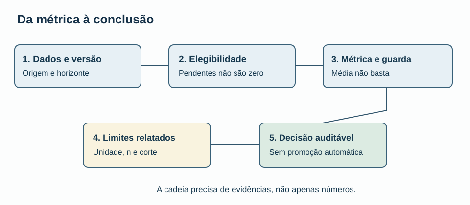
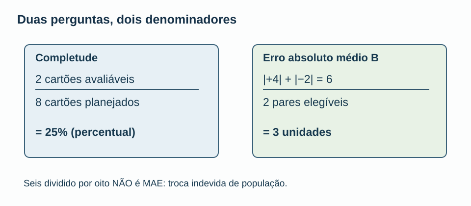
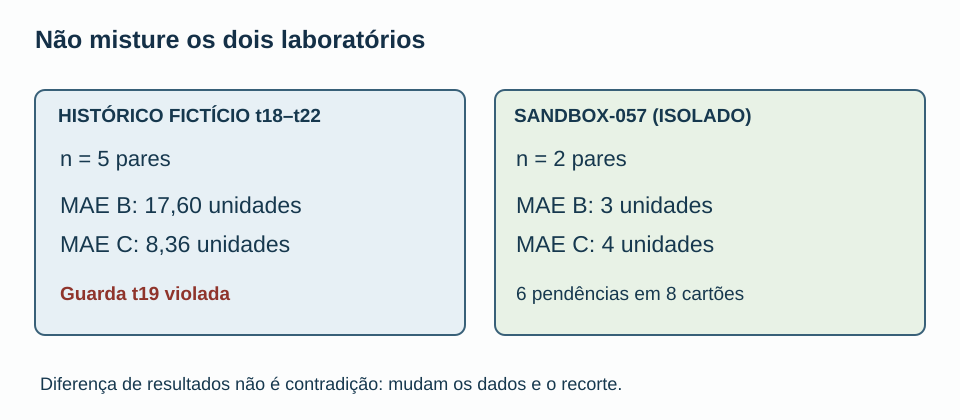
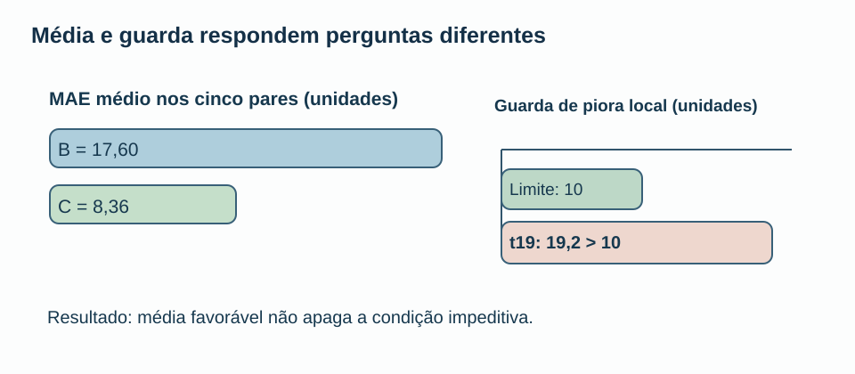
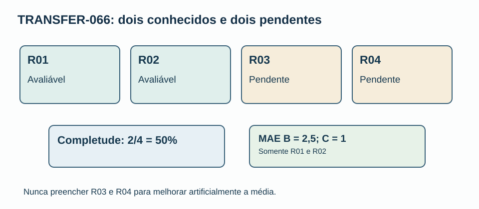
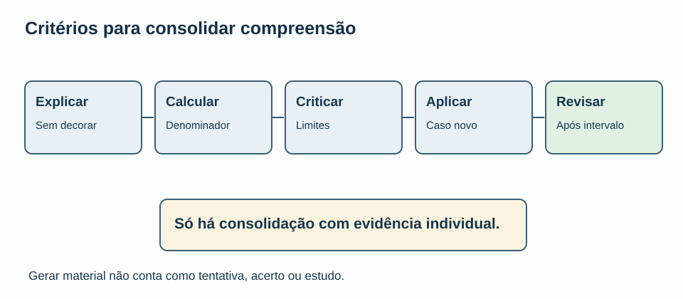

# MAT-EST-066 — Revisão crítica e consolidação da unidade de avaliação temporal: integração de métricas, auditoria e transferência para problemas novos

**Matéria:** Matemática. **Unidade:** Estatística — ponte universitária. **Nível:** 6. **Anterior:** MAT-EST-065. **Próximo tópico proposto:** MAT-EST-067. **Origem:** aula, visuais e 36 exercícios autorais; nenhuma questão oficial. **Produção editorial:** pacote local, não publicado. **Progresso individual:** não iniciado e sem tentativas registradas; o verbo “consolidação” no título descreve a proposta pedagógica, não atribui domínio ao estudante.

**Plano em blocos:** bloco A, reconstruir as fórmulas e a população (25 a 50 minutos); bloco B, crítica de evidência, risco e proveniência (25 a 50); bloco C, resolver problema novo, redigir e revisar (25 a 50). Pausar e recuperar fundamentos sempre que necessário.

## 1. Objetivo, pré-requisitos e pergunta central

Depois de estudar e tentar os exercícios, a meta é explicar a cadeia completa que liga uma previsão congelada ao relatório: população, data de origem, horizonte, versão do observado, erro com sinal, módulo, custo, agregação, limitações e decisão. Saberá distinguir dados ausentes de zero, justificar quais conclusões os exemplos permitem, verificar uma regra impeditiva e aplicar o método em outro contexto sem decorar respostas dos exemplos anteriores.

**Pré-requisitos:** fração, porcentagem, média, valor absoluto, subtração de números negativos, interpretação de gráfico e leitura de condição lógica. Referências de continuidade: MAT-EST-047 (resíduos e horizontes), 049 (comparação emparelhada e guarda), 052–054 (registro, vintage e auditoria), 057–059 (pendência, seleção, comunicação) e 060–065 (testes, governança e indicadores). Se a operação “seis dividido por dois” ainda não for confortável, resolva alguns exemplos pequenos antes deste bloco.

**Relevância para exames:** a leitura de gráficos, porcentagens, médias, amostras e validade de inferências transfere-se para exercícios autorais no estilo do Exame Nacional do Ensino Médio (ENEM) e vestibulares. Protocolos de monitoramento e auditoria de previsão são aprofundamento universitário; não são anunciados como obrigação de edital de nenhuma banca. As questões desta aula são todas autorais.

## 2. A integração: por que um número correto ainda pode induzir erro

Um indicador não é uma qualidade abstrata. É o resultado de uma pergunta, de uma população, de uma regra de inclusão e de uma fonte. A soma de erros pode estar matematicamente correta e o relatório ainda estar errado se trocar o denominador ou mesclar coortes que nunca foram comparáveis.

Na série histórica fictícia de t01 a t22, o protocolo MAT-EST-049-PROT-v1 contém cinco dos oito pares pretendidos, t18–t22. Há demonstrações editoriais, não operação externa autenticada. A comparação produziu MAE de B igual a 17,60 unidades e MAE de C igual a 8,36 unidades. O custo médio da regra fictícia foi 51,20 pontos para B e 14,92 para C. Entretanto, em t19 C teve piora local de 19,2 unidades contra limite dez. Portanto, o protocolo histórico não autoriza sua promoção. Essa é uma conjunção lógica: média favorável não suprime uma restrição previamente estabelecida.

Nenhuma observação t23–t25 foi autenticada. O sucessor MAT-EST-056-PROT-SUC-v1 é apenas proposta local para t26–t33 e não dispõe de pares avaliáveis. Seu MAE é **não estimável**, não zero. Esse cuidado impede que o leitor confunda ausência de resultado com precisão perfeita.

**Figura 1.** Texto alternativo: dados versionados levam à definição de elegibilidade, cálculo da métrica, conferência da guarda, relato de limites e decisão; uma falha na guarda bloqueia a promoção. **Observe:** uma conclusão depende de etapas anteriores. **Conclusão para áudio:** o caminho entre um dado e uma decisão precisa ser reconstituível e inclui condições além da média.

## 3. O denominador tem significado, não é uma formalidade

No exercício isolado SANDBOX-057, há oito cartões planejados, dois avaliáveis, S01 e S02, e seis pendências. Os erros assinados da referência B são mais quatro e menos dois; os de C são mais três e menos cinco. O erro é o observado menos o previsto. Um erro positivo significa subprevisão; um negativo significa superprevisão.

Escrevemos o erro absoluto médio por `MAE`, abreviação inglesa de *mean absolute error*:

\[\operatorname{MAE}=\frac{\sum_{i=1}^{n}|y_i-\widehat y_i|}{n}.\]

**Leitura pronunciável:** erro absoluto médio é a soma dos módulos das diferenças entre valor observado e valor previsto, dividida pela quantidade n de pares válidos. O módulo transforma sinais positivos e negativos em magnitudes sem sinal. A unidade do resultado é a unidade da variável prevista.

Para B no sandbox, `MAE_B = (4 + 2)/2 = 3 unidades`. Para C, `MAE_C = (3 + 5)/2 = 4 unidades`. O denominador é dois porque só dois pares foram avaliados. Já a **completude** é `2/8 = 25%`, dois cartões avaliáveis entre oito planejados. Dividir seis por oito e chamar o resultado 0,75 de MAE é o defeito sintético I01: uma conta aritmeticamente possível, mas estatisticamente sem significado para a pergunta.

**Figura 2.** Texto alternativo: à esquerda, completude é dois dividido por oito, 25%; à direita, MAE de B é seis dividido por dois, três unidades. **Observe:** as populações de referência são distintas. **Conclusão em áudio:** a fórmula só faz sentido quando denominador e unidade correspondem à pergunta.

A revisão da MAT-EST-065 também registrou onze fichas K65-01 a K65-11 e uma única fotografia didática F0. Uma fotografia não demonstra uma tendência mensal. Os itens sem dados futuros ou sem população de exposição devem continuar ausentes, e não ser convertidos em zeros.

## 4. Média com sinal, magnitude, custo e diferença emparelhada

A média assinada pode cancelar erros: para B, mais quatro e menos dois somam mais dois, cuja média é mais um. Isso NÃO corresponde ao MAE três. Quando custos dependem do sentido do erro, nem mesmo o MAE responde sozinho à pergunta decisória.

Nesta simulação, usa-se a função:

\[C(e)=3\max(e,0)+\max(-e,0).\]

**Leitura:** o custo de um erro positivo é três vezes seu valor; o custo de um erro negativo é uma vez sua magnitude. Em B, os custos são doze e dois pontos, com média de sete pontos. Em C, os custos são nove e cinco pontos, também com média sete. O empate em custo médio coexiste com MAE diferente. **Ponto de custo** é uma unidade convencional da regra inventada, não a unidade da demanda.

Uma comparação emparelhada conserva o mesmo alvo para B e C: a diferença dos módulos `C menos B` é menos um em S01 e mais três em S02. A média dessas diferenças é mais uma unidade. Essa medida continua limitada aos dois cartões conhecidos. Não se torna prova de superioridade geral de um modelo.

**Figura 3.** Texto alternativo: histórico t18–t22 reúne cinco pares, com MAE B 17,60 e C 8,36; sandbox isolado reúne dois pares, com MAE B três e C quatro. **Observe:** legendas, amostras e finalidades mudam. **Conclusão para áudio:** não existe contradição entre números de populações diferentes, mas é incorreto misturá-los.

## 5. Um resultado médio favorável pode coexistir com uma guarda violada

Uma regra de decisão pode exigir simultaneamente uma melhora média e que nenhuma piora individual supere um limite. No histórico, C teve MAE menor que B, mas em t19 a piora foi `19,2 > 10`, isto é, dezenove vírgula dois é maior que dez. O registro preserva a recusa de promoção sob MAT-EST-049-PROT-v1. Os cinco pares não devem ser convertidos em oito por preenchimento de lacunas.

Não há autorização para descartar t19 depois de observar o resultado, assim como não seria apropriado apagar S02 do sandbox para inverter a comparação. Um relatório responsável admite a média, o número de pares, a falha e a regra original.

**Figura 4.** Texto alternativo: média do histórico favorece C nos cinco pares, porém piora local em t19 é 19,2, acima do limite dez. **Observe:** são dois critérios distintos. **Conclusão por áudio:** a decisão histórica permanece não promover o desafiante conforme o protocolo antigo.

## 6. Versões e integridade: Z e V continuam isolados

No EXEMPLO-Z, a previsão congelada foi 29. A observação preliminar era 30 e a validada passou a 32. Os erros são, respectivamente, mais um e mais três. Não surgiram dois alvos distintos; uma mesma medição foi revisada. No EXEMPLO-V, as previsões congeladas eram B igual a 42 e C igual a 43. Com observado preliminar 40, os módulos são dois e três; com observado validado 44, tornam-se dois e um. A ordem das versões e a fonte precisam estar explícitas.

A conferência SHA-256 serve para detectar alteração de bytes entre versões de arquivo e cópias herdadas. Não atesta verdade externa, autoria humana, correção pedagógica, acessibilidade real, sucesso de deploy ou estado pessoal de aprendizagem. Os 23 arquivos controlados conservam seus hashes originais neste pacote.

Os controles de prontidão herdados seguem exatamente: G1 e G2 **checked_local**; G3 a G6 **pending**; G7 e G8 **not_performed**; P01–P10 não executados. Seis ações A64 foram testadas somente com fixtures, e A64-07 segue proposta. Esse painel documental não é uma nota única de qualidade.

## 7. Problema de transferência totalmente novo, sem contaminar os anteriores

Criamos **TRANSFER-066**, um exercício autoral completamente isolado, com quatro cartões fictícios R01–R04. Os dois últimos ficam pendentes sem observação e sem previsão registrada. Os dois conhecidos têm estes valores inventados:

| Cartão | Observado | Previsão B | Previsão C | Erro B | Erro C |
|---|---:|---:|---:|---:|---:|
| R01 | 50 | 48 | 51 | +2 | −1 |
| R02 | 40 | 43 | 39 | −3 | +1 |
| R03 | ausente | ausente | ausente | não estimável | não estimável |
| R04 | ausente | ausente | ausente | não estimável | não estimável |

**Síntese para áudio:** R01 e R02 são os únicos dois casos calculáveis. Em R01, B subpreviu duas unidades e C superpreviu uma. Em R02, B superpreviu três e C subpreviu uma. R03 e R04 não receberam resultados.

A completude é dois de quatro, **50%**. Para B, MAE é dois mais três, divididos por dois: **2,5 unidades**. Para C, um mais um, dividido por dois: **1 unidade**. Na regra de custo três para erro positivo e um para negativo, B custa seis e três pontos, com média **4,5 pontos**; C custa um e três pontos, com média **2 pontos**. As diferenças emparelhadas dos módulos C menos B são menos um e menos dois, com média menos **1,5 unidade**. Trata-se de demonstração com duas observações inventadas, sem inferência populacional ou decisão operacional.

**Figura 5.** Texto alternativo: R01 e R02 estão avaliáveis; R03 e R04 estão pendentes; completude cinquenta por cento, MAE B 2,5 e C uma unidade. **Observe:** há dois denominadores distintos para as duas perguntas. **Conclusão por áudio:** resolver um caso novo exige reaplicar o princípio, e não copiar números antigos.

Uma variação **hipotética, não observada**, propõe observado 60, B igual a 58 e C igual a 64 e guarda de piora de uma unidade. Os módulos seriam dois e quatro; a piora de C menos B seria dois, superior ao limite hipotético de um. Isso ensina a reavaliar um protocolo condicional sem fingir que o cenário aconteceu.

## 8. Como auditar uma frase de relatório

Considere a frase deliberadamente falha: “C foi aprovado, porque sua média é menor e a auditoria passou em cem por cento das mutações.” Ela falha por quatro motivos. Primeiro, omite o limite t19 do protocolo histórico. Segundo, confunde seis fixtures artificiais detectadas entre seis escolhidas com cobertura universal. Terceiro, ignora que o sucessor tem zero pares avaliáveis. Quarto, atribui aprovação humana sem registro.

Uma formulação fiel seria: “No exercício retrospectivo fictício t18–t22, C apresentou MAE 8,36, contra 17,60 de B, mas violou o limite local de dez em t19, com 19,2. Existem somente cinco dos oito pares previstos e não houve promoção sob o protocolo original. A rejeição das seis mutações sintéticas valida somente aqueles testes locais; revisão humana, publicação e acompanhamento futuro permanecem pendentes.”

**Checklist de evidência antes de qualquer frase pública:** explicitar escopo e finalidade; identificar fonte e versão; declarar origem/horizonte; registrar elegibilidade; recomputar média e custo com unidades; manter restrição prévia; informar tamanho e pendências; incluir hipótese necessária em qualquer limite condicional; oferecer gráfico acessível com dados e descrição longa; separar teste local de revisão humana e deploy; registrar decisão e possibilidade de correção. Nenhuma dessas etapas equivale, por si, a um ato externo realizado.

## 9. Erros comuns e conexões com outras matérias

Os erros mais comuns são confundir “não estimável” com zero; dividir o numerador do MAE pelos cartões planejados; transformar um teste de laboratório em taxa universal; misturar a série histórica com exercícios isolados; apagar uma versão preliminar; ajustar regras após ver resultados; inferir tendência de uma fotografia; chamar cenário de observação; anunciar aprovação sem evidência; trocar unidade de erro por pontos de custo; produzir gráficos cuja mensagem só pode ser compreendida pelas cores.

Em Biologia e Química, valores pendentes não são medições iguais a zero. Em História, versões e documentos datados exigem proveniência. Em Geografia, um mapa ou gráfico requer escala e unidade. Em Língua Portuguesa e Redação, uma conclusão deve conter base, ressalva e grau de certeza proporcionais às evidências. Em Computação, versões, hashes e testes automatizados tornam um procedimento reproduzível, mas não substituem o juízo humano.

## 10. Vídeo complementar e fontes de apoio

**Vídeo complementar verificado como página pública:** [How to spot a misleading graph — Lea Gaslowitz](https://www.youtube.com/watch?v=E91bGT9BjYk), canal **TED-Ed**, em inglês; duração aproximada de **4 minutos e 9 segundos**, conforme indicação pública de instituição acadêmica. Recomenda-se assistir após a seção 8 e observar como a escolha de escala, a seleção de períodos e a linguagem do gráfico alteram a percepção. Página e descrição do vídeo localizadas; a reprodução integral não foi efetuada neste ambiente. O vídeo apenas reforça a aula, não a substitui.

**Leituras de apoio:** [Previsão: Princípios e prática, terceira edição, OTexts, versão em português](https://otexts.com/fpppg/), e [Validação cruzada de séries temporais](https://otexts.com/fpp3/tscv.html), que explica por que cada treino temporal utiliza somente observações disponíveis antes do alvo. Para os visuais, [Imagens complexas, W3C Web Accessibility Initiative](https://www.w3.org/WAI/tutorials/images/complex/) orienta alternativa curta e descrição detalhada com os dados essenciais. As fórmulas dos exercícios e TRANSFER-066 são autorais deste projeto; não se atribuem a essas fontes.

## 11. Exercícios, gabarito, revisão e critério de domínio

O arquivo `exercicios.md` contém dez exercícios de aprendizagem, dez de consolidação, dez de transferência em estilo vestibular **todos autorais** e seis de reteste para momento posterior. O gabarito e as hipóteses de motivo do erro estão exclusivamente em `gabarito-comentado.md` e em JSON separado. Tente e registre suas respostas antes de consultar as soluções.

**Revisão espaçada:** agendar um, sete e trinta dias a partir da tentativa real, não da geração do pacote. Na primeira, refazer MAE, completude e custos em uma folha em branco. Na segunda, explicar t19, vintage e escopo sem consultar o texto. Na terceira, resolver o reteste e apresentar um relatório do TRANSFER-066 com população, unidades, dados ausentes e limites de conclusão.

**Critério para possível consolidação pessoal:** explicar a regra, executar corretamente contas básicas, justificar população e unidade, distinguir dado/hipótese, criticar uma afirmação exagerada, transferir o raciocínio para um problema novo e recuperar a ideia depois de intervalo. O sistema de progresso deve registrar evidência da tentativa e da revisão; o pacote editorial não altera o status individual.

**Figura 6.** Texto alternativo: cinco passos, explicar, calcular, criticar, aplicar em caso novo e revisar posteriormente; só evidência individual autoriza consolidação. **Observe:** a última etapa depende da prática. **Conclusão para áudio:** a existência desta aula não prova que alguém já aprendeu seu conteúdo.

**Resumo para ouvir:** escolher o denominador certo define a pergunta certa. No SANDBOX-057, dois entre oito medem completude de vinte e cinco por cento; somar magnitudes seis e dividir por dois mede MAE de três unidades para B. Valores pendentes são ausentes, não zeros. Em t19 houve piora local de dezenove vírgula dois acima do limite dez, apesar da média favorável a C. Hash e testes locais não são aprovação de publicação. O novo exercício TRANSFER-066 permite verificar se o raciocínio foi compreendido sem alterar a série principal.

## 12. Continuidade editorial e limites

**Próximo tópico proposto, não iniciado:** MAT-EST-067 — Transferência integradora da estatística temporal para decisões sob dados incompletos: leitura de evidências e exercícios inéditos. A formulação poderá ser ajustada mediante checkpoint canônico, sem reiniciar a trilha.

**Limites de execução:** arquivos criados localmente; não houve sincronização no Google Drive/GitHub, publicação no site, dados externos, autenticação de emissão prospectiva, aprovação humana, reprodução integral do vídeo, teste real de Ler em voz alta do Edge ou tentativa individual. Os estados G1–G8, P01–P10 e o protocolo histórico permanecem inalterados.
